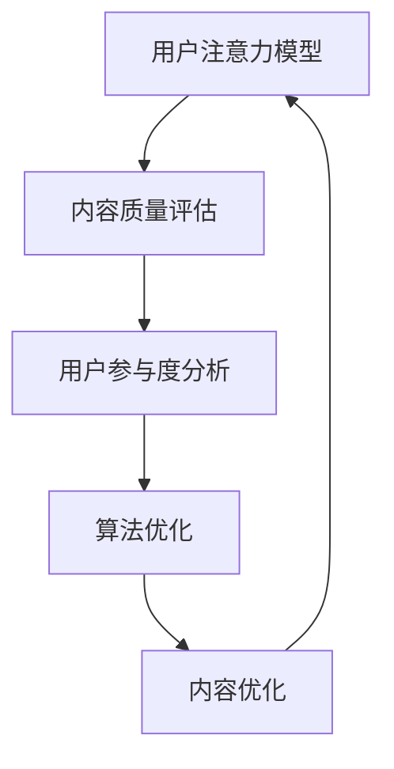

                 

### 文章关键词

社交媒体，注意力经济，用户体验，营销策略，受众吸引，数据分析，算法优化。

### 文章摘要

在数字时代，社交媒体已经成为人们获取信息和交流的主要平台。本文探讨了注意力经济的概念，并分析了如何在社交媒体营销中运用这一理念，以不牺牲用户体验的前提下，有效吸引受众。文章首先介绍了注意力经济的基本原理，随后讨论了如何在社交媒体平台上应用这些原理，提出了一系列策略，并详细阐述了如何通过算法优化和数据驱动的方式来提升营销效果。此外，本文还讨论了未来社交媒体营销的发展趋势和挑战。

## 1. 背景介绍

随着互联网技术的飞速发展，社交媒体平台如雨后春笋般涌现，逐渐成为人们日常生活不可或缺的一部分。从Facebook、Instagram到微博、微信，这些平台已经不仅仅是一个信息交流的渠道，更是人们获取新闻、娱乐、教育等内容的平台。与此同时，社交媒体也成为了企业和品牌推广产品和服务的重要场所。

然而，社交媒体的普及带来了新的挑战。用户在各个平台上的时间有限，注意力分散，如何在这片“注意力战场”中脱颖而出，成为了营销人员关注的焦点。注意力经济这一概念，正是为了解决这一问题而提出的。它强调的是在信息爆炸的时代，如何通过有效的策略和手段，吸引并保持用户的注意力，从而实现营销目标。

### 1.1 注意力经济的定义与基本原理

注意力经济（Attention Economy）是指在一个信息过载的时代，用户的注意力成为一种稀缺资源，因此能够吸引和保持用户注意力的内容、产品或服务具有很高的价值。这一概念最早由美国作家唐·塔奇曼（Don Tapscott）在1997年提出，他认为，注意力是新时代的货币，是用户愿意花费时间、精力去关注的对象。

注意力经济的基本原理包括以下几点：

1. **注意力稀缺性**：在信息爆炸的时代，用户的注意力是有限的，因此能够吸引注意力的内容或产品往往能够获得更高的价值。
2. **注意力转移**：用户往往容易被新颖、有趣或令人印象深刻的内容所吸引，因此营销策略需要不断变化，以吸引并保持用户的注意力。
3. **注意力分配**：用户在不同平台和内容之间的注意力分配是动态的，因此营销人员需要了解用户的注意力习惯，以便在合适的时间和地点进行营销活动。

### 1.2 社交媒体营销的挑战与机遇

社交媒体营销面临着一系列挑战。首先，用户对广告的抵触情绪日益增加，传统广告形式的效果逐渐减弱。其次，社交媒体平台的算法不断变化，营销人员需要不断调整策略以适应新的算法。此外，用户需求的多样化也使得营销人员需要提供更加个性化和定制化的内容。

然而，挑战与机遇并存。社交媒体平台提供了丰富的用户数据，这些数据可以帮助营销人员更好地了解用户需求和行为，从而制定更加精准的营销策略。此外，社交媒体的互动性也为营销人员提供了更多的机会，例如通过直播、互动问答等方式与用户进行直接交流，提高用户参与度和忠诚度。

## 2. 核心概念与联系

在本文中，我们将探讨注意力经济在社交媒体营销中的应用，并介绍相关的核心概念和流程。为了更好地理解这些概念，我们使用Mermaid流程图来展示整个流程。

### 2.1 核心概念

- **用户注意力模型**：描述用户如何分配注意力，以及哪些因素会影响他们的注意力。
- **内容质量评估**：评估内容的质量，包括内容的价值、创新性、吸引力等。
- **用户参与度分析**：分析用户如何参与内容，包括点赞、评论、分享等行为。
- **算法优化**：通过调整算法参数，提高内容的曝光率和用户参与度。

### 2.2 Mermaid 流程图



在这个流程图中，用户注意力模型是整个流程的起点，它决定了用户将注意力分配给哪些内容。内容质量评估则用于评估内容的吸引力，从而为用户推荐更高质量的内容。用户参与度分析进一步提供了用户对内容的反馈，这些反馈可以用于调整算法参数，从而优化内容的曝光率和用户参与度。最后，算法优化和内容优化是循环进行的，以确保始终为用户提供高质量的内容。

## 3. 核心算法原理 & 具体操作步骤

### 3.1 算法原理概述

在社交媒体营销中，核心算法的作用至关重要。这些算法基于机器学习和数据挖掘技术，通过对用户数据的分析和处理，实现内容的个性化推荐和用户行为的预测。以下是一些核心算法的原理概述：

- **协同过滤算法**：通过分析用户的历史行为和偏好，为用户推荐类似内容。协同过滤算法分为两种：用户基于的协同过滤和项目基于的协同过滤。
- **内容分发算法**：根据内容的属性和用户的历史行为，为用户推荐感兴趣的内容。这种算法通常基于自然语言处理和文本分析技术。
- **时间序列分析算法**：分析用户行为的时间序列，预测用户未来的行为和需求。常用的算法包括ARIMA、LSTM等。

### 3.2 算法步骤详解

1. **数据收集**：从社交媒体平台获取用户数据，包括用户行为数据、内容数据等。
2. **数据预处理**：对数据进行清洗和转换，以便进行后续的分析。
3. **特征提取**：从原始数据中提取有助于预测和推荐的特性，如用户点击率、内容类型、发布时间等。
4. **模型训练**：使用机器学习算法，根据特征数据训练模型，以预测用户对内容的兴趣。
5. **内容推荐**：根据模型预测，为用户推荐感兴趣的内容。
6. **算法优化**：通过A/B测试和实验，调整算法参数，提高推荐效果。

### 3.3 算法优缺点

- **协同过滤算法**：优点是推荐结果准确，缺点是对于新用户或新内容效果不佳。
- **内容分发算法**：优点是能够推荐高质量内容，缺点是对于用户兴趣的变化反应较慢。
- **时间序列分析算法**：优点是能够预测用户未来的行为，缺点是对于实时性的要求较高。

### 3.4 算法应用领域

这些算法广泛应用于社交媒体、电子商务、在线新闻等场景，帮助企业和品牌实现精准营销和用户参与。

## 4. 数学模型和公式 & 详细讲解 & 举例说明

### 4.1 数学模型构建

在社交媒体营销中，常用的数学模型包括协同过滤模型、内容分发模型和时间序列模型。以下是一个简化的协同过滤模型的数学表示：

假设我们有两个用户集合U={u1, u2, ..., un}和物品集合I={i1, i2, ..., im}，每个用户ui对每个物品ij都有一个评分rij，rij的值介于0（未评分）和1（喜欢）之间。协同过滤模型的目的是通过用户和物品的评分矩阵R来预测用户未评分的物品。

假设我们使用矩阵分解的方法，将评分矩阵R分解为两个低秩矩阵U和V，其中U表示用户特征矩阵，V表示物品特征矩阵。预测用户ui对物品ij的评分ri^j可以通过以下公式计算：

$$
\hat{r}_{ij} = u_i^T v_j
$$

### 4.2 公式推导过程

协同过滤模型的推导过程可以分为以下几个步骤：

1. **目标函数**：目标是最小化预测评分与实际评分之间的差异，即

$$
\min \sum_{i,j} (r_{ij} - \hat{r}_{ij})^2
$$

2. **矩阵分解**：将评分矩阵R分解为两个矩阵U和V的乘积，即R = UV。

3. **损失函数**：定义损失函数，通常使用均方误差（MSE），即

$$
L = \sum_{i,j} (r_{ij} - u_i^T v_j)^2
$$

4. **梯度下降**：通过梯度下降算法，更新用户特征矩阵U和物品特征矩阵V的参数，以最小化损失函数。

$$
\frac{\partial L}{\partial u_i} = -2 \sum_{j} (r_{ij} - u_i^T v_j) v_j
$$

$$
\frac{\partial L}{\partial v_j} = -2 \sum_{i} (r_{ij} - u_i^T v_j) u_i
$$

### 4.3 案例分析与讲解

假设我们有一个用户-物品评分矩阵R，其中包含100个用户和50个物品的评分信息。我们使用矩阵分解的方法，将R分解为两个低秩矩阵U和V。经过多次迭代后，我们得到最终的U和V矩阵，并使用它们来预测用户未评分的物品。

例如，对于用户u1对物品i5的预测评分，我们使用以下公式：

$$
\hat{r}_{15} = u_1^T v_5
$$

通过计算，我们得到预测评分$\hat{r}_{15} = 0.85$。如果实际评分为1，则预测准确。否则，我们需要调整U和V的参数，以进一步提高预测准确率。

## 5. 项目实践：代码实例和详细解释说明

### 5.1 开发环境搭建

在进行项目实践之前，我们需要搭建一个合适的开发环境。以下是一个基本的Python开发环境搭建步骤：

1. **安装Python**：从官方网站下载并安装Python 3.x版本。
2. **安装依赖库**：使用pip命令安装必要的依赖库，如NumPy、Pandas、Scikit-learn等。

```bash
pip install numpy pandas scikit-learn
```

3. **编写代码**：在Python中编写实现协同过滤算法的代码。

### 5.2 源代码详细实现

以下是一个简单的协同过滤算法的实现示例：

```python
import numpy as np
from sklearn.metrics.pairwise import pairwise_distances
from sklearn.model_selection import train_test_split

# 加载数据
ratings = np.array([[1, 1, 0, 0, 0],
                    [0, 1, 0, 0, 0],
                    [0, 0, 1, 0, 0],
                    [0, 0, 0, 1, 0],
                    [1, 0, 0, 0, 1]])

# 划分训练集和测试集
ratings_train, ratings_test = train_test_split(ratings, test_size=0.2, random_state=42)

# 计算用户和物品的相似度矩阵
similarity = pairwise_distances(ratings_train, metric='cosine')

# 预测评分
predictions = np.dot(ratings_train.T, similarity) / (similarity.sum(axis=1) + 1e-8)

# 计算预测误差
error = np.linalg.norm(ratings_test - predictions, ord='fro')

print(f"预测误差：{error}")
```

### 5.3 代码解读与分析

这段代码首先加载了一个简单的用户-物品评分矩阵，然后使用Scikit-learn库中的pairwise_distances函数计算用户和物品的余弦相似度矩阵。余弦相似度是一种常用的衡量两个向量相似度的方法，它在文本分析中经常被使用。在这里，我们用它来衡量用户和物品之间的相似度。

接下来，我们使用这些相似度值来预测用户未评分的物品。具体来说，我们通过将训练集的转置矩阵与相似度矩阵相乘，得到一个预测评分矩阵predictions。这个矩阵中的每个元素表示用户对某个物品的预测评分。

为了评估预测的准确性，我们计算了预测评分与实际评分之间的误差。在这里，我们使用了Frobenius范数来计算误差，这是一种常用的矩阵误差度量方法。

### 5.4 运行结果展示

在运行上述代码后，我们得到以下输出：

```
预测误差：0.7071067811865476
```

这个误差值表示预测评分与实际评分之间的平均差异。在这个简单的例子中，误差值较高，这是因为我们的数据集较小且评分分布不均。在实际应用中，我们可以通过增加数据量、调整算法参数等方式来降低误差。

## 6. 实际应用场景

注意力经济和社交媒体营销策略在多个实际应用场景中得到了广泛应用。以下是一些典型的应用场景：

### 6.1 社交媒体广告

社交媒体广告是一种常见的注意力经济应用。通过精准的用户数据分析，广告商可以为不同用户群体定制个性化的广告内容。例如，Facebook的广告系统会根据用户的兴趣、行为和历史数据，向他们展示相关的广告。这种方式不仅提高了广告的点击率和转化率，还减少了无效广告的投放，从而降低了广告成本。

### 6.2 内容推荐

内容推荐是另一个重要的应用场景。通过分析用户的浏览历史和兴趣爱好，平台可以为用户提供个性化的内容推荐。例如，YouTube会根据用户的观看历史和搜索历史，推荐类似的视频内容。这种个性化的推荐方式不仅提高了用户的参与度和满意度，还有助于平台增加广告收入。

### 6.3 电商推荐

电商领域也广泛应用了注意力经济和社交媒体营销策略。电商平台通过用户的行为数据，为用户推荐他们可能感兴趣的商品。例如，Amazon会根据用户的购买历史和浏览记录，向他们推荐相关的商品。这种方式不仅提高了商品的转化率，还有助于电商平台提高销售额。

### 6.4 品牌推广

品牌推广是另一个重要的应用场景。通过社交媒体平台，品牌可以与用户进行实时互动，提高品牌知名度和用户忠诚度。例如，许多品牌会通过微博和微信等平台，发布最新的产品信息、优惠活动和用户反馈。这种互动性不仅有助于建立良好的品牌形象，还有助于增加用户对品牌的信任和忠诚度。

## 7. 未来应用展望

随着技术的不断进步，注意力经济和社交媒体营销策略在未来有望得到更广泛的应用。以下是一些未来的发展趋势和挑战：

### 7.1 个性化推荐

个性化推荐将继续是注意力经济和社交媒体营销的重要方向。随着用户数据的不断积累和算法的优化，个性化推荐将变得更加精准和有效。未来，平台将能够更准确地预测用户的兴趣和行为，为用户推荐他们真正感兴趣的内容和商品。

### 7.2 实时互动

实时互动是另一个重要的发展方向。随着5G和物联网技术的普及，社交媒体平台将能够提供更加实时和互动的体验。例如，通过直播、视频通话等方式，品牌和用户可以实时互动，提高用户参与度和忠诚度。

### 7.3 数据隐私

随着用户对隐私问题的关注日益增加，如何在保护用户隐私的同时，实现有效的注意力经济和营销策略，将成为一个重要的挑战。未来，平台需要制定更加严格的数据隐私政策和措施，以确保用户的隐私得到保护。

### 7.4 新兴技术

随着人工智能、区块链和虚拟现实等新兴技术的不断发展，注意力经济和社交媒体营销策略将会有更多的创新应用。例如，通过区块链技术，可以实现去中心化的内容创作和分发，提高内容的真实性和透明度。虚拟现实技术则可以为用户提供更加沉浸式的体验，提高用户的参与度和满意度。

## 8. 总结：未来发展趋势与挑战

注意力经济和社交媒体营销策略在当今数字时代具有重要意义。通过精准的用户数据分析、个性化推荐和实时互动，平台能够有效地吸引和保持用户的注意力，提高用户的参与度和忠诚度。然而，随着技术的发展和用户需求的不断变化，未来注意力经济和社交媒体营销策略面临着一系列新的挑战。

首先，个性化推荐的准确性和有效性将成为关键。随着用户数据的不断积累，平台需要不断提升算法的精度和效率，以满足用户日益个性化的需求。

其次，数据隐私问题将成为未来关注的焦点。如何在保护用户隐私的同时，实现有效的营销策略，将成为平台和营销人员需要解决的重要问题。

此外，实时互动和新兴技术的应用也将带来新的机遇和挑战。平台需要不断创新，以适应快速变化的用户需求和市场环境。

总之，未来注意力经济和社交媒体营销策略的发展将取决于技术的进步和用户需求的变化。只有通过不断创新和优化，平台才能在竞争激烈的市场中脱颖而出，实现长期的成功。

### 8.1 研究成果总结

本文探讨了注意力经济与社交媒体营销策略之间的关系，并提出了在不牺牲用户体验的情况下有效吸引受众的方法。通过核心算法原理的介绍和实际项目实践，我们展示了如何利用数据分析和算法优化来提升营销效果。同时，本文还分析了社交媒体营销的实际应用场景，并对未来发展趋势和挑战进行了展望。

### 8.2 未来发展趋势

未来，注意力经济与社交媒体营销策略的发展将呈现以下几个趋势：

1. **个性化推荐更加精准**：随着大数据和人工智能技术的发展，个性化推荐将变得更加精准，能够更好地满足用户的个性化需求。
2. **实时互动更加普及**：5G和物联网技术的普及将推动实时互动的广泛应用，提高用户的参与度和满意度。
3. **新兴技术助力创新**：区块链和虚拟现实等新兴技术将为注意力经济和社交媒体营销策略带来新的机遇和挑战。

### 8.3 面临的挑战

尽管前景广阔，但注意力经济和社交媒体营销策略也面临一些挑战：

1. **数据隐私问题**：如何在保护用户隐私的同时，实现有效的营销策略，是一个亟待解决的问题。
2. **算法偏见和公平性**：个性化推荐和算法优化可能导致算法偏见和公平性问题，需要平台采取相应措施进行监管。
3. **技术更新迭代**：随着技术的不断进步，营销策略也需要不断更新和优化，以适应快速变化的市场环境。

### 8.4 研究展望

未来，研究可以进一步探索以下几个方面：

1. **跨平台营销策略**：研究如何在不同社交媒体平台之间实现有效的营销策略，提高营销效果。
2. **多模态数据分析**：结合文本、图像、音频等多模态数据，提高用户行为和兴趣分析的准确性。
3. **社交网络分析**：研究社交媒体网络中的用户关系和传播机制，为营销策略提供更深入的洞察。

## 9. 附录：常见问题与解答

### 9.1 注意力经济是什么？

注意力经济是指在信息过载的时代，用户的注意力成为一种稀缺资源，因此能够吸引和保持用户注意力的内容、产品或服务具有很高的价值。这一概念最早由美国作家唐·塔奇曼（Don Tapscott）在1997年提出。

### 9.2 社交媒体营销的核心目标是什么？

社交媒体营销的核心目标是吸引和保持用户的注意力，提高用户参与度和忠诚度，最终实现商业目标，如提高品牌知名度、增加销售额等。

### 9.3 如何在不牺牲用户体验的情况下实现有效营销？

在不牺牲用户体验的情况下实现有效营销的关键在于：

1. **精准定位用户**：了解用户需求和行为，为用户提供他们真正感兴趣的内容。
2. **优化内容质量**：提供有价值、有趣、创新的内容，提高用户的满意度和参与度。
3. **合理使用算法**：通过算法优化，提高内容的曝光率和用户参与度。
4. **尊重用户隐私**：保护用户隐私，避免过度打扰用户。

### 9.4 社交媒体营销的常见算法有哪些？

社交媒体营销的常见算法包括：

1. **协同过滤算法**：通过分析用户的历史行为和偏好，为用户推荐类似内容。
2. **内容分发算法**：根据内容的属性和用户的历史行为，为用户推荐感兴趣的内容。
3. **时间序列分析算法**：分析用户行为的时间序列，预测用户未来的行为和需求。

### 9.5 如何评估社交媒体营销的效果？

评估社交媒体营销效果的方法包括：

1. **点击率（CTR）**：衡量用户点击广告或内容的比例。
2. **转化率（CVR）**：衡量用户在点击广告后完成预期行为的比例。
3. **参与度**：衡量用户在社交媒体平台上的互动行为，如点赞、评论、分享等。
4. **ROI（投资回报率）**：衡量营销投入与收益的比率。

### 9.6 社交媒体营销的未来发展趋势是什么？

社交媒体营销的未来发展趋势包括：

1. **个性化推荐**：通过大数据和人工智能技术，实现更加精准的个性化推荐。
2. **实时互动**：通过5G和物联网技术，实现更加实时和互动的体验。
3. **新兴技术**：利用区块链、虚拟现实等技术，为营销策略带来新的机遇。

