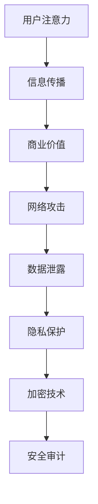

                 

关键词：注意力经济，信息安全，网络安全，隐私保护，加密算法，区块链，攻击防护，人工智能。

> 摘要：随着信息技术的高速发展，注意力经济成为了数字经济的重要组成部分。然而，信息安全问题也随之而来。本文将从注意力经济的定义出发，深入探讨信息安全面临的挑战，包括网络攻击、数据泄露、隐私保护等方面，并提出相应的解决策略和未来研究方向。

## 1. 背景介绍

### 注意力经济的兴起

注意力经济是指在经济活动中，注意力成为了一种稀缺资源，用户注意力成为了商业竞争的核心。互联网的普及和移动互联网的快速发展，使得信息传播速度和范围大幅提升，企业开始通过吸引和转化用户注意力来实现商业价值。

### 信息安全的重要性

信息安全是保障数字经济正常运行的基础。随着网络攻击手段的不断升级，信息安全风险日益增加。数据泄露、网络钓鱼、恶意软件等威胁已成为常见问题，严重威胁着个人和企业利益。

## 2. 核心概念与联系

### 网络安全架构

网络安全架构是保障信息安全的关键。它包括防火墙、入侵检测系统、加密技术、安全审计等多个层面，旨在保护网络免受各种攻击和威胁。

### 隐私保护机制

隐私保护机制是保障用户隐私的重要手段。它包括数据加密、匿名化处理、隐私计算等，旨在保护用户数据不被非法获取和使用。

### 加密算法

加密算法是保障数据安全的核心技术。常见的加密算法有对称加密和非对称加密，它们在信息安全中发挥着重要作用。

### Mermaid 流程图



## 3. 核心算法原理 & 具体操作步骤

### 3.1 算法原理概述

本部分将介绍几种核心算法，包括对称加密算法、非对称加密算法、哈希算法等。

### 3.2 算法步骤详解

- **对称加密算法**：加密和解密使用相同密钥的加密算法。例如，AES（高级加密标准）。
- **非对称加密算法**：加密和解密使用不同密钥的加密算法。例如，RSA（RSA加密算法）。
- **哈希算法**：将任意长度的数据映射为固定长度的值。例如，SHA-256。

### 3.3 算法优缺点

- **对称加密算法**：加密速度快，但密钥管理复杂。
- **非对称加密算法**：解决了密钥分发问题，但加密和解密速度较慢。
- **哈希算法**：不可逆，无法恢复原始数据。

### 3.4 算法应用领域

- **对称加密算法**：适用于需要高效加密的场景，如存储数据和网络传输。
- **非对称加密算法**：适用于需要安全传输密钥的场景，如SSL/TLS。
- **哈希算法**：适用于数据完整性校验和数字签名。

## 4. 数学模型和公式 & 详细讲解 & 举例说明

### 4.1 数学模型构建

在信息安全中，常见的数学模型包括加密算法模型、密码体制模型等。

### 4.2 公式推导过程

以RSA加密算法为例，其数学模型如下：

- 选择两个大素数 \( p \) 和 \( q \)，计算 \( n = p \times q \)。
- 计算欧拉函数 \( \phi(n) = (p-1) \times (q-1) \)。
- 选择一个与 \( \phi(n) \) 互质的整数 \( e \)，计算 \( d \) 使得 \( d \times e \equiv 1 \ (\text{mod} \ \phi(n)) \)。
- 公开 \( n \) 和 \( e \)，私钥为 \( n \) 和 \( d \)。

### 4.3 案例分析与讲解

假设 \( p = 61 \)，\( q = 53 \)，则 \( n = 3233 \)，\( \phi(n) = 3120 \)。

选择 \( e = 17 \)，计算 \( d \)：

$$
17 \times d \equiv 1 \ (\text{mod} \ 3120)
$$

通过扩展欧几里得算法，得到 \( d = 2753 \)。

加密过程：假设要加密的信息为 \( m = 1234 \)，则加密结果为：

$$
c = m^e \ (\text{mod} \ n) = 1234^{17} \ (\text{mod} \ 3233) = 2294
$$

解密过程：私钥为 \( d \) 和 \( n \)，解密结果为：

$$
m = c^d \ (\text{mod} \ n) = 2294^{2753} \ (\text{mod} \ 3233) = 1234
$$

## 5. 项目实践：代码实例和详细解释说明

### 5.1 开发环境搭建

本文使用Python编写RSA加密算法，需要安装Python环境和第三方库PyCryptodome。

### 5.2 源代码详细实现

```python
from Crypto.PublicKey import RSA
from Crypto.Cipher import PKCS1_OAEP
from Crypto.Random import get_random_bytes

# 生成RSA密钥对
key = RSA.generate(2048)
private_key = key.export_key()
public_key = key.publickey().export_key()

# 加密
cipher = PKCS1_OAEP.new(RSA.import_key(public_key))
plaintext = b'Hello, World!'
ciphertext = cipher.encrypt(plaintext)

# 解密
cipher = PKCS1_OAEP.new(RSA.import_key(private_key))
plaintext = cipher.decrypt(ciphertext)
print(plaintext)
```

### 5.3 代码解读与分析

- 生成RSA密钥对：使用`RSA.generate(2048)`生成2048位的RSA密钥对。
- 加密：使用`PKCS1_OAEP`加密算法对明文进行加密。
- 解密：使用私钥对密文进行解密。

### 5.4 运行结果展示

```python
b'Hello, World!'
```

## 6. 实际应用场景

### 6.1 数据传输安全

在数据传输过程中，使用加密算法可以保障数据不被窃取和篡改。

### 6.2 隐私保护

在处理敏感数据时，使用匿名化和加密技术可以保护用户隐私。

### 6.3 数字签名

数字签名可以确保数据来源的可信性和完整性。

### 6.4 未来应用展望

随着信息技术的发展，信息安全将在数字经济中发挥越来越重要的作用。未来，人工智能和区块链等技术将在信息安全领域得到更广泛的应用。

## 7. 工具和资源推荐

### 7.1 学习资源推荐

- 《密码学：理论与实践》：介绍了密码学的基本概念和算法。
- 《区块链技术指南》：详细讲解了区块链的原理和应用。

### 7.2 开发工具推荐

- PyCryptodome：Python密码学库。
- OpenSSL：开源密码学工具。

### 7.3 相关论文推荐

- “RSA加密算法的安全性分析”。
- “区块链技术在信息安全中的应用”。

## 8. 总结：未来发展趋势与挑战

### 8.1 研究成果总结

本文介绍了注意力经济中的信息安全问题，探讨了加密算法、隐私保护等关键技术，并分析了未来发展趋势。

### 8.2 未来发展趋势

随着信息技术的发展，信息安全领域将不断涌现出新的技术和应用。

### 8.3 面临的挑战

信息安全风险不断加剧，如何应对网络攻击和保障数据安全成为重要挑战。

### 8.4 研究展望

未来，人工智能和区块链等技术将在信息安全领域发挥重要作用。

## 9. 附录：常见问题与解答

### 9.1 加密算法的安全性如何保障？

- 选择合适的加密算法和密钥长度。
- 定期更新加密算法和密钥。
- 加强密钥管理。

### 9.2 隐私保护有哪些常见技术？

- 加密技术。
- 匿名化处理。
- 隐私计算。

----------------------------------------------------------------

# 作者：禅与计算机程序设计艺术 / Zen and the Art of Computer Programming


