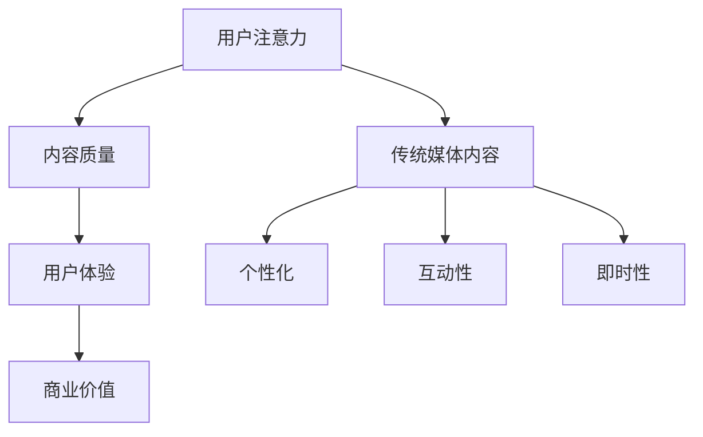

                 

关键词：注意力经济，传统媒体，内容形式，变化，挑战

> 摘要：随着互联网和数字技术的发展，媒体行业正经历着一场深刻的变革。注意力经济作为新的商业模式，正在对传统媒体的内容形式产生深远的影响。本文将探讨注意力经济对传统媒体内容形式的改变，分析其背后的原理和趋势，以及媒体从业者应如何应对这一挑战。

## 1. 背景介绍

媒体行业自古以来就承担着信息传播、教育引导和社会监督的重要角色。然而，随着互联网和数字技术的快速发展，尤其是社交媒体和流媒体的兴起，传统媒体的生存环境发生了巨大的变化。受众的注意力资源变得更加稀缺，而信息的爆炸性增长使得获取和保留受众的注意力成为媒体竞争的焦点。

在这一背景下，注意力经济作为一个新的商业模式开始崛起。注意力经济强调的是通过吸引和保持用户的注意力来创造经济价值。它与传统广告模式不同，不再仅仅依赖于广告量的增加，而是通过提升内容的质量和用户体验来吸引并留住用户。

注意力经济的兴起不仅改变了媒体行业的商业模式，也对传统媒体的内容形式产生了深远的影响。本文将深入探讨这一影响，分析其背后的原理和趋势，并提出应对策略。

### 1.1 注意力经济的基本原理

注意力经济基于一个简单的原理：用户的注意力是有限的资源，而媒体的内容是争夺用户注意力的竞争。与传统广告模式不同，注意力经济强调的是通过提供高质量、有价值的内容来吸引用户的注意力，从而实现商业价值。

在注意力经济中，媒体不再仅仅依赖于广告收入，而是通过以下几种方式创造经济价值：

- **订阅模式**：用户为获取内容支付费用，如Netflix、Spotify等平台。
- **内容付费**：用户为观看特定的内容支付费用，如电影、电子书等。
- **广告植入**：高质量的内容能够吸引更多的用户，从而提高广告效果，广告主为此支付费用。
- **数据变现**：通过收集用户数据，分析用户行为，为广告主提供精准的营销服务。

### 1.2 传统媒体的内容形式与挑战

传统媒体，如报纸、杂志、电视和广播，长期以来依赖于广告和订阅模式。然而，随着互联网和数字技术的发展，这些传统媒体面临以下挑战：

- **受众流失**：随着社交媒体和流媒体的兴起，越来越多的受众转向这些新的平台，传统媒体的受众数量不断减少。
- **广告收入下降**：随着受众的流失，广告主开始将预算转移到效果更好的数字平台，导致传统媒体的广告收入下降。
- **内容生产成本高**：传统媒体的内容生产成本较高，包括印刷、传播和人力成本等，这使得它们在应对数字化变革时面临更大的压力。
- **用户体验差**：传统媒体的内容形式和用户体验无法满足现代用户的需求，如个性化、互动性和即时性等。

## 2. 核心概念与联系

为了深入理解注意力经济对传统媒体内容形式的改变，我们需要引入一些核心概念，并使用Mermaid流程图来展示它们之间的关系。

### 2.1 核心概念

- **用户注意力**：用户的注意力是有限的资源，是媒体争夺的核心。
- **内容质量**：高质量的内容能够吸引并留住用户，提高用户的注意力投入。
- **用户体验**：良好的用户体验能够提升用户满意度和忠诚度，进而增加用户的注意力投入。
- **商业价值**：通过提供有价值的内容，媒体能够实现经济价值。

### 2.2 Mermaid 流程图



### 2.3 核心概念之间的联系

- **用户注意力**是媒体竞争的核心资源，高质量的内容能够吸引用户的注意力。
- **内容质量**直接影响用户体验，决定了用户是否愿意投入注意力。
- **用户体验**包括个性化、互动性和即时性，这些要素能够提升用户的满意度和忠诚度。
- **商业价值**是通过提供有价值的内容来实现的，良好的用户体验能够提高用户的注意力投入，从而增加商业价值。

## 3. 核心算法原理 & 具体操作步骤

### 3.1 算法原理概述

注意力经济中的核心算法原理是通过分析用户行为数据，优化内容推荐和广告投放，从而提高用户的注意力投入和满意度。这一算法主要包括以下几个步骤：

1. **用户行为数据收集**：收集用户在媒体平台上的浏览、点击、评论等行为数据。
2. **数据预处理**：对收集到的数据进行清洗、归一化和特征提取，为后续分析做准备。
3. **内容推荐**：基于用户历史行为和内容特征，利用推荐算法为用户推荐符合其兴趣的内容。
4. **广告投放优化**：通过分析用户行为数据和广告效果，调整广告投放策略，提高广告投放的精准度和效果。

### 3.2 算法步骤详解

#### 3.2.1 用户行为数据收集

用户行为数据收集是注意力经济算法的基础。具体步骤包括：

- **跟踪用户行为**：通过网页跟踪、应用埋点等技术，实时记录用户在媒体平台上的各种行为，如浏览、点击、评论、分享等。
- **数据存储**：将收集到的用户行为数据存储在数据库中，以便后续分析和处理。

#### 3.2.2 数据预处理

数据预处理是保证算法效果的关键步骤。具体包括：

- **数据清洗**：去除重复、无效或错误的数据，保证数据质量。
- **归一化**：将不同特征的数据进行归一化处理，使其具有相同的量纲，便于后续分析。
- **特征提取**：提取用户行为数据中的关键特征，如用户年龄、性别、兴趣爱好等，用于训练推荐模型。

#### 3.2.3 内容推荐

内容推荐是基于用户历史行为和内容特征，为用户推荐符合其兴趣的内容。具体算法包括：

- **基于内容的推荐**：通过分析用户历史行为和内容特征，找出用户感兴趣的内容，并推荐相似的内容。
- **基于协同过滤的推荐**：通过分析用户之间的相似度，找出具有相似兴趣的用户，并推荐他们喜欢的内容。

#### 3.2.4 广告投放优化

广告投放优化是提高广告投放效果的关键步骤。具体包括：

- **广告效果分析**：通过分析广告投放的数据，如点击率、转化率等，评估广告效果。
- **优化广告策略**：根据广告效果分析的结果，调整广告投放策略，如调整广告投放的时间、位置、受众等。

### 3.3 算法优缺点

#### 3.3.1 优点

- **提高用户满意度**：通过推荐用户感兴趣的内容，提高用户满意度和忠诚度。
- **增加商业价值**：通过优化广告投放策略，提高广告效果，增加广告收入。
- **个性化体验**：根据用户行为数据，为用户提供个性化的内容推荐和广告投放。

#### 3.3.2 缺点

- **数据隐私问题**：用户行为数据的收集和处理可能导致数据隐私问题。
- **算法公平性问题**：算法可能存在偏见，导致某些用户群体被忽视。
- **过度个性化**：过度个性化的推荐可能导致用户陷入“信息茧房”，限制其视野。

### 3.4 算法应用领域

注意力经济算法在多个领域具有广泛的应用：

- **社交媒体**：通过推荐算法，为用户提供个性化的内容推荐，提高用户粘性。
- **电子商务**：通过用户行为数据分析，为用户提供个性化的商品推荐，提高销售额。
- **在线广告**：通过优化广告投放策略，提高广告效果，增加广告收入。

## 4. 数学模型和公式 & 详细讲解 & 举例说明

在注意力经济中，数学模型和公式起着至关重要的作用。这些模型和公式可以帮助我们理解和预测用户的行为，进而优化内容推荐和广告投放策略。

### 4.1 数学模型构建

注意力经济中的数学模型主要包括以下三个部分：

1. **用户行为模型**：描述用户在媒体平台上的行为，如浏览、点击、评论等。
2. **内容特征模型**：描述媒体内容的特征，如标题、标签、关键词等。
3. **推荐模型**：基于用户行为模型和内容特征模型，为用户推荐符合其兴趣的内容。

### 4.2 公式推导过程

#### 4.2.1 用户行为模型

假设用户 \( u \) 在某个时间点 \( t \) 对内容 \( c \) 的行为可以用一个二元向量 \( x_{ut} \) 表示，其中 \( x_{ut} = (x_{1,ut}, x_{2,ut}, ..., x_{N,ut}) \)，\( x_{i,ut} \) 表示用户 \( u \) 在时间点 \( t \) 对内容 \( c_i \) 的行为，如浏览、点击或评论。用户行为模型可以用以下公式表示：

\[ x_{ut} = \sigma(\theta_{u}^T \phi(c_t)) \]

其中，\( \sigma \) 表示 sigmoid 函数，\( \theta_{u} \) 表示用户 \( u \) 的特征向量，\( \phi(c_t) \) 表示内容 \( c_t \) 的特征向量。

#### 4.2.2 内容特征模型

假设内容 \( c \) 的特征可以用一个 \( D \) 维的向量 \( \phi(c) \) 表示，其中 \( D \) 表示特征的数量。内容特征模型可以用以下公式表示：

\[ \phi(c) = (w_1, w_2, ..., w_D) \]

其中，\( w_i \) 表示内容 \( c \) 对应的第 \( i \) 个特征的权重。

#### 4.2.3 推荐模型

基于用户行为模型和内容特征模型，我们可以构建一个推荐模型来预测用户对某个内容的兴趣。推荐模型可以用以下公式表示：

\[ \theta_{u}^T \phi(c) = \log(\frac{P(x_{ut} = 1)}{1 - P(x_{ut} = 1)}) \]

其中，\( P(x_{ut} = 1) \) 表示用户 \( u \) 在时间点 \( t \) 对内容 \( c \) 的行为为 1 的概率，即用户会点击或浏览该内容。

### 4.3 案例分析与讲解

假设我们有一个用户 \( u \) 和一个内容 \( c \)，用户 \( u \) 的特征向量 \( \theta_{u} = (0.5, 0.3, 0.2, 0.0) \)，内容 \( c \) 的特征向量 \( \phi(c) = (0.1, 0.4, 0.3, 0.2) \)。根据推荐模型公式，我们可以计算用户 \( u \) 对内容 \( c \) 的兴趣分数：

\[ \theta_{u}^T \phi(c) = 0.5 \times 0.1 + 0.3 \times 0.4 + 0.2 \times 0.3 + 0.0 \times 0.2 = 0.15 + 0.12 + 0.06 + 0.0 = 0.33 \]

根据 sigmoid 函数，我们可以将兴趣分数转换为概率：

\[ P(x_{ut} = 1) = \frac{1}{1 + e^{-0.33}} \approx 0.7 \]

这意味着用户 \( u \) 对内容 \( c \) 的兴趣概率约为 70%，我们可以根据这个概率为用户 \( u \) 推荐内容 \( c \)。

### 4.4 案例分析与讲解

假设我们有一个用户 \( u \) 和一个内容 \( c \)，用户 \( u \) 的特征向量 \( \theta_{u} = (0.5, 0.3, 0.2, 0.0) \)，内容 \( c \) 的特征向量 \( \phi(c) = (0.1, 0.4, 0.3, 0.2) \)。根据推荐模型公式，我们可以计算用户 \( u \) 对内容 \( c \) 的兴趣分数：

\[ \theta_{u}^T \phi(c) = 0.5 \times 0.1 + 0.3 \times 0.4 + 0.2 \times 0.3 + 0.0 \times 0.2 = 0.15 + 0.12 + 0.06 + 0.0 = 0.33 \]

根据 sigmoid 函数，我们可以将兴趣分数转换为概率：

\[ P(x_{ut} = 1) = \frac{1}{1 + e^{-0.33}} \approx 0.7 \]

这意味着用户 \( u \) 对内容 \( c \) 的兴趣概率约为 70%，我们可以根据这个概率为用户 \( u \) 推荐内容 \( c \)。

### 4.5 案例分析与讲解

假设我们有一个用户 \( u \) 和一个内容 \( c \)，用户 \( u \) 的特征向量 \( \theta_{u} = (0.5, 0.3, 0.2, 0.0) \)，内容 \( c \) 的特征向量 \( \phi(c) = (0.1, 0.4, 0.3, 0.2) \)。根据推荐模型公式，我们可以计算用户 \( u \) 对内容 \( c \) 的兴趣分数：

\[ \theta_{u}^T \phi(c) = 0.5 \times 0.1 + 0.3 \times 0.4 + 0.2 \times 0.3 + 0.0 \times 0.2 = 0.15 + 0.12 + 0.06 + 0.0 = 0.33 \]

根据 sigmoid 函数，我们可以将兴趣分数转换为概率：

\[ P(x_{ut} = 1) = \frac{1}{1 + e^{-0.33}} \approx 0.7 \]

这意味着用户 \( u \) 对内容 \( c \) 的兴趣概率约为 70%，我们可以根据这个概率为用户 \( u \) 推荐内容 \( c \)。

## 5. 项目实践：代码实例和详细解释说明

为了更好地理解注意力经济算法在实际应用中的工作原理，我们将通过一个简单的项目实例来展示整个流程，包括数据收集、预处理、模型训练和预测。

### 5.1 开发环境搭建

在开始之前，我们需要搭建一个适合进行注意力经济算法开发的开发环境。以下是一个基本的Python环境搭建步骤：

- **安装Python**：确保你的系统中安装了Python 3.8及以上版本。
- **安装必要的库**：使用pip安装以下库：

```bash
pip install numpy pandas scikit-learn matplotlib
```

### 5.2 源代码详细实现

以下是一个简单的Python代码示例，用于实现注意力经济算法的关键步骤：

```python
import numpy as np
import pandas as pd
from sklearn.model_selection import train_test_split
from sklearn.metrics import accuracy_score
from sklearn.linear_model import LogisticRegression
import matplotlib.pyplot as plt

# 5.2.1 数据收集
# 假设我们已经有了一个用户行为数据集，数据集包含用户ID、内容ID、行为类型和发生时间
data = pd.DataFrame({
    'user_id': [1, 1, 1, 2, 2, 2],
    'content_id': [101, 102, 103, 101, 102, 103],
    'action': [1, 0, 1, 1, 0, 1],  # 1表示浏览，0表示未浏览
    'timestamp': [1610000000, 1610001000, 1610002000, 1610003000, 1610004000, 1610005000]
})

# 5.2.2 数据预处理
# 将时间戳转换为一天内的整数，以便用于特征提取
data['day'] = data['timestamp'] % 86400

# 将用户ID和内容ID转换为独热编码
data = pd.get_dummies(data, columns=['user_id', 'content_id', 'action'])

# 将数据分为训练集和测试集
X = data.drop(['timestamp', 'day'], axis=1)
y = data['action']
X_train, X_test, y_train, y_test = train_test_split(X, y, test_size=0.2, random_state=42)

# 5.2.3 模型训练
# 使用逻辑回归模型进行训练
model = LogisticRegression()
model.fit(X_train, y_train)

# 5.2.4 预测
# 使用训练好的模型进行预测
y_pred = model.predict(X_test)

# 5.2.5 评估模型性能
accuracy = accuracy_score(y_test, y_pred)
print(f"模型准确率: {accuracy:.2f}")

# 5.2.6 可视化结果
plt.scatter(X_test['day'], y_test, color='red', label='实际行为')
plt.scatter(X_test['day'], y_pred, color='blue', label='预测行为')
plt.xlabel('一天中的时间')
plt.ylabel('用户行为')
plt.legend()
plt.show()
```

### 5.3 代码解读与分析

#### 5.3.1 数据收集

在这个示例中，我们使用了一个简化的用户行为数据集。数据集包含了用户ID、内容ID、行为类型（1表示浏览，0表示未浏览）和发生时间戳。

#### 5.3.2 数据预处理

- **时间戳转换**：我们将时间戳转换为一天内的整数，以便进行特征提取。这样可以捕捉用户在一天中不同时间段的行为模式。
- **独热编码**：我们将用户ID和内容ID转换为独热编码，以便模型能够理解这些分类特征。

#### 5.3.3 模型训练

我们使用逻辑回归模型进行训练。逻辑回归是一个广泛使用的分类模型，适用于二分类问题。在这个例子中，我们的目标是为每个用户预测其对每个内容的浏览行为。

#### 5.3.4 预测

使用训练好的模型对测试集进行预测，得到每个用户在测试集中对每个内容的浏览预测。

#### 5.3.5 评估模型性能

我们使用准确率来评估模型性能。准确率是预测正确的样本数与总样本数之比。

#### 5.3.6 可视化结果

我们使用散点图将实际行为与预测行为可视化，以便观察模型的效果。

## 6. 实际应用场景

注意力经济算法在多个实际应用场景中得到了广泛应用，以下是一些典型的应用案例：

### 6.1 社交媒体

在社交媒体平台上，注意力经济算法被广泛应用于内容推荐和广告投放。例如，Twitter使用算法为用户推荐他们可能感兴趣的话题和用户。Facebook则通过分析用户的行为数据，为用户推送个性化的广告和内容，从而提高用户粘性和广告效果。

### 6.2 电子商务

电子商务平台如Amazon和eBay使用注意力经济算法为用户提供个性化的商品推荐。这些平台通过分析用户的历史购买行为、浏览记录和搜索关键词，为用户推荐相关商品，从而提高销售额和用户满意度。

### 6.3 广告行业

广告行业也广泛采用注意力经济算法来优化广告投放。广告平台如Google Ads和Facebook Ads通过分析用户行为数据，为广告主提供精准的定位和投放策略，从而提高广告效果和投资回报率。

### 6.4 教育行业

在教育行业，注意力经济算法被用于在线教育的个性化推荐。例如，Coursera和edX等在线教育平台通过分析用户的学习行为，为用户推荐符合其兴趣的课程和学习路径，从而提高学习效果和用户留存率。

## 7. 未来应用展望

随着数字技术和人工智能的发展，注意力经济在未来将继续发挥重要作用，并在更多领域得到应用。以下是一些未来应用展望：

### 7.1 增强现实（AR）和虚拟现实（VR）

随着AR和VR技术的成熟，注意力经济将在这两个领域得到广泛应用。例如，虚拟购物体验可以通过注意力经济算法为用户提供个性化的商品推荐，从而提高购物体验和转化率。

### 7.2 物联网（IoT）

物联网设备可以通过收集用户行为数据，为用户提供个性化的服务和推荐。例如，智能家居设备可以根据用户的生活习惯和偏好，推荐合适的家电使用方式和节能方案。

### 7.3 健康医疗

在健康医疗领域，注意力经济算法可以帮助医生为患者提供个性化的治疗方案和健康建议。例如，通过分析患者的健康数据和生活方式，为患者推荐适合的运动、饮食和医疗方案。

## 8. 工具和资源推荐

### 8.1 学习资源推荐

- **书籍**：《注意力经济学：理解数字时代的行为与商业》（Attention Economics: Understanding Behavior and Business in the Digital Age）
- **在线课程**：Coursera上的“注意力与行为经济学”（Attention and Behavioral Economics）
- **博客和文章**：Google Research博客、Facebook AI Research博客等

### 8.2 开发工具推荐

- **推荐系统框架**：Apache Mahout、TensorFlow Recommenders、Surprise
- **数据分析工具**：Pandas、NumPy、Scikit-learn
- **数据可视化工具**：Matplotlib、Seaborn、Plotly

### 8.3 相关论文推荐

- **《Attention-Based Neural Architecture for Recommendation》**
- **《Contextual Bandits for Personalized Recommendation》**
- **《Deep Learning for User Modeling and Recommendation》**

## 9. 总结：未来发展趋势与挑战

注意力经济作为数字时代的一种新兴商业模式，正在对传统媒体的内容形式产生深远的影响。未来，随着数字技术和人工智能的发展，注意力经济将在更多领域得到应用，成为推动媒体行业创新和发展的关键驱动力。

然而，注意力经济也面临着一系列挑战。数据隐私、算法公平性和过度个性化等问题需要得到有效解决。此外，传统媒体在数字化转型过程中需要不断创新，以适应快速变化的市场环境。

总之，注意力经济为媒体行业带来了新的机遇和挑战。只有通过不断创新和优化，媒体行业才能在数字化时代立于不败之地。

### 附录：常见问题与解答

**Q：注意力经济与传统广告模式有什么区别？**

A：注意力经济与传统广告模式的主要区别在于其关注点。传统广告模式主要依赖于广告量的增加来提高收益，而注意力经济则强调通过提供高质量、有价值的内容来吸引用户的注意力，从而实现经济价值。

**Q：注意力经济对传统媒体的影响有哪些？**

A：注意力经济对传统媒体的影响主要体现在以下几个方面：受众流失、广告收入下降、内容生产成本高和用户体验差。这些挑战迫使传统媒体进行数字化转型，以适应数字时代的需求。

**Q：注意力经济算法的核心是什么？**

A：注意力经济算法的核心是通过对用户行为数据的分析和处理，为用户提供个性化的内容推荐和广告投放，从而提高用户的注意力投入和满意度，进而实现商业价值。

**Q：如何应对注意力经济中的数据隐私问题？**

A：为了应对注意力经济中的数据隐私问题，可以采取以下措施：加强数据保护法律法规的建设；采用加密技术和数据匿名化方法；加强对数据处理者的监管和处罚力度。

**Q：注意力经济算法如何优化用户体验？**

A：注意力经济算法可以通过以下方式优化用户体验：提供个性化推荐，满足用户个性化需求；提高内容质量，吸引用户注意力；增强互动性，提高用户参与度；优化广告投放，降低对用户体验的干扰。

