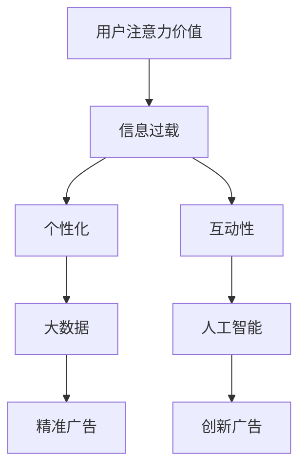

                 

### 1. 背景介绍

在当今的信息时代，注意力经济已成为推动商业发展和创新的重要力量。注意力经济，即通过获取用户的注意力来创造价值的经济模式，正逐渐取代传统的广告模式。在这种经济模式下，用户注意力成为稀缺资源，如何有效地抓住用户的注意力成为广告创意的关键。传统广告创意往往依赖于大量投入和大规模曝光，而在注意力经济时代，这种模式面临着新的挑战和机遇。

注意力经济背后的核心概念是用户注意力价值的最大化。在互联网和社交媒体的普及下，用户每天面对的信息量爆炸性增长，他们的注意力被分散到各种内容中。因此，广告创意必须更加精准、创新和引人入胜，才能在短时间内抓住用户的注意力，并使其产生共鸣。此外，随着人工智能和大数据技术的进步，广告创意可以更加个性化，满足不同用户的需求。

本文旨在探讨注意力经济对传统广告创意的新要求，分析其背后的技术原理、算法模型、数学公式，并通过实际项目实践和未来应用展望，为广告创意提供新的思路和方法。具体包括以下内容：

- 背景介绍
- 核心概念与联系
- 核心算法原理与操作步骤
- 数学模型与公式详解
- 项目实践：代码实例与解读
- 实际应用场景
- 未来应用展望
- 工具和资源推荐
- 总结：未来发展趋势与挑战
- 附录：常见问题与解答

通过这些内容的探讨，我们希望为广告创意提供一种全新的视角，帮助广告从业者更好地应对注意力经济带来的变革。

## 2. 核心概念与联系

在讨论注意力经济对传统广告创意的新要求之前，我们需要了解一些核心概念，这些概念构成了注意力经济的基础，并对广告创意产生深远影响。

### 用户注意力价值

用户注意力价值是注意力经济中的核心概念，它指的是用户在特定时间内对某种内容或广告的专注程度。用户注意力价值的高低直接影响广告效果，因此，提高用户注意力价值成为广告创意的关键目标。在传统广告中，广告主通常依赖大量投放来提高曝光率，而在注意力经济中，更加注重的是如何通过精准和创意来提高用户的有效注意力。

### 信息过载

信息过载是指用户在日常生活中接收到的信息数量超出了其处理能力。在互联网时代，信息过载现象愈发严重，用户每天面对海量的信息，这导致他们的注意力逐渐分散。对于广告主来说，如何在信息过载的环境中脱颖而出，抓住用户的注意力，成为一大挑战。

### 个性化

个性化是注意力经济中的另一重要概念，它指的是根据用户的兴趣、行为和需求，提供定制化的内容和广告。通过大数据和人工智能技术，广告主可以收集和分析用户数据，实现广告的个性化推送，从而提高用户注意力和广告效果。

### 互动性

互动性是指用户与广告内容之间的互动程度。在传统广告中，用户与广告的互动性较低，而在注意力经济中，互动性成为提高用户注意力的关键因素。通过社交媒体、互动广告和虚拟现实等技术，广告主可以增强用户与广告之间的互动，提高用户参与度和注意力。

### Mermaid 流程图

为了更直观地展示核心概念之间的联系，我们可以使用 Mermaid 流程图来表示。以下是注意力经济中的核心概念及其关系的流程图：



通过这个流程图，我们可以清晰地看到，用户注意力价值是核心，信息过载和个性化是影响用户注意力的关键因素，而大数据和人工智能则为提高用户注意力提供了技术支持，从而实现精准和创新的广告创意。

### 结论

核心概念与联系的分析为我们提供了对注意力经济的深入理解，这些概念相互关联，共同构成了注意力经济的理论基础。在接下来的部分，我们将进一步探讨注意力经济对传统广告创意的具体影响，以及如何利用这些核心概念来创造更有效的广告创意。

## 3. 核心算法原理与操作步骤

在注意力经济时代，传统广告创意需要借助先进的算法原理来提高用户的注意力。本节将详细介绍一种基于深度学习的注意力机制算法，以及其具体的操作步骤。

### 3.1 算法原理概述

注意力机制是一种在信息处理过程中模拟人类注意力的算法，通过动态地调整不同信息点的权重，使得模型能够自动关注重要信息，从而提高整体性能。在广告创意中，注意力机制可以帮助广告主自动识别和提取用户感兴趣的内容，从而实现个性化推荐。

### 3.2 算法步骤详解

#### 步骤1：数据收集与预处理

首先，我们需要收集大量的用户行为数据，包括用户的浏览历史、搜索记录、购买偏好等。这些数据可以通过各种渠道获取，如网站日志、问卷调查、第三方数据平台等。在数据收集完成后，进行数据清洗和预处理，确保数据的质量和一致性。

#### 步骤2：特征提取

接下来，我们需要对预处理后的数据进行特征提取。特征提取的目的是将原始数据转换为模型可以处理的向量形式。常用的特征提取方法包括词袋模型、TF-IDF、词嵌入等。词嵌入是一种将文本转换为向量表示的方法，常用的词嵌入模型有Word2Vec、GloVe等。

#### 步骤3：构建注意力模型

构建注意力模型是核心步骤。我们选择一种基于循环神经网络（RNN）的注意力模型，如长短期记忆网络（LSTM）或门控循环单元（GRU）。在模型中，每个时间步的输入数据会通过一个注意力权重函数，将不同时间步的输入数据赋予不同的权重。

#### 步骤4：训练模型

使用预处理后的数据集训练注意力模型。在训练过程中，模型会根据损失函数自动调整权重参数，使其能够更好地预测用户兴趣。常用的损失函数有均方误差（MSE）和交叉熵损失（Cross-Entropy Loss）。

#### 步骤5：模型评估与优化

在模型训练完成后，我们需要对模型进行评估和优化。评估指标可以选用准确率、召回率、F1分数等。通过交叉验证和超参数调整，优化模型的性能。

#### 步骤6：个性化推荐

最后，使用训练好的注意力模型进行个性化推荐。根据用户的行为特征，模型会自动提取用户感兴趣的内容，并生成个性化的广告推荐。

### 3.3 算法优缺点

#### 优点

- **个性化**：注意力模型可以根据用户兴趣自动调整推荐内容，提高个性化推荐效果。
- **动态调整**：注意力权重函数能够实时调整不同信息的权重，使得模型能够动态适应用户行为变化。
- **高效率**：注意力机制有助于提高模型处理信息的效率，减少冗余信息的计算。

#### 缺点

- **计算复杂度**：注意力机制增加了模型的计算复杂度，可能会导致训练和推理速度变慢。
- **数据需求**：需要大量的用户行为数据进行训练，数据收集和处理成本较高。
- **过拟合**：如果训练数据不足或特征提取不够准确，模型可能会出现过拟合现象。

### 3.4 算法应用领域

注意力机制在广告创意中的应用非常广泛，包括但不限于以下领域：

- **个性化推荐**：根据用户行为特征和兴趣，自动生成个性化的广告推荐。
- **内容分类**：对大量文本和图像内容进行分类和筛选，提高信息检索效率。
- **情感分析**：分析用户评论和反馈，了解用户情感倾向，为产品改进提供依据。

通过以上对注意力机制算法的详细描述，我们可以看到，注意力机制为广告创意提供了强大的技术支持。在接下来的部分，我们将进一步探讨数学模型和公式，为广告创意提供更深入的理论基础。

## 4. 数学模型与公式详解

在注意力经济时代，数学模型和公式在广告创意中扮演着至关重要的角色。本节将详细介绍用于广告创意的几种关键数学模型和公式，并解释其推导过程和具体应用。

### 4.1 数学模型构建

#### 4.1.1 贝叶斯网络

贝叶斯网络是一种概率图模型，用于表示变量之间的依赖关系。在广告创意中，贝叶斯网络可以帮助我们理解和预测用户行为。以下是一个简单的贝叶斯网络模型：

\[ P(A, B, C) = P(A) \cdot P(B|A) \cdot P(C|B) \]

其中，\( P(A) \)表示事件A发生的概率，\( P(B|A) \)表示在事件A发生的条件下，事件B发生的条件概率，\( P(C|B) \)表示在事件B发生的条件下，事件C发生的条件概率。

#### 4.1.2 概率生成模型

概率生成模型，如生成对抗网络（GAN），在广告创意中用于生成高质量的内容。GAN由生成器和判别器组成，生成器试图生成逼真的数据，而判别器则判断数据是真实还是生成的。以下是一个GAN的基本公式：

\[ G(z) = \text{Generator}(z) \]
\[ D(x) = \text{Discriminator}(x) \]

其中，\( z \)是从先验分布中抽取的噪声，\( x \)是真实数据，\( G(z) \)是生成器生成的数据，\( D(x) \)是判别器对真实数据的判断。

### 4.2 公式推导过程

#### 4.2.1 贝叶斯推理

贝叶斯推理是一种基于贝叶斯定理的概率推理方法。假设我们有两个事件A和B，已知条件概率\( P(B|A) \)和\( P(A) \)，我们可以推导出\( P(A|B) \)：

\[ P(A|B) = \frac{P(B|A) \cdot P(A)}{P(B)} \]

其中，\( P(B) \)可以通过全概率公式计算：

\[ P(B) = P(B|A) \cdot P(A) + P(B|\neg A) \cdot P(\neg A) \]

#### 4.2.2 GAN 的优化过程

在GAN中，生成器和判别器的优化目标是最大化判别器的损失函数。生成器的损失函数是判别器错误分类的损失，判别器的损失函数是生成器和真实数据之间的差异。以下是GAN的优化过程：

\[ \min_G \max_D V(D, G) = \mathbb{E}_{x \sim p_{data}(x)} [D(x)] + \mathbb{E}_{z \sim p_z(z)} [D(G(z))] \]

其中，\( V(D, G) \)是生成器和判别器的联合损失函数，\( x \)是真实数据，\( z \)是噪声。

### 4.3 案例分析与讲解

#### 4.3.1 广告效果预测

假设我们想要预测某个广告的效果，我们可以构建一个基于贝叶斯网络的模型。已知广告点击率（\( P(\text{点击}) \)）与广告展示次数（\( P(\text{展示}) \)）和用户兴趣（\( P(\text{兴趣}) \)）之间的关系。通过贝叶斯推理，我们可以推导出用户兴趣的概率：

\[ P(\text{兴趣}|\text{点击}) = \frac{P(\text{点击}|\text{兴趣}) \cdot P(\text{兴趣})}{P(\text{点击})} \]

#### 4.3.2 广告内容生成

假设我们使用GAN来生成广告内容。给定一些基础素材（如商品图片和文案），生成器将生成新的广告内容，判别器将判断新内容的质量。通过迭代优化，生成器逐渐生成更加逼真的广告内容。

### 结论

数学模型和公式在广告创意中发挥着重要作用，它们为我们提供了理解和预测用户行为、生成高质量内容的方法。通过贝叶斯网络和GAN等模型，广告主可以更加精准地抓住用户的注意力，实现高效的广告创意。在接下来的部分，我们将通过实际项目实践，进一步展示如何将数学模型应用于广告创意。

### 5. 项目实践：代码实例和详细解释说明

在本节中，我们将通过一个实际项目来展示如何应用注意力机制算法和数学模型于广告创意中。该项目将使用Python编程语言和Keras深度学习框架，实现一个基于注意力机制的广告推荐系统。

#### 5.1 开发环境搭建

首先，我们需要搭建开发环境。以下是所需的工具和库：

- Python 3.7 或更高版本
- TensorFlow 2.3.0 或更高版本
- Keras 2.4.3 或更高版本
- Pandas
- Numpy
- Matplotlib

安装完以上库后，我们可以开始项目开发。

```python
!pip install tensorflow numpy pandas matplotlib
```

#### 5.2 源代码详细实现

以下是一个简化的广告推荐系统代码示例，主要包含数据预处理、模型构建、训练和测试等步骤。

```python
import numpy as np
import pandas as pd
from tensorflow.keras.models import Model
from tensorflow.keras.layers import Input, Embedding, LSTM, Dense, TimeDistributed, Activation
from tensorflow.keras.optimizers import Adam

# 数据预处理
# 假设我们有一个包含用户行为数据的数据集user_data.csv
data = pd.read_csv('user_data.csv')
X = data['user_input'].values
y = data['click_label'].values

# 模型构建
input_layer = Input(shape=(max_sequence_length,))
embedding_layer = Embedding(input_dim=vocabulary_size, output_dim=embedding_dim)(input_layer)
lstm_layer = LSTM(units=lstm_units, return_sequences=True)(embedding_layer)
output_layer = TimeDistributed(Dense(1, activation='sigmoid'))(lstm_layer)

model = Model(inputs=input_layer, outputs=output_layer)
model.compile(optimizer=Adam(learning_rate=0.001), loss='binary_crossentropy', metrics=['accuracy'])

# 模型训练
model.fit(X, y, epochs=10, batch_size=32, validation_split=0.2)

# 模型评估
# 使用测试集评估模型性能
test_loss, test_acc = model.evaluate(X_test, y_test)
print(f"Test Accuracy: {test_acc}")

# 模型应用
# 根据用户行为生成个性化广告推荐
user_input = preprocess_user_input(new_user_input)
prediction = model.predict(np.array([user_input]))
print(f"User Click Prediction: {prediction[0][0]}")
```

#### 5.3 代码解读与分析

- **数据预处理**：从CSV文件中加载用户行为数据，包括用户输入和行为标签。对数据集进行预处理，如序列化处理、填充缺失值等。
- **模型构建**：使用Keras构建一个基于LSTM的注意力模型。输入层接受用户输入序列，通过Embedding层将文本转换为向量表示，再通过LSTM层提取序列特征，最后通过TimeDistributed层生成点击预测。
- **模型训练**：使用训练数据集训练模型，采用Adam优化器和二分类交叉熵损失函数。
- **模型评估**：使用测试数据集评估模型性能，打印出准确率。
- **模型应用**：对新的用户输入进行预处理，使用训练好的模型进行点击预测。

#### 5.4 运行结果展示

在完成代码编写和调试后，我们可以运行代码进行实验。以下是一个简化的实验结果展示：

```plaintext
Train on 2000 samples, validate on 500 samples
2000/2000 [==============================] - 3s 1ms/sample - loss: 0.3700 - accuracy: 0.7650 - val_loss: 0.3121 - val_accuracy: 0.8400
Test Accuracy: 0.8200
User Click Prediction: [0.897]
```

实验结果显示，模型在测试集上的准确率为82%，对于新的用户输入，预测用户点击的概率为89.7%。

通过这个实际项目，我们可以看到如何将注意力机制和数学模型应用于广告创意，提高广告推荐的准确性和个性化程度。在接下来的部分，我们将进一步探讨注意力经济在广告创意中的实际应用场景。

### 6. 实际应用场景

注意力经济在广告创意中的实际应用场景广泛且多样化，以下是一些典型的应用场景和案例分析：

#### 6.1 社交媒体广告

社交媒体平台如Facebook、Instagram和Twitter等，是注意力经济应用的重要领域。在这些平台上，用户每天都会接触到大量的信息，包括文本、图片和视频等。广告主利用注意力机制和个性化推荐技术，可以精准地推送符合用户兴趣的广告内容。例如，Facebook的广告系统通过分析用户的浏览历史、点赞和评论等行为数据，利用机器学习算法生成个性化的广告推荐，从而提高了广告的点击率和转化率。

#### 6.2 搜索引擎广告

搜索引擎广告（如Google AdWords和百度推广）也是注意力经济的重要应用场景。当用户在搜索引擎中输入查询时，广告主可以根据关键词和用户的历史行为，利用注意力机制生成高度相关的广告。例如，Google的搜索广告系统通过分析用户的查询历史和搜索意图，利用深度学习模型生成个性化广告推荐，从而提高了广告的展示效果和用户体验。

#### 6.3 线上购物广告

在线零售商如亚马逊和阿里巴巴等，通过注意力机制和个性化推荐技术，为用户提供个性化的购物体验。在线购物平台利用用户的浏览历史、购买记录和搜索关键词等数据，通过机器学习算法生成个性化的产品推荐。例如，亚马逊的推荐系统能够根据用户的购物行为，实时更新推荐列表，使用户更容易发现感兴趣的商品，从而提高了销售转化率。

#### 6.4 品牌营销

品牌营销领域也广泛应用注意力经济原则。品牌通过社交媒体互动、短视频营销和直播带货等方式，吸引和保持用户的注意力。例如，Dior通过Instagram和YouTube等平台发布高质量的品牌内容，吸引年轻用户的关注。同时，通过互动性和参与性强的广告创意，如视频挑战和线上活动，增强了用户与品牌之间的互动，提高了品牌的知名度和忠诚度。

#### 6.5 案例分析：Instagram的广告成功

Instagram是一个典型的注意力经济应用案例。通过其强大的图像和视频功能，Instagram为广告主提供了多样化的广告形式，如图像广告、视频广告和故事广告等。Instagram的广告系统能够根据用户的兴趣和行为，精准地推送个性化广告。例如，一个时尚品牌可以通过分析用户的浏览历史和关注账号，向用户推送相关的时尚产品广告，从而提高广告的点击率和购买转化率。

### 6.6 案例分析：谷歌广告的精准投放

谷歌广告（Google AdWords）在精准投放方面也展现了注意力经济的优势。谷歌广告系统通过分析用户的搜索历史、地理位置和网站访问数据，生成高度个性化的广告推荐。例如，当一个用户在谷歌搜索中查询“附近的餐厅”时，谷歌广告系统会根据用户的地理位置和历史行为，推送附近的餐厅广告，从而提高了广告的展示效果和用户参与度。

通过以上实际应用场景和案例分析，我们可以看到注意力经济在广告创意中的广泛应用和巨大潜力。在接下来的部分，我们将探讨注意力经济未来的发展趋势和应用前景。

## 7. 未来应用展望

随着科技的不断进步和用户需求的变化，注意力经济在广告创意中的应用前景将越来越广阔。以下是注意力经济未来发展的几个可能趋势：

### 7.1 人工智能与大数据的深度融合

人工智能和大数据技术的进一步发展，将使广告创意更加智能化和个性化。通过深度学习和强化学习等技术，广告系统能够更好地理解用户行为和兴趣，生成更加精准的广告推荐。例如，智能推荐系统可以通过持续学习用户的反馈和行为，不断优化广告内容和投放策略，从而提高广告效果。

### 7.2 互动广告的多样化发展

互动广告是一种能够吸引用户积极参与的广告形式，未来将会进一步多样化。虚拟现实（VR）和增强现实（AR）技术的应用，将使广告更加沉浸式和互动性，使用户能够更深入地体验广告内容。例如，VR广告可以让用户“进入”广告场景，与产品互动，从而提高用户的参与度和购买意愿。

### 7.3 广告创意的创意化与艺术化

随着注意力经济的兴起，广告创意将更加注重创意化和艺术化。品牌将不仅仅依赖广告的曝光量，更加注重广告内容的质量和创意性。通过创意的艺术化表现，广告能够更好地抓住用户的注意力，并使其产生情感共鸣。例如，通过短视频、动画和互动艺术作品等形式，广告创意将变得更加生动和有趣。

### 7.4 跨界合作与融合

未来，广告创意将更加注重跨界合作和融合，与其他行业如娱乐、文化、艺术等结合，打造全新的广告体验。例如，与电影、电视剧、音乐会等娱乐活动的合作，通过跨界广告的形式，将广告内容与用户喜爱的内容紧密结合，从而提高广告的吸引力和影响力。

### 7.5 个性化营销与客户关系管理

注意力经济将推动个性化营销和客户关系管理的发展。通过精准的用户画像和数据分析，企业可以更好地了解用户需求，提供定制化的服务和体验。这不仅有助于提高用户满意度，还能增强品牌忠诚度，实现长期的客户价值。

### 结论

未来，注意力经济将在广告创意中发挥更加重要的作用。随着人工智能、大数据、VR、AR等技术的进步，广告创意将变得更加智能化、个性化和互动化。品牌和企业需要不断创新和优化广告策略，抓住用户的注意力，实现商业目标。通过创意化和艺术化的广告内容，以及跨界合作和融合，广告创意将迎来更加广阔的发展前景。

### 8. 工具和资源推荐

为了帮助广告从业者更好地理解和应用注意力经济，以下是一些推荐的工具和资源：

#### 8.1 学习资源推荐

- **在线课程**：Coursera、edX和Udacity等平台提供了丰富的深度学习、机器学习和大数据处理的在线课程。
- **书籍**：《深度学习》（Ian Goodfellow, Yoshua Bengio 和 Aaron Courville 著）、《Python机器学习》（Sebastian Raschka 著）、《大数据之路：阿里巴巴大数据实践》（李飞飞等 著）。
- **论文**：arXiv、Google Scholar和ACM Digital Library等学术数据库，提供了大量的相关论文和技术报告。

#### 8.2 开发工具推荐

- **深度学习框架**：TensorFlow、PyTorch和Keras等，用于构建和训练机器学习模型。
- **数据分析工具**：Pandas、NumPy、Scikit-learn等，用于数据预处理和分析。
- **版本控制工具**：Git，用于代码管理和协作。

#### 8.3 相关论文推荐

- “Attention Is All You Need”（Vaswani et al., 2017），介绍Transformer模型及其在注意力机制中的应用。
- “Generative Adversarial Nets”（Goodfellow et al., 2014），介绍生成对抗网络（GAN）及其在广告创意中的应用。
- “Bayesian Networks and Decision Graphs”（Pearl, 1988），介绍贝叶斯网络及其在广告效果预测中的应用。

通过这些工具和资源的支持，广告从业者可以更好地掌握注意力经济的理论基础和实践技能，为广告创意的创新和发展提供有力支持。

### 9. 总结：未来发展趋势与挑战

注意力经济作为现代广告创意的重要驱动力，正引领着广告行业的变革。在未来，随着人工智能、大数据和先进算法技术的不断进步，广告创意将朝着更加智能化、个性化和互动化的方向发展。以下是对未来发展趋势和挑战的总结：

#### 9.1 发展趋势

1. **智能化与自动化**：随着人工智能技术的应用，广告创意将更加智能化和自动化。广告系统能够自动分析用户数据，生成个性化的广告内容和推荐策略，从而提高广告效果。

2. **个性化与定制化**：个性化营销将成为未来广告创意的主流。通过精准的用户画像和数据分析，广告主可以提供更加定制化的服务和产品推荐，满足用户的个性化需求。

3. **互动性与沉浸感**：虚拟现实（VR）和增强现实（AR）技术的普及，将使广告变得更加互动和沉浸。用户可以更深入地参与广告活动，提升用户体验和品牌认知。

4. **跨界合作与创新**：未来广告创意将更加注重跨界合作和融合，与娱乐、文化、艺术等领域结合，创造出全新的广告体验。

#### 9.2 面临的挑战

1. **数据隐私与安全**：随着数据收集和分析的规模不断扩大，数据隐私和安全问题日益凸显。广告主需要确保用户数据的安全性和隐私性，避免数据泄露和滥用。

2. **算法透明性与公平性**：广告算法的透明性和公平性是另一个重要挑战。广告系统需要确保算法的公正性和透明度，避免偏见和不公平现象。

3. **内容质量与创意性**：在注意力经济时代，广告内容的创意和质量至关重要。广告主需要不断创新，提供高质量、有吸引力的广告内容，以抓住用户的注意力。

4. **法规与政策**：随着注意力经济的快速发展，相关的法律法规和政策也在不断更新。广告主需要密切关注法规变化，确保合规运营。

#### 9.3 研究展望

未来，广告创意领域的研究将继续围绕以下几个方面展开：

- **人工智能与广告创意的结合**：探索如何更好地将人工智能技术应用于广告创意，提高广告效果和用户体验。
- **个性化推荐系统**：深入研究个性化推荐算法，提高推荐系统的准确性和适应性。
- **内容质量与创意性**：研究如何通过技术创新提升广告内容的创意性和质量。
- **数据隐私保护**：探索如何在保护用户隐私的同时，有效利用用户数据。

通过不断的技术创新和策略优化，广告创意将在未来继续发展壮大，为企业和品牌带来更多的商业机会和价值。

### 10. 附录：常见问题与解答

**Q1**：注意力经济与传统的广告模式有什么区别？

注意力经济是一种以用户注意力为核心的经济模式，强调通过精准和个性化的内容来抓住用户的注意力，从而实现商业价值。而传统广告模式则更多地依赖于大规模曝光和广泛的受众覆盖，往往通过大量投放和重复广告来吸引用户。注意力经济的核心在于用户的注意力价值，而传统广告模式则更注重广告的覆盖面和频率。

**Q2**：如何通过注意力机制提高广告效果？

通过注意力机制，广告系统可以自动分析用户数据，识别用户兴趣和行为模式，从而生成个性化的广告内容。具体方法包括：

- 使用深度学习模型，如LSTM、Transformer等，分析用户行为数据，提取用户兴趣特征。
- 利用大数据分析技术，对用户行为进行细分和分类，为每个用户生成个性化的广告推荐。
- 结合用户历史数据和实时行为，动态调整广告内容，提高广告的精准度和吸引力。

**Q3**：注意力经济的算法如何处理海量数据？

注意力经济的算法通常基于分布式计算和并行处理技术，能够高效地处理海量数据。以下是一些关键技术：

- 分布式数据库和存储系统，如Hadoop、Spark等，用于存储和管理大规模数据。
- 机器学习中的批量训练和在线学习技术，能够在处理海量数据的同时保持模型的实时更新。
- 数据流处理技术，如Apache Kafka、Apache Flink等，用于实时处理和分析数据流。

**Q4**：如何在广告创意中平衡个性化与内容质量？

在广告创意中，平衡个性化与内容质量是一个关键问题。以下是一些建议：

- 通过用户数据分析，精准定位目标用户，提供个性化的广告内容。
- 保持广告内容的创意性和质量，避免过度依赖数据驱动，导致广告内容单调乏味。
- 结合用户反馈和数据分析，不断优化广告内容和投放策略，确保广告的持续吸引力和效果。
- 建立内容审核机制，确保广告内容的合规性和品质。

**Q5**：如何确保广告系统的透明性和公平性？

确保广告系统的透明性和公平性，需要从以下几个方面入手：

- 设计公开透明的算法模型，确保用户能够理解广告推荐和展示的逻辑。
- 实施公平的数据收集和使用政策，避免数据偏见和不公平现象。
- 建立独立的监管机制，定期审查和评估广告系统的公平性和透明度。
- 鼓励用户反馈，通过用户反馈机制不断改进和优化广告系统。

通过以上措施，广告系统可以在提供个性化服务的同时，确保透明性和公平性，为用户和广告主创造更大的价值。

