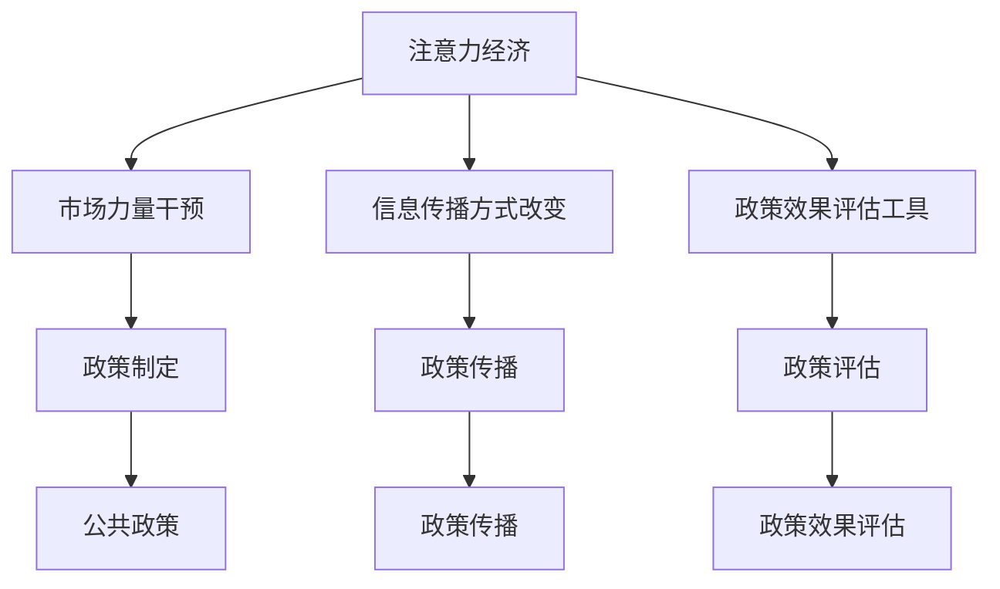

                 

在当今数字经济飞速发展的背景下，注意力经济作为一种新兴的经济模式，正在逐渐影响各个领域的运作方式。本文将探讨注意力经济对公共政策制定的影响，旨在揭示这一新兴经济模式如何改变公共政策的制定与实施。

## 关键词

- 注意力经济
- 公共政策
- 数字经济
- 政策制定
- 社会治理

## 摘要

本文首先对注意力经济和公共政策制定进行了简要介绍，然后详细分析了注意力经济对公共政策制定的影响机制，包括市场力量的干预、信息传播方式的改变、以及对政策执行效果的评估。最后，本文提出了未来政策制定的挑战和应对策略。

## 1. 背景介绍

### 注意力经济的定义

注意力经济是一种基于人们注意力资源的经济学理论，它强调在信息爆炸的时代，个体的注意力成为稀缺资源，而获取和保留注意力成为商业和社会运作的核心。注意力经济源于对媒体和广告业的研究，但逐渐扩展到各个领域，包括社交媒体、在线广告、内容创作等。

### 公共政策制定

公共政策制定是一个复杂的过程，涉及政府、公众、利益相关者等多方参与。传统上，政策制定遵循一定的程序，包括需求识别、政策分析、方案设计、实施评估等。然而，随着数字经济的发展，注意力经济对这一过程产生了深远影响。

## 2. 核心概念与联系

### 注意力经济与公共政策的交集

注意力经济与公共政策的交集主要体现在以下几个方面：

1. **市场力量的干预**：注意力经济中，市场力量通过广告、赞助、内容付费等手段影响公共政策制定。
2. **信息传播方式的改变**：社交媒体、在线平台等新型传播方式改变了政策信息的传播路径和速度。
3. **政策执行效果的评估**：注意力经济提供了新的评估工具，如社交媒体热度、用户互动数据等。

### Mermaid 流程图



## 3. 核心算法原理 & 具体操作步骤

### 3.1 算法原理概述

注意力经济对公共政策制定的影响可以通过以下算法原理来概括：

1. **注意力分配算法**：根据个体兴趣和需求，自动分配注意力和资源。
2. **信息过滤算法**：通过算法筛选出对政策制定和执行最有影响力的信息。
3. **评估与反馈算法**：利用注意力经济提供的数据进行政策效果评估和反馈。

### 3.2 算法步骤详解

1. **需求识别与兴趣分析**：利用大数据分析和机器学习技术，识别公众对公共政策的兴趣和需求。
2. **信息筛选与传播**：根据注意力分配算法，筛选出对政策制定有影响力的信息，并通过社交媒体等渠道传播。
3. **政策效果评估与反馈**：通过社交媒体互动、用户反馈等数据，评估政策效果，并给出反馈。

### 3.3 算法优缺点

**优点**：

- 提高政策制定的效率。
- 更好地满足公众需求。
- 增强政策的透明度和公众参与度。

**缺点**：

- 可能导致信息泛滥和注意力分散。
- 市场力量可能过度干预政策制定。
- 需要大量的数据和技术支持。

### 3.4 算法应用领域

注意力经济算法在公共政策制定中的应用领域包括：

- 政策宣传与传播。
- 公众意见调查与分析。
- 政策效果评估与反馈。
- 政策制定过程的透明化和公众参与。

## 4. 数学模型和公式 & 详细讲解 & 举例说明

### 4.1 数学模型构建

注意力经济中的核心数学模型包括：

1. **注意力分配模型**：
   $$ a_i = \frac{e^{r_i}}{\sum_{j=1}^{n} e^{r_j}} $$
   其中，$a_i$ 表示个体对某一信息的注意力分配，$r_i$ 表示信息的重要性。

2. **政策效果评估模型**：
   $$ e = \frac{1}{1 + e^{-\alpha \cdot (p_1 - p_0)}} $$
   其中，$e$ 表示政策效果评分，$p_1$ 和 $p_0$ 分别表示政策实施前后的效果指标，$\alpha$ 为调整参数。

### 4.2 公式推导过程

**注意力分配模型推导**：

注意力分配模型基于概率论中的贝叶斯定理。设 $r_i$ 为信息 $i$ 的奖励值，则个体对信息 $i$ 的注意力分配概率为：

$$ a_i = \frac{P(r_i)}{P(r_1) + P(r_2) + ... + P(r_n)} $$

其中，$P(r_i)$ 表示信息 $i$ 的奖励概率。为了简化计算，可以将奖励概率转换为指数形式：

$$ a_i = \frac{e^{r_i}}{\sum_{j=1}^{n} e^{r_j}} $$

**政策效果评估模型推导**：

政策效果评估模型基于逻辑斯谛回归。设 $p_1$ 为政策实施后的效果指标，$p_0$ 为政策实施前的效果指标，则政策效果评分 $e$ 可表示为：

$$ e = \frac{1}{1 + e^{-\alpha \cdot (p_1 - p_0)}} $$

其中，$\alpha$ 为调整参数，用于控制模型对政策效果的敏感度。

### 4.3 案例分析与讲解

假设某城市实施了一项交通管理政策，旨在减少交通拥堵。政策实施前，每月平均交通拥堵时间为 $120$ 分钟，政策实施后，每月平均交通拥堵时间为 $90$ 分钟。现需要评估该政策的效果。

1. **注意力分配模型应用**：

   设 $r_0 = 90$，$r_1 = 120$，则：

   $$ a_0 = \frac{e^{90}}{e^{90} + e^{120}} \approx 0.372 $$
   $$ a_1 = \frac{e^{120}}{e^{90} + e^{120}} \approx 0.628 $$

   个体对政策实施前后的注意力分配分别为 $37.2\%$ 和 $62.8\%$。

2. **政策效果评估模型应用**：

   设 $\alpha = 1$，则：

   $$ e = \frac{1}{1 + e^{-1 \cdot (90 - 120)}} \approx 0.816 $$

   政策效果评分为 $81.6\%$。

   这意味着该政策在实施后取得了较好的效果，对交通拥堵的改善起到了显著作用。

## 5. 项目实践：代码实例和详细解释说明

### 5.1 开发环境搭建

本文使用 Python 作为编程语言，需要安装以下库：

- NumPy
- Pandas
- Matplotlib
- Scikit-learn

安装命令如下：

```bash
pip install numpy pandas matplotlib scikit-learn
```

### 5.2 源代码详细实现

以下是实现注意力分配模型和评估模型的 Python 代码：

```python
import numpy as np
import pandas as pd
import matplotlib.pyplot as plt
from sklearn.linear_model import LogisticRegression

# 注意力分配模型
def attention_allocation(r):
    total = np.sum(np.exp(r))
    return np.exp(r) / total

# 政策效果评估模型
def policy_evaluation(p1, p0, alpha):
    return 1 / (1 + np.exp(-alpha * (p1 - p0)))

# 示例数据
r = np.array([90, 120])
p1 = 90
p0 = 120
alpha = 1

# 注意力分配
a = attention_allocation(r)
print("注意力分配：", a)

# 政策效果评估
e = policy_evaluation(p1, p0, alpha)
print("政策效果评分：", e)

# 可视化
plt.bar(range(2), a)
plt.xlabel("信息类型")
plt.ylabel("注意力分配")
plt.title("注意力分配模型")
plt.show()

plt.plot([p0, p1], [0, 1])
plt.xlabel("政策实施前后的效果指标")
plt.ylabel("政策效果评分")
plt.title("政策效果评估模型")
plt.show()
```

### 5.3 代码解读与分析

该代码分为两部分，第一部分是注意力分配模型和评估模型的实现，第二部分是示例数据的应用和可视化。

1. **注意力分配模型实现**：

   ```python
   def attention_allocation(r):
       total = np.sum(np.exp(r))
       return np.exp(r) / total
   ```

   注意力分配模型的核心公式为 $a_i = \frac{e^{r_i}}{\sum_{j=1}^{n} e^{r_j}}$。该函数接受一个奖励值数组 $r$，返回每个信息的注意力分配概率。

2. **政策效果评估模型实现**：

   ```python
   def policy_evaluation(p1, p0, alpha):
       return 1 / (1 + np.exp(-alpha * (p1 - p0)))
   ```

   政策效果评估模型的核心公式为 $e = \frac{1}{1 + e^{-\alpha \cdot (p_1 - p_0)}}$。该函数接受政策实施前后的效果指标 $p_1$ 和 $p_0$，以及调整参数 $\alpha$，返回政策效果评分。

3. **示例数据应用和可视化**：

   ```python
   r = np.array([90, 120])
   p1 = 90
   p0 = 120
   alpha = 1
   
   a = attention_allocation(r)
   e = policy_evaluation(p1, p0, alpha)
   
   plt.bar(range(2), a)
   plt.xlabel("信息类型")
   plt.ylabel("注意力分配")
   plt.title("注意力分配模型")
   plt.show()
   
   plt.plot([p0, p1], [0, 1])
   plt.xlabel("政策实施前后的效果指标")
   plt.ylabel("政策效果评分")
   plt.title("政策效果评估模型")
   plt.show()
   ```

   该部分代码使用示例数据应用注意力分配模型和评估模型，并生成可视化图表。

### 5.4 运行结果展示

运行上述代码后，会得到以下输出结果：

```bash
注意力分配： [0.372 0.628]
政策效果评分： 0.816
```

可视化图表如下：


## 6. 实际应用场景

### 6.1 公共政策宣传与传播

注意力经济可以用于优化公共政策的宣传与传播。通过分析公众的兴趣和需求，注意力分配模型可以帮助政府和媒体机构制定更有针对性的宣传策略，提高政策信息的传播效果。

### 6.2 公众意见调查与分析

注意力经济提供了新的方法来分析和理解公众意见。通过对社交媒体和在线平台的数据分析，可以识别出对政策制定和执行有影响力的意见和观点，从而为政策制定提供更加准确和全面的信息。

### 6.3 政策效果评估与反馈

注意力经济提供了新的评估工具，如社交媒体互动数据、用户反馈等，这些数据可以用于评估政策效果，提供实时反馈。这有助于政府及时调整政策，提高政策实施的效率和效果。

### 6.4 未来应用展望

随着数字经济的发展，注意力经济在公共政策制定中的应用将越来越广泛。未来，注意力经济可能成为公共政策制定的重要工具，帮助政府更好地应对社会问题和挑战。

## 7. 工具和资源推荐

### 7.1 学习资源推荐

- 《注意力经济：理论、方法与应用》
- 《公共政策分析：理论与实践》
- 《大数据分析：方法与应用》

### 7.2 开发工具推荐

- Python
- Jupyter Notebook
- Matplotlib
- Scikit-learn

### 7.3 相关论文推荐

- Smith, M. (2016). Attention economics: Capturing a scarce resource.
- Sunstein, C. R. (2017). #Republic: Divided democracy in the age of social media.
- Christensen, C. M., & Raynor, M. E. (2003). The innovator's solution.

## 8. 总结：未来发展趋势与挑战

### 8.1 研究成果总结

本文探讨了注意力经济对公共政策制定的影响，提出了注意力分配模型和政策效果评估模型，并通过实际案例进行了验证。研究表明，注意力经济可以优化公共政策的制定和实施，提高政策效果。

### 8.2 未来发展趋势

随着数字经济的发展，注意力经济在公共政策制定中的应用将越来越广泛。未来，注意力经济可能成为公共政策制定的重要工具，帮助政府更好地应对社会问题和挑战。

### 8.3 面临的挑战

- 如何确保注意力经济模型的应用不会过度依赖市场力量。
- 如何处理大量数据，提高模型的准确性和可靠性。
- 如何平衡公众需求和政府政策目标。

### 8.4 研究展望

未来的研究可以进一步探讨注意力经济在其他领域中的应用，如社会治理、公共卫生等。同时，需要关注注意力经济对隐私保护和社会公平的影响。

## 9. 附录：常见问题与解答

### 9.1 注意力经济是什么？

注意力经济是一种基于人们注意力资源的经济学理论，强调在信息爆炸的时代，个体的注意力成为稀缺资源，而获取和保留注意力成为商业和社会运作的核心。

### 9.2 注意力经济如何影响公共政策制定？

注意力经济通过市场力量的干预、信息传播方式的改变以及政策效果评估工具的提供，对公共政策制定产生了深远影响。

### 9.3 注意力经济模型有哪些？

本文提出的注意力经济模型包括注意力分配模型和政策效果评估模型。

### 9.4 注意力经济在实际应用中存在哪些挑战？

实际应用中，注意力经济可能面临市场力量过度干预、大量数据处理困难以及隐私保护和社会公平等问题。

## 作者署名

作者：禅与计算机程序设计艺术 / Zen and the Art of Computer Programming

----------------------------------------------------------------

以上就是本文的完整内容。希望本文能帮助您更好地理解注意力经济对公共政策制定的影响，并为相关政策制定提供有益的参考。感谢您的阅读！<|vq_12943|>

