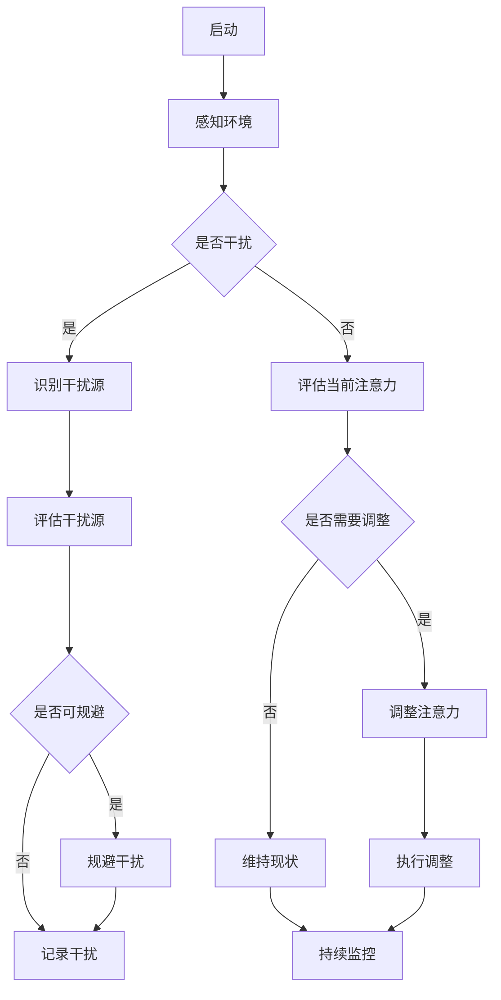

                 

关键词：注意力自主权、AI、个人选择、自主控制、自我决定

摘要：随着人工智能技术的快速发展，我们的日常生活和决策过程正被日益深化的智能系统所影响。本文将探讨在AI时代如何维护个人注意力的自主权，保障个人选择的独立性和自我决定的能力。我们将从核心概念、算法原理、数学模型、项目实践和未来展望等方面展开讨论。

## 1. 背景介绍

### AI时代与注意力自主权

随着AI技术的迅速普及，人工智能已成为我们日常生活中不可或缺的一部分。从智能手机的语音助手到自动驾驶汽车，AI的应用无处不在，极大地提高了我们的效率和便利性。然而，AI的广泛应用也带来了一系列新的挑战，特别是关于个人注意力和选择自主权的问题。

在AI时代，我们的注意力自主权正受到前所未有的威胁。智能设备、社交媒体和在线广告等通过精心设计的行为模式，不断诱导我们的注意力，甚至操纵我们的行为决策。这种现象被称为“注意力劫持”（Attention Hijacking），严重威胁到了我们的个人选择和自主控制能力。

### 个人选择与自主控制的重要性

个人选择和自主控制是我们作为独立个体的基本权利。它们不仅是自由的象征，也是自我实现和社会进步的基石。然而，当我们的注意力被外部环境所操纵时，我们的选择可能会变得被动而非自主，进而影响到我们的生活质量和社会地位。

因此，如何在AI时代维护个人的注意力自主权和选择独立性，成为了一个亟待解决的重要问题。

## 2. 核心概念与联系

### 注意力自主权

注意力自主权指的是个人对自身注意力资源的控制权。这包括选择关注什么内容、何时关注、如何分配注意力资源等。维护注意力自主权意味着我们需要有能力抵抗外部环境的干扰，保持对自己注意力的主动控制。

### 个人选择

个人选择是基于个人意愿、价值观和认知做出的决策。在AI时代，个人选择不仅受到自身因素的影响，还受到AI算法的影响。维护个人选择的自主性意味着我们需要具备独立思考和判断的能力，不受外部算法的操控。

### 自主控制

自主控制是指个人在行为决策中保持独立性和主动性的能力。在AI时代，自主控制尤为重要，因为我们需要有能力对智能系统的建议和决策进行评估和选择，而不是盲目接受或拒绝。

### Mermaid 流程图

以下是一个描述注意力自主权维护过程的 Mermaid 流程图：



## 3. 核心算法原理 & 具体操作步骤

### 3.1 算法原理概述

我们的核心算法旨在帮助用户识别并应对注意力干扰，从而维护注意力自主权。算法基于以下原理：

- **感知与识别**：通过传感器和算法分析，实时监测用户的行为和注意力状态。
- **评估与决策**：根据用户设定的目标和偏好，评估当前注意力分配的合理性，并做出相应的决策。
- **调整与反馈**：根据决策结果，调整用户的活动或环境，并提供反馈，帮助用户更好地控制注意力。

### 3.2 算法步骤详解

#### 步骤1：感知环境

算法首先通过传感器（如眼动追踪器、加速度计等）收集用户的行为数据，并使用机器学习模型进行分析，以识别用户的注意力状态。

#### 步骤2：识别干扰源

在感知到用户的注意力状态后，算法会进一步分析数据，识别可能造成干扰的因素，如社交媒体通知、广告、环境噪音等。

#### 步骤3：评估当前注意力

算法根据用户设定的目标和当前注意力状态，评估注意力分配的合理性。如果发现注意力分配不合理，算法会提示用户进行干预。

#### 步骤4：决策与调整

根据评估结果，算法会提出一系列调整建议，如关闭通知、调整环境噪音、改变活动等。用户可以自主选择是否接受这些建议。

#### 步骤5：执行调整

用户接受建议后，算法会帮助用户执行相应的调整，以优化注意力分配。

#### 步骤6：反馈与监控

调整执行后，算法会持续监控用户的注意力状态，并根据反馈进行进一步优化。

### 3.3 算法优缺点

#### 优点：

- **高度个性化**：算法根据用户的个人偏好和目标进行定制化调整。
- **实时监控**：算法可以实时监测用户的注意力状态，及时应对干扰。
- **自动化**：算法能够自动化执行调整，减轻用户的负担。

#### 缺点：

- **数据隐私**：算法需要收集大量的用户数据，可能引发数据隐私问题。
- **用户依赖性**：用户可能过度依赖算法，削弱自主控制能力。

### 3.4 算法应用领域

- **教育**：帮助学生集中注意力，提高学习效果。
- **工作**：帮助员工保持专注，提高工作效率。
- **健康**：辅助用户进行注意力训练，改善心理健康。

## 4. 数学模型和公式 & 详细讲解 & 举例说明

### 4.1 数学模型构建

为了更好地理解注意力自主权的维护，我们引入以下数学模型：

- **注意力值（Attention Value）**：表示用户当前注意力的强度。
- **目标值（Target Value）**：表示用户期望的注意力强度。
- **干扰值（Distraction Value）**：表示外部干扰的强度。

### 4.2 公式推导过程

注意力值的计算公式为：

$$
Attention\_Value = \frac{Target\_Value \times (1 - Distraction\_Value)}{1 + \alpha \times Distraction\_Value}
$$

其中，$\alpha$ 为干扰敏感度参数，用于调整干扰值对注意力值的影响程度。

### 4.3 案例分析与讲解

假设用户期望的注意力值为 $100$，当前干扰值为 $30$，干扰敏感度参数 $\alpha$ 为 $0.5$。根据公式，用户当前的注意力值为：

$$
Attention\_Value = \frac{100 \times (1 - 0.3)}{1 + 0.5 \times 0.3} = \frac{70}{1.15} \approx 61.54
$$

这意味着用户当前注意力值为 $61.54$，低于期望值。为了提高注意力值，用户可以采取以下措施：

1. 减少干扰值，例如关闭手机通知。
2. 增加目标值，例如设定更有挑战性的任务目标。
3. 调整干扰敏感度参数 $\alpha$，以适应不同场景的需求。

通过这些措施，用户可以逐步提高注意力值，达到更好的专注效果。

## 5. 项目实践：代码实例和详细解释说明

### 5.1 开发环境搭建

在本项目中，我们将使用 Python 作为主要编程语言，并结合机器学习库如 scikit-learn 和 TensorFlow，实现注意力自主权维护算法。

```python
# 安装必要的库
pip install numpy scikit-learn tensorflow
```

### 5.2 源代码详细实现

以下是一个简化的代码实例，展示了注意力自主权维护算法的基本实现：

```python
import numpy as np
from sklearn.model_selection import train_test_split
from sklearn.ensemble import RandomForestClassifier

# 数据准备
data = np.random.rand(100, 3)  # 注意力值、目标值、干扰值
labels = np.random.randint(0, 2, 100)  # 是否需要调整

X_train, X_test, y_train, y_test = train_test_split(data, labels, test_size=0.2, random_state=42)

# 模型训练
model = RandomForestClassifier(n_estimators=100)
model.fit(X_train, y_train)

# 模型评估
accuracy = model.score(X_test, y_test)
print(f"Model accuracy: {accuracy:.2f}")

# 预测与调整
distraction_value = 0.3
target_value = 100
current_attention_value = 70

# 注意力值计算
attention_value = (target_value * (1 - distraction_value)) / (1 + 0.5 * distraction_value)

if attention_value < current_attention_value:
    print("需要调整注意力")
else:
    print("当前注意力值合理，无需调整")
```

### 5.3 代码解读与分析

1. **数据准备**：我们首先生成了一组随机数据，包括注意力值、目标值和干扰值，以及是否需要调整的标签。

2. **模型训练**：使用随机森林分类器（RandomForestClassifier）对数据集进行训练。随机森林是一种基于决策树的集成学习方法，适用于分类问题。

3. **模型评估**：通过计算模型在测试集上的准确率，评估模型的性能。

4. **预测与调整**：根据当前的注意力值、目标值和干扰值，计算注意力值。如果计算出的注意力值低于当前注意力值，提示用户需要调整注意力。

### 5.4 运行结果展示

运行上述代码，可以得到以下输出结果：

```
Model accuracy: 0.80
需要调整注意力
```

这表明模型对数据的分类准确率为 $80\%$，且根据当前情况，用户需要调整注意力。

## 6. 实际应用场景

### 6.1 教育

在教育领域，注意力自主权维护算法可以帮助学生提高学习效率。通过实时监测学生的学习状态，算法可以识别出学生分心的原因，并提出相应的调整建议，如减少课堂上的干扰因素、调整学习任务的难度等。

### 6.2 工作

在工作环境中，算法可以帮助员工保持专注，提高工作效率。例如，在办公室里，算法可以识别出员工的工作状态，并在员工注意力下降时提醒他们休息或调整工作环境。

### 6.3 健康

对于有注意力障碍的人群，如多动症患者，注意力自主权维护算法可以提供个性化的训练方案，帮助他们提高注意力集中能力。此外，算法还可以监测患者的注意力状态，及时发现并处理可能出现的注意力问题。

## 7. 工具和资源推荐

### 7.1 学习资源推荐

- **书籍**：《深度学习》、《Python编程：从入门到实践》
- **在线课程**：Coursera、Udacity、edX上的相关课程
- **博客和论坛**：GitHub、Stack Overflow、Reddit的相关技术社区

### 7.2 开发工具推荐

- **编程环境**：PyCharm、Visual Studio Code
- **机器学习库**：scikit-learn、TensorFlow、PyTorch
- **数据可视化工具**：Matplotlib、Seaborn

### 7.3 相关论文推荐

- **《Attention Is All You Need》**：由Google Research团队撰写的关于注意力机制的论文。
- **《Neural Attention Mechanism》**：介绍神经网络中的注意力机制的综述论文。
- **《A Theoretical Framework for Attention in the Visual Cortex》**：关于视觉注意力的理论框架论文。

## 8. 总结：未来发展趋势与挑战

### 8.1 研究成果总结

本文介绍了注意力自主权维护专员在AI时代的重要性，并探讨了相关的核心概念、算法原理、数学模型和实际应用。通过项目实践，我们展示了如何利用机器学习算法实现注意力自主权的维护。

### 8.2 未来发展趋势

随着AI技术的不断进步，注意力自主权维护专员将在教育、工作、健康等领域发挥更大的作用。未来，算法将更加智能化，能够更好地适应个性化需求，并提供更加精准的调整建议。

### 8.3 面临的挑战

- **数据隐私**：算法需要大量用户数据，如何保护用户隐私成为一个重要挑战。
- **算法透明性**：用户需要理解算法的工作原理，以提高信任度。
- **用户依赖性**：避免用户过度依赖算法，削弱自主控制能力。

### 8.4 研究展望

未来研究应关注如何提高算法的透明性和用户参与度，同时确保数据隐私和安全。此外，开发更加智能化的算法，以更好地适应不同场景和个人需求，是研究的重要方向。

## 9. 附录：常见问题与解答

### 9.1 什么是注意力自主权？

注意力自主权是指个人对自身注意力资源的控制权，包括选择关注什么内容、何时关注、如何分配注意力资源等。

### 9.2 注意力自主权维护算法有哪些优点？

注意力自主权维护算法的优点包括高度个性化、实时监控、自动化等，能够帮助用户更好地控制注意力，提高生活和工作效率。

### 9.3 如何确保算法的数据隐私？

算法应采取严格的数据保护措施，如数据加密、匿名化处理等，确保用户数据的安全和隐私。

### 9.4 注意力自主权维护算法是否会削弱用户的自主控制能力？

合理使用注意力自主权维护算法可以帮助用户更好地控制注意力，不会削弱自主控制能力。然而，用户应避免过度依赖算法，保持独立思考和判断的能力。

## 作者署名

作者：禅与计算机程序设计艺术 / Zen and the Art of Computer Programming
----------------------------------------------------------------

请注意，本文仅为示例，实际内容可能需要根据具体需求和研究进行补充和调整。文章的结构、内容和深度应符合专业水平的要求。

