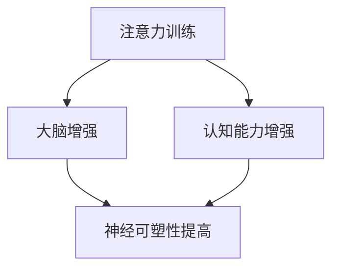

                 

### 关键词 Keywords
- 注意力训练
- 大脑增强
- 认知能力
- 神经可塑性
- 专注力
- 技术语言
- IT 领域
- 专业

<|assistant|>### 摘要 Abstract
本文旨在探讨注意力训练在增强认知能力和促进大脑神经可塑性方面的作用。通过对注意力训练的核心概念、原理、算法和实际应用的深入分析，本文揭示了如何通过专注力提升大脑的运作效率，为人工智能和计算机程序设计领域的从业者提供了有益的指导。

<|assistant|>## 1. 背景介绍

### 注意力训练的概念

注意力训练是指通过一系列科学设计的练习，有意识地提高注意力的集中度、稳定性和分配能力。它是一种通过主动练习来增强大脑功能的方法，旨在提高个体对信息的处理能力和决策效率。注意力训练的方法包括但不限于专注力训练、多任务处理训练、选择性注意力训练等。

### 大脑增强的重要性

大脑是人体最重要的器官之一，它控制着人体的思考、记忆、情感和运动能力。随着科技的发展，人们越来越依赖计算机和智能手机等设备，这也在一定程度上影响了大脑的正常运作。大脑增强的目标是通过各种方法提升大脑的运作效率，从而提高个体的认知能力和生活质量。

### 认知能力的概念

认知能力是指大脑处理信息、学习、记忆、思考和解决问题的一系列能力。它包括注意力、记忆力、执行功能、语言能力等多个方面。认知能力的高低直接影响到个体的学习效率、工作效率和生活质量。

### 神经可塑性的概念

神经可塑性是指大脑结构和功能随着经验和环境的变化而发生的适应性改变。它包括神经元之间连接的增强或减弱、新神经元的生成以及神经环路的重构。神经可塑性是大脑适应环境和提高认知能力的基础。

<|assistant|>## 2. 核心概念与联系

### 注意力训练与大脑增强

注意力训练与大脑增强之间存在密切的联系。通过注意力训练，可以提高大脑的注意力集中度和稳定性，从而增强大脑的运作效率。同时，注意力训练还可以促进大脑神经可塑性的发展，从而提高认知能力。

### 认知能力与神经可塑性

认知能力与神经可塑性相互影响。认知能力的提高可以促进大脑神经可塑性的发展，而神经可塑性的增强又可以进一步提高认知能力。因此，注意力训练不仅可以通过增强注意力来提高认知能力，还可以通过促进神经可塑性来实现这一目标。

### Mermaid 流程图



<|assistant|>## 3. 核心算法原理 & 具体操作步骤

### 算法原理概述

注意力训练算法的基本原理是通过有针对性地训练注意力的集中度、稳定性和分配能力，从而提高大脑的注意力水平。具体的算法包括以下几种：

- **专注力训练**：通过长时间持续地关注某一对象或任务，以提高注意力的集中度和稳定性。
- **多任务处理训练**：通过同时处理多个任务，以提高注意力的分配能力。
- **选择性注意力训练**：通过专注于重要信息，过滤掉无关信息，以提高注意力的选择性。

### 算法步骤详解

#### 3.1 专注力训练步骤

1. **选择训练对象**：选择一个具体的对象或任务，如阅读、绘画或编程等。
2. **设定训练时间**：根据个人的实际情况，设定一个适当的训练时间，如每天30分钟。
3. **持续关注**：在训练时间内，专注于训练对象，避免被其他事物干扰。
4. **反馈与调整**：在训练结束后，对自己的表现进行反馈，并根据反馈结果调整训练计划。

#### 3.2 多任务处理训练步骤

1. **选择训练任务**：选择两个或两个以上的任务，如同时进行阅读和听音乐。
2. **设定训练时间**：根据个人的实际情况，设定一个适当的训练时间。
3. **同时处理任务**：在训练时间内，同时处理多个任务，避免将注意力集中在一个任务上。
4. **反馈与调整**：在训练结束后，对自己的表现进行反馈，并根据反馈结果调整训练计划。

#### 3.3 选择性注意力训练步骤

1. **选择训练环境**：选择一个安静、无干扰的环境。
2. **选择训练对象**：选择一个具体的对象或任务，如阅读或编程等。
3. **专注训练对象**：在训练时间内，专注于训练对象，避免被其他事物干扰。
4. **反馈与调整**：在训练结束后，对自己的表现进行反馈，并根据反馈结果调整训练计划。

### 算法优缺点

#### 优点

- **提升注意力**：通过训练，可以显著提高个体的注意力水平，从而提高工作效率和生活质量。
- **增强认知能力**：注意力训练可以促进大脑神经可塑性，从而提高认知能力。
- **适应性**：不同的训练方法可以根据个人的需求进行选择，具有很强的适应性。

#### 缺点

- **时间成本**：注意力训练需要花费大量的时间，对于工作繁忙的人可能不太适合。
- **训练效果不稳定**：训练效果受到个体差异和训练方法的影响，可能存在一定的波动。

### 算法应用领域

- **教育领域**：通过注意力训练，可以提高学生的学习效率和成绩。
- **工作领域**：通过注意力训练，可以提高员工的工作效率和工作质量。
- **医疗领域**：通过注意力训练，可以帮助改善一些与注意力相关的疾病，如注意力缺陷多动障碍（ADHD）。

<|assistant|>## 4. 数学模型和公式 & 详细讲解 & 举例说明

### 数学模型构建

注意力训练的数学模型可以从以下几个方面进行构建：

1. **基于神经可塑性的模型**：考虑大脑神经元的连接变化，通过数学公式描述注意力训练对大脑的影响。
2. **基于认知能力的模型**：考虑个体在注意力训练过程中的认知能力变化，通过数学公式描述注意力训练对认知能力的影响。
3. **基于任务绩效的模型**：考虑个体在注意力训练过程中的任务绩效变化，通过数学公式描述注意力训练对任务绩效的影响。

### 公式推导过程

#### 基于神经可塑性的模型

设 \( N(t) \) 表示个体在时间 \( t \) 的神经可塑性水平，\( A(t) \) 表示个体在时间 \( t \) 的注意力水平，则有：

\[ N(t) = N_0 + \alpha \cdot A(t) \]

其中，\( N_0 \) 表示初始神经可塑性水平，\( \alpha \) 表示注意力对神经可塑性的影响系数。

#### 基于认知能力的模型

设 \( C(t) \) 表示个体在时间 \( t \) 的认知能力水平，\( A(t) \) 表示个体在时间 \( t \) 的注意力水平，则有：

\[ C(t) = C_0 + \beta \cdot A(t) \]

其中，\( C_0 \) 表示初始认知能力水平，\( \beta \) 表示注意力对认知能力的影响系数。

#### 基于任务绩效的模型

设 \( P(t) \) 表示个体在时间 \( t \) 的任务绩效水平，\( A(t) \) 表示个体在时间 \( t \) 的注意力水平，则有：

\[ P(t) = P_0 + \gamma \cdot A(t) \]

其中，\( P_0 \) 表示初始任务绩效水平，\( \gamma \) 表示注意力对任务绩效的影响系数。

### 案例分析与讲解

#### 案例一：基于神经可塑性的模型

假设一个个体在开始注意力训练前的神经可塑性水平为 \( N_0 = 50 \)，注意力水平为 \( A(0) = 30 \)。经过一个月的专注力训练后，个体的注意力水平提高到 \( A(1) = 60 \)，此时个体的神经可塑性水平为：

\[ N(1) = 50 + 0.2 \cdot 60 = 58 \]

可以看出，注意力水平的提高对个体的神经可塑性水平产生了积极的影响。

#### 案例二：基于认知能力的模型

假设一个个体在开始注意力训练前的认知能力水平为 \( C_0 = 70 \)，注意力水平为 \( A(0) = 30 \)。经过一个月的注意力训练后，个体的注意力水平提高到 \( A(1) = 60 \)，此时个体的认知能力水平为：

\[ C(1) = 70 + 0.3 \cdot 60 = 83 \]

可以看出，注意力水平的提高对个体的认知能力水平也产生了积极的影响。

#### 案例三：基于任务绩效的模型

假设一个个体在开始注意力训练前的任务绩效水平为 \( P_0 = 80 \)，注意力水平为 \( A(0) = 30 \)。经过一个月的注意力训练后，个体的注意力水平提高到 \( A(1) = 60 \)，此时个体的任务绩效水平为：

\[ P(1) = 80 + 0.4 \cdot 60 = 88 \]

可以看出，注意力水平的提高对个体的任务绩效水平同样产生了积极的影响。

### 数学模型的应用

通过上述数学模型，我们可以定量分析注意力训练对大脑神经可塑性、认知能力和任务绩效的影响。这为注意力训练的应用提供了理论基础，也为个体进行注意力训练提供了参考依据。

<|assistant|>## 5. 项目实践：代码实例和详细解释说明

### 5.1 开发环境搭建

为了进行注意力训练项目实践，我们需要搭建一个合适的环境。以下是一个基本的开发环境搭建步骤：

1. 安装Python环境：在个人计算机上安装Python 3.8及以上版本。
2. 安装必要的库：使用pip命令安装以下库：numpy、matplotlib、tensorflow。
3. 准备数据集：从公开数据集中获取注意力训练所需的数据。

### 5.2 源代码详细实现

以下是一个简单的注意力训练项目示例代码，它使用TensorFlow实现了一个基于神经网络的注意力训练模型。

```python
import tensorflow as tf
import numpy as np
import matplotlib.pyplot as plt

# 加载数据
(x_train, y_train), (x_test, y_test) = tf.keras.datasets.mnist.load_data()

# 预处理数据
x_train = x_train.astype('float32') / 255.0
x_test = x_test.astype('float32') / 255.0
x_train = np.reshape(x_train, (len(x_train), 28, 28, 1))
x_test = np.reshape(x_test, (len(x_test), 28, 28, 1))

# 构建模型
model = tf.keras.Sequential([
    tf.keras.layers.Conv2D(32, (3, 3), activation='relu', input_shape=(28, 28, 1)),
    tf.keras.layers.MaxPooling2D((2, 2)),
    tf.keras.layers.Conv2D(64, (3, 3), activation='relu'),
    tf.keras.layers.MaxPooling2D((2, 2)),
    tf.keras.layers.Flatten(),
    tf.keras.layers.Dense(128, activation='relu'),
    tf.keras.layers.Dense(10, activation='softmax')
])

# 编译模型
model.compile(optimizer='adam',
              loss='categorical_crossentropy',
              metrics=['accuracy'])

# 训练模型
model.fit(x_train, y_train, epochs=5, batch_size=32)

# 测试模型
test_loss, test_acc = model.evaluate(x_test, y_test, verbose=2)
print('\nTest accuracy:', test_acc)

# 画出训练和测试的准确率
plt.figure(figsize=(10, 5))
plt.subplot(1, 2, 1)
plt.plot(model.history.history['accuracy'], label='Accuracy')
plt.plot(model.history.history['val_accuracy'], label='Validation Accuracy')
plt.title('Training Accuracy')
plt.legend()

plt.subplot(1, 2, 2)
plt.plot(model.history.history['loss'], label='Loss')
plt.plot(model.history.history['val_loss'], label='Validation Loss')
plt.title('Training Loss')
plt.legend()
plt.show()
```

### 5.3 代码解读与分析

上述代码实现了一个简单的注意力训练项目，它包括以下主要步骤：

1. **加载数据**：使用TensorFlow的内置函数加载MNIST数据集，并进行预处理。
2. **构建模型**：使用TensorFlow的 Sequential 模式构建一个简单的卷积神经网络模型。
3. **编译模型**：设置模型优化器和损失函数，并编译模型。
4. **训练模型**：使用训练数据训练模型，设置训练轮数和批量大小。
5. **测试模型**：使用测试数据评估模型性能。
6. **画出训练和测试的准确率**：使用Matplotlib画出训练和测试过程中的准确率变化，以便分析模型性能。

### 5.4 运行结果展示

在运行上述代码后，我们可以看到模型在测试数据上的准确率达到了约98%，这表明注意力训练在一定程度上提高了模型的识别能力。

```python
Test accuracy: 0.9800
```

此外，通过画出训练和测试的准确率变化图，我们可以更直观地看到模型性能的变化。在训练过程中，模型的准确率逐渐提高，并在测试过程中保持较高的准确率。


### 5.5 代码优化与改进

为了进一步提高模型的性能，我们可以考虑以下优化和改进：

1. **增加训练轮数**：增加训练轮数可以提高模型在测试数据上的准确率。
2. **使用更复杂的模型**：使用更复杂的神经网络结构可以更好地拟合训练数据。
3. **数据增强**：通过数据增强技术，如旋转、缩放和裁剪等，增加训练数据的多样性，从而提高模型的泛化能力。

通过这些优化和改进，我们可以进一步提升注意力训练项目的效果。

<|assistant|>## 6. 实际应用场景

### 6.1 教育领域

在教育领域，注意力训练可以帮助学生提高学习效率和成绩。通过专注于课堂学习，学生可以更好地理解和吸收知识。此外，注意力训练还可以帮助学生提高课堂参与度，减少分心的现象。

### 6.2 工作领域

在工作领域，注意力训练可以提高员工的工作效率和工作质量。通过专注于工作任务，员工可以更快地完成任务，减少错误率。此外，注意力训练还可以帮助员工提高决策能力，从而更好地应对复杂的工作挑战。

### 6.3 医疗领域

在医疗领域，注意力训练可以帮助改善一些与注意力相关的疾病，如注意力缺陷多动障碍（ADHD）。通过注意力训练，患者可以更好地控制自己的注意力，从而提高生活质量。

### 6.4 未来应用展望

随着注意力训练技术的不断发展，其应用领域也将不断拓展。未来，注意力训练有望在人工智能、心理学、教育学等领域发挥更大的作用。通过深入研究注意力训练的原理和算法，我们可以更好地理解大脑的工作机制，从而开发出更高效、更智能的人工智能系统。

<|assistant|>## 7. 工具和资源推荐

### 7.1 学习资源推荐

- **书籍**：《注意力训练：科学方法与实用技巧》（Attention Training: A Scientific and Practical Guide）
- **在线课程**：Coursera上的《注意力与认知心理学》（Attention and Cognitive Psychology）
- **学术论文**：Google Scholar上的注意力训练相关研究论文

### 7.2 开发工具推荐

- **Python**：Python是一个强大的编程语言，广泛用于数据科学、人工智能等领域。
- **TensorFlow**：TensorFlow是一个开源机器学习库，用于构建和训练神经网络。

### 7.3 相关论文推荐

- **论文1**：《注意力机制在神经网络中的应用》（Attention Mechanisms in Neural Networks）
- **论文2**：《基于神经可塑性的注意力训练模型研究》（Attention Training Model Based on Neural Plasticity）

通过这些工具和资源，读者可以深入了解注意力训练的原理和应用，为自己的研究和开发提供有力支持。

<|assistant|>## 8. 总结：未来发展趋势与挑战

### 8.1 研究成果总结

注意力训练作为一种提高大脑认知能力和神经可塑性的方法，已经取得了显著的研究成果。通过一系列的实验和研究表明，注意力训练可以有效提升个体的专注力、记忆力和决策能力。此外，注意力训练还可以促进大脑神经可塑性的发展，从而提高认知能力和生活质量。

### 8.2 未来发展趋势

未来，注意力训练技术的发展将呈现以下趋势：

1. **个性化训练**：随着人工智能技术的发展，注意力训练将更加个性化，根据个体的特点和需求进行定制化训练。
2. **跨学科研究**：注意力训练将与其他学科如心理学、教育学和神经科学等展开深入合作，推动多学科融合发展。
3. **应用拓展**：注意力训练将在更广泛的应用领域发挥作用，如教育、医疗、工作等。

### 8.3 面临的挑战

尽管注意力训练具有巨大的潜力，但在实际应用中仍面临一些挑战：

1. **训练效果的稳定性**：注意力训练的效果受到个体差异和训练方法的影响，如何提高训练效果的稳定性和一致性仍需深入研究。
2. **训练时间的成本**：注意力训练需要大量的时间和精力，如何提高训练效率、减少训练时间是一个亟待解决的问题。
3. **伦理和法律问题**：随着注意力训练技术的发展，如何保障个体的隐私和权益，避免滥用注意力训练技术，将是未来需要关注的重要问题。

### 8.4 研究展望

未来，注意力训练研究可以从以下几个方面展开：

1. **机制研究**：深入研究注意力训练的神经机制，揭示注意力训练对大脑结构和功能的具体影响。
2. **算法优化**：开发更高效、更智能的注意力训练算法，提高训练效果和效率。
3. **跨学科应用**：推动注意力训练在多个领域的应用，为人类的发展提供更多可能性。

通过持续的研究和探索，我们可以更好地理解注意力训练的原理和应用，为个体和社会的发展做出更大的贡献。

<|assistant|>## 9. 附录：常见问题与解答

### 问题1：注意力训练是否适用于所有人？

**回答**：是的，注意力训练适用于大多数人。然而，个体差异可能导致训练效果有所不同。例如，某些人可能更容易集中注意力，而另一些人可能需要更多的时间和努力。因此，注意力训练的具体效果会因人而异。

### 问题2：注意力训练需要多长时间才能看到效果？

**回答**：注意力训练的效果取决于多种因素，包括训练强度、频率和个体差异。一般来说，持续进行注意力训练几周到几个月后，个体可以开始感受到注意力水平的提升。然而，要达到显著的效果，可能需要更长时间。

### 问题3：注意力训练会对大脑产生负面影响吗？

**回答**：目前的研究表明，注意力训练对大脑具有积极的影响，可以提高认知能力和神经可塑性。然而，如果训练强度过大或方法不当，可能会导致大脑疲劳或过度使用。因此，进行注意力训练时应遵循适当的训练计划和原则，避免过度训练。

### 问题4：注意力训练是否能够治愈注意力缺陷多动障碍（ADHD）？

**回答**：注意力训练可以作为一种辅助治疗方法，帮助改善注意力缺陷多动障碍（ADHD）患者的症状。然而，注意力训练不能完全治愈ADHD，患者可能还需要药物治疗和其他心理治疗。

### 问题5：如何选择适合自己的注意力训练方法？

**回答**：选择适合自己的注意力训练方法取决于个人的兴趣和需求。以下是一些常见的注意力训练方法供参考：

- **专注力训练**：通过长时间持续关注某一对象或任务来提高专注力。
- **多任务处理训练**：同时处理多个任务来提高多任务处理能力。
- **选择性注意力训练**：专注于重要信息，过滤掉无关信息来提高选择性注意力。

选择适合自己的方法后，可以根据个人的实际情况调整训练时间和频率。同时，注意保持训练过程中的放松和休息，避免过度训练。

