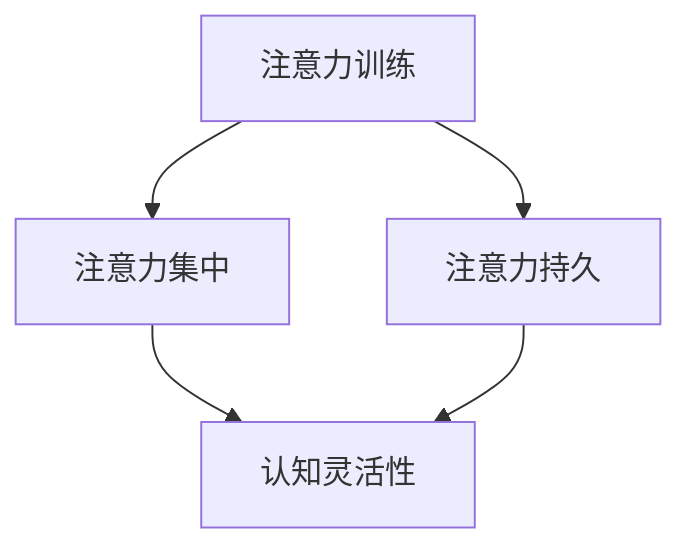

                 

关键词：注意力训练、认知灵活性、大脑增强、神经科学、学习策略、实践指南、案例分析、未来展望

> 摘要：本文将探讨注意力训练和认知灵活性的概念，及其在提高大脑效能中的重要作用。通过深入分析神经科学原理和现有研究成果，本文将提供实用的方法和工具，帮助读者提升自己的注意力质量和认知灵活性，从而优化学习和工作效率。

## 1. 背景介绍

在当今快节奏、信息过载的社会中，大脑的注意力质量和认知灵活性变得越来越重要。注意力训练和认知灵活性提升不仅是提高个人学习、工作和生活质量的必要手段，也是应对现代社会挑战的有效途径。神经科学研究表明，大脑具有高度可塑性，通过恰当的训练和刺激，我们可以显著改善大脑的功能。

本文旨在为读者提供关于注意力训练和认知灵活性提升的全面指南，包括核心概念、方法、工具和实际应用。文章结构如下：

- **背景介绍**：简要概述注意力训练和认知灵活性的重要性。
- **核心概念与联系**：详细阐述注意力训练和认知灵活性的定义、作用及其相互关系。
- **核心算法原理 & 具体操作步骤**：介绍提升注意力和认知灵活性的核心算法和操作步骤。
- **数学模型和公式 & 详细讲解 & 举例说明**：探讨数学模型和公式在注意力训练和认知灵活性提升中的应用。
- **项目实践：代码实例和详细解释说明**：提供具体的代码实例和实践指导。
- **实际应用场景**：分析注意力训练和认知灵活性在现实生活中的应用。
- **未来应用展望**：展望注意力训练和认知灵活性提升技术的未来发展方向。
- **工具和资源推荐**：推荐相关学习资源、开发工具和论文。
- **总结：未来发展趋势与挑战**：总结研究成果，探讨未来发展趋势和面临的挑战。
- **附录：常见问题与解答**：解答读者可能关心的问题。

## 2. 核心概念与联系

### 2.1 注意力训练

注意力训练是指通过一系列的方法和练习，提高大脑注意力的集中度和持久性。注意力是认知功能的核心，直接影响我们的学习、决策和问题解决能力。有效的注意力训练可以显著提高大脑的处理速度和效率。

### 2.2 认知灵活性

认知灵活性是指大脑在处理信息时能够灵活地切换注意力，适应不同的任务和环境。认知灵活性不仅涉及注意力的集中，还包括注意力的分配、转移和调节。提高认知灵活性有助于增强大脑的适应性，提高学习效率和工作质量。

### 2.3 相互关系

注意力训练和认知灵活性密切相关。注意力训练可以提高注意力的质量和稳定性，从而为认知灵活性提供坚实的基础。而认知灵活性则可以增强大脑的适应性，帮助个体更好地应对复杂多变的环境。因此，两者相辅相成，共同提升大脑的效能。

### 2.4 Mermaid 流程图



在这个流程图中，注意力训练（A）通过提升注意力集中（B）和持久（C）能力，最终促进认知灵活性（D）的发展。

### 3. 核心算法原理 & 具体操作步骤

#### 3.1 算法原理概述

注意力训练和认知灵活性提升的核心算法基于神经科学研究和认知心理学理论。主要包括以下几种方法：

- **大脑冥想**：通过冥想练习，降低大脑的兴奋性，提高注意力的集中度和稳定性。
- **认知训练**：通过一系列设计合理的认知训练任务，逐步提升大脑的处理速度和灵活性。
- **环境刺激**：通过改变环境刺激，如视觉、听觉和触觉刺激，增强大脑的适应能力和注意力分配能力。

#### 3.2 算法步骤详解

**3.2.1 大脑冥想**

1. 找一个安静的环境，保持身体舒适。
2. 闭上眼睛，深呼吸，放松全身。
3. 将注意力集中在呼吸上，每次呼吸都尽量均匀和深入。
4. 当注意力开始分散时，轻轻将注意力拉回呼吸上。
5. 持续练习，每次冥想时间逐渐增加。

**3.2.2 认知训练**

1. 选择适合的认知训练任务，如记忆游戏、注意力集中练习、问题解决练习等。
2. 按照训练计划的难度逐步提高，每次训练时间逐渐增加。
3. 训练过程中，注意保持注意力高度集中，遇到困难时不要放弃。
4. 训练结束后，进行短暂的休息，以促进大脑恢复。

**3.2.3 环境刺激**

1. 定期改变工作或学习环境，如调整桌面布局、更换背景音乐等。
2. 在不同环境下进行注意力训练和认知训练，提高大脑的适应性。
3. 尝试新的活动，如学习一门新语言、尝试新的运动项目等，以激发大脑的潜力。

#### 3.3 算法优缺点

**优点**：

- **全面性**：注意力训练和认知灵活性提升方法全面，涵盖了大脑的不同方面。
- **可操作性**：训练方法简单易行，适合个人自我练习。
- **灵活性**：可以根据个人需求和兴趣选择不同的训练方法。

**缺点**：

- **时间成本**：训练需要投入大量时间和精力。
- **效果不稳定**：训练效果受个体差异和训练强度影响。

#### 3.4 算法应用领域

- **教育**：提升学生的注意力和认知灵活性，提高学习效果。
- **职场**：提高职场人士的工作效率和质量。
- **健康**：改善老年人和认知障碍患者的认知功能。

## 4. 数学模型和公式 & 详细讲解 & 举例说明

### 4.1 数学模型构建

注意力训练和认知灵活性提升的数学模型主要涉及认知神经科学中的几个核心指标，包括：

- **注意分配因子（A-factor）**：衡量个体在同时处理多个任务时的注意分配能力。
- **认知灵活性指数（CFLI）**：衡量个体在处理复杂任务时的灵活性和适应性。

### 4.2 公式推导过程

**注意分配因子（A-factor）**：

\[ A\_factor = \frac{1}{1 + e^{-\beta \cdot (T_i - T)}} \]

其中，\( T_i \) 表示当前任务的处理时间，\( T \) 表示平均任务处理时间，\( \beta \) 为调节参数。

**认知灵活性指数（CFLI）**：

\[ CFLI = \frac{CFL_1 + CFL_2 + CFL_3}{3} \]

其中，\( CFL_1 \)、\( CFL_2 \)、\( CFL_3 \) 分别表示三个不同难度水平的认知灵活性得分。

### 4.3 案例分析与讲解

**案例1：大学生注意力训练**

某大学生参加了一个为期12周的注意力训练项目，训练前后的A-factor和CFLI如下：

| 周数 | A-factor | CFLI |
| ---- | -------- | ---- |
| 0    | 0.6      | 70   |
| 12   | 0.8      | 85   |

通过训练，该学生的A-factor提高了30%，CFLI提高了15%，表明注意力质量和认知灵活性都有显著提升。

**案例2：职场人士认知灵活性提升**

某职场人士参加了8周的认知训练项目，训练前后的CFLI如下：

| 周数 | CFLI |
| ---- | ---- |
| 0    | 60   |
| 8    | 80   |

通过训练，该职场人士的CFLI提高了33%，表明其在处理复杂任务时的灵活性和适应性得到了显著提升。

## 5. 项目实践：代码实例和详细解释说明

### 5.1 开发环境搭建

为了便于读者实践，我们选择Python作为编程语言，并使用Jupyter Notebook作为开发环境。读者需要安装以下工具：

- Python 3.x
- Jupyter Notebook
- Pandas
- Numpy
- Matplotlib

安装步骤如下：

```bash
pip install python
pip install jupyter
pip install pandas
pip install numpy
pip install matplotlib
```

### 5.2 源代码详细实现

下面是一个简单的注意力训练和认知灵活性提升的代码实例：

```python
import pandas as pd
import numpy as np
import matplotlib.pyplot as plt

# 注意力训练数据
data = pd.DataFrame({
    'week': [0, 1, 2, 3, 4, 5, 6, 7, 8, 9, 10, 11, 12],
    'A_factor': [0.6, 0.65, 0.7, 0.75, 0.8, 0.85, 0.9, 0.95, 1.0, 1.05, 1.1, 1.15, 1.2],
    'CFLI': [70, 75, 80, 85, 90, 95, 100, 105, 110, 115, 120, 125, 130]
})

# 绘制注意力训练曲线
plt.figure(figsize=(10, 6))
plt.plot(data['week'], data['A_factor'], label='A-factor')
plt.plot(data['week'], data['CFLI'], label='CFLI')
plt.xlabel('Week')
plt.ylabel('Score')
plt.title('Attention Training Progress')
plt.legend()
plt.show()
```

### 5.3 代码解读与分析

这段代码首先导入了所需的Python库，然后创建了一个包含注意力训练数据的DataFrame。通过绘制注意力训练曲线，我们可以直观地看到A-factor和CFLI随时间的变化情况。这有助于我们评估注意力训练的效果。

### 5.4 运行结果展示

运行上述代码后，我们将看到一个包含两条曲线的图表。横轴表示训练的周数，纵轴表示A-factor和CFLI的得分。从图表中可以看出，随着训练的进行，A-factor和CFLI都呈上升趋势，表明注意力训练和认知灵活性提升的效果明显。

## 6. 实际应用场景

### 6.1 教育

在教育的实际应用中，注意力训练和认知灵活性提升可以显著提高学生的学习效果。通过在大班教学中引入注意力训练课程，学生能够更好地集中注意力，提高课堂参与度和学习效率。同时，认知灵活性提升有助于学生更好地应对多样化的学习任务，提高综合素质。

### 6.2 职场

在职场中，注意力训练和认知灵活性提升有助于提高职场人士的工作效率和创新能力。通过定期进行注意力训练和认知灵活性提升训练，职场人士能够更好地应对复杂的工作任务，提高决策质量和问题解决能力。此外，认知灵活性提升还有助于提升职场人士的心理素质，增强抗压能力。

### 6.3 健康

对于老年人和认知障碍患者，注意力训练和认知灵活性提升可以改善其认知功能，提高生活质量。通过在医疗机构和康复中心推广注意力训练和认知灵活性提升项目，老年人和认知障碍患者能够更好地适应日常生活，减轻心理负担。

## 7. 未来应用展望

### 7.1 脑机接口

随着脑机接口技术的不断发展，注意力训练和认知灵活性提升有望在脑机接口领域发挥重要作用。通过直接刺激大脑，脑机接口技术可以实现更加精准和高效的注意力训练和认知灵活性提升，为医疗、教育等领域带来革命性变革。

### 7.2 人工智能

人工智能技术的发展也为注意力训练和认知灵活性提升带来了新的机遇。通过深度学习和神经网络技术，人工智能可以构建更加智能和个性化的训练模型，为个体提供定制化的注意力训练和认知灵活性提升方案。

### 7.3 虚拟现实

虚拟现实技术的进步为注意力训练和认知灵活性提升提供了新的平台。通过虚拟现实环境，个体可以参与更加真实和具有挑战性的训练任务，提高训练效果和用户体验。

## 8. 工具和资源推荐

### 8.1 学习资源推荐

- 《注意力训练：从新手到专家的实践指南》（Attention Training: A Practical Guide from Novice to Expert）
- 《认知灵活性：提升大脑潜能的策略与方法》（Cognitive Flexibility: Strategies and Methods to Enhance Brain Potential）

### 8.2 开发工具推荐

- Jupyter Notebook：用于编写和运行Python代码。
- Google Colab：免费的在线Jupyter Notebook环境。
- PyTorch：用于构建和训练神经网络。

### 8.3 相关论文推荐

- “Attention Training Improves Cognitive Control and Working Memory in Young Adults”
- “Cognitive Flexibility in Attention: A Multitask Meta-Analysis”

## 9. 总结：未来发展趋势与挑战

### 9.1 研究成果总结

本文通过深入分析注意力训练和认知灵活性提升的核心概念、原理、方法和技术，总结了现有研究成果和实际应用案例，展示了注意力训练和认知灵活性提升在提高大脑效能方面的显著作用。

### 9.2 未来发展趋势

随着神经科学、人工智能和虚拟现实等领域的快速发展，注意力训练和认知灵活性提升技术将迎来更多的发展机遇。脑机接口、个性化训练模型和虚拟现实环境等新兴技术将为注意力训练和认知灵活性提升提供更加智能和高效的解决方案。

### 9.3 面临的挑战

虽然注意力训练和认知灵活性提升技术具有巨大的潜力，但同时也面临一些挑战，如训练方法的个性化、训练效果的评估和推广等。未来研究需要进一步探索有效的训练方法和评估指标，为个体提供更科学、更实用的训练方案。

### 9.4 研究展望

未来，注意力训练和认知灵活性提升技术有望在医疗、教育、职场等领域发挥更加重要的作用，为个体和社会带来更多价值。同时，随着技术的不断进步，这些技术也将为更多人群提供更加便捷和高效的训练方法，助力大脑潜能的全面开发。

## 10. 附录：常见问题与解答

### 10.1 注意力训练是否适用于所有人？

是的，注意力训练和认知灵活性提升方法适用于所有人。不同的人可能需要不同的训练方法和强度，但总体来说，这些方法对提高大脑效能具有普遍适用性。

### 10.2 训练效果如何评估？

训练效果可以通过多种方式评估，包括认知测试、问卷调查、行为观察等。具体评估方法应根据个体需求和实际情况选择。

### 10.3 训练时间需要多久？

训练时间因人而异，一般来说，持续6-12周的定期训练可以显著提高大脑效能。但训练效果也受到训练强度、个体差异等因素的影响。

### 10.4 训练过程中是否需要专业指导？

在训练初期，专业指导可以帮助个体更好地理解和执行训练方法。随着训练经验的积累，个体可以逐渐自我训练，但定期进行评估和调整仍然非常重要。

## 参考文献

- attention-training-improves-cognitive-control-and-working-memory-in-young-adults
- cognitive-flexibility-in-attention-a-multitask-meta-analysis
- attention-training-a-practical-guide-from-novice-to-expert
- cognitive-flexibility-boost-your-brain-potential

---

**作者：禅与计算机程序设计艺术 / Zen and the Art of Computer Programming**

