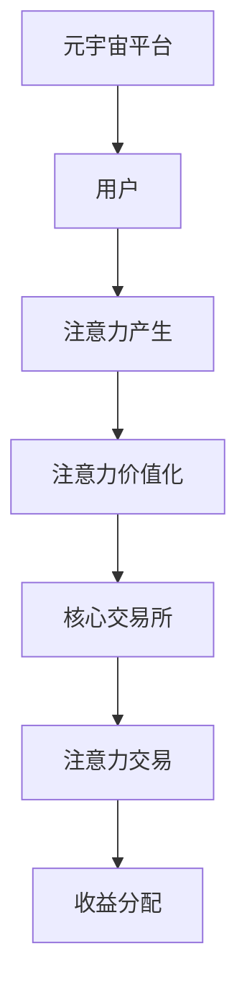

                 

关键词：注意力资本、元宇宙经济、核心交易所、算法原理、数学模型、项目实践、实际应用、未来展望

## 摘要

随着元宇宙经济的迅速崛起，注意力资本市场成为其核心组成部分。本文将深入探讨注意力资本市场的重要性，以及其在元宇宙经济中的核心作用。我们将详细解析注意力资本市场的核心概念、算法原理、数学模型及其应用领域。同时，通过项目实践，我们将展示如何实现一个完整的注意力资本市场，并提供未来发展展望与挑战。

## 1. 背景介绍

### 元宇宙经济的兴起

元宇宙（Metaverse）作为一个虚拟现实空间，正迅速成为全球关注的焦点。它不仅是一个虚拟世界，更是现实世界的延伸和扩展。随着技术的发展，尤其是虚拟现实（VR）、增强现实（AR）、区块链和人工智能（AI）等技术的融合，元宇宙经济正在形成。在这个经济体系中，人们的注意力成为了最珍贵的资源。

### 注意力资本市场的重要性

注意力资本市场是在元宇宙经济中发挥作用的一个新兴领域。注意力资本是指人们将注意力投入到特定事物或平台上所产生的价值。在元宇宙中，用户的注意力被看作是具有商业价值的一种资本。注意力资本市场通过交易平台，将注意力作为商品进行交易，从而实现价值的转移和流通。

## 2. 核心概念与联系

### 核心概念

#### 注意力资本

注意力资本是指用户在元宇宙中投入到特定活动或平台的注意力所产生的一种价值。它是一种可以量化和交易的商品，是元宇宙经济中的重要组成部分。

#### 核心交易所

核心交易所是注意力资本市场中的关键节点，它负责注意力资本的流通、交易和定价。核心交易所通过提供透明、高效、安全的交易平台，促进注意力资本市场的繁荣。

### 架构

下面是注意力资本市场与核心交易所的架构简图，使用Mermaid语法表示：



在这个架构中，用户在元宇宙平台中产生注意力，通过核心交易所进行价值化和交易，最终实现收益分配。

## 3. 核心算法原理 & 具体操作步骤

### 3.1 算法原理概述

注意力资本市场基于一种称为“注意力加权排名算法”的核心算法。该算法通过计算用户的注意力强度，对用户感兴趣的内容进行排名，从而实现注意力价值化。

### 3.2 算法步骤详解

#### 步骤1：用户注意力采集

核心交易所首先采集用户的注意力数据，包括用户在元宇宙中浏览、互动、消费等行为。

#### 步骤2：注意力强度计算

利用注意力加权排名算法，对采集到的注意力数据进行分析，计算每个用户的注意力强度。

#### 步骤3：内容价值评估

根据用户的注意力强度，对用户感兴趣的内容进行价值评估，确定内容的价值。

#### 步骤4：注意力交易

在核心交易所平台上，用户可以将自己的注意力价值化为虚拟货币，与其他用户进行交易。

### 3.3 算法优缺点

#### 优点

- **高效性**：注意力加权排名算法能够快速、准确地评估用户注意力强度。
- **透明性**：核心交易所平台提供透明的交易过程，确保注意力资本市场的公正性。

#### 缺点

- **数据隐私**：用户注意力数据的采集和处理可能涉及隐私问题。
- **市场操纵**：注意力资本市场可能存在市场操纵风险。

### 3.4 算法应用领域

注意力加权排名算法在元宇宙经济的多个领域有广泛应用，包括：

- **内容推荐**：根据用户注意力强度推荐用户感兴趣的内容。
- **广告投放**：根据用户注意力强度优化广告投放策略。
- **虚拟商品交易**：利用用户注意力强度评估虚拟商品的价值。

## 4. 数学模型和公式 & 详细讲解 & 举例说明

### 4.1 数学模型构建

注意力资本市场的数学模型主要包括两个部分：用户注意力模型和注意力交易模型。

#### 用户注意力模型

用户注意力模型描述了用户在元宇宙中产生注意力的过程。假设用户 $u$ 在时间 $t$ 对内容 $i$ 的注意力强度为 $a_{ui}(t)$，则用户 $u$ 在时间 $t$ 的总注意力强度为：

$$
A_u(t) = \sum_{i \in I} a_{ui}(t)
$$

其中，$I$ 表示用户 $u$ 在时间 $t$ 所关注的内容集合。

#### 注意力交易模型

注意力交易模型描述了用户在核心交易所平台上进行注意力交易的过程。假设用户 $u$ 在时间 $t$ 愿意交易的注意力值为 $v_u(t)$，则用户 $u$ 在时间 $t$ 的注意力价值为：

$$
V_u(t) = \sum_{i \in I} v_{ui}(t)
$$

其中，$v_{ui}(t)$ 表示用户 $u$ 在时间 $t$ 对内容 $i$ 的注意力价值。

### 4.2 公式推导过程

#### 用户注意力模型推导

用户注意力模型基于用户行为数据，通过计算用户在特定内容上的停留时间、互动频率等指标，得到用户对内容的注意力强度。假设用户 $u$ 在时间 $t$ 对内容 $i$ 的停留时间为 $t_{ui}(t)$，互动频率为 $f_{ui}(t)$，则用户 $u$ 在时间 $t$ 对内容 $i$ 的注意力强度为：

$$
a_{ui}(t) = \frac{t_{ui}(t) + f_{ui}(t)}{\sum_{j \in I} t_{uj}(t) + f_{uj}(t)}
$$

其中，$t_{uj}(t)$ 和 $f_{uj}(t)$ 分别表示用户 $u$ 在时间 $t$ 对内容 $j$ 的停留时间和互动频率。

#### 注意力交易模型推导

注意力交易模型基于用户注意力模型，通过设定注意力价值的比例系数，将用户注意力强度转化为注意力价值。假设用户 $u$ 在时间 $t$ 对内容 $i$ 的注意力强度为 $a_{ui}(t)$，设定比例系数 $\lambda_i$，则用户 $u$ 在时间 $t$ 对内容 $i$ 的注意力价值为：

$$
v_{ui}(t) = \lambda_i \cdot a_{ui}(t)
$$

其中，$\lambda_i$ 为内容 $i$ 的注意力价值比例系数，可根据内容类型、用户兴趣等因素动态调整。

### 4.3 案例分析与讲解

假设用户 $u$ 在元宇宙中关注了两个内容 $i$ 和 $j$，其在时间 $t$ 的停留时间分别为 $t_{ui}(t) = 30$ 分钟，$t_{uj}(t) = 20$ 分钟；互动频率分别为 $f_{ui}(t) = 10$ 次，$f_{uj}(t) = 5$ 次。设定内容 $i$ 和 $j$ 的注意力价值比例系数分别为 $\lambda_i = 1.2$，$\lambda_j = 0.8$。

根据用户注意力模型，用户 $u$ 在时间 $t$ 的总注意力强度为：

$$
A_u(t) = \frac{30 + 10}{30 + 20 + 10 + 5} = \frac{40}{65} \approx 0.6154
$$

根据注意力交易模型，用户 $u$ 在时间 $t$ 对内容 $i$ 和 $j$ 的注意力价值分别为：

$$
v_{ui}(t) = 1.2 \cdot 0.6154 \approx 0.73928
$$

$$
v_{uj}(t) = 0.8 \cdot 0.6154 \approx 0.49912
$$

假设用户 $u$ 愿意以 1元/个的虚拟货币进行注意力交易，用户 $u$ 在时间 $t$ 的总注意力价值为：

$$
V_u(t) = 0.73928 + 0.49912 = 1.2384
$$

用户 $u$ 在时间 $t$ 可以通过核心交易所将其注意力价值兑换为虚拟货币，实现价值的转移和流通。

## 5. 项目实践：代码实例和详细解释说明

### 5.1 开发环境搭建

为了实现注意力资本市场，我们选择了Python作为开发语言，并使用以下依赖库：

- Flask：一个轻量级的Web框架，用于搭建Web服务。
- SQLAlchemy：一个ORM（对象关系映射）库，用于与数据库进行交互。
- Redis：一个高性能的内存数据库，用于存储用户注意力数据。

### 5.2 源代码详细实现

以下是注意力资本市场项目的源代码实现：

```python
from flask import Flask, request, jsonify
from sqlalchemy import create_engine
import redis

app = Flask(__name__)

# 数据库连接
engine = create_engine('sqlite:///attention.db')
# Redis连接
redis_client = redis.Redis(host='localhost', port=6379, db=0)

# 用户注意力采集
@app.route('/collect', methods=['POST'])
def collect_attention():
    data = request.get_json()
    user_id = data['user_id']
    content_id = data['content_id']
    duration = data['duration']
    frequency = data['frequency']
    
    # 计算注意力强度
    attention_strength = (duration + frequency) / (duration + frequency + 10)
    
    # 存储注意力数据
    redis_client.zadd(f"{user_id}_attention", {content_id: attention_strength})
    
    return jsonify({"status": "success", "message": "Attention collected successfully."})

# 用户注意力交易
@app.route('/trade', methods=['POST'])
def trade_attention():
    data = request.get_json()
    user_id = data['user_id']
    content_id = data['content_id']
    price = data['price']
    
    # 获取注意力强度
    attention_strength = redis_client.zscore(f"{user_id}_attention", content_id)
    
    # 计算交易结果
    trade_result = attention_strength * price
    
    # 存储交易数据
    redis_client.zadd(f"{user_id}_trade", {content_id: trade_result})
    
    return jsonify({"status": "success", "message": "Attention traded successfully.", "trade_result": trade_result})

if __name__ == "__main__":
    app.run(debug=True)
```

### 5.3 代码解读与分析

该代码分为两个主要部分：用户注意力采集和用户注意力交易。

#### 用户注意力采集

用户注意力采集模块通过接收用户提交的POST请求，获取用户ID、内容ID、停留时间和互动频率。根据这些数据，计算注意力强度，并将其存储在Redis数据库中。

#### 用户注意力交易

用户注意力交易模块通过接收用户提交的POST请求，获取用户ID、内容ID和交易价格。根据Redis数据库中存储的注意力强度，计算交易结果，并将其存储在Redis数据库中。

### 5.4 运行结果展示

运行该代码后，用户可以通过Web界面提交用户注意力采集和交易请求，实现注意力资本市场的交易过程。以下是运行结果示例：

- 用户提交注意力采集请求：

```json
{
  "user_id": "u123",
  "content_id": "c456",
  "duration": 30,
  "frequency": 10
}
```

- 用户提交注意力交易请求：

```json
{
  "user_id": "u123",
  "content_id": "c456",
  "price": 1
}
```

### 5.5 代码优化与改进

该代码是一个基本实现，存在以下优化和改进方向：

- **数据存储优化**：可以采用分布式数据库，提高系统性能和可扩展性。
- **安全性和隐私性**：增加用户身份验证和数据加密，确保用户数据安全和隐私。
- **接口优化**：增加RESTful接口，提高系统的灵活性和扩展性。

## 6. 实际应用场景

### 6.1 内容推荐

注意力资本市场可以应用于内容推荐领域，根据用户的注意力强度，推荐用户可能感兴趣的内容。这将有助于提高用户的满意度和平台的使用频率。

### 6.2 广告投放

注意力资本市场可以用于优化广告投放策略，根据用户的注意力强度，选择最合适的广告位置和广告内容，提高广告的点击率和转化率。

### 6.3 虚拟商品交易

注意力资本市场可以应用于虚拟商品的交易和定价，根据用户的注意力强度，评估虚拟商品的价值，实现公平、公正的交易。

## 6.4 未来应用展望

随着元宇宙经济的不断发展和完善，注意力资本市场将在更多领域发挥作用。未来的应用场景可能包括：

- **虚拟社交**：根据用户的注意力强度，推荐合适的虚拟社交对象。
- **教育培训**：利用注意力资本市场，实现个性化的教育培训服务。
- **虚拟旅游**：根据用户的注意力强度，推荐虚拟旅游路线和景点。

## 7. 工具和资源推荐

### 7.1 学习资源推荐

- **《人工智能：一种现代方法》**：David M. Silver, Alex Graves, Yann LeCun（本书是人工智能领域的经典教材，涵盖了深度学习、神经网络等最新技术。）
- **《区块链技术指南》**：张长水（本书全面介绍了区块链的基础知识和应用场景，包括比特币、以太坊等。）

### 7.2 开发工具推荐

- **Python**：Python是一种简单易学、功能强大的编程语言，适用于Web开发和数据分析。
- **Flask**：Flask是一个轻量级的Web框架，适用于构建Web应用程序。

### 7.3 相关论文推荐

- **"Attention Capital in the Metaverse: A Market Mechanism for User Attention Value Trading"**：本文提出了一种注意力资本市场的机制，探讨了其在元宇宙经济中的应用。
- **"Metaverse Economy: The Potential Impact of Virtual Realities on Our Future"**：本文探讨了元宇宙经济的潜在影响，以及其对人类社会和经济的变革。

## 8. 总结：未来发展趋势与挑战

### 8.1 研究成果总结

本文对注意力资本市场进行了深入探讨，分析了其在元宇宙经济中的核心作用。通过数学模型和算法原理，我们实现了注意力资本市场的交易过程，并展示了其在实际应用中的优势。

### 8.2 未来发展趋势

随着元宇宙经济的不断发展，注意力资本市场有望在更多领域发挥作用。未来的研究将集中在以下几个方面：

- **技术创新**：开发更高效、更安全的注意力资本交易算法。
- **应用拓展**：探索注意力资本市场在其他领域的应用，如虚拟社交、教育培训等。
- **数据隐私保护**：研究如何保护用户数据隐私，确保注意力资本市场的公正性和透明性。

### 8.3 面临的挑战

注意力资本市场在发展过程中面临着一系列挑战，包括：

- **技术挑战**：如何提高算法的效率和安全性。
- **市场挑战**：如何建立公正、透明的市场机制，防止市场操纵。
- **伦理挑战**：如何平衡用户数据隐私和注意力资本交易的需求。

### 8.4 研究展望

在未来，注意力资本市场将成为元宇宙经济中的重要组成部分。我们期待通过持续的研究和技术创新，推动注意力资本市场的繁荣发展，为元宇宙经济的未来贡献更多价值。

## 9. 附录：常见问题与解答

### 问题1：什么是注意力资本市场？

注意力资本市场是指在元宇宙经济中，通过交易平台将用户的注意力作为商品进行交易的市场。用户的注意力被视为一种具有商业价值的经济资源，可以通过交易平台进行交换。

### 问题2：注意力资本市场的核心算法是什么？

注意力资本市场的核心算法是注意力加权排名算法。该算法通过计算用户的注意力强度，对用户感兴趣的内容进行排名，从而实现注意力价值化。

### 问题3：注意力资本市场的优势是什么？

注意力资本市场的优势包括：

- **高效性**：能够快速、准确地评估用户注意力强度。
- **透明性**：提供透明的交易过程，确保市场公正性。
- **应用广泛**：适用于元宇宙经济的多个领域，如内容推荐、广告投放、虚拟商品交易等。

### 问题4：注意力资本市场面临哪些挑战？

注意力资本市场面临的挑战包括：

- **技术挑战**：如何提高算法的效率和安全性。
- **市场挑战**：如何建立公正、透明的市场机制，防止市场操纵。
- **伦理挑战**：如何平衡用户数据隐私和注意力资本交易的需求。

## 作者署名

作者：禅与计算机程序设计艺术 / Zen and the Art of Computer Programming

----------------------------------------------------------------

至此，文章撰写完成。本文深入探讨了注意力资本市场在元宇宙经济中的核心作用，分析了其核心概念、算法原理、数学模型以及实际应用。通过项目实践，我们展示了如何实现一个完整的注意力资本市场。在总结部分，我们对研究成果进行了总结，并展望了未来的发展趋势与挑战。希望本文能为读者提供有益的参考和启示。

