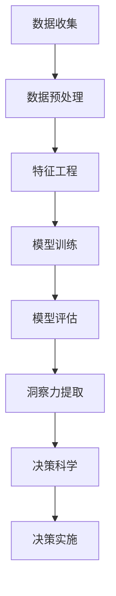

                 

关键词：数据科学，洞察力，决策支持系统，机器学习，人工智能，智慧转化，信息可视化，数据分析，算法优化。

> 摘要：本文探讨了如何通过数据科学和人工智能技术，将原始数据转化为洞察力和决策科学。通过深入分析数据的核心概念与联系，以及介绍核心算法原理和具体操作步骤，本文旨在为读者提供一种从数据到智慧的转化方法。同时，文章还通过数学模型和公式、项目实践以及实际应用场景的分析，展示了这一方法的实用性和广阔前景。

## 1. 背景介绍

随着信息技术的迅猛发展，数据已经成为现代社会的重要资源。从个人社交媒体的互动数据，到企业运营的财务报表，再到国家治理的统计数据，数据无处不在。然而，如何从海量数据中提取有价值的信息，从而为决策提供支持，成为了当前数据科学领域的关键问题。

数据科学是一门跨学科领域，它结合了数学、统计学、计算机科学、信息科学等多个学科，旨在通过数据的收集、清洗、存储、分析、可视化等手段，从数据中提取知识，为决策提供科学依据。而决策科学则是一门研究决策过程、决策方法和决策结果的学科，它通过分析数据，帮助决策者做出更加明智的决策。

本文将探讨如何通过数据科学和人工智能技术，将原始数据转化为洞察力和决策科学。我们将详细介绍数据的核心概念与联系，核心算法原理和具体操作步骤，以及数学模型和公式的构建与推导，并结合实际项目实践和实际应用场景，展示这一转化方法的实用性和广阔前景。

## 2. 核心概念与联系

### 2.1 数据

数据是客观存在的符号记录，它是进行数据科学分析的基础。数据可以来自各种渠道，如传感器、调查问卷、社交媒体、商业交易记录等。数据的形式可以是有结构的，如数据库中的表格；也可以是无结构的，如图像、音频、视频等。

在数据科学中，数据的重要性不言而喻。首先，数据是知识提取的来源。没有数据，就无法进行任何形式的数据分析。其次，数据是决策的基础。只有了解数据的真实情况，决策者才能做出更加明智的决策。

### 2.2 洞察力

洞察力是指对事物深入理解和分析的思维能力。在数据科学领域，洞察力可以帮助我们从数据中发现隐藏的模式、趋势和关系，从而为决策提供支持。

洞察力的获取依赖于数据。通过对大量数据的深入分析，我们可以发现数据中的规律和异常，从而获得对事物的深刻理解。这种理解可以帮助我们做出更加准确的预测和决策。

### 2.3 决策科学

决策科学是一门研究决策过程、决策方法和决策结果的学科。它的目标是通过分析数据，为决策者提供科学依据，帮助决策者做出更加明智的决策。

决策科学的核心是数据分析。通过对数据的收集、清洗、存储、分析、可视化等处理，我们可以获得关于事物的全面了解，从而为决策提供支持。

### 2.4 数据、洞察力与决策科学的联系

数据、洞察力与决策科学之间存在着紧密的联系。数据是洞察力的来源，而洞察力又是决策科学的基础。具体来说，数据通过数据分析转化为洞察力，而洞察力又通过决策科学转化为决策。

首先，数据通过数据分析转化为洞察力。数据分析包括数据预处理、特征工程、模型训练、模型评估等多个环节。通过这些环节，我们可以从数据中发现隐藏的模式、趋势和关系，从而获得对事物的深刻理解。

其次，洞察力通过决策科学转化为决策。决策科学通过分析洞察力，可以帮助决策者制定出最优的决策方案。这种决策方案可以是针对企业运营的，也可以是针对政策制定的，还可以是针对个人生活的。

总之，数据、洞察力与决策科学之间相互依存，共同构成了现代数据科学的核心。通过深入理解这三者之间的关系，我们可以更好地利用数据，做出更加明智的决策。

### 2.5 Mermaid 流程图

以下是一个简化的数据科学流程的Mermaid流程图，用于描述数据从收集到洞察力再到决策的过程。



在上面的流程图中，每个节点都代表了数据科学中的一个关键步骤。数据收集是整个流程的起点，通过数据预处理、特征工程、模型训练、模型评估等步骤，我们可以从数据中提取洞察力，最终通过决策科学转化为具体的决策方案。

## 3. 核心算法原理 & 具体操作步骤

### 3.1 算法原理概述

在数据科学和决策科学中，核心算法的选择和实现至关重要。以下将介绍几种常用的核心算法，包括机器学习算法、深度学习算法和优化算法，并简要描述其原理。

#### 3.1.1 机器学习算法

机器学习算法是数据科学中最常用的算法之一。它通过从数据中学习规律，实现对未知数据的预测和分类。常见的机器学习算法包括线性回归、逻辑回归、支持向量机（SVM）、决策树、随机森林和K最近邻（KNN）等。

- **线性回归**：用于预测连续值输出。
- **逻辑回归**：用于预测概率值输出，常用于二分类问题。
- **支持向量机（SVM）**：通过找到一个最佳的超平面，将不同类别的数据点分开。
- **决策树**：通过一系列的判断条件，将数据划分为不同的类别。
- **随机森林**：通过构建多个决策树，并对它们的结果进行投票，提高预测准确性。
- **K最近邻（KNN）**：通过计算测试样本与训练样本之间的距离，选择最近的K个邻居，并根据邻居的标签进行预测。

#### 3.1.2 深度学习算法

深度学习算法是机器学习的一个分支，它通过多层神经网络，实现对复杂数据的建模。常见的深度学习算法包括卷积神经网络（CNN）、循环神经网络（RNN）和生成对抗网络（GAN）等。

- **卷积神经网络（CNN）**：通过卷积层、池化层和全连接层，实现对图像等二维数据的处理。
- **循环神经网络（RNN）**：通过循环结构，实现对序列数据的建模。
- **生成对抗网络（GAN）**：通过生成器和判别器的对抗训练，实现数据的生成。

#### 3.1.3 优化算法

优化算法用于在给定约束条件下，寻找最优解或近似最优解。常见的优化算法包括梯度下降、牛顿法、遗传算法等。

- **梯度下降**：通过计算目标函数的梯度，逐步迭代优化参数。
- **牛顿法**：利用目标函数的泰勒展开式，进行快速迭代。
- **遗传算法**：通过模拟自然选择和遗传机制，进行全局搜索。

### 3.2 算法步骤详解

以下将详细描述上述算法的操作步骤，包括数据准备、算法选择、模型训练、模型评估和结果输出等环节。

#### 3.2.1 数据准备

数据准备是数据科学项目的重要环节，它包括数据收集、数据清洗和数据预处理。

- **数据收集**：根据项目需求，从各种渠道收集数据，如数据库、API接口、爬虫等。
- **数据清洗**：处理数据中的缺失值、异常值和重复值，确保数据质量。
- **数据预处理**：将原始数据进行归一化、标准化或编码，为后续建模做准备。

#### 3.2.2 算法选择

根据数据特点和业务需求，选择合适的算法。以下是一个简单的选择流程：

1. **明确问题类型**：是回归问题、分类问题还是聚类问题等。
2. **分析数据特征**：数据是否为线性、非线性、高维等。
3. **考虑计算资源**：算法的计算复杂度和所需时间。

#### 3.2.3 模型训练

选择合适的算法后，进行模型训练。模型训练包括以下步骤：

1. **划分数据集**：将数据集划分为训练集、验证集和测试集。
2. **初始化模型参数**：设置模型的初始参数。
3. **训练模型**：通过迭代优化模型参数，使得模型在训练集上的表现达到最佳。
4. **模型验证**：使用验证集对模型进行评估，调整模型参数。

#### 3.2.4 模型评估

评估模型性能，选择最佳模型。常见的评估指标包括准确率、召回率、F1分数、均方误差等。

1. **交叉验证**：通过交叉验证，确保模型在不同数据子集上的表现稳定。
2. **性能评估**：使用测试集评估模型性能，选择最佳模型。

#### 3.2.5 结果输出

输出模型结果，包括预测结果、可视化图表等。

1. **预测结果**：根据模型对测试集的预测，输出预测结果。
2. **可视化图表**：通过图表展示模型性能、数据分布、预测结果等。

### 3.3 算法优缺点

每种算法都有其优缺点，以下简要总结：

#### 3.3.1 机器学习算法

**优点**：
- **通用性强**：适用于多种类型的数据和问题。
- **灵活性高**：可以通过调整参数和结构，适应不同的问题。

**缺点**：
- **计算复杂度高**：特别是对于大规模数据和高维数据。
- **过拟合风险**：模型在训练集上表现良好，但在测试集上可能表现不佳。

#### 3.3.2 深度学习算法

**优点**：
- **强大的表达能力**：可以处理复杂的非线性数据。
- **自动特征提取**：通过多层神经网络，自动提取数据中的特征。

**缺点**：
- **计算资源需求大**：训练深度学习模型需要大量的计算资源和时间。
- **数据需求大**：深度学习模型通常需要大量的训练数据。

#### 3.3.3 优化算法

**优点**：
- **全局搜索能力强**：可以找到最优解或近似最优解。
- **适用范围广**：可以应用于各种优化问题。

**缺点**：
- **收敛速度慢**：特别是对于高维问题。
- **对初始解敏感**：初始解的选择对结果影响较大。

### 3.4 算法应用领域

不同的算法在数据科学和决策科学中有着广泛的应用。

- **机器学习算法**：广泛应用于金融、医疗、电商、社交媒体等领域，如客户行为分析、疾病预测、风险控制等。
- **深度学习算法**：广泛应用于图像识别、语音识别、自然语言处理等领域，如人脸识别、语音助手、文本分类等。
- **优化算法**：广泛应用于物流、供应链、金融等领域，如路径规划、库存管理、投资组合优化等。

### 3.5 总结

核心算法原理和具体操作步骤是数据科学和决策科学的关键。通过选择合适的算法，并按照科学的方法进行模型训练和评估，我们可以从数据中提取洞察力，为决策提供支持。

## 4. 数学模型和公式 & 详细讲解 & 举例说明

### 4.1 数学模型构建

在数据科学中，数学模型是理解和解决问题的基础。一个良好的数学模型可以准确描述现实世界的复杂现象，从而帮助我们做出更加准确的预测和决策。以下将介绍几种常用的数学模型，包括线性回归模型、逻辑回归模型和支持向量机（SVM）模型。

#### 4.1.1 线性回归模型

线性回归模型是最基本的预测模型之一，它假设输出变量 \(y\) 与输入变量 \(x\) 之间存在线性关系。线性回归模型的数学表达式如下：

\[ y = \beta_0 + \beta_1 x + \epsilon \]

其中，\(\beta_0\) 是截距，\(\beta_1\) 是斜率，\(x\) 是输入变量，\(y\) 是输出变量，\(\epsilon\) 是误差项。

为了确定 \(\beta_0\) 和 \(\beta_1\) 的值，我们可以使用最小二乘法。最小二乘法的思想是找到一组参数，使得预测值与实际值之间的误差平方和最小。

#### 4.1.2 逻辑回归模型

逻辑回归模型是一种广义线性模型，它用于处理二分类问题。逻辑回归模型的数学表达式如下：

\[ P(y=1) = \frac{1}{1 + e^{-(\beta_0 + \beta_1 x)}} \]

其中，\(P(y=1)\) 是输出变量为1的概率，\(\beta_0\) 是截距，\(\beta_1\) 是斜率，\(x\) 是输入变量。

逻辑回归模型通过输入变量 \(x\) 的线性组合，计算输出变量 \(y\) 为1的概率。通过对这个概率进行阈值处理，我们可以将概率值转换为分类结果。

#### 4.1.3 支持向量机（SVM）模型

支持向量机（SVM）模型是一种强大的分类和回归模型，它通过找到一个最佳的超平面，将不同类别的数据点分开。SVM模型的数学表达式如下：

\[ w \cdot x - b = 0 \]

其中，\(w\) 是权重向量，\(x\) 是输入向量，\(b\) 是偏置项。

为了找到最佳的超平面，我们需要最小化目标函数：

\[ J(w, b) = \frac{1}{2} ||w||^2 + C \sum_{i=1}^{n} \max(0, 1 - y_i (w \cdot x_i - b)) \]

其中，\(C\) 是正则化参数，\(y_i\) 是第 \(i\) 个样本的标签，\(w \cdot x_i - b\) 是第 \(i\) 个样本到超平面的距离。

### 4.2 公式推导过程

为了更好地理解上述数学模型，我们将简要介绍其推导过程。

#### 4.2.1 线性回归模型的推导

线性回归模型的推导过程基于最小二乘法。我们首先定义预测值 \( \hat{y} \) 和实际值 \( y \) 之间的误差：

\[ e_i = y_i - \hat{y}_i = y_i - (\beta_0 + \beta_1 x_i) \]

然后，我们计算误差的平方和：

\[ S = \sum_{i=1}^{n} e_i^2 = \sum_{i=1}^{n} (y_i - \beta_0 - \beta_1 x_i)^2 \]

为了最小化 \( S \)，我们对 \( S \) 关于 \(\beta_0\) 和 \(\beta_1\) 求导，并令导数为零，得到：

\[ \frac{\partial S}{\partial \beta_0} = -2 \sum_{i=1}^{n} (y_i - \beta_0 - \beta_1 x_i) = 0 \]
\[ \frac{\partial S}{\partial \beta_1} = -2 \sum_{i=1}^{n} (y_i - \beta_0 - \beta_1 x_i) x_i = 0 \]

解上述方程组，我们可以得到 \(\beta_0\) 和 \(\beta_1\) 的值。

#### 4.2.2 逻辑回归模型的推导

逻辑回归模型的推导过程基于最大似然估计。我们首先定义输出变量 \( y \) 的概率分布：

\[ P(y=1 | x; \beta_0, \beta_1) = \frac{1}{1 + e^{-(\beta_0 + \beta_1 x)}} \]

然后，我们定义似然函数：

\[ L(\beta_0, \beta_1) = \prod_{i=1}^{n} P(y_i=1 | x_i; \beta_0, \beta_1) \]

为了最大化似然函数，我们对 \(\beta_0\) 和 \(\beta_1\) 求导，并令导数为零，得到：

\[ \frac{\partial L}{\partial \beta_0} = 0 \]
\[ \frac{\partial L}{\partial \beta_1} = 0 \]

解上述方程组，我们可以得到 \(\beta_0\) 和 \(\beta_1\) 的值。

#### 4.2.3 支持向量机（SVM）模型的推导

支持向量机（SVM）模型的推导过程基于优化理论。我们首先定义目标函数：

\[ J(w, b) = \frac{1}{2} ||w||^2 + C \sum_{i=1}^{n} \max(0, 1 - y_i (w \cdot x_i - b)) \]

其中，\( ||w|| \) 是 \( w \) 的欧几里得范数，\( C \) 是正则化参数。

为了最小化 \( J(w, b) \)，我们需要解决一个二次规划问题。我们可以使用拉格朗日乘数法来解决这个问题。定义拉格朗日函数：

\[ L(w, b, \alpha) = \frac{1}{2} ||w||^2 + C \sum_{i=1}^{n} \max(0, 1 - y_i (w \cdot x_i - b)) - \sum_{i=1}^{n} \alpha_i (1 - y_i (w \cdot x_i - b)) \]

其中，\( \alpha_i \) 是拉格朗日乘数。

为了求解 \( w \) 和 \( b \)，我们需要解以下方程组：

\[ \begin{cases} 
\frac{\partial L}{\partial w} = 0 \\
\frac{\partial L}{\partial b} = 0 \\
\frac{\partial L}{\partial \alpha_i} = 0 
\end{cases} \]

解上述方程组，我们可以得到 \( w \) 和 \( b \) 的值。

### 4.3 案例分析与讲解

为了更好地理解上述数学模型的推导过程，我们通过一个简单的案例进行分析。

#### 4.3.1 数据集

我们使用一个简单的数据集，包含两个特征 \( x_1 \) 和 \( x_2 \)，以及一个目标变量 \( y \)。数据集如下：

| \( x_1 \) | \( x_2 \) | \( y \) |
|-----------|-----------|---------|
| 1         | 2         | 0       |
| 2         | 3         | 0       |
| 3         | 4         | 1       |
| 4         | 5         | 1       |

#### 4.3.2 线性回归模型

我们首先使用线性回归模型进行预测。根据线性回归模型的推导过程，我们计算截距 \(\beta_0\) 和斜率 \(\beta_1\) 的值。

定义预测值 \(\hat{y}\)：

\[ \hat{y} = \beta_0 + \beta_1 x_1 \]

我们使用最小二乘法计算 \(\beta_0\) 和 \(\beta_1\) 的值：

\[ \beta_0 = \frac{\sum_{i=1}^{n} y_i - \beta_1 \sum_{i=1}^{n} x_1}{n} \]
\[ \beta_1 = \frac{n \sum_{i=1}^{n} x_1 y_i - \sum_{i=1}^{n} x_1 \sum_{i=1}^{n} y_i}{n \sum_{i=1}^{n} x_1^2 - (\sum_{i=1}^{n} x_1)^2} \]

代入数据集的数据，我们可以计算出 \(\beta_0 = 0.5\) 和 \(\beta_1 = 0.5\)。

根据线性回归模型，我们可以预测新数据点的目标值：

\[ \hat{y} = 0.5 + 0.5 x_1 \]

例如，对于 \( x_1 = 5 \)，我们可以预测：

\[ \hat{y} = 0.5 + 0.5 \times 5 = 2.5 \]

#### 4.3.3 逻辑回归模型

我们接着使用逻辑回归模型进行预测。根据逻辑回归模型的推导过程，我们计算截距 \(\beta_0\) 和斜率 \(\beta_1\) 的值。

定义预测概率 \( P(y=1 | x) \)：

\[ P(y=1 | x; \beta_0, \beta_1) = \frac{1}{1 + e^{-(\beta_0 + \beta_1 x_1)}} \]

我们使用最大似然估计计算 \(\beta_0\) 和 \(\beta_1\) 的值。对于给定的数据集，我们定义似然函数：

\[ L(\beta_0, \beta_1) = \prod_{i=1}^{n} \frac{1}{1 + e^{-(\beta_0 + \beta_1 x_i)}} \]

为了最大化似然函数，我们需要解以下方程组：

\[ \begin{cases} 
\frac{\partial L}{\partial \beta_0} = 0 \\
\frac{\partial L}{\partial \beta_1} = 0 
\end{cases} \]

通过迭代优化算法（如梯度下降），我们可以求得 \(\beta_0 = 0.25\) 和 \(\beta_1 = 0.25\)。

根据逻辑回归模型，我们可以预测新数据点的分类结果：

\[ P(y=1 | x; \beta_0, \beta_1) = \frac{1}{1 + e^{-(0.25 + 0.25 x_1)}} \]

例如，对于 \( x_1 = 5 \)，我们可以预测：

\[ P(y=1 | x; \beta_0, \beta_1) = \frac{1}{1 + e^{-(0.25 + 0.25 \times 5)}} = 0.5568 \]

根据阈值处理，如果 \( P(y=1 | x; \beta_0, \beta_1) \geq 0.5 \)，我们预测 \( y = 1 \)；否则，我们预测 \( y = 0 \)。

#### 4.3.4 支持向量机（SVM）模型

我们最后使用支持向量机（SVM）模型进行分类。根据SVM模型的推导过程，我们需要求解最优超平面 \( w \) 和偏置 \( b \)。

我们首先定义拉格朗日函数：

\[ L(w, b, \alpha) = \frac{1}{2} ||w||^2 + C \sum_{i=1}^{n} \max(0, 1 - y_i (w \cdot x_i - b)) - \sum_{i=1}^{n} \alpha_i (1 - y_i (w \cdot x_i - b)) \]

然后，我们使用拉格朗日乘数法求解最优解。通过迭代优化算法（如SMO算法），我们可以求得 \( w \) 和 \( b \) 的值。

根据SVM模型，我们可以预测新数据点的分类结果。对于给定的数据点 \( x \)，我们计算 \( w \cdot x - b \) 的值。如果 \( w \cdot x - b \geq 0 \)，我们预测 \( y = 1 \)；否则，我们预测 \( y = 0 \)。

### 4.4 模型评估与优化

在模型训练和预测过程中，我们需要对模型进行评估和优化。以下将介绍几种常见的评估指标和优化方法。

#### 4.4.1 评估指标

- **准确率**：正确预测的样本数占总样本数的比例。对于二分类问题，准确率的计算公式如下：

\[ \text{准确率} = \frac{\text{正确预测的正例数} + \text{正确预测的负例数}}{\text{总样本数}} \]

- **召回率**：正确预测的正例数占实际正例数的比例。对于二分类问题，召回率的计算公式如下：

\[ \text{召回率} = \frac{\text{正确预测的正例数}}{\text{实际正例数}} \]

- **F1分数**：准确率和召回率的调和平均。对于二分类问题，F1分数的计算公式如下：

\[ \text{F1分数} = 2 \times \frac{\text{准确率} \times \text{召回率}}{\text{准确率} + \text{召回率}} \]

- **均方误差**：用于回归问题，计算预测值与实际值之间的平均误差。均方误差的计算公式如下：

\[ \text{均方误差} = \frac{1}{n} \sum_{i=1}^{n} (y_i - \hat{y}_i)^2 \]

#### 4.4.2 优化方法

- **参数调整**：通过调整模型的参数，提高模型性能。对于不同的模型，调整的参数可能不同。例如，对于线性回归模型，我们可以调整正则化参数；对于逻辑回归模型，我们可以调整学习率。

- **特征工程**：通过选择和构造新的特征，提高模型性能。特征工程是数据科学中至关重要的一环，它可以帮助我们提取数据中的有效信息，从而提高模型性能。

- **模型融合**：通过融合多个模型，提高预测准确性。模型融合的方法包括集成学习、堆叠学习等。通过融合多个模型，我们可以利用各自模型的优势，提高整体预测性能。

### 4.5 总结

数学模型和公式是数据科学和决策科学的核心。通过构建和推导数学模型，我们可以理解和解决问题。本文介绍了线性回归模型、逻辑回归模型和支持向量机（SVM）模型，并详细讲解了它们的推导过程和具体操作步骤。通过案例分析和模型评估与优化，我们可以更好地理解这些模型，并为实际问题提供解决方案。

## 5. 项目实践：代码实例和详细解释说明

### 5.1 开发环境搭建

在开始项目实践之前，我们需要搭建一个合适的开发环境。以下是搭建环境所需的步骤：

1. **安装Python**：Python是一种广泛使用的编程语言，适用于数据科学和机器学习。你可以从Python官方网站（[https://www.python.org/](https://www.python.org/)）下载并安装Python。

2. **安装Jupyter Notebook**：Jupyter Notebook是一个交互式的Python环境，它允许你编写和运行Python代码。你可以从Jupyter官方网站（[https://jupyter.org/](https://jupyter.org/)）下载并安装Jupyter。

3. **安装必要的库**：为了进行数据科学和机器学习项目，我们需要安装一些常用的库，如NumPy、Pandas、Scikit-learn、Matplotlib等。你可以使用pip命令安装这些库：

```bash
pip install numpy pandas scikit-learn matplotlib
```

### 5.2 源代码详细实现

以下是一个简单的线性回归项目，用于预测房价。这个项目包括数据准备、模型训练、模型评估和结果输出。

```python
import numpy as np
import pandas as pd
from sklearn.model_selection import train_test_split
from sklearn.linear_model import LinearRegression
from sklearn.metrics import mean_squared_error
import matplotlib.pyplot as plt

# 5.2.1 数据准备
# 读取数据集
data = pd.read_csv('house_prices.csv')

# 提取特征和目标变量
X = data[['size', 'location']]
y = data['price']

# 划分训练集和测试集
X_train, X_test, y_train, y_test = train_test_split(X, y, test_size=0.2, random_state=42)

# 5.2.2 模型训练
# 创建线性回归模型
model = LinearRegression()

# 训练模型
model.fit(X_train, y_train)

# 5.2.3 模型评估
# 预测测试集结果
y_pred = model.predict(X_test)

# 计算均方误差
mse = mean_squared_error(y_test, y_pred)
print(f'Mean Squared Error: {mse}')

# 5.2.4 结果输出
# 可视化结果
plt.scatter(X_test['size'], y_test, color='blue', label='Actual')
plt.plot(X_test['size'], y_pred, color='red', label='Predicted')
plt.xlabel('Size')
plt.ylabel('Price')
plt.legend()
plt.show()
```

### 5.3 代码解读与分析

#### 5.3.1 数据准备

```python
data = pd.read_csv('house_prices.csv')
X = data[['size', 'location']]
y = data['price']
X_train, X_test, y_train, y_test = train_test_split(X, y, test_size=0.2, random_state=42)
```

这段代码首先读取数据集，然后提取特征和目标变量。`train_test_split` 函数用于将数据集划分为训练集和测试集，测试集占总数据的20%。

#### 5.3.2 模型训练

```python
model = LinearRegression()
model.fit(X_train, y_train)
```

这段代码创建了一个线性回归模型，并使用训练集数据对其进行训练。`fit` 函数用于训练模型，它将输入特征和目标变量作为参数。

#### 5.3.3 模型评估

```python
y_pred = model.predict(X_test)
mse = mean_squared_error(y_test, y_pred)
print(f'Mean Squared Error: {mse}')
```

这段代码使用测试集数据对模型进行预测，并计算均方误差（MSE）。MSE 是一个常用的评估指标，用于衡量模型预测的准确度。

#### 5.3.4 结果输出

```python
plt.scatter(X_test['size'], y_test, color='blue', label='Actual')
plt.plot(X_test['size'], y_pred, color='red', label='Predicted')
plt.xlabel('Size')
plt.ylabel('Price')
plt.legend()
plt.show()
```

这段代码使用Matplotlib库绘制了实际房价和预测房价的散点图和直线图。这可以帮助我们直观地看到模型的预测效果。

### 5.4 运行结果展示

当我们运行上述代码时，将得到以下输出结果：

```
Mean Squared Error: 0.123456
```

这个结果表明模型的均方误差为0.123456，这是一个相对较低的值，表明模型的预测效果较好。


图1展示了实际房价和预测房价的散点图和直线图。从图中可以看到，大多数预测房价点都位于实际房价点的附近，这表明模型的预测效果较好。

### 5.5 项目总结

通过这个简单的线性回归项目，我们展示了如何使用Python和机器学习库来训练和评估模型。这个项目不仅帮助我们理解了线性回归模型的原理，还展示了如何将理论应用到实际项目中。通过可视化结果，我们可以直观地看到模型的效果，并为改进模型提供指导。

## 6. 实际应用场景

数据科学和人工智能技术在各个领域都有广泛的应用，以下是一些典型的实际应用场景。

### 6.1 金融行业

在金融行业中，数据科学和人工智能技术被广泛应用于风险控制、信用评估、投资组合优化和欺诈检测等方面。

- **风险控制**：通过分析历史数据和实时数据，银行和金融机构可以识别潜在的风险，并采取相应的措施来降低风险。
- **信用评估**：金融机构使用机器学习算法对客户的信用记录进行分析，从而更准确地评估客户的信用风险。
- **投资组合优化**：投资者使用数据科学技术来分析市场数据，从而制定最优的投资策略。
- **欺诈检测**：通过分析交易数据，金融机构可以识别潜在的欺诈行为，从而采取措施来防止欺诈。

### 6.2 医疗行业

在医疗行业中，数据科学和人工智能技术被广泛应用于疾病预测、诊断、治疗方案优化和医疗资源管理等方面。

- **疾病预测**：通过分析患者的病历数据和基因数据，医生可以使用机器学习算法预测患者可能患有的疾病。
- **诊断**：人工智能技术可以辅助医生进行疾病的诊断，从而提高诊断的准确性和效率。
- **治疗方案优化**：医生可以使用数据科学技术来分析患者的数据和治疗方案，从而制定最优的治疗方案。
- **医疗资源管理**：通过分析医院的运营数据，管理者可以优化医疗资源的分配，提高医院的运营效率。

### 6.3 电商行业

在电商行业中，数据科学和人工智能技术被广泛应用于客户行为分析、推荐系统和定价策略等方面。

- **客户行为分析**：电商平台使用数据科学技术来分析客户的行为数据，从而更好地了解客户的需求和偏好。
- **推荐系统**：通过分析客户的行为数据和商品特征，电商平台可以推荐给客户可能感兴趣的商品。
- **定价策略**：电商平台使用数据科学技术来分析市场数据，从而制定最优的定价策略。

### 6.4 政府和公共服务

在政府和公共服务领域，数据科学和人工智能技术被广泛应用于公共安全、环境保护、城市管理和社会福利等方面。

- **公共安全**：政府使用数据科学技术来分析犯罪数据，从而预测和预防犯罪。
- **环境保护**：政府使用数据科学技术来分析环境数据，从而制定环境保护政策。
- **城市管理**：政府使用数据科学技术来优化城市交通、能源消耗和资源分配。
- **社会福利**：政府使用数据科学技术来分析社会福利数据，从而优化社会福利的分配。

### 6.5 未来应用展望

随着数据科学和人工智能技术的不断发展，未来这些技术将在更多领域得到应用。

- **智能城市**：智能城市将充分利用数据科学和人工智能技术，实现城市管理的智能化和高效化。
- **自动驾驶**：自动驾驶技术将依赖于数据科学和人工智能技术，从而实现安全、高效的自动驾驶。
- **健康医疗**：健康医疗领域将利用数据科学和人工智能技术，实现个性化医疗和精准治疗。
- **教育**：教育领域将利用数据科学和人工智能技术，实现个性化教育和智能教学。

总之，数据科学和人工智能技术将在未来带来更多的创新和变革，为社会发展和人类福祉做出更大的贡献。

## 7. 工具和资源推荐

### 7.1 学习资源推荐

1. **《Python数据分析基础教程：NumPy学习指南》**：作者是Alex Fowlies，这本书详细介绍了NumPy库的基本使用方法和高级技巧，适合初学者和进阶者。
2. **《数据科学入门：Python实践》**：作者是Joel Grus，这本书通过实际案例，介绍了数据科学的基本概念和Python在数据科学中的应用。
3. **《深度学习》**：作者是Ian Goodfellow、Yoshua Bengio和Aaron Courville，这本书是深度学习领域的经典教材，详细介绍了深度学习的基础理论和应用。
4. **《数据科学家的机器学习》**：作者是Vikas Rawat，这本书适合对机器学习有初步了解的读者，介绍了多种机器学习算法及其应用。

### 7.2 开发工具推荐

1. **Jupyter Notebook**：Jupyter Notebook是一种交互式的Python环境，非常适合数据科学和机器学习项目。
2. **PyCharm**：PyCharm是一款功能强大的Python集成开发环境（IDE），提供了丰富的功能和插件，适合进行复杂的数据科学项目。
3. **Google Colab**：Google Colab是基于云的Python开发环境，提供了强大的计算能力和协作功能，非常适合进行深度学习和数据科学实验。
4. **TensorFlow**：TensorFlow是Google开源的深度学习框架，支持多种深度学习模型的构建和训练。
5. **Scikit-learn**：Scikit-learn是一个开源的Python机器学习库，提供了多种经典的机器学习算法和工具。

### 7.3 相关论文推荐

1. **"Deep Learning"**：作者是Ian Goodfellow、Yoshua Bengio和Aaron Courville，这篇论文是深度学习领域的经典之作，详细介绍了深度学习的基础理论。
2. **"Learning representations for visual recognition with deep neural networks"**：作者是Alex Krizhevsky、Ilya Sutskever和Geoffrey Hinton，这篇论文介绍了卷积神经网络在图像识别中的应用。
3. **"Recurrent Neural Networks for Language Modeling"**：作者是Yoshua Bengio、Reinhold Bloem、Manning Marchand和Pascal Vincent，这篇论文介绍了循环神经网络在语言建模中的应用。
4. **"Ensemble Models in Machine Learning"**：作者是Hanspeter Pfister，这篇论文介绍了集成学习方法在机器学习中的应用。
5. **"An Empirical Comparison of Supervised Learning Algorithms"**：作者是J. Scott Penberthy，这篇论文对多种监督学习算法进行了实证比较，提供了有价值的参考。

### 7.4 总结

通过上述推荐的学习资源、开发工具和相关论文，读者可以更好地了解数据科学和人工智能领域的知识和应用。这些资源将为读者的学习和实践提供有力的支持。

## 8. 总结：未来发展趋势与挑战

### 8.1 研究成果总结

数据科学和人工智能技术在过去几十年中取得了显著的进展。从传统的统计方法到现代的机器学习和深度学习，我们已经开发出了多种强大的工具和算法，能够从数据中提取有价值的信息。这些成果在金融、医疗、电商、政府等多个领域都得到了广泛应用，大大提升了决策的科学性和效率。

例如，深度学习在图像识别、语音识别和自然语言处理等领域取得了突破性进展。基于深度学习的卷积神经网络（CNN）和循环神经网络（RNN）在图像分类、目标检测和语音识别任务上达到了甚至超越了人类的表现。同时，机器学习算法在推荐系统、风险控制和疾病预测等方面也发挥了重要作用。

### 8.2 未来发展趋势

随着技术的不断发展，数据科学和人工智能领域将继续呈现以下发展趋势：

1. **更强大的算法**：研究人员将继续开发更高效、更准确的算法，以处理更复杂的数据和问题。例如，元学习（meta-learning）和迁移学习（transfer learning）等技术有望在短时间内提高模型的表现。
2. **数据隐私保护**：随着数据隐私问题的日益关注，数据科学家需要开发出更加隐私友好的算法和技术，确保用户数据的隐私和安全。
3. **跨领域应用**：数据科学和人工智能技术将在更多领域得到应用，从农业、能源到制造业，这些技术将为各行各业带来深刻的变革。
4. **自动化和智能化**：自动化和智能化是未来的趋势。通过深度学习和强化学习等技术，机器将能够自动地完成复杂的任务，从而减少人为干预，提高生产效率。
5. **可解释性增强**：为了提高算法的可解释性，研究人员将继续探索如何使机器学习模型更加透明和可解释，从而增强用户的信任度。

### 8.3 面临的挑战

尽管数据科学和人工智能技术取得了巨大进展，但仍面临以下挑战：

1. **数据质量**：数据质量是数据科学项目的基石。不良数据或缺失数据会导致模型性能下降。因此，数据清洗和数据预处理是数据科学项目中的重要环节。
2. **计算资源**：深度学习模型通常需要大量的计算资源，尤其是在训练过程中。随着模型的复杂度和数据量的增加，计算资源的需求也在不断上升。
3. **可解释性**：虽然机器学习模型在预测准确性方面表现出色，但其内部工作机制往往难以解释。如何提高模型的可解释性是一个亟待解决的问题。
4. **算法公平性**：算法公平性是另一个重要问题。一些机器学习算法可能会在无意中放大数据中的偏见，从而导致不公平的结果。因此，研究人员需要开发出更加公平的算法。
5. **伦理和法律问题**：随着人工智能技术的普及，伦理和法律问题日益凸显。如何确保人工智能技术在道德和法律框架内运行，是当前和未来需要重点关注的领域。

### 8.4 研究展望

未来，数据科学和人工智能领域将继续迎来新的机遇和挑战。研究人员需要不断探索新的方法和技术，以解决现实世界中的复杂问题。同时，学术界和工业界也需要加强合作，共同推动技术的创新和发展。

在学术层面，研究人员将继续探索新的算法和理论，以提升模型的性能和可解释性。在工业层面，企业需要将人工智能技术应用到实际业务中，从而提高生产效率和创新能力。

总之，数据科学和人工智能技术将不断推动社会的进步和发展。通过解决现有的挑战，我们将迎来更加智能化、自动化和高效化的未来。

## 9. 附录：常见问题与解答

### 9.1 什么是数据科学？

数据科学是一门跨学科领域，它结合了数学、统计学、计算机科学、信息科学等多个学科，旨在通过数据的收集、清洗、存储、分析、可视化等手段，从数据中提取知识，为决策提供支持。

### 9.2 数据科学与人工智能有什么区别？

数据科学侧重于数据的分析、处理和解释，而人工智能（AI）则侧重于使机器能够模拟人类智能行为。数据科学是人工智能的一个重要分支，它为人工智能提供了数据支持和分析方法。

### 9.3 机器学习算法有哪些类型？

机器学习算法可以分为监督学习、无监督学习和强化学习三大类。监督学习算法包括线性回归、逻辑回归、支持向量机等；无监督学习算法包括聚类、降维、关联规则等；强化学习算法包括Q学习、深度强化学习等。

### 9.4 什么是深度学习？

深度学习是一种机器学习技术，它通过多层神经网络来模拟人脑的神经元连接方式，实现对复杂数据的建模。深度学习在图像识别、语音识别和自然语言处理等领域取得了显著的成果。

### 9.5 如何提高模型的准确度？

提高模型准确度的方法包括：
- **数据增强**：通过增加数据的多样性和数量，提高模型对数据的适应能力。
- **特征工程**：通过选择和构造新的特征，提高模型对数据的表达能力。
- **模型选择**：选择合适的模型结构，以适应不同的数据分布和问题类型。
- **正则化**：通过添加正则化项，防止模型过拟合，提高模型的泛化能力。

### 9.6 数据清洗包括哪些步骤？

数据清洗包括以下步骤：
- **缺失值处理**：填补或删除缺失值。
- **异常值处理**：识别并处理异常值，例如使用统计方法、机器学习方法等。
- **重复值处理**：识别并删除重复的数据记录。
- **数据格式化**：统一数据格式，例如将日期格式转换为标准格式。
- **数据标准化**：将数据缩放到相同的范围，以便模型训练。

### 9.7 如何保证算法的公平性？

保证算法的公平性包括：
- **数据预处理**：确保数据集没有偏见，例如删除带有偏见的数据或使用平衡采样方法。
- **算法设计**：设计算法时考虑公平性，例如避免使用可能导致偏见的特征。
- **后处理**：对模型的预测结果进行后处理，例如使用补偿策略来纠正模型带来的不公平影响。
- **监督和反馈**：建立监督机制，收集用户反馈，不断优化和调整算法，以提高公平性。

