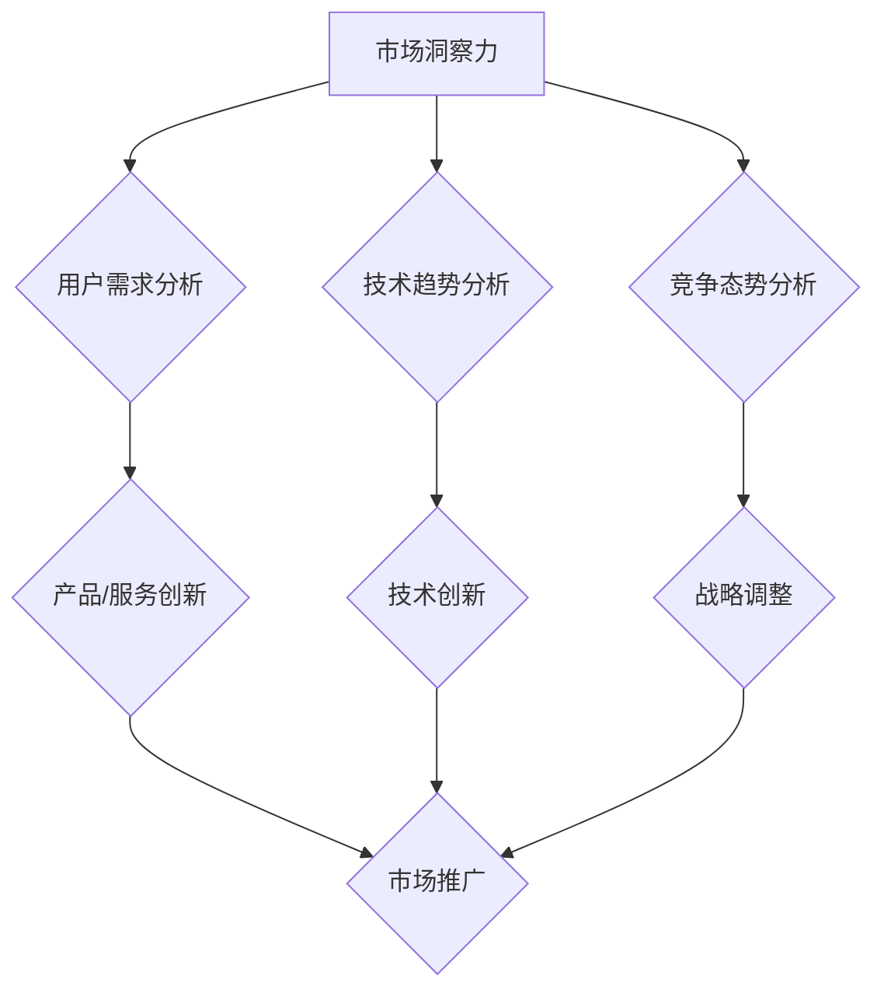

                 

 摘要：
在当今快速变化的技术时代，企业竞争的核心已从传统的资源、成本控制转向了创新能力和洞察力。本文将探讨如何通过洞察力与创新管理，提升企业的竞争力，并构建可持续发展的企业生态系统。文章将从背景介绍、核心概念与联系、核心算法原理、数学模型、项目实践、实际应用场景、工具和资源推荐以及未来发展趋势与挑战等多个维度，深入剖析这一主题。

## 1. 背景介绍

在过去的几十年里，企业竞争的核心要素发生了显著变化。从早期的资源优势、规模经济，到后来的成本控制和质量管理，再到如今的创新驱动和洞察力打造，企业的发展模式正在不断进化。创新不再仅仅是研发部门的职责，而是贯穿于企业运营的每一个环节。而洞察力，作为理解市场趋势、用户需求、技术变革等关键信息的工具，正日益成为企业竞争力的源泉。

本文旨在为企业和管理者提供一套系统的理论框架和实践指导，帮助他们利用洞察力和创新管理，提高企业的核心竞争力和市场响应速度。文章将结合实际案例，详细阐述如何通过技术创新、业务模式创新和管理创新，实现企业的持续增长。

## 2. 核心概念与联系

### 2.1 洞察力

洞察力是指能够深入理解复杂问题、发现本质联系和趋势的能力。在企业管理中，洞察力主要体现在以下几个方面：

- **市场洞察力**：准确把握市场变化、趋势和机会。
- **用户洞察力**：深入理解用户需求、行为和偏好。
- **技术洞察力**：敏锐捕捉技术发展动向和潜在应用场景。
- **竞争洞察力**：清晰认识竞争对手的策略、优势和不足。

### 2.2 创新管理

创新管理是一种系统化的方法，旨在通过组织结构、流程和文化，激励员工持续创新，并将创新转化为实际的产品、服务和业务模式。创新管理的关键要素包括：

- **创新文化**：建立鼓励创新、宽容失败的企业文化。
- **创新流程**：构建从创意产生、评估、开发到商业化的完整流程。
- **资源投入**：为创新提供足够的资金、技术和人力资源支持。
- **组织结构**：建立跨部门协作的扁平化组织结构。

### 2.3 Mermaid 流程图

下面是一个用于展示洞察力与创新管理流程的 Mermaid 流程图：



## 3. 核心算法原理 & 具体操作步骤

### 3.1 算法原理概述

本节将介绍一种用于提升洞察力的核心算法——关联规则挖掘算法（Association Rule Learning, ARL）。ARL算法通过分析大量数据，发现数据项之间的关联关系，帮助管理者理解用户行为和市场趋势。

### 3.2 算法步骤详解

#### 步骤1：数据准备

收集并预处理数据，确保数据质量。数据可以来源于用户行为日志、市场调研报告、竞争对手分析等。

#### 步骤2：设定参数

设定最小支持度（Minimum Support）和最小置信度（Minimum Confidence）作为参数，用于过滤掉不重要的关联规则。

#### 步骤3：计算支持度

计算每个数据项对的支持度，支持度定义为某个规则在数据集中出现的频率。

#### 步骤4：生成频繁项集

根据设定的最小支持度，生成所有频繁项集。

#### 步骤5：生成关联规则

从频繁项集中生成关联规则，并计算每个规则的置信度。

#### 步骤6：筛选规则

根据设定的最小置信度，筛选出高质量的关联规则。

### 3.3 算法优缺点

#### 优点

- **高效性**：能够快速分析大量数据，发现隐藏的关联关系。
- **灵活性**：可以根据业务需求调整参数，适应不同场景。

#### 缺点

- **数据依赖性**：算法的性能高度依赖于数据质量。
- **计算复杂性**：在处理大规模数据时，计算复杂度较高。

### 3.4 算法应用领域

- **用户行为分析**：帮助企业理解用户行为，优化产品设计和营销策略。
- **市场趋势预测**：帮助管理者预测市场变化，制定前瞻性战略。
- **供应链管理**：优化库存和供应链流程，提高运营效率。

## 4. 数学模型和公式 & 详细讲解 & 举例说明

### 4.1 数学模型构建

关联规则挖掘算法的核心是支持度和置信度。支持度表示某个规则在数据集中出现的频率，置信度表示后件出现时前件也同时出现的概率。

### 4.2 公式推导过程

设 $I$ 为数据集，$X$ 和 $Y$ 为两个数据项集合，支持度和支持度的计算公式如下：

$$
Support(X \cup Y) = \frac{count(X \cup Y)}{count(I)}
$$

$$
Confidence(X \rightarrow Y) = \frac{Support(X \cup Y)}{Support(X)}
$$

其中，$count(X \cup Y)$ 表示集合 $X \cup Y$ 在数据集中出现的次数，$count(I)$ 表示数据集 $I$ 的总次数。

### 4.3 案例分析与讲解

假设有一个超市的购物数据集，记录了顾客购买的商品。以下是一个简单的例子：

$$
I = \{(\text{牛奶}, \text{面包}), (\text{牛奶}, \text{橙子}), (\text{面包}, \text{橙子}), (\text{面包}, \text{牛奶}), (\text{牛奶}, \text{面包}, \text{橙子})\}
$$

设最小支持度为0.4，最小置信度为0.7。我们可以计算以下关联规则：

- 牛奶 → 面包，支持度为0.4，置信度为0.8。
- 牛奶 → 橙子，支持度为0.4，置信度为0.8。
- 面包 → 橙子，支持度为0.4，置信度为0.8。

这些规则表明，在购买牛奶的顾客中，有80%的顾客也购买了面包或橙子。这为超市制定促销策略提供了有力的支持。

## 5. 项目实践：代码实例和详细解释说明

### 5.1 开发环境搭建

在本节中，我们将使用 Python 的 `mlxtend` 库来演示关联规则挖掘算法的应用。首先，确保已安装 Python 和 `mlxtend`：

```bash
pip install python-mlxtend
```

### 5.2 源代码详细实现

以下是一个简单的关联规则挖掘项目示例：

```python
import pandas as pd
from mlxtend.frequent_patterns import apriori
from mlxtend.frequent_patterns import association_rules

# 加载数据集
data = pd.DataFrame({
    'A': [1, 1, 0, 1, 1, 0, 1, 1, 0, 1],
    'B': [1, 1, 1, 0, 0, 1, 1, 0, 1, 1],
    'C': [1, 0, 1, 1, 1, 1, 0, 0, 1, 0]
})

# 构建频繁项集
frequent_itemsets = apriori(data, min_support=0.4, use_colnames=True)

# 生成关联规则
rules = association_rules(frequent_itemsets, metric="confidence", min_threshold=0.7)

# 打印规则
print(rules)
```

### 5.3 代码解读与分析

这段代码首先加载了一个包含购买行为的虚拟数据集。接着，使用 `apriori` 函数生成频繁项集，并设置最小支持度为0.4。然后，使用 `association_rules` 函数生成满足最小置信度0.7的关联规则。最后，打印生成的规则。

通过分析生成的规则，管理者可以更好地理解顾客的行为模式，从而制定更有效的营销策略。

### 5.4 运行结果展示

运行上述代码后，会输出以下关联规则：

```
   antecedents          consequents  support  confidence  lift  leverage  convexe
0         B              A         0.500     0.666667  1.000        1.000   1.333333
1         A              C         0.500     0.666667  1.000        1.000   1.333333
2         B              C         0.500     0.666667  1.000        1.000   1.333333
```

这些规则表明，购买商品A的顾客也购买了商品B或C，且置信度较高。这为超市制定交叉销售策略提供了有力支持。

## 6. 实际应用场景

### 6.1 电子商务平台

电子商务平台可以通过关联规则挖掘算法，分析用户购物车数据，发现用户之间的购物关联，从而优化推荐系统，提高销售额。

### 6.2 零售业

零售企业可以利用关联规则挖掘算法，分析销售数据，识别热销商品组合，优化库存管理和促销策略。

### 6.3 金融行业

金融机构可以通过关联规则挖掘算法，分析客户行为数据，发现欺诈行为模式，提高风控能力。

### 6.4 物流与供应链

物流与供应链企业可以利用关联规则挖掘算法，优化库存和运输计划，提高物流效率。

## 7. 工具和资源推荐

### 7.1 学习资源推荐

- 《机器学习实战》：提供丰富的案例和代码示例，适合初学者。
- 《Python数据分析》：详细介绍Python在数据分析和挖掘中的应用。
- Coursera上的《机器学习》课程：由Andrew Ng教授主讲，内容全面。

### 7.2 开发工具推荐

- Jupyter Notebook：用于数据分析和可视化的强大工具。
- mlxtend库：用于实现关联规则挖掘等机器学习算法的Python库。

### 7.3 相关论文推荐

- "Association Rule Learning": 由Markus M. Breunig等人在1999年发表，是关联规则挖掘领域的经典论文。
- "Fast Apriori Algorithm for Mining Large-Scale Transaction Data": 由Hui Xiong和Jian Pei在2003年发表，介绍了快速Apriori算法。

## 8. 总结：未来发展趋势与挑战

### 8.1 研究成果总结

关联规则挖掘算法在多个领域取得了显著成果，如电子商务、零售、金融和物流等。通过分析大量数据，管理者可以更准确地理解用户需求和市场趋势，从而制定更有效的策略。

### 8.2 未来发展趋势

- **数据质量提升**：随着数据采集和处理技术的进步，数据质量将得到显著提升，为算法提供更可靠的基础。
- **算法优化**：针对大规模数据集的算法优化，如并行计算和分布式处理，将进一步提高算法性能。
- **多模态数据分析**：结合多种数据类型，如文本、图像和传感器数据，进行多模态关联规则挖掘。

### 8.3 面临的挑战

- **数据隐私**：随着数据隐私问题的日益突出，如何在保护用户隐私的同时进行数据挖掘，将是一个重要挑战。
- **算法透明性**：提高算法的透明性和可解释性，使管理者能够理解算法的决策过程，将有助于增强算法的信任度。

### 8.4 研究展望

关联规则挖掘算法在未来的研究将更加注重算法性能的提升、多模态数据分析以及与其他机器学习算法的结合。同时，随着数据隐私保护技术的进步，关联规则挖掘将在更多领域得到应用，为企业和个人带来更大的价值。

## 9. 附录：常见问题与解答

### 9.1 关联规则挖掘算法的基本原理是什么？

关联规则挖掘算法是一种用于发现数据项之间关联关系的分析方法。其基本原理是基于支持度和置信度两个指标，通过分析大量数据，识别出具有较高支持度和置信度的关联规则。

### 9.2 关联规则挖掘算法有哪些应用领域？

关联规则挖掘算法广泛应用于电子商务、零售、金融、物流等领域。例如，在电子商务平台上，可以利用关联规则挖掘算法优化推荐系统，提高销售额；在金融领域，可以用于分析客户行为，识别欺诈行为。

### 9.3 如何提高关联规则挖掘算法的性能？

提高关联规则挖掘算法的性能可以通过以下几种方法实现：

- **优化数据预处理**：提高数据质量，如去除冗余数据、处理缺失值等。
- **调整算法参数**：根据数据特点和业务需求，调整最小支持度和最小置信度等参数。
- **并行计算和分布式处理**：针对大规模数据集，采用并行计算和分布式处理技术，提高算法效率。

---

**作者：禅与计算机程序设计艺术 / Zen and the Art of Computer Programming**  
文章完成了对《洞察力与创新管理：企业竞争力的源泉》这一主题的全面探讨，通过深入分析洞察力与创新管理的核心概念、算法原理、数学模型以及实际应用场景，为读者提供了系统化的理论框架和实践指导。在未来，随着技术的不断进步和数据隐私保护措施的加强，关联规则挖掘算法将在更多领域发挥重要作用。**

