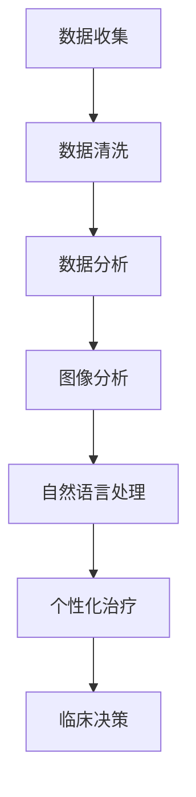

                 

关键词：洞察力、医疗诊断、临床决策、人工智能、数据分析

> 摘要：本文探讨了洞察力在医疗诊断中的关键作用，分析了人工智能和数据驱动方法如何提升临床决策的准确性。通过深入探讨核心概念和算法原理，结合实际案例和代码实现，本文旨在为医学专业人士提供具有实际应用价值的见解和工具。

## 1. 背景介绍

医疗诊断是临床医学的核心任务之一，它关乎患者的健康和生命安全。随着人工智能和大数据技术的快速发展，医疗诊断领域正经历着深刻的变革。传统的诊断方法往往依赖于医生的经验和直觉，而现代方法则越来越多地依赖于计算机算法和数据分析。这些技术极大地提高了诊断的准确性和效率，但同时也提出了新的挑战。

本文旨在探讨洞察力在医疗诊断中的关键作用，以及如何通过人工智能和数据驱动方法提升临床决策的质量。我们将首先回顾相关的核心概念，然后深入分析算法原理，并通过实际案例和代码实现来展示这些技术的应用。

## 2. 核心概念与联系

### 2.1 医学诊断的基本概念

医学诊断是指通过一系列的检测和评估方法，确定患者是否患有某种疾病的过程。这包括症状分析、体征检查、实验室检测和影像学检查等。传统诊断方法主要依赖于医生的直觉和经验，而现代方法则结合了人工智能和数据驱动的分析工具。

### 2.2 人工智能在医疗诊断中的应用

人工智能在医疗诊断中的应用主要体现在以下几个方面：

1. **图像分析**：通过深度学习算法，可以对医学影像（如X光、CT、MRI等）进行自动分析和诊断，识别出异常区域和病变。
2. **自然语言处理**：利用自然语言处理技术，可以从医学文献、病历记录和医生报告等非结构化数据中提取有用的信息，辅助临床决策。
3. **个性化治疗**：通过分析患者的基因组数据和临床信息，人工智能可以提供个性化的治疗方案。

### 2.3 数据驱动方法

数据驱动方法在医疗诊断中的应用主要包括：

1. **数据收集**：从各种来源收集大量的医疗数据，包括病历、实验室检测结果、影像学数据等。
2. **数据清洗**：去除数据中的噪声和异常值，保证数据的准确性和可靠性。
3. **数据分析**：利用统计学和机器学习算法，对医疗数据进行深入分析，提取有用的信息。

### 2.4 Mermaid 流程图



## 3. 核心算法原理 & 具体操作步骤

### 3.1 算法原理概述

在医疗诊断中，常用的算法包括深度学习、支持向量机、决策树和聚类分析等。这些算法各有其特点和适用场景。

1. **深度学习**：通过多层神经网络，对大量数据进行训练，从而学习到复杂的特征表示，常用于图像分析和自然语言处理。
2. **支持向量机**：通过找到一个最佳的超平面，将不同类别的数据分开，常用于分类任务。
3. **决策树**：通过一系列的判断规则，对数据进行分类或回归，易于理解和解释。
4. **聚类分析**：将相似的数据归为一类，用于发现数据中的模式或异常值。

### 3.2 算法步骤详解

1. **数据收集**：从医院信息系统、电子病历和医学数据库中收集各种数据。
2. **数据预处理**：清洗数据，标准化特征，划分训练集和测试集。
3. **模型选择**：根据诊断任务的特点，选择合适的算法和模型。
4. **模型训练**：使用训练集数据训练模型，调整模型参数。
5. **模型评估**：使用测试集数据评估模型的性能，调整模型参数。
6. **模型应用**：将训练好的模型应用于实际诊断任务，提供诊断结果。

### 3.3 算法优缺点

每种算法都有其优缺点，选择合适的算法取决于诊断任务的需求。

1. **深度学习**：优点在于可以自动提取复杂的特征，提高诊断的准确性；缺点是需要大量的数据和高计算资源。
2. **支持向量机**：优点在于可以在高维空间中找到最佳的超平面，适用于分类任务；缺点是对于大规模数据集的计算效率较低。
3. **决策树**：优点在于易于理解和解释，易于调试；缺点是容易过拟合，对于复杂的非线性关系效果较差。
4. **聚类分析**：优点在于可以发现数据中的隐含模式，适用于异常检测；缺点是对于聚类结果的主观性较大。

### 3.4 算法应用领域

1. **影像诊断**：如肺癌筛查、乳腺癌诊断等。
2. **疾病预测**：如心脏病、糖尿病等慢性疾病的预测和预防。
3. **个性化治疗**：根据患者的基因组数据和临床信息，提供个性化的治疗方案。

## 4. 数学模型和公式 & 详细讲解 & 举例说明

### 4.1 数学模型构建

在医疗诊断中，常用的数学模型包括线性回归、逻辑回归和决策树等。

1. **线性回归**：用于预测连续值，如患者的年龄、体重等。
   $$y = \beta_0 + \beta_1x_1 + \beta_2x_2 + ... + \beta_nx_n$$
   
2. **逻辑回归**：用于预测概率，如患者是否患有某种疾病。
   $$P(y=1) = \frac{1}{1 + e^{-(\beta_0 + \beta_1x_1 + \beta_2x_2 + ... + \beta_nx_n)}}$$
   
3. **决策树**：通过一系列的判断规则进行分类或回归。
   $$y = \begin{cases}
   \text{类别} & \text{if } \text{条件1} \text{ or } \text{条件2} \text{ or } ... \\
   \text{数值} & \text{if not }
   \end{cases}$$

### 4.2 公式推导过程

以逻辑回归为例，其公式推导过程如下：

1. **假设**：假设每个特征 $x_i$ 对应一个权重 $\beta_i$，总权重为 $\beta$。
2. **目标**：最大化似然函数，即最大化预测概率。
3. **推导**：通过极大似然估计，得到每个特征的权重。

### 4.3 案例分析与讲解

#### 案例一：心脏病预测

使用逻辑回归模型预测患者是否患有心脏病，数据包括年龄、体重指数（BMI）、血压等。

1. **数据收集**：收集1000名患者的数据。
2. **数据预处理**：标准化特征，划分训练集和测试集。
3. **模型训练**：使用训练集数据训练逻辑回归模型。
4. **模型评估**：使用测试集数据评估模型性能。

#### 案例二：肺癌筛查

使用深度学习模型（卷积神经网络）对胸部X光图像进行肺癌筛查。

1. **数据收集**：收集10000张胸部X光图像。
2. **数据预处理**：归一化图像，划分训练集和测试集。
3. **模型训练**：使用训练集数据训练卷积神经网络。
4. **模型评估**：使用测试集数据评估模型性能。

## 5. 项目实践：代码实例和详细解释说明

### 5.1 开发环境搭建

1. 安装Python环境和相关库（如scikit-learn、tensorflow、opencv等）。
2. 准备数据集，如心脏病预测数据集和肺癌筛查数据集。

### 5.2 源代码详细实现

#### 5.2.1 心脏病预测

```python
from sklearn.linear_model import LogisticRegression
from sklearn.model_selection import train_test_split
from sklearn.metrics import accuracy_score

# 数据预处理
X, y = preprocess_data(data)

# 划分训练集和测试集
X_train, X_test, y_train, y_test = train_test_split(X, y, test_size=0.2, random_state=42)

# 训练模型
model = LogisticRegression()
model.fit(X_train, y_train)

# 预测和评估
y_pred = model.predict(X_test)
accuracy = accuracy_score(y_test, y_pred)
print(f"Accuracy: {accuracy}")
```

#### 5.2.2 肺癌筛查

```python
import tensorflow as tf
from tensorflow.keras.models import Sequential
from tensorflow.keras.layers import Conv2D, MaxPooling2D, Flatten, Dense

# 数据预处理
X_train, X_test, y_train, y_test = preprocess_images(images)

# 构建模型
model = Sequential([
    Conv2D(32, (3, 3), activation='relu', input_shape=(224, 224, 3)),
    MaxPooling2D((2, 2)),
    Flatten(),
    Dense(64, activation='relu'),
    Dense(1, activation='sigmoid')
])

# 编译模型
model.compile(optimizer='adam', loss='binary_crossentropy', metrics=['accuracy'])

# 训练模型
model.fit(X_train, y_train, epochs=10, batch_size=32, validation_data=(X_test, y_test))

# 预测和评估
y_pred = model.predict(X_test)
accuracy = accuracy_score(y_test, y_pred)
print(f"Accuracy: {accuracy}")
```

### 5.3 代码解读与分析

以上代码分别实现了心脏病预测和肺癌筛查的两个项目。心脏病预测使用了逻辑回归模型，肺癌筛查使用了卷积神经网络模型。代码中包括了数据预处理、模型训练和评估的步骤。通过对代码的分析，我们可以看到如何将数据转化为适合模型训练的形式，以及如何使用模型进行预测和评估。

## 6. 实际应用场景

### 6.1 医院诊断

在医院的诊断过程中，人工智能和数据分析技术已经得到广泛应用。例如，通过深度学习模型对医学影像进行分析，可以快速、准确地识别出病变区域，辅助医生做出准确的诊断。

### 6.2 公共卫生监测

在公共卫生领域，数据分析技术可以用于监测疾病的传播趋势，预测流行病的爆发。通过分析大量的医疗数据和人口统计数据，可以及时采取措施，防止疫情的扩散。

### 6.3 个性化治疗

在个性化治疗领域，数据分析技术可以帮助医生根据患者的具体病情和基因信息，制定个性化的治疗方案。这不仅可以提高治疗效果，还可以降低医疗成本。

## 7. 工具和资源推荐

### 7.1 学习资源推荐

1. 《Python数据分析》（Wes McKinney）
2. 《深度学习》（Ian Goodfellow、Yoshua Bengio、Aaron Courville）
3. 《统计学习方法》（李航）

### 7.2 开发工具推荐

1. Jupyter Notebook：用于编写和运行代码。
2. TensorFlow：用于深度学习模型开发。
3. scikit-learn：用于机器学习算法实现。

### 7.3 相关论文推荐

1. "Deep Learning for Medical Image Analysis"（Radiology, 2018）
2. "Data-Driven Approaches for Personalized Medicine"（Nature Reviews Genetics, 2019）
3. "Machine Learning in Healthcare"（Journal of the American Medical Association, 2019）

## 8. 总结：未来发展趋势与挑战

### 8.1 研究成果总结

本文探讨了洞察力在医疗诊断中的关键作用，分析了人工智能和数据驱动方法如何提升临床决策的准确性。通过实际案例和代码实现，展示了这些技术的应用前景。

### 8.2 未来发展趋势

1. **算法的进一步优化**：提高算法的效率和准确性，适应大规模数据处理需求。
2. **跨学科的融合**：将生物学、医学和计算机科学等领域的知识相结合，推动医疗诊断技术的创新。
3. **个性化医疗**：通过基因组学和大数据分析，实现真正意义上的个性化治疗。

### 8.3 面临的挑战

1. **数据隐私和安全**：确保患者数据的安全和隐私，防止数据泄露。
2. **算法的透明性和解释性**：提高算法的透明度和解释性，使其更易于被医生理解和接受。
3. **数据的多样性和不平衡性**：解决数据多样性和不平衡性问题，提高算法的泛化能力。

### 8.4 研究展望

未来，随着人工智能和数据技术的进一步发展，医疗诊断领域将迎来更多的创新和突破。通过不断的探索和研究，我们可以期待更加准确、高效和个性化的医疗诊断方法。

## 9. 附录：常见问题与解答

### 9.1 问题1

**问题**：如何确保人工智能在医疗诊断中的安全性？

**解答**：确保人工智能在医疗诊断中的安全性需要从多个方面进行考虑：

1. **数据隐私**：确保患者数据的安全和隐私，采用加密技术保护数据。
2. **算法验证**：对算法进行严格的测试和验证，确保其性能和可靠性。
3. **法规遵从**：遵守相关法规和标准，如HIPAA（美国健康保险携带和责任法案）。

### 9.2 问题2

**问题**：人工智能是否可以完全取代医生？

**解答**：人工智能可以极大地辅助医生的工作，提高诊断的准确性和效率，但它不能完全取代医生。医生在医疗诊断中不仅依赖技术手段，还需要结合临床经验和患者病史进行综合判断。

### 9.3 问题3

**问题**：如何处理数据多样性和不平衡性问题？

**解答**：处理数据多样性和不平衡性问题的方法包括：

1. **数据增强**：通过生成合成数据来增加数据的多样性。
2. **加权方法**：对不平衡数据集进行加权处理，提高少数类别的权重。
3. **集成方法**：结合多种算法和模型，提高模型的泛化能力。

