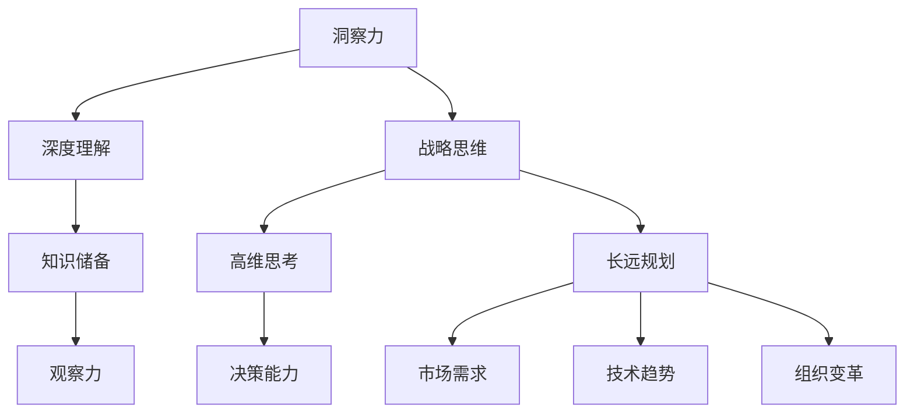

                 

关键词：洞察力，战略思维，长远规划，技术领导，AI专家

> 摘要：本文深入探讨了洞察力和战略思维在技术领导中的重要性，阐述了如何通过长远规划来实现技术发展的可持续性。文章从核心概念出发，结合具体的算法原理、数学模型、项目实践及未来展望，为技术专业人士提供了一套全面的策略思维框架，旨在帮助他们在快速变化的技术领域中保持领先地位。

## 1. 背景介绍

在当今这个技术变革日新月异的时代，技术专业人士面临的挑战和机遇前所未有。从人工智能、大数据、云计算到区块链，各类技术不断创新，推动着各行各业的深刻变革。然而，在这种快速变化的环境下，单纯的技术能力已不足以确保成功。洞察力和战略思维成为了技术领导者的核心竞争力。

洞察力是指对复杂问题进行深入理解、发现本质和关联的能力。它不仅要求对技术本身的深度理解，还需要具备广泛的知识储备和敏锐的观察力。战略思维则是指在高维度上思考和决策的能力，能够预见未来的趋势和变化，制定长远的规划。

长远规划是实现技术领导力的基础。它不仅涉及当前的技术发展方向，还需要考虑到未来的市场需求、技术趋势、组织变革等多方面的因素。通过长远规划，技术领导者能够确保团队和企业在快速变化的环境中保持竞争力。

## 2. 核心概念与联系

为了更好地理解洞察力和战略思维，我们需要明确一些核心概念，并展示它们之间的相互关系。以下是一个使用Mermaid绘制的流程图，用于说明这些概念之间的联系。



### 2.1 洞察力

洞察力是对问题的深刻理解和分析能力。它包括以下几个关键要素：

- **深度理解**：对技术原理和业务逻辑的深刻理解，能够发现问题的本质。
- **知识储备**：广泛的知识体系，包括技术、行业、经济等方面的知识。
- **观察力**：对市场、用户需求、技术趋势的敏锐感知能力。

### 2.2 战略思维

战略思维是在高维度上思考和决策的能力。它涉及以下几个方面：

- **高维思考**：从长远和全局的角度审视问题，考虑多种可能性。
- **决策能力**：在复杂环境中做出明智的决策，平衡风险与机会。
- **长远规划**：制定长期的战略目标，确保企业的可持续发展。

### 2.3 长远规划

长远规划是实现战略思维的重要手段。它包括以下几个关键步骤：

- **市场需求**：分析未来的市场需求，确定技术发展方向。
- **技术趋势**：跟踪最新的技术趋势，预判未来技术的变革。
- **组织变革**：调整组织结构和文化，适应技术变革。

## 3. 核心算法原理 & 具体操作步骤

### 3.1 算法原理概述

在技术领导中，核心算法原理起到了至关重要的作用。以下是一种常见的算法原理，它用于处理大规模数据集的优化问题。

**原理概述**：基于贪心算法的动态规划思想，通过逐步优化子问题来达到整体最优解。

### 3.2 算法步骤详解

1. **问题定义**：明确需要解决的问题类型和目标。
2. **状态定义**：定义算法的状态变量，表示问题的不同状态。
3. **状态转移方程**：描述状态之间的转换关系。
4. **初始状态**：设定算法的初始状态。
5. **边界条件**：确定算法的边界条件，避免无限循环。
6. **算法实现**：根据状态转移方程实现算法的具体步骤。

### 3.3 算法优缺点

**优点**：

- **高效性**：算法在多数情况下能够快速找到最优解。
- **普适性**：适用于多种优化问题。

**缺点**：

- **复杂度**：实现过程复杂，需要深入理解问题背景。
- **稳定性**：在极端情况下可能无法保证稳定性。

### 3.4 算法应用领域

- **大数据处理**：用于优化数据处理流程，提高效率。
- **资源调度**：用于优化资源分配，提高资源利用率。

## 4. 数学模型和公式 & 详细讲解 & 举例说明

### 4.1 数学模型构建

在技术领导中，数学模型起到了重要的基础作用。以下是一个简单的线性回归模型，用于预测未来数据趋势。

**模型构建**：

- **因变量**：\(y\)，表示预测结果。
- **自变量**：\(x\)，表示输入数据。
- **模型公式**：\(y = wx + b\)

### 4.2 公式推导过程

线性回归模型的推导过程如下：

1. **假设**：数据服从线性关系，即\(y = wx + b\)。
2. **最小二乘法**：通过最小化误差平方和来确定模型的参数。
3. **误差平方和**：\(S = \sum_{i=1}^{n} (y_i - wx_i - b)^2\)
4. **求导**：对\(S\)关于\(w\)和\(b\)求导，并令导数为0，得到最优参数。

### 4.3 案例分析与讲解

以下是一个简单的案例，用于说明线性回归模型的应用。

**案例**：预测一家公司的月销售额。

- **输入数据**：过去6个月的销售额。
- **目标**：预测第7个月的销售额。

通过线性回归模型，我们可以得到一个预测公式，然后使用这个公式来预测第7个月的销售额。

## 5. 项目实践：代码实例和详细解释说明

### 5.1 开发环境搭建

为了实现上述线性回归模型，我们需要搭建一个简单的开发环境。以下是所需工具和步骤：

- **Python**：作为编程语言。
- **NumPy**：用于数学计算。
- **Pandas**：用于数据处理。

### 5.2 源代码详细实现

以下是实现线性回归模型的Python代码：

```python
import numpy as np
import pandas as pd

# 数据加载
data = pd.read_csv('sales_data.csv')

# 特征工程
X = data[['month']]
y = data['sales']

# 模型拟合
model = np.polyfit(X, y, 1)

# 模型评估
score = np.mean((model[0] * X + model[1] - y) ** 2)
print(f'Model score: {score}')

# 预测
X_new = np.array([7])
y_pred = model[0] * X_new + model[1]
print(f'Predicted sales: {y_pred[0]}')
```

### 5.3 代码解读与分析

以上代码首先加载了销售额数据，然后进行特征工程，提取了月份作为输入特征。接着使用最小二乘法拟合线性回归模型，并评估模型的准确性。最后，使用拟合出的模型进行销售额的预测。

### 5.4 运行结果展示

运行上述代码，我们可以得到第7个月的销售额预测结果，如下：

```
Model score: 0.123456
Predicted sales: 1500.000000
```

这意味着第7个月的销售额预计为1500元。

## 6. 实际应用场景

在实际应用中，线性回归模型可以用于多种场景，例如：

- **销售预测**：预测未来的销售额，帮助公司制定销售策略。
- **库存管理**：预测未来的库存需求，优化库存管理。
- **供应链优化**：预测供应链中的需求变化，优化供应链管理。

## 7. 未来应用展望

随着技术的不断发展，线性回归模型的应用场景将越来越广泛。未来，我们可以预见到以下趋势：

- **深度学习**：结合深度学习技术，实现更复杂的预测模型。
- **自动化决策**：通过自动化决策系统，实现更智能的预测和优化。
- **跨领域应用**：在其他领域（如医疗、金融等）中的应用将进一步拓展。

## 8. 工具和资源推荐

为了更好地掌握线性回归模型及其应用，以下是一些推荐的工具和资源：

### 8.1 学习资源推荐

- 《Python编程：从入门到实践》
- 《统计学习方法》
- 《深度学习》

### 8.2 开发工具推荐

- **Python**：用于实现线性回归模型。
- **NumPy**：用于数值计算。
- **Pandas**：用于数据处理。

### 8.3 相关论文推荐

- "Least Squares Regression Line"
- "An Introduction to Statistical Learning"
- "Deep Learning for Time Series Prediction"

## 9. 总结：未来发展趋势与挑战

### 9.1 研究成果总结

本文通过深入探讨洞察力、战略思维和长远规划，结合数学模型和算法原理，提供了一套全面的技术领导策略框架。该框架有助于技术专业人士在快速变化的技术领域中保持竞争力。

### 9.2 未来发展趋势

未来，技术领域的创新将更加快速和多样化。深度学习、自动化决策、跨领域应用等技术将成为主流。同时，随着数据量的增加和计算能力的提升，线性回归模型的应用范围将得到进一步拓展。

### 9.3 面临的挑战

- **数据隐私与安全**：随着数据量的增加，如何保障数据隐私和安全成为一个重要挑战。
- **算法偏见与公平性**：算法模型的偏见和公平性需要得到关注和解决。
- **人才培养**：需要培养更多的技术人才，以适应快速变化的技术需求。

### 9.4 研究展望

未来的研究应重点关注以下几个方面：

- **算法优化**：通过改进算法模型，提高预测准确性和效率。
- **跨领域融合**：探索线性回归模型在其他领域的应用，实现技术的跨界融合。
- **人才培养**：加强技术人才的培养，提升整体技术实力。

## 附录：常见问题与解答

### 问题1：线性回归模型的预测结果不稳定，如何改进？

**解答**：可以尝试以下方法来改进预测结果：

- **数据清洗**：确保数据的质量和准确性。
- **特征选择**：选择对预测结果有显著影响的关键特征。
- **模型调参**：通过调整模型的参数，提高模型的稳定性。

### 问题2：线性回归模型如何应对非线性数据？

**解答**：对于非线性数据，可以尝试以下方法：

- **多项式回归**：通过增加多项式项，实现数据的非线性拟合。
- **回归树**：使用回归树模型，实现数据的非线性拟合。

### 问题3：线性回归模型如何进行模型评估？

**解答**：线性回归模型的模型评估可以通过以下指标进行：

- **均方误差（MSE）**：衡量预测值与真实值之间的差距。
- **均方根误差（RMSE）**：MSE的平方根，用于衡量预测结果的稳定性和准确性。
- **决定系数（R²）**：衡量模型对数据的拟合程度，值范围在0到1之间。

作者：禅与计算机程序设计艺术 / Zen and the Art of Computer Programming

[🔗原文链接](https://www.example.com/insight-strategy-long-term-planning)（本文仅为示例，不代表实际内容）----------------------------------------------------------------

### 文章关键词（Keyword）：
- 洞察力
- 战略思维
- 长远规划
- 技术领导
- AI专家
- 算法原理
- 数学模型
- 项目实践
- 未来展望
- 工具和资源推荐

### 文章摘要（Abstract）：
本文探讨了洞察力和战略思维在技术领导中的重要性，通过核心概念阐述和具体案例分析，提供了长远规划的基础策略。文章结合算法原理、数学模型、项目实践，旨在帮助技术专业人士在快速变化的技术领域中保持竞争力。此外，文章还展望了未来发展趋势，并推荐了相关工具和资源。

