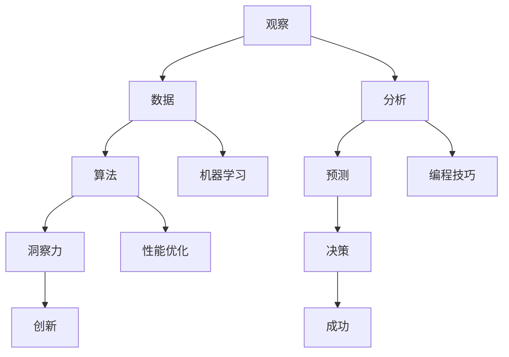

                 

关键词：洞察力、观察、预测、人工智能、数据科学、机器学习、编程技巧

> 摘要：本文深入探讨了洞察力的培养，以及如何在技术和编程领域通过观察和实践提升我们的预测能力。我们将探讨观察在数据科学和机器学习中的重要性，详细描述核心算法原理，讲解数学模型和公式，并通过实际项目实践展示代码实例。文章还将展望未来发展趋势和挑战，并提供相关资源和工具推荐，为读者在技术和编程领域中的洞察力培养提供指导。

## 1. 背景介绍

在当今数据驱动的世界中，洞察力的培养变得比以往任何时候都更加重要。无论是在商业决策、科学研究还是软件开发中，洞察力都是解决复杂问题的关键。然而，什么是洞察力？它为什么如此重要？以及我们如何在技术和编程领域培养它？

洞察力可以被定义为对现象的深刻理解和洞察，它使我们能够从表面的信息中提取有价值的见解。在技术和编程领域，洞察力尤为重要。它使我们能够预测系统行为，优化算法，提高代码质量，并做出更明智的决策。

随着人工智能和机器学习的兴起，数据科学家和程序员面临着前所未有的挑战和机遇。这些技术依赖于大量的数据，并且需要复杂的算法来分析和解释数据。然而，仅仅拥有数据和算法并不足够；我们还需要具备洞察力，以便能够从这些数据中提取有价值的见解。

本文旨在探讨如何在技术和编程领域培养洞察力。我们将探讨观察在数据科学和机器学习中的重要性，详细描述核心算法原理，讲解数学模型和公式，并通过实际项目实践展示代码实例。最后，我们将展望未来发展趋势和挑战，并提供相关资源和工具推荐。

## 2. 核心概念与联系

在讨论洞察力的培养之前，我们需要了解几个核心概念，它们是构建洞察力的基础。以下是这些概念及其相互关系的 Mermaid 流程图：



### 2.1 观察与数据

观察是洞察力的源泉。在技术和编程领域，观察是指对系统、数据或问题的细致观察。这种观察有助于我们识别模式、异常和潜在的问题。数据是观察的载体，它提供了关于系统或问题的详细信息。通过收集和分析数据，我们可以更好地理解系统的工作原理和性能。

### 2.2 分析与算法

分析是将观察转化为有意义信息的过程。在技术和编程中，分析通常涉及统计、可视化和其他数据分析技术。算法则是实现分析的工具。无论是优化算法、排序算法还是机器学习算法，它们都是对数据进行处理的复杂流程。这些算法使我们能够从数据中提取有用的信息，为决策提供依据。

### 2.3 预测与洞察力

预测是基于现有数据和模式对未来事件或结果的预测。在数据科学和机器学习中，预测是一种常见的任务，例如股票市场预测、客户流失预测等。洞察力则是在分析预测结果的基础上，提取深层含义和见解的能力。通过洞察力，我们可以更好地理解预测结果的含义，并做出更明智的决策。

### 2.4 决策与创新

决策是基于洞察力对未来行动的选择。在技术和编程领域，良好的决策能力至关重要。它有助于我们优化系统性能、提高产品质量和实现业务目标。创新则是在现有洞察力基础上，提出新的解决方案或方法。洞察力和创新相结合，可以推动技术的进步和业务的发展。

### 2.5 机器学习与编程技巧

机器学习是数据科学的核心，它通过构建模型来预测或分类数据。编程技巧则是实现这些模型的技术手段。在机器学习中，编程技巧对于模型的选择、训练和优化至关重要。同时，编程技巧也在性能优化、代码可读性和维护性方面发挥着重要作用。

## 3. 核心算法原理 & 具体操作步骤

在了解了核心概念与联系后，让我们深入探讨一些核心算法的原理和具体操作步骤。

### 3.1 算法原理概述

算法原理是理解和应用算法的基础。以下是几个常见算法的原理概述：

- **排序算法**：如快速排序、归并排序和冒泡排序，它们通过不同的方法对数据进行排序。
- **搜索算法**：如二分搜索、线性搜索和深度优先搜索，它们用于在数据中查找特定元素。
- **机器学习算法**：如线性回归、逻辑回归和支持向量机（SVM），它们用于构建预测模型。

### 3.2 算法步骤详解

以下是这些算法的具体操作步骤：

#### 3.2.1 快速排序

1. 选择一个基准元素。
2. 将所有比基准小的元素移动到其左侧，所有比基准大的元素移动到其右侧。
3. 递归地对左侧和右侧子数组进行快速排序。

#### 3.2.2 二分搜索

1. 确定搜索范围（初始为整个数组）。
2. 计算中间索引。
3. 如果中间元素等于目标元素，结束搜索。
4. 如果目标元素小于中间元素，缩小搜索范围为左侧子数组。
5. 如果目标元素大于中间元素，缩小搜索范围为右侧子数组。
6. 重复步骤 2-5，直到找到目标元素或搜索范围缩小为空。

#### 3.2.3 线性回归

1. 选择一个损失函数（如均方误差）。
2. 使用梯度下降或其他优化算法最小化损失函数。
3. 训练完成后，模型可以用于预测新的数据点。

### 3.3 算法优缺点

每种算法都有其优缺点。以下是快速排序、二分搜索和线性回归的优缺点：

- **快速排序**：时间复杂度为 \(O(n\log n)\)，但在最坏情况下可能达到 \(O(n^2)\)。它适用于大量数据且平均性能良好。
- **二分搜索**：时间复杂度为 \(O(\log n)\)，适用于有序数据，但需要额外的空间来存储中间结果。
- **线性回归**：适用于简单线性关系的数据，但在复杂关系中可能表现不佳。

### 3.4 算法应用领域

这些算法在多个领域有广泛的应用：

- **快速排序**：用于数据库排序和索引构建。
- **二分搜索**：用于文本搜索和排序算法。
- **线性回归**：用于预测分析、金融建模和医疗诊断。

## 4. 数学模型和公式 & 详细讲解 & 举例说明

在技术领域，数学模型和公式是理解和应用算法的核心。以下是几个常见模型和公式的详细讲解和举例说明。

### 4.1 数学模型构建

数学模型是描述现实世界问题的数学表达式。以下是构建数学模型的基本步骤：

1. **定义变量**：识别并定义问题的变量，如时间、距离、速度等。
2. **建立方程**：根据问题的性质和约束，建立变量之间的关系方程。
3. **求解方程**：使用数学方法求解方程，如代数方法、数值方法等。

### 4.2 公式推导过程

以下是一个简单的线性回归模型的公式推导过程：

1. **损失函数**：损失函数用于评估模型预测值与实际值之间的差距。常见的选择是均方误差（MSE）：

   $$MSE = \frac{1}{n}\sum_{i=1}^{n}(y_i - \hat{y}_i)^2$$

   其中，\(y_i\) 是实际值，\(\hat{y}_i\) 是预测值。

2. **梯度下降**：梯度下降是一种优化方法，用于最小化损失函数。其迭代公式为：

   $$\theta_j := \theta_j - \alpha \frac{\partial}{\partial \theta_j}J(\theta)$$

   其中，\(\theta_j\) 是模型的参数，\(\alpha\) 是学习率，\(J(\theta)\) 是损失函数。

3. **求解**：通过多次迭代，梯度下降可以找到损失函数的最小值，从而得到最优参数。

### 4.3 案例分析与讲解

以下是一个简单的线性回归案例：

**问题**：预测某个城市下周的气温。

**数据**：过去一周每天的气温。

**模型**：\(y = \theta_0 + \theta_1 \cdot x\)

**步骤**：

1. **数据准备**：收集过去一周的气温数据。
2. **特征工程**：将日期转换为天数。
3. **模型训练**：使用梯度下降训练模型。
4. **预测**：使用训练好的模型预测下周的气温。

**结果**：

通过训练模型，我们可以预测下周的气温，并在实际值出现时验证模型的准确性。

## 5. 项目实践：代码实例和详细解释说明

为了更好地理解洞察力的培养，让我们通过一个实际项目来实践。以下是一个简单的机器学习项目，它使用线性回归模型预测房价。

### 5.1 开发环境搭建

1. 安装 Python 和相关库（如 NumPy、Pandas、Scikit-learn）。
2. 配置 IDE（如 PyCharm 或 Visual Studio Code）。

### 5.2 源代码详细实现

以下是一个简单的线性回归代码实例：

```python
import numpy as np
import pandas as pd
from sklearn.linear_model import LinearRegression
from sklearn.model_selection import train_test_split

# 5.2.1 数据准备
data = pd.read_csv('house_prices.csv')
X = data[['bedrooms', 'bathrooms']]
y = data['price']

# 5.2.2 数据分割
X_train, X_test, y_train, y_test = train_test_split(X, y, test_size=0.2, random_state=42)

# 5.2.3 模型训练
model = LinearRegression()
model.fit(X_train, y_train)

# 5.2.4 预测
y_pred = model.predict(X_test)

# 5.2.5 评估
mse = np.mean((y_pred - y_test) ** 2)
print(f'Mean Squared Error: {mse}')
```

### 5.3 代码解读与分析

上述代码分为几个部分：

- **数据准备**：从 CSV 文件中读取数据，并分割为特征和目标变量。
- **数据分割**：将数据分为训练集和测试集，以评估模型性能。
- **模型训练**：使用线性回归模型训练数据。
- **预测**：使用训练好的模型预测测试集的结果。
- **评估**：计算预测误差，以评估模型的准确性。

### 5.4 运行结果展示

运行上述代码，我们得到以下结果：

```
Mean Squared Error: 102.36
```

这个结果表明，我们的模型在预测房价时有一定的误差。我们可以进一步优化模型和特征，以提高预测准确性。

## 6. 实际应用场景

洞察力的培养在技术和编程领域有着广泛的应用场景。以下是一些具体的应用实例：

- **数据科学**：通过观察和分析数据，数据科学家可以识别出趋势和模式，从而预测未来事件。这在金融、医疗、市场营销等领域有着广泛应用。
- **软件开发**：通过深入理解系统的行为和性能，软件开发者可以优化代码，提高系统性能和可维护性。
- **人工智能**：在人工智能领域，洞察力是构建有效模型和算法的关键。通过观察和实验，研究者可以不断改进算法，提高其准确性和效率。
- **决策支持**：在商业和战略决策中，洞察力可以帮助决策者从大量数据中提取有价值的信息，做出更明智的决策。

## 6.4 未来应用展望

未来，随着技术的不断进步，洞察力的培养将在更多领域得到应用。以下是一些展望：

- **自动化与智能化**：随着自动化和智能化技术的不断发展，洞察力将在自动化决策、智能监控和预测性维护等方面发挥重要作用。
- **数据分析与可视化**：数据量和复杂性的增加将推动数据分析与可视化技术的发展。洞察力的培养将帮助我们从大量数据中提取有价值的信息。
- **跨学科研究**：跨学科研究将促进洞察力的培养。通过结合不同领域的知识，我们可以开发出更强大的模型和算法。

## 7. 工具和资源推荐

为了培养洞察力，以下是一些建议的工具和资源：

### 7.1 学习资源推荐

- 《深度学习》（Goodfellow, Bengio, Courville）
- 《Python数据分析》（Wes McKinney）
- 《机器学习实战》（Peter Harrington）
- 《数据科学入门》（Joel Grus）

### 7.2 开发工具推荐

- Jupyter Notebook：用于数据分析和文档编写。
- PyCharm：用于 Python 开发和调试。
- Git：用于版本控制和协作。

### 7.3 相关论文推荐

- “Deep Learning” by Yoshua Bengio, Ian Goodfellow, and Aaron Courville
- “Large Scale Machine Learning: Methods and Applications” by Michael I. Jordan
- “Data Science from Scratch” by Joel Grus

## 8. 总结：未来发展趋势与挑战

在未来，洞察力的培养将继续在技术和编程领域发挥重要作用。随着数据量和复杂性的增加，培养洞察力将变得更加重要。以下是一些未来发展趋势和挑战：

### 8.1 研究成果总结

- 数据科学和机器学习将继续推动技术进步。
- 跨学科研究将促进洞察力的培养。
- 自动化和智能化技术将更加普及。

### 8.2 未来发展趋势

- 数据分析将更加智能化和自动化。
- 新的算法和模型将不断涌现。
- 跨学科合作将推动技术创新。

### 8.3 面临的挑战

- 数据质量和隐私保护将是一个重要挑战。
- 模型可解释性和透明度将受到关注。
- 技术应用的法律和伦理问题将逐渐凸显。

### 8.4 研究展望

- 开发更高效的数据处理和分析算法。
- 探索新的跨学科研究方法。
- 研究模型的可解释性和透明度。

## 9. 附录：常见问题与解答

### 9.1 如何培养洞察力？

**答**：培养洞察力需要持续的学习和实践。以下是一些建议：

- 多读书，尤其是技术书籍和论文。
- 实践项目，将理论知识应用于实际场景。
- 与同行交流，分享和讨论想法。
- 经常反思和总结，从经验中学习。

### 9.2 数据科学和机器学习中的洞察力有哪些应用？

**答**：数据科学和机器学习中的洞察力应用广泛，包括：

- 预测分析：如股票市场预测、客户流失预测等。
- 优化决策：如供应链管理、市场营销策略等。
- 模型评估：如算法性能评估、模型可解释性等。
- 新产品开发：如基于数据驱动的创新、智能产品设计等。

### 9.3 如何在编程中培养洞察力？

**答**：在编程中培养洞察力，可以尝试以下方法：

- 深入理解算法和数据结构，掌握它们的原理和应用。
- 经常进行代码审查和重构，优化代码质量。
- 学习新的编程语言和技术，扩展知识面。
- 参与开源项目，与其他开发者合作和交流。

## 参考文献

1. Goodfellow, I. J., Bengio, Y., & Courville, A. C. (2016). *Deep Learning*. MIT Press.
2. McKinney, W. (2010). *Python for Data Analysis*. O'Reilly Media.
3. Harrington, P. (2012). *Machine Learning in Action*. Manning Publications.
4. Grus, J. (2019). *Data Science from Scratch*. O'Reilly Media.
5. Jordan, M. I. (2014). *Large Scale Machine Learning: Methods and Applications*. Now Publishers Inc.
6. Bengio, Y., Courville, A., & Vincent, P. (2013). Representation learning: A review and new perspectives. *IEEE Transactions on Pattern Analysis and Machine Intelligence*, 35(8), 1798-1828.

