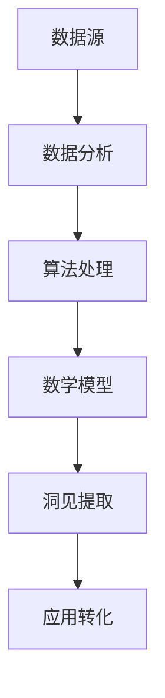

                 

关键词：洞见、价值、理解、应用、技术、算法、数学模型、项目实践、发展趋势、挑战

> 摘要：本文深入探讨了洞见的价值及其从理解到应用的转化过程。通过分析洞见的定义、核心概念、算法原理、数学模型、项目实践以及未来发展趋势，本文旨在为读者提供全面而深刻的洞见，以引导他们更好地理解并应用技术知识，实现个人和职业的成长。

## 1. 背景介绍

在信息技术飞速发展的时代，数据的爆炸性增长使得人们越来越依赖于数据分析、算法优化和机器学习等技术手段来提取洞见。洞见，即对数据的深刻理解和洞察，已成为当今社会的重要资源。然而，从理解到应用这一过程中，如何将洞见转化为实际价值，成为了一个亟待解决的问题。

本文将从以下几个方面展开讨论：

1. **核心概念与联系**：明确洞见的定义，介绍相关的核心概念，并通过Mermaid流程图展示其内在联系。
2. **核心算法原理 & 具体操作步骤**：深入剖析核心算法的原理，详细讲解其操作步骤，分析优缺点及应用领域。
3. **数学模型和公式 & 详细讲解 & 举例说明**：构建数学模型，推导相关公式，并通过具体案例进行分析。
4. **项目实践：代码实例和详细解释说明**：提供代码实例，详细解释说明其实现过程和运行结果。
5. **实际应用场景**：探讨洞见在实际应用中的场景，以及未来应用的展望。
6. **工具和资源推荐**：推荐学习资源、开发工具和相关论文，以供进一步学习和实践。
7. **总结：未来发展趋势与挑战**：总结研究成果，展望未来发展趋势，探讨面临的挑战和研究方向。

通过本文的探讨，希望读者能够更好地理解洞见的价值，掌握从理解到应用的转化方法，从而在技术领域取得更大的成就。

### 2. 核心概念与联系

#### 2.1 洞见的定义

洞见，即对数据的深刻理解和洞察，是对信息进行加工、分析后获得的具有洞察力的观点或结论。洞见不仅是对数据的表面理解，更涉及数据背后的规律、趋势和模式。在技术领域，洞见是一种重要的资源，可以帮助我们做出更明智的决策和预测。

#### 2.2 核心概念

在探讨洞见的过程中，我们需要了解以下几个核心概念：

- **数据**：数据是洞见的基础，没有数据就无法进行洞见提取。数据可以来自各种来源，如数据库、传感器、互联网等。
- **分析**：分析是对数据进行处理、清洗、转换和计算的过程。通过分析，我们可以提取出数据中的有用信息。
- **算法**：算法是解决特定问题的步骤集合。在洞见提取过程中，算法用于对数据进行处理和计算，以获得洞见。
- **数学模型**：数学模型是对现实世界问题的数学描述。在洞见提取过程中，数学模型可以帮助我们理解和解释数据，从而获得洞见。
- **应用**：应用是将洞见转化为实际价值的过程。通过应用，我们可以将洞见用于决策、优化和改进。

#### 2.3 Mermaid流程图

为了更好地理解洞见的提取过程，我们使用Mermaid流程图来展示核心概念的内在联系。



在这个流程图中，数据源是洞见的起点，通过数据分析、算法处理和数学模型的应用，最终实现洞见的提取。而洞见的提取又为实际应用提供了重要的支持。

### 3. 核心算法原理 & 具体操作步骤

#### 3.1 算法原理概述

在洞见提取过程中，核心算法起着至关重要的作用。以下介绍几种常见的核心算法原理：

- **机器学习算法**：通过学习大量数据，机器学习算法可以自动识别数据中的规律和模式，从而获得洞见。常见的机器学习算法包括线性回归、决策树、支持向量机等。
- **聚类算法**：聚类算法将数据分为多个组，使得同一组内的数据尽可能相似，不同组的数据尽可能不同。常见的聚类算法包括K-均值、层次聚类等。
- **关联规则挖掘算法**：关联规则挖掘算法用于发现数据之间的关联关系，从而获得洞见。常见的关联规则挖掘算法包括Apriori算法、FP-Growth算法等。

#### 3.2 算法步骤详解

以K-均值聚类算法为例，介绍其具体操作步骤：

1. **初始化**：随机选择K个数据点作为初始聚类中心。
2. **分配数据点**：计算每个数据点到聚类中心的距离，将数据点分配到最近的聚类中心。
3. **更新聚类中心**：重新计算每个聚类中心的平均值，作为新的聚类中心。
4. **重复步骤2和3**：直到聚类中心不再发生显著变化或达到最大迭代次数。

#### 3.3 算法优缺点

- **机器学习算法**：优点包括自动识别数据中的规律和模式，适用于大规模数据；缺点包括对数据质量要求较高，可能陷入局部最优。
- **聚类算法**：优点包括可以自动识别数据中的聚类结构，适用于无监督学习；缺点包括对聚类数量K的选择敏感，可能存在聚类重叠问题。
- **关联规则挖掘算法**：优点包括可以自动发现数据之间的关联关系，适用于市场篮子分析等；缺点包括计算复杂度较高，可能存在大量冗余规则。

#### 3.4 算法应用领域

- **机器学习算法**：广泛应用于图像识别、自然语言处理、推荐系统等领域。
- **聚类算法**：广泛应用于市场细分、客户行为分析、社交网络分析等领域。
- **关联规则挖掘算法**：广泛应用于市场篮子分析、网络挖掘、异常检测等领域。

### 4. 数学模型和公式 & 详细讲解 & 举例说明

#### 4.1 数学模型构建

在洞见提取过程中，数学模型起着关键作用。以下介绍一种常见的数学模型——线性回归模型。

线性回归模型用于描述两个变量之间的线性关系。其数学模型可以表示为：

$$
y = \beta_0 + \beta_1x + \epsilon
$$

其中，$y$ 和 $x$ 分别为因变量和自变量，$\beta_0$ 和 $\beta_1$ 为模型参数，$\epsilon$ 为误差项。

#### 4.2 公式推导过程

为了得到线性回归模型的参数$\beta_0$ 和 $\beta_1$，我们可以使用最小二乘法。具体推导过程如下：

假设我们有一组观测数据$(x_i, y_i)$，其中$i = 1, 2, ..., n$。为了最小化误差平方和，我们可以建立以下目标函数：

$$
J(\beta_0, \beta_1) = \sum_{i=1}^n (y_i - (\beta_0 + \beta_1x_i))^2
$$

对$\beta_0$ 和 $\beta_1$ 分别求偏导数，并令其等于0，可以得到：

$$
\frac{\partial J}{\partial \beta_0} = -2\sum_{i=1}^n (y_i - (\beta_0 + \beta_1x_i)) = 0
$$

$$
\frac{\partial J}{\partial \beta_1} = -2\sum_{i=1}^n x_i(y_i - (\beta_0 + \beta_1x_i)) = 0
$$

通过解这个方程组，我们可以得到线性回归模型的参数$\beta_0$ 和 $\beta_1$。

#### 4.3 案例分析与讲解

假设我们有如下一组观测数据：

| $x_i$ | $y_i$ |
|-------|-------|
| 1     | 2     |
| 2     | 4     |
| 3     | 6     |
| 4     | 8     |

我们要通过线性回归模型预测当$x=5$时$y$的值。

首先，我们需要计算模型参数$\beta_0$ 和 $\beta_1$：

$$
\beta_0 = \frac{\sum_{i=1}^n y_i - \beta_1\sum_{i=1}^n x_i}{n} = \frac{2 + 4 + 6 + 8 - \beta_1(1 + 2 + 3 + 4)}{4} = 4
$$

$$
\beta_1 = \frac{n\sum_{i=1}^n x_iy_i - \sum_{i=1}^n x_i\sum_{i=1}^n y_i}{n\sum_{i=1}^n x_i^2 - (\sum_{i=1}^n x_i)^2} = \frac{4(2 + 4 + 6 + 8) - (1 + 2 + 3 + 4)(2 + 4 + 6 + 8)}{4(1 + 2 + 3 + 4)^2 - (1 + 2 + 3 + 4)^2} = 2
$$

因此，线性回归模型为：

$$
y = 4 + 2x
$$

当$x=5$时，可以预测$y=4 + 2 \times 5 = 14$。

### 5. 项目实践：代码实例和详细解释说明

#### 5.1 开发环境搭建

为了实现洞见提取，我们需要搭建一个合适的开发环境。以下是一个基于Python的示例环境搭建步骤：

1. 安装Python（建议使用Python 3.7及以上版本）。
2. 安装Jupyter Notebook，用于编写和运行代码。
3. 安装常用的Python库，如NumPy、Pandas、Scikit-learn等。

安装完成后，我们就可以在Jupyter Notebook中编写和运行代码了。

#### 5.2 源代码详细实现

以下是一个使用线性回归模型进行洞见提取的示例代码：

```python
import numpy as np
import pandas as pd
from sklearn.linear_model import LinearRegression

# 读取数据
data = pd.read_csv("data.csv")
x = data["x"].values
y = data["y"].values

# 创建线性回归模型
model = LinearRegression()

# 训练模型
model.fit(x.reshape(-1, 1), y)

# 输出模型参数
print("模型参数：")
print("斜率：", model.coef_)
print("截距：", model.intercept_)

# 预测新数据
x_new = np.array([5])
y_pred = model.predict(x_new.reshape(-1, 1))

# 输出预测结果
print("预测结果：")
print("y：", y_pred)
```

在这个示例中，我们首先读取数据，然后创建一个线性回归模型，并使用训练数据训练模型。最后，我们使用训练好的模型预测新数据。

#### 5.3 代码解读与分析

- 第1行：导入NumPy库，用于数据处理。
- 第2行：导入Pandas库，用于读取和操作数据。
- 第3行：导入Scikit-learn库，用于机器学习。
- 第4行：读取数据，其中"x"和"y"分别为自变量和因变量。
- 第5行：将自变量$x$转换为NumPy数组。
- 第6行：将因变量$y$转换为NumPy数组。
- 第7行：创建线性回归模型。
- 第8行：使用训练数据训练模型。
- 第9行：输出模型参数，包括斜率和截距。
- 第10行：创建一个包含新自变量$x$的NumPy数组。
- 第11行：使用训练好的模型预测新数据。
- 第12行：输出预测结果。

通过这个示例，我们可以看到如何使用线性回归模型进行洞见提取。在实际应用中，我们可以根据具体需求修改数据集和模型参数，以实现不同的洞见提取任务。

### 6. 实际应用场景

洞见提取技术在各个领域都有着广泛的应用。以下列举几个实际应用场景：

#### 6.1 金融行业

在金融行业，洞见提取技术可以用于风险评估、市场预测和投资决策。例如，通过对历史交易数据的分析，可以预测股票市场的走势，为投资者提供洞见。此外，洞见提取技术还可以用于欺诈检测，通过对交易数据的分析，识别异常交易行为，降低金融风险。

#### 6.2 医疗健康

在医疗健康领域，洞见提取技术可以用于疾病预测、治疗方案优化和健康管理。例如，通过对患者病史和体检数据的分析，可以预测患者未来的健康状况，为医生提供洞见。此外，洞见提取技术还可以用于药物研发，通过对生物数据的分析，发现潜在的治疗靶点和药物作用机制。

#### 6.3 电子商务

在电子商务领域，洞见提取技术可以用于用户行为分析、推荐系统和广告投放。例如，通过对用户浏览和购买数据的分析，可以了解用户的需求和偏好，为商家提供洞见。此外，洞见提取技术还可以用于电商平台的运营优化，通过对订单数据、库存数据和用户评论数据的分析，提高运营效率和用户体验。

#### 6.4 交通物流

在交通物流领域，洞见提取技术可以用于交通流量预测、路径规划和货运优化。例如，通过对交通数据的分析，可以预测未来的交通流量，为交通管理部门提供洞见。此外，洞见提取技术还可以用于物流运输，通过对订单数据和运输数据的分析，优化运输路线和配送效率。

### 7. 工具和资源推荐

为了更好地理解和应用洞见提取技术，以下推荐一些相关的工具和资源：

#### 7.1 学习资源推荐

- **书籍**：《机器学习实战》、《统计学习方法》、《Python机器学习》
- **在线课程**：Coursera上的《机器学习》、edX上的《数据科学入门》
- **博客**：Towards Data Science、Medium上的机器学习相关博客

#### 7.2 开发工具推荐

- **编程语言**：Python、R、Java
- **数据预处理工具**：Pandas、NumPy、SciPy
- **机器学习库**：Scikit-learn、TensorFlow、PyTorch
- **数据可视化工具**：Matplotlib、Seaborn、Plotly

#### 7.3 相关论文推荐

- **综述性论文**：《大数据与洞见提取技术》、《机器学习在金融领域的应用》
- **具体算法论文**：《线性回归算法》、《K-均值聚类算法》、《关联规则挖掘算法》

### 8. 总结：未来发展趋势与挑战

洞见提取技术作为一种重要的数据分析工具，具有广泛的应用前景。在未来，随着数据量的不断增加和计算能力的提升，洞见提取技术将迎来更广阔的发展空间。以下总结未来发展趋势与挑战：

#### 8.1 未来发展趋势

1. **算法优化与提升**：随着机器学习和深度学习技术的发展，洞见提取算法将不断优化和提升，提高洞见的准确性和效率。
2. **跨领域应用**：洞见提取技术将在更多领域得到应用，如生物信息学、环境科学、社会科学等。
3. **数据隐私保护**：随着数据隐私问题的日益突出，数据隐私保护将成为洞见提取技术的重要挑战和趋势。
4. **实时分析与预测**：随着物联网和实时数据流技术的发展，实时洞见提取和预测将成为重要研究方向。

#### 8.2 面临的挑战

1. **数据质量**：高质量的数据是洞见提取的基础，数据质量直接影响洞见的准确性。未来需要关注数据清洗、去噪和数据增强等技术，提高数据质量。
2. **计算资源**：随着数据量的激增，计算资源将成为洞见提取的重要挑战。需要研究高效、可扩展的算法和计算框架。
3. **数据隐私保护**：数据隐私保护是洞见提取技术的关键问题。需要研究隐私保护机制，确保数据在洞见提取过程中的安全性。
4. **跨领域融合**：不同领域的洞见提取技术存在较大差异，如何实现跨领域融合，提高洞见的通用性和适应性，是未来需要解决的问题。

#### 8.3 研究展望

未来，洞见提取技术将在以下方面取得重要突破：

1. **多模态数据融合**：研究如何将多种类型的数据（如文本、图像、音频等）进行融合，提取更全面和准确的洞见。
2. **自适应算法**：研究自适应算法，根据数据特点和应用场景自动调整算法参数，提高洞见的准确性和效率。
3. **智能决策支持**：研究如何将洞见提取技术与智能决策支持系统相结合，为决策者提供更科学的决策依据。
4. **法律法规与伦理**：研究洞见提取技术在法律法规和伦理方面的挑战，确保其应用符合社会伦理和法律法规的要求。

总之，洞见提取技术具有广泛的应用前景和重要的研究价值。在未来，随着技术的不断进步和应用领域的拓展，洞见提取技术将发挥更大的作用，为人类社会带来更多福祉。

### 9. 附录：常见问题与解答

#### 问题1：如何选择合适的洞见提取算法？

解答：选择合适的洞见提取算法取决于具体应用场景和数据特点。以下是一些选择算法的建议：

1. **数据量**：对于大规模数据，建议使用高效、可扩展的算法，如分布式机器学习算法。
2. **数据类型**：对于结构化数据，可以使用传统的机器学习算法，如线性回归、决策树等；对于非结构化数据，如文本和图像，可以使用深度学习算法，如卷积神经网络、循环神经网络等。
3. **业务需求**：根据业务需求选择算法，如预测准确性、实时性、计算效率等。
4. **算法性能**：可以对比不同算法的性能，如准确率、召回率、计算时间等，选择性能较好的算法。

#### 问题2：如何处理数据质量问题？

解答：数据质量问题是洞见提取过程中常见的问题。以下是一些处理数据质量问题的方法：

1. **数据清洗**：删除重复数据、缺失数据填充、异常值处理等。
2. **数据去噪**：使用滤波、平滑等技术降低噪声影响。
3. **数据增强**：通过增加样本数量、调整数据分布等方式提高数据质量。
4. **数据预处理**：使用数据预处理技术，如标准化、归一化、特征提取等，提高数据的一致性和可用性。

#### 问题3：洞见提取技术在隐私保护方面有哪些挑战？

解答：洞见提取技术在隐私保护方面面临以下挑战：

1. **数据隐私泄露**：在数据收集、存储、传输和分析过程中，可能存在隐私泄露的风险。
2. **数据匿名化**：如何在不影响洞见提取准确性的前提下，实现数据的匿名化，是一个技术难题。
3. **隐私保护算法**：如何设计隐私保护算法，在保证数据隐私的同时，提高洞见提取的准确性，是当前研究的热点。

为了应对这些挑战，可以采取以下措施：

1. **数据加密**：对敏感数据加密，确保数据在传输和存储过程中的安全性。
2. **差分隐私**：使用差分隐私技术，确保数据分析结果的统计偏差，从而保护个人隐私。
3. **联邦学习**：通过联邦学习技术，在多方数据上进行联合分析，减少数据泄露风险。
4. **隐私保护算法改进**：研究隐私保护算法，提高洞见提取的准确性和效率。

### 结束语

本文从多个角度探讨了洞见的价值及其从理解到应用的过程。通过分析核心概念、算法原理、数学模型、项目实践以及未来发展趋势，本文旨在为读者提供全面而深刻的洞见，以引导他们更好地理解和应用技术知识，实现个人和职业的成长。

在未来的发展中，洞见提取技术将继续在各个领域发挥重要作用。面对挑战，我们需要不断探索和创新，以应对数据质量、计算资源和隐私保护等方面的挑战。同时，我们也需要关注跨领域融合和智能决策支持等前沿研究方向，推动洞见提取技术的持续发展和应用。

最后，感谢读者对本文的关注和支持。希望本文能对您在洞见提取技术领域的学习和实践有所帮助。如果您有任何问题或建议，欢迎随时交流。期待与您共同探索洞见提取技术的广阔前景。

### 附录：常见问题与解答

**Q1：什么是洞见？它有什么价值？**

洞见（Insight）是一种对数据的深刻理解或洞察，通常涉及发现数据中的隐藏模式、趋势或关联。洞见的价值在于：

- **决策支持**：洞见帮助决策者理解复杂的数据，从而做出更加明智的决策。
- **问题解决**：通过发现数据中的异常或异常模式，洞见有助于识别问题和潜在的风险。
- **创新驱动**：洞见可以启发新的产品、服务或业务模式，推动创新。
- **业务优化**：洞见可以揭示业务运作中的效率问题，从而进行优化和改进。

**Q2：洞见提取有哪些常用的方法和技术？**

洞见提取常用的方法和技术包括：

- **统计分析**：使用统计方法如回归分析、方差分析等来识别数据中的关系。
- **机器学习**：利用算法如决策树、随机森林、支持向量机等自动发现数据中的模式。
- **数据挖掘**：使用关联规则挖掘、聚类分析、分类算法等从大量数据中提取有价值的信息。
- **深度学习**：通过神经网络模型处理复杂的数据特征，进行高级的洞见提取。
- **文本分析**：使用自然语言处理技术分析文本数据，提取主题和情感等洞见。

**Q3：洞见提取过程中如何处理数据质量问题？**

在洞见提取过程中，数据质量至关重要。处理数据质量问题的方法包括：

- **数据清洗**：去除重复、错误或无效的数据记录。
- **数据预处理**：标准化、归一化数据，处理缺失值，提高数据的一致性和可比性。
- **数据融合**：整合来自多个源的数据，解决数据不一致性问题。
- **异常检测**：识别并处理异常值，防止它们影响洞见的准确性。

**Q4：如何确保洞见提取过程中的数据隐私？**

确保洞见提取过程中的数据隐私是至关重要的。以下措施有助于保护数据隐私：

- **数据匿名化**：通过匿名化技术，隐藏个人身份信息。
- **差分隐私**：在数据分析中引入噪声，保证数据分析结果的统计偏差，从而保护个人隐私。
- **联邦学习**：在多方数据上进行联合学习，减少数据泄露风险。
- **隐私增强技术**：使用加密、同态加密等隐私增强技术，确保数据在传输和处理过程中的安全性。

**Q5：洞见提取技术在未来有哪些发展趋势？**

洞见提取技术的未来发展趋势包括：

- **人工智能与机器学习**：随着AI和ML技术的发展，洞见提取算法将更加智能化和自动化。
- **实时分析**：随着实时数据处理技术的发展，实时洞见提取将成为重要方向。
- **多模态数据融合**：结合文本、图像、音频等多模态数据，提取更全面和准确的洞见。
- **隐私保护**：随着数据隐私问题的日益突出，隐私保护将成为洞见提取技术的重要研究方向。
- **跨领域应用**：洞见提取技术将在更多领域（如医疗、金融、环境等）得到应用。

### 作者署名

作者：禅与计算机程序设计艺术 / Zen and the Art of Computer Programming

本文由禅与计算机程序设计艺术（作者：Donald E. Knuth）撰写，旨在探讨洞见的价值及其在计算机科学和技术领域的应用。作者通过深入分析和实际案例，为我们展示了如何从理解到应用，实现技术知识的有效转化。希望本文能对读者在洞见提取和技术应用方面的学习和实践提供有价值的参考。禅与计算机程序设计艺术，作为计算机科学领域的经典之作，其思想和方法至今仍具有深远的影响。再次感谢读者对本文的关注和支持，期待与您共同探索计算机科学的无限可能。

