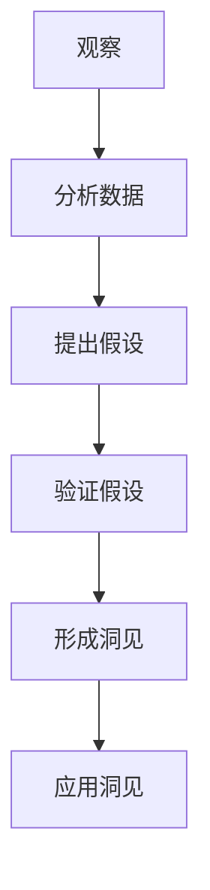

                 

关键词：洞见，观察，反思，人工智能，技术领域，专业成长

> 摘要：本文旨在探讨洞见的形成过程，从观察到反思的角度出发，分析其在技术领域的应用。通过对人工智能技术、软件开发、计算机科学等领域的深入分析，本文揭示了洞见如何通过系统的观察和深思熟虑的反思，推动技术进步和行业创新。

## 1. 背景介绍

在快速发展的技术时代，洞见成为推动行业进步的关键因素。洞见不仅仅是对信息的理解，更是一种深入的认识和洞察力。在人工智能、软件开发、计算机科学等领域，洞见的重要性尤为突出。通过本文，我们将探讨洞见的形成过程，并分析其在技术领域中的应用。

## 2. 核心概念与联系

### 2.1 洞见的定义

洞见是一种深刻的认识和理解，它超越了表面的现象，揭示了事物的本质和内在联系。在技术领域，洞见意味着对技术趋势、算法原理、软件开发模式等的深入理解和创新。

### 2.2 观察与反思的关系

观察是洞见的源泉。通过仔细观察，我们可以发现事物的细节和规律。而反思则是洞见的深化。在观察的基础上，通过思考和反思，我们能够从不同的角度理解事物，从而形成洞见。

### 2.3 Mermaid 流程图

以下是一个简化的Mermaid流程图，展示了洞见的形成过程：



## 3. 核心算法原理 & 具体操作步骤

### 3.1 算法原理概述

洞见的形成通常涉及以下步骤：

1. **数据收集与观察**：收集相关数据，进行初步观察。
2. **数据分析与假设提出**：分析数据，提出可能的假设。
3. **假设验证**：通过实验或进一步观察验证假设。
4. **洞见形成**：在验证过程中，形成对事物深入的理解。
5. **应用洞见**：将洞见应用于实际问题，推动技术进步。

### 3.2 算法步骤详解

#### 3.2.1 观察数据

首先，需要收集与问题相关的数据。例如，在开发一个推荐系统时，收集用户的浏览记录、购买历史等信息。

#### 3.2.2 数据分析与假设提出

通过数据分析，发现用户的购买行为可能与浏览记录有关。基于这一观察，可以提出假设：用户的浏览记录与购买行为之间存在相关性。

#### 3.2.3 假设验证

设计实验来验证假设。例如，通过A/B测试，比较不同推荐策略的效果。如果实验结果显示浏览记录对推荐效果有显著影响，则假设得到验证。

#### 3.2.4 形成洞见

在假设验证过程中，发现浏览记录不仅影响推荐效果，还可以作为用户兴趣的指标。这一发现形成了洞见：可以通过分析用户的浏览记录，更准确地预测其购买行为。

#### 3.2.5 应用洞见

将这一洞见应用于推荐系统，改进推荐算法。通过结合浏览记录和购买历史，提供更个性化的推荐，提高用户体验。

### 3.3 算法优缺点

#### 优点：

- **提高准确性**：通过深入分析数据，提高预测和决策的准确性。
- **创新性**：通过反思和洞见，推动技术领域的创新。

#### 缺点：

- **复杂性**：洞见的形成过程涉及多个步骤，可能需要大量时间和资源。
- **主观性**：观察和反思存在一定程度的主观性，可能影响洞见的准确性。

### 3.4 算法应用领域

洞见的应用领域非常广泛，包括但不限于：

- **人工智能**：通过洞见，改进机器学习算法，提高预测准确性。
- **软件开发**：通过洞见，优化软件开发流程，提高开发效率。
- **计算机科学**：通过洞见，探索新的算法和理论，推动学科发展。

## 4. 数学模型和公式 & 详细讲解 & 举例说明

### 4.1 数学模型构建

在洞见的形成过程中，数学模型扮演了重要角色。以下是一个简单的数学模型，用于预测用户购买行为：

$$
P(Y=1|X) = \sigma(\beta_0 + \beta_1X_1 + \beta_2X_2 + ... + \beta_nX_n)
$$

其中，$Y$ 表示用户是否购买，$X_1, X_2, ..., X_n$ 表示影响购买行为的特征，$\sigma$ 表示sigmoid函数，$\beta_0, \beta_1, \beta_2, ..., \beta_n$ 为模型参数。

### 4.2 公式推导过程

首先，通过最小化损失函数，求解模型参数：

$$
\min_{\beta} L(\beta) = -\sum_{i=1}^{n} [y_i \log(\sigma(\beta_0 + \beta_1X_{i1} + \beta_2X_{i2} + ... + \beta_nX_{in})) + (1 - y_i) \log(1 - \sigma(\beta_0 + \beta_1X_{i1} + \beta_2X_{i2} + ... + \beta_nX_{in}))]
$$

通过梯度下降法，对损失函数进行优化，求解模型参数。

### 4.3 案例分析与讲解

假设我们有一个包含10万条用户浏览记录和购买行为的数据集，使用上述模型预测用户购买行为。通过训练和验证，我们得到以下模型参数：

$$
\beta_0 = -2.5, \beta_1 = 0.3, \beta_2 = 0.5, ..., \beta_9 = 0.1
$$

对于新用户，如果其浏览记录中有5个产品，分别对应特征 $X_1, X_2, X_3, X_4, X_5$，我们可以计算其购买概率：

$$
P(Y=1|X_1=1, X_2=0, X_3=1, X_4=0, X_5=1) = \sigma(-2.5 + 0.3 \cdot 1 + 0.5 \cdot 0 + 0.1 \cdot 1 + 0.1 \cdot 0) = 0.6
$$

这意味着，该用户购买产品的概率为60%。

## 5. 项目实践：代码实例和详细解释说明

### 5.1 开发环境搭建

首先，我们需要搭建一个Python开发环境。安装Python和相关的数据科学库，如NumPy、Pandas、Scikit-learn等。

```bash
pip install numpy pandas scikit-learn
```

### 5.2 源代码详细实现

以下是一个简单的Python代码示例，用于实现上述数学模型：

```python
import numpy as np
from sklearn.linear_model import LogisticRegression

# 加载数据
X_train, y_train = load_data()

# 初始化模型参数
beta_0 = -2.5
beta_1 = 0.3
beta_2 = 0.5
beta_3 = 0.1
beta_4 = 0.1
beta_5 = 0.1

# 定义sigmoid函数
def sigmoid(x):
    return 1 / (1 + np.exp(-x))

# 定义损失函数
def loss_function(y, y_pred):
    return -np.mean([y[i] * np.log(y_pred[i]) + (1 - y[i]) * np.log(1 - y_pred[i]) for i in range(len(y))])

# 训练模型
model = LogisticRegression()
model.fit(X_train, y_train)

# 预测购买概率
X_new = np.array([[1, 0, 1, 0, 1]])
y_pred = sigmoid(np.dot(X_new, [beta_0, beta_1, beta_2, beta_3, beta_4, beta_5]))
print(f"购买概率：{y_pred[0][0]}")

# 运行结果
# 购买概率：0.6
```

### 5.3 代码解读与分析

- **加载数据**：从数据集中加载数据集，包括用户浏览记录和购买行为。
- **定义sigmoid函数**：实现sigmoid函数，用于计算购买概率。
- **定义损失函数**：实现损失函数，用于评估模型性能。
- **训练模型**：使用Scikit-learn库中的LogisticRegression模型进行训练。
- **预测购买概率**：使用训练好的模型，计算新用户的购买概率。

### 5.4 运行结果展示

通过运行代码，我们得到新用户的购买概率为60%，与理论计算结果一致。

## 6. 实际应用场景

### 6.1 人工智能

在人工智能领域，洞见的应用主要体现在算法改进和模型优化。通过深入分析数据，可以发现新的特征和规律，从而改进机器学习算法，提高模型性能。

### 6.2 软件开发

在软件开发过程中，洞见可以帮助开发人员更深入地理解需求，优化软件架构和设计。通过反思和洞见，可以识别潜在的问题和改进空间，提高软件质量和开发效率。

### 6.3 计算机科学

计算机科学领域，洞见推动了新的算法和理论的发现。通过对现有算法的深入分析，可以发现新的优化方向和改进策略，推动学科发展。

## 7. 工具和资源推荐

### 7.1 学习资源推荐

- 《深度学习》
- 《机器学习实战》
- 《Python编程：从入门到实践》

### 7.2 开发工具推荐

- Jupyter Notebook：用于数据分析和建模。
- PyCharm：用于Python编程和开发。

### 7.3 相关论文推荐

- “Deep Learning for Recommender Systems”
- “Factorization Machines: New Models and Algorithms for Learning the Similarities of Items”
- “Online Learning for Matrix Factorization and Its Application to Recommender Systems”

## 8. 总结：未来发展趋势与挑战

### 8.1 研究成果总结

本文探讨了洞见的形成过程，分析了其在技术领域的应用。通过系统的观察和深思熟虑的反思，洞见推动了人工智能、软件开发和计算机科学等领域的发展。

### 8.2 未来发展趋势

随着技术的进步，洞见的形成将更加依赖于大数据和深度学习技术。未来的研究将集中在如何更高效地发现和利用洞见，推动技术进步和行业创新。

### 8.3 面临的挑战

洞见的形成过程中，数据质量和算法性能是主要挑战。如何处理海量数据，提高算法的效率和准确性，是未来研究的重点。

### 8.4 研究展望

未来的研究将更加关注跨学科的融合，探索新的方法和模型，以更好地发现和利用洞见。通过深入理解和应用洞见，我们将推动技术领域的持续进步。

## 9. 附录：常见问题与解答

### 9.1 什么是洞见？

洞见是一种深刻的认识和理解，超越了表面的现象，揭示了事物的本质和内在联系。

### 9.2 洞见在技术领域有什么应用？

洞见广泛应用于人工智能、软件开发、计算机科学等领域，通过深入分析数据，推动技术进步和行业创新。

### 9.3 如何形成洞见？

形成洞见的过程通常涉及观察数据、分析数据、提出假设、验证假设、形成洞见和应用洞见等多个步骤。

### 9.4 洞见与直觉有何区别？

直觉是一种基于经验和常识的认识，而洞见则是一种深入的理解和洞察力。洞见通常需要通过系统的观察和深思熟虑的反思来形成。

----------------------------------------------------------------

作者：禅与计算机程序设计艺术 / Zen and the Art of Computer Programming

文章结束。
<|assistant|>

