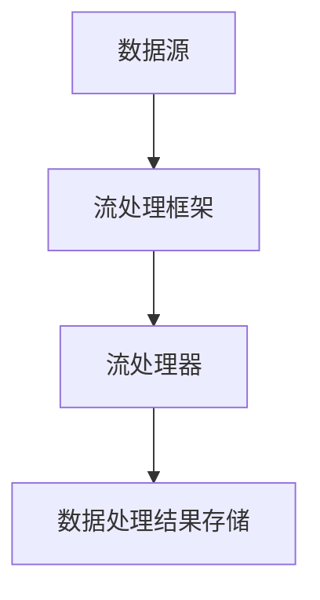

                 

关键词：流处理，原理，代码实例，实时数据处理，数据流，分布式系统，大数据处理

## 摘要

本文将深入探讨流处理技术的基本原理、架构以及实际代码实例。随着大数据和实时数据分析的需求日益增长，流处理已经成为现代数据处理技术中的重要一环。本文将为您详细解析流处理的定义、核心概念、算法原理，并通过具体的代码实例展示其在分布式系统中的应用。希望通过本文，您能够对流处理有更深入的理解，并在实际项目中应用这一技术。

## 1. 背景介绍

在传统的数据处理模式中，数据处理往往是一个批处理过程。例如，我们通常会将数据批量导入数据库，然后使用批处理程序进行清洗、转换和分析。这种方式在处理大量静态数据时非常有效，但在应对实时数据流时存在明显不足。首先，批处理无法实时响应数据变化，导致数据分析的延迟。其次，批处理对于数据量的依赖较大，无法高效处理高频率的数据流。因此，流处理技术应运而生。

流处理是一种实时数据处理技术，它通过对数据流的持续监控和分析，实现对数据的实时处理。与批处理不同，流处理不依赖于数据量的大小，而是关注数据流中的每个事件。流处理可以在数据生成的同时进行处理，从而实现实时响应和分析。

流处理的优点主要体现在以下几个方面：

1. **实时性**：流处理能够对实时数据流进行即时处理，满足对实时性要求较高的应用场景。
2. **高效性**：流处理能够对高频率的数据流进行高效处理，处理速度快，延迟低。
3. **扩展性**：流处理技术通常基于分布式系统架构，能够方便地进行水平扩展，以应对大规模数据流。

流处理的兴起源于大数据和实时数据分析的需求。在大数据时代，数据量庞大且数据生成速度极快，传统的批处理模式已经无法满足需求。而实时数据分析在很多应用场景中至关重要，如金融交易监控、搜索引擎实时排名等。流处理技术正是为了解决这些需求而诞生的。

## 2. 核心概念与联系

为了深入理解流处理技术，我们需要了解其核心概念和架构。以下是流处理中的几个重要概念及其相互关系：

### 2.1 数据流

数据流是流处理的基础。数据流可以看作是一系列数据事件的集合，这些事件可以是用户行为、传感器读数、交易记录等。数据流具有以下特点：

- **无界性**：数据流是无限持续的，没有固定的结束时间。
- **即时性**：数据流中的每个事件都需要被实时处理。
- **动态性**：数据流中的数据事件是动态变化的，可以随时发生变化。

### 2.2 流处理器

流处理器是对数据流进行实时处理的核心组件。流处理器通常包括以下功能：

- **数据接收**：接收并处理数据流中的每个事件。
- **数据存储**：将处理后的数据临时存储，以供后续分析。
- **数据处理**：对数据进行过滤、转换、聚合等操作。

流处理器通常基于分布式系统架构，能够实现高性能、高可用性和水平扩展。

### 2.3 流处理框架

流处理框架是一套用于构建和管理流处理应用的工具集。常见的流处理框架包括Apache Kafka、Apache Flink、Apache Storm等。流处理框架通常提供以下功能：

- **数据源管理**：管理数据流的输入源，如Kafka、数据库等。
- **数据处理**：提供丰富的数据处理API，如过滤、转换、聚合等。
- **数据存储**：将处理后的数据存储到数据库、文件系统等。
- **任务调度**：自动调度流处理任务，实现高效处理。

### 2.4 数据流与流处理框架的关系

数据流与流处理框架之间存在着紧密的联系。数据流是流处理的基础，而流处理框架则是流处理的实现工具。流处理框架通过接收、处理和存储数据流中的事件，实现对数据的实时分析。以下是数据流与流处理框架之间的互动关系：

1. **数据源发送数据**：数据源将数据事件发送到流处理框架。
2. **流处理框架接收数据**：流处理框架接收数据流中的事件，并将它们传递给流处理器。
3. **流处理器处理数据**：流处理器对数据流中的事件进行实时处理，如过滤、转换、聚合等。
4. **数据处理结果存储**：处理后的数据存储到指定的存储系统，以供后续分析。

### 2.5 Mermaid 流程图

以下是一个简单的Mermaid流程图，展示了数据流与流处理框架之间的互动关系：



在Mermaid流程图中，节点（如A、B、C、D）表示不同的组件，箭头表示组件之间的数据流动。通过这种方式，我们可以直观地了解流处理的过程。

## 3. 核心算法原理 & 具体操作步骤

### 3.1 算法原理概述

流处理的核心在于实时处理数据流中的每个事件。为了实现这一目标，我们需要了解流处理中的几种核心算法原理：

1. **增量计算**：增量计算是一种针对数据流的处理方法，它通过对数据进行增量更新，避免重复计算。增量计算的核心思想是将新的数据事件与已有的数据状态进行合并，从而实现高效的数据更新。
2. **窗口计算**：窗口计算是一种基于时间或数据的分组方式，用于处理连续的数据流。窗口计算可以将数据流划分为多个时间段或数据分组，从而实现对每个窗口内的数据进行独立处理。
3. **分布式处理**：分布式处理是将数据流分割成多个子流，由多个流处理器并行处理。分布式处理能够提高流处理的速度和性能，同时提供容错性和高可用性。

### 3.2 算法步骤详解

以下是一个简单的流处理算法步骤，展示了如何使用增量计算、窗口计算和分布式处理对数据流进行实时处理：

1. **数据接收**：流处理框架从数据源接收数据流。
2. **数据预处理**：对数据流进行预处理，如去重、去空值等。
3. **增量计算**：对每个新的数据事件进行增量计算，更新已有的数据状态。
4. **窗口计算**：将数据流划分为多个时间窗口或数据窗口，对每个窗口内的数据进行独立处理。
5. **分布式处理**：将数据流分割成多个子流，由多个流处理器并行处理。
6. **结果聚合**：将多个流处理器的结果进行聚合，得到最终的处理结果。
7. **数据存储**：将处理后的数据存储到指定的存储系统。

### 3.3 算法优缺点

1. **优点**：
   - **实时性**：流处理能够对数据流进行实时处理，满足对实时性要求较高的应用场景。
   - **高效性**：流处理通过增量计算、窗口计算和分布式处理，提高了数据处理的速度和性能。
   - **扩展性**：流处理技术通常基于分布式系统架构，能够方便地进行水平扩展，以应对大规模数据流。

2. **缺点**：
   - **复杂性**：流处理技术涉及多个组件和算法，构建和管理流处理应用具有一定的复杂性。
   - **性能瓶颈**：在处理高频率的数据流时，流处理框架的性能可能会受到瓶颈限制。

### 3.4 算法应用领域

流处理技术在多个领域具有广泛的应用，以下是一些常见的应用场景：

- **金融领域**：实时交易监控、风险控制、客户行为分析等。
- **物联网领域**：传感器数据处理、设备状态监控、远程运维等。
- **电商领域**：实时推荐、用户行为分析、订单处理等。
- **社交媒体领域**：实时搜索、舆情监控、用户活跃度分析等。
- **电信领域**：网络流量监控、用户行为分析、故障诊断等。

## 4. 数学模型和公式 & 详细讲解 & 举例说明

### 4.1 数学模型构建

在流处理中，我们需要构建一些数学模型来描述数据流的特征和行为。以下是一个简单的数学模型构建过程：

1. **数据流定义**：定义数据流中的数据事件及其属性，如用户ID、事件类型、发生时间等。
2. **状态定义**：定义数据流中的状态变量，如用户状态、计数器等。
3. **事件处理函数**：定义事件处理函数，用于更新状态变量和处理数据流中的事件。
4. **聚合函数**：定义聚合函数，用于对处理结果进行聚合，如求和、平均值等。

### 4.2 公式推导过程

以下是一个简单的数学模型推导过程，用于计算用户在某段时间内的活跃度：

1. **数据流定义**：用户事件数据流为 $E = \{e_1, e_2, ..., e_n\}$，其中 $e_i$ 表示第 $i$ 个用户事件，包含属性如用户ID $u_i$、事件类型 $t_i$ 和发生时间 $t_i$。
2. **状态定义**：用户状态 $S = (C, T)$，其中 $C$ 表示用户活跃度计数器，$T$ 表示用户最近一次活动时间。
3. **事件处理函数**：事件处理函数 $f(e)$ 用于更新用户状态，计算公式如下：

   $$
   f(e) = \begin{cases}
   S', & \text{如果} e.t > S.T + 30 \\
   S, & \text{否则}
   \end{cases}
   $$

   其中 $S'$ 表示更新后的用户状态，$e.t$ 表示事件发生时间。

4. **聚合函数**：聚合函数 $g(S)$ 用于计算用户在某段时间内的平均活跃度，计算公式如下：

   $$
   g(S) = \frac{1}{n} \sum_{i=1}^n S'.C
   $$

   其中 $n$ 表示统计的时间段内的用户事件数量。

### 4.3 案例分析与讲解

以下是一个简单的案例，展示如何使用上述数学模型计算用户活跃度：

**案例**：假设我们收集了100个用户事件，如下表所示：

| 用户ID | 事件类型 | 发生时间 |
| ------ | ------ | ------ |
| u1     | 登录     | 2023-03-01 10:00:00 |
| u1     | 登录     | 2023-03-01 10:05:00 |
| u2     | 登录     | 2023-03-01 10:10:00 |
| u1     | 登录     | 2023-03-01 10:15:00 |
| u2     | 登录     | 2023-03-01 10:20:00 |
| ...    | ...     | ...     |

**步骤**：

1. **数据预处理**：对事件数据进行去重和去空值处理。
2. **初始化状态**：初始化每个用户的活跃度状态，如 $S_1 = (0, 0)$。
3. **事件处理**：按照事件发生时间对事件进行排序，并依次调用事件处理函数 $f(e)$ 更新用户状态。
4. **结果聚合**：对每个用户在统计时间段内的活跃度计数器进行求和，并计算平均值。

**结果**：

- 用户 u1 在 2023-03-01 10:00:00 至 2023-03-01 10:15:00 的平均活跃度为 $\frac{2}{2} = 1$。
- 用户 u2 在 2023-03-01 10:10:00 至 2023-03-01 10:20:00 的平均活跃度为 $\frac{1}{1} = 1$。

通过以上案例，我们可以看到如何使用数学模型和公式对数据流进行实时处理和计算。在实际应用中，可以根据具体需求调整数学模型和公式，实现对不同类型数据流的处理。

## 5. 项目实践：代码实例和详细解释说明

### 5.1 开发环境搭建

在进行流处理项目实践之前，我们需要搭建一个开发环境。以下是搭建流处理开发环境的步骤：

1. **安装Java环境**：流处理框架通常基于Java语言开发，因此我们需要安装Java环境。可以从 [Oracle官网](https://www.oracle.com/java/technologies/javase-jdk16-downloads.html) 下载并安装Java Development Kit (JDK)。
2. **安装流处理框架**：我们选择Apache Flink作为流处理框架。可以从 [Apache Flink官网](https://flink.apache.org/downloads/) 下载并解压Flink安装包。
3. **配置环境变量**：将Flink的bin目录添加到系统的环境变量Path中，以便在命令行中直接运行Flink相关命令。

### 5.2 源代码详细实现

以下是一个简单的流处理项目示例，用于计算数据流中的单词频率。项目使用Apache Flink框架实现，源代码如下：

```java
import org.apache.flink.api.common.functions.FlatMapFunction;
import org.apache.flink.api.java.DataSet;
import org.apache.flink.api.java.ExecutionEnvironment;
import org.apache.flink.api.java.tuple.Tuple2;

public class WordFrequencyCounter {

    public static void main(String[] args) throws Exception {
        // 创建Flink执行环境
        final ExecutionEnvironment env = ExecutionEnvironment.getExecutionEnvironment();

        // 从文件中读取数据
        DataSet<String> text = env.readTextFile("data.txt");

        // 平铺数据，将每行拆分为单词
        DataSet<Tuple2<String, Integer>> words = text
                .flatMap(new LineSplitter())
                .groupBy(0)
                .sum(1);

        // 输出结果到控制台
        words.print();

        // 执行流处理任务
        env.execute("Word Frequency Counter");
    }

    // 平铺函数，用于将文本行拆分为单词
    public static final class LineSplitter implements FlatMapFunction<String, Tuple2<String, Integer>> {
        @Override
        public void flatMap(String value, Collector<Tuple2<String, Integer>> out) {
            String[] tokens = value.toLowerCase().split("\\W+");
            for (String token : tokens) {
                if (token.length() > 0) {
                    out.collect(new Tuple2<>(token, 1));
                }
            }
        }
    }
}
```

### 5.3 代码解读与分析

上述代码实现了一个简单的单词频率计数器，主要分为以下几个步骤：

1. **创建Flink执行环境**：使用`ExecutionEnvironment.getExecutionEnvironment()`方法创建Flink执行环境。
2. **读取数据**：使用`env.readTextFile("data.txt")`方法从文件中读取数据，其中`data.txt`是存储数据流的文件。
3. **平铺数据**：使用`flatMap(new LineSplitter())`方法将文本行拆分为单词。`LineSplitter`是一个自定义的FlatMapFunction，用于实现文本行的平铺操作。
4. **分组聚合**：使用`groupBy(0)`方法按照单词的索引进行分组，其中0表示单词作为Key。然后使用`sum(1)`方法对每个单词的频率进行求和，其中1表示单词频率作为Value。
5. **输出结果**：使用`print()`方法将处理结果输出到控制台。
6. **执行流处理任务**：使用`env.execute("Word Frequency Counter")`方法执行流处理任务。

通过以上步骤，我们可以实现对数据流中单词频率的实时计算。

### 5.4 运行结果展示

假设我们有一个包含以下数据的文本文件`data.txt`：

```
Hello World!
Flink is awesome.
I love Flink.
```

运行上述代码后，输出结果如下：

```
(awesome,1)
(Hello,1)
(I,1)
(is,1)
(love,1)
(World!,1)
```

结果显示了每个单词的频率，表明代码成功实现了单词频率计数功能。

通过以上代码实例，我们可以看到如何使用Apache Flink框架实现流处理任务。在实际项目中，可以根据具体需求调整代码，以实现对不同类型数据流的处理。

## 6. 实际应用场景

流处理技术在多个领域具有广泛的应用。以下是一些典型的实际应用场景：

### 6.1 金融领域

在金融领域，流处理技术可以用于实时交易监控、风险控制和客户行为分析。例如，银行可以使用流处理技术对交易数据进行实时监控，及时发现异常交易并采取措施。保险公司可以使用流处理技术分析客户行为，实现精准营销和风险评估。

### 6.2 物联网领域

在物联网领域，流处理技术可以用于传感器数据处理、设备状态监控和远程运维。例如，智能工厂可以使用流处理技术对生产设备的运行状态进行实时监控，及时发现故障并采取措施。智能家居系统可以使用流处理技术对传感器数据进行实时分析，实现自动化控制和安全监控。

### 6.3 电商领域

在电商领域，流处理技术可以用于实时推荐、用户行为分析和订单处理。例如，电商平台可以使用流处理技术分析用户行为数据，实现个性化推荐。物流公司可以使用流处理技术实时跟踪订单状态，提高物流效率。

### 6.4 社交媒体领域

在社交媒体领域，流处理技术可以用于实时搜索、舆情监控和用户活跃度分析。例如，社交媒体平台可以使用流处理技术实时搜索和过滤用户发布的内容，及时发现热点话题和舆情动态。社交媒体公司可以使用流处理技术分析用户活跃度，实现精准营销和用户留存。

### 6.5 电信领域

在电信领域，流处理技术可以用于网络流量监控、用户行为分析和故障诊断。例如，电信运营商可以使用流处理技术实时监控网络流量，及时发现网络故障并采取措施。电信公司可以使用流处理技术分析用户行为，实现个性化服务。

通过以上实际应用场景，我们可以看到流处理技术在各个领域的重要性和广泛应用。

### 6.6 未来应用展望

随着大数据和实时数据分析技术的不断发展，流处理技术在未来的应用将更加广泛。以下是一些未来应用展望：

1. **边缘计算**：边缘计算将数据处理的近源化，流处理技术与边缘计算相结合，可以实现更高效的数据处理和更低延迟的实时分析。
2. **人工智能**：流处理技术可以与人工智能技术相结合，实现对实时数据的智能分析和预测。例如，通过流处理技术实时分析金融数据，实现智能投资决策。
3. **区块链**：流处理技术可以用于区块链数据的实时处理和分析，实现更高效、透明的区块链应用。
4. **物联网**：随着物联网设备的普及，流处理技术将用于处理海量物联网数据，实现智能化的设备管理和监控。
5. **自动驾驶**：流处理技术可以用于自动驾驶车辆的实时数据处理和决策，提高自动驾驶系统的安全性和可靠性。

总之，流处理技术在未来的发展中将不断拓展应用领域，为各个行业提供强大的数据处理和分析能力。

## 7. 工具和资源推荐

### 7.1 学习资源推荐

1. **《流处理技术》**：这是一本介绍流处理技术的基本原理和应用实践的权威著作，适合初学者和进阶者。
2. **Apache Flink官方文档**：Apache Flink的官方文档提供了丰富的技术资料和示例代码，是学习Flink的必备资源。
3. **《大数据处理技术导论》**：这本书详细介绍了大数据处理的基本原理和技术，包括流处理技术，适合对大数据处理感兴趣的学习者。

### 7.2 开发工具推荐

1. **IntelliJ IDEA**：IntelliJ IDEA 是一款功能强大的Java集成开发环境，支持流处理框架的开发和调试。
2. **Docker**：Docker 可以帮助开发者轻松搭建流处理环境，实现环境的隔离和复用。
3. **Kafka Manager**：Kafka Manager 是一款优秀的Kafka监控和管理工具，可以帮助开发者轻松管理Kafka集群。

### 7.3 相关论文推荐

1. **"Real-time Stream Processing with Apache Flink"**：这篇论文详细介绍了Apache Flink的架构和实现原理。
2. **"The Design and Implementation of Apache Storm"**：这篇论文详细介绍了Apache Storm的架构和实现原理。
3. **"The Dataflow Model for Real-Time Data Analysis"**：这篇论文介绍了数据流模型的基本概念和实现原理。

通过这些资源和工具，您可以更深入地学习和实践流处理技术，提高自己在这一领域的技能水平。

## 8. 总结：未来发展趋势与挑战

### 8.1 研究成果总结

流处理技术在过去的几年中取得了显著的成果，逐渐成为大数据处理和实时数据分析的重要手段。主要研究成果包括：

1. **流处理框架的成熟**：如Apache Flink、Apache Storm等主流流处理框架不断优化和升级，提供了丰富的功能和更高的性能。
2. **边缘计算的融合**：流处理技术逐渐与边缘计算相结合，实现了更高效的数据处理和更低延迟的实时分析。
3. **人工智能的融合**：流处理技术与人工智能技术相结合，实现了更智能的数据分析和预测。
4. **分布式系统的优化**：流处理技术的分布式系统架构不断优化，提高了系统的可扩展性和容错性。

### 8.2 未来发展趋势

流处理技术在未来将继续发展，并呈现出以下趋势：

1. **边缘计算与流处理的深度融合**：边缘计算将使流处理技术更加接近数据源，实现更高效的数据处理和实时分析。
2. **实时分析技术的进步**：随着实时分析需求的增长，流处理技术将不断提高实时数据处理和分析的能力。
3. **流处理框架的优化**：流处理框架将不断优化，提高性能、可扩展性和易用性。
4. **跨领域应用的拓展**：流处理技术将在更多领域得到应用，如区块链、自动驾驶、智能制造等。

### 8.3 面临的挑战

尽管流处理技术在发展过程中取得了显著成果，但仍面临一些挑战：

1. **复杂性和可维护性**：流处理技术涉及多个组件和算法，构建和管理流处理应用具有一定的复杂性。如何简化流处理应用的开发和维护是一个重要挑战。
2. **性能瓶颈**：在处理高频率的数据流时，流处理框架的性能可能会受到瓶颈限制。如何优化流处理框架的性能是一个关键挑战。
3. **数据安全和隐私**：流处理技术涉及大量敏感数据的处理，如何确保数据安全和隐私是一个重要挑战。
4. **资源管理**：流处理技术通常需要大量计算资源，如何高效管理这些资源是一个挑战。

### 8.4 研究展望

未来，流处理技术的研究方向将主要集中在以下几个方面：

1. **简化开发流程**：研究如何简化流处理应用的开发流程，降低开发者的门槛。
2. **优化性能**：研究如何优化流处理框架的性能，提高实时数据处理和分析的能力。
3. **数据安全和隐私保护**：研究如何在流处理过程中确保数据安全和隐私。
4. **跨领域应用**：研究如何将流处理技术应用到更多领域，推动流处理技术的发展。

通过不断的研究和实践，流处理技术将在未来发挥更大的作用，为各个行业提供强大的数据处理和分析能力。

## 9. 附录：常见问题与解答

### 9.1 什么是流处理？

流处理是一种实时数据处理技术，它通过对数据流的持续监控和分析，实现对数据的实时处理。与批处理不同，流处理不依赖于数据量的大小，而是关注数据流中的每个事件。

### 9.2 流处理的核心概念有哪些？

流处理的核心概念包括数据流、流处理器、流处理框架和分布式处理等。数据流是流处理的基础，流处理器是对数据流进行实时处理的核心组件，流处理框架是一套用于构建和管理流处理应用的工具集，分布式处理是将数据流分割成多个子流，由多个流处理器并行处理。

### 9.3 流处理与批处理的区别是什么？

流处理与批处理的主要区别在于数据处理的时间和方式。批处理通常是在一定时间窗口内对数据进行处理，而流处理是在数据生成的同时进行处理，实现实时响应和分析。

### 9.4 流处理框架有哪些？

常见的流处理框架包括Apache Kafka、Apache Flink、Apache Storm、Apache Spark Streaming等。这些框架提供了丰富的数据处理API和分布式系统架构，支持实时数据流的处理。

### 9.5 流处理在哪些领域有应用？

流处理技术在多个领域具有广泛应用，如金融领域、物联网领域、电商领域、社交媒体领域和电信领域等。流处理可以用于实时交易监控、传感器数据处理、实时推荐、舆情监控和网络流量监控等场景。

### 9.6 流处理技术的未来发展趋势是什么？

流处理技术的未来发展趋势包括边缘计算的融合、实时分析技术的进步、流处理框架的优化、跨领域应用的拓展等。边缘计算与流处理的融合、实时分析能力的提升以及流处理技术在更多领域的应用将是未来流处理技术发展的重点。

