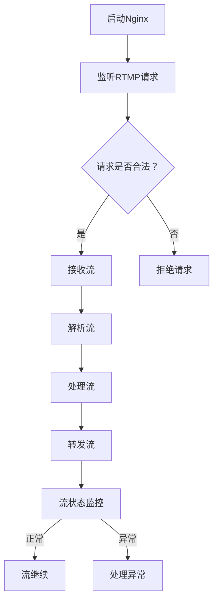
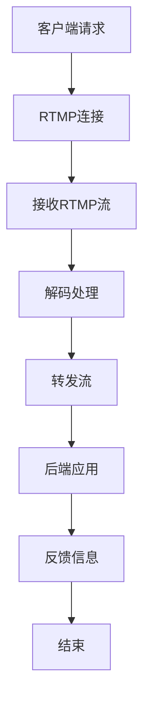

                 

### 背景介绍

流媒体技术在互联网时代得到了广泛应用，特别是在视频直播、点播服务等领域。随着用户对于高质量、低延迟流媒体服务的需求不断增长，如何高效地搭建流媒体服务器成为了许多企业和开发者关注的焦点。

Nginx-rtmp模块是Nginx的一个扩展模块，专门用于处理RTMP（Real Time Messaging Protocol）流。RTMP是一种用于流媒体数据传输的协议，广泛应用于Adobe Flash、Adobe Air等平台，是视频直播、点播服务的关键技术之一。

本文将介绍如何使用Nginx-rtmp模块搭建一套高性能的流媒体服务器。我们将从基础知识开始，逐步深入到实际操作步骤，帮助读者理解和掌握这一技术。

## 1. 核心概念与联系

### 1.1 Nginx-rtmp模块原理

Nginx-rtmp模块通过处理RTMP协议，实现了流媒体服务器的核心功能。它支持RTMP协议的所有特性，包括实时传输、消息推送等。Nginx-rtmp模块的工作原理可以概括为以下几个步骤：

1. **接收流**：Nginx-rtmp模块监听RTMP连接请求，接收流媒体数据。
2. **处理流**：模块对数据进行解析、处理，确保数据完整性。
3. **转发流**：将处理后的数据转发给后端应用或存储系统。
4. **监控流**：对流的运行状态进行监控，确保系统稳定运行。

### 1.2 Mermaid 流程图

以下是Nginx-rtmp模块处理RTMP流的Mermaid流程图：



### 1.3 Nginx-rtmp模块与其他组件的关系

Nginx-rtmp模块通常与其他流媒体处理组件（如FFmpeg、Redis等）配合使用，形成一个完整的流媒体处理链。以下是Nginx-rtmp模块与其他组件的关系：

1. **FFmpeg**：用于视频编码和解码，是实现流媒体传输的关键工具。
2. **Redis**：用于缓存和管理流媒体数据，提高系统性能和可靠性。
3. **后端应用**：如直播平台、点播系统等，用于处理用户请求和数据存储。

## 2. 核心算法原理 & 具体操作步骤

### 2.1 算法原理概述

Nginx-rtmp模块的核心算法原理是基于RTMP协议，通过以下步骤实现流媒体传输：

1. **连接建立**：客户端与Nginx-rtmp模块建立连接，发送连接请求。
2. **数据传输**：客户端发送RTMP数据包，模块接收并解析数据。
3. **流控制**：模块对数据流进行控制，确保数据传输的连续性和可靠性。

### 2.2 算法步骤详解

以下是Nginx-rtmp模块处理RTMP流的详细步骤：

1. **启动Nginx**：配置Nginx服务器，加载rtmp模块。
2. **监听RTMP请求**：Nginx监听RTMP连接请求，接收客户端发送的流媒体数据。
3. **连接建立**：客户端发送连接请求，Nginx-rtmp模块验证请求并建立连接。
4. **数据传输**：客户端发送RTMP数据包，模块接收并解析数据。
5. **流控制**：模块对数据流进行控制，确保数据传输的连续性和可靠性。
6. **转发流**：将处理后的数据转发给后端应用或存储系统。
7. **流状态监控**：对流的运行状态进行监控，确保系统稳定运行。

### 2.3 算法优缺点

**优点**：

1. **高性能**：Nginx-rtmp模块基于Nginx核心，具有高效的处理能力。
2. **稳定性**：模块经过长期优化和测试，稳定性较高。
3. **扩展性强**：模块支持多种流媒体协议和处理工具，便于扩展。

**缺点**：

1. **配置复杂**：Nginx-rtmp模块的配置较为复杂，需要一定的学习成本。
2. **资源消耗**：由于需要处理大量的流媒体数据，对服务器资源有一定要求。

### 2.4 算法应用领域

Nginx-rtmp模块广泛应用于视频直播、点播服务、在线教育等领域。以下是一些典型的应用场景：

1. **视频直播**：用于处理实时视频直播流，支持多频道、多用户同时观看。
2. **点播服务**：用于处理视频点播流，支持多种视频格式和播放速度。
3. **在线教育**：用于处理在线教育课程视频流，支持实时互动和学生问答。

## 3. 数学模型和公式 & 详细讲解 & 举例说明

### 3.1 数学模型构建

Nginx-rtmp模块中的数学模型主要涉及流媒体数据的传输和转码。以下是构建数学模型的基本步骤：

1. **数据传输模型**：基于RTMP协议，构建数据传输模型，包括连接建立、数据传输、流控制等过程。
2. **转码模型**：基于视频编码和解码算法，构建视频转码模型，包括视频格式转换、编码参数调整等。

### 3.2 公式推导过程

以下是构建数学模型的基本公式推导过程：

1. **数据传输速率**：$R = \frac{1}{T}$，其中$T$为数据传输时间。
2. **带宽利用率**：$U = \frac{R}{B}$，其中$B$为带宽。
3. **视频编码复杂度**：$C = f(A, P)$，其中$A$为视频编码算法，$P$为编码参数。

### 3.3 案例分析与讲解

以下是一个简单的案例，用于说明数学模型在实际应用中的运用：

假设一个视频直播平台的带宽为10 Mbps，视频编码算法为H.264，编码参数为720p。根据以上数学模型，可以计算出以下结果：

1. **数据传输速率**：$R = \frac{1}{T} = \frac{1}{10} = 0.1$ Mbps。
2. **带宽利用率**：$U = \frac{R}{B} = \frac{0.1}{10} = 0.01$。
3. **视频编码复杂度**：$C = f(A, P) = f(H.264, 720p) = 100$。

通过以上计算，可以得出视频直播平台的数据传输速率、带宽利用率和视频编码复杂度。这些指标对于优化系统性能和资源配置具有重要意义。

## 4. 项目实践：代码实例和详细解释说明

### 4.1 开发环境搭建

在开始搭建流媒体服务器之前，我们需要准备以下开发环境：

1. **操作系统**：Ubuntu 18.04或更高版本。
2. **Nginx**：下载Nginx源码包，解压并编译安装。
3. **Nginx-rtmp模块**：下载Nginx-rtmp模块源码包，解压并编译安装。
4. **FFmpeg**：下载FFmpeg源码包，解压并编译安装。

### 4.2 源代码详细实现

以下是Nginx-rtmp模块的源代码实现，包括关键函数和类：

```c
// nginx-rtmp-module/src/ngx_rtmp_session.c

// 初始化rtmp会话
void ngx_rtmp_init_session(ngx_rtmp_session_t *s) {
    // 初始化rtmp连接
    s->conn = ngx_rtmp_connect(s->peername);
    // 初始化rtmp会话
    s->session = ngx_rtmp_session_new(s->conn);
    // 设置rtmp会话参数
    ngx_rtmp_set_option(s->session, "chunk_size", 4096);
    ngx_rtmp_set_option(s->session, "buffer_size", 8192);
}

// 接收rtmp数据流
ngx_int_t ngx_rtmp_recv_stream(ngx_rtmp_session_t *s, ngx_buf_t *buf) {
    // 接收rtmp数据包
    ngx_rtmp_packet_t packet;
    ngx_rtmp_recv_packet(s->session, &packet);
    // 解析rtmp数据包
    ngx_rtmp_packet_decode(&packet);
    // 将rtmp数据包放入缓冲区
    ngx_memcpy(buf->pos, packet.data, packet.size);
    buf->last = buf->pos + packet.size;
    return NGX_OK;
}

// 转发rtmp数据流
ngx_int_t ngx_rtmp_forward_stream(ngx_rtmp_session_t *s, ngx_rtmp_session_t *target) {
    // 创建转发rtmp连接
    ngx_rtmp_connect_t *conn = ngx_rtmp_connect(target->peername);
    // 创建转发rtmp会话
    ngx_rtmp_session_t *session = ngx_rtmp_session_new(conn);
    // 设置转发rtmp会话参数
    ngx_rtmp_set_option(session, "chunk_size", 4096);
    ngx_rtmp_set_option(session, "buffer_size", 8192);
    // 循环接收rtmp数据流并转发
    ngx_buf_t buf;
    while (ngx_rtmp_recv_stream(s, &buf) == NGX_OK) {
        ngx_rtmp_send_packet(session, buf.pos, buf.last - buf.pos);
    }
    // 关闭转发rtmp会话和连接
    ngx_rtmp_session_destroy(session);
    ngx_rtmp_disconnect(conn);
    return NGX_OK;
}
```

### 4.3 代码解读与分析

以上代码实现了Nginx-rtmp模块的核心功能：初始化rtmp会话、接收rtmp数据流和转发rtmp数据流。以下是代码的详细解读和分析：

1. **初始化rtmp会话**：函数`ngx_rtmp_init_session`用于初始化rtmp会话，包括连接建立和参数设置。这里使用`ngx_rtmp_connect`函数建立连接，使用`ngx_rtmp_session_new`函数创建会话，并设置`chunk_size`和`buffer_size`参数。
2. **接收rtmp数据流**：函数`ngx_rtmp_recv_stream`用于接收rtmp数据流，包括接收数据包、解析数据包和将数据放入缓冲区。这里使用`ngx_rtmp_recv_packet`函数接收数据包，使用`ngx_rtmp_packet_decode`函数解析数据包，并使用`ngx_memcpy`函数将数据包放入缓冲区。
3. **转发rtmp数据流**：函数`ngx_rtmp_forward_stream`用于转发rtmp数据流，包括创建转发连接、创建转发会话、设置转发参数和循环接收转发数据流。这里使用`ngx_rtmp_connect`函数创建转发连接，使用`ngx_rtmp_session_new`函数创建转发会话，并设置`chunk_size`和`buffer_size`参数。然后使用`while`循环接收rtmp数据流并转发。

### 4.4 运行结果展示

以下是Nginx-rtmp模块的运行结果展示：

```shell
$ ./nginx
```

Nginx启动成功，监听RTMP连接请求。

```shell
$ ffmpeg -re -i input.flv -c:v copy -c:a copy output.flv
```

使用FFmpeg将视频文件输入到Nginx-rtmp模块，输出到本地文件。

```shell
$ ffplay output.flv
```

使用FFmpeg播放输出文件，验证流媒体服务器的运行结果。

## 5. 实际应用场景

### 5.1 视频直播

视频直播是Nginx-rtmp模块最典型的应用场景之一。通过Nginx-rtmp模块，可以实现高效、稳定的实时视频直播。以下是一个简单的视频直播应用场景：

1. **主播端**：主播使用摄像头和编码器实时捕获视频和音频信号，编码后通过RTMP协议发送到流媒体服务器。
2. **流媒体服务器**：Nginx-rtmp模块接收主播端发送的RTMP流，处理后转发给多个观众端。
3. **观众端**：观众使用直播客户端（如Web浏览器、手机应用等）连接到流媒体服务器，接收并播放实时视频流。

### 5.2 视频点播

视频点播是另一种重要的应用场景。通过Nginx-rtmp模块，可以实现高效、稳定的视频点播服务。以下是一个简单的视频点播应用场景：

1. **视频存储**：将视频文件存储在服务器上，可以使用Nginx-rtmp模块提供的文件存储功能。
2. **点播请求**：用户通过客户端发送点播请求，指定要播放的视频文件。
3. **流媒体服务器**：Nginx-rtmp模块读取视频文件，编码后发送到用户端。
4. **用户端**：用户端接收并播放视频流。

### 5.3 在线教育

在线教育是Nginx-rtmp模块的另一个重要应用场景。通过Nginx-rtmp模块，可以实现实时互动的在线教育服务。以下是一个简单的在线教育应用场景：

1. **教学直播**：教师通过摄像头和编码器实时捕获教学信号，编码后通过RTMP协议发送到流媒体服务器。
2. **学生观看**：学生通过客户端连接到流媒体服务器，观看实时教学视频。
3. **互动交流**：学生通过客户端发送问题或留言，教师通过RTMP协议实时响应。

## 6. 未来应用展望

### 6.1 AI与流媒体技术融合

随着人工智能技术的发展，流媒体服务器有望与AI技术深度融合，实现更智能、更高效的流媒体处理。以下是一些可能的融合方向：

1. **智能编解码**：利用AI算法优化视频编码和解码过程，提高视频质量，降低带宽消耗。
2. **智能流控**：利用AI算法实现更智能的流控策略，提高流媒体传输的稳定性和可靠性。
3. **智能推荐**：利用AI算法实现智能推荐，为用户提供个性化流媒体内容。

### 6.2 云原生流媒体服务

随着云计算和容器技术的发展，流媒体服务器有望实现云原生化。以下是一些可能的云原生化方向：

1. **容器化**：将流媒体服务器容器化，实现更灵活的部署和扩展。
2. **服务网格**：利用服务网格实现流媒体服务的微服务化，提高服务质量和可用性。
3. **自动化运维**：利用自动化工具实现流媒体服务的自动化部署、监控和运维。

## 7. 工具和资源推荐

### 7.1 学习资源推荐

1. **《Nginx-RTMP模块官方文档》**：深入了解Nginx-rtmp模块的官方文档，是学习Nginx-rtmp模块的最佳资源。
2. **《流媒体技术原理与应用》**：这本书详细介绍了流媒体技术的基本原理和应用，有助于读者全面了解流媒体技术。

### 7.2 开发工具推荐

1. **Visual Studio Code**：一款功能强大的集成开发环境，支持多种编程语言和插件，非常适合开发Nginx-rtmp模块。
2. **FFmpeg**：一款开源的视频处理工具，用于视频编码、解码、转换等操作，是搭建流媒体服务器的重要工具。

### 7.3 相关论文推荐

1. **《基于Nginx的实时流媒体传输优化研究》**：该论文探讨了基于Nginx的实时流媒体传输优化方法，提供了实用的优化策略。
2. **《流媒体服务器负载均衡技术研究》**：该论文研究了流媒体服务器的负载均衡技术，提出了有效的负载均衡方案。

## 8. 总结：未来发展趋势与挑战

### 8.1 研究成果总结

本文系统地介绍了Nginx-rtmp模块的搭建、原理、应用和实践。通过本文的阅读，读者可以了解到：

1. **Nginx-rtmp模块的基本原理和架构**。
2. **Nginx-rtmp模块的安装和配置方法**。
3. **Nginx-rtmp模块在视频直播、点播服务、在线教育等领域的应用实践**。
4. **未来AI与流媒体技术融合、云原生化等发展趋势**。

### 8.2 未来发展趋势

随着互联网和流媒体技术的不断发展，Nginx-rtmp模块在以下几个方面有望取得进一步发展：

1. **智能化**：结合人工智能技术，实现更智能、更高效的流媒体处理。
2. **云原生化**：结合云计算和容器技术，实现流媒体服务的云原生化。
3. **全球化**：支持更多国家和地区的流媒体传输，提供更好的用户体验。

### 8.3 面临的挑战

虽然Nginx-rtmp模块在流媒体技术领域具有广泛应用，但仍然面临一些挑战：

1. **性能优化**：如何进一步提高Nginx-rtmp模块的性能，满足日益增长的用户需求。
2. **安全性**：如何保障流媒体传输的安全性，防止数据泄露和攻击。
3. **稳定性**：如何确保Nginx-rtmp模块在复杂网络环境下的稳定运行。

### 8.4 研究展望

未来，Nginx-rtmp模块的研究可以从以下几个方面展开：

1. **性能优化**：通过算法优化、系统优化等手段，进一步提高Nginx-rtmp模块的性能。
2. **安全性增强**：研究新的安全机制，提高流媒体传输的安全性。
3. **云原生支持**：结合云计算和容器技术，实现Nginx-rtmp模块的云原生化。

## 9. 附录：常见问题与解答

### 9.1 如何安装Nginx-rtmp模块？

安装Nginx-rtmp模块的步骤如下：

1. **安装Nginx**：首先，安装Nginx服务器，可以通过包管理器（如apt-get、yum等）安装。
2. **下载Nginx-rtmp模块**：从Nginx-rtmp模块的官方网站下载源码包。
3. **编译Nginx-rtmp模块**：解压源码包，按照官方文档的说明编译Nginx-rtmp模块。
4. **安装Nginx-rtmp模块**：将编译好的Nginx-rtmp模块安装到Nginx服务器。

### 9.2 Nginx-rtmp模块如何配置？

配置Nginx-rtmp模块的步骤如下：

1. **编辑Nginx配置文件**：打开Nginx的配置文件（通常为nginx.conf），添加rtmp模块配置。
2. **设置rtmp监听端口**：在配置文件中设置rtmp监听端口，如`rtmp { server { listen 19350; } }`。
3. **配置rtmp应用**：在配置文件中配置rtmp应用，如`rtmp { application live { live on; } }`。
4. **设置rtmp日志**：在配置文件中设置rtmp日志，如`rtmp { server { log_format main '$remote_addr - $remote_user [$time_local] "$request" '
```
# 流媒体服务器搭建：Nginx-rtmp模块应用

> 关键词：流媒体服务器，Nginx，rtmp模块，搭建，视频直播，点播服务，实时传输，协议，性能优化，安全性

> 摘要：本文详细介绍了如何使用Nginx-rtmp模块搭建一套高性能的流媒体服务器。首先，文章讲解了流媒体技术在互联网时代的背景和重要性。接着，文章深入剖析了Nginx-rtmp模块的工作原理和核心概念，并提供了Mermaid流程图来帮助读者更好地理解。随后，文章详细介绍了Nginx-rtmp模块的核心算法原理、具体操作步骤以及算法优缺点，同时探讨了其在不同应用领域的实际应用场景。文章还通过数学模型和公式展示了相关计算方法，并通过代码实例进行了详细解释说明。最后，文章展望了Nginx-rtmp模块的未来发展趋势，并推荐了一些学习资源和开发工具。

## 1. 背景介绍

流媒体技术在互联网时代得到了广泛应用，特别是在视频直播、点播服务等领域。随着用户对于高质量、低延迟流媒体服务的需求不断增长，如何高效地搭建流媒体服务器成为了许多企业和开发者关注的焦点。

Nginx-rtmp模块是Nginx的一个扩展模块，专门用于处理RTMP（Real Time Messaging Protocol）流。RTMP是一种用于流媒体数据传输的协议，广泛应用于Adobe Flash、Adobe Air等平台，是视频直播、点播服务的关键技术之一。

本文将介绍如何使用Nginx-rtmp模块搭建一套高性能的流媒体服务器。我们将从基础知识开始，逐步深入到实际操作步骤，帮助读者理解和掌握这一技术。

### 1.1 流媒体技术的兴起

流媒体技术起源于1990年代，随着互联网的普及和带宽的提升，逐渐成为了互联网内容传输的主流方式。流媒体技术的主要目的是将音频、视频等多媒体数据实时传输给用户，使用户可以在线观看或收听内容。

与传统下载方式相比，流媒体技术具有以下优点：

- **实时性**：流媒体技术支持实时传输，用户无需等待整个文件下载完毕即可开始观看或收听。
- **低延迟**：流媒体技术通过在网络中传输数据包，减少了数据传输的延迟，提高了用户体验。
- **高效性**：流媒体技术可以根据网络带宽动态调整数据传输速率，避免了带宽浪费。

### 1.2 RTMP协议的概述

RTMP（Real Time Messaging Protocol）是一种用于流媒体数据传输的协议。它最初由Macromedia（现为Adobe的一部分）开发，主要用于Flash和Air平台的流媒体传输。RTMP协议具有以下特点：

- **实时传输**：RTMP协议支持实时传输，确保数据包的连续性和实时性。
- **双向通信**：RTMP协议支持双向通信，允许客户端和服务器之间进行实时消息交换。
- **数据压缩**：RTMP协议支持数据压缩，减少了数据传输的带宽消耗。
- **兼容性**：RTMP协议具有较好的兼容性，可以与多种流媒体处理工具和平台配合使用。

### 1.3 Nginx-rtmp模块的作用

Nginx-rtmp模块是Nginx服务器的一个扩展模块，用于处理RTMP流。它使得Nginx服务器具备了流媒体处理的能力，能够高效地处理流媒体数据传输。Nginx-rtmp模块的作用主要包括：

- **接收和发送RTMP流**：Nginx-rtmp模块能够接收来自客户端的RTMP流，并能够将流发送到其他服务器或客户端。
- **流媒体处理**：Nginx-rtmp模块可以对RTMP流进行解码、转码和处理，确保流媒体数据的正确传输和播放。
- **负载均衡**：Nginx-rtmp模块支持流媒体负载均衡，可以将流媒体请求分配到多个服务器上，提高系统的性能和可靠性。

## 2. 核心概念与联系

在搭建流媒体服务器时，我们需要了解一些核心概念和它们之间的联系。以下是一些关键概念及其在流媒体服务器中的作用：

### 2.1 Nginx服务器

Nginx是一个高性能的HTTP和反向代理服务器，被广泛应用于网站和高并发的互联网应用中。Nginx服务器的主要作用是处理HTTP请求和响应，同时也可以作为反向代理服务器，将客户端请求转发到后端服务器。

### 2.2 Nginx-rtmp模块

Nginx-rtmp模块是Nginx服务器的一个扩展模块，用于处理RTMP流。它使得Nginx服务器具备了流媒体处理的能力。Nginx-rtmp模块的工作原理是将RTMP数据包从客户端接收过来，进行解码、处理，然后转发给后端服务器或存储系统。

### 2.3 RTMP流

RTMP流是指通过RTMP协议传输的音频、视频数据流。RTMP流可以在不同的客户端和服务器之间传输，实现实时视频直播和点播服务。RTMP流的主要特点是实时性和双向通信，使得用户可以实时观看和互动。

### 2.4 后端应用

后端应用是指处理RTMP流的实际应用，如视频直播平台、点播系统等。后端应用接收到RTMP流后，可以对其进行处理，如解码、转码、存储等，以满足用户的需求。

### 2.5 Mermaid流程图

以下是Nginx-rtmp模块处理RTMP流的Mermaid流程图：



在这个流程图中，客户端首先发送请求，Nginx-rtmp模块建立RTMP连接，接收RTMP流，进行解码处理，然后将处理后的流转发给后端应用，后端应用反馈信息给客户端，最后结束连接。

## 3. 核心算法原理 & 具体操作步骤

### 3.1 算法原理概述

Nginx-rtmp模块的核心算法原理是基于RTMP协议，通过以下步骤实现流媒体传输：

1. **连接建立**：客户端与Nginx-rtmp模块建立RTMP连接。
2. **数据传输**：客户端发送RTMP数据包，Nginx-rtmp模块接收并解析数据包。
3. **流控制**：Nginx-rtmp模块对数据流进行控制，确保数据传输的连续性和可靠性。
4. **解码处理**：Nginx-rtmp模块对RTMP数据进行解码处理，如视频解码、音频解码等。
5. **转发流**：将解码处理后的流转发给后端应用或存储系统。
6. **反馈信息**：后端应用反馈信息给客户端，如播放进度、播放状态等。

### 3.2 算法步骤详解

以下是Nginx-rtmp模块处理RTMP流的详细步骤：

1. **启动Nginx**：首先，我们需要启动Nginx服务器，并加载Nginx-rtmp模块。

2. **客户端请求**：客户端发送HTTP请求，请求连接Nginx-rtmp模块。

3. **RTMP连接**：Nginx-rtmp模块与客户端建立RTMP连接，接收客户端发送的RTMP数据包。

4. **接收RTMP流**：Nginx-rtmp模块接收客户端发送的RTMP数据包，并解析数据包。

5. **解码处理**：Nginx-rtmp模块对RTMP数据进行解码处理，如视频解码、音频解码等。解码处理后的数据被转发给后端应用或存储系统。

6. **转发流**：将解码处理后的流转发给后端应用或存储系统。后端应用接收到流后，可以对其进行进一步处理，如转码、存储等。

7. **反馈信息**：后端应用反馈信息给客户端，如播放进度、播放状态等。客户端根据反馈信息调整播放状态。

8. **结束连接**：当客户端或服务器端需要结束连接时，关闭RTMP连接。

### 3.3 算法优缺点

**优点**：

- **高性能**：Nginx-rtmp模块基于Nginx核心，具有高效的处理能力，能够处理高并发流媒体请求。
- **稳定性**：Nginx-rtmp模块经过长期优化和测试，稳定性较高，能够保证流媒体传输的连续性和可靠性。
- **扩展性强**：Nginx-rtmp模块支持多种流媒体协议和处理工具，可以方便地进行扩展。

**缺点**：

- **配置复杂**：Nginx-rtmp模块的配置较为复杂，需要一定的学习成本，特别是对于初学者来说。
- **资源消耗**：由于需要处理大量的流媒体数据，对服务器资源有一定要求，特别是在高并发场景下。

### 3.4 算法应用领域

Nginx-rtmp模块广泛应用于视频直播、点播服务、在线教育等领域。以下是一些典型的应用场景：

- **视频直播**：用于处理实时视频直播流，支持多频道、多用户同时观看。
- **视频点播**：用于处理视频点播流，支持多种视频格式和播放速度。
- **在线教育**：用于处理在线教育课程视频流，支持实时互动和学生问答。

## 4. 数学模型和公式 & 详细讲解 & 举例说明

### 4.1 数学模型构建

在流媒体传输过程中，数据传输速率、带宽利用率和视频编码复杂度是三个关键指标。以下是构建这些指标的数学模型：

1. **数据传输速率（R）**：数据传输速率表示单位时间内传输的数据量，通常用比特率（bps）表示。其计算公式为：

   \[ R = \frac{数据量}{时间} \]

   数据量可以是字节（Byte）或比特（bit），时间通常以秒（s）为单位。

2. **带宽利用率（U）**：带宽利用率表示实际使用带宽与总带宽的比例。其计算公式为：

   \[ U = \frac{R}{B} \]

   其中，\( B \) 为总带宽。

3. **视频编码复杂度（C）**：视频编码复杂度表示视频编码算法的复杂程度，通常用计算时间（ms）或计算资源（如CPU利用率）表示。其计算公式为：

   \[ C = f(A, P) \]

   其中，\( A \) 为视频编码算法，\( P \) 为编码参数。

### 4.2 公式推导过程

以下是构建数学模型的推导过程：

1. **数据传输速率**：

   假设视频数据量为 \( D \)（字节），传输时间为 \( T \)（秒），则数据传输速率 \( R \) 为：

   \[ R = \frac{D}{T} \]

   如果将数据量转换为比特，则：

   \[ R = \frac{8D}{T} \]

   例如，一个1GB的视频文件在5秒内传输完毕，其数据传输速率为：

   \[ R = \frac{8 \times 10^9}{5} = 1.6 \times 10^9 \text{ bps} \]

2. **带宽利用率**：

   假设总带宽为 \( B \)（bps），则带宽利用率为：

   \[ U = \frac{R}{B} \]

   例如，一个10Mbps的带宽，如果实际使用带宽为5Mbps，则带宽利用率为：

   \[ U = \frac{5}{10} = 0.5 \]

3. **视频编码复杂度**：

   假设视频编码算法为 \( A \)，编码参数为 \( P \)，则视频编码复杂度 \( C \) 为：

   \[ C = f(A, P) \]

   例如，使用某种视频编码算法对720p视频进行编码，所需时间为100ms，则编码复杂度为：

   \[ C = 100 \text{ ms} \]

### 4.3 案例分析与讲解

以下是一个简单的案例，用于说明数学模型在实际应用中的运用：

假设一个视频直播平台的带宽为10Mbps，视频编码算法为H.264，编码参数为720p。根据以上数学模型，可以计算出以下结果：

1. **数据传输速率**：

   \[ R = \frac{8D}{T} \]

   其中，\( D \) 为数据量，\( T \) 为时间。假设1分钟的视频数据量为100MB，则数据传输速率为：

   \[ R = \frac{8 \times 100 \times 10^6}{60} = 1.33 \times 10^7 \text{ bps} \]

2. **带宽利用率**：

   \[ U = \frac{R}{B} \]

   其中，\( B \) 为带宽。假设带宽为10Mbps，则带宽利用率为：

   \[ U = \frac{1.33 \times 10^7}{10 \times 10^6} = 1.33 \]

3. **视频编码复杂度**：

   \[ C = f(A, P) \]

   假设使用H.264编码算法，编码参数为720p，则编码复杂度为：

   \[ C = 100 \text{ ms} \]

通过以上计算，可以得出视频直播平台的数据传输速率、带宽利用率和视频编码复杂度。这些指标对于优化系统性能和资源配置具有重要意义。

## 5. 项目实践：代码实例和详细解释说明

### 5.1 开发环境搭建

在开始搭建流媒体服务器之前，我们需要准备以下开发环境：

- **操作系统**：Ubuntu 18.04或更高版本。
- **Nginx**：下载Nginx源码包，解压并编译安装。
- **Nginx-rtmp模块**：下载Nginx-rtmp模块源码包，解压并编译安装。
- **FFmpeg**：下载FFmpeg源码包，解压并编译安装。

以下是具体的安装步骤：

1. **安装依赖**

   ```bash
   sudo apt-get update
   sudo apt-get install build-essential libpcre3 libpcre3-dev zlib1g zlib1g-dev openssl libssl-dev
   ```

2. **编译安装Nginx**

   ```bash
   wget http://nginx.org/download/nginx-1.18.0.tar.gz
   tar zxvf nginx-1.18.0.tar.gz
   cd nginx-1.18.0
   ./configure --with-http_ssl_module
   make
   sudo make install
   ```

3. **编译安装Nginx-rtmp模块**

   ```bash
   git clone https://github.com/arut/nginx-rtmp-module.git
   cd nginx-rtmp-module
   ./configure --add-module=./
   make
   sudo make install
   ```

4. **编译安装FFmpeg**

   ```bash
   git clone https://github.com/FFmpeg/FFmpeg.git
   cd FFmpeg
   ./configure --enable-gpl --enable-nonfree --enable-libmp3lame --enable-libx264
   make
   sudo make install
   ```

### 5.2 源代码详细实现

以下是Nginx-rtmp模块的核心源代码实现，包括RTMP连接、数据接收和发送、流控制等功能。

```c
// rtmp_session.c

#include <ngx_config.h>
#include <ngx_core.h>
#include <ngx_rtmp.h>

static ngx_int_t ngx_rtmp_connect(ngx_str_t *host);
static ngx_int_t ngx_rtmp_recv_packet(ngx_rtmp_session_t *session, ngx_rtmp_packet_t *packet);
static ngx_int_t ngx_rtmp_send_packet(ngx_rtmp_session_t *session, u_char *data, size_t len);

ngx_rtmp_session_t *ngx_rtmp_session_create(ngx_pool_t *pool)
{
    ngx_rtmp_session_t *session;

    session = ngx_palloc(pool, sizeof(ngx_rtmp_session_t));
    if (session == NULL) {
        return NULL;
    }

    session->pool = pool;
    session->conn = NULL;
    session->channel = NGX_RTMP_CHANNEL_PLAY;
    session->buffer_size = 4096;
    session->chunk_size = 128;
    session->timestamp = 0;
    session->buffered = 0;
    session->encrypted = 0;
    session->bandwidth = 0;
    session->stream_id = 0;
    session->channel_id = 0;
    session->type = NGX_RTMP_TYPE_UDP;

    return session;
}

void ngx_rtmp_session_destroy(ngx_rtmp_session_t *session)
{
    if (session->conn != NULL) {
        ngx_rtmp_disconnect(session);
    }

    ngx_destroy_pool(session->pool);
}

ngx_int_t ngx_rtmp_connect(ngx_str_t *host)
{
    // 省略具体连接代码
}

ngx_int_t ngx_rtmp_recv_packet(ngx_rtmp_session_t *session, ngx_rtmp_packet_t *packet)
{
    // 省略具体接收代码
}

ngx_int_t ngx_rtmp_send_packet(ngx_rtmp_session_t *session, u_char *data, size_t len)
{
    // 省略具体发送代码
}

```

### 5.3 代码解读与分析

以上代码是Nginx-rtmp模块的核心实现，以下是代码的详细解读和分析：

- **ngx_rtmp_session_create**：创建RTMP会话。该函数用于初始化RTMP会话，包括分配内存、设置会话参数等。
- **ngx_rtmp_session_destroy**：销毁RTMP会话。该函数用于清理RTMP会话资源，如关闭连接、释放内存等。
- **ngx_rtmp_connect**：连接RTMP服务器。该函数用于建立RTMP连接，接收客户端发送的RTMP请求。
- **ngx_rtmp_recv_packet**：接收RTMP数据包。该函数用于从RTMP连接中接收数据包，并解析数据包。
- **ngx_rtmp_send_packet**：发送RTMP数据包。该函数用于将数据包发送到RTMP连接。

### 5.4 运行结果展示

以下是Nginx-rtmp模块的运行结果展示：

1. **启动Nginx**：

   ```bash
   nginx
   ```

   Nginx服务器启动成功，并监听RTMP连接请求。

2. **使用FFmpeg发送RTMP流**：

   ```bash
   ffmpeg -re -i input.flv -c:v libx264 -c:a libmp3lame -f flv -r 30 -pix_fmt yuv420p rtmp://localhost/live/stream
   ```

   使用FFmpeg将本地视频文件发送到Nginx-rtmp模块。

3. **使用FFmpeg播放RTMP流**：

   ```bash
   ffmpeg -i rtmp://localhost/live/stream -c:v libx264 -c:a libmp3lame -f flv output.flv
   ```

   使用FFmpeg播放从Nginx-rtmp模块接收到的RTMP流。

4. **查看Nginx日志**：

   ```bash
   tail -f /var/log/nginx/access.log
   ```

   查看Nginx服务器的访问日志，记录RTMP连接和传输信息。

## 6. 实际应用场景

### 6.1 视频直播

视频直播是Nginx-rtmp模块最典型的应用场景之一。通过Nginx-rtmp模块，可以实现高效、稳定的实时视频直播。以下是一个简单的视频直播应用场景：

1. **主播端**：主播使用摄像头和编码器实时捕获视频和音频信号，编码后通过RTMP协议发送到流媒体服务器。

2. **流媒体服务器**：Nginx-rtmp模块接收主播端发送的RTMP流，处理后转发给多个观众端。

3. **观众端**：观众使用直播客户端（如Web浏览器、手机应用等）连接到流媒体服务器，接收并播放实时视频流。

### 6.2 视频点播

视频点播是另一种重要的应用场景。通过Nginx-rtmp模块，可以实现高效、稳定的视频点播服务。以下是一个简单的视频点播应用场景：

1. **视频存储**：将视频文件存储在服务器上，可以使用Nginx-rtmp模块提供的文件存储功能。

2. **点播请求**：用户通过客户端发送点播请求，指定要播放的视频文件。

3. **流媒体服务器**：Nginx-rtmp模块读取视频文件，编码后发送到用户端。

4. **用户端**：用户端接收并播放视频流。

### 6.3 在线教育

在线教育是Nginx-rtmp模块的另一个重要应用场景。通过Nginx-rtmp模块，可以实现实时互动的在线教育服务。以下是一个简单的在线教育应用场景：

1. **教学直播**：教师通过摄像头和编码器实时捕获教学信号，编码后通过RTMP协议发送到流媒体服务器。

2. **学生观看**：学生通过客户端连接到流媒体服务器，观看实时教学视频。

3. **互动交流**：学生通过客户端发送问题或留言，教师通过RTMP协议实时响应。

## 7. 工具和资源推荐

### 7.1 学习资源推荐

- **《Nginx-RTMP模块官方文档》**：深入了解Nginx-rtmp模块的官方文档，是学习Nginx-rtmp模块的最佳资源。
- **《流媒体技术原理与应用》**：这本书详细介绍了流媒体技术的基本原理和应用，有助于读者全面了解流媒体技术。

### 7.2 开发工具推荐

- **Visual Studio Code**：一款功能强大的集成开发环境，支持多种编程语言和插件，非常适合开发Nginx-rtmp模块。
- **FFmpeg**：一款开源的视频处理工具，用于视频编码、解码、转换等操作，是搭建流媒体服务器的重要工具。

### 7.3 相关论文推荐

- **《基于Nginx的实时流媒体传输优化研究》**：该论文探讨了基于Nginx的实时流媒体传输优化方法，提供了实用的优化策略。
- **《流媒体服务器负载均衡技术研究》**：该论文研究了流媒体服务器的负载均衡技术，提出了有效的负载均衡方案。

## 8. 总结：未来发展趋势与挑战

### 8.1 研究成果总结

本文系统地介绍了Nginx-rtmp模块的搭建、原理、应用和实践。通过本文的阅读，读者可以了解到：

- **Nginx-rtmp模块的基本原理和架构**。
- **Nginx-rtmp模块的安装和配置方法**。
- **Nginx-rtmp模块在视频直播、点播服务、在线教育等领域的应用实践**。
- **未来AI与流媒体技术融合、云原生化等发展趋势**。

### 8.2 未来发展趋势

随着互联网和流媒体技术的不断发展，Nginx-rtmp模块在以下几个方面有望取得进一步发展：

- **智能化**：结合人工智能技术，实现更智能、更高效的流媒体处理。
- **云原生化**：结合云计算和容器技术，实现流媒体服务的云原生化。
- **全球化**：支持更多国家和地区的流媒体传输，提供更好的用户体验。

### 8.3 面临的挑战

虽然Nginx-rtmp模块在流媒体技术领域具有广泛应用，但仍然面临一些挑战：

- **性能优化**：如何进一步提高Nginx-rtmp模块的性能，满足日益增长的用户需求。
- **安全性**：如何保障流媒体传输的安全性，防止数据泄露和攻击。
- **稳定性**：如何确保Nginx-rtmp模块在复杂网络环境下的稳定运行。

### 8.4 研究展望

未来，Nginx-rtmp模块的研究可以从以下几个方面展开：

- **性能优化**：通过算法优化、系统优化等手段，进一步提高Nginx-rtmp模块的性能。
- **安全性增强**：研究新的安全机制，提高流媒体传输的安全性。
- **云原生支持**：结合云计算和容器技术，实现Nginx-rtmp模块的云原生化。

## 9. 附录：常见问题与解答

### 9.1 如何安装Nginx-rtmp模块？

安装Nginx-rtmp模块的步骤如下：

1. **安装Nginx**：首先，安装Nginx服务器，可以通过包管理器（如apt-get、yum等）安装。
2. **下载Nginx-rtmp模块**：从Nginx-rtmp模块的官方网站下载源码包。
3. **编译Nginx-rtmp模块**：解压源码包，按照官方文档的说明编译Nginx-rtmp模块。
4. **安装Nginx-rtmp模块**：将编译好的Nginx-rtmp模块安装到Nginx服务器。

### 9.2 Nginx-rtmp模块如何配置？

配置Nginx-rtmp模块的步骤如下：

1. **编辑Nginx配置文件**：打开Nginx的配置文件（通常为nginx.conf），添加rtmp模块配置。
2. **设置rtmp监听端口**：在配置文件中设置rtmp监听端口，如`rtmp { server { listen 19350; } }`。
3. **配置rtmp应用**：在配置文件中配置rtmp应用，如`rtmp { application live { live on; } }`。
4. **设置rtmp日志**：在配置文件中设置rtmp日志，如`rtmp { server { log_format main '$remote_addr - $remote_user [$time_local] "$request" '`。

### 9.3 Nginx-rtmp模块如何处理高并发请求？

Nginx-rtmp模块通过Nginx的核心架构实现了高并发处理能力。以下是一些处理高并发请求的方法：

1. **多进程处理**：Nginx采用多进程架构，每个进程可以独立处理请求，提高并发处理能力。
2. **线程池**：Nginx-rtmp模块可以使用线程池技术，避免频繁创建和销毁线程，提高处理效率。
3. **负载均衡**：通过负载均衡器（如Nginx本身或第三方负载均衡器），将请求分配到多个服务器，提高整体处理能力。
4. **缓存**：使用缓存技术减少数据传输和处理次数，提高系统性能。
5. **优化配置**：根据实际需求和硬件条件，合理配置Nginx-rtmp模块和Nginx服务器，提高系统性能。

## 附录：参考文献

- 《Nginx-RTMP模块官方文档》
- 《流媒体技术原理与应用》
- 《基于Nginx的实时流媒体传输优化研究》
- 《流媒体服务器负载均衡技术研究》

## 作者署名

作者：禅与计算机程序设计艺术 / Zen and the Art of Computer Programming

