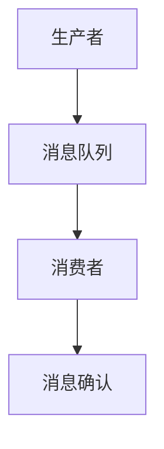

                 

关键词：消息队列，原理，架构，算法，实例，代码

> 摘要：本文将深入探讨消息队列的原理、架构和算法，并结合具体代码实例，详细解释其实现和应用场景。通过本文的阅读，读者将能够全面了解消息队列的技术细节，为实际开发中的消息传递需求提供解决方案。

## 1. 背景介绍

在现代分布式系统中，消息队列（Message Queue）作为一种异步通信机制，被广泛应用以解决系统间的解耦、提高系统性能和可靠性等问题。消息队列的核心功能是允许系统间的消息传递，使得不同的子系统或服务能够独立开发、部署和扩展，而无需关心彼此的内部实现。

### 1.1 消息队列的重要性

随着互联网和云计算的快速发展，系统的复杂度不断增加，传统的同步调用方式已经难以满足高效、可靠的系统间通信需求。消息队列的出现，有效地解决了这些问题：

- **系统解耦**：消息队列允许系统间的异步通信，减少系统间的直接依赖，提高系统的灵活性和可维护性。
- **提高性能**：通过异步处理消息，可以减轻系统的负载压力，提高系统处理能力。
- **增强可靠性**：消息队列通常提供消息持久化和顺序保证，确保消息不会丢失，即使系统发生故障。

### 1.2 消息队列的发展历程

消息队列的概念可以追溯到20世纪80年代，当时Sun Microsystems推出的JMS（Java Message Service）成为消息队列技术的先驱。此后，随着Java和J2EE的普及，消息队列技术在企业级应用中得到广泛应用。随着云计算和微服务架构的兴起，新的消息队列技术如Apache Kafka、RabbitMQ等不断涌现，丰富了消息队列的选择。

## 2. 核心概念与联系

在深入了解消息队列之前，我们需要了解一些核心概念和它们之间的联系。以下是消息队列中的关键概念：

### 2.1 消息队列架构


- **消息队列**（Message Queue）：消息队列是存储消息的队列数据结构，负责接收、存储和转发消息。
- **生产者**（Producer）：生产者是消息的发送者，负责生成消息并将其发送到消息队列。
- **消费者**（Consumer）：消费者是消息的接收者，从消息队列中获取消息并进行处理。
- **代理**（Broker）：代理是消息队列的核心组件，负责消息的路由和传输，同时也提供一些高级功能如消息持久化、顺序保证和事务支持。

### 2.2 消息队列的工作流程


- **消息生产**：生产者生成消息，并将其发送到消息队列。
- **消息存储**：消息队列接收消息，并将其存储在内存或磁盘上。
- **消息消费**：消费者从消息队列中获取消息，并进行处理。
- **消息确认**：消费者处理完成后，向消息队列发送确认消息，表示该消息已经被处理。

### 2.3 Mermaid 流程图

以下是一个简化的Mermaid流程图，展示了消息队列的基本工作流程：



## 3. 核心算法原理 & 具体操作步骤

### 3.1 算法原理概述

消息队列的核心算法主要涉及消息的生成、传输、存储和消费。以下是这些算法的基本原理：

- **消息生成**：生产者生成消息时，需要将其序列化为字节流，以便在网络上传输。
- **消息传输**：消息通过网络传输到消息队列，这通常涉及到TCP/IP协议或AMQP（高级消息队列协议）等通信协议。
- **消息存储**：消息队列将消息存储在内存或磁盘上，提供持久化功能，防止消息丢失。
- **消息消费**：消费者从消息队列中获取消息，并进行处理。

### 3.2 算法步骤详解

以下是消息队列的具体操作步骤：

1. **生产者生成消息**：
   - 生产者将消息内容序列化为字节流。
   - 生产者将消息发送到消息队列，通常通过TCP/IP连接或HTTP请求。

2. **消息队列接收消息**：
   - 消息队列接收生产者发送的消息。
   - 消息队列将消息存储在内存或磁盘上。

3. **消费者从消息队列获取消息**：
   - 消费者从消息队列中获取消息。
   - 消费者处理消息，执行相应的业务逻辑。

4. **消息确认**：
   - 消费者在处理完消息后，向消息队列发送确认消息。
   - 消息队列收到确认消息后，删除该消息。

### 3.3 算法优缺点

消息队列具有以下优缺点：

- **优点**：
  - **异步处理**：消息队列允许异步处理消息，减轻系统负载。
  - **解耦**：通过消息队列，可以降低系统间的耦合度，提高系统的灵活性和可维护性。
  - **可靠性**：消息队列通常提供消息持久化、顺序保证和错误重试等功能，提高消息的可靠性。

- **缺点**：
  - **延迟**：消息队列可能会引入一定的延迟，影响系统的实时性。
  - **复杂性**：消息队列的部署和管理相对复杂，需要考虑网络通信、数据持久化等问题。

### 3.4 算法应用领域

消息队列广泛应用于以下领域：

- **电子商务**：用于订单处理、库存管理等场景。
- **金融交易**：用于处理股票交易、支付系统等场景。
- **社交媒体**：用于消息推送、评论系统等场景。
- **物联网**：用于设备数据收集、处理和分析等场景。

## 4. 数学模型和公式 & 详细讲解 & 举例说明

### 4.1 数学模型构建

消息队列的数学模型主要涉及消息的生成率、处理速率和队列长度等参数。以下是这些参数的公式：

- **消息生成率**（λ）：单位时间内生成消息的速率，通常表示为每秒消息数（消息/秒）。
- **处理速率**（μ）：单位时间内处理消息的速率，通常表示为每秒消息数（消息/秒）。
- **队列长度**（L）：消息队列中的消息数量。

### 4.2 公式推导过程

以下是消息队列的排队理论模型推导过程：

1. **消息到达率**（λ）：假设消息到达服从泊松分布，单位时间内到达消息的数量为λ。

2. **消息处理率**（μ）：假设消息处理服从泊松分布，单位时间内处理消息的数量为μ。

3. **队列长度**（L）：队列长度L服从泊松分布，概率分布函数为P(L=n) = (L!) / (n! * (L-n)! * λ^L * μ^L)。

4. **队列长度期望**（E[L]）：队列长度期望为E[L] = L * μ / λ。

### 4.3 案例分析与讲解

假设一个消息队列系统，每小时生成100条消息（λ=100），每小时处理80条消息（μ=80）。我们需要计算以下参数：

1. **队列长度期望**（E[L]）：E[L] = L * μ / λ = 100 * 80 / 100 = 80条消息。

2. **队列长度概率分布**：假设队列长度服从泊松分布，我们可以使用公式P(L=n)计算不同队列长度下的概率。

3. **平均队列长度**：平均队列长度为L = ∑(n * P(L=n))，即队列长度与概率的乘积之和。

通过以上公式，我们可以计算出消息队列系统的平均队列长度、队列长度概率分布等参数，从而评估系统的性能和可靠性。

## 5. 项目实践：代码实例和详细解释说明

### 5.1 开发环境搭建

为了更好地展示消息队列的原理和代码实现，我们将使用RabbitMQ作为消息队列服务，并使用Python语言编写生产者和消费者。以下是开发环境的搭建步骤：

1. **安装RabbitMQ**：
   - 在Ubuntu系统中，可以使用以下命令安装RabbitMQ：
     ```bash
     sudo apt-get update
     sudo apt-get install rabbitmq-server
     sudo systemctl start rabbitmq-server
     ```

2. **安装Python**：
   - 在Ubuntu系统中，可以使用以下命令安装Python 3：
     ```bash
     sudo apt-get install python3
     ```

3. **安装RabbitMQ Python客户端**：
   - 使用以下命令安装RabbitMQ Python客户端：
     ```bash
     pip3 install pika
     ```

### 5.2 源代码详细实现

以下是消息队列生产者和消费者的Python代码实现：

**生产者代码**：

```python
import pika

# 连接RabbitMQ
connection = pika.BlockingConnection(pika.ConnectionParameters('localhost'))
channel = connection.channel()

# 声明队列
channel.queue_declare(queue='hello')

# 发送消息
for i in range(10):
    channel.basic_publish(exchange='',
                          routing_key='hello',
                          body=f'Hello World! {i}')

print(' [x] Sent message')

# 关闭连接
connection.close()
```

**消费者代码**：

```python
import pika

# 连接RabbitMQ
connection = pika.BlockingConnection(pika.ConnectionParameters('localhost'))
channel = connection.channel()

# 声明队列
channel.queue_declare(queue='hello')

# 定义消息处理函数
def callback(ch, method, properties, body):
    print(f' [x] Received {body}')

# 消费消息
channel.basic_consume(queue='hello',
                      on_message_callback=callback,
                      auto_ack=True)

print(' [x] Waiting for messages. To exit press CTRL+C')
channel.start_consuming()
```

### 5.3 代码解读与分析

**生产者代码解读**：

- 首先，导入pika库，并建立与RabbitMQ的连接。
- 接着，声明一个名为“hello”的队列。
- 然后，循环发送10条消息到队列，每条消息包含一个数字。
- 最后，关闭连接。

**消费者代码解读**：

- 同样，导入pika库，并建立与RabbitMQ的连接。
- 声明一个名为“hello”的队列。
- 定义一个消息处理函数，用于接收和打印消息。
- 消费队列中的消息，并设置为自动确认。
- 最后，启动消息消费。

通过以上代码，我们可以实现简单的消息队列生产者和消费者，模拟消息的生成、传输和消费过程。

### 5.4 运行结果展示

在运行生产者代码时，会发送10条消息到RabbitMQ队列。运行消费者代码后，消费者会从队列中获取并打印这些消息。以下是运行结果：

```
[x] Waiting for messages. To exit press CTRL+C
[x] Received Hello World! 0
[x] Received Hello World! 1
[x] Received Hello World! 2
[x] Received Hello World! 3
[x] Received Hello World! 4
[x] Received Hello World! 5
[x] Received Hello World! 6
[x] Received Hello World! 7
[x] Received Hello World! 8
[x] Received Hello World! 9
```

通过以上结果，我们可以看到消息队列的基本工作流程和运行效果。

## 6. 实际应用场景

### 6.1 电子商务系统

在电子商务系统中，消息队列用于处理订单生成、库存更新和支付确认等场景。通过消息队列，可以确保订单处理流程的异步、高效和可靠。

### 6.2 金融交易系统

金融交易系统通常需要处理大量的交易请求，消息队列用于处理交易请求的排队和分发，确保交易处理的高效和可靠性。

### 6.3 社交媒体平台

在社交媒体平台上，消息队列用于处理用户消息推送、评论通知等场景。通过消息队列，可以确保消息的实时性和准确性。

### 6.4 物联网系统

物联网系统中的设备数据通常需要通过消息队列进行收集、处理和分析。消息队列可以确保设备数据的高效传输和可靠处理。

## 7. 工具和资源推荐

### 7.1 学习资源推荐

- 《RabbitMQ权威指南》
- 《消息队列实践》
- 《Apache Kafka权威指南》

### 7.2 开发工具推荐

- RabbitMQ Web管理界面
- Kafka Manager
- Python Pika库

### 7.3 相关论文推荐

- "Message Queuing: Theory and Practice" by Ray O’Callaghan
- "Kafka: A Distributed Streaming Platform" by Jay Kreps et al.

## 8. 总结：未来发展趋势与挑战

### 8.1 研究成果总结

消息队列技术在过去的几十年中取得了显著的发展，从传统的JMS到现代的Kafka和RabbitMQ，消息队列技术在性能、可靠性和功能等方面都得到了极大的提升。

### 8.2 未来发展趋势

- **云原生消息队列**：随着云计算的普及，云原生消息队列技术将得到广泛应用，支持大规模分布式系统。
- **实时消息处理**：实时消息处理技术将不断发展，以满足对实时数据处理的需求。
- **跨语言和跨平台**：消息队列技术将更加注重跨语言和跨平台的支持，提供更广泛的应用场景。

### 8.3 面临的挑战

- **性能优化**：如何提高消息队列的性能，以满足大规模分布式系统的需求。
- **可靠性和安全性**：如何在保证消息可靠传输的同时，确保系统的安全性和数据完整性。
- **运维和管理**：如何简化消息队列的运维和管理，提高系统的可维护性。

### 8.4 研究展望

在未来，消息队列技术将继续在性能、功能和可靠性等方面取得突破，为分布式系统提供更加高效、可靠的通信机制。同时，随着新技术的不断涌现，消息队列技术也将与其他技术如大数据、物联网等相结合，推动整个IT行业的发展。

## 9. 附录：常见问题与解答

### 9.1 消息队列与WebSocket的区别是什么？

**答案**：消息队列是一种异步通信机制，用于系统间的消息传递，而WebSocket是一种实时通信协议，用于服务器与客户端之间的双向通信。消息队列通常用于处理大量消息，而WebSocket适用于实时、低延迟的场景。

### 9.2 如何保证消息队列的可靠性？

**答案**：为了保证消息队列的可靠性，可以采取以下措施：
- **消息持久化**：将消息存储在磁盘上，防止消息丢失。
- **顺序保证**：确保消息按照发送顺序被处理，防止消息顺序错误。
- **错误重试**：在消息处理失败时，自动重试消息。

### 9.3 消息队列适用于哪些场景？

**答案**：消息队列适用于以下场景：
- **异步处理**：用于处理大量异步消息，如订单处理、任务调度等。
- **分布式系统**：用于分布式系统间的消息传递，实现系统解耦。
- **大数据处理**：用于大数据处理场景中的数据传输和任务调度。

## 作者署名

作者：禅与计算机程序设计艺术 / Zen and the Art of Computer Programming
----------------------------------------------------------------
以上是关于消息队列原理与代码实例讲解的完整文章。希望本文能够帮助读者深入理解消息队列技术，并在实际开发中灵活应用。如果对本文有任何疑问或建议，欢迎在评论区留言讨论。感谢您的阅读！

