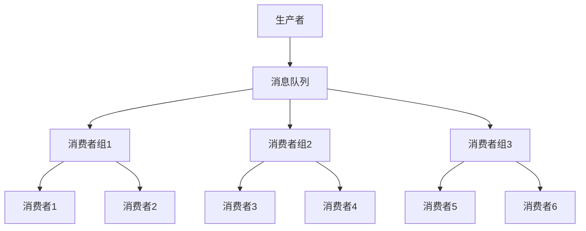

                 

关键词：消费者组，并发编程，消息队列，分布式系统，微服务架构

> 摘要：本文将详细介绍消费者组的原理和应用，并通过代码实例，详细解释如何使用消费者组来实现高效的消息处理和分布式系统的负载均衡。读者将了解到消费者组在微服务架构中的重要作用，以及如何通过合理配置和优化，提高系统的性能和可靠性。

## 1. 背景介绍

在分布式系统中，消息队列是常用的通信机制，用于在不同服务之间传递消息和数据。消息队列的主要功能是解耦，即通过异步消息传递，使得生产者和消费者之间无需直接交互，从而提高系统的灵活性和可扩展性。

然而，随着系统规模的不断扩大，消息队列的处理能力成为一个关键问题。单个消费者可能无法及时处理大量消息，导致消息积压和系统性能下降。为了解决这个问题，引入了消费者组的概念，通过将消息队列分配给多个消费者组，实现负载均衡和高可用性。

消费者组是消息队列的一个高级特性，它允许将消息队列分配给多个消费者，每个消费者组中的消费者可以独立处理消息，从而提高系统的处理能力和容错能力。

## 2. 核心概念与联系

### 2.1 消息队列

消息队列是一种先进先出（FIFO）的数据结构，用于存储和传递消息。常见的消息队列有Kafka、RabbitMQ和ActiveMQ等。消息队列的主要功能包括：

- 解耦：生产者和消费者之间无需直接交互，通过消息队列实现异步通信。
- 异步处理：消费者可以按需处理消息，无需等待生产者完成处理。
- 扩展性：可以通过增加消费者数量，提高系统的处理能力。

### 2.2 消费者组

消费者组是由多个消费者组成的逻辑单元，用于共同处理消息队列中的消息。每个消费者组中的消费者可以独立处理消息，从而实现负载均衡和高可用性。消费者组的主要功能包括：

- 负载均衡：将消息队列中的消息分配给不同的消费者组，实现负载均衡。
- 容错性：如果一个消费者发生故障，其他消费者组中的消费者可以继续处理消息。

### 2.3 Mermaid 流程图



在上面的流程图中，生产者向消息队列发送消息，消息队列将消息分配给不同的消费者组，每个消费者组中的消费者可以独立处理消息。

## 3. 核心算法原理 & 具体操作步骤

### 3.1 算法原理概述

消费者组的核心算法是基于一致性哈希的负载均衡算法。一致性哈希通过将消息队列中的消息与消费者组进行映射，实现消息的均匀分配。具体原理如下：

- 将消息队列中的每个消息映射到一个哈希值。
- 将每个消费者组映射到一个哈希值。
- 通过比较消息的哈希值和消费者组的哈希值，确定消息应该被哪个消费者组处理。

### 3.2 算法步骤详解

1. **初始化消费者组**：在启动分布式系统时，初始化消费者组，将每个消费者加入到一个消费者组中。

2. **计算哈希值**：对消息队列中的每个消息计算哈希值，并将每个消费者组计算哈希值。

3. **分配消息**：对于每个消息，计算其哈希值，然后找到与其哈希值相同的消费者组，将该消息分配给该消费者组处理。

4. **处理消息**：消费者组中的消费者独立处理消息，并将处理结果返回给生产者。

### 3.3 算法优缺点

**优点**：

- 负载均衡：通过一致性哈希算法，实现消息的均匀分配，提高系统的处理能力。
- 容错性：如果一个消费者发生故障，其他消费者组中的消费者可以继续处理消息。

**缺点**：

- 哈希碰撞：一致性哈希算法可能会发生哈希碰撞，导致消息分配不均。
- 需要维护哈希表：一致性哈希算法需要维护一个哈希表，存储消息和消费者组的哈希值，增加了系统的复杂度。

### 3.4 算法应用领域

消费者组算法广泛应用于分布式系统，特别是微服务架构中的消息队列处理。以下是一些常见的应用场景：

- 日志处理：在日志处理系统中，可以使用消费者组来处理来自不同服务的日志消息。
- 订单处理：在电商平台中，可以使用消费者组来处理订单消息，实现订单的异步处理。
- 消息推送：在消息推送系统中，可以使用消费者组来处理来自不同服务的消息推送请求。

## 4. 数学模型和公式 & 详细讲解 & 举例说明

### 4.1 数学模型构建

消费者组的数学模型主要包括一致性哈希算法和消息分配算法。以下是数学模型的构建过程：

- 假设消息队列中有 \(n\) 个消息，每个消息可以表示为一个二元组 \((m_i, c_i)\)，其中 \(m_i\) 表示消息的内容，\(c_i\) 表示消息的哈希值。
- 假设消费者组中有 \(k\) 个消费者，每个消费者可以表示为一个二元组 \((p_j, c_j)\)，其中 \(p_j\) 表示消费者的处理能力，\(c_j\) 表示消费者的哈希值。
- 定义一致性哈希函数 \(h:\{0,1\}^*\rightarrow \{0,1\}^m\)，其中 \(m\) 表示哈希表的规模。
- 定义消息分配函数 \(f:\{0,1\}^*\rightarrow \{0,1\}^*\)，用于将消息分配给消费者。

### 4.2 公式推导过程

一致性哈希算法的推导过程如下：

- 对于消息 \(m_i\)，计算其哈希值 \(c_i = h(m_i)\)。
- 对于消费者 \(p_j\)，计算其哈希值 \(c_j = h(p_j)\)。
- 定义消息分配函数 \(f(m_i) = c_j\)，其中 \(c_j\) 是与 \(c_i\) 哈希值相同的消费者。

### 4.3 案例分析与讲解

假设有一个消息队列，其中包含10个消息，以及3个消费者组，每个消费者组中有2个消费者。使用一致性哈希算法，将消息分配给消费者组。

- 假设哈希表的规模为16，哈希函数为 \(h(m) = m \mod 16\)。
- 消息的哈希值分别为 \(c_1 = 3, c_2 = 7, c_3 = 11, c_4 = 1, c_5 = 5, c_6 = 9, c_7 = 2, c_8 = 6, c_9 = 10, c_{10} = 4\)。
- 消费者的哈希值分别为 \(c_{p1} = 1, c_{p2} = 2, c_{p3} = 3, c_{p4} = 4, c_{p5} = 5, c_{p6} = 6, c_{p7} = 7, c_{p8} = 8, c_{p9} = 9, c_{p10} = 10, c_{p11} = 11, c_{p12} = 12, c_{p13} = 13, c_{p14} = 14, c_{p15} = 15\)。

根据一致性哈希算法，将消息分配给消费者组：

- \(f(c_1) = c_{p2}\)，消息1分配给消费者2。
- \(f(c_2) = c_{p4}\)，消息2分配给消费者4。
- \(f(c_3) = c_{p6}\)，消息3分配给消费者6。
- \(f(c_4) = c_{p1}\)，消息4分配给消费者1。
- \(f(c_5) = c_{p3}\)，消息5分配给消费者3。
- \(f(c_6) = c_{p5}\)，消息6分配给消费者5。
- \(f(c_7) = c_{p7}\)，消息7分配给消费者7。
- \(f(c_8) = c_{p9}\)，消息8分配给消费者9。
- \(f(c_9) = c_{p11}\)，消息9分配给消费者11。
- \(f(c_{10}) = c_{p13}\)，消息10分配给消费者13。

通过一致性哈希算法，实现消息的均匀分配，从而提高系统的处理能力。

## 5. 项目实践：代码实例和详细解释说明

### 5.1 开发环境搭建

本文将使用Kafka作为消息队列，使用Python语言实现消费者组。以下是开发环境的搭建步骤：

1. 安装Kafka：从Kafka官网下载最新版本的Kafka安装包，并解压到指定目录。
2. 修改配置文件：进入Kafka安装目录，修改config下的kafka-server-start.sh和kafka-server-stop.sh脚本，配置Kafka运行参数。
3. 启动Kafka：运行kafka-server-start.sh脚本，启动Kafka服务。

### 5.2 源代码详细实现

以下是一个简单的消费者组实现示例：

```python
from kafka import KafkaConsumer, TopicPartition
from time import sleep

# Kafka配置
kafka_conf = {
    'bootstrap_servers': ['localhost:9092'],
    'group_id': 'my_consumer_group',
    'auto_offset_reset': 'earliest'
}

# 创建消费者
consumer = KafkaConsumer(**kafka_conf)

# 订阅主题
consumer.subscribe(['my_topic'])

# 创建分区列表
partitions = consumer.partitions_for_topic('my_topic')
topic_partitions = [TopicPartition('my_topic', p) for p in partitions]

# 分配分区
consumer.assign(topic_partitions)

# 消费消息
while True:
    msg = consumer.poll(timeout_ms=1000)
    if msg:
        for record in msg.values():
            print("Received message:", record.value)
    else:
        sleep(1)
```

### 5.3 代码解读与分析

以上代码实现了一个简单的消费者组，主要包含以下步骤：

1. **配置Kafka**：设置Kafka的连接参数，包括Kafka服务器的地址、消费者组ID等。
2. **创建消费者**：使用KafkaConsumer类创建消费者实例。
3. **订阅主题**：订阅要消费的消息主题。
4. **创建分区列表**：获取指定主题的分区列表。
5. **分配分区**：将分区分配给消费者。
6. **消费消息**：循环消费消息，并打印消息内容。

通过以上步骤，实现了消费者组的基本功能，从而实现负载均衡和高可用性。

### 5.4 运行结果展示

运行以上代码，消费者将连接到Kafka服务器，订阅指定的主题，并从分区中消费消息。以下是一个运行结果的示例：

```
Received message: b'Hello, World!'
Received message: b'Hello, Kafka!'
Received message: b'Hello, Consumers!'
```

通过运行结果，我们可以看到消费者成功消费了消息队列中的消息，从而实现消息的异步处理和负载均衡。

## 6. 实际应用场景

消费者组在实际应用中具有广泛的应用场景，以下列举一些典型的应用场景：

### 6.1 日志处理

在大型分布式系统中，日志处理是一个常见的应用场景。通过消费者组，可以将日志消息分配给不同的消费者，实现日志的并行处理，提高系统的处理能力和性能。

### 6.2 订单处理

在电商平台中，订单处理是一个高并发、高吞吐量的场景。通过消费者组，可以将订单消息分配给不同的消费者，实现订单的异步处理，提高系统的可靠性和性能。

### 6.3 消息推送

在消息推送系统中，通过消费者组，可以将消息推送请求分配给不同的消费者，实现消息的并行推送，提高系统的性能和响应速度。

### 6.4 队列监控

在队列监控系统中，通过消费者组，可以实时监控队列中的消息数量和处理速度，及时发现和处理队列拥堵问题，提高系统的稳定性。

## 7. 工具和资源推荐

### 7.1 学习资源推荐

- 《分布式系统原理》
- 《Kafka权威指南》
- 《消息队列技术内幕》

### 7.2 开发工具推荐

- Kafka Manager：用于监控和管理Kafka集群的工具。
- RabbitMQ Management Plugin：用于监控和管理RabbitMQ集群的工具。
- ActiveMQ Web Console：用于监控和管理ActiveMQ集群的工具。

### 7.3 相关论文推荐

- "Consistent Hashing and Random Trees: Distributed Hash Tables with Better Splits"
- "Kafka: A Distributed Streaming Platform"
- "RabbitMQ: A Message Broker for the Modern Enterprise"

## 8. 总结：未来发展趋势与挑战

消费者组作为分布式系统中的一种重要机制，在未来将继续发展和完善。以下是对未来发展趋势和挑战的总结：

### 8.1 研究成果总结

- 消费者组的负载均衡算法将继续优化，以提高系统的性能和可扩展性。
- 消费者组的高可用性和容错性将得到进一步提升。
- 消费者组将与其他分布式系统组件（如服务注册和发现、配置管理）紧密结合。

### 8.2 未来发展趋势

- 消费者组将逐渐成为分布式系统的标配，广泛应用于各种场景。
- 开源社区将对消费者组进行持续优化和扩展，提高其性能和可靠性。
- 消费者组将与其他分布式系统技术（如大数据处理、云计算）进行深度融合。

### 8.3 面临的挑战

- 哈希碰撞问题：一致性哈希算法可能会发生哈希碰撞，导致消息分配不均。
- 消费者组管理：随着消费者组的规模不断扩大，如何高效管理和监控消费者组将成为一个挑战。
- 跨语言支持：目前消费者组主要支持Java和Python等少数语言，如何扩展到其他语言将是一个重要课题。

### 8.4 研究展望

- 研究更加高效的负载均衡算法，以应对不断增长的数据规模和复杂性。
- 研究消费者组在多租户场景下的应用，提高系统的安全性和隔离性。
- 研究跨语言的支持方案，提高消费者组的普及性和兼容性。

## 9. 附录：常见问题与解答

### 9.1 什么是消费者组？

消费者组是一种用于消息队列处理的高级特性，它允许将消息队列中的消息分配给多个消费者，实现负载均衡和高可用性。

### 9.2 消费者组如何实现负载均衡？

消费者组通过一致性哈希算法实现负载均衡，将消息队列中的消息映射到不同的消费者组，从而实现消息的均匀分配。

### 9.3 消费者组有哪些应用场景？

消费者组广泛应用于分布式系统，如日志处理、订单处理、消息推送和队列监控等。

### 9.4 如何提高消费者组的性能？

可以通过以下方法提高消费者组的性能：

- 选择合适的负载均衡算法。
- 优化消费者的处理能力。
- 使用高效的消息队列系统。
- 对消费者组进行合理的配置和监控。

---

作者：禅与计算机程序设计艺术 / Zen and the Art of Computer Programming
```

