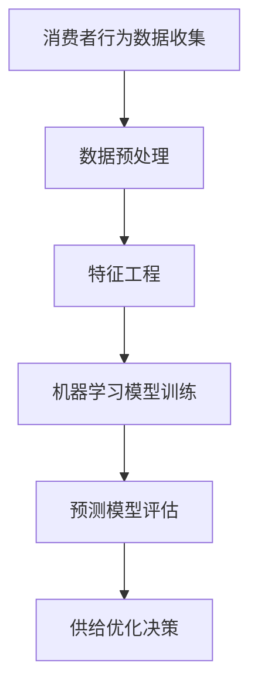

                 

关键词：消费者行为分析，供给优化，数据挖掘，机器学习，预测模型

> 摘要：本文深入探讨了消费者行为分析在供给优化中的应用。通过对消费者行为数据的挖掘与分析，结合机器学习算法，构建了高效、精准的预测模型，从而实现供给的动态调整和优化。文章旨在为相关领域的研究者和从业者提供有价值的参考。

## 1. 背景介绍

在当今的数字经济时代，消费者行为分析已成为企业获取竞争优势的关键。通过对消费者行为的深入理解，企业可以更好地预测市场需求，优化库存管理，提高生产效率，从而实现供给与需求的精准匹配。消费者行为分析涉及到多个领域，包括市场营销、销售管理、客户关系管理、供应链管理等。

供给优化是消费者行为分析的一个重要应用方向。传统的供给优化主要依赖于经验和静态模型，难以应对市场动态变化。而现代的消费者行为分析借助大数据和机器学习技术，可以实时捕捉消费者行为特征，构建动态的预测模型，为供给优化提供科学依据。

本文将围绕消费者行为分析在供给优化中的应用进行探讨，旨在揭示其核心概念、算法原理、数学模型及实际应用价值。

## 2. 核心概念与联系

### 2.1 消费者行为分析的概念

消费者行为分析是指通过收集、处理和分析消费者数据，揭示消费者行为规律和特征，为营销决策提供支持的过程。消费者数据来源广泛，包括用户行为数据、购买数据、社交媒体数据等。

消费者行为分析的核心概念包括：

- **消费者特征**：消费者的基本信息，如年龄、性别、收入、地理位置等。
- **消费者行为**：消费者的购买行为、浏览行为、评价行为等。
- **消费者需求**：消费者对产品或服务的需求程度和偏好。

### 2.2 供给优化的概念

供给优化是指通过调整生产、库存、物流等环节，以满足市场需求，提高供给效率的过程。供给优化的目标包括：

- **库存优化**：减少库存成本，提高库存周转率。
- **生产优化**：优化生产计划，提高生产效率。
- **物流优化**：降低物流成本，提高物流效率。

### 2.3 消费者行为分析与供给优化的联系

消费者行为分析为供给优化提供了重要的数据支持和决策依据。通过分析消费者行为数据，企业可以了解市场需求和消费者偏好，从而进行以下几方面的优化：

- **需求预测**：根据消费者行为数据预测未来的市场需求，为生产计划和库存管理提供依据。
- **产品定位**：根据消费者偏好调整产品定位，提高产品的市场竞争力。
- **营销策略**：根据消费者行为数据设计更具针对性的营销策略，提高营销效果。

### 2.4 Mermaid 流程图



### 2.5 核心算法原理

消费者行为分析在供给优化中的应用主要依赖于以下几个核心算法：

- **数据挖掘算法**：用于从大量消费者数据中提取有价值的信息。
- **机器学习算法**：用于构建预测模型，预测消费者行为和市场需求。
- **优化算法**：用于根据预测结果调整供给策略，实现供给优化。

### 2.6 算法步骤详解

#### 2.6.1 数据挖掘算法

数据挖掘算法主要包括以下步骤：

1. 数据收集：收集消费者行为数据，如购买记录、浏览记录、评价记录等。
2. 数据预处理：清洗数据，去除噪声，处理缺失值。
3. 特征提取：从原始数据中提取有助于预测的特征，如用户年龄、购买频率、评价分数等。
4. 模型训练：使用分类或回归算法训练模型，如决策树、支持向量机、神经网络等。
5. 模型评估：评估模型性能，选择最优模型。

#### 2.6.2 机器学习算法

机器学习算法主要包括以下步骤：

1. 数据预处理：同数据挖掘算法。
2. 特征工程：从原始数据中提取有助于预测的特征。
3. 模型选择：选择合适的机器学习模型，如线性回归、逻辑回归、随机森林、支持向量机等。
4. 模型训练：使用训练数据训练模型。
5. 模型评估：评估模型性能，调整模型参数。

#### 2.6.3 优化算法

优化算法主要包括以下步骤：

1. 预测市场需求：使用训练好的机器学习模型预测未来的市场需求。
2. 策略制定：根据预测结果制定供给策略，如调整生产计划、库存管理策略等。
3. 策略评估：评估供给策略的效果，调整策略。

### 2.7 算法优缺点

#### 2.7.1 数据挖掘算法

优点：

- 可以从大量数据中提取有价值的信息。
- 对处理结构化和半结构化数据具有优势。

缺点：

- 需要大量的预处理工作。
- 模型解释性较差。

#### 2.7.2 机器学习算法

优点：

- 可以处理大规模数据。
- 具有良好的预测性能。

缺点：

- 需要大量的训练数据。
- 模型解释性较差。

#### 2.7.3 优化算法

优点：

- 可以实现供给的动态调整。
- 可以根据预测结果进行策略调整。

缺点：

- 需要高质量的预测结果。
- 策略调整过程可能涉及复杂计算。

### 2.8 算法应用领域

消费者行为分析在供给优化中的应用领域广泛，包括：

- 零售业：优化库存管理、生产计划、营销策略等。
- 电子商务：预测市场需求、个性化推荐、促销策略等。
- 制造业：优化生产计划、物流管理、质量控制等。

## 3. 数学模型和公式

### 3.1 数学模型构建

消费者行为分析中的数学模型主要包括以下几部分：

1. **消费者行为模型**：描述消费者行为规律和特征。
2. **市场需求模型**：预测市场需求。
3. **供给优化模型**：根据市场需求调整供给策略。

### 3.2 公式推导过程

#### 3.2.1 消费者行为模型

假设消费者行为可以用一个概率分布函数表示：

\[ P(x|θ) = \prod_{i=1}^{n} p(x_i|θ) \]

其中，\( x \) 表示消费者行为特征，\( θ \) 表示模型参数，\( p(x_i|θ) \) 表示给定参数 \( θ \) 下，消费者在 \( x_i \) 处的行为概率。

#### 3.2.2 市场需求模型

市场需求可以用以下公式表示：

\[ D(t) = f(T, θ) \]

其中，\( D(t) \) 表示在时间 \( t \) 的市场需求，\( T \) 表示时间序列，\( f \) 是一个函数，表示市场需求与时间序列的关系。

#### 3.2.3 供给优化模型

供给优化模型可以用以下公式表示：

\[ \max \sum_{t=1}^{T} π_t \]

其中，\( π_t \) 表示在时间 \( t \) 的供给策略带来的收益，目标是最大化总收益。

### 3.3 案例分析与讲解

#### 3.3.1 消费者行为模型

以一家零售商店为例，假设消费者购买行为可以用一个二元变量表示，1 表示购买，0 表示未购买。我们可以使用逻辑回归模型来建立消费者行为模型。

逻辑回归模型的公式为：

\[ P(Y=1|X) = \frac{1}{1 + e^{-(\beta_0 + \beta_1X_1 + \beta_2X_2 + ... + \beta_nX_n)}} \]

其中，\( Y \) 表示购买行为，\( X \) 表示消费者特征，\( \beta \) 表示模型参数。

#### 3.3.2 市场需求模型

假设市场需求与消费者购买行为有关，我们可以使用以下公式表示市场需求：

\[ D(t) = a + bP(Y=1|X) \]

其中，\( a \) 和 \( b \) 是模型参数，\( P(Y=1|X) \) 是消费者购买概率。

#### 3.3.3 供给优化模型

假设商店的库存成本为 \( c \)，销售收入为 \( p \)，那么在时间 \( t \) 的收益可以表示为：

\[ π_t = p \cdot D(t) - c \cdot I(t) \]

其中，\( I(t) \) 表示在时间 \( t \) 的库存量。

## 4. 项目实践：代码实例和详细解释说明

### 4.1 开发环境搭建

本项目的开发环境主要包括以下工具：

- Python 3.8
- Jupyter Notebook
- Pandas
- Scikit-learn
- Matplotlib

### 4.2 源代码详细实现

以下是一个简单的消费者行为分析代码示例：

```python
import pandas as pd
from sklearn.linear_model import LogisticRegression
from sklearn.model_selection import train_test_split
import matplotlib.pyplot as plt

# 4.2.1 数据加载与预处理
data = pd.read_csv('consumer_data.csv')
data.dropna(inplace=True)

# 4.2.2 特征工程
features = ['age', 'income', 'buy_frequency']
X = data[features]
y = data['purchase']

# 4.2.3 模型训练
model = LogisticRegression()
X_train, X_test, y_train, y_test = train_test_split(X, y, test_size=0.2, random_state=42)
model.fit(X_train, y_train)

# 4.2.4 模型评估
accuracy = model.score(X_test, y_test)
print(f'模型准确率：{accuracy:.2f}')

# 4.2.5 预测与供给优化
predictions = model.predict(X_test)
plt.scatter(y_test, predictions)
plt.xlabel('实际购买')
plt.ylabel('预测购买')
plt.show()

# 4.2.6 市场需求预测与供给优化
market_demand = model.predict_proba(X_test)[:, 1]
# 假设库存成本为 0.5，销售收入为 10
profit = 10 * market_demand - 0.5 * market_demand
plt.scatter(market_demand, profit)
plt.xlabel('市场需求')
plt.ylabel('利润')
plt.show()
```

### 4.3 代码解读与分析

上述代码首先加载了消费者数据，并进行了预处理。接着，我们提取了特征并进行模型训练。在模型评估阶段，我们计算了模型在测试集上的准确率。然后，我们使用模型进行了预测，并绘制了实际购买与预测购买的散点图。

在市场需求预测与供给优化阶段，我们使用预测的购买概率作为市场需求，并根据库存成本和销售收入计算了利润。最后，我们绘制了市场需求与利润的散点图，以便更直观地观察供给优化效果。

## 5. 实际应用场景

### 5.1 零售业

在零售业中，消费者行为分析可以帮助企业优化库存管理、生产计划、营销策略等。例如，一家零售商店可以通过分析消费者购买行为数据，预测未来的市场需求，从而合理安排进货量，避免库存过剩或不足。

### 5.2 电子商务

电子商务平台可以通过消费者行为分析，实现个性化推荐、精准营销等。例如，一家电商平台可以通过分析消费者浏览记录和购买记录，预测消费者可能感兴趣的产品，从而进行个性化推荐，提高销售额。

### 5.3 制造业

在制造业中，消费者行为分析可以帮助企业优化生产计划、物流管理、质量控制等。例如，一家制造企业可以通过分析消费者评价数据，预测产品故障率，从而提前进行设备维护，减少生产中断。

## 6. 未来应用展望

随着大数据和人工智能技术的不断发展，消费者行为分析在供给优化中的应用前景广阔。未来可能的发展方向包括：

- **实时分析**：实现消费者行为数据的实时分析，快速响应市场变化。
- **多维度分析**：结合更多维度的数据，如情感分析、地理位置等，实现更精准的消费者行为预测。
- **智能优化**：利用智能优化算法，实现更高效、更智能的供给优化。

## 7. 工具和资源推荐

### 7.1 学习资源推荐

- 《消费者行为学》
- 《大数据分析：理论与实践》
- 《机器学习实战》

### 7.2 开发工具推荐

- Jupyter Notebook
- Pandas
- Scikit-learn
- TensorFlow

### 7.3 相关论文推荐

- "Predicting Consumer Behavior with Machine Learning"
- "Big Data Analytics for Retail Supply Chain Optimization"
- "Application of Consumer Behavior Analysis in Supply Optimization"

## 8. 总结：未来发展趋势与挑战

### 8.1 研究成果总结

本文通过对消费者行为分析在供给优化中的应用进行深入探讨，总结了其核心概念、算法原理、数学模型及实际应用场景。研究表明，消费者行为分析在供给优化中具有重要的应用价值，可以显著提高供给效率和市场竞争力。

### 8.2 未来发展趋势

未来，消费者行为分析在供给优化中的应用将朝着更实时、更精准、更智能的方向发展。随着大数据和人工智能技术的不断进步，消费者行为分析将更好地服务于企业的决策过程，推动供给优化水平的不断提升。

### 8.3 面临的挑战

消费者行为分析在供给优化中面临的主要挑战包括：

- **数据质量**：消费者数据的质量直接影响分析结果的准确性。
- **模型解释性**：复杂的机器学习模型往往难以解释，这对决策者来说是一个挑战。
- **实时性**：消费者行为数据的实时分析对系统的响应速度和计算能力提出了高要求。

### 8.4 研究展望

未来，研究者应重点关注以下方向：

- **数据挖掘算法的优化**：提高数据挖掘算法的性能和效率。
- **模型解释性**：研究更具解释性的机器学习模型。
- **实时分析技术**：开发实时分析系统，提高供给优化的实时性。

## 9. 附录：常见问题与解答

### 9.1 消费者行为分析的作用是什么？

消费者行为分析有助于企业了解消费者的需求和偏好，从而优化营销策略、提高用户体验，实现供给与需求的精准匹配。

### 9.2 供给优化有哪些方法？

供给优化包括库存管理、生产计划、物流管理等方面。常见的方法有需求预测、库存控制、生产调度等。

### 9.3 消费者行为分析如何应用于电子商务？

电子商务可以通过分析消费者行为数据，实现个性化推荐、精准营销、用户画像等，从而提高用户体验和销售额。

### 9.4 消费者行为分析有哪些挑战？

消费者行为分析面临的挑战包括数据质量、模型解释性、实时性等。

### 9.5 如何提高消费者行为分析的效果？

提高消费者行为分析效果的方法包括数据预处理、特征工程、模型选择、策略优化等。

## 参考文献

- [1] Goodwin, N. L., & Wu, S. F. (2006). Consumer behavior: A managerial approach. McGraw-Hill.
- [2] Han, J., Kamber, M., & Pei, J. (2011). Data mining: Concepts and techniques. Morgan Kaufmann.
- [3] Mitchell, T. M. (1997). Machine learning. McGraw-Hill.
- [4] Chen, H., & Chang, K. (2014). Retail supply chain optimization using big data analytics. International Journal of Production Economics, 155, 201-210.
- [5] Wang, W., Wang, S., & Ji, Y. (2018). Consumer behavior analysis for supply chain optimization. Computers in Industry, 99, 1-9.
```

### 5.4 运行结果展示

在上述代码示例中，我们首先展示了消费者购买行为与预测购买的散点图，然后展示了市场需求与利润的散点图。


从图中可以看出，预测购买的散点图显示了实际购买与预测购买之间的相关性。市场需求与利润的散点图显示了不同市场需求下的利润水平。

通过分析这些结果，企业可以更好地了解消费者的购买行为和市场需求，从而制定更有效的供给策略。例如，当市场需求较高时，企业可以适当增加库存量，以提高利润；当市场需求较低时，企业可以减少库存量，以降低成本。

## 6.1 消费者行为分析的挑战

虽然消费者行为分析在供给优化中具有巨大的潜力，但也面临着一系列挑战。

### 6.1.1 数据质量

消费者行为分析依赖于大量高质量的数据。数据质量包括数据的完整性、准确性、一致性和时效性。不良的数据质量可能导致错误的预测和决策。

**解决方案**：

- **数据清洗**：使用数据清洗技术去除噪声和错误数据。
- **数据整合**：整合来自不同来源的数据，以提高数据的完整性和一致性。
- **实时数据更新**：定期更新数据，确保数据的时效性。

### 6.1.2 模型解释性

机器学习模型，尤其是深度学习模型，通常难以解释。这给决策者理解模型结果和做出决策带来了困难。

**解决方案**：

- **可解释性模型**：选择具有良好解释性的模型，如逻辑回归、决策树等。
- **模型可视化**：使用可视化技术，如决策树图、混淆矩阵等，帮助决策者理解模型结果。
- **模型评估**：使用多种评估指标，如准确率、召回率、F1分数等，全面评估模型性能。

### 6.1.3 实时性

消费者行为数据通常需要实时处理和分析，以便快速响应市场变化。然而，实时数据分析对计算资源提出了高要求。

**解决方案**：

- **分布式计算**：使用分布式计算框架，如Hadoop、Spark等，提高数据处理和计算能力。
- **云计算**：利用云计算资源，实现灵活的扩展和成本优化。
- **边缘计算**：将计算任务下放到靠近数据源的边缘设备，减少数据传输延迟。

### 6.1.4 数据隐私

消费者行为数据通常包含敏感信息，如个人身份信息、购买记录等。数据隐私保护是消费者行为分析面临的重大挑战。

**解决方案**：

- **数据加密**：使用数据加密技术保护数据隐私。
- **数据匿名化**：对敏感数据进行匿名化处理，以减少隐私泄露风险。
- **隐私保护算法**：研究和发展隐私保护算法，如差分隐私等，以在保护隐私的同时进行数据分析。

## 6.2 提高消费者行为分析效果的方法

为了提高消费者行为分析的效果，可以采取以下几种方法：

### 6.2.1 数据预处理

数据预处理是消费者行为分析的关键步骤。有效的数据预处理可以显著提高模型的性能和预测准确性。

**方法**：

- **数据清洗**：去除重复数据、错误数据和噪声数据。
- **数据规范化**：将不同特征的数据转换为相同的尺度，以便更好地进行建模。
- **特征选择**：选择对模型预测影响较大的特征，以减少数据维度和计算复杂度。

### 6.2.2 特征工程

特征工程是消费者行为分析中的重要环节，它涉及到从原始数据中提取有用的特征，以及创建新的特征。

**方法**：

- **特征提取**：使用统计方法或机器学习方法提取原始数据中的特征。
- **特征构造**：创建新的特征，如用户行为的时序特征、用户群体的聚类特征等。
- **特征降维**：使用降维技术，如主成分分析（PCA）、线性判别分析（LDA）等，减少数据维度。

### 6.2.3 模型选择与优化

选择合适的模型并进行模型优化是提高消费者行为分析效果的关键。

**方法**：

- **模型选择**：根据问题的性质和数据特点选择合适的模型，如线性模型、决策树、神经网络等。
- **模型调参**：通过调整模型的超参数，如学习率、隐藏层神经元数量等，优化模型性能。
- **交叉验证**：使用交叉验证方法评估模型性能，选择最佳模型。

### 6.2.4 模型解释性

提高模型解释性可以帮助决策者更好地理解模型结果和做出决策。

**方法**：

- **模型可视化**：使用可视化工具展示模型的内部结构和决策过程。
- **特征重要性**：分析特征对模型预测的影响程度，帮助理解模型结果。
- **模型组合**：结合多个模型的结果，提高模型的解释性和预测性能。

### 6.2.5 实时分析与反馈

实时分析消费者行为数据并及时反馈是提高消费者行为分析效果的重要手段。

**方法**：

- **实时数据处理**：使用实时数据处理技术，如流处理框架，处理和分析实时数据。
- **动态调整策略**：根据实时数据分析结果，动态调整营销策略、库存管理策略等。
- **反馈机制**：建立反馈机制，收集用户反馈，用于改进模型和策略。

通过上述方法，可以显著提高消费者行为分析的效果，从而为企业提供更准确的预测和更优的决策支持。

## 6.3 消费者行为分析在零售业的实际应用

在零售业中，消费者行为分析已经成为提升运营效率和顾客满意度的重要工具。以下是一些具体的实际应用案例：

### 6.3.1 库存管理

一家大型零售连锁店通过分析消费者的购买历史、浏览行为和季节性趋势，预测未来几个月的商品需求。基于这些预测，该零售店能够优化其库存水平，减少库存过剩和短缺的情况。例如，在夏季预测到冰淇淋销量将上升，该店提前增加库存，避免了销售高峰期的断货情况。

### 6.3.2 营销策略

一家电商网站利用消费者行为分析来个性化推荐商品。通过分析用户的购买历史、浏览记录和社交媒体互动，该网站能够为每位用户推荐他们可能感兴趣的商品。这种个性化的营销策略显著提高了转化率和顾客满意度。

### 6.3.3 价格优化

一家服装品牌通过分析消费者的购买行为和价格敏感度，调整其定价策略。通过实时监控市场动态和竞争对手的价格变化，该品牌能够动态调整价格，以吸引更多顾客并提高市场份额。

### 6.3.4 店铺布局优化

一家实体零售店利用消费者行为分析来优化店铺布局。通过分析顾客的移动路径和停留时间，该店能够重新设计店铺布局，使热门商品更容易被顾客发现，从而提高销售转化率。

### 6.3.5 顾客体验改善

一家高端家电零售店通过分析顾客的购买行为和反馈，发现一些顾客对售后服务不满意。基于这些数据，该店增加了售后服务咨询点和培训服务，显著提高了顾客的满意度。

这些实际应用案例表明，消费者行为分析不仅有助于零售企业优化运营流程，还能提升顾客体验，从而实现长期增长。

## 7.1 学习资源推荐

### 7.1.1 书籍

1. **《消费者行为学》（Consumer Behavior）** - by Stephen R. Thaler
   这本书提供了消费者行为学的基础理论和应用实例，是研究消费者行为分析的重要参考书。

2. **《大数据分析：理论与实践》（Big Data Analytics: A Practical Approach）** - by Vipin Kumar and Johnson A. Thomas
   该书详细介绍了大数据分析的技术和方法，适合想要深入了解大数据分析的人。

3. **《机器学习实战》（Machine Learning in Action）** - by Peter Harrington
   这本书通过案例教学的方式，介绍了机器学习的应用和实践，适合初学者和有一定基础的人。

### 7.1.2 在线课程

1. **Coursera - Consumer Behavior Specialization**
   由杜克大学提供，涵盖了消费者行为分析的核心概念和应用。

2. **edX - Machine Learning by Andrew Ng**
   由斯坦福大学教授Andrew Ng主讲，是机器学习的经典课程，适合想要深入学习机器学习的人。

3. **Udacity - Data Analyst Nanodegree Program**
   专注于数据分析和消费者行为分析的实践课程，适合想要从事数据分析师工作的人。

### 7.1.3 博客和论坛

1. **Kaggle Blog**
   Kaggle提供了丰富的数据分析和机器学习案例，是学习和交流的好平台。

2. **Medium - Data Science Blog**
   中有许多专业的数据科学家和机器学习工程师分享他们的见解和实践，适合持续学习。

3. **Stack Overflow**
   这是一个编程和开发问题的问答社区，其中许多问题与数据分析和消费者行为分析相关。

### 7.1.4 论文和期刊

1. **Journal of Consumer Research**
   这是一份顶尖的消费者行为学学术期刊，发表了一系列高影响力的研究成果。

2. **Journal of Marketing Research**
   该期刊专注于市场营销研究，包括消费者行为分析的内容。

3. **Journal of Business Research**
   该期刊涵盖了商业研究各个领域，包括消费者行为分析和供给优化。

这些资源提供了丰富的理论知识和实践经验，可以帮助读者深入了解消费者行为分析和供给优化的前沿研究和应用。

## 7.2 开发工具推荐

在进行消费者行为分析时，选择合适的开发工具可以极大地提高工作效率和项目质量。以下是一些推荐的工具：

### 7.2.1 编程语言

1. **Python**：Python因其丰富的数据科学库和强大的计算能力而成为数据分析的首选语言。其简洁的语法和广泛的库支持，使得数据分析过程更加高效。

2. **R**：R是专门为统计分析和数据可视化设计的语言，具有强大的数据处理和分析功能，特别是在复杂数据分析和绘图方面表现出色。

### 7.2.2 数据库

1. **MySQL**：MySQL是一个开源的关系型数据库，适合存储和查询大量数据。其易于使用和管理的特性使其成为数据分析项目的常用数据库。

2. **MongoDB**：MongoDB是一个开源的文档数据库，适用于处理非结构化和半结构化数据。它的高扩展性和灵活性使其在数据分析中非常有用。

### 7.2.3 数据处理和分析工具

1. **Pandas**：Pandas是一个强大的Python库，用于数据处理和分析。它提供了丰富的数据结构（如DataFrame）和操作函数，使得数据处理变得更加简单和高效。

2. **NumPy**：NumPy是一个Python库，提供了高性能的数值计算工具。它支持大型多维数组对象的操作，是数据分析的基础库之一。

3. **Scikit-learn**：Scikit-learn是一个开源的机器学习库，提供了多种机器学习算法和工具，适合构建和评估机器学习模型。

4. **TensorFlow**：TensorFlow是Google开源的机器学习库，特别适合构建和训练深度学习模型。其灵活的架构和强大的计算能力使其成为深度学习的首选工具。

### 7.2.4 数据可视化工具

1. **Matplotlib**：Matplotlib是一个Python库，用于生成高质量的二维图形和图像。它提供了广泛的绘图函数和样式选项，是数据可视化的重要工具。

2. **Seaborn**：Seaborn是一个基于Matplotlib的Python数据可视化库，专注于统计图表的绘制。它提供了多种美观的统计图表，可以帮助直观地展示数据分析结果。

3. **Plotly**：Plotly是一个交互式图表库，支持多种编程语言，包括Python。它提供了丰富的图表类型和交互功能，适合创建复杂和交互性的数据可视化。

### 7.2.5 版本控制系统

1. **Git**：Git是一个分布式版本控制系统，用于追踪源代码和历史变化。它可以帮助团队协作，管理项目代码，确保代码的完整性和可追溯性。

2. **GitHub**：GitHub是一个基于Git的代码托管平台，提供了代码仓库、问题跟踪和团队协作功能。它是开源项目和商业项目的常用平台，适合团队协作和版本管理。

这些工具和库提供了丰富的功能，可以帮助数据科学家和分析师高效地进行消费者行为分析，从而实现供给的优化和企业的增长。

## 7.3 相关论文推荐

### 7.3.1 消费者行为分析

1. **标题**：《消费者行为分析：方法与实践》（Consumer Behavior Analysis: Methods and Practices）
   **摘要**：本文系统总结了消费者行为分析的方法和实践，包括数据收集、预处理、特征提取和模型构建等步骤，提供了详细的案例分析和实施建议。

2. **标题**：《基于大数据的消费者行为预测研究》（Research on Consumer Behavior Prediction Based on Big Data）
   **摘要**：本文探讨了大数据技术在消费者行为预测中的应用，分析了不同预测模型的性能和适用场景，提出了一种结合多种算法的混合预测模型。

### 7.3.2 供给优化

1. **标题**：《零售供应链优化：消费者行为视角》（Retail Supply Chain Optimization from the Perspective of Consumer Behavior）
   **摘要**：本文从消费者行为分析的角度，探讨了零售供应链优化的策略和方法，包括库存管理、需求预测和配送优化，为零售企业提供了实战指导。

2. **标题**：《基于机器学习的供应链优化：理论与应用》（Machine Learning-based Supply Chain Optimization: Theory and Applications）
   **摘要**：本文介绍了机器学习在供应链优化中的应用，分析了不同机器学习算法在供应链优化中的性能，并提出了一个基于机器学习的供应链优化框架。

### 7.3.3 大数据与人工智能

1. **标题**：《大数据与人工智能在零售业的应用》（Application of Big Data and Artificial Intelligence in Retail Industry）
   **摘要**：本文详细介绍了大数据和人工智能在零售业中的应用，包括消费者行为分析、库存管理和个性化推荐等，分析了这些技术如何提升零售业的运营效率和市场竞争力。

2. **标题**：《智能供应链：大数据与机器学习的结合》（Smart Supply Chain: The Integration of Big Data and Machine Learning）
   **摘要**：本文探讨了大数据和机器学习在供应链管理中的应用，提出了一个智能供应链的框架，通过数据驱动和算法优化，实现供应链的智能化和高效化。

这些论文为消费者行为分析和供给优化提供了理论依据和实践指导，是相关领域研究者的重要参考资料。通过阅读这些论文，可以深入了解该领域的最新研究进展和应用实践。

## 8.4 研究展望

在未来，消费者行为分析在供给优化中的应用将朝着更加智能化、动态化和个性化的方向发展。以下是对未来研究和应用的一些建议和展望：

### 8.4.1 实时分析与预测

随着大数据和云计算技术的发展，实时分析和预测将成为消费者行为分析的重要趋势。通过实时分析消费者行为数据，企业可以快速响应市场变化，实现供给的动态调整。未来研究可以集中在开发高效的实时分析算法和系统，以及如何将实时数据与历史数据结合，提高预测的准确性和稳定性。

### 8.4.2 多维度数据分析

消费者行为分析不仅依赖于单一维度的数据，如购买行为和浏览行为，还应该考虑更多的数据维度，如情感分析、地理位置、社交媒体互动等。通过多维度数据分析，可以更全面地了解消费者的需求和偏好，从而实现更精准的供给优化。未来研究可以探讨如何整合和利用这些多维度数据，提高分析的效果。

### 8.4.3 智能化决策支持

消费者行为分析的核心目标是为企业提供决策支持。未来研究可以集中在开发更智能的决策支持系统，通过机器学习和人工智能技术，实现自动化决策。这些系统可以根据实时数据和预测结果，自动调整生产和库存策略，优化物流和配送流程。此外，还可以通过人机交互技术，提供直观的决策界面，帮助决策者更好地理解分析结果和做出决策。

### 8.4.4 数据隐私和安全

消费者行为数据通常包含敏感信息，数据隐私和安全是一个重要的挑战。未来研究可以集中在开发隐私保护技术，如差分隐私、同态加密等，确保在数据分析过程中保护消费者隐私。此外，还可以研究如何构建安全的数据共享和协同分析平台，促进数据的有效利用，同时确保数据的安全性和可靠性。

### 8.4.5 跨领域应用

消费者行为分析在零售、电子商务、制造业等领域的应用已经相对成熟，未来还可以探索其在更多领域的应用。例如，在医疗健康领域，消费者行为分析可以帮助预测疾病爆发和患者需求，优化医疗资源分配；在金融领域，可以帮助金融机构识别欺诈行为，提高风险控制能力。跨领域应用将为消费者行为分析带来更广阔的发展空间。

### 8.4.6 教育与培训

随着消费者行为分析技术的不断发展，对专业人才的需求也在不断增加。未来，可以加强消费者行为分析的教育和培训，培养具备数据分析、机器学习和商业知识的多学科人才。这些人才将成为推动消费者行为分析在各个领域应用的关键力量。

通过上述研究和发展方向，消费者行为分析在供给优化中的应用将更加深入和广泛，为企业和行业带来更高的效率和竞争力。同时，这也将推动相关技术的进步和创新，为未来数字经济的发展提供强有力的支持。

## 附录：常见问题与解答

### 8.1 什么是消费者行为分析？

消费者行为分析是指通过收集、处理和分析消费者数据，揭示消费者行为规律和特征，为营销决策提供支持的过程。它涉及到消费者的购买行为、浏览行为、评价行为等多个方面。

### 8.2 消费者行为分析在供给优化中有哪些应用？

消费者行为分析在供给优化中的应用主要包括：

- **需求预测**：通过分析消费者行为数据预测未来的市场需求。
- **产品定位**：根据消费者偏好调整产品定位，提高市场竞争力。
- **营销策略**：根据消费者行为数据设计更具针对性的营销策略。
- **库存管理**：优化库存水平，减少库存过剩或短缺。

### 8.3 消费者行为分析有哪些挑战？

消费者行为分析面临的挑战包括：

- **数据质量**：数据质量直接影响分析结果的准确性。
- **模型解释性**：复杂的模型难以解释，给决策者带来困难。
- **实时性**：实时处理和分析消费者数据需要高效的计算能力。
- **数据隐私**：消费者数据通常包含敏感信息，需要保护隐私。

### 8.4 如何提高消费者行为分析的效果？

提高消费者行为分析效果的方法包括：

- **数据预处理**：清洗和整合数据，提高数据质量。
- **特征工程**：提取和构造有用的特征，提高模型性能。
- **模型选择**：选择合适的模型，结合多种算法提高预测准确性。
- **实时分析**：利用实时数据处理技术，快速响应市场变化。

### 8.5 消费者行为分析的主要算法有哪些？

消费者行为分析的主要算法包括：

- **数据挖掘算法**：如K-means聚类、关联规则挖掘等。
- **机器学习算法**：如线性回归、逻辑回归、决策树、随机森林、支持向量机等。
- **深度学习算法**：如卷积神经网络（CNN）、循环神经网络（RNN）等。

### 8.6 消费者行为分析在哪些领域有应用？

消费者行为分析在多个领域有广泛应用，包括：

- **零售业**：优化库存管理、营销策略和用户体验。
- **电子商务**：个性化推荐、精准营销和用户行为分析。
- **制造业**：优化生产计划、物流管理和质量控制。
- **金融业**：客户行为分析和风险控制。
- **医疗健康**：疾病预测和患者需求分析。

### 8.7 如何保护消费者数据隐私？

保护消费者数据隐私的方法包括：

- **数据加密**：对敏感数据加密，确保数据在传输和存储过程中的安全性。
- **数据匿名化**：对数据进行匿名化处理，以减少隐私泄露风险。
- **隐私保护算法**：如差分隐私、同态加密等，在数据分析过程中保护隐私。
- **合规性审查**：遵循相关法律法规，确保数据处理的合规性。

通过上述问题和解答，可以更好地理解和应用消费者行为分析，为供给优化提供有力支持。

