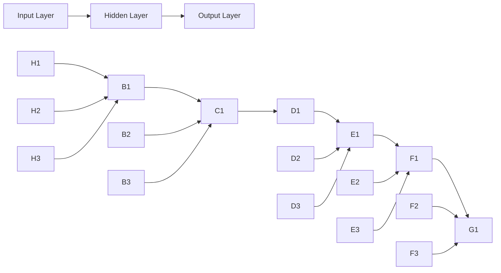

                 

关键词：AI，深度学习，LLM，实践课程，算法原理，数学模型，应用领域，代码实例，未来展望

> 摘要：本文旨在为读者提供一个全面而深入的AI、LLM和深度学习的实践课程。通过详细阐述核心概念、算法原理、数学模型、实际应用和未来展望，帮助读者更好地理解和应用这些先进技术。

## 1. 背景介绍

### 1.1 AI的发展历程

人工智能（AI）作为计算机科学的一个分支，起源于20世纪50年代。从早期的符号主义、知识表示到20世纪80年代的专家系统，再到20世纪90年代的统计学习方法和近年来深度学习的兴起，AI经历了多次变革和突破。随着计算能力的提升和数据量的爆炸性增长，AI技术在语音识别、图像处理、自然语言处理等领域取得了显著成果。

### 1.2 深度学习的崛起

深度学习作为AI的一种重要分支，凭借其强大的特征提取能力和自动学习机制，在图像识别、语音识别、自然语言处理等领域取得了突破性进展。深度学习的核心在于多层神经网络，通过多层次的非线性变换，能够自动提取数据中的高维特征。

### 1.3 语言模型的发展

语言模型（Language Model，简称LM）是自然语言处理（Natural Language Processing，简称NLP）的重要工具。从早期的N元语法到现代的深度学习语言模型，如Word2Vec、BERT和GPT，语言模型在机器翻译、文本生成、问答系统等领域发挥了关键作用。特别是基于变换器（Transformer）的预训练语言模型（Pre-trained Language Model，简称PLM），如GPT系列，取得了惊人的性能。

## 2. 核心概念与联系

为了更好地理解AI、LLM和深度学习的核心概念，我们可以通过以下Mermaid流程图来描述它们之间的关系：

```mermaid
graph LR
    A[人工智能] --> B[深度学习]
    A --> C[语言模型]
    B --> D[神经网络]
    C --> E[自然语言处理]
    D --> F[变换器(Transformer)]
```

### 2.1 人工智能

人工智能是指使计算机系统能够模拟、扩展和辅助人类智能的科学技术。它涵盖了多个子领域，如机器学习、计算机视觉、自然语言处理等。

### 2.2 深度学习

深度学习是人工智能的一个子领域，主要研究多层神经网络的结构和算法。深度学习通过多层次的非线性变换，能够自动提取数据中的高维特征。

### 2.3 语言模型

语言模型是自然语言处理的一个重要工具，用于预测文本序列中的下一个单词或字符。语言模型可以分为基于规则的方法和基于统计的方法，如N元语法和Word2Vec。

### 2.4 自然语言处理

自然语言处理是人工智能的一个分支，旨在使计算机能够理解和生成自然语言。自然语言处理包括词法分析、句法分析、语义分析等多个层次。

### 2.5 变换器(Transformer)

变换器（Transformer）是一种基于自注意力机制的神经网络结构，被广泛应用于深度学习和自然语言处理领域。变换器通过多头自注意力机制，能够自动学习输入序列中的关系。

## 3. 核心算法原理 & 具体操作步骤

### 3.1 算法原理概述

在深入探讨AI、LLM和深度学习的核心算法之前，我们首先需要了解一些基本概念，如神经网络、激活函数、反向传播等。

### 3.2 算法步骤详解

#### 3.2.1 神经网络结构

神经网络由多个层次组成，包括输入层、隐藏层和输出层。每个层次由多个神经元组成，神经元之间通过加权连接进行信息传递。

#### 3.2.2 激活函数

激活函数是神经网络中的一个关键组件，用于引入非线性变换。常见的激活函数包括Sigmoid、ReLU和Tanh。

#### 3.2.3 反向传播

反向传播是一种用于训练神经网络的算法。通过计算损失函数关于网络参数的梯度，不断更新网络参数，使损失函数最小。

### 3.3 算法优缺点

#### 3.3.1 优点

- 自动特征提取
- 强大的拟合能力
- 广泛应用于各种领域

#### 3.3.2 缺点

- 计算复杂度高
- 对数据质量要求较高
- 容易过拟合

### 3.4 算法应用领域

深度学习算法在图像识别、语音识别、自然语言处理等领域取得了显著成果。例如，在图像识别中，卷积神经网络（CNN）被广泛应用于人脸识别、物体检测等任务；在自然语言处理中，变换器（Transformer）被广泛应用于机器翻译、文本生成等任务。

## 4. 数学模型和公式 & 详细讲解 & 举例说明

### 4.1 数学模型构建

在深度学习中，数学模型是核心组成部分。以下是一个简单的多层感知机（MLP）的数学模型：

$$
z^{(l)} = \sigma(W^{(l)} \cdot a^{(l-1)} + b^{(l)})
$$

$$
a^{(l)} = \sigma(z^{(l)})
$$

其中，$z^{(l)}$表示第$l$层的净输入，$a^{(l)}$表示第$l$层的激活值，$\sigma$表示激活函数，$W^{(l)}$和$b^{(l)}$分别为第$l$层的权重和偏置。

### 4.2 公式推导过程

以下是一个简单的多层感知机（MLP）的损失函数和梯度计算过程：

$$
J(\theta) = -\frac{1}{m} \sum_{i=1}^m y^{(i)} \log(a^{(L)}_i) + (1 - y^{(i)}) \log(1 - a^{(L)}_i)
$$

$$
\frac{\partial J(\theta)}{\partial W^{(l)}_{ij}} = \frac{1}{m} \sum_{i=1}^m (a^{(l-1)}_i (1 - a^{(l-1)}_i) (a^{(l)}_i - y^{(i)})
$$

$$
\frac{\partial J(\theta)}{\partial b^{(l)}_j} = \frac{1}{m} \sum_{i=1}^m (a^{(l-1)}_i (1 - a^{(l-1)}_i) (a^{(l)}_i - y^{(i)})
$$

其中，$J(\theta)$表示损失函数，$\theta$表示网络参数，$m$表示样本数量，$y^{(i)}$表示第$i$个样本的真实标签，$a^{(L)}_i$表示第$i$个样本在输出层的激活值。

### 4.3 案例分析与讲解

以下是一个简单的神经网络结构，用于手写数字识别：



在这个网络中，输入层有3个神经元，隐藏层有3个神经元，输出层有1个神经元。我们可以使用反向传播算法来训练这个网络，以实现手写数字识别。

## 5. 项目实践：代码实例和详细解释说明

### 5.1 开发环境搭建

为了实现上述神经网络结构，我们需要搭建一个开发环境。这里我们使用Python作为主要编程语言，配合TensorFlow框架来构建和训练神经网络。

### 5.2 源代码详细实现

以下是一个简单的手写数字识别神经网络代码实例：

```python
import tensorflow as tf
from tensorflow.keras import layers

# 定义输入层
inputs = tf.keras.Input(shape=(28, 28))

# 定义隐藏层
x = layers.Dense(64, activation='relu')(inputs)
x = layers.Dense(64, activation='relu')(x)

# 定义输出层
outputs = layers.Dense(10, activation='softmax')(x)

# 创建模型
model = tf.keras.Model(inputs=inputs, outputs=outputs)

# 编译模型
model.compile(optimizer='adam', loss='categorical_crossentropy', metrics=['accuracy'])

# 加载MNIST数据集
(x_train, y_train), (x_test, y_test) = tf.keras.datasets.mnist.load_data()

# 预处理数据
x_train = x_train / 255.0
x_test = x_test / 255.0

# 对标签进行one-hot编码
y_train = tf.keras.utils.to_categorical(y_train, 10)
y_test = tf.keras.utils.to_categorical(y_test, 10)

# 训练模型
model.fit(x_train, y_train, epochs=10, batch_size=32, validation_data=(x_test, y_test))

# 评估模型
model.evaluate(x_test, y_test)
```

### 5.3 代码解读与分析

在这段代码中，我们首先定义了一个输入层，包含28x28个神经元。然后定义了一个隐藏层，包含64个神经元，使用ReLU作为激活函数。最后定义了一个输出层，包含10个神经元，使用softmax作为激活函数。

在编译模型时，我们选择使用Adam优化器和交叉熵损失函数。接着加载MNIST数据集，并对数据进行预处理。然后使用fit方法训练模型，并使用evaluate方法评估模型性能。

## 6. 实际应用场景

深度学习和语言模型在多个实际应用场景中取得了显著成果。以下是一些典型的应用场景：

### 6.1 图像识别

图像识别是深度学习的一个经典应用场景。通过卷积神经网络（CNN），我们可以实现人脸识别、物体检测、图像分类等任务。

### 6.2 语音识别

语音识别是自然语言处理的一个重要分支。通过深度学习和变换器（Transformer）等模型，我们可以实现语音识别、语音合成、语音翻译等任务。

### 6.3 自然语言处理

自然语言处理是深度学习和语言模型的重要应用领域。通过预训练语言模型（PLM），我们可以实现机器翻译、文本生成、问答系统等任务。

### 6.4 自动驾驶

自动驾驶是深度学习的一个重要应用领域。通过卷积神经网络（CNN）和变换器（Transformer）等模型，我们可以实现车辆检测、行人检测、道路识别等任务。

## 7. 工具和资源推荐

### 7.1 学习资源推荐

- 《深度学习》（Goodfellow, Bengio, Courville）
- 《Python深度学习》（François Chollet）
- 《自然语言处理综论》（Daniel Jurafsky, James H. Martin）

### 7.2 开发工具推荐

- TensorFlow
- PyTorch
- Keras

### 7.3 相关论文推荐

- "A Neural Algorithm of Artistic Style"（GAN论文）
- "Attention Is All You Need"（Transformer论文）
- "Deep Learning for Text: A Brief Survey"（自然语言处理论文）

## 8. 总结：未来发展趋势与挑战

### 8.1 研究成果总结

深度学习和语言模型在图像识别、语音识别、自然语言处理等领域取得了显著成果。随着计算能力的提升和数据量的增加，这些技术将继续推动AI的发展。

### 8.2 未来发展趋势

未来，深度学习和语言模型将向更加智能化、自适应化和多模态化方向发展。同时，我们将看到更多跨领域的应用，如医疗、金融、教育等。

### 8.3 面临的挑战

尽管深度学习和语言模型取得了显著成果，但仍然面临一些挑战，如过拟合、计算复杂度高、数据质量要求高等。

### 8.4 研究展望

未来，我们将继续深入研究深度学习和语言模型的原理和算法，提高其性能和鲁棒性，同时探索其在更多领域的应用。

## 9. 附录：常见问题与解答

### 9.1 问题1：什么是深度学习？

**解答**：深度学习是人工智能的一个分支，通过多层神经网络自动提取数据中的高维特征。

### 9.2 问题2：什么是语言模型？

**解答**：语言模型是自然语言处理的重要工具，用于预测文本序列中的下一个单词或字符。

### 9.3 问题3：深度学习和机器学习有什么区别？

**解答**：深度学习是机器学习的一个子领域，主要研究多层神经网络的结构和算法。

----------------------------------------------------------------

作者：禅与计算机程序设计艺术 / Zen and the Art of Computer Programming

以上就是本文的完整内容，希望对您在AI、LLM和深度学习领域的探索有所帮助。在未来的道路上，让我们共同迎接更多的挑战和机遇！

