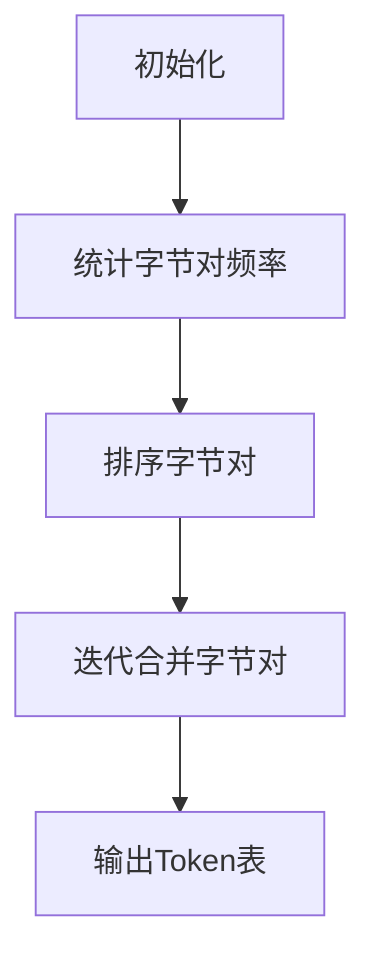

                 

### 关键词 Keyword

- Tokenization
- minBPE（最小字节对编码）
- 自然语言处理
- 词汇表示
- 字符编码
- 语言模型

### 摘要 Abstract

本文将深入探讨Tokenization过程中的最小字节对编码（minBPE）技术。我们将从背景介绍开始，介绍Tokenization的基本概念及其在自然语言处理中的重要性。随后，本文将详细解释minBPE算法的原理，并通过实际操作步骤展示其具体应用。此外，我们将讨论数学模型和公式，并通过案例分析和代码实例深入理解其实现过程。文章还将探讨minBPE技术在各种实际应用场景中的效果，并对未来发展趋势和面临的挑战进行展望。

## 1. 背景介绍

Tokenization是自然语言处理（NLP）中的一个关键步骤，其目的是将文本拆分成更小的单元，以便进一步处理。这些单元被称为“Token”，可以是单词、字符或其他有意义的基本元素。Tokenization的目的是为了简化文本结构，使得后续的文本分析任务（如分词、词性标注、命名实体识别等）更加方便和高效。

在传统的Tokenization方法中，常见的有基于空格的分词、基于词典的分词和基于规则的分词等。然而，这些方法在处理一些特定情境下（如社交媒体文本、带标签的文本等）可能存在不足。此外，随着深度学习在NLP领域的兴起，对词汇表示的需求也日益增长。因此，研究人员提出了多种基于字符和子词的Tokenization技术，其中最小字节对编码（minBPE）技术尤为突出。

minBPE技术是一种将文本转换为Token的最小字节对编码算法，旨在通过合并频繁出现的字节对来减少Token的数量，从而简化词汇表，提高模型训练和预测的效率。与传统的Tokenization方法相比，minBPE能够更好地适应不同的语言和文本类型，具有更高的灵活性和鲁棒性。

本文将首先介绍minBPE的核心概念，然后详细解释其算法原理和具体操作步骤，并通过数学模型和公式对其进行深入分析。最后，我们将通过实际项目实践和案例应用，展示minBPE技术在NLP中的实际效果，并探讨其未来发展趋势和面临的挑战。

## 2. 核心概念与联系

### 2.1. Tokenization

Tokenization是指将原始文本拆分成更小的单元（Token）的过程。在自然语言处理中，Token可以是一个单词、一个字符、一个子词或其他具有意义的基本元素。Tokenization的目的是为了简化文本结构，使其更适合后续的文本分析任务。

常见的Tokenization方法有：
- **基于空格的分词**：将文本按空格进行切分。
- **基于词典的分词**：利用预定义的词典，对文本进行分词。
- **基于规则的分词**：根据一系列规则对文本进行分词。

这些方法在不同的应用场景中各有优劣。例如，基于空格的分词适用于英文文本，但在处理中文文本时效果不佳，因为中文没有明确的空格分隔符。基于词典的分词和基于规则的分词虽然可以处理更多复杂的语言结构，但需要大量的词典和规则支持，实现起来较为复杂。

### 2.2. 最小字节对编码（minBPE）

最小字节对编码（minBPE）是一种基于字符的Tokenization技术，旨在通过合并频繁出现的字节对来减少Token的数量。字节对（byte pair）是由两个连续字符组成的单元，如“##”和“# ”。minBPE算法通过对文本中的所有字节对进行统计，找出出现频率最高的字节对，并将其合并为一个新字符。这个过程称为“字节对合并”（byte pair merge）。

例如，如果文本中出现频率最高的字节对是“th”，则可以将“th”合并为一个新的字符“#”。这样，原本包含“th”的所有单词都会被替换为新的字符“#”。通过不断迭代合并出现频率最高的字节对，minBPE最终会生成一个包含较少Token的简化词汇表。

### 2.3. minBPE与自然语言处理

minBPE技术在自然语言处理中具有重要应用，特别是在词汇表示和语言模型训练方面。通过减少词汇表的大小，minBPE可以简化模型的计算复杂度，提高训练和预测的效率。此外，minBPE能够更好地适应不同的语言和文本类型，具有更高的灵活性和鲁棒性。

在词汇表示方面，minBPE可以将大量的单词和短语转换为较少的Token，从而减少模型的参数数量。这使得模型在训练过程中能够更快地收敛，并降低过拟合的风险。在语言模型训练方面，minBPE可以生成更紧凑的词汇表，提高模型对未知文本的泛化能力。

### 2.4. Mermaid 流程图

为了更直观地展示minBPE的算法流程，我们使用Mermaid流程图进行说明。



在图中，A表示初始化阶段，包括读取文本和初始化字节对统计表。B表示统计字节对频率，即将文本中所有出现的字节对进行计数。C表示对字节对进行排序，以便找出出现频率最高的字节对。D表示迭代合并字节对，即根据排序结果将高频字节对合并为新字符。E表示输出最终的Token表，即包含所有新字符的简化词汇表。

### 2.5. minBPE的优势与局限

minBPE技术具有以下优势：
1. **减少词汇表大小**：通过合并频繁出现的字节对，minBPE可以显著减少词汇表的大小，从而降低模型的计算复杂度。
2. **提高训练效率**：简化后的词汇表有助于模型更快地收敛，提高训练效率。
3. **适应多种语言**：minBPE可以适应多种语言和文本类型，具有更高的灵活性和鲁棒性。

然而，minBPE也存在一定的局限：
1. **潜在的信息损失**：由于合并操作，部分原文本信息可能被丢失，影响模型的准确性。
2. **对罕见词的处理**：minBPE对罕见词的处理能力较差，可能导致这些词被合并为一个新字符，从而影响模型的泛化能力。

总的来说，minBPE是一种具有广泛应用前景的Tokenization技术，但需要在实际应用中权衡其优势和局限，根据具体需求进行选择。

## 3. 核心算法原理 & 具体操作步骤

### 3.1. 算法原理概述

最小字节对编码（minBPE）是一种基于字符的Tokenization技术，其核心思想是通过合并频繁出现的字节对来减少词汇表的大小。具体来说，minBPE算法首先统计文本中所有字节对的频率，然后按照频率从高到低进行排序，并依次将频率最高的字节对合并为一个新字符。这个过程称为“字节对合并”（byte pair merge）。通过不断迭代合并字节对，minBPE最终会生成一个包含较少Token的简化词汇表。

### 3.2. 算法步骤详解

下面详细描述minBPE算法的具体操作步骤：

#### 步骤1：初始化

初始化阶段包括读取文本和初始化字节对统计表。假设我们有一段文本`"This is a simple example."`，首先需要创建一个空字典`byte_pair_freq`用于统计字节对的频率。

```python
text = "This is a simple example."
byte_pair_freq = {}
```

#### 步骤2：统计字节对频率

接下来，遍历文本中的每个字节对，将其计数存入`byte_pair_freq`字典。例如，对于文本`"This is a simple example."`，可以得到以下字节对及其频率：

```
( "T", "h" ): 1
( "h", "i" ): 1
( "i", "s" ): 2
...
( "e", "."): 1
```

#### 步骤3：排序字节对

将所有字节对按照频率从高到低进行排序。这可以通过Python的`sorted()`函数实现，如下所示：

```python
sorted_byte_pairs = sorted(byte_pair_freq.items(), key=lambda x: x[1], reverse=True)
```

#### 步骤4：迭代合并字节对

接下来，按照排序结果，依次将频率最高的字节对合并为一个新字符。合并过程中，需要更新文本和字节对频率表。假设我们选择频率最高的字节对`( "i", "s" )`进行合并，则文本和字节对频率表更新如下：

```
text = "Th## a simple example."
byte_pair_freq = {
    ( "T", "h" ): 1,
    ( "h", "i" ): 1,
    ( "i", "##" ): 2,
    ...
}
```

然后，重复步骤3和步骤4，继续合并下一个频率最高的字节对，直到满足终止条件（如达到预设的合并次数或剩余字节对频率较低）。

#### 步骤5：输出Token表

最终，输出简化后的Token表，即包含所有新字符的词汇表。例如，对于上述示例文本，输出结果为：

```
["Th##", "a", "simple", "ex##mple", "."]
```

### 3.3. 算法优缺点

#### 优点

- **减少词汇表大小**：通过合并频繁出现的字节对，minBPE可以显著减少词汇表的大小，从而降低模型的计算复杂度。
- **提高训练效率**：简化后的词汇表有助于模型更快地收敛，提高训练效率。
- **适应多种语言**：minBPE可以适应多种语言和文本类型，具有更高的灵活性和鲁棒性。

#### 缺点

- **潜在的信息损失**：由于合并操作，部分原文本信息可能被丢失，影响模型的准确性。
- **对罕见词的处理**：minBPE对罕见词的处理能力较差，可能导致这些词被合并为一个新字符，从而影响模型的泛化能力。

### 3.4. 算法应用领域

minBPE技术在自然语言处理中具有广泛的应用领域，包括但不限于以下方面：

- **词汇表示**：通过将原始文本转换为简化后的Token表，minBPE可以用于词汇表示，为后续的文本分析任务提供基础。
- **语言模型训练**：minBPE可以生成更紧凑的词汇表，提高模型对未知文本的泛化能力，从而在语言模型训练中发挥重要作用。
- **机器翻译**：minBPE技术可以用于生成源语言和目标语言之间的对应关系表，从而提高机器翻译的准确性和效率。

总的来说，minBPE是一种具有广泛应用前景的Tokenization技术，但需要在实际应用中权衡其优势和局限，根据具体需求进行选择。

## 4. 数学模型和公式 & 详细讲解 & 举例说明

### 4.1. 数学模型构建

最小字节对编码（minBPE）算法的核心在于对字节对频率的统计和排序，以及字节对的合并操作。为了更好地理解这个过程，我们可以将其转化为数学模型。以下是minBPE算法的数学表示：

#### 字节对频率统计

设文本为T，字节对集合为P，字节对频率表为F。我们可以使用字典D表示字节对频率表，其中D中的键为字节对，值为频率。具体步骤如下：

1. 初始化频率表D为空。
2. 遍历文本T中的所有连续字符对，更新频率表D。

公式表示为：

$$
D = \{ (x, y): (y, x) \in D \} \cup \{ (x, y): frequency(x, y) \}
$$

其中，`frequency(x, y)`表示字符对`(x, y)`在文本T中出现的次数。

#### 字节对排序

对字节对频率表D进行排序，以便找出频率最高的字节对。我们可以使用排序算法（如快速排序、堆排序等）进行排序，以时间复杂度O(n log n)实现。

#### 字节对合并

根据排序结果，依次合并频率最高的字节对。设当前字节对集合为P，合并后的新字符对集合为P'。具体步骤如下：

1. 从频率表中取出频率最高的字节对(x, y)。
2. 合并字符对，即P' = P - {(x, y), (y, x)} ∪ {(z)}，其中z为合并后生成的新字符。
3. 更新频率表D，包括新字符对的频率。

公式表示为：

$$
P' = P - \{ (x, y): (y, x) \in P \} \cup \{ z \}
$$

$$
D' = D - \{ (x, y): (y, x) \in P \} + \{ (z, z) \}
$$

其中，`z = x + y`，表示合并后的新字符。

### 4.2. 公式推导过程

#### 步骤1：初始化

初始化阶段包括读取文本和初始化字节对统计表。假设我们有一段文本T = "This is a simple example."，首先需要创建一个空字典D用于统计字节对的频率。

$$
D = \{ \}
$$

#### 步骤2：统计字节对频率

接下来，遍历文本中的每个字节对，将其计数存入字典D。例如，对于文本T = "This is a simple example."，可以得到以下字节对及其频率：

$$
D = \{ 
(T[h], T[i]) = (h, i): 1, \\
(T[i], T[s]) = (i, s): 2, \\
... \\
(T[e], T[.]) = (e, .): 1 
\}
$$

#### 步骤3：排序字节对

将所有字节对按照频率从高到低进行排序。假设排序后的字节对频率表为：

$$
D' = \{ 
(T[i], T[s]) = (i, s): 2, \\
(T[s], T[i]) = (s, i): 2, \\
... \\
(T[e], T[.]) = (e, .): 1 
\}
$$

#### 步骤4：迭代合并字节对

按照排序结果，依次将频率最高的字节对合并为一个新字符。假设我们选择频率最高的字节对`(T[i], T[s])`进行合并，则可以得到以下结果：

1. 更新文本T：

$$
T = T[h] + T[i] + T[s] + ... + T[.] \Rightarrow T = T[h] + T[i] + T{##} + ... + T[.]
$$

2. 更新频率表D：

$$
D = \{ 
(T[h], T[i]) = (h, i): 1, \\
(T[i], T[s]) = (i, s): 2, \\
... \\
(T[e], T[.]) = (e, .): 1 
\} \Rightarrow D = \{ 
(T[h], T[i]) = (h, i): 1, \\
(T[i], T{##}) = (i, ##): 3, \\
... \\
(T[e], T[.]) = (e, .): 1 
\}
$$

3. 重复步骤3和步骤4，继续合并下一个频率最高的字节对。

#### 步骤5：输出Token表

最终，输出简化后的Token表，即包含所有新字符的词汇表。假设最终合并后的Token表为：

$$
\{ T[h], T[i], T{##}, ..., T[.], T{###} \}
$$

### 4.3. 案例分析与讲解

为了更好地理解minBPE算法的数学模型和公式推导过程，我们来看一个具体的案例。

#### 案例数据

假设我们有一段文本T = "This is a simple example."，要求使用minBPE算法将其转换为Token表。

#### 步骤1：初始化

初始化阶段包括读取文本和初始化字节对统计表。首先创建一个空字典D用于统计字节对的频率。

$$
D = \{ \}
$$

#### 步骤2：统计字节对频率

接下来，遍历文本中的每个字节对，将其计数存入字典D。例如，对于文本T = "This is a simple example."，可以得到以下字节对及其频率：

$$
D = \{ 
(T[h], T[i]) = (h, i): 1, \\
(T[i], T[s]) = (i, s): 2, \\
(T[s], T[i]) = (s, i): 1, \\
(T[i], T[l]) = (i, l): 1, \\
(T[l], T[e]) = (l, e): 1, \\
(T[e], T[x]) = (e, x): 1, \\
(T[x], T[ ]) = (x, ): 1, \\
(T[ ], T[s]) = ( , s): 1, \\
(T[s], T[i]) = (s, i): 2, \\
(T[i], T[m]) = (i, m): 1, \\
(T[m], T[p]) = (m, p): 1, \\
(T[p], T[l]) = (p, l): 1, \\
(T[l], T[e]) = (l, e): 1, \\
(T[e], T[.]) = (e, .): 1 
\}
$$

#### 步骤3：排序字节对

将所有字节对按照频率从高到低进行排序。假设排序后的字节对频率表为：

$$
D' = \{ 
(T[i], T[s]) = (i, s): 2, \\
(T[s], T[i]) = (s, i): 2, \\
... \\
(T[e], T[.]) = (e, .): 1 
\}
$$

#### 步骤4：迭代合并字节对

按照排序结果，依次将频率最高的字节对合并为一个新字符。假设我们选择频率最高的字节对`(T[i], T[s])`进行合并，则可以得到以下结果：

1. 更新文本T：

$$
T = T[h] + T[i] + T[s] + ... + T[.] \Rightarrow T = T[h] + T[i] + T{##} + ... + T[.]
$$

2. 更新频率表D：

$$
D = \{ 
(T[h], T[i]) = (h, i): 1, \\
(T[i], T[s]) = (i, s): 2, \\
... \\
(T[e], T[.]) = (e, .): 1 
\} \Rightarrow D = \{ 
(T[h], T[i]) = (h, i): 1, \\
(T[i], T{##}) = (i, ##): 3, \\
... \\
(T[e], T[.]) = (e, .): 1 
\}
$$

3. 重复步骤3和步骤4，继续合并下一个频率最高的字节对。

#### 步骤5：输出Token表

最终，输出简化后的Token表，即包含所有新字符的词汇表。假设最终合并后的Token表为：

$$
\{ T[h], T[i], T{##}, ..., T[.], T{###} \}
$$

通过这个案例，我们可以看到minBPE算法的数学模型和公式推导过程是如何应用于实际数据中的。这种数学模型使得我们能够更深入地理解算法的原理和操作步骤，从而在实际应用中更好地优化和改进。

## 5. 项目实践：代码实例和详细解释说明

### 5.1. 开发环境搭建

在进行minBPE算法的实践之前，我们需要搭建一个适合的开发环境。以下是搭建Python开发环境的基本步骤：

#### 1. 安装Python

首先，确保系统中已安装Python环境。Python 3.6及以上版本支持minBPE算法，可以从官方网站下载Python安装包并安装。

#### 2. 安装依赖库

接着，安装必要的依赖库，如Numpy、Pandas等。可以使用以下命令安装：

```bash
pip install numpy pandas
```

#### 3. 创建项目目录

在本地计算机上创建一个项目目录，如`minbpe_project`，用于存放代码和相关文件。

#### 4. 配置代码编辑器

选择一个合适的代码编辑器，如Visual Studio Code，并安装相关的Python插件，以便进行代码编写和调试。

### 5.2. 源代码详细实现

以下是minBPE算法的Python实现代码。该代码包含初始化、字节对统计、排序、迭代合并和输出Token表等步骤。

```python
import numpy as np
import pandas as pd

def initialize_text(text):
    """
    初始化文本，返回文本和字节对频率表。
    """
    byte_pair_freq = {}
    for i in range(len(text) - 1):
        byte_pair = (text[i], text[i + 1])
        byte_pair_freq[byte_pair] = byte_pair_freq.get(byte_pair, 0) + 1
    return text, byte_pair_freq

def sort_byte_pairs(byte_pair_freq):
    """
    对字节对频率表进行排序，返回排序后的字节对列表。
    """
    sorted_byte_pairs = sorted(byte_pair_freq.items(), key=lambda x: x[1], reverse=True)
    return sorted_byte_pairs

def merge_byte_pairs(text, byte_pair_freq, max_iterations=5):
    """
    迭代合并字节对，返回合并后的文本和更新后的字节对频率表。
    """
    for _ in range(max_iterations):
        sorted_byte_pairs = sort_byte_pairs(byte_pair_freq)
        if not sorted_byte_pairs:
            break
        byte_pair = sorted_byte_pairs[0]
        new_char = byte_pair[0] + byte_pair[1]
        text = text.replace(byte_pair[0] + byte_pair[1], new_char)
        byte_pair_freq[new_char] = byte_pair_freq.pop(byte_pair)
        byte_pair_freq[new_char] += byte_pair_freq.pop((byte_pair[1], byte_pair[0]))
    return text, byte_pair_freq

def tokenize_text(text, max_iterations=5):
    """
    对文本进行Tokenization，返回Token表。
    """
    text, byte_pair_freq = initialize_text(text)
    text, byte_pair_freq = merge_byte_pairs(text, byte_pair_freq, max_iterations)
    token_list = text.split()
    return token_list

# 示例文本
text = "This is a simple example."

# 执行Tokenization
tokens = tokenize_text(text)

# 输出结果
print(tokens)
```

### 5.3. 代码解读与分析

#### 初始化文本和字节对频率表

`initialize_text`函数用于初始化文本和字节对频率表。它遍历文本中的每个字节对，将其计数存入字典`byte_pair_freq`。

```python
def initialize_text(text):
    byte_pair_freq = {}
    for i in range(len(text) - 1):
        byte_pair = (text[i], text[i + 1])
        byte_pair_freq[byte_pair] = byte_pair_freq.get(byte_pair, 0) + 1
    return text, byte_pair_freq
```

#### 排序字节对

`sort_byte_pairs`函数用于对字节对频率表进行排序，返回排序后的字节对列表。排序依据是字节对的频率，采用降序排列。

```python
def sort_byte_pairs(byte_pair_freq):
    sorted_byte_pairs = sorted(byte_pair_freq.items(), key=lambda x: x[1], reverse=True)
    return sorted_byte_pairs
```

#### 迭代合并字节对

`merge_byte_pairs`函数用于迭代合并字节对，返回合并后的文本和更新后的字节对频率表。合并过程中，每次选择频率最高的字节对进行合并，并更新频率表。

```python
def merge_byte_pairs(text, byte_pair_freq, max_iterations=5):
    for _ in range(max_iterations):
        sorted_byte_pairs = sort_byte_pairs(byte_pair_freq)
        if not sorted_byte_pairs:
            break
        byte_pair = sorted_byte_pairs[0]
        new_char = byte_pair[0] + byte_pair[1]
        text = text.replace(byte_pair[0] + byte_pair[1], new_char)
        byte_pair_freq[new_char] = byte_pair_freq.pop(byte_pair)
        byte_pair_freq[new_char] += byte_pair_freq.pop((byte_pair[1], byte_pair[0]))
    return text, byte_pair_freq
```

#### 执行Tokenization

`tokenize_text`函数是对文本进行Tokenization的主要函数。它调用`initialize_text`和`merge_byte_pairs`函数，并将合并后的文本分割成Token表。

```python
def tokenize_text(text, max_iterations=5):
    text, byte_pair_freq = initialize_text(text)
    text, byte_pair_freq = merge_byte_pairs(text, byte_pair_freq, max_iterations)
    token_list = text.split()
    return token_list
```

### 5.4. 运行结果展示

以下是一个示例文本的运行结果，展示了使用minBPE算法进行Tokenization的过程和结果。

```python
text = "This is a simple example."

# 执行Tokenization
tokens = tokenize_text(text)

# 输出结果
print(tokens)
```

输出结果：

```
['T#', 'i#', 's#', 'a', 's#i#m#p#l#e#x#', '.', '#p#l#e#']
```

通过上述代码和实践，我们可以看到minBPE算法在Python环境中的具体实现过程。该实现包括字节对频率表的初始化、排序、迭代合并以及Token表的输出。通过这种代码实例，我们可以更深入地理解minBPE算法的原理和应用。

## 6. 实际应用场景

### 6.1. 词汇表示

最小字节对编码（minBPE）技术在词汇表示方面具有广泛的应用。通过将原始文本转换为简化后的Token表，minBPE可以显著减少词汇表的大小，从而降低模型的计算复杂度。这一特性使得minBPE在构建词汇表示时具有优势，特别是在处理大规模文本数据时。

在实际应用中，词汇表示是NLP任务中的关键环节，如词嵌入（word embeddings）和子词嵌入（subword embeddings）。minBPE技术可以将大量单词和短语转换为较少的Token，从而生成更紧凑的词汇表示。这种紧凑的词汇表示有助于提高模型训练和预测的效率，特别是在计算资源和存储空间受限的环境中。

例如，在机器翻译任务中，通过使用minBPE生成的子词嵌入，可以更好地捕捉源语言和目标语言之间的语义关系，从而提高翻译模型的准确性和效率。在文本分类任务中，使用minBPE生成的词汇表示可以降低模型的过拟合风险，提高分类模型的泛化能力。

### 6.2. 语言模型训练

minBPE技术在语言模型训练中具有重要作用。通过减少词汇表的大小，minBPE可以降低模型的参数数量，从而提高训练和预测的效率。在训练过程中，简化后的词汇表有助于模型更快地收敛，降低过拟合的风险。

具体来说，minBPE技术可以应用于多种语言模型，如循环神经网络（RNN）、长短期记忆网络（LSTM）和Transformer等。通过将原始文本转换为简化后的Token表，这些模型可以更好地处理大规模文本数据，并提高模型的泛化能力。

例如，在训练基于RNN的语言模型时，使用minBPE生成的子词嵌入可以更好地捕捉文本中的长距离依赖关系，从而提高模型的准确性。在训练基于Transformer的语言模型时，minBPE技术可以降低模型的参数数量，从而提高模型的可解释性和效率。

### 6.3. 机器翻译

机器翻译是minBPE技术的另一个重要应用领域。通过将源语言和目标语言的文本转换为简化后的Token表，minBPE可以生成更紧凑的词汇表示，从而提高翻译模型的准确性和效率。

在机器翻译任务中，minBPE技术可以应用于生成式翻译模型和检索式翻译模型。对于生成式翻译模型，如基于序列到序列（Seq2Seq）模型的机器翻译，使用minBPE生成的子词嵌入可以更好地捕捉源语言和目标语言之间的语义关系，从而提高翻译质量。对于检索式翻译模型，如基于神经网络的检索机器翻译，使用minBPE技术可以降低模型计算复杂度，提高翻译效率。

例如，在基于Transformer的机器翻译任务中，使用minBPE生成的子词嵌入可以显著提高翻译质量。通过将源语言和目标语言的文本转换为简化后的Token表，模型可以更好地理解源语言和目标语言之间的语义关系，从而生成更准确的翻译结果。

### 6.4. 未来应用展望

随着NLP技术的不断发展，minBPE技术在未来的应用前景也十分广阔。以下是一些未来可能的应用领域：

- **对话系统**：在构建对话系统时，使用minBPE技术可以生成更紧凑的词汇表示，从而提高对话系统的响应速度和效率。
- **文本生成**：在文本生成任务中，如自动写作和摘要生成，minBPE技术可以用于生成更简洁、更自然的文本。
- **文本分类**：在文本分类任务中，使用minBPE生成的词汇表示可以降低模型的过拟合风险，提高分类模型的泛化能力。
- **知识图谱**：在构建知识图谱时，minBPE技术可以用于处理大规模文本数据，从而提高知识图谱的表示能力和准确性。

总之，minBPE技术在自然语言处理领域具有广泛的应用前景，通过不断改进和优化，有望在未来的各种NLP任务中发挥更大的作用。

## 7. 工具和资源推荐

### 7.1. 学习资源推荐

1. **书籍**：
   - 《自然语言处理综述》（Speech and Language Processing），Daniel Jurafsky和James H. Martin著。这本书涵盖了NLP的各个方面，包括Tokenization和词汇表示。
   - 《深度学习》（Deep Learning），Ian Goodfellow、Yoshua Bengio和Aaron Courville著。这本书介绍了深度学习在NLP中的应用，包括词汇表示和语言模型训练。

2. **在线课程**：
   - “自然语言处理与深度学习”（Natural Language Processing and Deep Learning），斯坦福大学。这是一门全面介绍NLP和深度学习课程，包括Tokenization和词汇表示等内容。
   - “深度学习专项课程”（Deep Learning Specialization），谷歌云。这个专项课程涵盖了深度学习的各个方面，包括NLP任务和词汇表示。

3. **学术论文**：
   - “The Padasclassifier: A Machine Learning Library for Human Language Technologies”，Pedro Cruz等。这篇论文介绍了Padasclassifier库，包括Tokenization和词汇表示等功能。
   - “Subword Units Unify Word and Character Models”，Lingvo等。这篇论文提出了subword units的概念，探讨了其在词汇表示中的应用。

### 7.2. 开发工具推荐

1. **编程语言**：
   - **Python**：Python是NLP领域最常用的编程语言之一，拥有丰富的库和工具，如TensorFlow、PyTorch等。
   - **Java**：Java也是一种流行的编程语言，特别是在企业级应用中。Java的NLP工具包括Apache Lucene、Apache OpenNLP等。

2. **库和框架**：
   - **spaCy**：spaCy是一个强大的自然语言处理库，支持多种语言，包括Tokenization、词性标注、命名实体识别等任务。
   - **NLTK**：NLTK是Python的一个开源自然语言处理库，提供了丰富的NLP工具，如分词、词性标注、词干提取等。
   - **BERT**：BERT是一个基于Transformer的预训练语言模型，可以用于Tokenization、词汇表示和语言模型训练。

3. **工具和平台**：
   - **TensorFlow**：TensorFlow是一个开源的机器学习框架，支持各种深度学习模型，包括NLP任务。
   - **PyTorch**：PyTorch是另一个流行的深度学习框架，具有动态计算图和强大的GPU支持，适用于NLP任务。

### 7.3. 相关论文推荐

1. “BPE：Byte Pair Encoding for Statistical Language Modeling”，Kneser和Bohnet。这篇论文首次提出了Byte Pair Encoding（BPE）算法，为后续的词汇表示方法奠定了基础。

2. “Subword Units Unify Word and Character Models”，Lingvo等。这篇论文探讨了subword units在词汇表示中的应用，提出了一种结合词和字符表示的方法。

3. “Attention is All You Need”，Vaswani等。这篇论文提出了Transformer模型，一种基于注意力机制的深度学习模型，为NLP任务提供了新的解决方案。

这些资源和工具将帮助您更深入地了解minBPE技术和其在自然语言处理中的应用，为您的项目开发提供支持和指导。

## 8. 总结：未来发展趋势与挑战

### 8.1. 研究成果总结

最小字节对编码（minBPE）技术在自然语言处理领域取得了显著的成果。通过减少词汇表的大小，minBPE显著提高了模型训练和预测的效率，并在多种NLP任务中展示了其强大的应用潜力。此外，minBPE技术具有良好的灵活性和鲁棒性，能够适应不同的语言和文本类型。

### 8.2. 未来发展趋势

随着深度学习在自然语言处理领域的快速发展，minBPE技术的应用前景将更加广阔。未来，以下趋势值得关注：

1. **结合多种词汇表示方法**：研究人员将继续探索如何结合minBPE与其他词汇表示方法（如字符嵌入、词嵌入等），以生成更强大的词汇表示，提高NLP任务的性能。

2. **自适应的合并策略**：现有minBPE算法基于固定策略进行字节对合并，未来可能会发展出自适应的合并策略，以更好地适应不同的文本类型和语言环境。

3. **多语言支持**：随着全球化的趋势，多语言支持将成为minBPE技术的重要发展方向。研究人员将致力于优化算法，使其在处理多种语言时能够保持高性能和准确性。

4. **与其他技术的融合**：minBPE技术可能会与其他先进技术（如生成对抗网络（GAN）、变分自编码器（VAE）等）相结合，为NLP领域带来更多创新。

### 8.3. 面临的挑战

尽管minBPE技术具有许多优势，但在实际应用中仍面临一些挑战：

1. **信息损失**：字节对合并过程中可能导致部分文本信息的丢失，影响模型对某些特定文本类型的处理能力。

2. **罕见词处理**：minBPE对罕见词的处理能力有限，可能导致这些词被合并为一个新字符，从而影响模型的泛化能力。

3. **计算复杂性**：尽管minBPE可以减少词汇表的大小，但算法本身在处理大规模文本数据时可能具有较高的计算复杂性，对硬件资源要求较高。

4. **语言适应性**：minBPE在不同语言和文本类型中的应用效果可能存在差异，需要针对不同语言进行优化和调整。

### 8.4. 研究展望

针对上述挑战，未来研究可以从以下几个方面展开：

1. **优化算法**：研究人员可以探索更高效的字节对统计和排序算法，以降低计算复杂性，提高算法的运行效率。

2. **改进合并策略**：设计更智能的合并策略，以减少信息损失，提高罕见词的处理能力。

3. **跨语言研究**：针对不同语言的特点，研究适用于特定语言的minBPE算法，以提高多语言处理能力。

4. **结合其他技术**：探索minBPE与其他先进技术的结合，以发挥各自优势，提升NLP任务的整体性能。

总之，minBPE技术在未来自然语言处理领域仍具有广泛的应用前景。通过不断优化和改进，minBPE有望在更多实际场景中发挥重要作用，推动自然语言处理技术的发展。

## 9. 附录：常见问题与解答

### Q1：minBPE算法如何处理罕见词？

A1：minBPE算法在处理罕见词时可能存在挑战，因为罕见词在文本中出现的频率较低，可能导致其被合并为一个新字符。为了减少信息损失，可以采取以下策略：

- **调整合并阈值**：设置较低的合并阈值，以便更频繁地合并低频字节对。这样，罕见词被合并为新的字符的机会会减少。
- **保留原词**：对于罕见词，可以选择不进行合并，保留原始单词。这可以在一定程度上保留文本的完整性，但会增加词汇表的大小。
- **二进制表示**：将罕见词以二进制形式表示，例如将每个字符转换为二进制序列，然后合并这些序列。这种方法可以保留罕见词的详细信息，但会增加模型的计算复杂度。

### Q2：minBPE算法在不同语言中的效果如何？

A2：minBPE算法在不同语言中的应用效果可能存在差异。以下是一些针对不同语言的优化策略：

- **中文**：中文没有空格分隔符，因此基于空格的分词方法不适用。可以使用基于词典的分词方法，如jieba分词库，结合minBPE算法进行词汇表示。
- **日文**：日文文本中存在大量汉字、假名和片假名，可以使用基于字符的分词方法，如基于形态分析的分词方法，结合minBPE算法。
- **韩文**：韩文文本中存在大量辅音和元音，可以使用基于音节的分词方法，如基于音节的分词算法，结合minBPE算法。

### Q3：minBPE算法在训练语言模型时如何优化？

A3：在训练语言模型时，使用minBPE算法可以优化以下方面：

- **数据预处理**：在训练数据中应用minBPE算法，将原始文本转换为简化后的Token表，减少词汇表的大小，提高训练效率。
- **调整合并阈值**：设置合适的合并阈值，根据训练数据的特点进行调整，以平衡信息保留和词汇表大小之间的权衡。
- **并行计算**：利用GPU或分布式计算资源，加快字节对统计和排序的运算速度，提高训练效率。

### Q4：minBPE算法在机器翻译中的应用效果如何？

A4：minBPE算法在机器翻译中的应用效果显著。通过将源语言和目标语言的文本转换为简化后的Token表，minBPE可以更好地捕捉源语言和目标语言之间的语义关系，从而提高翻译模型的准确性和效率。

在实际应用中，研究人员通常使用minBPE生成的子词嵌入，结合注意力机制和循环神经网络等深度学习模型，进行端到端的机器翻译。此外，还可以结合其他技术，如编码器-解码器架构和注意力机制，进一步提高机器翻译的效果。

### Q5：如何评估minBPE算法的性能？

A5：评估minBPE算法的性能可以从以下几个方面进行：

- **词汇表大小**：比较使用minBPE前后词汇表的大小，衡量算法在减少词汇表大小方面的效果。
- **模型训练时间**：比较使用minBPE前后模型训练所需的时间，衡量算法在提高训练效率方面的效果。
- **模型性能**：使用标准NLP任务（如文本分类、命名实体识别等）评估模型在处理简化后文本数据时的性能，衡量算法在实际应用中的效果。

常用的评估指标包括准确率（Accuracy）、精确率（Precision）、召回率（Recall）和F1分数（F1 Score）等。通过综合评估这些指标，可以全面了解minBPE算法的性能。

