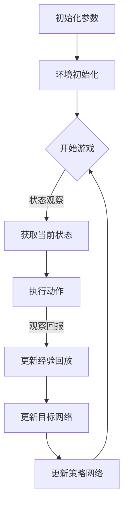

                 

关键词：深度 Q-learning，媒体行业，应用案例，算法优化，资源分配，内容推荐系统

> 摘要：本文旨在探讨深度 Q-learning（DQN）算法在媒体行业的应用，通过分析其在视频推荐、广告投放、内容分发等领域的实践，揭示深度 Q-learning的优势与挑战，并展望其未来发展趋势。

## 1. 背景介绍

随着互联网技术的飞速发展，媒体行业正经历前所未有的变革。从传统媒体向数字媒体的转型，不仅带来了内容形式的多样化，也对内容分发和用户互动提出了更高的要求。在此背景下，算法优化和智能推荐系统成为了媒体行业的热点研究方向。

深度 Q-learning（DQN）算法作为一种基于深度学习的强化学习算法，因其能够在复杂环境中进行自主学习和决策而备受关注。在媒体行业，DQN算法可以被应用于视频推荐、广告投放、内容分发等多个领域，以提高内容分发效率，提升用户体验。

## 2. 核心概念与联系

### 2.1 深度 Q-learning 基本概念

深度 Q-learning（DQN）算法是基于Q-learning算法的一种改进。Q-learning是一种在强化学习中用于寻找最优策略的算法，其核心思想是通过学习状态-动作价值函数来指导决策。

在DQN算法中，Q-value（状态-动作价值）被表示为一个函数，该函数能够预测在给定状态下执行特定动作的预期回报。通过不断更新Q-value，DQN算法能够学习到最优策略，从而在复杂环境中做出最佳决策。

### 2.2 DQN 算法架构

DQN算法的核心组成部分包括：

- **深度神经网络（DNN）**：用于近似状态-动作价值函数。
- **经验回放（Experience Replay）**：用于避免策略偏移。
- **目标网络（Target Network）**：用于稳定梯度下降过程。

### 2.3 Mermaid 流程图

下面是一个简单的 Mermaid 流程图，展示了DQN算法的基本流程：



## 3. 核心算法原理 & 具体操作步骤

### 3.1 算法原理概述

DQN算法通过学习状态-动作价值函数来指导决策，其核心原理如下：

- **状态-动作价值函数**：表示在给定状态下执行特定动作的预期回报。
- **Q-network**：使用深度神经网络来近似状态-动作价值函数。
- **经验回放**：通过存储和随机重放经验来避免策略偏移。
- **目标网络**：用于稳定梯度下降过程，防止梯度消失。

### 3.2 算法步骤详解

DQN算法的具体操作步骤如下：

1. **初始化参数**：包括网络结构、学习率、折扣因子等。
2. **环境初始化**：设置游戏环境，初始化状态。
3. **循环迭代**：
    1. 获取当前状态。
    2. 根据当前状态选择动作。
    3. 执行动作，观察回报。
    4. 存储经验到经验回放池。
    5. 使用目标网络计算目标Q值。
    6. 使用梯度下降更新策略网络。
4. **评估策略**：在训练完成后，评估策略网络的表现。

### 3.3 算法优缺点

**优点**：

- 能够处理高维输入，适用于复杂环境。
- 无需环境模型，适应性强。
- 可以通过经验回放和目标网络稳定学习过程。

**缺点**：

- 可能会出现策略偏移问题。
- 需要大量的训练样本。
- 在某些情况下可能出现Q值爆炸或梯度消失问题。

### 3.4 算法应用领域

DQN算法在以下领域有广泛的应用：

- **游戏**：如Atari游戏、围棋等。
- **机器人**：如无人驾驶、智能家居等。
- **媒体行业**：如视频推荐、广告投放、内容分发等。

## 4. 数学模型和公式 & 详细讲解 & 举例说明

### 4.1 数学模型构建

在DQN算法中，状态-动作价值函数 \(Q(s, a)\) 是通过深度神经网络 \(Q-network\) 近似的。该函数的构建如下：

\[ Q(s, a) = \sum_{i=1}^{n} w_i \cdot f(s_i, a_i) \]

其中，\(w_i\) 是权重，\(f(s_i, a_i)\) 是神经网络的输出。

### 4.2 公式推导过程

DQN算法的目标是最大化总回报，即：

\[ J = \sum_{t=0}^{T} \gamma^t R_t \]

其中，\(\gamma\) 是折扣因子，\(R_t\) 是在第 \(t\) 时刻的回报。

为了最大化 \(J\)，需要优化 \(Q(s, a)\)。通过梯度下降法，可以计算 \(Q-network\) 的梯度：

\[ \nabla_J Q(s, a) = \nabla_J \sum_{t=0}^{T} \gamma^t R_t \]

### 4.3 案例分析与讲解

假设有一个视频推荐系统，用户在观看视频时会给予评分。DQN算法可以用来学习用户的喜好，从而推荐更符合用户口味的视频。

1. **状态表示**：状态可以是一个向量，包含用户的历史行为（如观看过的视频、评分等）。
2. **动作表示**：动作是推荐给用户观看的视频。
3. **回报**：回报是用户对推荐视频的评分。

通过训练，DQN算法可以学会如何根据用户的状态选择最优动作，从而提高推荐质量。

## 5. 项目实践：代码实例和详细解释说明

### 5.1 开发环境搭建

1. 安装 Python 环境。
2. 安装 TensorFlow、Keras 等深度学习库。

### 5.2 源代码详细实现

下面是一个简单的 DQN 算法实现：

```python
import numpy as np
import random
import tensorflow as tf

# 初始化参数
learning_rate = 0.001
discount_factor = 0.99
epsilon = 1.0
epsilon_min = 0.01
epsilon_decay = 0.995
batch_size = 64

# 创建经验回放池
experience_replay = []

# 创建 Q-network
input_layer = tf.keras.layers.Input(shape=(state_size,))
dense = tf.keras.layers.Dense(units=256, activation='relu')(input_layer)
output_layer = tf.keras.layers.Dense(units=action_size, activation=None)(dense)
q_network = tf.keras.Model(inputs=input_layer, outputs=output_layer)

# 创建目标网络
target_q_network = tf.keras.Model(inputs=input_layer, outputs=output_layer)

# 初始化目标网络权重
target_q_network.set_weights(q_network.get_weights())

# 创建优化器
optimizer = tf.keras.optimizers.Adam(learning_rate=learning_rate)

# 定义损失函数
loss_function = tf.keras.losses.MSE

# 训练模型
for episode in range(num_episodes):
    state = env.reset()
    done = False
    total_reward = 0
    
    while not done:
        # 根据 epsilon-greedy 策略选择动作
        if random.uniform(0, 1) < epsilon:
            action = env.action_space.sample()
        else:
            action = np.argmax(q_network.predict(state)[0])
        
        # 执行动作
        next_state, reward, done, _ = env.step(action)
        
        # 更新经验回放池
        experience_replay.append((state, action, reward, next_state, done))
        
        # 从经验回放池中随机采样一批数据
        if len(experience_replay) > batch_size:
            batch = random.sample(experience_replay, batch_size)
            states, actions, rewards, next_states, dones = zip(*batch)
        
        # 计算目标 Q 值
        target_q_values = target_q_network.predict(next_states)
        target_q_values = (1 - done) * discount_factor * target_q_values
        
        # 更新 Q-network 权重
        with tf.GradientTape() as tape:
            q_values = q_network.predict(states)
            q_values = q_values * (1 - done)
            q_values[range(batch_size), actions] = rewards + target_q_values
        
        # 计算梯度
        gradients = tape.gradient(q_values, q_network.trainable_variables)
        
        # 更新权重
        optimizer.apply_gradients(zip(gradients, q_network.trainable_variables))
        
        # 更新目标网络权重
        if episode % target_update_frequency == 0:
            target_q_network.set_weights(q_network.get_weights())
        
        # 更新状态
        state = next_state
        total_reward += reward
    
    # 更新 epsilon
    epsilon = max(epsilon_min, epsilon * epsilon_decay)
    
    print(f"Episode {episode}: Total Reward = {total_reward}")
```

### 5.3 代码解读与分析

- **环境初始化**：创建一个游戏环境，初始化状态。
- **Q-network 与目标网络**：定义 Q-network 和目标网络，用于近似状态-动作价值函数。
- **经验回放池**：用于存储经验，避免策略偏移。
- **epsilon-greedy 策略**：根据 epsilon-greedy 策略选择动作，平衡探索与利用。
- **训练过程**：通过梯度下降法更新 Q-network 权重，并定期更新目标网络权重。

## 6. 实际应用场景

### 6.1 视频推荐

在视频推荐系统中，DQN算法可以用于学习用户的喜好，从而推荐更符合用户口味的视频。

### 6.2 广告投放

在广告投放中，DQN算法可以用于优化广告投放策略，提高广告的点击率。

### 6.3 内容分发

在内容分发中，DQN算法可以用于优化内容分发策略，提高内容分发效率。

## 7. 未来应用展望

随着深度学习技术的不断发展，DQN算法在媒体行业的应用前景十分广阔。未来，我们可以期待 DQN 算法在更多领域的应用，如智能客服、智能问答、虚拟现实等。

## 8. 总结：未来发展趋势与挑战

### 8.1 研究成果总结

本文通过分析 DQN 算法在媒体行业的应用，总结了其优势与挑战，并展望了其未来发展趋势。

### 8.2 未来发展趋势

随着深度学习技术的不断发展，DQN 算法在媒体行业的应用前景十分广阔。未来，我们可以期待 DQN 算法在更多领域的应用，如智能客服、智能问答、虚拟现实等。

### 8.3 面临的挑战

DQN 算法在媒体行业应用中面临的挑战主要包括：

- **数据隐私保护**：在推荐系统中，用户数据的安全和隐私保护是一个重要问题。
- **算法可解释性**：深度学习算法的黑盒特性使得其可解释性较差，这对于应用场景中的决策过程提出了挑战。
- **计算资源消耗**：深度学习算法的训练过程需要大量的计算资源，这对硬件设备提出了较高的要求。

### 8.4 研究展望

为了应对上述挑战，未来的研究可以从以下几个方面展开：

- **隐私保护算法**：研究如何在保障用户隐私的前提下进行数据分析和推荐。
- **可解释性算法**：研究如何提高深度学习算法的可解释性，使其更易于理解和应用。
- **高效算法**：研究如何降低深度学习算法的计算资源消耗，提高训练效率。

## 9. 附录：常见问题与解答

### 9.1 什么是深度 Q-learning？

深度 Q-learning（DQN）是一种基于深度学习的强化学习算法，用于在复杂环境中学习最优策略。

### 9.2 DQN 算法的核心组成部分是什么？

DQN算法的核心组成部分包括深度神经网络（DNN）、经验回放池、目标网络等。

### 9.3 DQN 算法有哪些优缺点？

DQN算法的优点包括处理高维输入、无需环境模型、适应性强等；缺点包括策略偏移、需要大量训练样本、可能出现 Q 值爆炸或梯度消失问题等。

### 9.4 DQN 算法在媒体行业有哪些应用？

DQN算法在媒体行业的应用包括视频推荐、广告投放、内容分发等。

----------------------------------------------------------------

本文由禅与计算机程序设计艺术（Zen and the Art of Computer Programming）撰写，旨在探讨深度 Q-learning（DQN）算法在媒体行业的应用，包括视频推荐、广告投放、内容分发等领域。通过分析其优势与挑战，展望其未来发展趋势，本文为相关领域的研究和应用提供了有价值的参考。

作者：禅与计算机程序设计艺术（Zen and the Art of Computer Programming）

