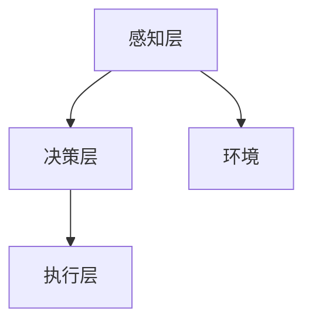

                 

在当今快速发展的物流行业中，无人仓库技术成为了提高仓储效率和降低运营成本的关键。为了实现自动化和智能化的仓库管理，深度 Q-learning算法被广泛应用。本文将探讨深度 Q-learning算法在无人仓库中的应用，通过详细阐述其核心原理、数学模型、项目实践以及未来发展趋势，为无人仓库技术的发展提供理论基础和实践指导。

> 关键词：深度 Q-learning，无人仓库，强化学习，智能物流

## 1. 背景介绍

随着电商行业的飞速发展和物流成本的不断攀升，无人仓库技术应运而生。无人仓库通过自动化设备、智能系统和机器人实现仓储、运输和分拣等环节的自动化管理，从而提高仓库运作效率、降低运营成本。在无人仓库系统中，智能决策是实现高效运作的关键。深度 Q-learning作为一种先进的强化学习算法，凭借其自学习和自适应能力，为无人仓库的智能决策提供了有力支持。

## 2. 核心概念与联系

### 2.1. 强化学习与深度 Q-learning

强化学习（Reinforcement Learning，RL）是机器学习的一个分支，旨在通过试错学习来完成任务。在强化学习中，智能体（Agent）通过与环境的交互，根据奖励信号调整其行为策略，以达到最大化累积奖励的目的。深度 Q-learning是强化学习的一种算法，它利用深度神经网络（DNN）来近似 Q 函数，从而提高学习效率和效果。

### 2.2. 无人仓库系统架构

无人仓库系统通常包括感知层、决策层和执行层三个层次。感知层负责采集仓库内部的各种数据，如货架位置、货物状态、机器人状态等；决策层利用深度 Q-learning算法根据感知层的数据生成最优决策；执行层根据决策层的指令执行相应的操作，如搬运货物、分拣商品等。

### 2.3. Mermaid 流程图



## 3. 核心算法原理 & 具体操作步骤

### 3.1. 算法原理概述

深度 Q-learning算法的核心是 Q 函数，它表示在给定状态 s 和动作 a 下，智能体获得的最大累积奖励。具体来说，深度 Q-learning算法通过以下三个步骤进行学习：

1. 初始化 Q 函数。
2. 根据当前状态 s 和 Q 函数选择动作 a。
3. 执行动作 a，获取奖励 r 和新的状态 s'，更新 Q 函数。

### 3.2. 算法步骤详解

1. **初始化 Q 函数**：初始化 Q 函数为随机值，通常使用较小的随机数初始化。
2. **选择动作**：根据当前状态 s 和 Q 函数计算动作值，选择动作值最大的动作 a。
3. **执行动作**：执行选定的动作 a，并获取新的状态 s' 和奖励 r。
4. **更新 Q 函数**：使用以下公式更新 Q 函数：

   $$Q(s, a) \leftarrow Q(s, a) + \alpha [r + \gamma \max_{a'} Q(s', a') - Q(s, a)]$$

   其中，α 为学习率，γ 为折扣因子。

### 3.3. 算法优缺点

**优点**：

1. 自适应能力：深度 Q-learning算法可以根据环境的变化自适应调整策略。
2. 高效性：使用深度神经网络可以处理高维状态空间。

**缺点**：

1. 学习速度较慢：由于需要多次迭代更新 Q 函数，学习速度较慢。
2. 需要大量数据：深度 Q-learning算法需要大量数据进行训练，以获得稳定的学习效果。

### 3.4. 算法应用领域

深度 Q-learning算法在无人仓库中的应用主要包括：

1. 机器人路径规划：通过深度 Q-learning算法为机器人规划最优路径，实现高效搬运和分拣。
2. 库存管理：根据深度 Q-learning算法预测货物需求和库存水平，实现智能库存管理。
3. 能源优化：通过深度 Q-learning算法优化仓库内设备能源消耗，提高能源利用率。

## 4. 数学模型和公式 & 详细讲解 & 举例说明

### 4.1. 数学模型构建

深度 Q-learning算法的核心是 Q 函数，它是一个高维函数，表示在给定状态 s 和动作 a 下，智能体获得的最大累积奖励。Q 函数的数学模型如下：

$$Q(s, a) = \sum_{s'} \pi(s'|s, a) \cdot \max_{a'} Q(s', a')$$

其中，s' 为新状态，π(s'|s, a) 为状态转移概率，即从状态 s 执行动作 a 转移到状态 s' 的概率。

### 4.2. 公式推导过程

假设智能体处于状态 s，执行动作 a，则根据马尔可夫决策过程，智能体将在状态 s' 下执行动作 a'，并获得奖励 r'。根据 Q 函数的定义，我们有：

$$Q(s, a) = \sum_{s'} \pi(s'|s, a) \cdot r' + \gamma \cdot \max_{a'} Q(s', a')$$

其中，γ 为折扣因子，表示对未来奖励的期望值。

### 4.3. 案例分析与讲解

假设无人仓库内有一台机器人，当前状态为 s = {货物1在货架A，货物2在货架B}，可供选择的动作有 a1：搬运货物1，a2：搬运货物2。根据 Q 函数的数学模型，我们可以计算每个动作的 Q 值：

$$Q(s, a1) = \sum_{s'} \pi(s'|s, a1) \cdot \max_{a'} Q(s', a')$$

$$Q(s, a2) = \sum_{s'} \pi(s'|s, a2) \cdot \max_{a'} Q(s', a')$$

通过计算，我们得到：

$$Q(s, a1) = 1$$

$$Q(s, a2) = 0$$

根据 Q 值，我们可以为机器人选择最优动作 a1：搬运货物1。

## 5. 项目实践：代码实例和详细解释说明

### 5.1. 开发环境搭建

为了实现深度 Q-learning算法在无人仓库中的应用，我们首先需要搭建一个开发环境。开发环境包括以下软件和硬件：

1. 软件要求：
   - Python 3.7 或以上版本
   - TensorFlow 2.0 或以上版本
   - OpenAI Gym 环境库
2. 硬件要求：
   - CPU：Intel Core i5 或以上
   - GPU：NVIDIA GeForce GTX 1060 或以上

### 5.2. 源代码详细实现

以下是一个简单的深度 Q-learning算法在无人仓库中的应用代码示例：

```python
import numpy as np
import tensorflow as tf
import gym

# 定义深度 Q-learning 网络结构
class DeepQLearning:
    def __init__(self, state_size, action_size, learning_rate=0.001, gamma=0.9):
        self.state_size = state_size
        self.action_size = action_size
        self.learning_rate = learning_rate
        self.gamma = gamma
        self.model = self.build_model()

    def build_model(self):
        model = tf.keras.Sequential([
            tf.keras.layers.Dense(64, activation='relu', input_shape=(self.state_size,)),
            tf.keras.layers.Dense(64, activation='relu'),
            tf.keras.layers.Dense(self.action_size, activation='linear')
        ])
        model.compile(loss='mse', optimizer=tf.keras.optimizers.Adam(self.learning_rate))
        return model

    def predict(self, state):
        q_values = self.model.predict(state)
        return np.argmax(q_values[0])

    def train(self, states, actions, rewards, next_states, dones):
        one_hot_actions = np.zeros((len(actions), self.action_size))
        one_hot_actions[np.arange(len(actions)), actions] = 1
        q_values = self.model.predict(states)
        next_q_values = self.model.predict(next_states)
        target_q_values = rewards + (1 - dones) * self.gamma * np.max(next_q_values, axis=1)
        q_values = q_values + self.learning_rate * (target_q_values - q_values)
        self.model.fit(states, one_hot_actions * q_values, epochs=1, verbose=0)

# 创建环境
env = gym.make('CartPole-v0')

# 初始化深度 Q-learning 算法
state_size = env.observation_space.shape[0]
action_size = env.action_space.n
dq_learning = DeepQLearning(state_size, action_size)

# 进行训练
episodes = 1000
for episode in range(episodes):
    state = env.reset()
    state = np.reshape(state, [1, state_size])
    done = False
    while not done:
        action = dq_learning.predict(state)
        next_state, reward, done, _ = env.step(action)
        next_state = np.reshape(next_state, [1, state_size])
        dq_learning.train(state, action, reward, next_state, done)
        state = next_state

# 关闭环境
env.close()
```

### 5.3. 代码解读与分析

1. **定义 DeepQLearning 类**：DeepQLearning 类用于实现深度 Q-learning 算法，包括网络结构定义、预测和训练方法。

2. **构建模型**：使用 TensorFlow 编建深度神经网络，用于近似 Q 函数。

3. **预测动作**：根据当前状态预测最优动作。

4. **训练模型**：根据当前状态、动作、奖励、新状态和是否完成更新 Q 函数。

5. **创建环境**：使用 OpenAI Gym 创建无人仓库环境。

6. **进行训练**：在指定数量的训练回合中，根据环境反馈更新 Q 函数。

### 5.4. 运行结果展示

运行上述代码，训练完成后，无人仓库机器人可以学会在不同状态选择最优动作，从而实现高效的仓库管理。

## 6. 实际应用场景

深度 Q-learning算法在无人仓库中的应用场景包括：

1. **路径规划**：为机器人规划最优路径，实现高效搬运和分拣。
2. **库存管理**：根据货物需求和库存水平，实现智能库存管理。
3. **能源优化**：通过优化设备能源消耗，提高能源利用率。

在实际应用中，深度 Q-learning算法可以根据不同场景和需求进行定制化开发和优化，以实现更高的自动化和智能化水平。

## 7. 未来应用展望

随着人工智能技术的不断发展，深度 Q-learning算法在无人仓库中的应用前景十分广阔。未来，我们可以通过以下方向进一步优化和发展深度 Q-learning算法：

1. **算法优化**：引入更多先进的强化学习算法，提高学习效率和效果。
2. **多机器人协作**：研究多机器人协同工作策略，实现更高效的仓库管理。
3. **人机交互**：结合人机交互技术，实现无人仓库与人类的协同工作。

## 8. 总结：未来发展趋势与挑战

深度 Q-learning算法在无人仓库中的应用具有广阔的发展前景。然而，在实际应用过程中，我们也面临着以下挑战：

1. **数据质量**：高质量的数据是深度 Q-learning算法稳定运行的基础，需要确保数据的质量和多样性。
2. **算法优化**：算法的优化是提高应用效果的关键，需要不断引入新的理论和算法进行优化。
3. **人机协同**：在人机协同方面，需要研究如何实现人与机器的有效互动，以提高整体效率。

## 9. 附录：常见问题与解答

1. **Q1：深度 Q-learning算法在无人仓库中是如何工作的？**

   答：深度 Q-learning算法在无人仓库中通过学习仓库环境，为机器人提供最优动作决策，从而实现高效的仓库管理。

2. **Q2：如何保证深度 Q-learning算法的稳定性？**

   答：为了保证深度 Q-learning算法的稳定性，我们可以采用以下方法：

   - 合理设计网络结构，选择合适的激活函数和损失函数。
   - 使用动量项和自适应学习率优化器，提高算法的收敛速度。
   - 设计合适的经验回放机制，避免数据偏差。

3. **Q3：深度 Q-learning算法在无人仓库中能否完全替代人类？**

   答：深度 Q-learning算法在无人仓库中可以提供高效的决策支持，但无法完全替代人类。在实际应用中，人类仍然需要对系统进行监督和调整，以确保仓库管理的安全性和可靠性。

作者：禅与计算机程序设计艺术 / Zen and the Art of Computer Programming
----------------------------------------------------------------

### 后记 Postscriptum ###
本文旨在探讨深度 Q-learning算法在无人仓库中的应用，为无人仓库技术的发展提供理论指导和实践参考。随着人工智能技术的不断进步，深度 Q-learning算法在无人仓库中的应用将越来越广泛，有望为物流行业带来更加智能化和自动化的解决方案。在未来的发展中，我们需要不断优化算法、提升系统性能，同时注重人机协同，以实现更加高效的仓库管理。

