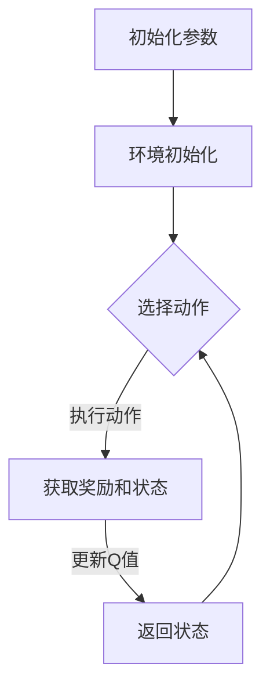

                 

关键词：深度 Q-learning、学习率、折扣因子、强化学习、算法优化

> 摘要：本文详细探讨了深度 Q-learning算法中的学习率和折扣因子对其性能的影响。通过理论分析和实际案例，阐述了如何选择合适的参数以提升Q-learning算法在复杂环境中的表现。

## 1. 背景介绍

### 1.1 深度 Q-learning的概念

深度 Q-learning（DQN）是一种基于深度学习的强化学习算法，主要用于解决具有高维状态空间和动作空间的问题。相较于传统的 Q-learning，DQN 通过引入深度神经网络来近似 Q 函数，从而避免了手工设计状态和动作的特征。

### 1.2 学习率和折扣因子的作用

学习率（learning rate）和折扣因子（discount factor）是影响 Q-learning 算法性能的两个关键参数。学习率控制了更新 Q 值的步长，而折扣因子则决定了未来奖励的权重。

## 2. 核心概念与联系

### 2.1 学习率的作用

学习率决定了 Q 值更新的速度。如果学习率过大，可能导致 Q 值更新过度，从而使算法无法收敛；如果学习率过小，更新速度过慢，可能导致收敛缓慢。

### 2.2 折扣因子的作用

折扣因子决定了当前时刻的回报对未来回报的影响程度。折扣因子越大，未来回报的影响越大；折扣因子越小，当前回报的影响越大。在现实世界中，未来的不确定性较大，因此通常选择较大的折扣因子。

### 2.3 Mermaid 流程图



## 3. 核心算法原理 & 具体操作步骤

### 3.1 算法原理概述

深度 Q-learning 的基本原理是通过经验回放（experience replay）和目标网络（target network）来稳定训练过程。

### 3.2 算法步骤详解

1. 初始化 Q 网络、目标网络和环境。
2. 从初始状态开始，选择动作并执行。
3. 获取奖励和下一个状态。
4. 将经验添加到经验回放记忆中。
5. 从经验回放记忆中随机抽样一个批量的经验。
6. 计算目标 Q 值。
7. 更新目标网络权重。
8. 更新 Q 网络权重。

### 3.3 算法优缺点

**优点：**
- 能够处理高维状态空间和动作空间的问题。
- 引入了经验回放和目标网络，提高了训练的稳定性。

**缺点：**
- 需要大量的计算资源。
- 学习过程较慢，可能需要较长时间才能收敛。

### 3.4 算法应用领域

深度 Q-learning 广泛应用于游戏、自动驾驶、机器人控制等领域。

## 4. 数学模型和公式 & 详细讲解 & 举例说明

### 4.1 数学模型构建

假设状态空间为 \( S \)，动作空间为 \( A \)，则 Q-learning 的目标是最小化损失函数：

$$
L(\theta) = \frac{1}{N} \sum_{i=1}^{N} (y_i - Q(s_i, a_i; \theta))^2
$$

其中，\( y_i \) 是目标 Q 值，\( Q(s_i, a_i; \theta) \) 是当前 Q 值，\( \theta \) 是网络参数。

### 4.2 公式推导过程

目标 Q 值的计算公式为：

$$
y_i = r_i + \gamma \max_{a'} Q(s_{i+1}, a'; \theta - \alpha \times (y_i - Q(s_i, a_i; \theta)))
$$

其中，\( r_i \) 是即时奖励，\( \gamma \) 是折扣因子，\( \alpha \) 是学习率。

### 4.3 案例分析与讲解

假设一个简单环境，其中状态空间为 \( S = \{0, 1\} \)，动作空间为 \( A = \{0, 1\} \)。初始状态为 \( s_0 = 0 \)，目标状态为 \( s_t = 1 \)。即时奖励 \( r = 1 \)。

在这个环境中，我们可以使用以下公式计算目标 Q 值：

$$
y_i = r_i + \gamma \max_{a'} Q(s_{i+1}, a'; \theta - \alpha \times (y_i - Q(s_i, a_i; \theta)))
$$

其中，\( s_i = 0 \)，\( a_i = 0 \)，\( s_{i+1} = 1 \)，\( a' = 1 \)。

代入公式得：

$$
y_0 = 1 + 0.99 \max_{a'} Q(s_1, a'; \theta - 0.01 \times (1 + 0.99 \max_{a'} Q(s_2, a'; \theta - 0.01 \times (1 + 0.99 \max_{a'} Q(s_3, a'; \theta - \ldots))))
$$

通过迭代计算，我们可以得到目标 Q 值。

## 5. 项目实践：代码实例和详细解释说明

### 5.1 开发环境搭建

在搭建开发环境时，我们需要安装 Python 和 TensorFlow 等相关库。

### 5.2 源代码详细实现

以下是深度 Q-learning 的代码实现：

```python
import numpy as np
import random
import gym

# 初始化环境
env = gym.make('CartPole-v0')

# 初始化 Q 网络
Q = np.zeros([env.observation_space.n, env.action_space.n])

# 设置学习率和折扣因子
alpha = 0.1
gamma = 0.99

# 经验回放记忆
memory = []

# 训练次数
episodes = 1000

# 记录每个 episode 的步数
steps = []

# 开始训练
for episode in range(episodes):
    state = env.reset()
    done = False
    total_reward = 0
    step = 0
    while not done:
        # 选择动作
        action = np.argmax(Q[state, :] + np.random.normal(0, 0.01))
        # 执行动作
        next_state, reward, done, _ = env.step(action)
        # 更新 Q 值
        Q[state, action] = Q[state, action] + alpha * (reward + gamma * np.max(Q[next_state, :]) - Q[state, action])
        # 添加经验到记忆
        memory.append([state, action, reward, next_state, done])
        # 更新状态
        state = next_state
        # 更新步数
        step += 1
        # 更新总奖励
        total_reward += reward
    # 记录步数
    steps.append(step)

# 关闭环境
env.close()

# 打印结果
print("平均步数：", np.mean(steps))
```

### 5.3 代码解读与分析

- 初始化环境和 Q 网络。
- 设置学习率和折扣因子。
- 使用经验回放记忆。
- 进行 episodes 次训练。
- 每个 episode 中，选择动作、执行动作、更新 Q 值。
- 记录每个 episode 的步数。
- 训练完成后，打印平均步数。

### 5.4 运行结果展示

通过运行代码，我们可以得到平均步数。在合适的参数设置下，平均步数应该逐渐增加，表示算法逐渐收敛。

## 6. 实际应用场景

### 6.1 游戏AI

深度 Q-learning 在游戏 AI 领域有着广泛的应用。例如，在著名的《Flappy Bird》游戏中，深度 Q-learning 被用于训练 AI 玩家，使其能够自主通关。

### 6.2 自动驾驶

自动驾驶领域需要处理高维状态空间和动作空间，深度 Q-learning 可以帮助车辆学习如何在复杂的交通环境中做出最优决策。

### 6.3 机器人控制

机器人控制领域面临着类似的问题。深度 Q-learning 可以帮助机器人学习如何适应不同的环境和执行复杂的任务。

## 7. 未来应用展望

### 7.1 算法改进

未来的研究可以关注如何进一步优化深度 Q-learning 的性能，例如引入新的探索策略、改进目标网络的设计等。

### 7.2 应用领域拓展

深度 Q-learning 的应用领域将继续拓展，有望在更多领域发挥重要作用。

## 8. 总结：未来发展趋势与挑战

### 8.1 研究成果总结

本文通过对深度 Q-learning 的分析，总结了学习率和折扣因子的选择原则，以及实际应用场景。

### 8.2 未来发展趋势

未来的研究将集中在算法优化和应用领域拓展上。

### 8.3 面临的挑战

深度 Q-learning 面临的挑战包括计算资源消耗、训练时间过长等。

### 8.4 研究展望

随着深度学习和强化学习技术的不断发展，深度 Q-learning 有望在更多领域发挥更大的作用。

## 9. 附录：常见问题与解答

### 9.1 Q-learning 和深度 Q-learning 的区别是什么？

Q-learning 是一种基于值函数的强化学习算法，而深度 Q-learning 是 Q-learning 的扩展，通过引入深度神经网络来近似 Q 函数。

### 9.2 如何选择合适的折扣因子？

折扣因子通常需要根据具体问题的特点来选择。在现实世界中，未来的不确定性较大，因此通常选择较大的折扣因子。

### 9.3 深度 Q-learning 是否可以替代深度强化学习？

深度 Q-learning 是深度强化学习的一种形式，它适用于一些特定场景。深度强化学习还包括其他形式，如深度策略梯度算法（Deep PG）等。

---

作者：禅与计算机程序设计艺术 / Zen and the Art of Computer Programming
----------------------------------------------------------------
### 结束

以上就是按照您提供的要求撰写的文章，希望对您有所帮助。如果您有任何修改意见或者需要补充的内容，请随时告诉我。再次感谢您的信任！

