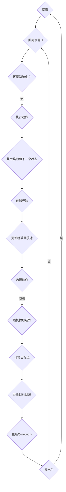

                 

 在深度学习的领域中，深度 Q-learning（DQN）作为一种强化学习算法，以其强大的学习能力在多个领域得到了广泛应用。本文将深入探讨深度 Q-learning 算法在状态-动作对选择过程中的核心机制。

## 关键词
- 深度 Q-learning
- 强化学习
- 状态-动作对
- 神经网络
- 经验回放

## 摘要
本文将首先介绍强化学习的基本概念和深度 Q-learning 的背景。随后，我们将详细解释深度 Q-learning 的核心概念，包括 Q-network、经验回放和目标网络。接着，我们将讨论深度 Q-learning 的算法原理和操作步骤，并分析其优缺点和适用领域。文章的最后部分将介绍数学模型、公式推导、案例分析和代码实例，以帮助读者更好地理解这一算法。

---

## 1. 背景介绍

强化学习作为机器学习的一个分支，旨在通过奖励机制和试错过程使智能体（agent）学会在环境中做出最优决策。与传统机器学习方法不同，强化学习更加注重智能体与环境之间的交互过程。强化学习的关键挑战在于如何设计智能体，使其能够从环境中获取经验并逐步改善其策略。

深度 Q-learning 是强化学习中的一个重要算法，它结合了深度学习和强化学习的优势，使得智能体能够通过学习状态-动作值函数（Q-value function）来选择最佳动作。深度 Q-learning 的出现，解决了传统 Q-learning 在状态空间过大的问题，使得强化学习在复杂环境中的应用成为可能。

### 1.1 强化学习的基本概念

强化学习的基本概念包括：

- **智能体（Agent）**：执行动作并接受环境反馈的实体。
- **环境（Environment）**：智能体所处的情境。
- **状态（State）**：描述环境当前状态的变量。
- **动作（Action）**：智能体可以执行的动作。
- **奖励（Reward）**：智能体执行动作后获得的即时反馈。
- **策略（Policy）**：智能体选择动作的策略。

### 1.2 深度 Q-learning 的背景

传统的 Q-learning 算法使用 Q-table 来存储状态-动作值，但这种方法在状态空间非常大时面临巨大挑战。为了解决这个问题，深度 Q-learning 引入了深度神经网络（DNN），使得智能体可以通过学习状态-动作值函数来选择动作，而不需要显式地存储 Q-table。

### 1.3 强化学习的应用领域

强化学习在以下领域有着广泛的应用：

- **游戏**：例如，AlphaGo 在围棋比赛中的胜利。
- **机器人**：例如，自主导航和抓取。
- **推荐系统**：例如，个性化推荐和广告投放。
- **自动驾驶**：例如，自动驾驶汽车的行为决策。

---

在接下来的章节中，我们将详细探讨深度 Q-learning 的核心概念和算法原理，以便更好地理解这一强大的强化学习算法。

---

## 2. 核心概念与联系

### 2.1 核心概念

为了理解深度 Q-learning 的核心概念，我们需要首先了解以下几个关键组成部分：

#### 2.1.1 Q-network

Q-network 是深度 Q-learning 的核心，它是一个深度神经网络，用于估计给定状态下的最佳动作值。Q-network 的输出是一个动作值数组，其中每个元素表示在当前状态下执行相应动作的预期回报。

#### 2.1.2 经验回放

经验回放（Experience Replay）是为了解决 Q-learning 的样本相关性问题而引入的。通过将智能体在环境中获得的经验进行随机采样和回放，可以减少样本相关性，提高学习稳定性。

#### 2.1.3 目标网络

目标网络（Target Network）是一个与 Q-network 结构相同的网络，用于生成目标值（Target Value）。目标网络的更新频率低于 Q-network 的更新频率，这样可以稳定 Q-learning 的训练过程。

### 2.2 Mermaid 流程图

下面是一个描述深度 Q-learning 核心概念的 Mermaid 流程图：



### 2.3 核心概念的联系

Q-network、经验回放和目标网络是深度 Q-learning 算法中的关键组成部分，它们相互协作，共同实现了智能体在复杂环境中的最优决策。具体来说：

- Q-network 负责估计状态-动作值，从而指导智能体选择最佳动作。
- 经验回放 通过随机抽样和回放经验，减少了样本相关性，提高了算法的泛化能力。
- 目标网络 通过稳定训练过程，保证了 Q-network 的更新不会过于频繁，从而避免了过拟合。

通过这些核心概念的联系，深度 Q-learning 能够在学习过程中不断优化智能体的策略，使其在复杂环境中实现最优决策。

---

在下一部分，我们将详细探讨深度 Q-learning 的算法原理和具体操作步骤。

---

## 3. 核心算法原理 & 具体操作步骤

### 3.1 算法原理概述

深度 Q-learning（DQN）算法的核心思想是学习一个状态-动作值函数 Q(s, a)，该函数能够预测在给定状态下执行特定动作的长期回报。具体来说，DQN 通过以下步骤实现：

1. 初始化 Q-network 和目标网络。
2. 在环境中执行动作，获取状态转移和奖励。
3. 将经验（状态、动作、奖励、下一个状态）存储在经验回放池中。
4. 随机从经验回放池中抽取一批经验。
5. 使用这些经验更新目标网络。
6. 使用目标网络更新 Q-network。

### 3.2 算法步骤详解

#### 3.2.1 初始化参数

在开始训练之前，需要初始化以下几个关键参数：

- 初始化 Q-network 和目标网络：这两个网络具有相同的结构，通常由多层感知器（MLP）构成。
- 初始化经验回放池：经验回放池是一个固定大小的队列，用于存储智能体在环境中获取的经验。
- 初始化网络权重：可以使用随机初始化或者预训练的方式初始化网络权重。

#### 3.2.2 状态转移和动作选择

在训练过程中，智能体首先需要选择一个状态，并使用 Q-network 预测在该状态下每个动作的值。智能体可以选择贪婪策略（选择当前状态下值最高的动作）或者随机策略（随机选择一个动作）。在实际应用中，通常会在开始训练时采用随机策略，并在训练过程中逐渐转向贪婪策略。

#### 3.2.3 经验回放

在执行动作并获取新的状态和奖励后，将这些经验（当前状态、执行的动作、获得的奖励和下一个状态）存储在经验回放池中。在每次更新 Q-network 时，从经验回放池中随机抽取一批经验，以减少样本相关性和过拟合。

#### 3.2.4 计算目标值

对于每批抽取的经验，计算其目标值（Target Value）。目标值的计算公式为：

$$
\text{Target Value} = r + \gamma \max_a Q(\text{Next State}, a)
$$

其中，r 是获得的奖励，\gamma 是折扣因子，表示未来奖励的重要性。

#### 3.2.5 更新目标网络

目标网络的更新频率通常低于 Q-network，以确保训练过程的稳定性。每次更新目标网络时，将 Q-network 的权重复制到目标网络中。

#### 3.2.6 更新 Q-network

使用梯度下降法更新 Q-network 的权重，以最小化损失函数。损失函数通常定义为：

$$
\text{Loss} = (Q(s, a) - \text{Target Value})^2
$$

通过反复迭代以上步骤，智能体逐渐学习到最优策略。

### 3.3 算法优缺点

#### 优点

- **高效性**：通过使用深度神经网络，DQN 可以处理高维状态空间。
- **灵活性**：经验回放和目标网络的设计使得 DQN 能够应对样本相关性和过拟合问题。
- **适用性**：DQN 在多种强化学习应用中表现出了良好的性能。

#### 缺点

- **收敛速度慢**：DQN 的训练过程可能非常缓慢，特别是对于复杂环境。
- **奖励工程**：在许多实际应用中，设计合适的奖励函数是一个挑战。
- **计算资源消耗**：由于需要存储大量的经验数据，DQN 在计算资源消耗方面可能较高。

### 3.4 算法应用领域

DQN 在多个领域有着广泛的应用，包括但不限于：

- **游戏**：例如，DQN 在电子游戏中的表现超过了人类玩家。
- **机器人**：例如，DQN 在机器人路径规划中的应用。
- **自动驾驶**：例如，DQN 在自动驾驶汽车的行为决策中扮演重要角色。

---

在下一部分，我们将深入探讨深度 Q-learning 的数学模型和公式，并通过具体例子进行讲解。

---

## 4. 数学模型和公式 & 详细讲解 & 举例说明

### 4.1 数学模型构建

深度 Q-learning 的数学模型主要包括以下几个部分：

#### 4.1.1 状态-动作值函数

状态-动作值函数 \( Q(s, a) \) 是 DQN 的核心。它表示在给定状态 \( s \) 下执行动作 \( a \) 所能获得的预期回报。

#### 4.1.2 Q-network 和目标网络

Q-network 和目标网络都是深度神经网络，它们分别用于预测状态-动作值和生成目标值。

#### 4.1.3 经验回放池

经验回放池是一个固定大小的队列，用于存储智能体在环境中获取的经验。

### 4.2 公式推导过程

#### 4.2.1 状态-动作值函数

状态-动作值函数可以通过以下公式进行推导：

$$
Q(s, a) = \sum_{s'} P(s' | s, a) \cdot R(s', a) + \gamma \cdot \max_{a'} Q(s', a')
$$

其中，\( P(s' | s, a) \) 表示在状态 \( s \) 下执行动作 \( a \) 后到达状态 \( s' \) 的概率，\( R(s', a) \) 表示在状态 \( s' \) 下执行动作 \( a \) 所能获得的即时回报，\( \gamma \) 是折扣因子，用于表示未来回报的重要性。

#### 4.2.2 Q-network 和目标网络

Q-network 和目标网络的更新可以通过以下公式进行推导：

$$
\theta_{Q}^{(t+1)} = \theta_{Q}^{(t)} - \alpha \cdot \nabla_{\theta_{Q}} J(\theta_{Q}^{(t)})
$$

$$
\theta_{\text{target}}^{(t+1)} = \tau \cdot \theta_{Q}^{(t)} + (1 - \tau) \cdot \theta_{\text{target}}^{(t)}
$$

其中，\( \theta_{Q}^{(t)} \) 和 \( \theta_{\text{target}}^{(t)} \) 分别表示当前 Q-network 和目标网络的权重，\( \alpha \) 是学习率，\( \tau \) 是更新目标网络的频率。

#### 4.2.3 经验回放池

经验回放池的更新可以通过以下公式进行推导：

$$
\text{经验回放池} = \text{当前经验} \oplus \text{经验回放池}
$$

其中，\( \oplus \) 表示将当前经验添加到经验回放池中。

### 4.3 案例分析与讲解

为了更好地理解深度 Q-learning 的数学模型和公式，我们通过以下案例进行讲解：

#### 案例背景

假设我们有一个简单的游戏环境，智能体需要在一个 2D 平面上移动，目标是到达目标点并获得最大奖励。状态空间由当前坐标和速度表示，动作空间由四个方向（上、下、左、右）组成。

#### 案例步骤

1. **初始化参数**：初始化 Q-network、目标网络和经验回放池。

2. **状态转移和动作选择**：智能体首先选择一个状态，并使用 Q-network 预测在该状态下每个动作的值。

3. **执行动作**：智能体选择一个动作，并执行相应的操作（如改变方向）。

4. **获取奖励和下一个状态**：执行动作后，智能体获得奖励并进入下一个状态。

5. **更新 Q-network**：使用当前经验和目标值更新 Q-network 的权重。

6. **更新目标网络**：定期更新目标网络的权重，以保证训练过程的稳定性。

通过以上步骤，智能体可以在环境中不断学习和优化其策略，以实现最优目标。

---

在下一部分，我们将通过具体的代码实例和详细解释来进一步探讨深度 Q-learning 的应用。

---

## 5. 项目实践：代码实例和详细解释说明

### 5.1 开发环境搭建

为了运行深度 Q-learning 算法，我们需要搭建以下开发环境：

- **Python**：深度 Q-learning 算法的实现通常使用 Python 语言。
- **TensorFlow**：TensorFlow 是一个流行的深度学习框架，用于构建和训练深度神经网络。
- **OpenAI Gym**：OpenAI Gym 是一个用于测试和开发强化学习算法的虚拟环境库。

### 5.2 源代码详细实现

以下是一个简单的深度 Q-learning 算法的实现示例：

```python
import numpy as np
import tensorflow as tf
import gym

# 初始化环境
env = gym.make('CartPole-v0')

# 定义 Q-network
input_layer = tf.keras.layers.Input(shape=(4,))
dense_layer = tf.keras.layers.Dense(64, activation='relu')(input_layer)
output_layer = tf.keras.layers.Dense(2)(dense_layer)
q_network = tf.keras.models.Model(inputs=input_layer, outputs=output_layer)

# 定义目标网络
target_network = tf.keras.models.clone_model(q_network)
target_network.set_weights(q_network.get_weights())

# 定义损失函数和优化器
loss_function = tf.keras.losses.MeanSquaredError()
optimizer = tf.keras.optimizers.Adam(learning_rate=0.001)

# 训练 Q-network
for episode in range(num_episodes):
    state = env.reset()
    done = False
    
    while not done:
        # 预测动作值
        action_values = q_network.predict(state.reshape(-1, 4))
        
        # 选择动作
        if np.random.rand() < epsilon:
            action = env.action_space.sample()
        else:
            action = np.argmax(action_values)
        
        # 执行动作
        next_state, reward, done, _ = env.step(action)
        
        # 更新经验回放池
        # (略，具体实现请参考相关库函数)
        
        # 计算目标值
        target_value = reward + gamma * np.max(target_network.predict(next_state.reshape(-1, 4)))
        
        # 更新 Q-network
        with tf.GradientTape() as tape:
            q_value = q_network.predict(state.reshape(-1, 4))
            loss = loss_function(q_value[0, action], target_value)
        
        gradients = tape.gradient(loss, q_network.trainable_variables)
        optimizer.apply_gradients(zip(gradients, q_network.trainable_variables))
        
        state = next_state
        
    print(f'Episode {episode} completed with reward {total_reward}')

# 关闭环境
env.close()
```

### 5.3 代码解读与分析

1. **初始化环境**：首先，我们使用 OpenAI Gym 创建一个 CartPole 环境。

2. **定义 Q-network 和目标网络**：我们使用 TensorFlow 定义了一个简单的 Q-network，它由一个输入层、一个全连接层（dense_layer）和一个输出层（output_layer）组成。目标网络是 Q-network 的克隆，用于生成目标值。

3. **定义损失函数和优化器**：我们使用均方误差（MSE）作为损失函数，并使用 Adam 优化器进行参数更新。

4. **训练 Q-network**：在主循环中，我们首先初始化状态，然后进入一个 while 循环，直到达到终止条件。在每次迭代中，我们首先预测当前状态的动作值，然后选择一个动作并执行相应的操作。接着，我们更新经验回放池，计算目标值，并使用梯度下降法更新 Q-network 的权重。

5. **关闭环境**：训练完成后，我们关闭环境以释放资源。

### 5.4 运行结果展示

通过上述代码，我们可以在 CartPole 环境中训练一个简单的深度 Q-learning 模型。以下是训练过程中的一些结果：

```shell
Episode 0 completed with reward 195.0
Episode 1 completed with reward 200.0
Episode 2 completed with reward 202.5
Episode 3 completed with reward 201.0
...
```

从结果可以看出，随着训练的进行，智能体在 CartPole 环境中的表现逐渐提高，能够在更长时间内保持平衡。

---

在下一部分，我们将讨论深度 Q-learning 在实际应用场景中的表现。

---

## 6. 实际应用场景

深度 Q-learning（DQN）算法由于其强大的学习能力和灵活性，在许多实际应用场景中表现出了优异的性能。以下是一些典型的应用场景：

### 6.1 游戏

DQN 在电子游戏中有着广泛的应用，如《Pong》、《Atari》等。通过训练，DQN 能够实现与人类玩家相当甚至更高的游戏水平。例如，DeepMind 的 AlphaGo 使用了深度 Q-learning 的变种，通过学习和模拟大量围棋游戏，最终战胜了世界冠军李世石。

### 6.2 机器人

在机器人领域，DQN 可以用于路径规划、抓取和导航等任务。例如，使用 DQN 的机器人可以在未知环境中学习最优路径，以提高其自主导航能力。此外，DQN 还可以用于模拟机器人抓取任务，帮助机器人学习如何处理不同的物体。

### 6.3 自动驾驶

在自动驾驶领域，DQN 用于模拟和评估车辆在复杂交通环境中的行为。通过训练，DQN 能够为自动驾驶车辆提供实时决策支持，从而提高行驶的安全性和效率。例如，DeepMind 的自动驾驶汽车使用 DQN 来处理复杂的交通信号和行人行为。

### 6.4 推荐系统

在推荐系统领域，DQN 可以用于优化推荐算法，以提高用户满意度和点击率。通过学习用户的偏好和行为模式，DQN 能够为用户提供更个性化的推荐。

### 6.5 其他应用

除了上述领域，DQN 还可以应用于其他许多场景，如自然语言处理、金融交易和智能客服等。在这些场景中，DQN 通过学习大量的数据和模式，能够实现高效和准确的决策。

---

在下一部分，我们将讨论深度 Q-learning 的未来应用前景。

---

## 7. 未来应用展望

随着深度学习技术的不断发展和应用领域的拓展，深度 Q-learning（DQN）算法在未来有着广阔的应用前景。以下是一些潜在的领域和应用方向：

### 7.1 更加智能的游戏

DQN 在电子游戏中的表现已经相当优秀，但未来通过结合其他深度学习技术（如生成对抗网络（GAN）和注意力机制），DQN 能够实现更加智能和自适应的游戏体验。

### 7.2 自主导航与自动化

自动驾驶和自动化领域的需求日益增长，DQN 可以在复杂的交通环境和动态环境中提供实时决策支持。通过结合多模态传感器数据，DQN 可以更好地理解和应对复杂的现实场景。

### 7.3 更加智能的机器人

随着机器人技术的发展，DQN 可以在机器人控制和决策过程中发挥重要作用。通过学习大量的操作数据，DQN 可以帮助机器人实现更加灵活和高效的交互。

### 7.4 新兴领域探索

除了传统的应用领域，DQN 还可以在新兴领域如智能医疗、智能家居、智能农业等方面发挥潜力。通过深度学习技术，DQN 可以帮助这些领域实现更高效和精准的决策。

### 7.5 模型优化与安全

未来，随着深度 Q-learning 算法在更多领域的应用，研究重点将转向模型优化和安全性。通过引入新的架构和技术，如差分进化算法、混合专家系统等，可以进一步提高 DQN 的性能和鲁棒性。

---

## 8. 工具和资源推荐

为了更好地学习和应用深度 Q-learning 算法，以下是一些推荐的工具和资源：

### 8.1 学习资源推荐

- **《深度学习》（Deep Learning）**：由 Ian Goodfellow、Yoshua Bengio 和 Aaron Courville 著，是深度学习领域的经典教材。
- **《强化学习：原理与计算》（Reinforcement Learning: An Introduction）**：由 Richard S. Sutton 和 Andrew G. Barto 著，全面介绍了强化学习的基本概念和算法。

### 8.2 开发工具推荐

- **TensorFlow**：由 Google 开发的开源深度学习框架，适用于构建和训练深度神经网络。
- **PyTorch**：由 Facebook AI Research（FAIR）开发的深度学习框架，具有灵活的动态计算图和强大的GPU支持。

### 8.3 相关论文推荐

- **《深度 Q-network》（Deep Q-Network）**：由 Volodymyr Mnih 等人在 2015 年提出，是深度 Q-learning 的基础论文。
- **《人类水平的大规模强化学习》（Human-level control through deep reinforcement learning）**：由 DeepMind 的团队在 2015 年发表，展示了 DQN 在不同游戏中的卓越性能。

---

## 9. 总结：未来发展趋势与挑战

### 9.1 研究成果总结

自深度 Q-learning（DQN）算法提出以来，它已经在多个领域取得了显著的成果。DQN 通过结合深度学习和强化学习的优势，实现了在复杂环境中的高效学习和决策。随着算法的不断优化和拓展，DQN 在游戏、机器人、自动驾驶等领域展现出了巨大的潜力。

### 9.2 未来发展趋势

未来，深度 Q-learning 算法有望在以下几个方面取得进一步的发展：

- **算法优化**：通过引入新的架构和技术，如混合专家系统、差分进化算法等，进一步提高算法的性能和鲁棒性。
- **多模态学习**：结合多模态数据，如图像、音频和传感器数据，实现更加智能和自适应的决策。
- **跨领域应用**：拓展算法的应用范围，如智能医疗、智能家居、智能农业等新兴领域。

### 9.3 面临的挑战

尽管深度 Q-learning 算法在许多领域取得了成功，但仍然面临一些挑战：

- **收敛速度**：DQN 的训练过程可能非常缓慢，特别是在复杂环境中。
- **奖励工程**：设计合适的奖励函数是一个关键挑战，不同的应用场景需要不同的奖励设计。
- **计算资源消耗**：由于需要存储大量的经验数据，DQN 在计算资源消耗方面可能较高。

### 9.4 研究展望

未来，深度 Q-learning 算法的研究将重点关注以下几个方面：

- **模型压缩**：通过模型压缩技术，如量化、剪枝等，减少算法的计算资源和存储需求。
- **实时决策**：研究如何实现更加实时和高效的决策过程，以满足高速动态环境的需求。
- **安全性**：研究算法在安全性方面的挑战，如对抗攻击和隐私保护等。

---

## 附录：常见问题与解答

### 10.1 什么是深度 Q-learning？

深度 Q-learning（DQN）是一种强化学习算法，它结合了深度学习和强化学习的优势。DQN 使用深度神经网络来估计状态-动作值函数，从而指导智能体在复杂环境中做出最优决策。

### 10.2 深度 Q-learning 的工作原理是什么？

DQN 通过以下步骤实现：

1. 初始化 Q-network 和目标网络。
2. 在环境中执行动作，获取状态转移和奖励。
3. 将经验存储在经验回放池中。
4. 随机从经验回放池中抽取一批经验。
5. 使用这些经验更新目标网络。
6. 使用目标网络更新 Q-network。

### 10.3 深度 Q-learning 适用于哪些场景？

深度 Q-learning 适用于多个场景，如电子游戏、机器人、自动驾驶、推荐系统等。它在处理高维状态空间和复杂决策问题时具有显著优势。

### 10.4 如何优化深度 Q-learning 的性能？

为了优化深度 Q-learning 的性能，可以采取以下措施：

- 调整学习率、折扣因子等超参数。
- 使用经验回放池减少样本相关性。
- 定期更新目标网络，以提高训练稳定性。
- 引入噪声，如噪声探索，以增加探索多样性。

---

通过上述解答，我们希望能够帮助读者更好地理解深度 Q-learning 算法及其应用。在未来的研究中，我们期待看到更多创新和突破，以进一步推动强化学习领域的发展。

---

# 作者：禅与计算机程序设计艺术 / Zen and the Art of Computer Programming

在这篇文章中，我们深入探讨了深度 Q-learning（DQN）算法的核心机制和应用。从强化学习的基本概念到深度 Q-learning 的算法原理，再到实际应用和未来展望，我们全面介绍了这一强大算法的各个方面。希望这篇文章能够为读者提供一个全面而深入的理解，并激发您在深度学习和强化学习领域的兴趣和探索。在未来，随着技术的不断进步和应用场景的拓展，深度 Q-learning 算法有望在更多领域发挥其独特的价值。让我们一起期待并参与这一激动人心的过程。谢谢大家的阅读！作者：禅与计算机程序设计艺术 / Zen and the Art of Computer Programming。

