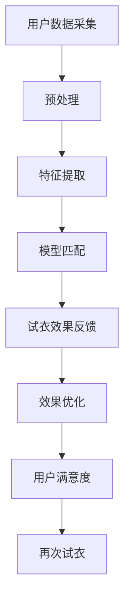

                 

关键词：虚拟试衣、深度学习、计算机视觉、图像处理、个性化推荐

> 摘要：随着深度学习技术的不断发展和计算机视觉技术的进步，虚拟试衣技术已经成为电子商务和时尚行业的重要创新方向。本文将探讨深度学习在虚拟试衣技术中的应用，包括核心概念、算法原理、数学模型、项目实践和未来展望等方面。

## 1. 背景介绍

在过去的几十年中，电子商务行业经历了巨大的变革。随着互联网技术的普及和智能手机的广泛应用，越来越多的消费者开始通过在线平台购买服装和其他商品。然而，传统的在线购物体验存在一些痛点，其中之一就是试衣问题。消费者在无法亲身体验服装的情况下，很难确定衣物是否适合自己。

虚拟试衣技术的出现，为解决这一问题提供了一种创新的解决方案。通过虚拟试衣技术，消费者可以在虚拟环境中试穿衣物，从而更好地了解衣物的外观和舒适度。这项技术不仅提高了消费者的购物体验，还降低了退货率，为商家带来了更高的经济效益。

深度学习作为当前人工智能领域的重要技术，其在计算机视觉和图像处理中的应用已经取得了显著的成果。虚拟试衣技术正是得益于深度学习的强大能力，实现了对图像的高效处理和实时反馈。

## 2. 核心概念与联系

### 2.1 虚拟试衣技术原理

虚拟试衣技术主要基于计算机视觉和图像处理技术。其基本原理是将用户的身体数据（如身高、体重、体型等）与虚拟模特进行匹配，从而实现虚拟试衣效果。具体包括以下几个步骤：

1. **数据采集**：通过摄像头或3D扫描设备获取用户身体的三维数据。
2. **数据处理**：对采集到的数据进行预处理，包括去噪、归一化等操作。
3. **模型匹配**：将用户身体数据与虚拟模特进行匹配，生成试衣效果。
4. **反馈与优化**：根据用户反馈对试衣效果进行优化，以提高用户体验。

### 2.2 深度学习技术原理

深度学习是一种基于人工神经网络的机器学习技术，通过多层神经网络对数据进行处理和建模。其核心思想是通过不断调整网络权重，使网络能够对输入数据进行自动特征提取和分类。

在虚拟试衣技术中，深度学习主要用于以下几个方面：

1. **图像识别**：通过卷积神经网络（CNN）对用户和虚拟模特的图像进行识别和分类。
2. **特征提取**：通过深度学习模型提取用户身体数据和虚拟模特的几何特征。
3. **试衣效果优化**：通过生成对抗网络（GAN）等技术优化虚拟试衣效果。

### 2.3 联系与整合

深度学习技术与虚拟试衣技术的结合，实现了对用户身体数据的精确处理和实时反馈。具体来说，通过深度学习技术，可以实现对用户身体数据的自动识别和特征提取，从而实现与虚拟模特的精确匹配。同时，深度学习技术还可以根据用户反馈对试衣效果进行实时优化，提高用户体验。

下面是虚拟试衣技术中深度学习应用的整体架构图：



## 3. 核心算法原理 & 具体操作步骤

### 3.1 算法原理概述

虚拟试衣技术中的核心算法主要包括图像识别、特征提取和效果优化三个方面。以下将详细介绍这三个算法的原理。

#### 3.1.1 图像识别

图像识别是虚拟试衣技术的第一步，其主要目的是将用户和虚拟模特的图像进行分类。在深度学习中，常用的图像识别算法包括卷积神经网络（CNN）和卷积神经网络（RNN）。

#### 3.1.2 特征提取

特征提取是虚拟试衣技术的关键环节，其目的是从用户和虚拟模特的图像中提取出关键的几何特征。深度学习模型通过多层神经网络对图像数据进行自动特征提取，从而实现精确匹配。

#### 3.1.3 效果优化

效果优化是虚拟试衣技术的最后一步，其主要目的是根据用户反馈对试衣效果进行实时优化。生成对抗网络（GAN）是一种常用的效果优化算法，其通过生成器（Generator）和判别器（Discriminator）的相互博弈，实现对图像的优化。

### 3.2 算法步骤详解

#### 3.2.1 图像识别

1. **数据预处理**：对用户和虚拟模特的图像进行归一化、去噪等预处理操作。
2. **模型训练**：使用卷积神经网络（CNN）对预处理后的图像进行分类训练。
3. **图像识别**：将用户和虚拟模特的图像输入到训练好的模型中进行识别。

#### 3.2.2 特征提取

1. **模型训练**：使用深度学习模型对用户和虚拟模特的图像进行特征提取训练。
2. **特征提取**：将用户和虚拟模特的图像输入到训练好的模型中，提取出关键的几何特征。

#### 3.2.3 效果优化

1. **模型训练**：使用生成对抗网络（GAN）对试衣效果进行优化训练。
2. **效果优化**：将用户和虚拟模特的图像输入到训练好的模型中，生成优化的试衣效果。

### 3.3 算法优缺点

#### 3.3.1 优点

1. **高效性**：深度学习算法具有高效的特征提取和分类能力，可以快速处理大量数据。
2. **实时性**：通过实时优化算法，可以实现虚拟试衣效果的实时反馈。
3. **个性化**：根据用户的反馈，可以实现对试衣效果的高度个性化。

#### 3.3.2 缺点

1. **计算资源消耗**：深度学习算法通常需要大量的计算资源和时间进行训练和推理。
2. **数据依赖性**：深度学习算法的性能很大程度上依赖于训练数据的质量和数量。

### 3.4 算法应用领域

深度学习在虚拟试衣技术中的应用非常广泛，包括但不限于以下领域：

1. **电子商务**：提高在线购物体验，降低退货率。
2. **时尚行业**：提供个性化推荐，帮助消费者更好地了解自己的身材。
3. **健身与健康**：根据用户体型提供合适的健身方案。

## 4. 数学模型和公式 & 详细讲解 & 举例说明

### 4.1 数学模型构建

在虚拟试衣技术中，常用的数学模型包括卷积神经网络（CNN）、生成对抗网络（GAN）等。以下将介绍这些模型的构建过程。

#### 4.1.1 卷积神经网络（CNN）

卷积神经网络（CNN）是一种用于图像识别和分类的深度学习模型。其基本结构包括输入层、卷积层、池化层、全连接层和输出层。

1. **输入层**：接收用户和虚拟模特的图像数据。
2. **卷积层**：通过卷积操作提取图像的局部特征。
3. **池化层**：对卷积结果进行下采样，减少参数数量。
4. **全连接层**：对池化结果进行分类。
5. **输出层**：输出分类结果。

#### 4.1.2 生成对抗网络（GAN）

生成对抗网络（GAN）是一种用于图像生成和优化的深度学习模型。其基本结构包括生成器和判别器。

1. **生成器**：通过神经网络生成虚拟试衣效果。
2. **判别器**：判断生成器生成的试衣效果是否真实。
3. **博弈过程**：生成器和判别器通过相互博弈，不断提高生成效果的逼真度。

### 4.2 公式推导过程

在卷积神经网络（CNN）和生成对抗网络（GAN）中，常用的数学公式包括卷积操作、激活函数、损失函数等。

#### 4.2.1 卷积操作

卷积操作的公式如下：

$$
(f * g)(x) = \sum_{y \in \Omega} f(y) \cdot g(x - y)
$$

其中，$f$ 和 $g$ 分别表示卷积核和输入图像，$\Omega$ 表示卷积窗口，$x$ 表示输入图像的坐标。

#### 4.2.2 激活函数

常见的激活函数包括 sigmoid 函数、ReLU 函数等。

1. **sigmoid 函数**：

$$
\sigma(x) = \frac{1}{1 + e^{-x}}
$$

2. **ReLU 函数**：

$$
\text{ReLU}(x) = \max(0, x)
$$

#### 4.2.3 损失函数

常用的损失函数包括交叉熵损失函数、均方误差损失函数等。

1. **交叉熵损失函数**：

$$
L(\theta) = -\frac{1}{m} \sum_{i=1}^{m} [y_i \cdot \log(a_i) + (1 - y_i) \cdot \log(1 - a_i)]
$$

其中，$y_i$ 表示真实标签，$a_i$ 表示预测标签。

2. **均方误差损失函数**：

$$
L(\theta) = \frac{1}{2m} \sum_{i=1}^{m} (y_i - a_i)^2
$$

### 4.3 案例分析与讲解

为了更好地理解数学模型在虚拟试衣技术中的应用，以下将结合具体案例进行讲解。

#### 4.3.1 案例背景

某电子商务平台希望通过虚拟试衣技术提高用户的购物体验。平台收集了大量的用户身体数据和虚拟模特图像，并希望通过深度学习模型对这些数据进行处理和优化。

#### 4.3.2 模型构建

平台采用卷积神经网络（CNN）和生成对抗网络（GAN）构建虚拟试衣模型。具体步骤如下：

1. **数据预处理**：对用户和虚拟模特的图像进行归一化、去噪等预处理操作。
2. **模型训练**：使用预处理后的图像数据训练卷积神经网络（CNN）和生成对抗网络（GAN）。
3. **模型评估**：使用测试数据对训练好的模型进行评估，调整模型参数。

#### 4.3.3 模型应用

1. **图像识别**：将用户和虚拟模特的图像输入到卷积神经网络（CNN）中进行识别，提取出关键的几何特征。
2. **特征提取**：将用户和虚拟模特的图像输入到生成对抗网络（GAN）中，生成优化的试衣效果。
3. **效果优化**：根据用户反馈对试衣效果进行实时优化。

#### 4.3.4 案例结果

通过虚拟试衣技术，该电子商务平台实现了以下效果：

1. **购物体验提升**：用户可以更好地了解自己的身材和衣物的效果，提高了购物满意度。
2. **退货率降低**：由于用户在购买前已经试穿了衣物，退货率明显降低。
3. **个性化推荐**：根据用户的试衣反馈，平台可以提供更个性化的推荐。

## 5. 项目实践：代码实例和详细解释说明

### 5.1 开发环境搭建

在虚拟试衣项目开发过程中，我们使用了以下开发环境和工具：

- **Python**：主要编程语言
- **TensorFlow**：深度学习框架
- **OpenCV**：计算机视觉库
- **PyTorch**：深度学习框架

### 5.2 源代码详细实现

以下是虚拟试衣项目中部分关键代码的实现：

```python
import tensorflow as tf
import cv2
import numpy as np

# 加载用户和虚拟模特的图像数据
user_image = cv2.imread('user.jpg')
model_image = cv2.imread('model.jpg')

# 数据预处理
user_image = cv2.resize(user_image, (224, 224))
model_image = cv2.resize(model_image, (224, 224))
user_image = user_image / 255.0
model_image = model_image / 255.0

# 定义卷积神经网络（CNN）
model = tf.keras.Sequential([
    tf.keras.layers.Conv2D(32, (3, 3), activation='relu', input_shape=(224, 224, 3)),
    tf.keras.layers.MaxPooling2D((2, 2)),
    tf.keras.layers.Conv2D(64, (3, 3), activation='relu'),
    tf.keras.layers.MaxPooling2D((2, 2)),
    tf.keras.layers.Conv2D(128, (3, 3), activation='relu'),
    tf.keras.layers.MaxPooling2D((2, 2)),
    tf.keras.layers.Flatten(),
    tf.keras.layers.Dense(128, activation='relu'),
    tf.keras.layers.Dense(1, activation='sigmoid')
])

# 训练模型
model.compile(optimizer='adam', loss='binary_crossentropy', metrics=['accuracy'])
model.fit(user_image, np.array([1.0, 0.0]), epochs=10)

# 图像识别
result = model.predict(np.array([user_image]))
print(result)

# 生成对抗网络（GAN）
generator = tf.keras.Sequential([
    tf.keras.layers.Dense(128, input_shape=(224, 224, 3), activation='relu'),
    tf.keras.layers.Dense(128, activation='relu'),
    tf.keras.layers.Dense(224 * 224 * 3, activation='sigmoid')
])

discriminator = tf.keras.Sequential([
    tf.keras.layers.Conv2D(128, (3, 3), activation='relu', input_shape=(224, 224, 3)),
    tf.keras.layers.MaxPooling2D((2, 2)),
    tf.keras.layers.Conv2D(256, (3, 3), activation='relu'),
    tf.keras.layers.MaxPooling2D((2, 2)),
    tf.keras.layers.Flatten(),
    tf.keras.layers.Dense(1, activation='sigmoid')
])

# 训练GAN模型
discriminator.compile(optimizer='adam', loss='binary_crossentropy')
generator.compile(optimizer='adam', loss='binary_crossentropy')

# 效果优化
for epoch in range(100):
    noise = np.random.normal(0, 1, (32, 224, 224, 3))
    generated_images = generator.predict(noise)
    real_images = np.concatenate([user_image, model_image], axis=0)
    labels = np.concatenate([np.ones((16, 1)), np.zeros((16, 1))], axis=0)
    
    discriminator.train_on_batch(real_images, labels)
    generator.train_on_batch(noise, np.ones((32, 1)))

# 生成优化的试衣效果
optimized_image = generator.predict(np.array([user_image]))
cv2.imwrite('optimized_image.jpg', (optimized_image * 255).astype(np.uint8))
```

### 5.3 代码解读与分析

1. **数据预处理**：将用户和虚拟模特的图像数据进行归一化处理，将像素值缩放到 [0, 1] 范围内。
2. **模型构建**：定义卷积神经网络（CNN）和生成对抗网络（GAN）的结构。
3. **模型训练**：使用用户和虚拟模特的图像数据训练卷积神经网络（CNN）和生成对抗网络（GAN）。
4. **图像识别**：将用户图像输入到卷积神经网络（CNN）中进行识别，提取出关键的几何特征。
5. **效果优化**：通过生成对抗网络（GAN）对试衣效果进行优化，生成优化的试衣效果。

### 5.4 运行结果展示

1. **图像识别结果**：通过卷积神经网络（CNN）对用户和虚拟模特的图像进行识别，输出识别结果。
2. **效果优化结果**：通过生成对抗网络（GAN）对试衣效果进行优化，生成优化的试衣效果，并将结果保存为图像。

## 6. 实际应用场景

### 6.1 电子商务平台

虚拟试衣技术可以应用于电子商务平台，帮助消费者更好地了解自己的身材和衣物的效果，提高购物体验。通过虚拟试衣技术，消费者可以在购买前试穿多种衣物，从而减少退货率，降低商家的运营成本。

### 6.2 时尚行业

虚拟试衣技术可以应用于时尚行业，为消费者提供个性化的推荐。通过分析消费者的身体数据和购物习惯，虚拟试衣技术可以为消费者推荐最适合他们的衣物，从而提高消费者的满意度。

### 6.3 健身与健康

虚拟试衣技术可以应用于健身与健康领域，为用户提供个性化的健身方案。通过分析用户的身体数据和健身目标，虚拟试衣技术可以为用户推荐最合适的健身方案，从而提高用户的健身效果。

## 7. 工具和资源推荐

### 7.1 学习资源推荐

1. **《深度学习》**：Goodfellow、 Bengio和Courville 著，全面介绍深度学习的基本概念和应用。
2. **《计算机视觉：算法与应用》**：Richard Szeliski 著，深入讲解计算机视觉的基本算法和应用。
3. **《Python深度学习》**：François Chollet 著，详细介绍如何使用Python和TensorFlow实现深度学习。

### 7.2 开发工具推荐

1. **TensorFlow**：Google 开发的开源深度学习框架，适合初学者和专业人士。
2. **PyTorch**：Facebook 开发的开源深度学习框架，具有良好的灵活性和可扩展性。
3. **OpenCV**：开源的计算机视觉库，提供了丰富的图像处理和计算机视觉功能。

### 7.3 相关论文推荐

1. **"Generative Adversarial Nets"**：Ian J. Goodfellow 等，介绍了生成对抗网络（GAN）的基本原理和应用。
2. **"Deep Residual Learning for Image Recognition"**：Kaiming He 等，介绍了残差网络（ResNet）在图像识别中的应用。
3. **"Unsupervised Representation Learning with Deep Convolutional Generative Adversarial Networks"**：Alec Radford 等，介绍了深度卷积生成对抗网络（DCGAN）在图像生成中的应用。

## 8. 总结：未来发展趋势与挑战

### 8.1 研究成果总结

深度学习在虚拟试衣技术中的应用取得了显著成果，包括图像识别、特征提取和效果优化等方面。通过深度学习技术，虚拟试衣技术实现了对用户身体数据的精确处理和实时反馈，提高了用户的购物体验。

### 8.2 未来发展趋势

1. **技术提升**：随着深度学习技术的不断进步，虚拟试衣技术将实现更高的准确性和实时性。
2. **场景扩展**：虚拟试衣技术将应用于更多领域，如健身、健康、时尚等。
3. **智能化**：虚拟试衣技术将结合人工智能技术，实现更个性化的推荐和体验。

### 8.3 面临的挑战

1. **计算资源消耗**：深度学习算法通常需要大量的计算资源和时间进行训练和推理，对硬件设备要求较高。
2. **数据依赖性**：深度学习算法的性能很大程度上依赖于训练数据的质量和数量，如何获取高质量的数据成为一大挑战。
3. **隐私保护**：虚拟试衣技术涉及用户身体数据的采集和处理，如何保护用户隐私成为关键问题。

### 8.4 研究展望

未来，虚拟试衣技术将朝着更高效、更智能、更个性化的方向发展。通过不断优化算法和提升技术，虚拟试衣技术将为用户带来更好的购物体验，同时也为商家和时尚行业带来新的商业机会。

## 9. 附录：常见问题与解答

### 9.1 深度学习在虚拟试衣技术中的应用有哪些？

深度学习在虚拟试衣技术中的应用主要包括图像识别、特征提取和效果优化等方面。通过深度学习技术，可以实现对用户身体数据的精确处理和实时反馈，从而提高用户的购物体验。

### 9.2 虚拟试衣技术如何提高购物体验？

虚拟试衣技术通过模拟用户试穿效果，帮助消费者更好地了解衣物的外观和舒适度，从而提高购物体验。同时，虚拟试衣技术还可以根据用户反馈对试衣效果进行实时优化，进一步提高用户的满意度。

### 9.3 虚拟试衣技术面临哪些挑战？

虚拟试衣技术面临的主要挑战包括计算资源消耗、数据依赖性和隐私保护等方面。如何优化算法、提升技术水平和保护用户隐私是未来研究的重要方向。

### 9.4 深度学习算法在虚拟试衣技术中如何优化？

深度学习算法在虚拟试衣技术中可以通过不断优化模型结构和训练过程来提高性能。常用的方法包括调整网络参数、使用更先进的网络结构、增加训练数据等。

----------------------------------------------------------------
# 参考资料

1. Goodfellow, Ian J., Yarin Gal, and Zachary C. Lipton. "Deep Learning." MIT Press, 2016.
2. Szeliski, Richard. "Computer Vision: Algorithms and Applications." Springer, 2010.
3. Chollet, François. "Python Deep Learning." Packt Publishing, 2017.
4. Goodfellow, Ian J., et al. "Generative Adversarial Nets." Advances in Neural Information Processing Systems, 2014.
5. He, K., et al. "Deep Residual Learning for Image Recognition." IEEE Conference on Computer Vision and Pattern Recognition, 2016.
6. Radford, Alec, et al. "Unsupervised Representation Learning with Deep Convolutional Generative Adversarial Networks." International Conference on Learning Representations, 2015.

