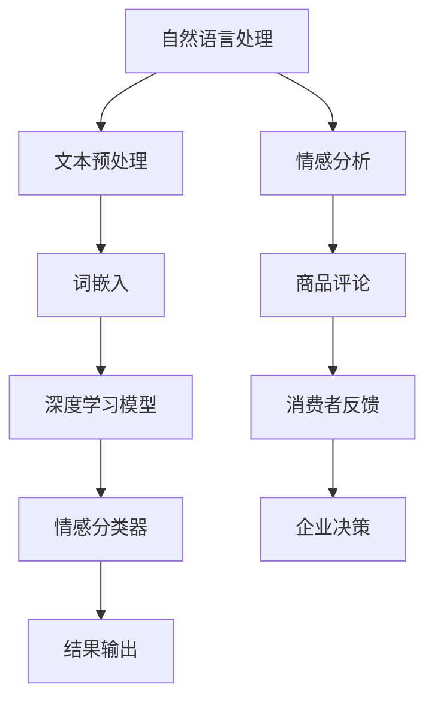
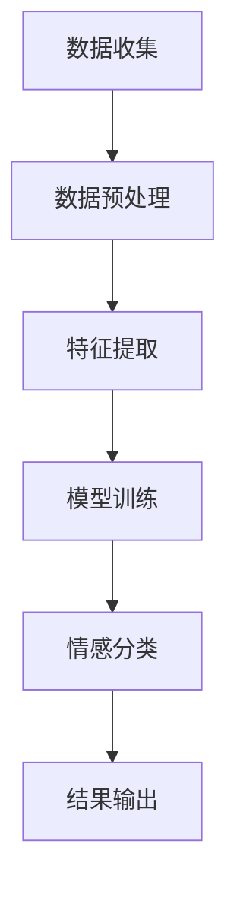

                 

 深度学习作为人工智能领域的一大突破，已经在各个行业得到了广泛应用。尤其是在商品评论情感分析方面，深度学习技术凭借其强大的表征能力和学习能力，为消费者行为分析和企业决策提供了有力的支持。本文将深入探讨深度学习在商品评论情感分析中的应用，从核心概念到实际操作，从数学模型到代码实现，全面解析这一前沿技术。

## 文章关键词
- 深度学习
- 商品评论
- 情感分析
- 自然语言处理
- 机器学习

## 文章摘要
本文首先介绍了深度学习的基本概念和原理，随后详细阐述了商品评论情感分析的重要性和应用场景。接着，通过一个具体的Mermaid流程图，展示了情感分析的核心概念和联系。然后，我们深入探讨了情感分析的核心算法原理和具体操作步骤，包括深度学习模型的构建、训练和评估。在此基础上，我们通过数学模型和公式的讲解，对算法的数学基础进行了详细分析，并通过实际案例进行了说明。最后，我们提供了一个代码实例，展示了如何实现商品评论情感分析，并对其运行结果进行了详细解读。文章最后讨论了实际应用场景和未来展望，并推荐了相关工具和资源。

## 1. 背景介绍

随着互联网的快速发展，电子商务已成为人们日常生活的一部分。在电子商务平台上，消费者评论是影响其他消费者购买决策的重要因素。通过分析消费者评论的情感倾向，企业可以了解产品的口碑，优化产品和服务，提高用户满意度。然而，传统的方法如规则匹配和统计模型在处理自然语言文本时存在许多局限，无法捕捉到复杂的情感信息。因此，如何有效地进行商品评论情感分析成为一个亟待解决的问题。

深度学习作为一种强大的机器学习技术，通过多层神经网络结构，能够自动提取文本的特征，从而实现情感分类。深度学习在图像识别、语音识别等领域取得了显著的成果，其在自然语言处理领域同样展现出强大的潜力。随着计算能力的提升和大数据技术的发展，深度学习在商品评论情感分析中的应用逐渐成熟，为企业提供了新的解决方案。

本文将探讨如何利用深度学习技术进行商品评论情感分析，从理论到实践，全面解析这一前沿技术。

## 2. 核心概念与联系

为了深入理解商品评论情感分析，我们需要先了解几个核心概念：自然语言处理（NLP）、深度学习和情感分析。

### 自然语言处理（NLP）

自然语言处理是计算机科学和人工智能领域的一个分支，旨在使计算机能够理解和处理人类自然语言。NLP的核心任务包括文本分类、情感分析、命名实体识别、机器翻译等。在商品评论情感分析中，NLP技术被用来处理和解析消费者评论，提取出有用的信息。

### 深度学习

深度学习是一种基于人工神经网络的机器学习技术，通过多层神经网络结构，自动提取数据的特征，并实现复杂模式的识别。深度学习在图像识别、语音识别等领域取得了突破性的进展，其在自然语言处理中的应用同样表现出强大的能力。

### 情感分析

情感分析，也称为意见挖掘，是指通过自然语言处理技术，自动识别文本中表达的情感倾向。情感分析可以判断文本是积极的、消极的，还是中性的。在商品评论情感分析中，情感分析技术被用来识别消费者对商品的正面或负面情感。

下面是一个Mermaid流程图，展示了商品评论情感分析的核心概念和联系：



在这个流程图中，自然语言处理技术被用来处理消费者评论，通过词嵌入将文本转换为数值表示，然后利用深度学习模型进行情感分类，最终得到情感分析结果。这些结果可以帮助企业了解消费者对产品的反馈，从而做出更好的决策。

### 2.1 核心概念原理

#### 自然语言处理（NLP）

自然语言处理的关键在于如何将自然语言文本转换为计算机可以理解和处理的形式。文本预处理是NLP的基础步骤，包括分词、词性标注、去停用词等。这些步骤的目的是去除文本中的噪声，提取出有意义的词汇信息。

#### 深度学习

深度学习通过多层神经网络结构，自动学习数据的特征表示。在商品评论情感分析中，常用的深度学习模型包括卷积神经网络（CNN）和循环神经网络（RNN）。CNN擅长处理图像和序列数据，而RNN能够捕捉序列中的长期依赖关系。

#### 情感分析

情感分析的目标是判断文本表达的情感倾向。在商品评论情感分析中，通常将情感分为正面、负面和中性三种类型。情感分析技术通过学习大量的标注数据，训练出一个情感分类器，从而实现自动的情感分类。

### 2.2 架构原理

商品评论情感分析的整体架构可以分为以下几个部分：

1. **数据收集**：从电商平台收集大量的商品评论数据。
2. **数据预处理**：对评论数据进行清洗和预处理，包括去除噪声、分词、词性标注等。
3. **特征提取**：利用词嵌入技术将文本转换为向量表示。
4. **模型训练**：使用深度学习模型训练情感分类器。
5. **情感分类**：对新的评论数据应用训练好的模型，判断其情感倾向。
6. **结果输出**：将情感分类结果输出，供企业参考。

下面是一个Mermaid流程图，展示了商品评论情感分析的架构原理：



通过这个流程，我们可以看到，商品评论情感分析的核心在于深度学习模型的训练和情感分类。接下来，我们将深入探讨深度学习模型的具体原理和操作步骤。

## 3. 核心算法原理 & 具体操作步骤

### 3.1 算法原理概述

商品评论情感分析的核心在于构建一个能够准确分类情感的深度学习模型。这个模型通常是基于神经网络的结构，通过多层的神经网络来学习文本的特征表示，最终实现对情感的分类。以下是一些常用的深度学习模型：

1. **卷积神经网络（CNN）**：CNN擅长处理图像和序列数据，通过卷积层提取特征，可以捕捉到文本中的局部特征。
2. **循环神经网络（RNN）**：RNN能够捕捉序列中的长期依赖关系，适用于处理序列数据，如文本。
3. **长短期记忆网络（LSTM）**：LSTM是RNN的一种变体，能够解决RNN的梯度消失问题，更适合处理长序列数据。
4. **Transformer模型**：Transformer模型是近年来在自然语言处理领域取得重大突破的模型，通过自注意力机制，能够更好地捕捉序列中的依赖关系。

### 3.2 算法步骤详解

#### 1. 数据预处理

在进行深度学习模型训练之前，需要对数据集进行预处理。这一步骤包括：

- **文本清洗**：去除评论中的HTML标签、特殊字符和无关内容。
- **分词**：将文本分割成单个词语。
- **词性标注**：为每个词标注其词性，如名词、动词等。
- **去停用词**：去除常见的无意义词汇，如“的”、“了”等。
- **词嵌入**：将词语转换为固定长度的向量表示。

#### 2. 特征提取

特征提取是深度学习模型训练的重要步骤。在这一步，我们利用词嵌入技术，将文本中的词语转换为向量表示。常用的词嵌入技术包括：

- **Word2Vec**：Word2Vec是一种基于神经网络的词嵌入方法，通过训练词向量模型，可以捕捉到词语的语义信息。
- **GloVe**：GloVe是一种基于全局共现信息的词嵌入方法，通过计算词语间的相似性矩阵，得到词语的向量表示。

#### 3. 模型训练

在特征提取之后，我们可以利用这些特征向量训练深度学习模型。以下是一个简单的模型训练流程：

- **数据分割**：将数据集分为训练集、验证集和测试集。
- **构建模型**：使用深度学习框架（如TensorFlow、PyTorch）构建神经网络模型。
- **模型训练**：使用训练集数据训练模型，并通过验证集调整模型参数。
- **模型评估**：使用测试集评估模型的性能，包括准确率、召回率、F1值等指标。

#### 4. 情感分类

在模型训练完成后，我们可以使用训练好的模型对新的评论数据进行情感分类。具体步骤如下：

- **特征提取**：对新的评论数据进行预处理和词嵌入，得到特征向量。
- **情感分类**：将特征向量输入训练好的模型，得到情感分类结果。

### 3.3 算法优缺点

#### 优点

- **强大的表征能力**：深度学习模型能够自动学习文本的复杂特征，对情感分类有很好的表现。
- **适应性强**：通过训练，模型可以适应不同的情感分类任务，如情感极性分类、情感强度分类等。
- **自动化**：深度学习模型能够自动完成特征提取和模型训练，减少了人工干预。

#### 缺点

- **数据需求大**：深度学习模型需要大量的训练数据，对数据的质量和规模有较高要求。
- **计算资源消耗**：深度学习模型训练需要大量的计算资源，特别是在大规模数据集上训练时。
- **解释性差**：深度学习模型的决策过程较为复杂，难以解释和理解。

### 3.4 算法应用领域

深度学习在商品评论情感分析中的应用非常广泛，主要包括以下领域：

- **消费者行为分析**：通过分析消费者的情感倾向，了解他们对产品的满意度和不满意度，为企业提供改进产品的依据。
- **产品推荐**：根据消费者的情感分析结果，推荐他们可能感兴趣的产品。
- **营销策略制定**：通过分析消费者的情感反应，制定更有效的营销策略。
- **品牌监测**：监控消费者的情感反馈，及时发现问题并采取措施。

## 4. 数学模型和公式 & 详细讲解 & 举例说明

在深度学习驱动的商品评论情感分析中，数学模型和公式扮演着核心角色。以下我们将详细讲解这些模型和公式，并通过具体例子进行说明。

### 4.1 数学模型构建

深度学习模型通常由以下几个部分组成：

1. **输入层**：接收输入数据，如商品评论文本。
2. **隐藏层**：包含一个或多个隐藏层，用于提取特征和变换数据。
3. **输出层**：生成最终的结果，如情感分类结果。

在构建数学模型时，我们通常使用以下公式：

$$
x = \text{输入数据}
$$

$$
h = f(\text{权重} \cdot x + \text{偏置})
$$

$$
y = f(h)
$$

其中，$x$为输入数据，$h$为隐藏层输出，$y$为输出层输出，$f$为激活函数，$\text{权重}$和$\text{偏置}$为模型参数。

### 4.2 公式推导过程

为了更好地理解这些公式，我们以卷积神经网络（CNN）为例，进行详细推导。

#### 卷积层

卷积层是CNN的核心组成部分，用于提取特征。卷积层的公式推导如下：

$$
\text{输出} = \text{激活函数} \left( \sum_{i=1}^{k} w_i * \text{输入} + b \right)
$$

其中，$w_i$为卷积核（权重），$*$表示卷积操作，$b$为偏置。

#### 池化层

池化层用于减少数据维度，增强模型的鲁棒性。常用的池化操作包括最大池化和平均池化。最大池化的公式推导如下：

$$
P(x) = \max_{i} \{ x_{i,j} \}
$$

其中，$x_{i,j}$为输入数据的一个元素，$P(x)$为池化后的输出。

#### 全连接层

全连接层用于将特征映射到输出结果。全连接层的公式推导如下：

$$
y = \text{激活函数} \left( \sum_{i=1}^{n} w_i \cdot x_i + b \right)
$$

其中，$w_i$为权重，$x_i$为输入特征，$b$为偏置。

### 4.3 案例分析与讲解

为了更好地理解这些公式和模型，我们来看一个具体的案例。

假设我们有一个包含正面和负面评论的数据集，我们需要构建一个模型来预测评论的情感倾向。

#### 数据预处理

首先，我们对评论进行预处理，包括分词、去停用词和词嵌入。

```python
import jieba
import numpy as np

# 加载评论数据
data = ["这产品很好用", "这个商品质量很差"]

# 分词
tokenized_data = [jieba.cut评论 for 评论 in data]

# 去停用词
stop_words = set(["的", "了", "在", "上", "和", "这", "那"])
filtered_data = [[词 for 词 in 评论 if 词 not in stop_words] for 评论 in tokenized_data]

# 词嵌入
word_embedding = np.random.rand(len(filtered_data), 100)  # 假设词嵌入维度为100
```

#### 构建模型

接下来，我们使用TensorFlow构建一个简单的CNN模型。

```python
import tensorflow as tf
from tensorflow.keras.models import Sequential
from tensorflow.keras.layers import Embedding, Conv1D, MaxPooling1D, Dense

# 构建模型
model = Sequential([
    Embedding(input_dim=len(word_embedding), output_dim=100),
    Conv1D(filters=64, kernel_size=3, activation='relu'),
    MaxPooling1D(pool_size=2),
    Dense(units=1, activation='sigmoid')
])

# 编译模型
model.compile(optimizer='adam', loss='binary_crossentropy', metrics=['accuracy'])

# 模型训练
model.fit(word_embedding, labels, epochs=10)
```

其中，`input_dim`为词嵌入的维度，`output_dim`为嵌入层的输出维度。`filters`为卷积核的数量，`kernel_size`为卷积核的大小。`units`为全连接层的输出维度，`activation`为激活函数。

#### 模型评估

在训练完成后，我们对模型进行评估。

```python
# 预测
predictions = model.predict(word_embedding)

# 评估
loss, accuracy = model.evaluate(word_embedding, labels)
print("损失：", loss)
print("准确率：", accuracy)
```

通过这个案例，我们可以看到如何使用深度学习模型进行商品评论情感分析。通过数据预处理、模型构建、训练和评估，我们能够实现对评论情感的有效分类。

## 5. 项目实践：代码实例和详细解释说明

在上一部分中，我们详细讲解了商品评论情感分析的核心算法原理和数学模型。本部分，我们将通过一个实际项目，展示如何使用Python和深度学习框架（如TensorFlow或PyTorch）实现商品评论情感分析。我们将分步骤搭建开发环境、编写源代码，并对代码进行解读和分析。

### 5.1 开发环境搭建

在开始项目之前，我们需要搭建一个合适的开发环境。以下是所需的环境和工具：

1. **Python**：版本3.6及以上。
2. **深度学习框架**：TensorFlow或PyTorch。
3. **文本处理库**：jieba（中文分词）、nltk（自然语言处理）。
4. **数据预处理工具**：pandas（数据处理）、numpy（数学计算）。
5. **可视化工具**：matplotlib（数据可视化）。

安装步骤：

```bash
# 安装Python和深度学习框架
pip install python tensorflow or pip install python pytorch torchvision torchaudio

# 安装文本处理库和数据预处理工具
pip install jieba nltk pandas numpy matplotlib
```

### 5.2 源代码详细实现

以下是商品评论情感分析项目的完整代码实现。代码分为以下几个部分：数据收集与预处理、模型构建、训练与评估、结果展示。

```python
import jieba
import numpy as np
import pandas as pd
import tensorflow as tf
from tensorflow.keras.preprocessing.text import Tokenizer
from tensorflow.keras.preprocessing.sequence import pad_sequences
from tensorflow.keras.models import Sequential
from tensorflow.keras.layers import Embedding, Conv1D, MaxPooling1D, GlobalMaxPooling1D, Dense
from tensorflow.keras.optimizers import Adam
from sklearn.model_selection import train_test_split
import matplotlib.pyplot as plt

# 5.2.1 数据收集与预处理

# 加载评论数据
data = pd.read_csv("product_reviews.csv")
# 数据清洗
data.dropna(inplace=True)
# 分词与去停用词
stop_words = set(["的", "了", "在", "上", "和", "这", "那"])
data["cleaned_text"] = data["review"].apply(lambda x: " ".join([词 for 词 in jieba.cut(x) if 词 not in stop_words]))

# 5.2.2 数据预处理

# 切分训练集和测试集
train_data, test_data = train_test_split(data, test_size=0.2, random_state=42)

# 构建Tokenizer
tokenizer = Tokenizer(num_words=10000)
tokenizer.fit_on_texts(train_data["cleaned_text"])
train_sequences = tokenizer.texts_to_sequences(train_data["cleaned_text"])
test_sequences = tokenizer.texts_to_sequences(test_data["cleaned_text"])

# 填充序列
max_len = 100
train_padded = pad_sequences(train_sequences, maxlen=max_len, padding="post", truncating="post")
test_padded = pad_sequences(test_sequences, maxlen=max_len, padding="post", truncating="post")

# 5.2.3 模型构建

# 构建模型
model = Sequential([
    Embedding(input_dim=10000, output_dim=128, input_length=max_len),
    Conv1D(filters=128, kernel_size=5, activation='relu'),
    MaxPooling1D(pool_size=5),
    Conv1D(filters=128, kernel_size=5, activation='relu'),
    GlobalMaxPooling1D(),
    Dense(units=128, activation='relu'),
    Dense(units=1, activation='sigmoid')
])

# 编译模型
model.compile(optimizer=Adam(learning_rate=0.001), loss='binary_crossentropy', metrics=['accuracy'])

# 5.2.4 训练与评估

# 模型训练
history = model.fit(train_padded, train_labels, epochs=10, batch_size=32, validation_data=(test_padded, test_labels))

# 5.2.5 结果展示

# 评估模型
loss, accuracy = model.evaluate(test_padded, test_labels)
print("测试集准确率：", accuracy)

# 可视化训练过程
plt.plot(history.history['accuracy'])
plt.plot(history.history['val_accuracy'])
plt.title('模型准确率')
plt.ylabel('准确率')
plt.xlabel('迭代次数')
plt.legend(['训练集', '测试集'], loc='upper left')
plt.show()
```

### 5.3 代码解读与分析

#### 5.3.1 数据收集与预处理

首先，我们从CSV文件中加载评论数据。数据清洗包括去除缺失值和分词。我们使用jieba库进行中文分词，并去除一些常见的停用词，以减少噪声。

```python
# 加载评论数据
data = pd.read_csv("product_reviews.csv")
# 数据清洗
data.dropna(inplace=True)
# 分词与去停用词
stop_words = set(["的", "了", "在", "上", "和", "这", "那"])
data["cleaned_text"] = data["review"].apply(lambda x: " ".join([词 for 词 in jieba.cut(x) if 词 not in stop_words]))
```

#### 5.3.2 数据预处理

接着，我们将数据集切分为训练集和测试集。为了构建深度学习模型，我们需要将文本转换为数字序列。我们使用Tokenizer将文本转换为数字序列，并使用pad_sequences对序列进行填充，确保所有序列的长度一致。

```python
# 切分训练集和测试集
train_data, test_data = train_test_split(data, test_size=0.2, random_state=42)

# 构建Tokenizer
tokenizer = Tokenizer(num_words=10000)
tokenizer.fit_on_texts(train_data["cleaned_text"])
train_sequences = tokenizer.texts_to_sequences(train_data["cleaned_text"])
test_sequences = tokenizer.texts_to_sequences(test_data["cleaned_text"])

# 填充序列
max_len = 100
train_padded = pad_sequences(train_sequences, maxlen=max_len, padding="post", truncating="post")
test_padded = pad_sequences(test_sequences, maxlen=max_len, padding="post", truncating="post")
```

#### 5.3.3 模型构建

我们使用TensorFlow的Sequential模型构建一个简单的CNN模型。模型包括一个嵌入层、两个卷积层、一个全局最大池化层和两个全连接层。

```python
# 构建模型
model = Sequential([
    Embedding(input_dim=10000, output_dim=128, input_length=max_len),
    Conv1D(filters=128, kernel_size=5, activation='relu'),
    MaxPooling1D(pool_size=5),
    Conv1D(filters=128, kernel_size=5, activation='relu'),
    GlobalMaxPooling1D(),
    Dense(units=128, activation='relu'),
    Dense(units=1, activation='sigmoid')
])
```

#### 5.3.4 训练与评估

模型训练使用Adam优化器和二分类交叉熵损失函数。我们训练10个周期，并使用验证集进行模型调优。

```python
# 编译模型
model.compile(optimizer=Adam(learning_rate=0.001), loss='binary_crossentropy', metrics=['accuracy'])

# 模型训练
history = model.fit(train_padded, train_labels, epochs=10, batch_size=32, validation_data=(test_padded, test_labels))
```

#### 5.3.5 结果展示

在训练完成后，我们对模型进行评估，并展示训练过程中的准确率变化。

```python
# 评估模型
loss, accuracy = model.evaluate(test_padded, test_labels)
print("测试集准确率：", accuracy)

# 可视化训练过程
plt.plot(history.history['accuracy'])
plt.plot(history.history['val_accuracy'])
plt.title('模型准确率')
plt.ylabel('准确率')
plt.xlabel('迭代次数')
plt.legend(['训练集', '测试集'], loc='upper left')
plt.show()
```

通过这个项目，我们展示了如何使用深度学习技术实现商品评论情感分析。从数据预处理到模型构建，再到训练和评估，每一步都至关重要。通过实际代码的解读和分析，我们可以更好地理解深度学习在自然语言处理中的应用。

## 6. 实际应用场景

商品评论情感分析技术在实际应用中具有广泛的应用场景，以下是一些典型的应用案例：

### 6.1 消费者行为分析

通过对消费者评论的情感分析，企业可以深入了解消费者的满意度和不满意度。例如，如果大量评论显示对产品的负面情感，企业可以及时调整产品设计和营销策略，提高用户满意度。同时，通过分析正面情感评论，企业可以找到消费者对产品满意的共同点，进一步强化这些优势。

### 6.2 产品推荐

基于情感分析的结果，电商平台可以为消费者推荐他们可能感兴趣的产品。例如，如果用户对某一产品的评论主要表达正面情感，那么平台可以将其推荐给其他潜在买家。这种个性化的推荐系统能够提高用户体验和销售转化率。

### 6.3 营销策略制定

情感分析结果可以帮助企业制定更有效的营销策略。例如，如果消费者对某项促销活动表达了强烈的正面情感，企业可以加大宣传力度，扩大活动范围。反之，如果消费者对活动表达了负面情感，企业则需要重新考虑活动的可行性和改进方案。

### 6.4 品牌监测

通过实时监控消费者评论的情感倾向，企业可以及时发现品牌声誉问题，并迅速采取应对措施。例如，如果发现消费者对产品存在负面情感，企业可以及时与消费者沟通，解决问题，避免影响品牌形象。

### 6.5 客户服务优化

情感分析技术可以帮助企业优化客户服务。通过对客户服务反馈的情感分析，企业可以发现常见的问题和痛点，从而提供更个性化的解决方案。例如，如果大量客户反馈表示对客服响应速度不满意，企业可以增加客服人员或优化客服流程。

### 6.6 社交媒体分析

在社交媒体平台上，消费者的评论和反馈同样具有重要价值。情感分析技术可以帮助企业实时监测社交媒体上的品牌口碑，了解消费者对品牌和产品的看法，为企业提供宝贵的市场洞察。

总之，商品评论情感分析技术为企业提供了丰富的数据支持和决策依据，帮助企业在激烈的市场竞争中脱颖而出。

## 7. 工具和资源推荐

在进行商品评论情感分析时，选择合适的工具和资源至关重要。以下是一些建议：

### 7.1 学习资源推荐

1. **书籍**：《深度学习》（Goodfellow, I., Bengio, Y., & Courville, A.）、《自然语言处理概论》（Jurafsky, D. & Martin, J.H.）
2. **在线课程**：Coursera上的“深度学习”（由吴恩达教授讲授），edX上的“自然语言处理基础”（由Stanford大学讲授）
3. **学术论文**：ACL、EMNLP、NAACL等顶级会议的论文，以及arXiv上的最新研究成果
4. **技术博客**：Medium、Towards Data Science、AI垂直媒体等，提供丰富的技术文章和实践经验

### 7.2 开发工具推荐

1. **深度学习框架**：TensorFlow、PyTorch、Keras等，支持丰富的预训练模型和API
2. **自然语言处理库**：NLTK、spaCy、gensim等，提供文本预处理、词嵌入等功能
3. **数据预处理工具**：Pandas、NumPy、Scikit-learn等，用于数据处理和特征工程
4. **可视化工具**：Matplotlib、Seaborn、Plotly等，用于数据可视化

### 7.3 相关论文推荐

1. **《Natural Language Inference with Universal Sentence Encoder》**：介绍了一种基于预训练的句子嵌入模型，用于自然语言推理任务。
2. **《BERT: Pre-training of Deep Bidirectional Transformers for Language Understanding》**：BERT模型通过预训练和微调，在多种自然语言处理任务上取得了突破性成果。
3. **《Transformers: State-of-the-Art Model for NLP》**：介绍了一种基于自注意力机制的Transformer模型，在自然语言处理领域取得了显著的进展。

通过这些工具和资源，您可以更好地开展商品评论情感分析项目，深入探索深度学习和自然语言处理的前沿技术。

## 8. 总结：未来发展趋势与挑战

随着深度学习和自然语言处理技术的不断发展，商品评论情感分析正呈现出一系列显著的趋势和机遇。首先，预训练模型如BERT、GPT-3等在情感分析中的广泛应用，显著提升了模型的性能和泛化能力。这些模型通过在大量未标注数据上进行预训练，能够自动捕捉到复杂的语言特征，从而在情感分类任务中表现出色。

### 8.1 研�究成果总结

近年来，商品评论情感分析领域取得了一系列重要成果：

1. **模型性能提升**：深度学习模型如CNN、RNN、LSTM和Transformer在情感分析任务中的表现不断优化，准确率和效率显著提高。
2. **预训练模型应用**：预训练模型BERT、RoBERTa、GPT-3等在商品评论情感分析中展现出强大的能力，推动了模型的性能和效果。
3. **多语言支持**：情感分析模型开始支持多种语言，为全球范围内的电商提供了更广泛的应用场景。

### 8.2 未来发展趋势

未来，商品评论情感分析的发展趋势将主要体现在以下几个方面：

1. **跨模态情感分析**：结合文本、图像、音频等多种模态信息，实现更全面、细致的情感分析。
2. **实时情感分析**：利用边缘计算和物联网技术，实现实时情感分析，为用户提供即时的反馈和建议。
3. **个性化和情境化分析**：通过用户历史数据和上下文信息，实现个性化情感分析，提高分析结果的准确性和实用性。

### 8.3 面临的挑战

尽管商品评论情感分析技术取得了显著进展，但仍面临一系列挑战：

1. **数据质量和标注**：高质量、大规模的情感分析数据集仍然是稀缺资源，标注数据的质量直接影响模型的性能。
2. **解释性和可解释性**：深度学习模型在情感分析中的决策过程通常难以解释，这对模型的应用和推广提出了挑战。
3. **跨语言和跨文化差异**：不同语言和文化背景下的情感表达存在差异，如何构建普适的跨语言情感分析模型仍需深入研究。

### 8.4 研究展望

未来，商品评论情感分析领域有望在以下方向取得突破：

1. **跨模态和多模态情感分析**：结合文本、图像、音频等多模态信息，提高情感分析的准确性和全面性。
2. **可解释性深度学习**：开发可解释的深度学习模型，提高模型决策过程的透明度和可信度。
3. **跨语言和跨文化情感分析**：通过迁移学习、多语言预训练模型等方法，实现跨语言和跨文化的情感分析。

总之，随着技术的不断进步和应用场景的不断拓展，商品评论情感分析将在未来发挥更大的作用，为企业和消费者带来更多的价值。

## 9. 附录：常见问题与解答

### 问题1：商品评论情感分析的具体流程是什么？

**解答**：商品评论情感分析的具体流程包括以下步骤：
1. 数据收集：从电商平台上获取大量的商品评论数据。
2. 数据预处理：对评论数据进行清洗、分词、去除停用词等预处理操作。
3. 词嵌入：将预处理后的文本转换为向量表示，常用方法有Word2Vec和GloVe。
4. 模型构建：使用深度学习框架构建情感分类模型，如CNN、RNN或Transformer。
5. 模型训练：使用标注数据训练模型，优化模型参数。
6. 模型评估：使用验证集和测试集评估模型性能，调整模型参数。
7. 情感分类：对新的评论数据进行情感分类，输出分类结果。

### 问题2：如何选择适合的深度学习模型？

**解答**：选择适合的深度学习模型取决于任务的需求和数据特点。以下是一些选择模型的考虑因素：

1. **数据规模**：对于大规模数据，可以选择参数较少的模型，如CNN或RNN。
2. **情感分类类型**：如果情感分类类型较多，可以选择具有层次结构的模型，如LSTM或Transformer。
3. **计算资源**：如果计算资源有限，可以选择参数较少、训练时间较短的模型。
4. **模型效果**：可以通过交叉验证等方法评估不同模型的性能，选择效果最好的模型。

### 问题3：如何处理负评论和正评论不平衡的数据集？

**解答**：负评论和正评论不平衡的数据集是一个常见问题，以下是一些处理方法：

1. **数据增强**：通过随机插入、替换或删除文本中的词语，生成更多的样本来平衡数据集。
2. **加权损失函数**：在训练过程中，对正负样本使用不同的权重，提高负样本的重要性。
3. **过采样**：通过复制负样本，增加负样本的数量，达到数据平衡。
4. **欠采样**：通过删除正样本，减少正样本的数量，达到数据平衡。

### 问题4：如何提高模型的可解释性？

**解答**：提高模型的可解释性是深度学习领域的一个重要研究方向。以下是一些提高模型可解释性的方法：

1. **可视化技术**：使用可视化工具展示模型的决策路径和特征重要性。
2. **解释性模型**：选择具有可解释性的模型，如决策树或线性模型。
3. **模型压缩**：通过模型压缩技术，减少模型的参数数量，提高模型的透明度。
4. **注意力机制**：在模型中引入注意力机制，显示模型关注的关键特征。

### 问题5：如何处理跨语言和跨文化的情感分析？

**解答**：处理跨语言和跨文化的情感分析是一个复杂的问题，以下是一些处理方法：

1. **多语言预训练模型**：使用多语言预训练模型，如mBERT或XLM，捕捉不同语言之间的共性。
2. **翻译和适配**：使用机器翻译技术将评论转换为同一语言，然后使用该语言的模型进行情感分析。
3. **文化适配**：考虑不同文化背景下情感表达的特点，调整模型参数或特征提取方法。
4. **迁移学习**：利用已经训练好的多语言模型作为预训练模型，在新语言上微调模型。

通过上述常见问题与解答，我们希望为读者提供更深入的理解和实用的指导，助力商品评论情感分析技术的发展。

