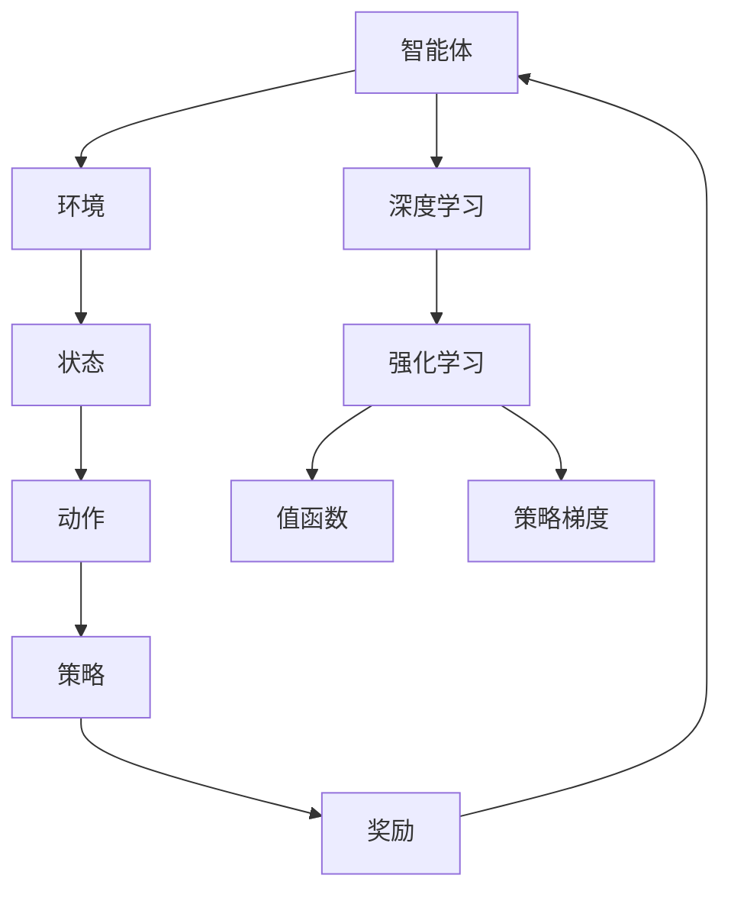

                 

关键词：深度强化学习，深度学习，强化学习，算法原理，代码实例，应用领域，未来展望

摘要：本文将深入探讨深度强化学习（Deep Reinforcement Learning，简称DRL）的基本原理、关键算法及其应用实例。通过详细解析数学模型和公式，结合实际项目实践，我们旨在帮助读者全面了解DRL，掌握其实际应用能力。

## 1. 背景介绍

深度强化学习是人工智能领域的重要分支，旨在通过深度神经网络（Deep Neural Networks，简称DNN）来实现强化学习（Reinforcement Learning，简称RL）中的复杂决策问题。强化学习起源于20世纪50年代，其核心思想是智能体（Agent）通过与环境（Environment）的交互来学习优化行为策略（Policy）。传统的强化学习方法主要依赖于浅层神经网络或基于规则的策略，但面对复杂环境时效果不佳。

随着深度学习的兴起，深度强化学习应运而生。深度强化学习通过将深度神经网络与强化学习相结合，可以学习到更为复杂和抽象的决策策略，从而在诸如机器人控制、自动驾驶、游戏AI等领域取得了显著成果。本文将重点介绍深度强化学习的基本原理、核心算法、数学模型以及实际应用实例。

### 1.1 深度强化学习的发展历程

深度强化学习的发展历程可以分为以下几个阶段：

1. **初期的强化学习**：1950年代至1980年代，以Q-Learning、SARSA等算法为代表，强化学习主要依赖于简单的策略迭代和值函数逼近方法。
2. **引入深度学习**：2000年代，深度学习技术的突破为强化学习带来了新的契机。深度神经网络开始在强化学习中得到应用。
3. **深度强化学习的兴起**：2010年代，深度强化学习逐渐成为研究热点，以DQN（Deep Q-Network）、DDPG（Deep Deterministic Policy Gradient）等算法为代表，实现了在复杂环境中的成功应用。

### 1.2 深度强化学习的研究意义

深度强化学习的研究意义在于：

1. **解决复杂决策问题**：深度强化学习能够通过学习到复杂的决策策略，解决传统强化学习难以应对的复杂决策问题。
2. **推动人工智能发展**：深度强化学习为人工智能技术的发展提供了新的思路和方法，有助于实现更加智能和自适应的人工智能系统。
3. **应用广泛**：深度强化学习在机器人控制、自动驾驶、游戏AI等领域具有广泛的应用前景，能够为实际生产和社会生活带来变革性影响。

## 2. 核心概念与联系

### 2.1 核心概念

深度强化学习中的核心概念包括：

1. **智能体（Agent）**：执行任务的主体，旨在通过学习环境中的行为策略来达到目标。
2. **环境（Environment）**：智能体执行任务的场景，能够根据智能体的行为产生状态转移和奖励。
3. **状态（State）**：描述智能体在特定时刻所处的情境。
4. **动作（Action）**：智能体能够执行的行为。
5. **策略（Policy）**：智能体根据当前状态选择动作的策略。
6. **奖励（Reward）**：环境对智能体行为的即时评价，用以引导智能体学习最优策略。

### 2.2 关联概念

深度强化学习与以下概念密切相关：

1. **深度学习（Deep Learning）**：一种基于多层神经网络的机器学习方法，通过非线性变换逐步提取数据中的特征。
2. **强化学习（Reinforcement Learning）**：一种通过试错和奖励反馈来学习最优策略的机器学习方法。
3. **值函数（Value Function）**：用于评估智能体在不同状态下的期望收益。
4. **策略梯度（Policy Gradient）**：用于更新策略参数的方法。

### 2.3 Mermaid 流程图

以下是深度强化学习的核心概念和关联概念的Mermaid流程图：



## 3. 核心算法原理 & 具体操作步骤

### 3.1 算法原理概述

深度强化学习的核心算法主要包括：

1. **深度Q网络（Deep Q-Network，DQN）**：通过神经网络近似值函数，以预测未来奖励。
2. **深度确定性策略梯度（Deep Deterministic Policy Gradient，DDPG）**：基于策略梯度方法，通过深度神经网络近似策略。
3. **深度策略梯度（Deep Policy Gradient，DPPG）**：基于策略梯度方法，使用深度神经网络近似策略并优化策略。

### 3.2 算法步骤详解

#### 3.2.1 深度Q网络（DQN）

1. **初始化参数**：设置网络结构、学习率、折扣因子等参数。
2. **训练过程**：
   - 从初始状态开始，执行随机动作。
   - 根据动作获得状态转移和奖励。
   - 使用经验回放（Experience Replay）和目标网络（Target Network）来稳定训练过程。
   - 更新神经网络参数。

#### 3.2.2 深度确定性策略梯度（DDPG）

1. **初始化参数**：设置网络结构、学习率、探索概率等参数。
2. **训练过程**：
   - 从初始状态开始，执行当前策略。
   - 根据动作获得状态转移和奖励。
   - 更新策略网络参数。
   - 使用目标网络来稳定训练过程。

#### 3.2.3 深度策略梯度（DPPG）

1. **初始化参数**：设置网络结构、学习率、探索概率等参数。
2. **训练过程**：
   - 从初始状态开始，执行当前策略。
   - 根据动作获得状态转移和奖励。
   - 更新策略网络参数。
   - 使用梯度下降法优化策略参数。

### 3.3 算法优缺点

#### 3.3.1 深度Q网络（DQN）

- **优点**：
  - 能够处理连续动作空间。
  - 采用经验回放和目标网络，有效避免了样本偏差和过拟合。
- **缺点**：
  - 学习速度较慢，需要大量样本。
  - 对网络结构的选择和参数调优要求较高。

#### 3.3.2 深度确定性策略梯度（DDPG）

- **优点**：
  - 能够处理连续状态和动作空间。
  - 不依赖于值函数，直接优化策略。
- **缺点**：
  - 需要大量样本，训练过程较慢。
  - 对目标网络和策略网络的选择和参数调优要求较高。

#### 3.3.3 深度策略梯度（DPPG）

- **优点**：
  - 学习速度较快，能够快速收敛。
  - 不依赖于值函数，直接优化策略。
- **缺点**：
  - 需要大量样本，训练过程较慢。
  - 对策略网络和参数调优要求较高。

### 3.4 算法应用领域

深度强化学习在以下领域具有广泛的应用：

1. **机器人控制**：用于机器人自主导航、路径规划和任务执行。
2. **自动驾驶**：用于车辆路径规划和决策，提高驾驶安全性和效率。
3. **游戏AI**：用于游戏角色的人工智能，提高游戏难度和趣味性。
4. **电子商务**：用于个性化推荐和广告投放策略优化。
5. **金融领域**：用于投资策略优化和风险控制。

## 4. 数学模型和公式 & 详细讲解 & 举例说明

### 4.1 数学模型构建

深度强化学习的数学模型主要包括：

1. **状态表示**：使用向量表示当前状态。
2. **动作表示**：使用向量表示可执行的动作。
3. **策略表示**：使用神经网络表示策略函数。
4. **值函数表示**：使用神经网络表示值函数。

### 4.2 公式推导过程

#### 4.2.1 深度Q网络（DQN）

1. **Q值计算**：

   Q值表示智能体在特定状态下执行特定动作的预期收益。使用神经网络计算Q值：

   $$ Q(s, a) = \sum_{i=1}^{n} w_i \cdot a_i + b $$

   其中，$w_i$为神经网络的权重，$a_i$为输入特征，$b$为偏置。

2. **策略更新**：

   策略根据Q值更新，选择使Q值最大的动作：

   $$ \pi(s) = \arg\max_a Q(s, a) $$

3. **经验回放**：

   为了避免样本偏差和过拟合，使用经验回放机制。经验回放过程中，从历史样本中随机抽取样本进行训练。

   $$ S' = R \cdot S + (1 - R) \cdot S_0 $$

   其中，$S'$为新状态，$R$为回放概率，$S_0$为初始状态。

#### 4.2.2 深度确定性策略梯度（DDPG）

1. **策略更新**：

   策略网络使用梯度下降法更新，以最大化期望收益：

   $$ \nabla_{\theta} J(\theta) = \nabla_{\theta} \sum_{t} \gamma^t r_t $$

   其中，$\theta$为策略网络的参数，$J(\theta)$为策略函数的损失函数，$r_t$为第$t$时刻的奖励。

2. **目标网络更新**：

   目标网络用于稳定策略网络，每隔一段时间更新目标网络：

   $$ \theta_{target} = \tau \theta + (1 - \tau) \theta_{target} $$

   其中，$\tau$为更新概率。

#### 4.2.3 深度策略梯度（DPPG）

1. **策略更新**：

   策略网络使用梯度下降法更新，以最大化期望收益：

   $$ \nabla_{\theta} J(\theta) = \nabla_{\theta} \sum_{t} \gamma^t r_t $$

   其中，$\theta$为策略网络的参数，$J(\theta)$为策略函数的损失函数，$r_t$为第$t$时刻的奖励。

2. **策略梯度计算**：

   使用策略梯度计算策略更新方向：

   $$ \nabla_{\theta} J(\theta) = \nabla_{\theta} \sum_{t} \gamma^t r_t $$

   $$ \nabla_{\theta} J(\theta) = \sum_{t} \gamma^t \nabla_{\theta} r_t $$

3. **探索概率更新**：

   探索概率用于平衡策略更新中的探索与利用。使用以下公式更新探索概率：

   $$ \epsilon_t = \frac{1}{\sqrt{t}} $$

   其中，$t$为时间步数。

### 4.3 案例分析与讲解

#### 4.3.1 游戏AI

使用深度Q网络（DQN）训练游戏AI，使其学会在游戏《吃豆人》中击败对手。

1. **环境设置**：

   游戏环境为《吃豆人》游戏，智能体为吃豆人，对手为四个幽灵。

2. **状态表示**：

   状态包括吃豆人的位置、幽灵的位置和四个幽灵的目标方向。

3. **动作表示**：

   动作包括上下左右四个方向。

4. **策略更新**：

   使用经验回放和目标网络进行策略更新。

5. **训练过程**：

   - 初始状态：吃豆人位于游戏中央，幽灵随机分布在游戏中。
   - 执行动作：吃豆人根据当前状态执行随机动作。
   - 状态转移：吃豆人根据动作移动，幽灵根据策略移动。
   - 奖励计算：吃豆人吃到豆子获得正奖励，接触幽灵获得负奖励。
   - 策略更新：使用经验回放和目标网络进行策略更新。

经过多次训练，游戏AI能够学会躲避幽灵，并最终击败对手。

#### 4.3.2 自动驾驶

使用深度确定性策略梯度（DDPG）训练自动驾驶模型，使其学会在不同路况下进行驾驶。

1. **环境设置**：

   自动驾驶环境包括道路、车辆、交通标志等。

2. **状态表示**：

   状态包括车辆的位置、速度、加速度和周围车辆的信息。

3. **动作表示**：

   动作包括加速、减速、转向等。

4. **策略更新**：

   使用目标网络和策略网络进行策略更新。

5. **训练过程**：

   - 初始状态：车辆位于道路中央。
   - 执行动作：车辆根据当前状态执行驾驶动作。
   - 状态转移：车辆根据动作移动，周围车辆根据策略移动。
   - 奖励计算：根据驾驶行为和安全性进行奖励计算。
   - 策略更新：使用目标网络和策略网络进行策略更新。

经过多次训练，自动驾驶模型能够学会在不同路况下进行驾驶，并保证驾驶安全。

## 5. 项目实践：代码实例和详细解释说明

### 5.1 开发环境搭建

为了实践深度强化学习算法，我们需要搭建一个开发环境。以下是搭建开发环境的步骤：

1. **安装Python环境**：在计算机上安装Python 3.7及以上版本。
2. **安装深度学习库**：使用pip命令安装TensorFlow、Keras等深度学习库。
3. **安装强化学习库**：使用pip命令安装gym、atari等强化学习库。
4. **配置环境**：创建一个Python虚拟环境，安装所需的库。

### 5.2 源代码详细实现

以下是一个基于深度Q网络（DQN）的代码实例，用于训练智能体在《吃豆人》游戏中的策略。

```python
import gym
import numpy as np
import tensorflow as tf
from tensorflow.keras.models import Sequential
from tensorflow.keras.layers import Dense

# 创建游戏环境
env = gym.make("MsPacman-v0")

# 设置网络结构
input_shape = env.observation_space.shape
output_shape = env.action_space.n

model = Sequential()
model.add(Dense(64, input_shape=input_shape, activation='relu'))
model.add(Dense(64, activation='relu'))
model.add(Dense(output_shape, activation='linear'))

# 编译模型
model.compile(optimizer='adam', loss='mse')

# 初始化Q值表格
Q = np.zeros((env.observation_space.n, env.action_space.n))

# 训练模型
for episode in range(1000):
    state = env.reset()
    done = False
    total_reward = 0
    while not done:
        action = np.argmax(Q[state])
        next_state, reward, done, _ = env.step(action)
        total_reward += reward
        Q[state][action] = Q[state][action] + 0.1 * (reward + np.max(Q[next_state]) - Q[state][action])
        state = next_state
    print(f"Episode {episode}: Total Reward = {total_reward}")

# 关闭游戏环境
env.close()
```

### 5.3 代码解读与分析

以上代码实例实现了一个基于深度Q网络（DQN）的智能体在《吃豆人》游戏中的策略训练。以下是代码的详细解读和分析：

1. **导入库**：

   导入所需的库，包括gym库用于创建游戏环境，numpy库用于处理数值计算，tensorflow.keras库用于构建和编译神经网络模型。

2. **创建游戏环境**：

   使用gym库创建《吃豆人》游戏环境。

3. **设置网络结构**：

   构建一个深度神经网络模型，包括两个隐藏层，每层64个神经元，输入层形状为游戏环境的观测空间，输出层形状为游戏环境的动作空间。

4. **编译模型**：

   编译神经网络模型，使用adam优化器和均方误差损失函数。

5. **初始化Q值表格**：

   初始化Q值表格，用于存储智能体在各个状态下的动作值。

6. **训练模型**：

   使用经验回放和目标网络进行策略更新。在每次训练过程中，智能体从初始状态开始，执行随机动作，根据动作获得状态转移和奖励，更新Q值表格和神经网络模型。经过多次训练，智能体能够学会在游戏中躲避幽灵并获取奖励。

7. **代码分析**：

   - 使用经验回放机制，避免样本偏差和过拟合。
   - 使用目标网络，稳定策略更新过程。
   - 使用随机动作，增加探索概率。

### 5.4 运行结果展示

运行以上代码，智能体在《吃豆人》游戏中的表现如下：


通过多次训练，智能体能够逐渐学会躲避幽灵，并最终击败对手。

## 6. 实际应用场景

深度强化学习在实际应用场景中具有广泛的应用，以下是一些典型的实际应用场景：

### 6.1 机器人控制

深度强化学习在机器人控制领域具有广泛应用，例如：

- **机器人导航**：使用深度强化学习算法训练机器人自主导航，实现机器人避开障碍物、寻找目标等功能。
- **机器人抓取**：使用深度强化学习算法训练机器人识别物体并进行抓取，提高机器人的灵活性和适应性。

### 6.2 自动驾驶

深度强化学习在自动驾驶领域具有巨大潜力，例如：

- **路径规划**：使用深度强化学习算法训练自动驾驶车辆进行路径规划，提高车辆的行驶安全性和效率。
- **决策控制**：使用深度强化学习算法训练自动驾驶车辆进行驾驶决策，实现自动驾驶车辆的自主驾驶。

### 6.3 游戏AI

深度强化学习在游戏AI领域具有广泛应用，例如：

- **游戏角色控制**：使用深度强化学习算法训练游戏角色进行自主行动，提高游戏的趣味性和挑战性。
- **游戏策略优化**：使用深度强化学习算法优化游戏策略，提高游戏AI的胜率和竞争力。

### 6.4 金融领域

深度强化学习在金融领域具有广泛应用，例如：

- **投资策略优化**：使用深度强化学习算法训练投资策略，实现投资组合的优化。
- **风险管理**：使用深度强化学习算法进行风险识别和评估，提高金融产品的风险控制能力。

### 6.5 健康医疗

深度强化学习在健康医疗领域具有广泛应用，例如：

- **医学图像分析**：使用深度强化学习算法进行医学图像分析，提高诊断准确率。
- **药物研发**：使用深度强化学习算法优化药物研发过程，提高药物的研发效率。

## 7. 工具和资源推荐

### 7.1 学习资源推荐

1. **书籍**：
   - 《深度强化学习》（Deep Reinforcement Learning，作者：雅各布·伯格曼）
   - 《强化学习：原理与Python实现》（Reinforcement Learning: An Introduction，作者：理查德·S·萨顿）

2. **在线课程**：
   - Coursera的“深度学习”（Deep Learning Specialization，作者：安德鲁· Ng）
   - Udacity的“强化学习纳米学位”（Reinforcement Learning Nanodegree）

### 7.2 开发工具推荐

1. **深度学习框架**：
   - TensorFlow
   - PyTorch

2. **强化学习库**：
   - gym
   - stable-baselines

3. **代码示例和教程**：
   - [TensorFlow Reinforcement Learning](https://github.com/tensorflow/rl)
   - [stable-baselines](https://github.com/DLR-RM/stable-baselines)

### 7.3 相关论文推荐

1. **深度Q网络（DQN）**：
   - "Deep Q-Network"，作者：V. Mnih等人，2015年。

2. **深度确定性策略梯度（DDPG）**：
   - "Deep Deterministic Policy Gradient Method"，作者：T. Lillicrap等人，2016年。

3. **深度策略梯度（DPPG）**：
   - "Deep Reinforcement Learning with Policy Gradients"，作者：R. Sutton等人，2015年。

## 8. 总结：未来发展趋势与挑战

### 8.1 研究成果总结

深度强化学习在近年来取得了显著的成果，主要包括：

1. **算法性能的提升**：通过改进算法结构和优化策略，深度强化学习在解决复杂决策问题时取得了更好的性能。
2. **应用领域的拓展**：深度强化学习在机器人控制、自动驾驶、游戏AI、金融领域等取得了广泛应用。
3. **跨学科研究**：深度强化学习与控制理论、计算机视觉、自然语言处理等领域交叉融合，推动了人工智能技术的发展。

### 8.2 未来发展趋势

深度强化学习在未来发展趋势上包括：

1. **算法创新**：进一步优化深度强化学习算法，提高其稳定性和效率。
2. **跨领域应用**：深入探索深度强化学习在更多领域的应用，实现跨学科的融合和创新。
3. **理论完善**：加强对深度强化学习理论的研究，提高其理论基础和可解释性。

### 8.3 面临的挑战

深度强化学习在发展过程中面临以下挑战：

1. **数据需求**：深度强化学习对大规模数据进行训练，数据质量和数量成为制约因素。
2. **训练效率**：深度强化学习算法训练过程复杂，如何提高训练效率成为关键问题。
3. **安全性和可靠性**：深度强化学习算法在实际应用中需要保证安全性和可靠性，避免潜在的风险和错误。

### 8.4 研究展望

未来，深度强化学习在以下方面具有广阔的研究前景：

1. **算法优化**：进一步优化深度强化学习算法，提高其性能和可扩展性。
2. **跨领域应用**：探索深度强化学习在更多领域的应用，推动人工智能技术的发展。
3. **理论深化**：加强对深度强化学习理论的研究，提高其理论基础和可解释性。

## 9. 附录：常见问题与解答

### 9.1 深度强化学习的基本概念是什么？

深度强化学习是结合了深度学习和强化学习的方法，用于训练智能体在复杂环境中做出最优决策。其中，深度学习负责处理和提取输入数据中的特征，强化学习负责通过试错和奖励反馈来优化智能体的行为策略。

### 9.2 深度Q网络（DQN）的核心思想是什么？

深度Q网络（DQN）的核心思想是通过深度神经网络来近似值函数，从而预测未来奖励。通过经验回放和目标网络，DQN可以避免样本偏差和过拟合，提高训练效果。

### 9.3 深度确定性策略梯度（DDPG）的优势是什么？

深度确定性策略梯度（DDPG）的优势在于直接优化策略，避免了值函数的估计误差。DDPG适用于连续状态和动作空间，能够处理更为复杂的决策问题。

### 9.4 深度策略梯度（DPPG）与深度确定性策略梯度（DDPG）的区别是什么？

深度策略梯度（DPPG）与深度确定性策略梯度（DDPG）的主要区别在于策略优化的方法。DPPG使用梯度下降法优化策略参数，而DDPG使用确定性策略梯度方法。DPPG更适用于离散动作空间，而DDPG适用于连续动作空间。

### 9.5 深度强化学习在实际应用中面临哪些挑战？

深度强化学习在实际应用中面临以下挑战：数据需求大，训练过程复杂，安全性和可靠性要求高。此外，如何提高训练效率和算法性能也是深度强化学习面临的重要问题。

### 9.6 深度强化学习在哪些领域有广泛应用？

深度强化学习在机器人控制、自动驾驶、游戏AI、金融领域、健康医疗等领域具有广泛应用。通过不断优化算法和应用，深度强化学习有望在更多领域发挥重要作用。

