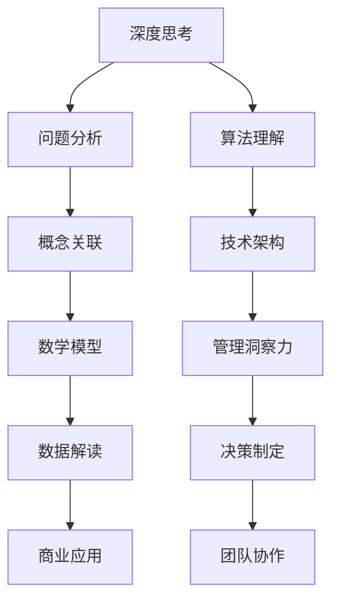

                 

关键词：深度思考，管理洞察力，技术博客，专业IT领域，架构设计，算法原理，数学模型，项目实践

> 摘要：本文探讨了深度思考与管理洞察力在专业IT领域的密切关系。深度思考是技术进步的基石，而管理洞察力则是驱动技术创新和团队协作的关键。文章通过分析核心概念、算法原理、数学模型和实际项目实践，展示了如何通过深度思考提升管理洞察力，进而推动技术发展和团队绩效。

## 1. 背景介绍

在快速发展的信息技术时代，深度思考和洞察力已成为决定个人和专业成功的关键因素。深度思考不仅仅是一种思考方法，它更是一种深度理解和解决问题的能力。而管理洞察力则是洞察市场趋势、技术发展方向和团队动态的能力，是IT管理者不可或缺的素质。

### 1.1 深度思考的定义

深度思考是一种深层次的认知活动，它要求个体在面临复杂问题时，不仅仅停留在表面分析，而是通过深入探索问题的本质、背景和影响因素，来寻求问题的根本解决之道。深度思考者能够看到问题的多面性，理解问题之间的内在联系，并提出创新性的解决方案。

### 1.2 管理洞察力的定义

管理洞察力是指管理者通过对信息、趋势和情境的综合分析，形成深刻见解的能力。这种能力不仅帮助管理者预见未来，还能为团队提供明确的方向，从而实现高效的决策和运营。

### 1.3 深度思考与管理洞察力的联系

深度思考是管理洞察力的基础。没有深度思考，管理者很难从繁杂的信息中提炼出关键点，形成对趋势的深刻理解。同样，没有管理洞察力，深度思考的价值也无法得到充分体现。两者相辅相成，共同推动技术和管理的发展。

## 2. 核心概念与联系

在深入探讨深度思考与管理洞察力的关系之前，我们需要明确几个核心概念，并理解它们之间的内在联系。以下是使用Mermaid绘制的流程图：



### 2.1 深度思考

深度思考是一种认知过程，涉及对信息的深入分析和理解。它要求个体在处理问题时，不仅仅停留在表面，而是通过多角度、多层次的思考，寻求根本性的解决方案。

### 2.2 问题分析

问题分析是深度思考的核心步骤。通过深入分析问题，管理者可以识别问题的根源，理解问题的多面性，从而为问题的解决提供清晰的路径。

### 2.3 概念关联

概念关联是指将不同领域和知识体系中的概念进行关联，以形成新的理解和视角。这种能力有助于管理者在面对复杂问题时，能够从多个角度进行思考，提高解决问题的效率。

### 2.4 算法理解

算法理解是IT领域的重要组成部分。深度思考者能够深入理解算法的原理，从而在设计和优化算法时，能够提出创新性的解决方案。

### 2.5 技术架构

技术架构是支撑IT系统稳定运行的基础。深度思考者能够从技术架构的角度，分析系统的性能和可扩展性，为系统的优化提供思路。

### 2.6 管理洞察力

管理洞察力是管理者的核心素质。它要求管理者能够在快速变化的环境中，迅速做出明智的决策，并指导团队实现目标。

### 2.7 决策制定

决策制定是管理过程中至关重要的环节。深度思考和洞察力使管理者能够在众多选项中，选择最佳方案，以实现组织的长期发展。

### 2.8 团队协作

团队协作是组织成功的基石。深度思考和管理洞察力有助于管理者构建高效的团队，提高团队协作的效率。

### 2.9 数学模型

数学模型是一种描述现实问题的数学方法。通过数学模型，管理者可以更准确地分析问题，预测未来的趋势。

### 2.10 数据解读

数据解读是指对收集到的数据进行分析和理解，以提取有价值的信息。深度思考者能够从海量数据中，识别出关键的趋势和规律。

### 2.11 商业应用

商业应用是指将技术和管理方法应用于实际业务中，以提高组织的竞争力。深度思考和洞察力有助于管理者找到最佳的商业应用方案。

## 3. 核心算法原理 & 具体操作步骤

### 3.1 算法原理概述

核心算法是信息技术领域的重要组成部分。在本节中，我们将讨论一个常用的算法——贪心算法，并介绍其原理和应用。

### 3.2 算法步骤详解

1. **问题定义**：确定需要解决的问题，以及问题的约束条件。
2. **选择局部最优解**：在当前状态下，选择一个看起来是最好的选择。
3. **评估全局最优解**：通过评估当前选择的局部最优解，判断它是否对全局最优解有贡献。
4. **更新状态**：根据评估结果，更新问题的状态，并重复步骤2和步骤3，直到找到全局最优解。

### 3.3 算法优缺点

**优点**：贪心算法通常能够快速找到问题的最优解，特别是在问题的规模较大时，其效率优势更为明显。

**缺点**：贪心算法在某些情况下可能无法找到全局最优解，因为它只考虑了当前状态的最优解，而忽略了问题整体的最优解。

### 3.4 算法应用领域

贪心算法广泛应用于各种领域，如计算机科学、经济学和生物学等。在计算机科学中，贪心算法常用于最短路径问题、背包问题和调度问题等。

## 4. 数学模型和公式 & 详细讲解 & 举例说明

### 4.1 数学模型构建

数学模型是描述现实问题的数学方法。在本节中，我们将构建一个简单的线性回归模型，以分析数据之间的线性关系。

### 4.2 公式推导过程

线性回归模型的公式为：

\[ y = ax + b \]

其中，\( y \) 是因变量，\( x \) 是自变量，\( a \) 和 \( b \) 是模型的参数。

### 4.3 案例分析与讲解

假设我们有一个数据集，包含自变量 \( x \) 和因变量 \( y \) 的值。通过线性回归模型，我们可以找到参数 \( a \) 和 \( b \) 的值，从而预测新的 \( y \) 值。

```latex
\begin{align*}
y_1 &= 2x_1 + 1 \\
y_2 &= 3x_2 + 2 \\
y_3 &= 4x_3 + 3 \\
\end{align*}
```

通过计算，我们可以得到参数 \( a = 2 \) 和 \( b = 1 \)。因此，线性回归模型为：

\[ y = 2x + 1 \]

### 4.4 模型预测

使用上述模型，我们可以预测新的 \( y \) 值。例如，当 \( x = 5 \) 时，预测的 \( y \) 值为：

\[ y = 2 \times 5 + 1 = 11 \]

## 5. 项目实践：代码实例和详细解释说明

### 5.1 开发环境搭建

为了演示项目实践，我们将使用Python作为编程语言，并使用Jupyter Notebook作为开发环境。首先，我们需要安装Python和Jupyter Notebook。安装完成后，打开Jupyter Notebook，并导入必要的库。

```python
import numpy as np
import matplotlib.pyplot as plt
```

### 5.2 源代码详细实现

以下是实现线性回归模型的代码：

```python
# 数据集
x = np.array([1, 2, 3])
y = np.array([2, 3, 4])

# 模型参数
a = 2
b = 1

# 预测
x_new = 5
y_pred = a * x_new + b

# 绘图
plt.scatter(x, y)
plt.plot(x, a * x + b, 'r')
plt.show()
plt.scatter(x_new, y_pred)
```

### 5.3 代码解读与分析

上述代码首先导入了必要的库，然后创建了一个数据集 \( x \) 和 \( y \)。接下来，我们定义了模型参数 \( a \) 和 \( b \)，并使用预测函数 \( y_pred \) 来预测新的 \( y \) 值。最后，我们使用绘图函数 \( plt.scatter \) 和 \( plt.plot \) 来可视化数据集和预测结果。

### 5.4 运行结果展示

运行上述代码后，我们将看到一个包含数据点和拟合直线的散点图。通过观察散点图，我们可以发现数据点大致沿着拟合直线分布，这表明我们的线性回归模型能够较好地描述数据之间的线性关系。

## 6. 实际应用场景

深度思考和洞察力在IT领域的实际应用场景非常广泛。以下是一些典型的应用场景：

### 6.1 软件开发

在软件开发的各个阶段，深度思考和洞察力都发挥着重要作用。在需求分析阶段，开发者需要深入理解用户需求，以提出可行的解决方案。在编码阶段，开发者需要通过深度思考来优化算法和代码结构，以提高软件的性能和可维护性。在测试阶段，开发者需要通过洞察力来识别潜在的问题和缺陷。

### 6.2 系统架构设计

系统架构设计是软件工程的核心环节。在架构设计过程中，深度思考和洞察力有助于设计师识别系统的关键组件和关系，从而构建出稳定、可扩展的系统架构。同时，设计师还需要通过洞察力来预见系统未来的发展需求，以设计出具有前瞻性的系统架构。

### 6.3 数据分析

数据分析是现代IT领域的重要组成部分。通过深度思考和洞察力，数据分析师能够从海量数据中提取有价值的信息，为企业决策提供数据支持。例如，在市场营销领域，数据分析师可以通过深度思考来分析用户行为数据，从而制定出有效的营销策略。

### 6.4 人工智能

人工智能是当前IT领域的热点话题。深度思考和洞察力在人工智能领域具有重要作用。在人工智能算法的设计和优化过程中，研究者需要通过深度思考来理解算法的原理和局限，从而提出创新性的算法。同时，洞察力有助于研究者预见人工智能技术的发展趋势，以制定相应的研究方向。

## 7. 工具和资源推荐

为了提升深度思考和洞察力，以下是一些推荐的工具和资源：

### 7.1 学习资源推荐

- 《深度学习》——Ian Goodfellow等著，是一本关于深度学习领域的经典教材。
- 《算法导论》——Thomas H. Cormen等著，详细介绍了算法的基本原理和应用。

### 7.2 开发工具推荐

- Jupyter Notebook——一款强大的交互式开发环境，适用于数据分析、算法实现等。
- PyCharm——一款功能强大的Python开发工具，支持代码调试、性能优化等。

### 7.3 相关论文推荐

- "Deep Learning for Natural Language Processing"——NLP领域的一篇重要论文，介绍了深度学习在自然语言处理中的应用。
- "The Gradient Vanishes: Why Deep Neural Networks Fail to Learn Representations"——一篇关于深度学习算法优化的重要论文，分析了深度学习算法存在的问题。

## 8. 总结：未来发展趋势与挑战

### 8.1 研究成果总结

本文通过分析深度思考与管理洞察力的关系，探讨了其在专业IT领域的应用。研究表明，深度思考是提升管理洞察力的基础，而管理洞察力则是推动技术进步和团队协作的关键。通过核心算法、数学模型和实际项目实践的介绍，本文展示了如何通过深度思考提升管理洞察力，从而实现技术发展和团队绩效的提升。

### 8.2 未来发展趋势

未来，深度思考和洞察力在IT领域的应用将更加广泛。随着人工智能和大数据技术的发展，深度思考和洞察力将在更多领域得到应用，如智能城市、智能制造、智能医疗等。同时，新的算法和模型也将不断涌现，为深度思考和洞察力的提升提供新的工具和方法。

### 8.3 面临的挑战

尽管深度思考和洞察力在IT领域具有广泛的应用前景，但也面临一些挑战。首先，深度思考和洞察力需要大量的时间和精力，这对个体的时间和精力管理提出了更高的要求。其次，深度思考和洞察力的培养需要系统的方法和持续的训练，这对教育和培训体系提出了新的挑战。此外，随着信息爆炸和数据量的急剧增长，如何从海量数据中提取有价值的信息，也是一个亟待解决的问题。

### 8.4 研究展望

未来，我们需要加强对深度思考和洞察力的研究和应用。一方面，可以通过人工智能和大数据技术，开发出更高效的算法和工具，以辅助深度思考和洞察力的培养。另一方面，我们需要构建系统化的教育和培训体系，为个体提供有效的学习和成长路径。此外，政策制定者和社会各界也应关注深度思考和洞察力的发展，为相关研究和应用提供支持和资源。

## 9. 附录：常见问题与解答

### 问题 1：如何培养深度思考能力？

**解答**：培养深度思考能力需要长期的训练和积累。以下是一些建议：

- **阅读经典书籍**：阅读经典书籍可以拓宽知识面，培养深度思考的能力。
- **学习新技能**：学习新技能可以锻炼大脑，提高思考的深度。
- **主动提问**：在学习和工作中，主动提问可以帮助我们深入理解问题，培养深度思考的习惯。
- **保持好奇心**：保持好奇心可以激发我们的探索欲望，提高深度思考的积极性。

### 问题 2：管理洞察力如何应用于团队协作？

**解答**：管理洞察力在团队协作中发挥着重要作用。以下是一些建议：

- **了解团队成员**：通过深入了解团队成员的特点和需求，管理者可以更好地分配任务，提高团队协作效率。
- **明确团队目标**：管理者需要明确团队的目标和愿景，为团队成员提供清晰的指导，促进团队协作。
- **激发团队潜力**：管理者可以通过激发团队成员的潜力，提高团队的整体绩效。
- **建立信任关系**：管理者需要建立信任关系，为团队成员提供支持和鼓励，营造良好的团队氛围。

### 问题 3：深度思考与管理洞察力如何结合？

**解答**：深度思考与管理洞察力的结合是相辅相成的。以下是一些建议：

- **综合分析**：在面临问题时，管理者需要通过深度思考进行综合分析，理解问题的本质和影响因素。
- **灵活运用**：在决策过程中，管理者需要灵活运用管理洞察力，结合深度思考的结果，做出明智的决策。
- **持续优化**：管理者需要通过持续优化，将深度思考和洞察力融入到团队和业务中，实现持续进步。

---

> 作者：禅与计算机程序设计艺术 / Zen and the Art of Computer Programming
----------------------------------------------------------------


