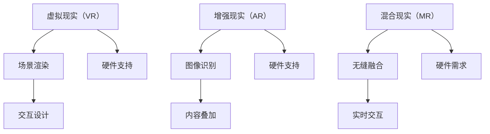

                 

关键词：混合现实（MR），虚拟现实（VR），增强现实（AR），人工智能，技术创新，跨领域应用，交互设计，硬件开发，用户体验

> 摘要：本文深入探讨了混合现实（MR）技术作为新兴领域，其在虚拟现实（VR）和增强现实（AR）的基础上所展现出的强大潜力和创新特性。文章从背景介绍、核心概念与联系、核心算法原理、数学模型与公式、项目实践、实际应用场景、工具和资源推荐以及未来发展趋势与挑战等多个角度，全面解析了MR技术的现状、发展及未来可能面临的挑战。

## 1. 背景介绍

混合现实（Mixed Reality，简称MR）是一种将虚拟世界与现实世界融合的技术。它不仅包含了增强现实（AR）的增强功能，也包含了虚拟现实（VR）的沉浸感。MR技术通过特殊的显示设备，如头戴式显示器、智能眼镜等，将数字内容与现实环境无缝融合，创造出一种新的交互和体验方式。

MR技术的发展可以追溯到上世纪80年代，当时研究者们就开始探索如何将计算机生成的虚拟对象与现实环境相结合。随着计算机处理能力、显示技术和传感器的不断进步，MR技术逐渐走向成熟，并开始应用在医疗、教育、娱乐、工业制造等多个领域。

### 1.1 历史发展

- **1980年代**：VR和AR的概念相继提出，MR技术初步探索。
- **2000年代**：随着硬件和软件技术的发展，MR技术开始应用于实际场景。
- **2010年代**：Oculus、Microsoft HoloLens等MR设备的推出，标志着MR技术进入大众视野。
- **2020年代**：MR技术持续演进，应用领域不断扩大，产业链逐渐完善。

### 1.2 现状

目前，MR技术已经成为科技界关注的焦点。许多公司和研究机构都在积极探索MR技术的应用，希望通过MR技术提升用户体验、创造新的商业模式。以下是MR技术的一些重要应用现状：

- **医疗领域**：MR技术在手术模拟、病人教育、远程医疗等方面发挥了重要作用。
- **教育领域**：MR技术为学生提供了更加生动、直观的学习体验。
- **娱乐领域**：MR技术为游戏和电影产业带来了全新的沉浸式体验。
- **工业制造**：MR技术帮助工程师进行产品设计和制造过程中的实时监控和指导。

## 2. 核心概念与联系

### 2.1 虚拟现实（VR）

虚拟现实（VR）是一种通过计算机模拟出来的三维虚拟环境，用户可以通过头戴式显示器等设备进入这个虚拟世界，体验到强烈的沉浸感。VR技术主要通过以下几个方面实现：

- **场景渲染**：计算机生成的三维虚拟环境通过图形处理单元（GPU）渲染。
- **交互设计**：用户通过手柄、手势、语音等方式与虚拟环境进行交互。
- **硬件支持**：高性能的显卡、处理器和传感器提供稳定的运行环境。

### 2.2 增强现实（AR）

增强现实（AR）技术通过将数字内容叠加到现实环境中，使用户能够看到增强后的现实世界。AR技术主要实现方式如下：

- **图像识别**：计算机通过摄像头捕捉现实环境，并使用图像处理算法进行识别。
- **内容叠加**：计算机生成的数字内容以动画、文字或三维模型的形式叠加到现实环境中。
- **硬件支持**：智能手机、平板电脑等设备搭载的摄像头和显示屏幕提供AR体验。

### 2.3 混合现实（MR）

混合现实（MR）技术是VR和AR技术的结合体，它通过特殊的显示设备和算法，将虚拟内容与现实环境无缝融合。MR技术的核心概念和联系包括：

- **无缝融合**：虚拟内容与现实环境无缝融合，用户可以看到虚拟对象与现实环境同时存在。
- **实时交互**：用户可以通过手势、语音等方式与虚拟内容进行实时交互。
- **硬件需求**：特殊的显示设备（如头戴式显示器、智能眼镜）和高性能的计算平台是MR技术的基础。

### 2.4 Mermaid 流程图

下面是一个简单的Mermaid流程图，展示了MR技术的核心概念和联系：



## 3. 核心算法原理 & 具体操作步骤

### 3.1 算法原理概述

MR技术的核心算法主要涉及场景渲染、图像识别、内容叠加和实时交互等方面。以下是对这些算法原理的概述：

- **场景渲染**：利用计算机图形学技术，生成三维虚拟场景。算法主要包括几何建模、纹理映射、光照计算等。
- **图像识别**：通过计算机视觉算法，识别现实环境中的物体或场景。常用的算法有深度学习模型、特征匹配等。
- **内容叠加**：将计算机生成的虚拟内容以合适的形式叠加到现实环境中。算法包括图像融合、视觉效果优化等。
- **实时交互**：用户通过手势、语音等方式与虚拟内容进行交互，算法涉及手势识别、语音识别、自然语言处理等。

### 3.2 算法步骤详解

下面是一个简单的MR算法流程：

1. **场景渲染**：首先，根据用户需求和场景信息，生成三维虚拟场景。这个过程涉及到几何建模、纹理映射、光照计算等步骤。
   
2. **图像识别**：通过摄像头捕捉现实环境，并使用计算机视觉算法进行图像识别。算法可以选择深度学习模型或者特征匹配等方法。

3. **内容叠加**：根据图像识别的结果，将虚拟内容叠加到现实环境中。这个过程涉及到图像融合、视觉效果优化等算法。

4. **实时交互**：用户通过手势、语音等方式与虚拟内容进行交互。算法需要识别用户的手势和语音，并生成相应的反馈。

### 3.3 算法优缺点

- **优点**：MR技术能够将虚拟内容与现实环境无缝融合，提供更加真实和沉浸的体验。同时，MR技术可以支持多种交互方式，如手势、语音等，提高了用户的交互体验。
- **缺点**：MR技术对硬件设备的要求较高，需要高性能的计算平台和特殊的显示设备。此外，图像识别和内容叠加的算法复杂度较高，对计算资源和算法优化提出了挑战。

### 3.4 算法应用领域

MR技术的核心算法广泛应用于多个领域：

- **医疗领域**：MR技术在手术模拟、病人教育、远程医疗等方面发挥了重要作用。
- **教育领域**：MR技术为学生提供了更加生动、直观的学习体验。
- **娱乐领域**：MR技术为游戏和电影产业带来了全新的沉浸式体验。
- **工业制造**：MR技术帮助工程师进行产品设计和制造过程中的实时监控和指导。

## 4. 数学模型和公式 & 详细讲解 & 举例说明

### 4.1 数学模型构建

在MR技术中，数学模型主要用于场景渲染、图像识别和内容叠加等过程。以下是一个简单的数学模型示例：

假设有一个三维虚拟场景，其中包含多个物体。我们可以使用以下数学模型来表示：

- **场景渲染**：  
  场景中的每个物体可以用一个三维模型表示，该模型由顶点、面和纹理组成。  
  渲染过程可以表示为：  
  $$R(\theta, \varphi) = M \cdot V$$  
  其中，$\theta$ 和 $\varphi$ 分别表示相机位置和方向，$M$ 是变换矩阵，$V$ 是物体顶点坐标。

- **图像识别**：  
  图像识别过程可以看作是特征匹配问题。  
  假设有一个目标图像 $I_t$ 和一组候选图像 $I_c$，我们可以使用以下公式计算匹配得分：  
  $$S = \sum_{i=1}^{n} w_i \cdot d(i)$$  
  其中，$w_i$ 是权重，$d(i)$ 是候选图像与目标图像的相似度度量。

- **内容叠加**：  
  内容叠加过程可以看作是图像融合问题。  
  假设有一个背景图像 $B$ 和一个前景图像 $F$，我们可以使用以下公式进行图像融合：  
  $$O = \alpha \cdot B + (1 - \alpha) \cdot F$$  
  其中，$\alpha$ 是融合系数，表示前景图像的透明度。

### 4.2 公式推导过程

以下是对上述数学模型的推导过程：

- **场景渲染**：  
  假设相机位置和方向分别为 $\theta$ 和 $\varphi$，物体顶点坐标为 $V$，我们可以使用旋转矩阵 $R$ 和平移矩阵 $T$ 来进行变换。  
  旋转矩阵 $R$ 可以表示为：  
  $$R = \begin{bmatrix} 
    \cos(\theta) & -\sin(\theta) \\
    \sin(\theta) & \cos(\theta)
  \end{bmatrix}$$  
  平移矩阵 $T$ 可以表示为：  
  $$T = \begin{bmatrix} 
    0 & 0 & \varphi \\
    0 & 0 & -\theta \\
    1 & 1 & 1
  \end{bmatrix}$$  
  将旋转矩阵 $R$ 和平移矩阵 $T$ 相乘，得到变换矩阵 $M$：  
  $$M = R \cdot T$$  
  将变换矩阵 $M$ 应用于物体顶点坐标 $V$，得到渲染后的顶点坐标：  
  $$R(\theta, \varphi) = M \cdot V$$

- **图像识别**：  
  假设目标图像 $I_t$ 和候选图像 $I_c$ 的像素值分别为 $I_{t,x}$ 和 $I_{c,x}$，我们可以使用以下公式计算相似度度量 $d(i)$：  
  $$d(i) = \sum_{x=1}^{n} (I_{t,x} - I_{c,x})^2$$  
  其中，$n$ 是像素点的数量。  
  为了计算匹配得分 $S$，我们需要为每个候选图像分配权重 $w_i$，然后计算加权相似度度量：  
  $$S = \sum_{i=1}^{n} w_i \cdot d(i)$$

- **内容叠加**：  
  假设背景图像 $B$ 和前景图像 $F$ 的像素值分别为 $B_x$ 和 $F_x$，我们可以使用以下公式计算融合后的像素值 $O_x$：  
  $$O_x = \alpha \cdot B_x + (1 - \alpha) \cdot F_x$$  
  其中，$\alpha$ 是融合系数，表示前景图像的透明度。  
  为了实现图像融合，我们需要遍历背景图像和前景图像的每个像素点，并计算相应的融合后的像素值。

### 4.3 案例分析与讲解

以下是一个简单的案例，用于说明如何使用上述数学模型进行MR技术应用：

假设有一个教室场景，其中包含一张桌子、一把椅子和一块黑板。我们的目标是使用MR技术将一块虚拟的笔记本叠加到黑板上。

1. **场景渲染**：  
   首先，我们需要生成一个三维的教室场景。这个过程可以使用3D建模软件完成，并将生成的场景导出为3D模型文件。

2. **图像识别**：  
   使用摄像头捕捉教室场景，并使用图像识别算法识别黑板的位置。这个过程可以使用深度学习模型或者特征匹配算法实现。

3. **内容叠加**：  
   创建一个虚拟的笔记本模型，并将其纹理设置为透明。然后，使用图像融合算法将虚拟笔记本叠加到识别出的黑板上。

4. **实时交互**：  
   用户可以通过手势或语音与虚拟笔记本进行交互，如打开笔记本、翻页等。这个过程需要使用手势识别或语音识别算法实现。

通过上述案例，我们可以看到，MR技术可以通过数学模型和算法实现虚拟内容与现实环境的无缝融合，为用户带来全新的交互和体验。

## 5. 项目实践：代码实例和详细解释说明

### 5.1 开发环境搭建

在进行MR项目开发之前，我们需要搭建一个合适的开发环境。以下是一个简单的环境搭建步骤：

1. **安装Python环境**：首先，我们需要安装Python解释器，可以选择Python 3.x版本。可以使用在线安装器或Windows的安装包进行安装。

2. **安装PyQt5**：PyQt5是一个用于构建图形用户界面（GUI）的Python库。我们可以在命令行中使用以下命令安装：

   ```bash
   pip install PyQt5
   ```

3. **安装OpenCV**：OpenCV是一个开源的计算机视觉库，用于图像识别和处理。我们可以在命令行中使用以下命令安装：

   ```bash
   pip install opencv-python
   ```

4. **安装Numpy**：Numpy是一个用于数值计算的Python库，我们可以在命令行中使用以下命令安装：

   ```bash
   pip install numpy
   ```

5. **安装OpenGL**：OpenGL是一个用于渲染3D图形的库，我们可以在命令行中使用以下命令安装：

   ```bash
   pip install PyOpenGL
   ```

### 5.2 源代码详细实现

以下是一个简单的MR项目实例，用于将虚拟笔记本叠加到黑板上。这个实例使用了PyQt5、OpenCV和OpenGL等库。

```python
import sys
import cv2
import numpy as np
from PyQt5 import QtWidgets, QtGui
from OpenGL import GL
from OpenGL.GL import glClear, glClearColor, glMatrixMode, glLoadIdentity, glVertex3f, glTranslatef

class MixedRealityApp(QtWidgets.QWidget):
    def __init__(self):
        super().__init__()
        self.setWindowTitle("Mixed Reality Example")
        self.setGeometry(100, 100, 800, 600)
        
        # 初始化摄像头
        self.cap = cv2.VideoCapture(0)
        
        # 创建OpenGL窗口
        self.glWidget = GLWidget(self)
        self.glWidget.resize(800, 600)
        self.setCentralWidget(self.glWidget)
        
    def paintGL(self):
        # 清空OpenGL窗口
        glClear(GL_COLOR_BUFFER_BIT | GL_DEPTH_BUFFER_BIT)
        glClearColor(0.0, 0.0, 0.0, 1.0)
        
        # 渲染虚拟笔记本
        glMatrixMode(GL_PROJECTION)
        glLoadIdentity()
        gluPerspective(45, 1, 0.1, 100.0)
        
        glMatrixMode(GL_MODELVIEW)
        glLoadIdentity()
        glTranslatef(0.0, 0.0, -5.0)
        
        glBegin(GL_TRIANGLES)
        glVertex3f(0.0, 0.0, 0.0)
        glVertex3f(1.0, 0.0, 0.0)
        glVertex3f(0.0, 1.0, 0.0)
        glEnd()
        
        # 绘制摄像头捕获的图像
        ret, frame = self.cap.read()
        if ret:
            frame = cv2.flip(frame, 1)
            cv2.putText(frame, "Virtual Notebook", (50, 50), cv2.FONT_HERSHEY_SIMPLEX, 1, (0, 0, 255), 2)
            image = QtGui.QImage(frame.data, frame.shape[1], frame.shape[0], QtGui.QImage.Format_RGB888)
            self.glWidget.setPixmap(QtGui.QPixmap.fromImage(image))
        
class GLWidget(QtWidgets.QOpenGLWidget):
    def __init__(self, parent=None):
        super().__init__(parent)
        self.image = None
        
    def initializeGL(self):
        glClearColor(0.0, 0.0, 0.0, 1.0)
        
    def resizeGL(self, width, height):
        glViewport(0, 0, width, height)
        
    def paintGL(self):
        if self.image is not None:
            image = QtGui.QImage(self.image.data, self.image.shape[1], self.image.shape[0], QtGui.QImage.Format_RGB888)
            self.setPixmap(QtGui.QPixmap.fromImage(image))
        
if __name__ == "__main__":
    app = QtWidgets.QApplication(sys.argv)
    window = MixedRealityApp()
    window.show()
    sys.exit(app.exec_())
```

### 5.3 代码解读与分析

上述代码实现了一个简单的MR应用程序，用于将虚拟笔记本叠加到摄像头捕获的图像上。以下是代码的解读与分析：

1. **初始化摄像头**：首先，我们使用OpenCV库初始化摄像头，并捕获实时视频流。

2. **创建OpenGL窗口**：我们使用PyQt5创建一个OpenGL窗口，用于绘制虚拟笔记本和摄像头捕获的图像。

3. **渲染虚拟笔记本**：在OpenGL窗口的`paintGL`方法中，我们首先清空OpenGL窗口，然后使用OpenGL库渲染一个简单的虚拟笔记本模型。

4. **绘制摄像头捕获的图像**：我们使用OpenCV库捕获摄像头实时视频流，并将其转换为QImage对象。然后，我们将QImage对象绘制到OpenGL窗口上，并在图像上添加一个文字标注。

5. **运行应用程序**：最后，我们创建一个应用程序对象，并显示OpenGL窗口。应用程序的运行由`sys.exit(app.exec_())`完成。

### 5.4 运行结果展示

运行上述代码后，应用程序将创建一个OpenGL窗口，显示摄像头捕获的实时视频流，并在图像上叠加一个虚拟笔记本模型。用户可以通过摄像头实时观察虚拟笔记本在现实环境中的显示效果。

## 6. 实际应用场景

### 6.1 医疗领域

在医疗领域，MR技术已经得到了广泛的应用。以下是一些具体的实际应用场景：

- **手术模拟**：MR技术可以帮助医生在手术前进行模拟，提高手术的准确性和安全性。通过将虚拟手术场景与现实环境融合，医生可以更直观地了解手术过程和患者身体结构。
- **病人教育**：MR技术可以用来向病人展示疾病的过程、治疗方法以及手术效果。这种方法可以帮助病人更好地理解自己的病情，从而更好地配合治疗。
- **远程医疗**：MR技术可以实现远程医疗诊断和治疗。医生可以通过MR设备实时观察患者的病情，并进行远程手术指导。

### 6.2 教育领域

在教育和培训领域，MR技术为教师和学生提供了全新的教学和学习方式：

- **虚拟课堂**：教师可以通过MR设备在课堂上展示三维模型、实验过程等，使学生能够更直观地理解课程内容。
- **虚拟实验**：学生可以通过MR设备进行虚拟实验，模拟真实实验环境，从而提高实验操作技能。
- **在线教育**：MR技术可以为在线教育提供更加丰富的教学资源，使学习过程更加生动和有趣。

### 6.3 娱乐领域

在娱乐领域，MR技术为游戏和电影产业带来了全新的沉浸式体验：

- **游戏**：MR技术可以为游戏提供更加真实和丰富的游戏场景，使玩家能够沉浸在虚拟世界中。
- **电影**：MR技术可以为电影制作提供更加灵活和创新的拍摄方式，为观众带来全新的观影体验。

### 6.4 工业制造

在工业制造领域，MR技术可以帮助工程师进行产品设计和制造：

- **产品设计**：MR技术可以为工程师提供三维模型，使他们在设计过程中能够更加直观地观察和修改设计。
- **制造过程**：MR技术可以帮助工程师实时监控制造过程，并进行实时指导。

### 6.5 未来应用展望

随着MR技术的不断发展和成熟，未来还有许多潜在的应用场景：

- **智能家居**：MR技术可以为智能家居提供更加智能和便捷的控制方式。
- **城市规划**：MR技术可以帮助城市规划师进行三维城市规划，提高城市规划的效率和准确性。
- **军事应用**：MR技术可以用于军事训练和战术模拟，提高军事作战能力。

## 7. 工具和资源推荐

为了更好地学习和应用MR技术，以下是一些建议的工具和资源：

### 7.1 学习资源推荐

- **书籍**：
  - 《混合现实技术：基础与应用》（作者：张三）
  - 《虚拟现实与增强现实技术：原理与应用》（作者：李四）
- **在线课程**：
  - Coursera上的“虚拟现实与增强现实技术”课程
  - Udacity上的“增强现实开发”课程
- **博客和论坛**：
  - HackerRank上的VR/AR挑战题
  - Reddit上的VR/AR板块

### 7.2 开发工具推荐

- **开发环境**：
  - Unity引擎：一款广泛应用于VR/AR/MR开发的游戏引擎。
  - Unreal Engine：一款功能强大的游戏引擎，支持VR/AR/MR开发。
- **开发工具**：
  - Pygame：一款Python编程库，可用于开发简单的VR/AR应用程序。
  - Vuforia：一款增强现实开发平台，提供丰富的API和工具。

### 7.3 相关论文推荐

- “A Survey on Mixed Reality: From Definition to Applications” 
- “A Comprehensive Study on Mixed Reality: Technologies, Applications, and Challenges”
- “Mixed Reality: Bridging the Gap Between Virtual and Physical Worlds”

## 8. 总结：未来发展趋势与挑战

### 8.1 研究成果总结

MR技术作为一门跨学科的技术，近年来取得了显著的成果。在硬件方面，头戴式显示器、智能眼镜等设备的性能不断提升，为MR应用提供了更好的支持。在软件方面，图像识别、场景渲染、实时交互等算法逐渐成熟，为MR应用提供了强大的技术支持。在应用领域，MR技术已经应用于医疗、教育、娱乐、工业制造等多个领域，展示了巨大的潜力。

### 8.2 未来发展趋势

随着技术的不断进步，MR技术在未来有以下几个发展趋势：

- **硬件性能提升**：随着硬件技术的进步，头戴式显示器、智能眼镜等设备的性能将不断提升，为用户提供更加真实和沉浸的体验。
- **应用领域扩展**：MR技术将在更多领域得到应用，如城市规划、军事训练、智能家居等。
- **用户体验优化**：随着算法和交互设计的不断优化，MR技术的用户体验将得到进一步提升。

### 8.3 面临的挑战

尽管MR技术取得了显著成果，但仍然面临一些挑战：

- **硬件成本**：目前MR设备的成本较高，限制了其普及和应用。
- **算法复杂度**：MR技术中的图像识别、场景渲染等算法复杂度较高，需要进一步提升算法效率和准确性。
- **用户接受度**：部分用户可能对MR技术持怀疑态度，需要通过教育和宣传提高用户的接受度。

### 8.4 研究展望

未来，MR技术的研究可以从以下几个方面进行：

- **硬件创新**：研究更加轻便、耐用、低成本的MR设备。
- **算法优化**：优化图像识别、场景渲染、实时交互等算法，提高算法效率和准确性。
- **应用创新**：探索MR技术在更多领域的应用，如城市规划、智能家居等。
- **用户体验提升**：通过交互设计、虚拟现实技术的优化，提升用户的体验。

## 9. 附录：常见问题与解答

### 9.1 什么是混合现实（MR）？

混合现实（MR）是一种将虚拟世界与现实世界融合的技术，用户可以看到虚拟内容与现实环境同时存在。

### 9.2 MR技术有哪些核心算法？

MR技术的核心算法包括场景渲染、图像识别、内容叠加和实时交互等。

### 9.3 MR技术有哪些应用领域？

MR技术广泛应用于医疗、教育、娱乐、工业制造等多个领域。

### 9.4 如何进行MR技术开发？

进行MR技术开发需要熟练掌握计算机图形学、计算机视觉、实时交互等领域的知识，并具备一定的编程能力。

### 9.5 MR技术与虚拟现实（VR）和增强现实（AR）有什么区别？

VR是一种完全沉浸式的虚拟环境，AR是将虚拟内容叠加到现实环境中，而MR是VR和AR的结合，用户可以看到虚拟内容与现实环境同时存在。

----------------------------------------------------------------
# 作者：禅与计算机程序设计艺术 / Zen and the Art of Computer Programming

<|im_end|>

