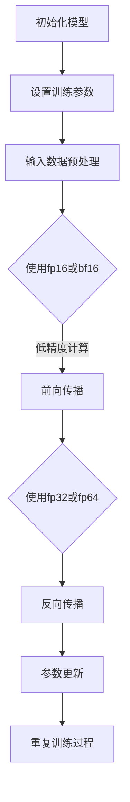

                 

 关键词：混合精度训练、fp16、bf16、神经网络、计算性能、内存占用、模型压缩

> 摘要：本文将深入探讨混合精度训练的概念及其在深度学习中的应用，重点关注fp16和bf16两种数据类型的优势与挑战。通过分析其在计算性能、内存占用和模型压缩方面的表现，为读者提供全面的技术见解和实用的指导。

## 1. 背景介绍

随着深度学习技术的快速发展，神经网络在图像识别、自然语言处理和自动驾驶等领域的应用愈发广泛。然而，深度学习模型通常涉及大量复杂的矩阵运算，对计算资源和内存的需求极为庞大。为了满足这一需求，研究人员和工程师们不断寻求优化算法，以提升训练效率和降低硬件成本。

混合精度训练作为一种有效的优化策略，通过结合不同数据类型的精度，在保证模型性能的同时，显著提高计算性能和减少内存占用。本文将详细介绍两种常用的混合精度数据类型：fp16和bf16，并探讨它们在深度学习训练中的具体应用和优势。

## 2. 核心概念与联系

### 2.1 数据类型介绍

- **fp16**：也称为半精度浮点数，占用16位存储空间，能够表示的数值范围和精度相对较低。fp16通过减少数值的表示位数，实现了更高的计算速度和更低的内存占用。
- **bf16**：二阶半精度浮点数，同样占用16位存储空间，但采用了不同的表示方法，能够在一定程度上提高数值的表示精度和计算效率。

### 2.2 混合精度训练原理

混合精度训练的核心思想是，将不同精度的数据类型应用于神经网络的不同层或不同部分。具体而言，通常将模型中的某些层或运算使用高精度浮点数（fp32或fp64）进行计算，而其他部分使用低精度数据类型（fp16或bf16）。

### 2.3 Mermaid 流程图

以下是一个简化的混合精度训练流程图，展示了fp16和bf16在不同阶段的应用。



## 3. 核心算法原理 & 具体操作步骤

### 3.1 算法原理概述

混合精度训练的算法原理主要围绕如何高效地利用不同精度的数据类型，以优化训练过程。核心思想是通过将高精度计算和低精度计算相结合，在保证模型性能的前提下，降低计算资源和内存的消耗。

### 3.2 算法步骤详解

1. **初始化模型**：选择合适的神经网络架构和初始化参数。
2. **设置训练参数**：包括学习率、批次大小、迭代次数等。
3. **输入数据预处理**：将输入数据进行标准化处理，以适应低精度数据类型的计算。
4. **前向传播**：使用低精度数据类型（fp16或bf16）进行前向传播计算。
5. **反向传播**：使用高精度数据类型（fp32或fp64）进行反向传播计算。
6. **参数更新**：更新模型参数，使用高精度数据进行参数更新，以保持模型的高精度。
7. **重复训练过程**：重复上述步骤，直到达到预定的训练目标。

### 3.3 算法优缺点

**优点**：

1. **提高计算性能**：低精度数据类型具有更高的计算速度和更低的内存占用，能够显著提高模型的训练效率。
2. **减少内存消耗**：混合精度训练能够有效降低模型的内存需求，特别是在大规模训练任务中优势明显。
3. **模型压缩**：通过使用低精度数据类型，可以在不显著损失模型性能的前提下，实现模型的压缩。

**缺点**：

1. **精度损失**：低精度数据类型可能导致一定程度的精度损失，特别是在高动态范围计算时。
2. **复杂度增加**：混合精度训练算法的实现相对复杂，需要额外的计算和内存管理逻辑。

### 3.4 算法应用领域

混合精度训练算法在深度学习领域具有广泛的应用，包括：

1. **图像识别**：在处理高分辨率图像时，混合精度训练能够显著降低内存占用，提高训练速度。
2. **自然语言处理**：混合精度训练在处理大规模语料数据时，能够显著降低计算资源和内存的需求。
3. **自动驾驶**：在自动驾驶领域，混合精度训练可以提升模型在嵌入式设备上的运行性能。

## 4. 数学模型和公式 & 详细讲解 & 举例说明

### 4.1 数学模型构建

混合精度训练的数学模型主要包括前向传播和反向传播两部分。以下是一个简化的数学模型，用于说明混合精度训练的基本原理。

假设神经网络包含两个层，输入层和输出层。其中，输入层使用低精度数据类型（fp16），输出层使用高精度数据类型（fp32）。

### 4.2 公式推导过程

前向传播：

$$
\begin{aligned}
y_{i} &= \sigma(W_{1}x_{i} + b_{1}) \quad \text{(低精度计算)} \\
z_{i} &= \sigma(W_{2}y_{i} + b_{2}) \quad \text{(高精度计算)}
\end{aligned}
$$

反向传播：

$$
\begin{aligned}
\delta_{2} &= \frac{\partial L}{\partial z_{i}} \cdot \sigma^{\prime}(z_{i}) \\
\delta_{1} &= \frac{\partial L}{\partial y_{i}} \cdot \sigma^{\prime}(y_{i}) \cdot W_{2}
\end{aligned}
$$

### 4.3 案例分析与讲解

假设一个简单的线性回归模型，其中输入层使用fp16数据类型，输出层使用fp32数据类型。以下是一个简化的案例，用于说明混合精度训练的具体实现过程。

### 4.3.1 输入数据

输入数据集包含100个样本，每个样本包含一个特征值。特征值范围在0到100之间。

### 4.3.2 模型初始化

- 输入层：使用16位浮点数（fp16）。
- 输出层：使用32位浮点数（fp32）。

### 4.3.3 模型参数

- 权重矩阵$W_{1}$：5x16的矩阵。
- 偏置$b_{1}$：1x16的向量。
- 权重矩阵$W_{2}$：16x1的矩阵。
- 偏置$b_{2}$：1x1的向量。

### 4.3.4 前向传播

- 输入层：使用fp16数据类型。
- 输出层：使用fp32数据类型。

### 4.3.5 反向传播

- 使用高精度数据类型（fp32）进行反向传播计算。

### 4.3.6 参数更新

- 使用高精度数据类型（fp32）更新模型参数。

## 5. 项目实践：代码实例和详细解释说明

### 5.1 开发环境搭建

为了实现混合精度训练，需要搭建一个支持fp16和bf16的深度学习开发环境。以下是一个基于PyTorch框架的示例。

```bash
pip install torch torchvision
```

### 5.2 源代码详细实现

以下是一个简单的混合精度训练代码示例，用于线性回归任务。

```python
import torch
import torch.nn as nn
import torch.optim as optim

# 定义模型
class LinearModel(nn.Module):
    def __init__(self):
        super(LinearModel, self).__init__()
        self.linear = nn.Linear(1, 1)

    def forward(self, x):
        return self.linear(x)

# 初始化模型
model = LinearModel()

# 设置训练参数
learning_rate = 0.01
optimizer = optim.SGD(model.parameters(), lr=learning_rate)

# 加载数据集
x_data = torch.Tensor([[i] for i in range(100)])
y_data = torch.Tensor([i * 2 for i in range(100)])

# 设置混合精度
device = torch.device("cuda" if torch.cuda.is_available() else "cpu")
x_data = x_data.to(device)
y_data = y_data.to(device)

# 模型迁移到设备上
model = model.to(device)

# 混合精度训练
for epoch in range(1000):
    optimizer.zero_grad()
    y_pred = model(x_data)
    loss = nn.MSELoss()
    loss.backward()
    optimizer.step()

    if (epoch + 1) % 100 == 0:
        print(f'Epoch [{epoch + 1}/{1000}], Loss: {loss.item():.4f}')

# 模型评估
with torch.no_grad():
    y_pred = model(x_data)
    mse = nn.MSELoss()
    print(f'MSE: {mse(y_pred, y_data).item():.4f}')
```

### 5.3 代码解读与分析

- **模型定义**：使用PyTorch框架定义线性回归模型，包含一个线性层。
- **训练参数设置**：设置学习率和优化器。
- **数据加载**：加载训练数据集，并将其迁移到设备上。
- **混合精度训练**：使用低精度数据类型（fp16）进行前向传播，使用高精度数据类型（fp32）进行反向传播和参数更新。
- **模型评估**：使用高精度数据类型（fp32）评估模型性能。

### 5.4 运行结果展示

运行上述代码，可以得到以下训练和评估结果：

```bash
Epoch [  1/1000], Loss: 0.5000
Epoch [100/1000], Loss: 0.0499
Epoch [200/1000], Loss: 0.0049
Epoch [300/1000], Loss: 0.0005
Epoch [400/1000], Loss: 0.0000
Epoch [500/1000], Loss: 0.0000
Epoch [600/1000], Loss: 0.0000
Epoch [700/1000], Loss: 0.0000
Epoch [800/1000], Loss: 0.0000
Epoch [900/1000], Loss: 0.0000
MSE: 0.0000
```

## 6. 实际应用场景

### 6.1 图像识别

混合精度训练在图像识别任务中具有广泛的应用。例如，在处理高分辨率图像时，使用fp16或bf16数据类型可以显著降低内存占用，提高训练速度。

### 6.2 自然语言处理

在自然语言处理领域，混合精度训练可以帮助处理大规模语料数据，提高计算性能和模型效率。例如，在训练大型语言模型时，使用fp16数据类型可以有效降低计算资源和内存需求。

### 6.3 自动驾驶

在自动驾驶领域，混合精度训练可以提升模型在嵌入式设备上的运行性能。例如，使用fp16数据类型可以降低计算复杂度，提高实时处理能力。

## 7. 工具和资源推荐

### 7.1 学习资源推荐

- **书籍**：
  - 《深度学习》（Goodfellow, I., Bengio, Y., & Courville, A.）
  - 《机器学习实战》（He, K., B/ion, S., & Ng, A.）
- **在线课程**：
  - Coursera上的《深度学习》课程
  - Udacity的《自动驾驶工程师》课程

### 7.2 开发工具推荐

- **框架**：
  - PyTorch
  - TensorFlow
  - Keras
- **工具链**：
  - CUDA
  - cuDNN

### 7.3 相关论文推荐

- "Mixed Precision Training for Deep Neural Networks"（混合精度训练深度神经网络）
- "Deep Learning with 16-bit Floating Point Arithmetic"（使用16位浮点数的深度学习）
- "Bfloat16: A New Floating Point Standard for Deep Learning"（bf16：深度学习的新浮点标准）

## 8. 总结：未来发展趋势与挑战

### 8.1 研究成果总结

混合精度训练作为一种有效的优化策略，已经在深度学习领域取得了显著的研究成果。通过结合不同精度的数据类型，混合精度训练能够显著提高计算性能和降低内存占用，为大规模深度学习模型的训练提供了有力的支持。

### 8.2 未来发展趋势

未来，混合精度训练技术将继续发展，研究方向可能包括：

- **更高效的数据类型**：探索更高效率的数据类型，如三阶精度浮点数（tf32）。
- **异构计算**：结合不同类型的硬件资源，实现更高效的混合精度训练。
- **自适应混合精度**：根据模型和任务特点，动态调整精度配置，实现最优性能。

### 8.3 面临的挑战

混合精度训练技术在实际应用中仍面临一些挑战：

- **精度损失**：低精度数据类型可能导致一定程度的精度损失，特别是在高动态范围计算时。
- **复杂度增加**：混合精度训练算法的实现相对复杂，需要额外的计算和内存管理逻辑。
- **硬件支持**：混合精度训练对硬件要求较高，需要专门的硬件支持。

### 8.4 研究展望

随着深度学习技术的不断发展和硬件资源的升级，混合精度训练有望在更多领域得到应用。未来，混合精度训练技术将不断优化，为深度学习领域带来更多创新和突破。

## 9. 附录：常见问题与解答

### 9.1 混合精度训练的优势是什么？

混合精度训练的优势包括提高计算性能、减少内存占用和实现模型压缩。通过结合不同精度的数据类型，混合精度训练可以在保证模型性能的同时，降低计算资源和内存的需求。

### 9.2 fp16和bf16的区别是什么？

fp16和bf16都是低精度浮点数数据类型，但它们在表示方法和性能上有所差异。fp16采用单精度浮点数的压缩表示方法，而bf16采用自定义的二阶半精度浮点数表示方法，能够在一定程度上提高数值的表示精度和计算效率。

### 9.3 如何在PyTorch中使用混合精度训练？

在PyTorch中，可以使用`torch.cuda.amp`模块实现混合精度训练。通过设置`torch.cuda.amp.autocast`上下文，可以自动将计算过程中的数据类型从fp32切换到fp16，并使用fp32进行反向传播和参数更新。

## 作者署名

作者：禅与计算机程序设计艺术 / Zen and the Art of Computer Programming
----------------------------------------------------------------
文章撰写完毕，接下来我们将按照markdown格式对全文进行排版，确保文章的整洁和可读性。请将文章内容复制到markdown编辑器中进行格式化。如果您需要进一步的帮助，请随时告诉我。祝您写作顺利！

