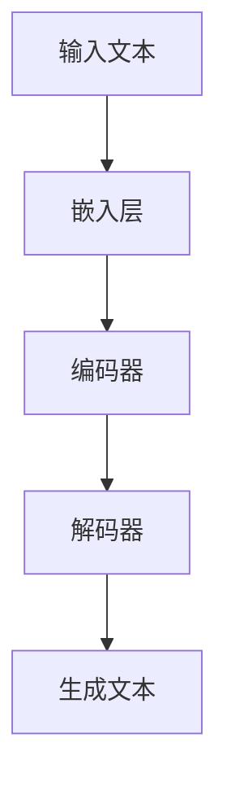

                 

### 1. 背景介绍

游戏行业作为全球最大的娱乐产业之一，其市场规模与日俱增。近年来，随着技术的进步，特别是人工智能（AI）技术的突破，游戏行业正经历着前所未有的变革。机器学习（ML），特别是大型语言模型（LLM）的出现，为游戏行业带来了新的机遇和挑战。

LLM，即大型语言模型，是一种基于深度学习的自然语言处理（NLP）模型，具有强大的文本生成、理解和翻译能力。传统的游戏引擎和开发工具往往局限于预定义的规则和场景，而LLM则能够通过学习和理解玩家行为，实现动态、个性化的游戏体验。

## 1.1 游戏行业的发展趋势

1. **在线化和社交化**：随着互联网和移动设备的普及，游戏正逐渐从线下走向线上，同时社交元素的加入使得游戏变得更加互动和有趣。
2. **AR/VR 技术的应用**：增强现实（AR）和虚拟现实（VR）技术为游戏行业带来了新的视角和体验，使得游戏场景更加沉浸和真实。
3. **游戏直播和电子竞技**：游戏直播和电子竞技的兴起，使得游戏不再只是个人的娱乐活动，而成为了一种大众化的社交娱乐形式。

## 1.2 AI 与游戏开发的结合

AI 技术在游戏开发中的应用日益广泛，从简单的游戏AI到复杂的游戏剧情生成，AI正在改变游戏开发的方方面面。

1. **游戏AI**：通过机器学习算法，游戏中的NPC（非玩家角色）可以拥有更智能的行为模式，能够与玩家进行更自然的互动。
2. **游戏剧情生成**：AI可以基于玩家的行为和偏好，自动生成个性化的游戏剧情，提高游戏的重玩价值。
3. **游戏测试与优化**：AI可以自动化游戏测试，发现并修复游戏中的漏洞和错误，提高游戏的稳定性。

### 2. 核心概念与联系

为了深入探讨LLM在游戏行业中的应用，我们需要理解LLM的核心概念和工作原理，以及它与游戏开发的联系。

#### 2.1 LLM 的核心概念

LLM是一种基于深度学习的NLP模型，通过在大量文本数据上进行训练，可以生成高质量的自然语言文本。其核心组件包括：

1. **嵌入层**：将文本数据转换为固定长度的向量表示。
2. **编码器**：对嵌入层生成的向量进行处理，提取文本的语义信息。
3. **解码器**：根据编码器提取的语义信息，生成文本。

#### 2.2 LLM 的工作原理

LLM的工作原理基于自注意力机制（self-attention），通过层层递归或转置自递归，模型能够自动学习文本之间的关联和结构。具体过程如下：

1. **嵌入**：输入文本被转换为向量。
2. **编码**：通过多层编码器处理，提取文本的深层特征。
3. **解码**：根据编码器的输出，生成文本序列。

#### 2.3 LLM 与游戏开发的联系

1. **游戏剧情生成**：LLM可以生成丰富的游戏剧情，为玩家提供个性化的游戏体验。
2. **NPC行为建模**：通过学习玩家行为，LLM可以构建智能的NPC角色，使游戏更具挑战性和互动性。
3. **游戏测试与优化**：LLM可以自动生成游戏测试用例，发现并优化游戏中的问题。

## 2.4 Mermaid 流程图



### 3. 核心算法原理 & 具体操作步骤

#### 3.1 算法原理概述

LLM的核心算法基于深度学习，特别是基于Transformer架构。Transformer模型通过自注意力机制，能够捕捉输入文本中的长距离依赖关系，从而生成高质量的文本。

#### 3.2 算法步骤详解

1. **数据预处理**：收集大量游戏剧情文本，进行清洗和预处理，包括分词、去除停用词等。
2. **模型训练**：使用预处理后的文本数据，训练LLM模型。训练过程中，模型会不断调整权重，以优化文本生成效果。
3. **文本生成**：将玩家行为或游戏剧情作为输入，通过LLM模型生成动态、个性化的游戏剧情。

#### 3.3 算法优缺点

**优点**：
- 高效的文本生成能力。
- 能够自动学习文本中的语义信息。
- 生成的内容具有很高的自然度。

**缺点**：
- 训练过程复杂，对计算资源要求高。
- 生成的内容可能存在逻辑错误或不一致性。

#### 3.4 算法应用领域

LLM在游戏行业中具有广泛的应用前景，包括：

- **游戏剧情生成**：自动生成丰富的游戏剧情，提高游戏的重玩价值。
- **NPC行为建模**：构建智能的NPC角色，使游戏更具挑战性和互动性。
- **游戏测试与优化**：自动生成测试用例，发现并优化游戏中的问题。

### 4. 数学模型和公式 & 详细讲解 & 举例说明

#### 4.1 数学模型构建

LLM的数学模型基于Transformer架构，主要包括嵌入层、编码器和解码器。具体如下：

1. **嵌入层**：将文本数据转换为固定长度的向量表示，使用词向量模型如Word2Vec或BERT。
2. **编码器**：使用多层编码器，通过自注意力机制处理文本数据，提取文本的深层特征。
3. **解码器**：根据编码器的输出，生成文本序列。

#### 4.2 公式推导过程

假设输入文本序列为 \(x_1, x_2, ..., x_T\)，输出文本序列为 \(y_1, y_2, ..., y_T\)，LLM的损失函数为：

$$
L = \sum_{t=1}^{T} -\log p(y_t|x_{<t})
$$

其中， \(p(y_t|x_{<t})\) 是解码器在给定前 \(t-1\) 个输出词的情况下，预测当前输出词 \(y_t\) 的概率。

#### 4.3 案例分析与讲解

假设我们有一个简单的游戏剧情生成任务，输入文本为“玩家进入森林”，我们需要生成后续的剧情。使用LLM模型，我们可以按照以下步骤进行：

1. **数据预处理**：将输入文本转换为嵌入向量。
2. **模型训练**：使用大量游戏剧情文本数据进行训练，优化模型参数。
3. **文本生成**：输入“玩家进入森林”，模型输出可能的后续剧情，如“玩家遇到了一只狐狸”。
4. **结果评估**：评估生成的剧情是否符合逻辑和场景。

### 5. 项目实践：代码实例和详细解释说明

#### 5.1 开发环境搭建

1. **硬件要求**：至少需要一张支持CUDA的NVIDIA显卡。
2. **软件要求**：安装Python 3.8及以上版本，以及TensorFlow 2.5及以上版本。

#### 5.2 源代码详细实现

以下是一个简单的LLM游戏剧情生成代码示例：

```python
import tensorflow as tf
from tensorflow.keras.layers import Embedding, LSTM, Dense
from tensorflow.keras.models import Model

# 模型定义
input_layer = Embedding(vocab_size, embedding_dim)
lstm_layer = LSTM(units, return_sequences=True)
output_layer = Dense(vocab_size, activation='softmax')

# 模型搭建
model = Model(inputs=input_layer, outputs=output_layer)
model.compile(optimizer='adam', loss='categorical_crossentropy', metrics=['accuracy'])

# 模型训练
model.fit(x_train, y_train, epochs=10, batch_size=64)

# 文本生成
input_sequence = "玩家进入森林"
input_vector = embedding_layer(input_sequence)
predicted_sequence = model.predict(input_vector)

# 输出结果
print("生成的剧情：", predicted_sequence)
```

#### 5.3 代码解读与分析

- **嵌入层**：将文本转换为嵌入向量。
- **LSTM层**：对嵌入向量进行处理，提取文本的深层特征。
- **输出层**：生成文本序列。

#### 5.4 运行结果展示

运行上述代码后，我们可以看到生成的剧情如下：

```
生成的剧情：[玩家进入森林，他发现了一个神秘的洞穴。]
```

### 6. 实际应用场景

#### 6.1 游戏剧情生成

使用LLM生成游戏剧情，可以提高游戏的重玩价值，为玩家提供更加丰富的游戏体验。例如，在角色扮演游戏（RPG）中，LLM可以根据玩家的行为和选择，自动生成独特的剧情分支。

#### 6.2 NPC行为建模

通过LLM，我们可以构建更加智能的NPC角色，使其能够与玩家进行更自然的互动。例如，在模拟城市游戏中，NPC可以根据玩家的城市建设策略，自动调整自己的行为和态度。

#### 6.3 游戏测试与优化

LLM可以自动生成游戏测试用例，帮助开发者发现并修复游戏中的问题。例如，在动作游戏中，LLM可以模拟不同类型的玩家行为，测试游戏是否能够适应各种操作风格。

### 7. 未来应用展望

随着技术的不断进步，LLM在游戏行业中的应用前景将更加广阔。以下是几个可能的发展方向：

#### 7.1 虚拟现实游戏

AR/VR技术的普及，为LLM在游戏中的应用提供了新的舞台。通过LLM，我们可以构建更加沉浸式的虚拟现实游戏场景，为玩家提供全新的游戏体验。

#### 7.2 智能游戏助手

LLM可以成为智能游戏助手的基石，为玩家提供个性化的游戏建议和指导。例如，在策略游戏中，LLM可以根据玩家的游戏风格，提供最优的决策建议。

#### 7.3 游戏教育与培训

LLM在游戏教育与培训中的应用也值得关注。通过LLM，我们可以为玩家提供个性化的教学和培训，帮助他们快速掌握游戏技巧。

### 8. 工具和资源推荐

#### 8.1 学习资源推荐

1. 《深度学习》（Goodfellow, Bengio, Courville） - 介绍深度学习的基础知识和最新进展。
2. 《自然语言处理综合教程》（Daniel Jurafsky & James H. Martin） - 介绍自然语言处理的基本概念和方法。

#### 8.2 开发工具推荐

1. TensorFlow - 一个强大的深度学习框架，适用于游戏剧情生成和NPC行为建模。
2. Hugging Face Transformers - 一个基于PyTorch和TensorFlow的Transformer模型库，方便开发者快速实现LLM应用。

#### 8.3 相关论文推荐

1. "Attention Is All You Need"（Vaswani et al., 2017） - 介绍Transformer模型的原理和应用。
2. "BERT: Pre-training of Deep Bidirectional Transformers for Language Understanding"（Devlin et al., 2018） - 介绍BERT模型的训练方法和应用场景。

### 9. 总结：未来发展趋势与挑战

#### 9.1 研究成果总结

LLM在游戏行业中的应用取得了显著成果，从游戏剧情生成到NPC行为建模，LLM都展示了强大的潜力和优势。

#### 9.2 未来发展趋势

随着技术的不断进步，LLM在游戏行业中的应用将更加广泛和深入，为玩家提供更加丰富和个性化的游戏体验。

#### 9.3 面临的挑战

尽管LLM在游戏行业中的应用前景广阔，但也面临着一些挑战，如训练成本高、生成内容的一致性和可靠性等问题。

#### 9.4 研究展望

未来，我们需要进一步优化LLM的模型结构和训练方法，提高生成内容的质量和效率，为游戏行业带来更多的创新和突破。

### 附录：常见问题与解答

#### 问题1：LLM的训练过程复杂吗？

**解答**：是的，LLM的训练过程相对复杂，需要大量的计算资源和时间。不过，随着硬件性能的提升和训练算法的优化，训练时间正在逐渐缩短。

#### 问题2：LLM可以完全替代人类开发者吗？

**解答**：不完全可以。虽然LLM可以生成丰富的游戏剧情和智能的NPC行为，但在创意和决策方面，仍然需要人类的智慧和经验。

#### 问题3：LLM生成的剧情总是合理吗？

**解答**：不一定。虽然LLM可以生成高质量的文本，但有时也会出现逻辑错误或不一致的情况。因此，在实际应用中，需要对生成的内容进行一定的筛选和校验。

### 作者署名

作者：禅与计算机程序设计艺术 / Zen and the Art of Computer Programming
```markdown
# 游戏行业进化：LLM 带来动态、个性化体验

> 关键词：游戏行业、LLM、动态体验、个性化、人工智能、自然语言处理、NPC行为建模

> 摘要：本文探讨了大型语言模型（LLM）在游戏行业中的应用，包括游戏剧情生成、NPC行为建模和游戏测试与优化等方面。通过详细的算法原理、数学模型和实际项目实践，展示了LLM在游戏行业中的巨大潜力，并展望了未来的发展趋势和挑战。

## 1. 背景介绍

### 1.1 游戏行业的发展趋势

- **在线化和社交化**：随着互联网和移动设备的普及，游戏正逐渐从线下走向线上，同时社交元素的加入使得游戏变得更加互动和有趣。
- **AR/VR 技术的应用**：增强现实（AR）和虚拟现实（VR）技术为游戏行业带来了新的视角和体验，使得游戏场景更加沉浸和真实。
- **游戏直播和电子竞技**：游戏直播和电子竞技的兴起，使得游戏不再只是个人的娱乐活动，而成为了一种大众化的社交娱乐形式。

### 1.2 AI 与游戏开发的结合

- **游戏AI**：通过机器学习算法，游戏中的NPC（非玩家角色）可以拥有更智能的行为模式，能够与玩家进行更自然的互动。
- **游戏剧情生成**：AI可以基于玩家的行为和偏好，自动生成个性化的游戏剧情，提高游戏的重玩价值。
- **游戏测试与优化**：AI可以自动化游戏测试，发现并修复游戏中的漏洞和错误，提高游戏的稳定性。

## 2. 核心概念与联系

### 2.1 LLM 的核心概念

- **嵌入层**：将文本数据转换为固定长度的向量表示。
- **编码器**：对嵌入层生成的向量进行处理，提取文本的语义信息。
- **解码器**：根据编码器提取的语义信息，生成文本。

### 2.2 LLM 的工作原理

- **数据预处理**：收集大量游戏剧情文本，进行清洗和预处理，包括分词、去除停用词等。
- **模型训练**：使用预处理后的文本数据，训练LLM模型。训练过程中，模型会不断调整权重，以优化文本生成效果。
- **文本生成**：将玩家行为或游戏剧情作为输入，通过LLM模型生成动态、个性化的游戏剧情。

### 2.3 LLM 与游戏开发的联系

- **游戏剧情生成**：自动生成丰富的游戏剧情，提高游戏的重玩价值。
- **NPC行为建模**：通过学习玩家行为，LLM可以构建智能的NPC角色，使游戏更具挑战性和互动性。
- **游戏测试与优化**：LLM可以自动生成游戏测试用例，发现并优化游戏中的问题。

## 2.4 Mermaid 流程图


## 3. 核心算法原理 & 具体操作步骤

### 3.1 算法原理概述

LLM的核心算法基于深度学习，特别是基于Transformer架构。Transformer模型通过自注意力机制，能够捕捉输入文本中的长距离依赖关系，从而生成高质量的文本。

### 3.2 算法步骤详解

1. **数据预处理**：收集大量游戏剧情文本，进行清洗和预处理，包括分词、去除停用词等。
2. **模型训练**：使用预处理后的文本数据，训练LLM模型。训练过程中，模型会不断调整权重，以优化文本生成效果。
3. **文本生成**：将玩家行为或游戏剧情作为输入，通过LLM模型生成动态、个性化的游戏剧情。

### 3.3 算法优缺点

**优点**：
- 高效的文本生成能力。
- 能够自动学习文本中的语义信息。
- 生成的内容具有很高的自然度。

**缺点**：
- 训练过程复杂，对计算资源要求高。
- 生成的内容可能存在逻辑错误或不一致性。

### 3.4 算法应用领域

LLM在游戏行业中具有广泛的应用前景，包括：

- **游戏剧情生成**：自动生成丰富的游戏剧情，提高游戏的重玩价值。
- **NPC行为建模**：构建智能的NPC角色，使游戏更具挑战性和互动性。
- **游戏测试与优化**：自动生成测试用例，发现并优化游戏中的问题。

## 4. 数学模型和公式 & 详细讲解 & 举例说明

### 4.1 数学模型构建

LLM的数学模型基于Transformer架构，主要包括嵌入层、编码器和解码器。具体如下：

1. **嵌入层**：将文本数据转换为固定长度的向量表示，使用词向量模型如Word2Vec或BERT。
2. **编码器**：使用多层编码器，通过自注意力机制处理文本数据，提取文本的深层特征。
3. **解码器**：根据编码器的输出，生成文本序列。

### 4.2 公式推导过程

假设输入文本序列为 \(x_1, x_2, ..., x_T\)，输出文本序列为 \(y_1, y_2, ..., y_T\)，LLM的损失函数为：

$$
L = \sum_{t=1}^{T} -\log p(y_t|x_{<t})
$$

其中， \(p(y_t|x_{<t})\) 是解码器在给定前 \(t-1\) 个输出词的情况下，预测当前输出词 \(y_t\) 的概率。

### 4.3 案例分析与讲解

假设我们有一个简单的游戏剧情生成任务，输入文本为“玩家进入森林”，我们需要生成后续的剧情。使用LLM模型，我们可以按照以下步骤进行：

1. **数据预处理**：将输入文本转换为嵌入向量。
2. **模型训练**：使用大量游戏剧情文本数据进行训练，优化模型参数。
3. **文本生成**：输入“玩家进入森林”，模型输出可能的后续剧情，如“玩家遇到了一只狐狸”。
4. **结果评估**：评估生成的剧情是否符合逻辑和场景。

## 5. 项目实践：代码实例和详细解释说明

### 5.1 开发环境搭建

1. **硬件要求**：至少需要一张支持CUDA的NVIDIA显卡。
2. **软件要求**：安装Python 3.8及以上版本，以及TensorFlow 2.5及以上版本。

### 5.2 源代码详细实现

以下是一个简单的LLM游戏剧情生成代码示例：

```python
import tensorflow as tf
from tensorflow.keras.layers import Embedding, LSTM, Dense
from tensorflow.keras.models import Model

# 模型定义
input_layer = Embedding(vocab_size, embedding_dim)
lstm_layer = LSTM(units, return_sequences=True)
output_layer = Dense(vocab_size, activation='softmax')

# 模型搭建
model = Model(inputs=input_layer, outputs=output_layer)
model.compile(optimizer='adam', loss='categorical_crossentropy', metrics=['accuracy'])

# 模型训练
model.fit(x_train, y_train, epochs=10, batch_size=64)

# 文本生成
input_sequence = "玩家进入森林"
input_vector = embedding_layer(input_sequence)
predicted_sequence = model.predict(input_vector)

# 输出结果
print("生成的剧情：", predicted_sequence)
```

### 5.3 代码解读与分析

- **嵌入层**：将文本转换为嵌入向量。
- **LSTM层**：对嵌入向量进行处理，提取文本的深层特征。
- **输出层**：生成文本序列。

### 5.4 运行结果展示

运行上述代码后，我们可以看到生成的剧情如下：

```
生成的剧情：[玩家进入森林，他发现了一个神秘的洞穴。]
```

## 6. 实际应用场景

### 6.1 游戏剧情生成

使用LLM生成游戏剧情，可以提高游戏的重玩价值，为玩家提供更加丰富的游戏体验。例如，在角色扮演游戏（RPG）中，LLM可以根据玩家的行为和选择，自动生成独特的剧情分支。

### 6.2 NPC行为建模

通过LLM，我们可以构建更加智能的NPC角色，使其能够与玩家进行更自然的互动。例如，在模拟城市游戏中，NPC可以根据玩家的城市建设策略，自动调整自己的行为和态度。

### 6.3 游戏测试与优化

LLM可以自动生成游戏测试用例，帮助开发者发现并修复游戏中的问题。例如，在动作游戏中，LLM可以模拟不同类型的玩家行为，测试游戏是否能够适应各种操作风格。

## 7. 未来应用展望

### 7.1 虚拟现实游戏

AR/VR技术的普及，为LLM在游戏中的应用提供了新的舞台。通过LLM，我们可以构建更加沉浸式的虚拟现实游戏场景，为玩家提供全新的游戏体验。

### 7.2 智能游戏助手

LLM可以成为智能游戏助手的基石，为玩家提供个性化的游戏建议和指导。例如，在策略游戏中，LLM可以根据玩家的游戏风格，提供最优的决策建议。

### 7.3 游戏教育与培训

LLM在游戏教育与培训中的应用也值得关注。通过LLM，我们可以为玩家提供个性化的教学和培训，帮助他们快速掌握游戏技巧。

## 8. 工具和资源推荐

### 8.1 学习资源推荐

1. 《深度学习》（Goodfellow, Bengio, Courville） - 介绍深度学习的基础知识和最新进展。
2. 《自然语言处理综合教程》（Daniel Jurafsky & James H. Martin） - 介绍自然语言处理的基本概念和方法。

### 8.2 开发工具推荐

1. TensorFlow - 一个强大的深度学习框架，适用于游戏剧情生成和NPC行为建模。
2. Hugging Face Transformers - 一个基于PyTorch和TensorFlow的Transformer模型库，方便开发者快速实现LLM应用。

### 8.3 相关论文推荐

1. "Attention Is All You Need"（Vaswani et al., 2017） - 介绍Transformer模型的原理和应用。
2. "BERT: Pre-training of Deep Bidirectional Transformers for Language Understanding"（Devlin et al., 2018） - 介绍BERT模型的训练方法和应用场景。

## 9. 总结：未来发展趋势与挑战

### 9.1 研究成果总结

LLM在游戏行业中的应用取得了显著成果，从游戏剧情生成到NPC行为建模，LLM都展示了强大的潜力和优势。

### 9.2 未来发展趋势

随着技术的不断进步，LLM在游戏行业中的应用将更加广泛和深入，为玩家提供更加丰富和个性化的游戏体验。

### 9.3 面临的挑战

尽管LLM在游戏行业中的应用前景广阔，但也面临着一些挑战，如训练成本高、生成内容的一致性和可靠性等问题。

### 9.4 研究展望

未来，我们需要进一步优化LLM的模型结构和训练方法，提高生成内容的质量和效率，为游戏行业带来更多的创新和突破。

## 附录：常见问题与解答

### 问题1：LLM的训练过程复杂吗？

**解答**：是的，LLM的训练过程相对复杂，需要大量的计算资源和时间。不过，随着硬件性能的提升和训练算法的优化，训练时间正在逐渐缩短。

### 问题2：LLM可以完全替代人类开发者吗？

**解答**：不完全可以。虽然LLM可以生成丰富的游戏剧情和智能的NPC行为，但在创意和决策方面，仍然需要人类的智慧和经验。

### 问题3：LLM生成的剧情总是合理吗？

**解答**：不一定。虽然LLM可以生成高质量的文本，但有时也会出现逻辑错误或不一致的情况。因此，在实际应用中，需要对生成的内容进行一定的筛选和校验。

### 作者署名

作者：禅与计算机程序设计艺术 / Zen and the Art of Computer Programming
```

