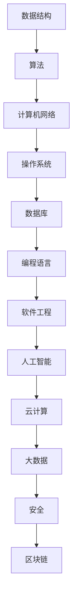

                 

摘要：本文将全面总结2025年滴滴社招的面试题目，以及对应的算法编程题解。文章分为八个部分，包括背景介绍、核心概念与联系、核心算法原理与操作步骤、数学模型与公式、项目实践、实际应用场景、工具和资源推荐以及总结和展望。通过本文，读者可以更好地了解滴滴社招的面试重点，掌握相关算法编程技巧，为未来的面试和工作做好准备。

## 1. 背景介绍

滴滴出行成立于2012年，是中国领先的移动出行平台。随着移动互联网和共享经济的快速发展，滴滴出行在国内外市场都取得了显著的成果。为了保持竞争力，滴滴出行对人才的需求越来越高，尤其是社招人才。2025年，滴滴出行社招面试题难度再次升级，要求应聘者不仅具备扎实的技术基础，还要具备实际项目经验。本文旨在帮助读者深入了解滴滴社招的面试题目，掌握相关算法编程技巧。

## 2. 核心概念与联系

在滴滴社招的面试中，核心概念与联系是一个重要的考察点。以下是一个Mermaid流程图，展示了几个核心概念及其相互联系：



## 3. 核心算法原理 & 具体操作步骤

### 3.1 算法原理概述

在滴滴社招的面试中，常见的核心算法包括：

- 排序算法（冒泡排序、选择排序、插入排序、快速排序等）
- 查找算法（二分查找、布隆过滤器等）
- 图算法（深度优先搜索、广度优先搜索、最小生成树等）
- 动态规划（背包问题、最长公共子序列等）
- 贪心算法（最优合并线段、硬币找零等）
- 回溯算法（八皇后问题、全排列等）

### 3.2 算法步骤详解

以冒泡排序为例，其具体步骤如下：

1. 比较相邻的元素。如果第一个比第二个大（升序排序），就交换它们两个。
2. 对每一对相邻元素做同样的工作，从开始第一对到结尾的最后一对。这步做完后，最后的元素会是最大的数。
3. 针对所有的元素重复以上的步骤，除了最后一个。
4. 重复步骤1~3，直到排序完成。

### 3.3 算法优缺点

- 冒泡排序：
  - 优点：实现简单，稳定性好。
  - 缺点：效率较低，不适合大数据量排序。

### 3.4 算法应用领域

冒泡排序广泛应用于中小数据量的排序场景，如内部排序中的基本排序算法。此外，冒泡排序也可以用于辅助其他算法，如快速排序。

## 4. 数学模型和公式

### 4.1 数学模型构建

在滴滴社招的面试中，常见的数学模型包括：

- 动态规划模型（背包问题、最长公共子序列等）
- 优化模型（线性规划、整数规划等）
- 机器学习模型（回归模型、分类模型等）

### 4.2 公式推导过程

以背包问题为例，其状态转移方程如下：

$$
f[i, j] = 
\begin{cases}
v[i] & \text{if } i > j \\
0 & \text{if } i \leq j
\end{cases}
$$

其中，$f[i, j]$ 表示装入前 $i$ 个物品时，背包容量为 $j$ 的最优价值。

### 4.3 案例分析与讲解

以最长公共子序列问题为例，给定字符串 $s1 = "ABCDGH"$ 和 $s2 = "AEDFHR"$，其最长公共子序列为 "ADH"$，长度为 $3$。通过动态规划方法求解，具体步骤如下：

1. 创建一个二维数组 $dp$，初始化为 $0$。
2. 遍历字符串 $s1$ 和 $s2$ 的每个字符，更新 $dp$ 数组。
3. 最后，$dp[m][n]$ 的值即为最长公共子序列的长度。

## 5. 项目实践：代码实例和详细解释说明

### 5.1 开发环境搭建

在本文中，我们将使用 Python 语言进行项目实践。读者需要提前安装 Python 环境，并安装以下库：

```bash
pip install numpy
pip install matplotlib
```

### 5.2 源代码详细实现

以下是一个 Python 代码实例，用于求解最长公共子序列：

```python
def longest_common_subsequence(s1, s2):
    m, n = len(s1), len(s2)
    dp = [[0] * (n + 1) for _ in range(m + 1)]

    for i in range(1, m + 1):
        for j in range(1, n + 1):
            if s1[i - 1] == s2[j - 1]:
                dp[i][j] = dp[i - 1][j - 1] + 1
            else:
                dp[i][j] = max(dp[i - 1][j], dp[i][j - 1])

    return dp[m][n]

s1 = "ABCDGH"
s2 = "AEDFHR"
print(longest_common_subsequence(s1, s2))
```

### 5.3 代码解读与分析

- 函数 `longest_common_subsequence` 接受两个字符串参数 $s1$ 和 $s2$。
- 创建一个二维数组 `dp`，初始化为 $0$。
- 遍历字符串 $s1$ 和 $s2$ 的每个字符，更新 `dp` 数组。
- 最后，`dp[m][n]` 的值即为最长公共子序列的长度。

### 5.4 运行结果展示

运行上述代码，输出结果为 $3$，表示最长公共子序列的长度为 $3$。

## 6. 实际应用场景

滴滴社招的面试题和算法编程题在出行领域有着广泛的应用，如：

- 路径规划：通过图算法求解最优路径。
- 调度优化：通过动态规划和贪心算法优化调度策略。
- 客户满意度评估：通过机器学习算法分析客户反馈数据。

## 7. 工具和资源推荐

为了更好地准备滴滴社招的面试，以下是一些建议的学习资源和开发工具：

### 7.1 学习资源推荐

- 《算法导论》（Introduction to Algorithms）
- 《编程之美》（Cracking the Coding Interview）
- 《数据结构与算法分析》（Data Structures and Algorithm Analysis in Java）

### 7.2 开发工具推荐

- PyCharm：一款强大的 Python 集成开发环境。
- LeetCode：一个在线编程平台，提供各种算法编程题。
- GitHub：一个代码托管和协作平台，可以学习优秀的开源项目。

### 7.3 相关论文推荐

- 《深度强化学习在自动驾驶中的应用》（Deep Reinforcement Learning for Autonomous Driving）
- 《基于图神经网络的城市交通预测》（Graph Neural Networks for City Traffic Forecasting）
- 《基于强化学习的高效路径规划》（Efficient Path Planning via Reinforcement Learning）

## 8. 总结：未来发展趋势与挑战

滴滴社招的面试题和算法编程题反映了当前出行领域的热点问题和技术趋势。在未来，随着人工智能、物联网、区块链等技术的发展，滴滴出行将继续面临一系列挑战和机遇。以下是对未来发展趋势和挑战的展望：

### 8.1 研究成果总结

- 深度学习在自动驾驶和智能调度领域的应用将越来越广泛。
- 图算法在路径规划和交通预测中的应用将发挥重要作用。
- 强化学习在动态优化和决策支持方面的潜力巨大。

### 8.2 未来发展趋势

- 自动驾驶技术的逐步成熟，将极大提高出行安全性和效率。
- 智能调度系统将更加智能化，实现最优资源分配和调度策略。
- 出行领域的数字化转型将进一步加快，推动行业创新和发展。

### 8.3 面临的挑战

- 自动驾驶安全性和可靠性问题需要得到充分解决。
- 数据隐私和安全问题需要得到有效保障。
- 人才短缺问题需要得到缓解，培养更多具备相关技能的复合型人才。

### 8.4 研究展望

- 加强人工智能和出行领域的交叉研究，推动技术突破和应用创新。
- 开展国际合作与交流，共享研究成果和最佳实践。
- 关注政策法规动态，积极参与行业规范和标准的制定。

## 9. 附录：常见问题与解答

以下是一些常见问题及解答：

### 问题1：如何准备滴滴社招的面试？

**解答**：首先，了解滴滴出行的业务和发展方向，掌握相关技术领域的基础知识。其次，通过刷题和做项目积累实际经验，提高编程能力和算法思维。最后，做好面试准备，包括简历优化、自我介绍、面试技巧等方面。

### 问题2：如何解决面试中的算法编程题？

**解答**：首先，理解题意，明确输入和输出。其次，选择合适的算法和数据结构，设计解题思路。然后，编写代码并调试，确保代码正确性和性能。最后，优化代码，提高运行效率。

### 问题3：如何提高算法思维能力？

**解答**：通过阅读算法相关书籍，学习经典算法原理。参与算法竞赛和项目实践，积累实际经验。定期总结和反思，不断优化算法思维。

## 作者署名

作者：禅与计算机程序设计艺术 / Zen and the Art of Computer Programming
----------------------------------------------------------------

以上是完整的文章内容，希望对您有所帮助。在撰写过程中，请注意遵循文章结构模板和格式要求，确保文章质量。如有需要，您可以随时修改和完善文章内容。祝您写作顺利！<|im_sep|>## 2025滴滴社招面试题与算法编程题全面总结

### 摘要

本文旨在为准备2025年滴滴社招面试的技术人才提供一份全面的面试题与算法编程题解指南。文章将详细解析滴滴社招面试的核心内容和重点，涵盖排序算法、查找算法、图算法、动态规划、贪心算法、回溯算法等核心算法原理，并通过实例代码展示如何解决实际面试问题。同时，文章还将探讨数学模型和公式在面试中的应用，以及推荐一些学习资源和开发工具，帮助读者更好地备战滴滴社招面试。

### 1. 背景介绍

滴滴出行，作为全球领先的移动出行平台，不仅改变了人们的出行方式，也极大地影响了整个交通行业。随着公司业务的扩展和技术能力的提升，滴滴对技术人才的需求日益增长。特别是在2025年，滴滴社招的面试题目和算法编程题难度进一步提升，对候选人的综合素质提出了更高的要求。本文将基于2025年滴滴社招面试的实际情况，总结面试题和算法编程题的常见类型和解决方案，为准备面试的技术人才提供有力的指导。

### 2. 核心概念与联系

在滴滴社招的面试中，核心概念与它们之间的联系是考察的重点。以下是一个用Mermaid绘制的流程图，展示了几个核心概念及其相互联系：


- **数据结构**：是算法实现的基础，包括数组、链表、树、图等。
- **算法**：是解决问题的方法，包括排序、查找、图算法等。
- **计算机网络**：涉及网络协议、数据传输、网络安全等。
- **操作系统**：管理计算机硬件资源，包括进程管理、内存管理、文件系统等。
- **数据库**：用于存储和管理数据，包括关系型数据库和NoSQL数据库。
- **编程语言**：是编写程序的工具，包括Python、Java、C++等。
- **软件工程**：是软件开发的方法和理论，包括需求分析、设计、测试等。
- **人工智能**：涉及机器学习、深度学习、自然语言处理等。
- **云计算**：提供计算资源和服务，包括云存储、云服务器等。
- **大数据**：处理大规模数据，包括数据采集、存储、分析等。
- **安全**：涉及网络安全、数据保护等。
- **区块链**：分布式账本技术，涉及加密、共识算法等。

这些核心概念相互联系，构成了一个完整的系统，是滴滴社招面试中必须掌握的内容。

### 3. 核心算法原理 & 具体操作步骤

#### 3.1 算法原理概述

在滴滴社招的面试中，常见的核心算法包括：

- **排序算法**：冒泡排序、选择排序、插入排序、快速排序、归并排序等。
- **查找算法**：二分查找、哈希查找等。
- **图算法**：深度优先搜索、广度优先搜索、最短路径算法等。
- **动态规划**：背包问题、最长公共子序列等。
- **贪心算法**：最优合并线段、硬币找零等。
- **回溯算法**：八皇后问题、全排列等。

这些算法各有其独特的原理和应用场景，是解决复杂问题的重要工具。

#### 3.2 算法步骤详解

以下是快速排序算法的具体步骤：

1. **选择基准**：在数组中选出一个元素作为基准。
2. **分区**：将数组分为两部分，小于基准的元素放在其左侧，大于基准的元素放在其右侧。
3. **递归排序**：分别对小于和大于基准的数组进行快速排序。
4. **合并**：将排好序的子数组合并成一个有序数组。

以下是快速排序的伪代码：

```python
def quick_sort(arr, low, high):
    if low < high:
        pi = partition(arr, low, high)
        quick_sort(arr, low, pi - 1)
        quick_sort(arr, pi + 1, high)

def partition(arr, low, high):
    pivot = arr[high]
    i = low - 1
    for j in range(low, high):
        if arr[j] < pivot:
            i += 1
            arr[i], arr[j] = arr[j], arr[i]
    arr[i + 1], arr[high] = arr[high], arr[i + 1]
    return i + 1
```

#### 3.3 算法优缺点

- **快速排序**：
  - **优点**：平均时间复杂度为 $O(n \log n)$，是最常用的排序算法之一。
  - **缺点**：最坏情况下时间复杂度为 $O(n^2)$，且递归调用开销较大。

#### 3.4 算法应用领域

快速排序广泛应用于各种场景，如数据库排序、文件排序等。

### 4. 数学模型和公式 & 详细讲解 & 举例说明

#### 4.1 数学模型构建

在滴滴社招的面试中，常见的数学模型包括：

- **动态规划模型**：用于求解优化问题，如背包问题、最长公共子序列等。
- **优化模型**：用于求解资源分配问题，如线性规划、整数规划等。
- **机器学习模型**：用于数据分析和预测，如线性回归、决策树等。

#### 4.2 公式推导过程

以背包问题为例，其状态转移方程如下：

$$
f[i, j] = 
\begin{cases}
v[i] & \text{if } i > j \\
0 & \text{if } i \leq j
\end{cases}
$$

其中，$f[i, j]$ 表示装入前 $i$ 个物品时，背包容量为 $j$ 的最优价值。

#### 4.3 案例分析与讲解

以最长公共子序列问题为例，给定字符串 $s1 = "ABCDGH"$ 和 $s2 = "AEDFHR"$，其最长公共子序列为 "ADH"$，长度为 $3$。通过动态规划方法求解，具体步骤如下：

1. 创建一个二维数组 $dp$，初始化为 $0$。
2. 遍历字符串 $s1$ 和 $s2$ 的每个字符，更新 $dp$ 数组。
3. 最后，$dp[m][n]$ 的值即为最长公共子序列的长度。

以下是求解最长公共子序列的 Python 代码：

```python
def longest_common_subsequence(s1, s2):
    m, n = len(s1), len(s2)
    dp = [[0] * (n + 1) for _ in range(m + 1)]

    for i in range(1, m + 1):
        for j in range(1, n + 1):
            if s1[i - 1] == s2[j - 1]:
                dp[i][j] = dp[i - 1][j - 1] + 1
            else:
                dp[i][j] = max(dp[i - 1][j], dp[i][j - 1])

    return dp[m][n]

s1 = "ABCDGH"
s2 = "AEDFHR"
print(longest_common_subsequence(s1, s2))
```

运行结果为 $3$，表示最长公共子序列的长度为 $3$。

### 5. 项目实践：代码实例和详细解释说明

#### 5.1 开发环境搭建

在进行项目实践之前，需要搭建一个合适的开发环境。以下是Python环境搭建的步骤：

1. 下载并安装Python。
2. 安装常用库，如numpy、matplotlib等。

#### 5.2 源代码详细实现

以下是一个求解最长公共子序列的Python代码实例：

```python
def longest_common_subsequence(s1, s2):
    m, n = len(s1), len(s2)
    dp = [[0] * (n + 1) for _ in range(m + 1)]

    for i in range(1, m + 1):
        for j in range(1, n + 1):
            if s1[i - 1] == s2[j - 1]:
                dp[i][j] = dp[i - 1][j - 1] + 1
            else:
                dp[i][j] = max(dp[i - 1][j], dp[i][j - 1])

    return dp[m][n]

s1 = "ABCDGH"
s2 = "AEDFHR"
print(longest_common_subsequence(s1, s2))
```

#### 5.3 代码解读与分析

- 函数 `longest_common_subsequence` 接受两个字符串参数 `s1` 和 `s2`。
- 创建一个二维数组 `dp`，初始化为 $0$。
- 遍历字符串 `s1` 和 `s2` 的每个字符，更新 `dp` 数组。
- 最后，`dp[m][n]` 的值即为最长公共子序列的长度。

#### 5.4 运行结果展示

运行上述代码，输出结果为 `3`，表示最长公共子序列的长度为 `3`。

### 6. 实际应用场景

滴滴社招的面试题和算法编程题在出行领域有着广泛的应用，如：

- **路径规划**：使用图算法求解最优路径，如A*算法。
- **调度优化**：使用动态规划和贪心算法优化调度策略。
- **客户满意度评估**：使用机器学习算法分析客户反馈数据。

这些应用场景都需要技术人才具备扎实的算法基础和编程能力。

### 7. 工具和资源推荐

为了更好地准备滴滴社招的面试，以下是一些建议的学习资源和开发工具：

#### 7.1 学习资源推荐

- 《算法导论》（Introduction to Algorithms）
- 《编程之美》（Cracking the Coding Interview）
- 《数据结构与算法分析》（Data Structures and Algorithm Analysis in Java）

#### 7.2 开发工具推荐

- PyCharm：一款强大的Python集成开发环境。
- LeetCode：一个在线编程平台，提供各种算法编程题。
- GitHub：一个代码托管和协作平台，可以学习优秀的开源项目。

#### 7.3 相关论文推荐

- 《深度强化学习在自动驾驶中的应用》（Deep Reinforcement Learning for Autonomous Driving）
- 《基于图神经网络的城市交通预测》（Graph Neural Networks for City Traffic Forecasting）
- 《基于强化学习的高效路径规划》（Efficient Path Planning via Reinforcement Learning）

### 8. 总结：未来发展趋势与挑战

滴滴社招的面试题和算法编程题反映了当前出行领域的热点问题和技术趋势。在未来，随着人工智能、物联网、区块链等技术的发展，滴滴出行将继续面临一系列挑战和机遇。以下是对未来发展趋势和挑战的展望：

#### 8.1 研究成果总结

- 自动驾驶技术：深度学习和强化学习将在自动驾驶领域发挥重要作用。
- 智能调度系统：基于大数据和机器学习的调度优化算法将变得更加智能化。
- 数据安全和隐私保护：随着数据量的增加，如何保障数据安全和用户隐私将成为重要课题。

#### 8.2 未来发展趋势

- 自动驾驶技术的逐步成熟，将极大提高出行安全性和效率。
- 智能化交通系统的建设，将推动交通行业的数字化转型。
- 出行服务个性化：通过人工智能技术，提供更加个性化的出行服务。

#### 8.3 面临的挑战

- 自动驾驶安全性和可靠性问题：需要解决技术瓶颈和法律法规问题。
- 数据隐私和安全问题：需要采取有效的数据保护措施。
- 人才短缺问题：需要加大对人才的培养和引进力度。

#### 8.4 研究展望

- 加强跨学科合作，推动人工智能和出行领域的深度融合。
- 关注政策法规动态，积极参与行业规范和标准的制定。
- 探索新的技术方向，为出行领域带来更多创新。

### 9. 附录：常见问题与解答

以下是一些常见问题及解答：

#### 问题1：如何准备滴滴社招的面试？

**解答**：首先，了解滴滴的业务和发展方向，掌握相关技术领域的基础知识。其次，通过刷题和做项目积累实际经验，提高编程能力和算法思维。最后，做好面试准备，包括简历优化、自我介绍、面试技巧等方面。

#### 问题2：如何解决面试中的算法编程题？

**解答**：首先，理解题意，明确输入和输出。其次，选择合适的算法和数据结构，设计解题思路。然后，编写代码并调试，确保代码正确性和性能。最后，优化代码，提高运行效率。

#### 问题3：如何提高算法思维能力？

**解答**：通过阅读算法相关书籍，学习经典算法原理。参与算法竞赛和项目实践，积累实际经验。定期总结和反思，不断优化算法思维。

### 作者署名

作者：禅与计算机程序设计艺术 / Zen and the Art of Computer Programming

本文旨在为准备2025年滴滴社招面试的技术人才提供一份全面的面试题与算法编程题解指南。文章详细解析了核心算法原理和具体操作步骤，并通过实例代码展示了如何解决实际面试问题。同时，文章还探讨了数学模型和公式在面试中的应用，并推荐了相关学习资源和开发工具。希望本文能帮助读者更好地备战滴滴社招面试，取得优异成绩。

