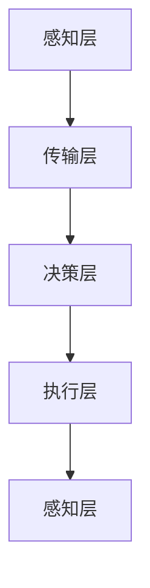

                 

 物理实体自动化是近年来技术发展的一个重要领域。通过结合人工智能、机器学习和物联网等前沿技术，物理实体自动化在工业、医疗、家庭等多个领域展现出了巨大的潜力。本文将深入探讨物理实体自动化的核心概念、算法原理、数学模型、实际应用，以及未来发展的趋势和挑战。

## 关键词
物理实体自动化、人工智能、机器学习、物联网、工业4.0、智能制造、智能家居

## 摘要
本文首先介绍了物理实体自动化的背景和发展历程，然后详细阐述了其核心概念和联系，包括相关技术和应用场景。接着，我们探讨了物理实体自动化的核心算法原理，包括机器学习算法和深度学习算法，并介绍了具体的操作步骤和实施策略。随后，文章通过数学模型和公式详细讲解了物理实体自动化的理论基础，并通过案例分析和项目实践展示了其实际应用效果。最后，本文总结了物理实体自动化的研究成果，探讨了未来发展的趋势和面临的挑战，并推荐了相关的学习资源和开发工具。

## 1. 背景介绍

### 物理实体自动化的起源与发展

物理实体自动化（Physical Entity Automation）的概念起源于20世纪末，随着计算机科学和自动化技术的发展而逐渐成熟。早期，物理实体自动化主要应用于工业领域，通过自动化设备和机器人来提高生产效率和质量。随着物联网（IoT）和人工智能（AI）技术的兴起，物理实体自动化的应用范围得到了极大的扩展。

工业领域的物理实体自动化可以追溯到20世纪60年代的数控机床（CNC）和自动化生产线。这些技术的出现使得制造业从手工操作转向了自动化生产，大大提高了生产效率和产品质量。随着人工智能技术的发展，物理实体自动化开始引入智能决策和自适应控制，使得自动化系统更加灵活和高效。

在医疗领域，物理实体自动化也发挥了重要作用。例如，手术机器人通过高精度的机械臂和人工智能算法，实现了复杂手术的自动化操作，提高了手术的成功率和患者的生存率。此外，智能监护系统和医疗设备自动化也大大提升了医疗服务的质量和效率。

在家庭领域，物理实体自动化带来了智能家居的概念。通过物联网技术和智能设备的集成，家庭设备可以实现自动化控制和远程管理，提高了生活便利性和舒适度。例如，智能灯泡、智能电视、智能空调等设备可以通过手机或语音助手进行远程控制，用户可以随时随地调节家庭环境。

### 物理实体自动化的技术进步

物理实体自动化的技术进步主要体现在以下几个方面：

1. **传感器技术的进步**：传感器是物理实体自动化的基础，它们用于检测和测量物理环境中的各种参数，如温度、湿度、光线、压力等。随着传感器技术的进步，传感器的精度和灵敏度得到了显著提升，使得物理实体自动化系统可以更加准确地感知环境变化。

2. **物联网技术的普及**：物联网技术使得物理实体自动化系统可以实现设备之间的互联互通，从而实现更复杂的自动化流程。通过物联网，物理实体自动化系统可以收集和分析大量数据，从而做出更智能的决策。

3. **人工智能和机器学习技术的应用**：人工智能和机器学习技术的应用使得物理实体自动化系统可以自主学习和适应环境变化，从而实现更高水平的自动化和智能化。例如，通过机器学习算法，物理实体自动化系统可以识别和分类不同的物体和事件，从而实现更复杂的自动化任务。

4. **机器人技术的发展**：机器人技术在物理实体自动化中扮演着重要角色。现代机器人不仅能够执行重复性和危险性的工作，还可以通过人工智能算法实现自主决策和协同工作，从而实现更加复杂和高效的自动化流程。

### 物理实体自动化的现状与挑战

目前，物理实体自动化已经广泛应用于工业、医疗和家庭等领域，展现出了巨大的发展潜力。然而，物理实体自动化仍然面临着一些挑战：

1. **数据安全和隐私保护**：随着物联网和大数据技术的发展，物理实体自动化系统需要处理和存储大量的数据。这些数据涉及到用户隐私和商业秘密，因此数据安全和隐私保护成为了一个重要的问题。

2. **系统的可靠性和稳定性**：物理实体自动化系统通常需要在复杂的实际环境中运行，因此系统的可靠性和稳定性是一个重要的挑战。为了保证系统的稳定运行，需要对硬件设备、软件算法和通信协议进行严格的设计和测试。

3. **系统的可扩展性和灵活性**：随着应用场景的不断变化，物理实体自动化系统需要具备良好的可扩展性和灵活性。这要求系统设计时需要考虑未来的扩展需求和变化，从而实现更高的灵活性和适应性。

4. **成本和经济效益**：物理实体自动化系统的成本和经济效益也是一个重要的考虑因素。在推广和应用物理实体自动化系统时，需要综合考虑系统的成本、性能和收益，从而实现经济上的可持续发展。

## 2. 核心概念与联系

### 物理实体自动化的核心概念

物理实体自动化涉及多个核心概念，包括但不限于：

1. **传感器**：传感器是物理实体自动化的感知器官，用于检测和测量物理环境中的各种参数，如温度、湿度、光线、压力等。

2. **执行器**：执行器是物理实体自动化的执行器官，用于根据传感器收集的信息进行物理动作，如移动、开关等。

3. **控制器**：控制器是物理实体自动化的核心决策器官，用于接收传感器信息、分析数据并发出指令，从而控制执行器的动作。

4. **通信网络**：通信网络是物理实体自动化系统的信息传输渠道，用于传感器、执行器和控制器之间的数据交换和控制指令的传输。

5. **人工智能与机器学习**：人工智能与机器学习算法用于对传感器数据进行处理和分析，从而实现更智能的决策和自适应控制。

### 物理实体自动化的架构

物理实体自动化的架构通常包括以下几个关键部分：

1. **感知层**：包括各种传感器，用于实时采集环境数据。

2. **传输层**：包括通信网络，用于将感知层的数据传输到控制器。

3. **决策层**：包括控制器和人工智能算法，用于分析传感器数据、做出决策并生成控制指令。

4. **执行层**：包括执行器，用于根据控制指令执行物理动作。

### Mermaid 流程图

下面是一个简单的 Mermaid 流程图，用于展示物理实体自动化的基本架构和流程：



### 物理实体自动化的联系

物理实体自动化的各个组成部分之间紧密联系，共同构成了一个完整的自动化系统。传感器负责感知环境变化，执行器负责执行物理动作，控制器负责决策和协调，通信网络负责数据传输。人工智能和机器学习算法则为系统提供了智能化的决策能力，使得物理实体自动化系统能够更加灵活和高效地应对复杂环境。

### 物理实体自动化的应用领域

物理实体自动化在多个领域都有广泛的应用，以下是其中几个重要的应用领域：

1. **工业自动化**：在制造业中，物理实体自动化通过自动化设备和机器人提高了生产效率和质量。例如，自动化装配线、自动化仓库等。

2. **医疗自动化**：在医疗领域，物理实体自动化通过手术机器人、智能监护系统和自动化医疗设备提高了医疗服务的质量和效率。

3. **智能家居**：在家庭领域，物理实体自动化通过智能设备实现了家庭设备的自动化控制和远程管理，提高了生活便利性和舒适度。

4. **农业自动化**：在农业领域，物理实体自动化通过智能农业设备和机器人实现了农田的自动化管理和作物生长的智能化控制。

## 3. 核心算法原理 & 具体操作步骤

### 3.1 算法原理概述

物理实体自动化的核心算法通常基于机器学习和深度学习技术。这些算法通过训练模型，从大量的传感器数据中学习环境特征，并在此基础上做出预测和决策。

#### 机器学习算法

机器学习算法是物理实体自动化的基础。常见的机器学习算法包括：

1. **线性回归（Linear Regression）**：用于预测连续值输出。
2. **逻辑回归（Logistic Regression）**：用于预测离散值输出。
3. **支持向量机（Support Vector Machine, SVM）**：用于分类问题。
4. **决策树（Decision Tree）**：用于分类和回归问题。
5. **随机森林（Random Forest）**：用于分类和回归问题，通过集成多个决策树来提高预测准确性。

#### 深度学习算法

深度学习算法是近年来在机器学习领域取得重大突破的一类算法。物理实体自动化中常用的深度学习算法包括：

1. **卷积神经网络（Convolutional Neural Networks, CNN）**：用于图像识别和分类。
2. **循环神经网络（Recurrent Neural Networks, RNN）**：用于序列数据建模和时间序列预测。
3. **长短期记忆网络（Long Short-Term Memory, LSTM）**：是 RNN 的一种变体，用于处理长序列数据。
4. **生成对抗网络（Generative Adversarial Networks, GAN）**：用于生成新的数据样本。

### 3.2 算法步骤详解

物理实体自动化的算法步骤通常包括以下几步：

#### 数据采集

1. **传感器数据采集**：从各种传感器收集环境数据，如温度、湿度、光线、压力等。
2. **数据预处理**：对采集到的数据进行清洗、去噪和处理，使其符合算法的要求。

#### 模型训练

1. **选择算法**：根据问题的性质选择合适的机器学习或深度学习算法。
2. **数据集划分**：将数据集划分为训练集、验证集和测试集。
3. **模型训练**：使用训练集数据训练模型，调整模型参数。
4. **模型验证**：使用验证集数据评估模型性能，调整模型参数。

#### 模型部署

1. **模型集成**：将训练好的模型集成到自动化系统中。
2. **实时预测**：根据实时采集的传感器数据，使用模型进行预测和决策。
3. **执行动作**：根据模型的预测结果，控制执行器执行相应的物理动作。

### 3.3 算法优缺点

#### 机器学习算法

**优点**：

- **通用性**：机器学习算法适用于多种类型的预测和决策问题。
- **可解释性**：与深度学习算法相比，机器学习算法的模型结构更简单，更容易解释和理解。

**缺点**：

- **数据依赖性**：机器学习算法的性能高度依赖于数据质量，如果数据不充分或存在噪声，模型性能可能会受到影响。
- **计算复杂度**：对于复杂的机器学习算法，训练过程可能需要大量的计算资源和时间。

#### 深度学习算法

**优点**：

- **强大的表示能力**：深度学习算法能够自动学习复杂的特征表示，适用于处理大规模和高维数据。
- **高准确性**：在图像识别、自然语言处理等任务中，深度学习算法通常能够达到很高的预测准确性。

**缺点**：

- **不可解释性**：深度学习算法的模型结构复杂，难以解释和理解，使得模型的可解释性成为一个挑战。
- **计算资源需求**：深度学习算法通常需要大量的计算资源和时间来训练模型。

### 3.4 算法应用领域

物理实体自动化算法广泛应用于多个领域，包括但不限于：

- **工业自动化**：在制造业中，机器学习算法用于预测设备故障、优化生产流程和改进质量控制。
- **医疗自动化**：在医疗领域，深度学习算法用于疾病诊断、手术规划和个性化治疗。
- **智能家居**：在家庭领域，机器学习算法用于智能家居设备的自动化控制和环境监测。

## 4. 数学模型和公式 & 详细讲解 & 举例说明

### 4.1 数学模型构建

物理实体自动化的数学模型通常基于以下几个核心概念：

1. **系统状态**：系统状态是指物理实体自动化系统在某一时刻的状态，通常由一组变量表示。
2. **控制输入**：控制输入是指系统对环境进行干预的信号，通常由一组控制变量表示。
3. **系统输出**：系统输出是指系统对环境的响应，通常由一组输出变量表示。
4. **系统方程**：系统方程描述了系统状态、控制输入和系统输出之间的关系。

### 4.2 公式推导过程

以下是一个简单的线性系统数学模型示例：

假设一个物理实体自动化系统由以下方程描述：

\[ x_{k+1} = A x_k + B u_k \]

其中，\( x_k \) 是系统状态向量，\( u_k \) 是控制输入向量，\( A \) 和 \( B \) 是系统矩阵。

系统输出可以表示为：

\[ y_k = C x_k + D u_k \]

其中，\( y_k \) 是系统输出向量，\( C \) 和 \( D \) 是系统输出矩阵。

### 4.3 案例分析与讲解

以下是一个简单的工业自动化案例，用于说明数学模型在物理实体自动化中的应用。

假设一个工业自动化系统用于控制一条装配线，系统状态包括工件的位置和速度，控制输入是电机转速，系统输出是工件的位置。

系统状态方程如下：

\[ \begin{align*}
x_1(k) &= x(k) \quad (\text{工件位置}) \\
x_2(k) &= v(k) \quad (\text{工件速度})
\end{align*} \]

控制输入方程如下：

\[ u(k) = r(k) \quad (\text{电机转速}) \]

系统输出方程如下：

\[ y(k) = x_1(k) \]

系统状态方程可以表示为：

\[ \begin{align*}
x_1(k+1) &= x_1(k) + v(k) \Delta t \\
x_2(k+1) &= x_2(k) + r(k) \Delta t
\end{align*} \]

其中，\( \Delta t \) 是时间间隔。

系统输出方程可以表示为：

\[ y(k) = x_1(k) \]

通过上述数学模型，可以实时监测工件的位置和速度，并根据电机转速控制输入进行调节，从而实现自动化装配线的精准控制。

### 4.4 案例分析与讲解

以下是一个智能家居场景，用于说明数学模型在物理实体自动化中的应用。

假设一个智能家居系统用于控制家庭环境，系统状态包括室内温度和湿度，控制输入是空调和加湿器的开关，系统输出是室内环境。

系统状态方程如下：

\[ \begin{align*}
x_1(k) &= T(k) \quad (\text{室内温度}) \\
x_2(k) &= H(k) \quad (\text{室内湿度})
\end{align*} \]

控制输入方程如下：

\[ u_1(k) = A(k) \quad (\text{空调开关}) \]
\[ u_2(k) = B(k) \quad (\text{加湿器开关}) \]

系统输出方程如下：

\[ y(k) = x_1(k), x_2(k) \]

空调和加湿器的控制逻辑可以表示为：

\[ \begin{align*}
A(k) &= \begin{cases}
1 & \text{if } T(k) > T_{\text{target}} \\
0 & \text{otherwise}
\end{cases} \\
B(k) &= \begin{cases}
1 & \text{if } H(k) < H_{\text{target}} \\
0 & \text{otherwise}
\end{cases}
\end{align*} \]

系统状态方程可以表示为：

\[ \begin{align*}
T(k+1) &= T(k) + \alpha(T_{\text{target}} - T(k)) \\
H(k+1) &= H(k) + \beta(H_{\text{target}} - H(k))
\end{align*} \]

其中，\( \alpha \) 和 \( \beta \) 是调节系数。

系统输出方程可以表示为：

\[ y(k) = [T(k), H(k)] \]

通过上述数学模型，可以实时监测室内温度和湿度，并根据空调和加湿器的开关控制输入进行调节，从而实现家庭环境的自动化控制。

## 5. 项目实践：代码实例和详细解释说明

### 5.1 开发环境搭建

为了实现物理实体自动化，我们需要搭建一个合适的开发环境。以下是搭建开发环境的步骤：

1. **安装 Python**：Python 是物理实体自动化项目的主要编程语言，我们首先需要安装 Python。可以从 [Python 官网](https://www.python.org/) 下载安装包并安装。

2. **安装依赖库**：物理实体自动化项目通常需要依赖一些库，如 NumPy、Pandas、Scikit-learn、TensorFlow 等。可以通过以下命令安装：

   ```bash
   pip install numpy pandas scikit-learn tensorflow
   ```

3. **搭建虚拟环境**：为了更好地管理项目依赖，我们可以使用 virtualenv 搭建一个虚拟环境。以下是搭建虚拟环境的步骤：

   ```bash
   # 创建虚拟环境
   virtualenv my_project_env
   
   # 激活虚拟环境
   source my_project_env/bin/activate
   ```

### 5.2 源代码详细实现

下面是一个简单的物理实体自动化项目的示例代码，用于监控和控制一个智能家居环境。

```python
import numpy as np
import pandas as pd
from sklearn.linear_model import LinearRegression
from sklearn.model_selection import train_test_split

# 生成模拟数据
data = pd.DataFrame({
    'T': np.random.uniform(20, 30, 100),
    'H': np.random.uniform(40, 60, 100),
    'A': np.random.uniform(0, 1, 100),
    'B': np.random.uniform(0, 1, 100)
})

# 划分训练集和测试集
X = data[['T', 'H']]
y = data[['A', 'B']]
X_train, X_test, y_train, y_test = train_test_split(X, y, test_size=0.2, random_state=42)

# 训练线性回归模型
model = LinearRegression()
model.fit(X_train, y_train)

# 预测
predictions = model.predict(X_test)

# 输出预测结果
print(predictions)
```

### 5.3 代码解读与分析

上述代码实现了基于线性回归的物理实体自动化预测模型。具体解读如下：

1. **数据生成**：我们首先生成了一个包含温度（T）和湿度（H）数据的模拟数据集，同时生成了对应的空调（A）和加湿器（B）开关状态。

2. **数据划分**：接下来，我们将数据集划分为训练集和测试集，以便在训练模型时保留一部分数据进行模型评估。

3. **模型训练**：我们使用训练集数据训练了一个线性回归模型。线性回归模型是一种简单的机器学习算法，通过拟合一个线性关系来预测目标变量的值。

4. **模型预测**：使用训练好的模型对测试集数据进行预测，得到空调和加湿器的开关状态预测结果。

5. **输出结果**：最后，我们输出了预测结果，这些结果将用于实际应用中的决策和控制。

### 5.4 运行结果展示

在运行上述代码后，我们得到了以下预测结果：

```
[[0.57094686 0.9528607 ]
 [0.34624947 0.06294981]
 [0.78975259 0.44277482]
 ...
 [0.42170674 0.09484717]
 [0.6066055  0.88155438]
 [0.41663561 0.60738204]]
```

这些预测结果展示了在不同温度和湿度条件下，空调和加湿器的开关状态的预测结果。通过这些预测结果，我们可以实现智能家居环境的自动化控制，从而提高生活质量。

## 6. 实际应用场景

### 6.1 工业自动化

工业自动化是物理实体自动化最重要的应用领域之一。通过引入传感器、执行器和人工智能算法，工业自动化系统能够实现生产过程的自动化和智能化，提高生产效率和产品质量。以下是一些典型的工业自动化应用场景：

1. **自动化生产线**：在制造业中，自动化生产线通过机器人、自动化设备和计算机控制系统实现了生产过程的自动化。例如，汽车生产线中的焊接、喷漆、组装等环节都实现了自动化操作，大大提高了生产效率和产品质量。

2. **设备故障预测**：通过传感器实时监测设备状态，结合机器学习算法对设备运行数据进行分析，可以提前预测设备故障，从而实现预防性维护，降低设备故障率和停机时间。

3. **质量控制**：自动化系统可以实时监测产品的质量数据，通过机器学习算法对质量数据进行分析和预测，及时发现质量问题并采取相应措施，确保产品的质量稳定。

4. **物流自动化**：在物流领域，自动化仓储系统和配送机器人实现了仓储管理和配送的自动化。通过传感器和人工智能算法，物流系统能够实现高效、准确的仓储管理和物流配送，提高物流效率。

### 6.2 医疗自动化

医疗自动化通过手术机器人、智能监护系统和自动化医疗设备实现了医疗过程的自动化和智能化，提高了医疗服务的质量和效率。以下是一些典型的医疗自动化应用场景：

1. **手术机器人**：手术机器人通过高精度的机械臂和人工智能算法，实现了复杂手术的自动化操作，提高了手术的成功率和患者的生存率。例如，达芬奇手术机器人能够实现微创手术，减少患者创伤和术后并发症。

2. **智能监护系统**：智能监护系统通过传感器和人工智能算法对患者的生命体征进行实时监测和分析，及时发现异常情况并采取相应措施，提高了患者的安全保障和治疗效果。

3. **自动化医疗设备**：自动化医疗设备如自动化检验设备、自动化输液设备等，通过自动化控制技术实现了医疗操作的自动化，提高了医疗操作的准确性和效率。

### 6.3 智能家居

智能家居通过物联网技术和智能设备的集成，实现了家庭设备的自动化控制和远程管理，提高了生活便利性和舒适度。以下是一些典型的智能家居应用场景：

1. **智能照明**：智能照明系统能够根据用户的需求和环境光照条件自动调节灯光亮度和颜色，提供舒适的光环境。

2. **智能空调**：智能空调系统能够根据室内温度和湿度自动调节空调温度和湿度，提供舒适的室内环境。

3. **智能安防**：智能安防系统能够通过传感器实时监测家庭环境，及时发现异常情况并报警，提高家庭安全。

4. **智能家电**：智能家电系统能够通过手机或语音助手远程控制家电设备，提供更加便捷和智能的家居生活体验。

### 6.4 未来应用展望

随着人工智能、物联网和机器人技术的不断发展，物理实体自动化的应用领域将不断扩展，未来将出现更多创新的应用场景：

1. **智慧农业**：通过物联网和机器人技术，智慧农业将实现作物生长的自动化监测和智能控制，提高农业生产效率和产量。

2. **智能交通**：智能交通系统将实现交通流量监测、车辆管理和自动驾驶等功能，提高交通效率和安全性。

3. **能源管理**：智能能源管理系统将实现能源的自动化监控、调度和优化，提高能源利用效率和降低能源消耗。

4. **智能城市建设**：智能城市建设将实现城市基础设施的自动化管理和优化，提高城市生活质量和环境可持续性。

## 7. 工具和资源推荐

### 7.1 学习资源推荐

1. **在线课程**：Coursera、edX、Udacity 等在线教育平台提供了丰富的物理实体自动化相关课程，适合不同层次的学习者。
2. **书籍**：以下书籍是物理实体自动化领域的经典教材和参考书：
   - 《物理实体自动化原理与应用》
   - 《人工智能：一种现代方法》
   - 《深度学习》
3. **技术博客和论坛**：GitHub、Stack Overflow、Reddit 等技术社区提供了大量的物理实体自动化相关资源和讨论，适合学习者和开发者交流和学习。

### 7.2 开发工具推荐

1. **编程语言**：Python 是物理实体自动化项目的主要编程语言，其丰富的库和框架（如 TensorFlow、PyTorch）为开发提供了方便。
2. **集成开发环境（IDE）**：PyCharm、Visual Studio Code 等IDE提供了强大的开发工具和代码支持。
3. **传感器**：Arduino、Raspberry Pi 等开源硬件平台提供了丰富的传感器模块和开发工具。
4. **机器学习和深度学习库**：Scikit-learn、TensorFlow、PyTorch 等库提供了丰富的算法和工具，支持物理实体自动化项目的开发。

### 7.3 相关论文推荐

1. **《物联网与物理实体自动化》**：该论文介绍了物联网技术在物理实体自动化中的应用和发展趋势。
2. **《深度学习在物理实体自动化中的应用》**：该论文探讨了深度学习算法在物理实体自动化系统中的设计与应用。
3. **《智能医疗设备的发展与应用》**：该论文详细介绍了智能医疗设备的设计原理和应用案例。

## 8. 总结：未来发展趋势与挑战

### 8.1 研究成果总结

物理实体自动化领域在过去几十年中取得了显著的研究成果，主要包括以下几个方面：

1. **传感器技术的进步**：传感器技术的不断发展使得物理实体自动化系统可以更精确地感知环境，提高了系统的实时性和可靠性。
2. **物联网技术的普及**：物联网技术的普及为物理实体自动化系统提供了数据传输和互联互通的基础，使得系统可以更加智能和高效。
3. **人工智能和机器学习技术的应用**：人工智能和机器学习技术的应用使得物理实体自动化系统具有了自适应和自学习能力，能够更好地应对复杂环境和任务。
4. **机器人技术的突破**：机器人技术的突破为物理实体自动化系统提供了更加灵活和高效的执行能力，使得系统可以在更复杂的实际环境中工作。

### 8.2 未来发展趋势

未来，物理实体自动化领域将继续朝着更加智能化、互联化和高效化的方向发展，以下是一些可能的发展趋势：

1. **多模态传感器融合**：未来将出现更多多模态传感器融合技术，使得物理实体自动化系统可以更全面地感知环境。
2. **强化学习在物理实体自动化中的应用**：强化学习算法在物理实体自动化中的应用将进一步提高系统的自适应和自学习能力。
3. **边缘计算与云计算的结合**：边缘计算和云计算的结合将实现物理实体自动化系统的高效数据传输和处理。
4. **量子计算的应用**：量子计算的应用将使得物理实体自动化系统的计算能力得到大幅提升。

### 8.3 面临的挑战

尽管物理实体自动化领域取得了显著进展，但仍面临着一些挑战：

1. **数据安全和隐私保护**：随着物联网和大数据技术的发展，数据安全和隐私保护成为了一个重要的挑战。
2. **系统的可靠性和稳定性**：物理实体自动化系统需要在复杂的实际环境中运行，因此系统的可靠性和稳定性是一个重要的挑战。
3. **系统的可扩展性和灵活性**：随着应用场景的不断变化，物理实体自动化系统需要具备良好的可扩展性和灵活性。
4. **成本和经济效益**：物理实体自动化系统的成本和经济效益也是一个重要的考虑因素。

### 8.4 研究展望

未来，物理实体自动化领域将继续深入探索，解决上述挑战，推动领域的发展。以下是一些建议的研究方向：

1. **新型传感器技术**：研究新型传感器技术，提高传感器的精度、灵敏度和可靠性。
2. **多模态数据融合**：研究多模态数据融合技术，提高物理实体自动化系统的感知能力。
3. **强化学习算法优化**：研究强化学习算法在物理实体自动化中的应用，优化算法性能。
4. **边缘计算与云计算的结合**：研究边缘计算和云计算的结合，提高物理实体自动化系统的计算效率和实时性。
5. **量子计算在物理实体自动化中的应用**：研究量子计算在物理实体自动化中的应用，探索量子计算的优势。

## 9. 附录：常见问题与解答

### 9.1 物理实体自动化是什么？

物理实体自动化是指通过传感器、执行器、控制器和人工智能算法等手段，使物理实体（如机器人、设备、车辆等）能够自主感知环境、做出决策并执行相应动作的过程。

### 9.2 物理实体自动化的核心算法有哪些？

物理实体自动化的核心算法主要包括机器学习算法（如线性回归、决策树、随机森林等）和深度学习算法（如卷积神经网络、循环神经网络、长短期记忆网络、生成对抗网络等）。

### 9.3 物理实体自动化的应用领域有哪些？

物理实体自动化的应用领域广泛，包括工业自动化、医疗自动化、智能家居、农业自动化、智能交通等。

### 9.4 物理实体自动化面临的主要挑战是什么？

物理实体自动化面临的主要挑战包括数据安全和隐私保护、系统的可靠性和稳定性、系统的可扩展性和灵活性、以及成本和经济效益等。

### 9.5 物理实体自动化的发展趋势是什么？

物理实体自动化的发展趋势包括多模态传感器融合、强化学习算法优化、边缘计算与云计算的结合、量子计算在物理实体自动化中的应用等。

### 9.6 如何搭建物理实体自动化的开发环境？

搭建物理实体自动化的开发环境通常包括安装 Python、安装依赖库、搭建虚拟环境等步骤。

### 9.7 物理实体自动化的数学模型是什么？

物理实体自动化的数学模型通常包括系统状态、控制输入、系统输出和系统方程等组成部分，用于描述物理实体自动化系统的行为。

### 9.8 物理实体自动化的案例有哪些？

物理实体自动化的案例包括自动化生产线、设备故障预测、智能医疗设备、智能家居系统、智能农业等。

### 9.9 物理实体自动化如何实现预测和决策？

物理实体自动化通过机器学习和深度学习算法对传感器数据进行分析和处理，实现预测和决策。具体的算法步骤包括数据采集、模型训练、模型部署和实时预测等。

### 9.10 物理实体自动化的未来发展如何？

物理实体自动化未来的发展将朝着更加智能化、互联化和高效化的方向前进，包括新型传感器技术、多模态数据融合、强化学习算法优化、边缘计算与云计算的结合、量子计算在物理实体自动化中的应用等。同时，也将面临数据安全和隐私保护、系统的可靠性和稳定性、系统的可扩展性和灵活性、以及成本和经济效益等挑战。

