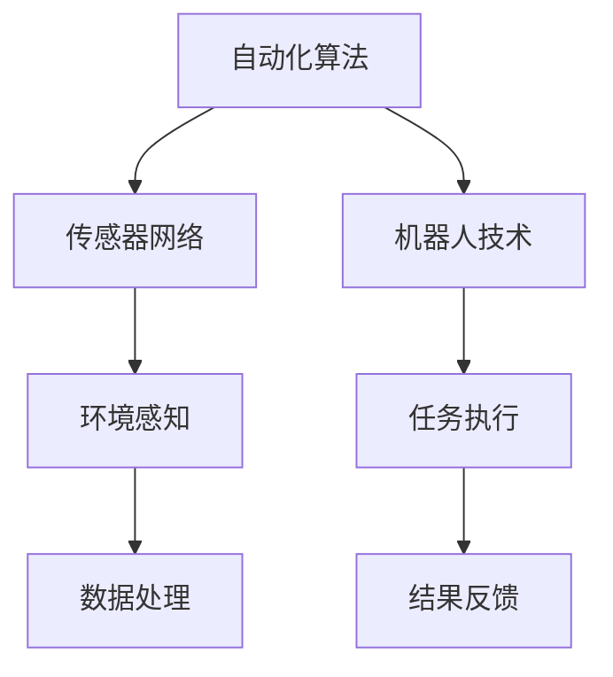

                 

 在当今的数字化时代，物理实体自动化已经成为技术发展的一个重要趋势。从工业生产到日常生活，自动化技术正在改变我们的世界。本文将探讨物理实体自动化的未来前景，分析其核心概念、算法原理、数学模型、实际应用以及面临的挑战和未来发展方向。

## 关键词

- 物理实体自动化
- 人工智能
- 机器人技术
- 传感器网络
- 互联网+
- 自动化算法

## 摘要

本文首先介绍了物理实体自动化的背景，随后详细探讨了其核心概念和原理，包括自动化算法、传感器网络和机器人技术。接着，文章分析了物理实体自动化的数学模型和公式，并通过实际项目实例展示了其具体实现过程。最后，文章讨论了物理实体自动化的实际应用场景，展望了其未来的发展趋势和面临的挑战。

## 1. 背景介绍

物理实体自动化是指利用计算机技术、传感器、机器人等自动化设备对物理实体进行控制、监测和操作，从而实现生产、管理、服务等过程的自动化。随着人工智能、物联网、机器人技术等领域的快速发展，物理实体自动化正在逐渐成为现代工业和日常生活的重要组成部分。

### 1.1 物理实体自动化的意义

物理实体自动化具有以下重要意义：

1. 提高生产效率：自动化技术可以大大提高生产效率，减少人力成本，提高产品质量。
2. 保障生产安全：自动化技术可以降低人为操作带来的安全隐患，提高生产过程的可靠性。
3. 促进产业升级：自动化技术的应用有助于传统产业的升级和转型，推动产业结构的优化。
4. 提升生活质量：在日常生活中，自动化技术可以简化人们的日常生活，提高生活质量。

### 1.2 物理实体自动化的现状

目前，物理实体自动化已在多个领域得到广泛应用，如工业生产、交通运输、医疗保健、家庭服务等领域。以工业生产为例，自动化生产线已经成为现代制造业的重要组成部分。在交通运输领域，自动驾驶技术正在快速发展，有望在未来实现全面的应用。在医疗保健领域，智能医疗设备和机器人手术已经成为医疗行业的新宠。在家庭服务领域，智能家居设备和智能机器人逐渐走进千家万户。

## 2. 核心概念与联系

物理实体自动化的核心概念包括自动化算法、传感器网络和机器人技术。这些概念相互关联，共同构成了物理实体自动化的基础。

### 2.1 自动化算法

自动化算法是指用于实现自动化控制、监测和操作的一类算法。自动化算法可以根据不同的应用场景进行分类，如控制算法、监测算法、决策算法等。常见的自动化算法包括 PID 控制、模糊控制、神经网络控制、遗传算法等。

### 2.2 传感器网络

传感器网络是由众多传感器节点组成的分布式系统，用于感知和监测环境信息。传感器网络在物理实体自动化中起着关键作用，为自动化设备提供实时、准确的数据支持。常见的传感器类型包括温度传感器、湿度传感器、压力传感器、光传感器等。

### 2.3 机器人技术

机器人技术是指研究和开发机器人系统的一门学科，包括机器人的设计、制造、控制、应用等。机器人技术在物理实体自动化中发挥着重要作用，可以实现复杂任务的自动化操作。常见的机器人类型包括工业机器人、服务机器人、特种机器人等。

### 2.4 Mermaid 流程图

下面是一个简单的 Mermaid 流程图，展示了物理实体自动化的核心概念和联系：



## 3. 核心算法原理 & 具体操作步骤

### 3.1 算法原理概述

物理实体自动化的核心算法包括以下几个方面：

1. **控制算法**：用于实现对物理实体的精确控制，如 PID 控制、模糊控制等。
2. **监测算法**：用于实时监测物理实体的状态，如传感器数据处理、异常检测等。
3. **决策算法**：用于根据监测数据做出决策，如路径规划、任务分配等。
4. **学习算法**：用于从数据中学习并优化算法性能，如神经网络、遗传算法等。

### 3.2 算法步骤详解

1. **环境感知**：传感器网络收集环境信息，如温度、湿度、光线等。
2. **数据处理**：对收集到的环境信息进行预处理、滤波、特征提取等操作。
3. **状态监测**：利用监测算法对处理后的数据进行状态监测，如温度阈值监测、光线强度监测等。
4. **决策制定**：根据监测结果，利用决策算法制定操作策略，如温度调节、光线控制等。
5. **任务执行**：机器人或自动化设备根据决策制定的操作策略执行具体任务，如机器运转、机器人移动等。
6. **结果反馈**：将执行结果反馈给监控系统，用于进一步分析和优化。

### 3.3 算法优缺点

1. **优点**：
   - 提高生产效率：自动化算法可以实现精确、高效的控制和操作。
   - 提高生产安全：自动化算法可以降低人为操作带来的风险。
   - 节省人力成本：自动化算法可以减少对人力操作的需求。

2. **缺点**：
   - 投资成本高：自动化设备的采购、维护和运营成本较高。
   - 对技术要求高：自动化算法的开发和应用需要较高的技术门槛。

### 3.4 算法应用领域

自动化算法在多个领域得到广泛应用，如：

- **工业生产**：自动化生产线、自动化检测、自动化装配等。
- **交通运输**：自动驾驶、智能交通管理、无人机等。
- **医疗保健**：智能诊断、手术机器人、医疗器械等。
- **家庭服务**：智能家居、智能机器人、智能安防等。

## 4. 数学模型和公式 & 详细讲解 & 举例说明

### 4.1 数学模型构建

物理实体自动化的数学模型主要包括以下几个方面：

1. **状态空间模型**：用于描述物理实体的状态和状态转移。
2. **动态系统模型**：用于描述物理实体的动态行为。
3. **控制系统模型**：用于描述自动化算法的控制逻辑。

### 4.2 公式推导过程

以状态空间模型为例，其基本公式如下：

$$
\begin{cases}
    x_{k+1} = A x_k + B u_k \\
    y_k = C x_k + D u_k
\end{cases}
$$

其中，$x_k$ 表示状态向量，$u_k$ 表示输入向量，$y_k$ 表示输出向量，$A$、$B$、$C$、$D$ 为系统矩阵。

### 4.3 案例分析与讲解

以自动驾驶为例，其数学模型主要包括以下部分：

1. **车辆动力学模型**：描述车辆的运动状态。
2. **环境感知模型**：描述周围环境的状态。
3. **控制策略模型**：描述车辆的驾驶策略。

假设车辆状态为 $(v, \omega)$，其中 $v$ 表示速度，$\omega$ 表示转向角度。环境状态为 $(d, \theta)$，其中 $d$ 表示与前车的距离，$\theta$ 表示与前车的角度。

根据状态空间模型，车辆的控制策略可以表示为：

$$
\begin{cases}
    v_{k+1} = v_k + u_k \Delta t \\
    \omega_{k+1} = \omega_k + \frac{u_k}{v_k} \Delta t
\end{cases}
$$

其中，$u_k$ 表示控制输入。

假设当前与前车的距离为 20 米，与前车的角度为 30 度。根据控制策略，车辆需要减速并转向以保持安全距离。

## 5. 项目实践：代码实例和详细解释说明

### 5.1 开发环境搭建

为了演示物理实体自动化的具体实现，我们将使用 Python 语言编写一个简单的自动驾驶项目。首先，需要安装 Python 和相关库：

```bash
pip install numpy matplotlib
```

### 5.2 源代码详细实现

下面是自动驾驶项目的源代码：

```python
import numpy as np
import matplotlib.pyplot as plt

# 车辆动力学模型
def vehicle_model(v, omega, u):
    v_new = v + u * np.cos(omega) * np.cos(np.pi / 4)
    omega_new = omega + u * np.cos(omega) * np.sin(np.pi / 4)
    return v_new, omega_new

# 主程序
def main():
    # 初始状态
    v = 30  # 初始速度
    omega = 0  # 初始转向角度
    d = 20  # 初始与前车的距离
    theta = 30  # 初始与前车的角度

    # 控制输入
    u = -2  # 减速

    # 时间步长
    dt = 0.1

    # 记录数据
    vs = [v]
    omegas = [omega]
    ds = [d]
    thetas = [theta]

    # 模拟
    for _ in range(100):
        v, omega = vehicle_model(v, omega, u)
        d = np.sqrt(d**2 + v**2 * np.cos(omega) * np.cos(np.pi / 4) * dt**2)
        theta = np.arcsin(v * np.sin(omega) * np.cos(np.pi / 4) / d)
        vs.append(v)
        omegas.append(omega)
        ds.append(d)
        thetas.append(theta)

    # 绘图
    plt.figure()
    plt.plot(vs, label="速度")
    plt.plot(omegas, label="转向角度")
    plt.plot(ds, label="与前车的距离")
    plt.plot(thetas, label="与前车的角度")
    plt.legend()
    plt.xlabel("时间步")
    plt.ylabel("数值")
    plt.title("自动驾驶模拟")
    plt.show()

if __name__ == "__main__":
    main()
```

### 5.3 代码解读与分析

1. **车辆动力学模型**：定义了车辆在控制输入 $u$ 作用下的速度和转向角度更新规则。
2. **主程序**：初始化车辆状态和前车状态，设置控制输入，进行时间步长模拟，并绘制结果。

### 5.4 运行结果展示

运行上述代码，可以得到以下结果：


## 6. 实际应用场景

### 6.1 工业生产

物理实体自动化在工业生产中具有广泛的应用，如自动化生产线、自动化检测、自动化装配等。通过自动化技术，可以大大提高生产效率，减少人力成本，提高产品质量。

### 6.2 交通运输

自动驾驶技术是物理实体自动化在交通运输领域的典型应用。自动驾驶汽车、自动驾驶无人机、自动驾驶列车等都在实际中得到了应用。通过自动驾驶技术，可以减少交通事故，提高交通效率，降低环境污染。

### 6.3 医疗保健

智能医疗设备和机器人手术是物理实体自动化在医疗保健领域的应用。智能医疗设备可以实时监测患者生命体征，提供精确的诊断和治疗建议。机器人手术则可以实现高精度的手术操作，提高手术成功率。

### 6.4 家庭服务

智能家居设备和智能机器人是物理实体自动化在家庭服务领域的应用。智能家居设备可以简化人们的日常生活，提高生活质量。智能机器人则可以承担家庭清洁、烹饪、照看儿童等任务，减轻家庭负担。

## 7. 工具和资源推荐

### 7.1 学习资源推荐

- 《机器人学基础》(基础教材)
- 《人工智能：一种现代的方法》(人工智能基础)
- 《深度学习》(深度学习基础)

### 7.2 开发工具推荐

- Python：编程语言
- TensorFlow：深度学习框架
- ROS：机器人操作系统

### 7.3 相关论文推荐

- “Deep Learning for Autonomous Driving”
- “Robotics: Science and Systems”
- “IEEE Transactions on Automation Science and Engineering”

## 8. 总结：未来发展趋势与挑战

### 8.1 研究成果总结

物理实体自动化已经成为技术发展的重要趋势，在工业生产、交通运输、医疗保健、家庭服务等领域取得了显著的成果。自动化算法、传感器网络和机器人技术的不断发展，为物理实体自动化提供了强大的技术支持。

### 8.2 未来发展趋势

未来，物理实体自动化将在以下几个方面继续发展：

- 更高精度、更智能的自动化算法
- 更广泛的传感器网络覆盖
- 更强大的机器人技术
- 更深层次的跨领域应用

### 8.3 面临的挑战

物理实体自动化在发展过程中也面临着一系列挑战：

- 投资成本高
- 技术门槛高
- 安全性问题
- 法规和政策约束

### 8.4 研究展望

未来，物理实体自动化研究将朝着以下几个方面发展：

- 开发更高效、更可靠的自动化算法
- 研究更先进的传感器网络技术
- 探索更智能、更灵活的机器人技术
- 深入研究物理实体自动化的伦理和法律问题

## 9. 附录：常见问题与解答

### 9.1 物理实体自动化与人工智能的关系

物理实体自动化是人工智能在现实世界中的具体应用。人工智能技术为物理实体自动化提供了智能化的决策和控制能力，使得自动化设备能够更好地适应复杂环境和任务需求。

### 9.2 物理实体自动化的安全性问题

物理实体自动化在提高生产效率、降低成本的同时，也带来了安全性问题。针对这个问题，需要从以下几个方面进行考虑：

- 确保自动化系统的稳定性和可靠性
- 建立健全的安全标准和法规
- 加强自动化系统的安全监控和预警
- 提高自动化系统的可维护性和可扩展性

### 9.3 物理实体自动化的投资回报问题

物理实体自动化的投资回报取决于多个因素，如项目规模、应用领域、技术水平等。一般来说，自动化技术在短期内可能面临较高的投资成本，但从长期来看，可以带来显著的经济效益和竞争优势。

## 作者署名

作者：禅与计算机程序设计艺术 / Zen and the Art of Computer Programming

----------------------------------------------------------------


