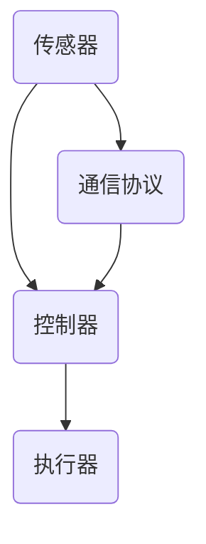

                 

关键词：物理实体自动化，智能控制，边缘计算，物联网，人工智能，机器学习，机器人技术，自动化系统设计

摘要：随着科技的飞速发展，物理实体自动化正逐渐成为现代工业和日常生活中的重要组成部分。本文将探讨物理实体自动化的核心概念、关键算法原理、数学模型与公式、项目实践以及未来应用展望，旨在为读者提供一个全面深入的了解。

## 1. 背景介绍

物理实体自动化是指通过智能控制和自动化技术，使物理实体（如机器人、工业设备、汽车等）能够执行预定任务，以提高效率、降低成本并提高安全性。这一领域涉及多个学科，包括计算机科学、机械工程、电子工程和物理学。近年来，随着物联网、人工智能和边缘计算等技术的发展，物理实体自动化得到了广泛关注和应用。

### 1.1 物理实体自动化的意义

物理实体自动化具有以下几方面的重要意义：

- **提高生产效率**：自动化系统可以大幅减少人工干预，提高生产线的效率和产能。
- **降低运营成本**：自动化减少了人工成本和材料浪费，降低了整体运营成本。
- **提升安全性**：自动化系统能够在危险环境下执行任务，减少人员伤亡和设备损坏。
- **促进创新**：自动化技术的应用推动了新产品和新服务的开发，促进了科技创新。

### 1.2 物理实体自动化的应用领域

物理实体自动化在多个领域得到了广泛应用，包括但不限于：

- **制造业**：生产线自动化、装配自动化、质量检测自动化等。
- **服务业**：物流配送、家庭服务机器人、智能客服等。
- **医疗**：手术机器人、医疗设备自动化等。
- **交通**：自动驾驶汽车、无人机等。

## 2. 核心概念与联系

为了深入理解物理实体自动化的工作原理和实现方法，我们需要先掌握几个核心概念：

- **传感器**：用于感知物理实体状态的设备，如温度传感器、湿度传感器、摄像头等。
- **执行器**：用于控制物理实体行为的设备，如电机、液压缸、气动阀门等。
- **控制器**：负责处理传感器数据，并根据预设算法生成控制指令，驱动执行器的设备或软件。
- **通信协议**：用于数据传输和设备间通信的协议，如TCP/IP、MQTT、HTTP等。

以下是一个简化的物理实体自动化的 Mermaid 流程图，展示了各个核心概念之间的联系：



### 2.1 物理实体自动化的架构设计

一个典型的物理实体自动化系统通常包括以下组成部分：

- **感知层**：由各种传感器组成，负责收集物理实体的状态信息。
- **传输层**：通过通信协议将传感器数据传输到控制器。
- **控制层**：由控制器和算法组成，负责处理数据并生成控制指令。
- **执行层**：由执行器组成，负责执行控制指令，实现对物理实体的控制。

## 3. 核心算法原理 & 具体操作步骤

### 3.1 算法原理概述

物理实体自动化的核心在于算法的设计与实现。算法的原理主要包括以下几个方面：

- **传感器数据处理**：通过数据滤波、特征提取等算法，对传感器数据进行预处理，提高数据的准确性和可靠性。
- **状态监测与预测**：利用机器学习算法，对物理实体的状态进行监测和预测，以便及时做出调整。
- **路径规划与优化**：在移动机器人等应用中，利用路径规划算法，为物理实体确定最优路径。
- **控制策略设计**：根据物理实体的任务需求，设计合适的控制策略，实现对物理实体的精准控制。

### 3.2 算法步骤详解

以下是一个简化的物理实体自动化算法的实现步骤：

1. **初始化**：配置传感器、执行器和通信协议，初始化控制变量。
2. **数据采集**：周期性地从传感器读取数据，进行预处理。
3. **状态监测**：利用机器学习模型对传感器数据进行状态监测，预测物理实体未来的状态。
4. **路径规划**：根据物理实体的当前状态和任务需求，计算最优路径。
5. **控制执行**：根据路径规划结果，生成控制指令，驱动执行器执行相应的动作。
6. **结果反馈**：监测执行器的动作效果，进行实时调整。

### 3.3 算法优缺点

各种物理实体自动化算法具有不同的优缺点，以下是一个简化的对比：

- **优点**：
  - **高效性**：自动化算法能够快速处理大量数据，提高效率。
  - **精准性**：算法能够精确控制物理实体，实现高精度的任务执行。
  - **适应性**：算法能够适应不同的环境和任务需求，具备较强的灵活性。

- **缺点**：
  - **复杂度**：自动化算法的实现和调试较为复杂，需要高水平的技术人员。
  - **鲁棒性**：在某些极端情况下，算法可能失效，需要额外的安全措施。

### 3.4 算法应用领域

物理实体自动化算法广泛应用于多个领域，包括但不限于：

- **工业自动化**：生产线自动化、装配自动化、质量检测自动化等。
- **机器人技术**：移动机器人、服务机器人、医疗机器人等。
- **智能交通**：自动驾驶汽车、无人机等。
- **智能家居**：智能安防、智能照明、智能家电等。

## 4. 数学模型和公式 & 详细讲解 & 举例说明

物理实体自动化涉及到多种数学模型和公式，以下是一些常用的数学模型和其具体应用：

### 4.1 数学模型构建

物理实体自动化的数学模型通常包括以下几方面：

- **状态空间模型**：用于描述物理实体的状态和行为。
- **控制模型**：用于设计控制算法，实现物理实体的精确控制。
- **优化模型**：用于路径规划、资源分配等问题。

### 4.2 公式推导过程

以下是一个简化的状态空间模型的推导过程：

1. **状态变量定义**：设物理实体的状态向量为 \( x \)，包含位置、速度、加速度等变量。
2. **状态方程**：定义状态方程为 \( \dot{x} = f(x, u) \)，其中 \( \dot{x} \) 表示状态的变化率，\( f \) 为状态转移函数，\( u \) 为控制输入。
3. **控制输入**：根据物理实体的任务需求，设计控制输入 \( u \)，实现状态的变化。

### 4.3 案例分析与讲解

以下是一个简单的例子，用于说明状态空间模型的应用：

假设一个移动机器人需要在二维空间内从初始位置 \( (0, 0) \) 移动到目标位置 \( (5, 3) \)，其状态方程为：

\[ \dot{x} = \begin{bmatrix} \dot{x}_1 \\ \dot{x}_2 \end{bmatrix} = \begin{bmatrix} v_1 \\ v_2 \end{bmatrix} = f(x, u) \]

其中，\( x_1 \) 和 \( x_2 \) 分别表示机器人在 \( x \) 和 \( y \) 方向上的位置，\( v_1 \) 和 \( v_2 \) 分别表示机器人在 \( x \) 和 \( y \) 方向上的速度。

为了实现这一目标，我们可以设计一个简单的控制策略，使机器人在每个时间步长内都向目标位置移动一定的距离。具体公式如下：

\[ u = \begin{bmatrix} \frac{5 - x_1}{T} \\ \frac{3 - x_2}{T} \end{bmatrix} \]

其中，\( T \) 为时间步长。

通过不断更新状态变量 \( x \) 和控制输入 \( u \)，机器人最终能够到达目标位置。

## 5. 项目实践：代码实例和详细解释说明

为了更好地理解物理实体自动化的实现过程，以下是一个简单的代码实例，用于控制一个移动机器人移动到目标位置。

### 5.1 开发环境搭建

1. **硬件要求**：一个可以接收控制指令的移动机器人（如四轴飞行器、无人车等）。
2. **软件要求**：Python 3.7 以上版本、Matplotlib 库、NumPy 库。

### 5.2 源代码详细实现

以下是一个简单的 Python 代码实例，用于控制移动机器人移动到目标位置：

```python
import numpy as np
import matplotlib.pyplot as plt

# 初始状态
x = np.array([0, 0])  # 位置
u = np.array([0, 0])  # 控制输入

# 目标位置
x_goal = np.array([5, 3])

# 时间步长
T = 0.1

# 控制策略
def control_strategy(x, x_goal, T):
    delta_x = x_goal - x
    u = delta_x / T
    return u

# 移动机器人
def move_robot(x, u, T):
    x_new = x + u * T
    return x_new

# 模拟移动过程
num_steps = 50
x_history = [x]
u_history = [u]

for _ in range(num_steps):
    u = control_strategy(x, x_goal, T)
    x = move_robot(x, u, T)
    x_history.append(x)
    u_history.append(u)

# 绘制结果
plt.plot([x[0] for x in x_history], [x[1] for x in x_history], 'ro-')
plt.plot([x[0] for x in x_history], [x[1] for x in x_history])
plt.show()
```

### 5.3 代码解读与分析

1. **初始化状态**：代码首先定义了机器人的初始位置 \( x \) 和控制输入 \( u \)，以及目标位置 \( x\_goal \) 和时间步长 \( T \)。
2. **控制策略**：`control\_strategy` 函数根据当前状态 \( x \) 和目标位置 \( x\_goal \)，计算控制输入 \( u \)。
3. **移动机器人**：`move\_robot` 函数根据控制输入 \( u \) 和时间步长 \( T \)，更新机器人的位置。
4. **模拟移动过程**：代码通过循环模拟机器人的移动过程，记录每一步的位置变化和控制输入。
5. **绘制结果**：使用 Matplotlib 库绘制机器人的移动轨迹。

通过这个简单的实例，我们可以看到物理实体自动化的实现过程。虽然这个例子较为简化，但它展示了物理实体自动化系统的基本原理和实现方法。

## 6. 实际应用场景

物理实体自动化在各个领域都有着广泛的应用，以下是一些典型的实际应用场景：

### 6.1 制造业

- **生产线自动化**：通过自动化机器人和控制系

