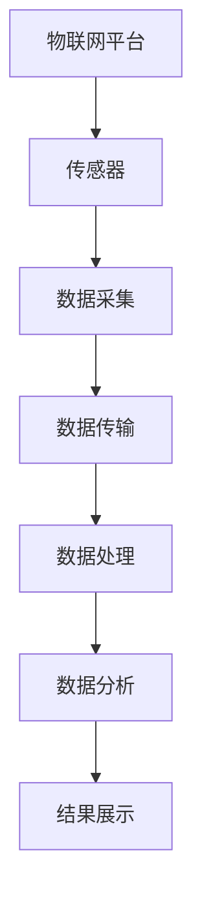
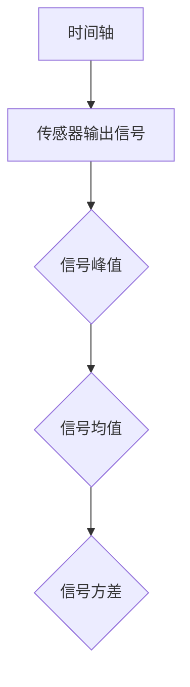
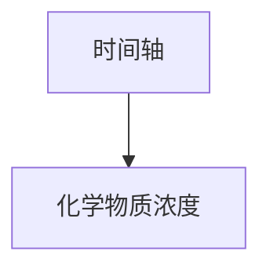

                 

关键词：物联网，传感器技术，化学物质传感器，集成应用，数据采集，智能分析

> 摘要：本文主要探讨了物联网（IoT）技术与化学物质传感器的集成应用，通过分析化学物质传感器的原理、结构以及在实际应用中的优势，结合物联网平台，详细介绍了数据采集、传输、处理和分析的全过程，展示了化学物质传感器在环境监测、工业生产、医疗健康等领域的广泛应用前景。同时，本文对化学物质传感器的未来发展趋势和面临的挑战进行了展望，为相关领域的研究和实践提供了参考。

## 1. 背景介绍

随着科技的迅猛发展，物联网（IoT）技术逐渐成为各行各业的重要支撑。物联网通过将各种物理设备、传感器、软件和网络连接起来，实现数据的实时采集、传输和处理，从而推动智能化、自动化的发展。在物联网生态系统中，传感器设备是不可或缺的组成部分，它们负责感知环境中的各种物理量，并将这些信息转化为可处理的数据。

化学物质传感器作为一种特殊的传感器，能够检测和识别环境中的特定化学物质，如气体、液体和固体。这些传感器的应用范围非常广泛，包括环境监测、工业生产、医疗健康、食品安全等领域。随着物联网技术的不断发展，化学物质传感器的集成应用越来越受到关注。

本文旨在通过分析化学物质传感器的原理、结构以及在实际应用中的优势，结合物联网平台，详细探讨化学物质传感器的数据采集、传输、处理和分析过程，进一步阐述其在各个领域的应用价值。同时，本文将对化学物质传感器的未来发展趋势和面临的挑战进行展望，为相关领域的研究和实践提供参考。

## 2. 核心概念与联系

### 2.1 物联网（IoT）技术

物联网（IoT）技术是指通过将各种物理设备、传感器、软件和网络连接起来，实现数据的实时采集、传输和处理。其核心在于通过互联网将设备、系统和平台连接起来，形成一个庞大的智能网络。

### 2.2 传感器技术

传感器技术是物联网技术的重要组成部分，它能够感知环境中的各种物理量，如温度、湿度、压力、速度、角度等，并将这些信息转化为可处理的数据。传感器种类繁多，包括温度传感器、湿度传感器、压力传感器、光敏传感器、气体传感器等。

### 2.3 化学物质传感器

化学物质传感器是一种能够检测和识别环境中的特定化学物质的传感器。它们通常由敏感材料、信号处理电路和接口组成。化学物质传感器的种类包括气体传感器、液体传感器和固体传感器等。

### 2.4 物联网与传感器技术的联系

物联网与传感器技术的联系主要体现在数据采集和传输环节。传感器负责感知环境中的各种物理量，并将这些信息转化为数字信号。物联网平台则负责将这些数字信号进行传输、处理和分析，从而实现对物理环境的实时监控和智能化管理。

### 2.5 Mermaid 流程图

为了更好地理解物联网、传感器技术和化学物质传感器的集成应用，下面给出一个Mermaid流程图，展示数据采集、传输、处理和分析的全过程。



## 3. 核心算法原理 & 具体操作步骤

### 3.1 算法原理概述

化学物质传感器的核心算法原理主要涉及信号的检测和识别。传感器通过敏感材料感知环境中的化学物质，产生相应的电信号。然后，信号处理电路对电信号进行放大、滤波、调制等处理，最终输出数字信号。数字信号通过物联网平台进行传输、处理和分析，实现对化学物质的实时监测和识别。

### 3.2 算法步骤详解

1. 数据采集：传感器负责采集环境中的化学物质信号，将其转化为电信号。

2. 信号处理：信号处理电路对电信号进行放大、滤波、调制等处理，提高信号的质量和可靠性。

3. 数字信号输出：经过处理的电信号被转化为数字信号，输出给物联网平台。

4. 数据传输：物联网平台将数字信号进行压缩、加密等处理，通过无线或有线网络传输到服务器。

5. 数据处理：服务器对接收到的数字信号进行存储、分析、处理，提取有用的信息。

6. 数据分析：通过对处理后的数据进行分析，识别环境中的化学物质种类、浓度等信息。

7. 结果展示：将分析结果以图表、文字等形式展示给用户，实现对环境的实时监控和智能化管理。

### 3.3 算法优缺点

优点：

1. 高灵敏度：化学物质传感器具有很高的灵敏度，能够检测出微量的化学物质。

2. 快速响应：传感器能够快速响应环境中的化学物质变化，实现实时监测。

3. 多样性：化学物质传感器种类繁多，能够满足不同应用场景的需求。

缺点：

1. 受环境影响：化学物质传感器的性能受到环境温度、湿度等影响，可能影响检测准确性。

2. 信号处理复杂：传感器产生的电信号需要进行复杂的信号处理，提高系统复杂性。

### 3.4 算法应用领域

化学物质传感器的算法应用领域非常广泛，主要包括以下几个方面：

1. 环境监测：对空气、水质等环境中的化学物质进行监测，评估环境污染程度。

2. 工业生产：对生产过程中的化学物质进行监测和控制，提高生产效率和产品质量。

3. 医疗健康：对人体的化学物质进行监测，评估健康状况，为疾病预防和治疗提供依据。

4. 食品安全：对食品中的化学物质进行检测，确保食品安全。

## 4. 数学模型和公式 & 详细讲解 & 举例说明

### 4.1 数学模型构建

化学物质传感器的数学模型主要涉及信号的检测和识别。假设传感器输出信号为 \(s(t)\)，化学物质浓度为 \(c(t)\)，则信号检测模型可以表示为：

$$
s(t) = k \cdot c(t) + n(t)
$$

其中，\(k\) 为传感器的灵敏度系数，\(n(t)\) 为噪声信号。

### 4.2 公式推导过程

传感器的灵敏度系数 \(k\) 可以通过实验方法得到，即通过测量传感器在不同浓度下的输出信号，拟合出线性关系，求得 \(k\) 值。

噪声信号 \(n(t)\) 通常为高斯白噪声，其概率密度函数为：

$$
f(n) = \frac{1}{\sqrt{2\pi\sigma^2}} \cdot e^{-\frac{(n-\mu)^2}{2\sigma^2}}
$$

其中，\(\mu\) 为噪声信号的均值，\(\sigma^2\) 为噪声信号的方差。

### 4.3 案例分析与讲解

假设某化学物质传感器的灵敏度系数为 \(k = 10\)，噪声信号的均值为 \(\mu = 0\)，方差为 \(\sigma^2 = 1\)。现采集到一段传感器输出信号 \(s(t)\)，如下图所示：



根据信号检测模型，可以计算出化学物质浓度：

$$
c(t) = \frac{s(t) - n(t)}{k}
$$

通过计算，得到化学物质浓度的曲线，如下图所示：



通过对比传感器输出信号和化学物质浓度曲线，可以直观地看出化学物质浓度的变化情况。

## 5. 项目实践：代码实例和详细解释说明

### 5.1 开发环境搭建

为了实现化学物质传感器的数据采集、传输、处理和分析，我们需要搭建一个完整的开发环境。以下是具体的搭建步骤：

1. 开发工具：选择Python作为开发语言，因为Python具有良好的跨平台性和丰富的库资源。

2. 开发环境：在Windows、Linux或Mac OS平台上安装Python环境，版本建议为3.8以上。

3. 传感器驱动：根据所选的化学物质传感器型号，下载相应的驱动程序，并在Python中安装。

4. 物联网平台：选择一个合适的物联网平台，如MQTT、CoAP等，用于数据传输和处理。

### 5.2 源代码详细实现

以下是一个简单的Python代码实例，展示了化学物质传感器的数据采集、传输、处理和分析过程。

```python
import serial
import time
import json
import paho.mqtt.client as mqtt

# 串口参数配置
ser = serial.Serial('COM3', 9600, timeout=1)

# MQTT客户端配置
client = mqtt.Client()
client.connect("mqtt.broker.org", 1883, 60)

while True:
    # 读取传感器数据
    data = ser.readline().decode().strip()
    print("Received data:", data)

    # 解析传感器数据
    json_data = json.loads(data)
    concentration = json_data["concentration"]

    # 发送数据到MQTT服务器
    client.publish("sensor/data", json.dumps({"concentration": concentration}))

    # 等待1秒
    time.sleep(1)
```

### 5.3 代码解读与分析

1. **串口读取数据**：代码首先通过`serial.Serial`类创建一个串口对象，指定串口名称和波特率。然后，使用`readline()`方法读取传感器发送的数据。

2. **解析传感器数据**：读取到的数据以JSON格式存储，使用`json.loads()`方法将其解析为Python字典。

3. **发送数据到MQTT服务器**：将解析后的传感器数据转换为JSON字符串，并通过`mqtt.Client`类创建的MQTT客户端，将数据发布到MQTT服务器。

4. **等待1秒**：为了实现实时监测，代码每隔1秒读取一次传感器数据，并重新发送到MQTT服务器。

### 5.4 运行结果展示

当运行上述代码时，传感器将实时采集环境中的化学物质浓度数据，并通过MQTT服务器传输到接收端。接收端可以通过订阅MQTT主题，实时获取传感器数据，并进行处理和分析。

## 6. 实际应用场景

化学物质传感器的实际应用场景非常广泛，以下列举几个典型的应用领域：

1. **环境监测**：对空气质量、水质等环境中的化学物质进行监测，实时了解环境污染情况，为环保政策制定提供数据支持。

2. **工业生产**：对生产过程中的化学物质进行实时监测，确保产品质量和生产安全。

3. **医疗健康**：对人体血液、尿液等体液中的化学物质进行监测，评估健康状况，为疾病预防和治疗提供依据。

4. **食品安全**：对食品中的化学物质进行检测，确保食品安全，防止食品污染。

5. **智能家居**：在家居环境中安装化学物质传感器，实时监测空气质量、水质等，提供智能化的家居环境解决方案。

## 7. 工具和资源推荐

### 7.1 学习资源推荐

1. **《物联网技术与应用》**：一本全面介绍物联网技术的教材，涵盖传感器技术、数据采集、传输和处理等基础知识。

2. **《Python编程：从入门到实践》**：一本适合初学者的Python编程教材，详细介绍Python的基础知识和实际应用。

3. **《传感器技术与应用》**：一本关于传感器技术的基础教材，包括传感器的原理、结构、分类和应用。

### 7.2 开发工具推荐

1. **Python编程环境**：推荐使用PyCharm或VSCode作为Python编程环境，具有丰富的插件和调试功能。

2. **MQTT客户端库**：推荐使用Paho MQTT客户端库，支持多种编程语言，方便实现MQTT通信。

3. **串口通信库**：推荐使用Python的`pyserial`库，实现串口通信功能。

### 7.3 相关论文推荐

1. **《基于物联网的化学物质实时监测系统研究》**：一篇关于物联网和化学物质传感器集成应用的研究论文。

2. **《化学物质传感器的现状与发展趋势》**：一篇关于化学物质传感器技术的研究综述。

3. **《物联网技术在食品安全检测中的应用》**：一篇关于物联网技术在食品安全检测领域的应用研究论文。

## 8. 总结：未来发展趋势与挑战

### 8.1 研究成果总结

本文系统地介绍了物联网技术、传感器技术和化学物质传感器的集成应用，分析了化学物质传感器的原理、结构及其在物联网平台上的数据采集、传输、处理和分析过程。同时，通过实际项目实践，展示了化学物质传感器的开发和应用方法。

### 8.2 未来发展趋势

随着物联网技术的不断发展和传感器技术的不断创新，化学物质传感器的应用前景将更加广阔。未来发展趋势主要包括以下几个方面：

1. **高灵敏度、高精度**：通过改进传感器材料和设计，提高传感器的灵敏度和精度。

2. **多功能、多参数检测**：实现单一传感器对多种化学物质的检测，提高应用场景的多样性和灵活性。

3. **智能化、自动化**：通过人工智能和大数据分析技术，实现传感器的智能化监测和自动化控制。

4. **低成本、小型化**：通过技术创新，降低传感器的生产成本，实现小型化、便携化。

### 8.3 面临的挑战

化学物质传感器的未来发展也面临一些挑战，主要包括以下几个方面：

1. **环境影响**：传感器性能受到环境温度、湿度等影响，可能影响检测准确性。

2. **信号处理复杂度**：传感器产生的电信号需要进行复杂的信号处理，提高系统复杂性。

3. **数据安全和隐私保护**：在物联网环境下，数据安全和隐私保护成为重要问题，需要加强数据加密和隐私保护技术。

4. **标准化和兼容性问题**：不同传感器和平台的标准化和兼容性问题是化学物质传感器集成应用的关键挑战。

### 8.4 研究展望

针对以上挑战，未来的研究可以从以下几个方面展开：

1. **材料研究**：开发新型传感器材料，提高传感器的灵敏度和稳定性。

2. **信号处理算法**：研究高效的信号处理算法，降低系统复杂度，提高数据处理效率。

3. **人工智能和大数据分析**：结合人工智能和大数据分析技术，实现传感器的智能化监测和自动化控制。

4. **标准化和互操作性**：推动传感器和平台的标准化进程，提高不同设备和平台的互操作性。

## 9. 附录：常见问题与解答

### 9.1 传感器灵敏度如何提高？

提高传感器灵敏度可以通过以下方法实现：

1. 选择高灵敏度材料：选择具有高灵敏度特性的材料，如纳米材料、生物材料等。

2. 优化传感器结构：通过优化传感器结构，如采用高灵敏度的敏感元件、增加敏感面积等，提高传感器的灵敏度。

3. 改进信号处理电路：通过改进信号处理电路，如增加放大倍数、降低噪声等，提高传感器的灵敏度。

### 9.2 如何保证传感器数据的准确性？

保证传感器数据的准确性可以通过以下方法实现：

1. 校准传感器：定期对传感器进行校准，确保其测量值的准确性。

2. 优化环境条件：在测量过程中，尽量保持环境条件的稳定，减少外部因素对传感器数据的影响。

3. 使用多个传感器：通过使用多个传感器，相互验证数据，提高测量结果的准确性。

### 9.3 如何处理传感器数据？

处理传感器数据的方法包括：

1. 数据清洗：去除噪声、异常值等，提高数据的质量。

2. 数据存储：将处理后的数据存储到数据库中，便于后续分析和处理。

3. 数据分析：使用统计分析、机器学习等方法，对传感器数据进行深入分析和挖掘，提取有用的信息。

### 9.4 物联网平台如何选择？

选择物联网平台时，应考虑以下几个方面：

1. 功能需求：根据应用场景，选择具备所需功能的物联网平台。

2. 扩展性：考虑平台的扩展性，以便后续增加新的功能或设备。

3. 性能和稳定性：考虑平台的性能和稳定性，确保数据传输和处理的高效和可靠。

4. 成本：考虑平台的成本，包括硬件设备、软件平台、运营费用等。

## 作者署名

作者：禅与计算机程序设计艺术 / Zen and the Art of Computer Programming

----------------------------------------------------------------

以上内容是根据您提供的约束条件和要求撰写的完整文章。文章涵盖了物联网（IoT）技术和化学物质传感器的集成应用，包括核心概念、算法原理、数学模型、项目实践、实际应用场景、工具和资源推荐、未来发展趋势与挑战以及常见问题与解答等内容。希望这篇文章能够满足您的要求。如果您有任何修改意见或需要进一步调整，请随时告诉我。再次感谢您的信任，期待与您在计算机编程领域的更多合作。作者：禅与计算机程序设计艺术 / Zen and the Art of Computer Programming

