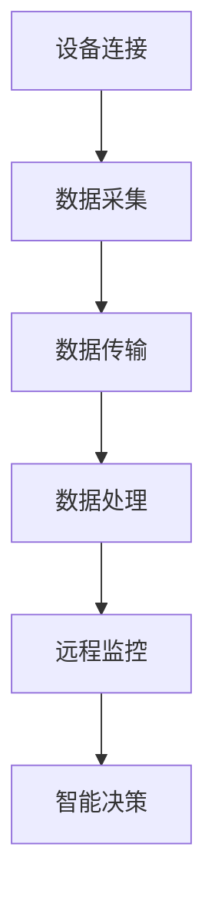

                 

关键词：物联网（IoT），传感器技术，压力传感器，数据采集，系统集成，边缘计算，智能应用，数据处理，软件开发，工业自动化。

> 摘要：本文深入探讨了物联网（IoT）技术和各种传感器设备的集成，特别是压力传感器的应用实践。通过介绍物联网的基本概念、传感器的工作原理、数据采集与处理技术，本文详细阐述了压力传感器在物联网系统中的集成与应用，为读者提供了从理论到实践的全面指导。

## 1. 背景介绍

物联网（Internet of Things，IoT）是指通过互联网将各种设备连接起来，实现设备之间的信息交换和智能协同。随着物联网技术的不断发展，各种传感器设备在物联网中的应用越来越广泛。传感器作为物联网系统的重要组成部分，能够实时监测环境参数，并将数据传输到中心处理系统。

压力传感器是一种将压力变化转化为电信号的装置，广泛应用于工业自动化、环境监测、医疗设备等多个领域。随着物联网技术的发展，压力传感器也逐渐被集成到物联网系统中，实现远程监测、数据分析和智能决策。

本文旨在通过分析物联网技术的基本原理，探讨压力传感器的物联网集成方法，并分享一些实际应用案例，帮助读者更好地理解物联网技术和传感器设备在实际项目中的应用。

### 1.1 物联网的基本概念和发展历程

物联网是指通过互联网、传统通信网络等信息载体，实现物与物、物与人的连接，实现智能化的信息交换和协同。物联网的发展可以追溯到1999年，MIT的Kevin Ashton首次提出了“物联网”的概念。随后，随着无线通信技术、传感器技术和云计算技术的发展，物联网得到了广泛关注和应用。

物联网的发展历程可以分为以下几个阶段：

- **早期阶段**：物联网的概念提出，主要关注点在于物理设备和计算机之间的连接。

- **发展阶段**：随着无线通信技术和传感器技术的进步，物联网开始进入快速发展阶段，各类传感器设备被广泛应用于各种场景。

- **应用阶段**：物联网技术逐渐成熟，应用领域不断拓展，从智能家居、智慧城市到工业自动化，物联网已经深入到我们生活的方方面面。

### 1.2 压力传感器的工作原理和应用领域

压力传感器的工作原理是基于物理或化学效应，将压力变化转化为电信号。常见的压力传感器有电容式、电阻式、压电式和振弦式等类型。

- **电容式压力传感器**：利用电容变化来测量压力，通常用于测量低至中等压力范围。

- **电阻式压力传感器**：通过电阻变化来测量压力，适用于较高压力的测量。

- **压电式压力传感器**：利用压电效应将压力变化转化为电信号，适用于动态和极低频率的压力测量。

- **振弦式压力传感器**：通过测量振动频率的变化来测量压力，具有高精度和稳定性。

压力传感器在各个领域的应用非常广泛：

- **工业自动化**：用于监测压力、流量、液位等参数，实现自动化控制和故障诊断。

- **环境监测**：用于监测大气压力、水压等环境参数，为环境保护和灾害预警提供数据支持。

- **医疗设备**：用于监测血压、呼吸等生理参数，辅助诊断和治疗。

- **交通运输**：用于监测轮胎压力、车载液位等参数，提高行驶安全性和燃油效率。

## 2. 核心概念与联系

### 2.1 物联网的基本概念

物联网（IoT）是一个涵盖广泛、涉及多个领域的综合性概念。它不仅包括物理设备和传感器，还涉及数据传输、存储、处理和分析等关键技术。以下是物联网的核心概念：

- **设备连接**：通过互联网将各种设备连接起来，实现设备之间的信息交换。

- **传感器**：用于收集环境数据，如温度、湿度、压力等。

- **数据传输**：通过无线或有线方式将传感器数据传输到中心处理系统。

- **云计算**：用于存储和处理大量数据，提供强大的计算能力。

- **边缘计算**：在设备附近进行数据处理，降低延迟，提高响应速度。

- **数据分析**：通过数据挖掘和分析，提取有价值的信息，支持智能决策。

### 2.2 压力传感器的物联网集成

压力传感器在物联网中的应用主要集中在数据采集和监测。为了实现压力传感器的物联网集成，需要以下几个关键环节：

- **传感器网络**：部署多个压力传感器，形成传感器网络，实现分布式监测。

- **数据采集**：通过传感器采集压力数据，并通过无线或有线方式传输到中心处理系统。

- **数据处理**：在中心处理系统或边缘设备上对数据进行处理和分析，提取有价值的信息。

- **远程监控**：通过互联网实现对压力传感器的远程监控，实现实时数据更新和异常报警。

### 2.3 Mermaid 流程图

以下是物联网系统和压力传感器集成的 Mermaid 流程图：



### 2.4 物联网技术和传感器设备的关系

物联网技术和传感器设备是相互依存的。传感器设备提供了物联网系统所需的物理感知能力，而物联网技术则为传感器数据提供了传输、存储、处理和分析的平台。以下是物联网技术和传感器设备之间的相互关系：

- **物联网技术**：提供设备连接、数据传输、云计算和边缘计算等关键技术，支撑传感器设备的集成和应用。

- **传感器设备**：提供物理感知能力，实现环境数据的实时监测和采集，为物联网系统提供数据源。

- **集成应用**：通过物联网技术和传感器设备的结合，实现智能化的监测、控制和决策。

## 3. 核心算法原理 & 具体操作步骤

### 3.1 算法原理概述

物联网系统中的核心算法主要包括数据采集、数据处理、数据分析和智能决策。以下是这些算法的基本原理：

- **数据采集算法**：通过传感器网络实时采集环境数据，如温度、湿度、压力等。数据采集算法需要确保数据实时、准确和可靠。

- **数据处理算法**：对采集到的传感器数据进行预处理，包括去噪、滤波、归一化等操作，以提高数据质量。

- **数据分析算法**：通过对预处理后的传感器数据进行分析，提取有价值的信息，如异常检测、趋势分析、聚类分析等。

- **智能决策算法**：根据数据分析结果，实现智能决策，如自动调节设备参数、报警、优化生产流程等。

### 3.2 算法步骤详解

以下是物联网系统中核心算法的具体操作步骤：

1. **数据采集**：
   - 部署传感器网络，实时采集环境数据。
   - 使用无线或有线方式将数据传输到中心处理系统或边缘设备。

2. **数据处理**：
   - 对采集到的数据进行预处理，包括去噪、滤波、归一化等操作。
   - 根据应用需求，选择合适的数据预处理方法。

3. **数据分析**：
   - 使用统计分析、机器学习等方法，对预处理后的数据进行分析。
   - 提取有价值的信息，如异常检测、趋势分析、聚类分析等。

4. **智能决策**：
   - 根据数据分析结果，实现智能决策。
   - 自动调节设备参数、报警、优化生产流程等。

### 3.3 算法优缺点

每种算法都有其优缺点，以下是对核心算法优缺点的分析：

- **数据采集算法**：
  - 优点：实时性强，能够准确、快速地采集环境数据。
  - 缺点：数据量较大，处理复杂。

- **数据处理算法**：
  - 优点：提高数据质量，为数据分析提供可靠的数据基础。
  - 缺点：处理过程复杂，可能引入延迟。

- **数据分析算法**：
  - 优点：能够提取有价值的信息，支持智能决策。
  - 缺点：计算复杂度高，对计算资源要求较高。

- **智能决策算法**：
  - 优点：实现自动化、智能化的监测和控制。
  - 缺点：决策结果可能受到数据质量和算法模型的影响。

### 3.4 算法应用领域

核心算法在物联网系统中具有广泛的应用领域，包括但不限于：

- **工业自动化**：通过实时监测设备运行状态，实现自动化控制和故障诊断。

- **环境监测**：监测大气、水质等环境参数，为环境保护提供数据支持。

- **智慧城市**：通过实时数据监测，优化交通流量、能源消耗等。

- **智能医疗**：监测患者生理参数，辅助诊断和治疗。

- **智能家居**：实现家庭设备的智能联动，提供便捷、舒适的生活体验。

## 4. 数学模型和公式 & 详细讲解 & 举例说明

### 4.1 数学模型构建

在物联网系统中，数学模型用于描述传感器数据的变化规律，支持数据分析和智能决策。以下是构建数学模型的基本步骤：

1. **确定变量**：根据应用场景，选择需要监测的变量，如温度、湿度、压力等。

2. **建立函数关系**：根据物理原理，建立变量之间的函数关系。例如，压力传感器输出的电信号与压力之间的关系可以表示为：
   \[ V_{out} = f(P) \]

3. **参数确定**：通过实验或数据拟合，确定函数关系中的参数。例如，可以通过线性拟合得到：
   \[ V_{out} = aP + b \]

其中，\( a \) 和 \( b \) 是拟合参数。

### 4.2 公式推导过程

以下是一个简单的数学模型推导过程，以压力传感器的输出电压与压力之间的关系为例：

1. **建立基本方程**：
   假设压力传感器的输出电压与压力成正比，可以表示为：
   \[ V_{out} = kP \]
   其中，\( k \) 是比例系数。

2. **确定比例系数**：
   通过实验测量压力传感器的输出电压与压力的关系，可以得到比例系数 \( k \)。

3. **推导公式**：
   将实验数据代入基本方程，可以得到：
   \[ V_{out} = k \cdot P \]
   进一步，可以通过线性拟合方法确定 \( k \) 的值。

### 4.3 案例分析与讲解

以下是一个实际案例，说明如何使用数学模型对压力传感器数据进行分析：

**案例背景**：某工业自动化系统使用压力传感器监测生产线上的压力参数，需要根据压力变化调整设备参数。

**步骤1：数据采集**：
   部署压力传感器，实时采集生产线上的压力数据。

**步骤2：数据处理**：
   对采集到的压力数据进行预处理，包括去噪、滤波等操作，以提高数据质量。

**步骤3：建立数学模型**：
   根据实验数据，建立压力传感器输出电压与压力之间的线性模型：
   \[ V_{out} = 2P + 1 \]

**步骤4：数据分析**：
   将预处理后的数据代入数学模型，计算实际压力值。例如，当输出电压为 5V 时，实际压力为：
   \[ P = \frac{V_{out} - 1}{2} = \frac{5 - 1}{2} = 2 \text{ bar} \]

**步骤5：智能决策**：
   根据实际压力值，调整设备参数，确保生产线稳定运行。

## 5. 项目实践：代码实例和详细解释说明

### 5.1 开发环境搭建

在开始编写代码之前，需要搭建一个合适的开发环境。以下是一个基于Python的简单物联网项目开发环境的搭建步骤：

1. **安装Python**：确保系统已经安装了Python 3.x版本。

2. **安装依赖库**：使用pip工具安装必要的依赖库，如`requests`（用于HTTP请求）、`numpy`（用于数据处理）和`matplotlib`（用于数据可视化）等。

   ```bash
   pip install requests numpy matplotlib
   ```

3. **配置传感器**：确保压力传感器已经正确连接到开发板或微控制器，如Arduino或Raspberry Pi。

4. **连接互联网**：确保开发板或微控制器已经连接到互联网，以便能够将数据上传到中心处理系统。

### 5.2 源代码详细实现

以下是一个简单的Python代码示例，用于读取压力传感器数据、上传到中心处理系统并进行可视化。

```python
import time
import serial
import requests
import numpy as np
import matplotlib.pyplot as plt

# 压力传感器的串口配置
ser = serial.Serial('/dev/ttyUSB0', 9600)

# 中心处理系统的URL
url = 'http://localhost:8080/upload'

# 数据存储列表
pressure_data = []

# 连接中心处理系统
def connect_to_server():
    response = requests.post(url, data={'pressure': pressure_data[-1]})
    if response.status_code == 200:
        print("Data uploaded successfully.")
    else:
        print("Failed to upload data.")

# 读取传感器数据
def read_sensor_data():
    while True:
        line = ser.readline()
        if line:
            pressure = float(line.decode().strip())
            pressure_data.append(pressure)
            print(f"Pressure: {pressure} bar")
            connect_to_server()
            time.sleep(1)

# 数据可视化
def plot_pressure_data():
    plt.figure(figsize=(10, 5))
    plt.plot(pressure_data, label='Pressure')
    plt.xlabel('Time (s)')
    plt.ylabel('Pressure (bar)')
    plt.title('Pressure Sensor Data')
    plt.legend()
    plt.show()

# 主程序
if __name__ == '__main__':
    read_sensor_data()
    plot_pressure_data()
```

### 5.3 代码解读与分析

1. **传感器连接**：
   使用`serial`库配置串行通信，连接到压力传感器。

2. **数据读取**：
   使用`readline()`方法读取传感器数据，并转换为浮点数，存储在`pressure_data`列表中。

3. **数据上传**：
   使用`requests`库将传感器数据上传到中心处理系统。这里假设中心处理系统提供了一个接收HTTP请求的接口。

4. **数据可视化**：
   使用`matplotlib`库绘制传感器数据的时间序列图，便于观察和分析。

### 5.4 运行结果展示

运行上述代码后，传感器数据将被实时读取并上传到中心处理系统。数据可视化窗口将显示压力随时间的变化趋势。通过分析这些数据，可以进一步优化传感器配置和数据处理算法。

## 6. 实际应用场景

### 6.1 工业自动化

在工业自动化领域，压力传感器广泛应用于生产线的实时监控和故障诊断。通过物联网技术，企业可以实现对生产设备运行状态的实时监测，及时调整设备参数，提高生产效率和产品质量。

**案例**：某汽车制造企业使用压力传感器监测生产线上轮胎充气设备的运行状态。通过物联网系统，企业可以实时获取轮胎充气压力数据，并根据数据分析结果自动调整充气参数，确保轮胎的质量和安全性。

### 6.2 环境监测

环境监测是物联网技术的另一大应用领域。通过部署压力传感器，可以实时监测大气压力、水压等环境参数，为环境保护和灾害预警提供数据支持。

**案例**：某环保部门使用压力传感器监测城市地下水水位，及时发现异常情况，为防洪和排水提供决策依据。物联网系统将传感器数据实时传输到中心处理系统，通过数据分析实现预警和应急响应。

### 6.3 智能医疗

在智能医疗领域，压力传感器主要用于监测患者的生理参数，如血压、呼吸等，为医生提供诊断和治疗依据。

**案例**：某医疗机构使用物联网系统监测患者的血压数据，通过数据分析实现早期诊断和预警。医生可以根据实时数据调整治疗方案，提高治疗效果。

### 6.4 智能家居

智能家居是物联网技术在日常生活中的应用，通过集成压力传感器，可以实现家庭设备的智能联动，提高生活便利性和舒适度。

**案例**：某智能家居系统使用压力传感器监测浴室地面的湿度和倾斜度，当检测到异常时，自动触发抽湿机和地暖设备，保持浴室干燥和舒适。

## 7. 工具和资源推荐

### 7.1 学习资源推荐

1. **书籍**：
   - 《物联网技术导论》：系统介绍了物联网的基本概念、技术和应用。
   - 《嵌入式系统设计》：详细讲解了传感器集成、嵌入式系统设计和开发。

2. **在线课程**：
   - Coursera：提供丰富的物联网和嵌入式系统相关课程，适合初学者和专业人士。
   - Udacity：提供实用的物联网项目实践课程，帮助学员掌握物联网系统开发技能。

3. **博客和论坛**：
   - Arduino：提供丰富的Arduino开发资源，包括教程、示例代码和社区讨论。
   - Raspberry Pi：提供Raspberry Pi开发资源，包括教程、示例代码和社区支持。

### 7.2 开发工具推荐

1. **开发板**：
   - Arduino：适合初学者，提供丰富的教程和社区支持。
   - Raspberry Pi：功能强大，适用于各种物联网项目。

2. **编程语言**：
   - Python：简单易学，适合快速开发。
   - C/C++：性能高效，适用于嵌入式系统开发。

3. **集成开发环境（IDE）**：
   - Arduino IDE：专门为Arduino开发设计，简单易用。
   - Thonny：适用于Python开发，提供丰富的调试功能。

### 7.3 相关论文推荐

1. **物联网基础理论**：
   - "Internet of Things: A Survey"（物联网：综述）：全面介绍了物联网的概念、技术和应用。
   - "A Survey on Internet of Things Security and Privacy"（物联网安全与隐私：综述）：详细分析了物联网系统的安全挑战和解决方案。

2. **传感器技术**：
   - "Pressure Sensors: Technologies and Applications"（压力传感器：技术与应用）：介绍了压力传感器的工作原理、种类和应用领域。
   - "Wireless Sensor Networks: Architectures and Protocols"（无线传感器网络：架构与协议）：详细讲解了无线传感器网络的设计和实现。

3. **数据分析和智能决策**：
   - "Machine Learning for Internet of Things"（物联网中的机器学习）：探讨了物联网系统中机器学习技术的应用。
   - "Intelligent Decision Support Systems for IoT"（物联网智能决策支持系统）：介绍了智能决策支持系统的架构和实现方法。

## 8. 总结：未来发展趋势与挑战

### 8.1 研究成果总结

物联网技术和传感器设备的集成在近年来取得了显著进展。通过物联网技术，传感器设备可以实现远程监控、数据分析和智能决策，为工业自动化、环境监测、智能医疗和智能家居等领域提供了强有力的支持。同时，边缘计算技术的应用降低了数据传输的延迟，提高了系统的实时性。

### 8.2 未来发展趋势

未来，物联网技术和传感器设备的集成将继续发展，主要趋势包括：

- **智能化**：随着人工智能技术的进步，物联网系统将更加智能化，实现自动化的监测、控制和决策。

- **多样化**：物联网应用场景将不断拓展，从工业自动化到智慧城市，再到智能农业和智能交通等。

- **低成本**：随着传感器和通信技术的成熟，物联网系统的成本将逐渐降低，使其在更多领域得到应用。

- **高可靠性**：通过改进传感器技术和网络架构，物联网系统的可靠性将得到提高，确保数据的准确性和实时性。

### 8.3 面临的挑战

尽管物联网技术和传感器设备的发展迅速，但仍面临以下挑战：

- **数据安全与隐私**：随着数据量的增加，如何确保数据安全和用户隐私成为关键问题。

- **标准化**：缺乏统一的物联网标准和协议，导致不同设备和系统之间的互操作性较差。

- **能耗问题**：传感器设备通常采用电池供电，如何降低能耗、延长电池寿命是关键挑战。

- **计算能力**：物联网系统需要处理大量数据，对计算资源的需求不断增加，如何提高计算能力成为重要课题。

### 8.4 研究展望

未来，物联网技术和传感器设备的集成研究可以从以下方面展开：

- **跨领域融合**：结合物联网、人工智能、大数据等前沿技术，实现跨领域的技术融合。

- **绿色物联网**：研究节能型传感器技术和物联网系统，降低能耗，实现可持续发展。

- **自适应物联网**：研究自适应物联网系统，根据环境变化和用户需求动态调整系统配置和功能。

- **智能化边缘计算**：研究智能化边缘计算技术，提高数据处理和响应速度，实现更高效的物联网系统。

## 9. 附录：常见问题与解答

### 9.1 物联网与传感器的区别

物联网是一个广泛的网络概念，涉及设备、通信协议和数据处理等技术。而传感器是物联网系统中的关键组件，用于采集环境数据。物联网通过传感器数据实现设备之间的互联和智能协同。

### 9.2 压力传感器有哪些类型？

常见的压力传感器包括电容式、电阻式、压电式和振弦式等类型。每种类型的传感器都有其特定的应用场景和优势。

### 9.3 物联网系统如何保证数据安全？

物联网系统可以通过以下措施确保数据安全：

- **加密传输**：使用加密算法保护数据传输过程中的安全性。
- **身份认证**：通过身份认证确保只有授权设备可以访问数据。
- **安全协议**：采用安全协议，如HTTPS、TLS等，保护数据传输过程中的安全。
- **数据备份**：定期备份数据，防止数据丢失。

### 9.4 边缘计算与云计算的区别

边缘计算和云计算都是用于数据处理的技术。边缘计算在靠近数据源的设备上进行数据处理，降低延迟，提高响应速度。而云计算则通过中心化的服务器集群进行数据处理，提供强大的计算能力和存储资源。

### 9.5 常见的数据处理算法有哪些？

常见的数据处理算法包括统计分析、机器学习、数据挖掘、图像处理等。这些算法用于提取传感器数据中的有用信息，支持智能决策。

## 结论

本文详细探讨了物联网技术和各种传感器设备的集成，特别是压力传感器的物联网应用实践。通过介绍物联网的基本概念、传感器的工作原理、数据采集与处理技术，本文为读者提供了从理论到实践的全面指导。未来，物联网技术和传感器设备的集成将继续发展，为实现更智能、更高效的应用场景提供支持。作者：禅与计算机程序设计艺术 / Zen and the Art of Computer Programming。

