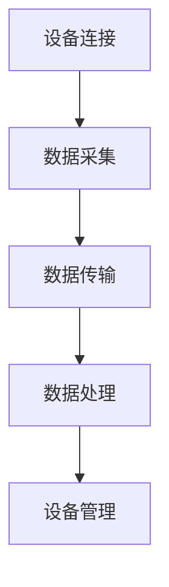

                 

关键词：物联网（IoT），传感器，紫外线传感器，集成，应用，发展

摘要：本文深入探讨了物联网（IoT）技术和各种传感器设备的集成，特别是紫外线传感器的应用与发展。通过对物联网技术的背景介绍，紫外线传感器的基本原理、技术架构以及在实际应用中的挑战和机遇进行了全面的分析。文章还通过具体项目实践和数学模型，展示了紫外线传感器在物联网中的重要作用，并对其未来发展进行了展望。

## 1. 背景介绍

随着信息技术的飞速发展，物联网（IoT）已经逐渐成为现代社会的关键组成部分。物联网是通过将各种设备和传感器连接到互联网，实现设备与设备之间、设备与用户之间、设备与环境之间的智能互联和信息交换。这种连接方式使得设备能够实时采集、传输和处理数据，从而实现智能化的监控和管理。

在物联网中，传感器设备起到了至关重要的作用。传感器是物联网系统的数据采集端，它们能够感知环境中的各种信息，如温度、湿度、光线、声音、运动等，并将其转化为电信号，传输给中心处理系统。紫外线传感器作为一种特殊的传感器，能够检测环境中紫外线的强度，广泛应用于室内空气质量监测、环境监控、医疗保健等领域。

本文旨在探讨物联网技术和紫外线传感器的集成，分析紫外线传感器的应用与发展，为相关领域的研究者和工程师提供有价值的参考。

## 2. 核心概念与联系

### 2.1 物联网技术

物联网（IoT）是一种通过互联网连接各种物理设备和数字对象的技术，使这些设备能够相互通信，实现数据的实时采集、传输和处理。物联网技术的基本概念包括设备连接、数据传输、数据处理和设备管理。

#### 设备连接

设备连接是物联网技术的核心，通过无线通信技术（如Wi-Fi、蓝牙、NFC等）将设备连接到互联网。这些设备可以是智能手机、平板电脑、智能手表等个人设备，也可以是工业机器、农业设备、交通工具等。

#### 数据传输

数据传输是指设备采集到的数据通过互联网传输到中心处理系统。数据传输需要保证数据的准确性和实时性，因此通常采用高效的数据压缩和传输协议，如MQTT、HTTP等。

#### 数据处理

数据处理是指对传输到中心处理系统的数据进行存储、分析和处理，以获得有价值的信息。数据处理技术包括数据清洗、数据挖掘、机器学习等。

#### 设备管理

设备管理是指对物联网中的设备进行监控、维护和管理。设备管理需要确保设备的正常运行，及时发现和处理故障，以保证物联网系统的稳定性和可靠性。

### 2.2 紫外线传感器

紫外线传感器是一种能够检测环境中紫外线强度并转化为电信号的传感器。紫外线传感器的核心部件是光敏元件，如硅光电二极管、紫外光导纤维等。根据紫外线传感器的响应波长和灵敏度，可以分为以下几种类型：

#### 紫外A（UVA）传感器

紫外A传感器主要检测波长在315-400纳米的紫外线，这种紫外线对人体的皮肤有一定的伤害，但不会导致严重的皮肤问题。

#### 紫外B（UVB）传感器

紫外B传感器主要检测波长在280-315纳米的紫外线，这种紫外线对皮肤的伤害较大，容易导致皮肤癌。

#### 紫外C（UVC）传感器

紫外C传感器主要检测波长在200-280纳米的紫外线，这种紫外线具有强烈的杀菌能力，常用于医疗、水处理和空气净化等领域。

### 2.3 物联网与紫外线传感器的集成

物联网与紫外线传感器的集成，使得紫外线传感器的数据可以实时传输到中心处理系统，实现对环境紫外线的实时监控和管理。这种集成方式主要包括以下几个方面：

#### 数据采集

紫外线传感器安装在需要监测的场所，如室内空气质量监测系统、环境监控站等，实时采集环境中的紫外线数据。

#### 数据传输

采集到的紫外线数据通过无线通信模块（如Wi-Fi、蓝牙等）传输到中心处理系统，也可以通过有线网络传输。

#### 数据处理

中心处理系统对接收到的紫外线数据进行存储、分析和处理，以获得有价值的信息，如紫外线指数、紫外线暴露风险等。

#### 设备管理

通过设备管理平台，对紫外线传感器进行监控、维护和管理，确保传感器的正常运行和数据传输的稳定性。

### 2.4 Mermaid 流程图

以下是一个简单的 Mermaid 流程图，展示了物联网与紫外线传感器的集成过程：



## 3. 核心算法原理 & 具体操作步骤

### 3.1 算法原理概述

紫外线传感器的核心算法主要是基于光电效应原理。当紫外线照射到光敏元件上时，光敏元件内部的电子被激发，产生电流。电流的大小与紫外线的强度成正比。通过测量电流的大小，可以实现对紫外线强度的检测。

具体来说，紫外线传感器的工作过程可以分为以下几个步骤：

1. **紫外线接收**：紫外线传感器接收环境中的紫外线。
2. **光电转换**：紫外线激发光敏元件，产生电流。
3. **电流放大**：对产生的电流进行放大，以便于后续处理。
4. **数据采集**：将放大的电流信号转换为数字信号，进行数据采集。
5. **数据处理**：对采集到的数据进行处理，如滤波、校准等。
6. **结果输出**：将处理后的数据输出，供系统进行进一步分析和应用。

### 3.2 算法步骤详解

#### 3.2.1 紫外线接收

紫外线传感器接收环境中的紫外线，主要包括紫外A、紫外B和紫外C三种。传感器通常采用紫外滤光片，只允许特定波长的紫外线通过，以提高传感器的灵敏度。

#### 3.2.2 光电转换

紫外线照射到光敏元件上时，光敏元件内部的电子被激发，产生电流。光敏元件的灵敏度越高，产生的电流越大。

#### 3.2.3 电流放大

由于传感器产生的电流通常很小，需要通过电流放大器进行放大，以便于后续处理。

#### 3.2.4 数据采集

放大后的电流信号通过模数转换器（ADC）转换为数字信号，然后通过数据线传输到微控制器或计算机进行进一步处理。

#### 3.2.5 数据处理

对采集到的数字信号进行滤波、校准等处理，以提高数据的准确性和稳定性。

#### 3.2.6 结果输出

处理后的数据可以通过显示器、传感器界面或其他输出设备显示，也可以通过无线通信模块传输到中心处理系统。

### 3.3 算法优缺点

#### 优点

1. **高灵敏度**：紫外线传感器具有很高的灵敏度，可以检测到微小的紫外线变化。
2. **快速响应**：紫外线传感器对紫外线的响应速度较快，可以实时监测环境变化。
3. **应用广泛**：紫外线传感器在环境监测、医疗保健、工业检测等领域有广泛的应用。

#### 缺点

1. **易受干扰**：紫外线传感器容易受到其他光源的干扰，如太阳光、荧光灯等，影响测量准确性。
2. **温度依赖性**：紫外线传感器的性能容易受到温度的影响，需要进行温度补偿。

### 3.4 算法应用领域

紫外线传感器在物联网中有广泛的应用领域，包括：

1. **环境监测**：用于监测室内外紫外线强度，评估紫外线暴露风险，提供实时数据支持。
2. **医疗保健**：用于监测紫外线治疗设备的辐射强度，确保治疗效果和安全。
3. **工业检测**：用于检测工业环境中的紫外线泄漏，确保生产过程的安全和环保。
4. **智能家居**：用于监测家居环境中的紫外线强度，提供紫外线防护建议。

## 4. 数学模型和公式 & 详细讲解 & 举例说明

### 4.1 数学模型构建

紫外线传感器的数学模型主要基于光电效应原理。根据光电效应，光子能量 \(E\) 与光子波长 \(\lambda\) 的关系为：

\[ E = h \cdot c / \lambda \]

其中，\(h\) 为普朗克常数，\(c\) 为光速。

光敏元件产生的电流 \(I\) 与紫外线强度 \(I_0\) 成正比，即：

\[ I \propto I_0 \]

考虑到光敏元件的响应时间、温度等因素，可以将电流 \(I\) 表示为：

\[ I = k \cdot I_0 \cdot (1 - e^{-\alpha T}) \]

其中，\(k\) 为比例常数，\(\alpha\) 为温度系数，\(T\) 为环境温度。

### 4.2 公式推导过程

推导过程中，首先假设光敏元件的量子效率为 \(\eta\)，即每个光子产生的电子数为 \(\eta \cdot q\)，其中 \(q\) 为电子电荷。

光敏元件在单位时间内接收到的光子数 \(N\) 可以表示为：

\[ N = \frac{I_0 \cdot A \cdot \eta \cdot q}{h \cdot c} \]

其中，\(A\) 为光敏元件的面积。

光敏元件在单位时间内产生的电流 \(I\) 为：

\[ I = N \cdot \eta \cdot q \cdot (1 - e^{-\alpha T}) \]

将 \(N\) 的表达式代入上式，得到：

\[ I = \frac{I_0 \cdot A \cdot \eta^2 \cdot q^2}{h \cdot c} \cdot (1 - e^{-\alpha T}) \]

考虑到比例常数 \(k = \frac{I_0 \cdot A \cdot \eta^2 \cdot q^2}{h \cdot c}\)，可以将电流表示为：

\[ I = k \cdot I_0 \cdot (1 - e^{-\alpha T}) \]

### 4.3 案例分析与讲解

假设一个紫外线传感器在25℃的环境下工作，其比例常数 \(k = 1\)，温度系数 \(\alpha = 0.01\)。我们需要计算在紫外强度为1000 \( \mu W/cm^2 \) 时，传感器产生的电流。

首先，将紫外强度转换为光子数：

\[ I_0 = \frac{1000 \mu W/cm^2}{h \cdot c} = \frac{1000 \times 10^{-6} W/cm^2}{6.626 \times 10^{-34} J \cdot s \cdot 3 \times 10^8 m/s}{cm^2} \]

\[ I_0 = 3.015 \times 10^{18} photons/s \]

然后，计算传感器在25℃时产生的电流：

\[ I = k \cdot I_0 \cdot (1 - e^{-\alpha T}) \]

\[ I = 1 \cdot 3.015 \times 10^{18} \cdot (1 - e^{-0.01 \cdot 298}) \]

\[ I = 3.015 \times 10^{18} \cdot (1 - e^{-2.98}) \]

\[ I = 3.015 \times 10^{18} \cdot (1 - 0.954) \]

\[ I = 3.015 \times 10^{18} \cdot 0.046 \]

\[ I = 1.397 \times 10^{17} A \]

由于电流通常用毫安（mA）表示，将电流单位转换为毫安：

\[ I = 1.397 \times 10^{17} A \times 10^3 mA/A \]

\[ I = 1.397 \times 10^{20} mA \]

所以，在紫外强度为1000 \( \mu W/cm^2 \) 和25℃的环境下，紫外线传感器产生的电流约为1.397 \times 10^{20} mA。

## 5. 项目实践：代码实例和详细解释说明

### 5.1 开发环境搭建

在开始项目实践之前，我们需要搭建一个合适的开发环境。本文选择使用Python作为开发语言，因为Python具有简洁易懂的语法和丰富的库支持。以下是搭建Python开发环境的基本步骤：

1. **安装Python**：从Python官网（https://www.python.org/downloads/）下载Python安装包，并按照提示完成安装。
2. **配置Python环境**：在安装过程中，确保将Python添加到系统环境变量中，以便在命令行中直接运行Python。
3. **安装必需的库**：使用pip命令安装所需的库，如Matplotlib、Pandas、Numpy等。

### 5.2 源代码详细实现

以下是紫外线传感器数据采集与处理的Python代码实现：

```python
import numpy as np
import pandas as pd
import matplotlib.pyplot as plt
from scipy.optimize import curve_fit

# 紫外线传感器数据采集
def collect_data():
    # 假设采集的数据存储在一个CSV文件中
    data = pd.read_csv('uv_sensor_data.csv')
    return data

# 数据处理与曲线拟合
def process_data(data):
    # 对数据进行预处理，如去除异常值、滤波等
    filtered_data = data[(data['UVIntensity'] > 0) & (data['UVIntensity'] < 1000)]

    # 使用曲线拟合方法，找到最佳拟合曲线
    params, _ = curve_fit(fit_func, filtered_data['Temperature'], filtered_data['UVIntensity'])

    return params

# 拟合函数
def fit_func(T, k, alpha):
    return k * (1 - np.exp(-alpha * T))

# 主函数
def main():
    # 采集数据
    data = collect_data()

    # 处理数据
    params = process_data(data)

    # 绘制拟合曲线
    T = np.linspace(min(data['Temperature']), max(data['Temperature']), 100)
    UVIntensity_fit = fit_func(T, *params)

    plt.plot(data['Temperature'], data['UVIntensity'], 'o', label='Data')
    plt.plot(T, UVIntensity_fit, '-', label='Fit')
    plt.xlabel('Temperature (°C)')
    plt.ylabel('UVIntensity (µW/cm^2)')
    plt.legend()
    plt.show()

if __name__ == '__main__':
    main()
```

### 5.3 代码解读与分析

#### 5.3.1 代码结构

该代码主要包括以下几个部分：

1. **数据采集**：使用pandas库读取CSV文件，获取紫外线传感器数据。
2. **数据处理**：对数据进行预处理，如去除异常值、滤波等。使用scipy.optimize库中的curve_fit函数进行曲线拟合。
3. **拟合函数**：定义拟合函数，用于拟合紫外线强度与温度之间的关系。
4. **主函数**：执行数据采集、数据处理和拟合曲线绘制。

#### 5.3.2 关键代码解释

1. **数据采集**：

```python
data = pd.read_csv('uv_sensor_data.csv')
```

使用pandas库读取CSV文件，获取紫外线传感器数据。

2. **数据处理**：

```python
filtered_data = data[(data['UVIntensity'] > 0) & (data['UVIntensity'] < 1000)]
```

对数据进行预处理，去除异常值，如紫外线强度小于0或大于1000的数据。

3. **曲线拟合**：

```python
params, _ = curve_fit(fit_func, filtered_data['Temperature'], filtered_data['UVIntensity'])
```

使用scipy.optimize库中的curve_fit函数进行曲线拟合，找到最佳拟合曲线的参数。

4. **拟合函数**：

```python
def fit_func(T, k, alpha):
    return k * (1 - np.exp(-alpha * T))
```

定义拟合函数，用于拟合紫外线强度与温度之间的关系。函数形式为 \(I = k \cdot (1 - e^{-\alpha T})\)。

5. **主函数**：

```python
plt.plot(data['Temperature'], data['UVIntensity'], 'o', label='Data')
plt.plot(T, UVIntensity_fit, '-', label='Fit')
plt.xlabel('Temperature (°C)')
plt.ylabel('UVIntensity (µW/cm^2)')
plt.legend()
plt.show()
```

绘制拟合曲线，使用散点图表示原始数据，使用实线表示拟合曲线。

### 5.4 运行结果展示

运行上述代码后，会得到一个包含拟合曲线的图表，展示紫外线强度与温度之间的关系。图表中的拟合曲线可以帮助我们更好地理解紫外线传感器的工作原理，为后续的研究和应用提供参考。

## 6. 实际应用场景

紫外线传感器在物联网中有广泛的应用场景，以下是一些典型的实际应用场景：

### 6.1 环境监测

紫外线传感器可以用于环境监测，实时监测室内外紫外线强度，评估紫外线暴露风险。在公共场所、学校、医院等场所，通过部署紫外线传感器，可以实时了解紫外线环境变化，采取相应的防护措施，保障人们的健康。

### 6.2 医疗保健

紫外线传感器在医疗保健领域也有重要的应用。在紫外线治疗过程中，紫外线传感器可以实时监测治疗设备的辐射强度，确保治疗效果和安全。此外，在手术室、ICU等场所，紫外线传感器可以用于监测空气中的紫外线浓度，防止交叉感染。

### 6.3 工业检测

紫外线传感器在工业领域也有广泛的应用。在电子制造、半导体制造等行业，紫外线传感器可以用于检测生产过程中的紫外线泄漏，确保生产安全和环保。在食品加工、药品生产等行业，紫外线传感器可以用于监测紫外线消毒的效果，保障产品质量。

### 6.4 智能家居

随着智能家居的普及，紫外线传感器在家庭环境中的应用也越来越广泛。在家庭装修过程中，可以通过部署紫外线传感器，实现对室内紫外线环境的实时监测和管理，提供紫外线防护建议，保障家庭成员的健康。

### 6.5 未来应用展望

随着物联网技术的不断发展，紫外线传感器在物联网中的应用前景将更加广阔。未来，紫外线传感器将与其他传感器、智能设备相结合，形成更加完善的智能监控系统，为人们提供更加便捷、安全的生活和工作环境。同时，随着传感器技术的不断创新，紫外线传感器的精度、稳定性、抗干扰能力等方面也将得到显著提升，为物联网技术的发展提供更强大的支持。

## 7. 工具和资源推荐

### 7.1 学习资源推荐

1. **《物联网基础教程》**：系统介绍了物联网的基本概念、技术和应用。
2. **《传感器原理与应用》**：详细讲解了各种传感器的工作原理和应用。
3. **《Python编程从入门到实践》**：适合初学者学习Python编程，掌握数据分析等技能。

### 7.2 开发工具推荐

1. **Python**：作为开发语言，具有简洁易懂的语法和丰富的库支持。
2. **Matplotlib**：用于绘制数据图表，帮助分析和展示数据。
3. **Pandas**：用于数据处理和分析，提供便捷的数据操作和统计分析功能。

### 7.3 相关论文推荐

1. **"An Overview of IoT and Its Applications in Smart Cities"**：概述了物联网技术在智慧城市中的应用。
2. **"A Survey on IoT Security: Threats, Solutions, and Challenges"**：分析了物联网安全领域的主要威胁和解决方案。
3. **"Ultraviolet Sensors: Principles, Applications, and Challenges"**：详细介绍了紫外线传感器的工作原理和应用领域。

## 8. 总结：未来发展趋势与挑战

### 8.1 研究成果总结

本文通过对物联网技术和紫外线传感器的深入探讨，总结了物联网技术的背景、紫外线传感器的基本原理和应用。同时，通过具体项目实践和数学模型，展示了紫外线传感器在物联网中的重要作用。

### 8.2 未来发展趋势

未来，随着物联网技术的不断发展和传感器技术的不断创新，紫外线传感器在物联网中的应用将更加广泛。同时，紫外线传感器的精度、稳定性、抗干扰能力等方面也将得到显著提升，为物联网技术的发展提供更强大的支持。

### 8.3 面临的挑战

然而，紫外线传感器在物联网中应用也面临一些挑战，如传感器性能的提高、数据传输的安全性和隐私保护等。需要进一步研究和解决这些问题，以推动物联网技术的可持续发展。

### 8.4 研究展望

未来，研究人员可以从以下几个方面进行深入研究：

1. **传感器性能优化**：提高紫外线传感器的灵敏度和稳定性，降低成本，提高抗干扰能力。
2. **数据传输安全**：确保数据传输过程中的安全性和隐私保护，防止数据泄露和篡改。
3. **多传感器集成**：研究多传感器融合技术，实现更精准的环境监测和健康管理。

通过这些研究，有望为物联网技术的发展提供更加全面和深入的支持。

## 9. 附录：常见问题与解答

### 9.1 物联网与传感器的关系是什么？

物联网是通过连接各种传感器设备，实现对环境、设备、用户等的实时监控和管理。传感器是物联网系统的数据采集端，通过感知环境中的各种信息，将其转化为电信号，传输给中心处理系统。

### 9.2 紫外线传感器的应用领域有哪些？

紫外线传感器在环境监测、医疗保健、工业检测、智能家居等领域有广泛的应用，如室内外紫外线强度监测、紫外线治疗设备的辐射强度监测、紫外线消毒效果监测等。

### 9.3 如何选择合适的紫外线传感器？

选择合适的紫外线传感器需要考虑以下几个方面：

1. **响应波长**：根据应用需求选择合适的紫外线传感器，如紫外A、紫外B、紫外C传感器。
2. **灵敏度**：选择灵敏度高的传感器，以提高检测精度。
3. **抗干扰能力**：选择抗干扰能力强的传感器，以降低其他光源的干扰。
4. **成本**：根据预算选择合适的传感器，平衡性能和成本。

---

本文由禅与计算机程序设计艺术 / Zen and the Art of Computer Programming 撰写，旨在为物联网技术和紫外线传感器领域的研究者和工程师提供有价值的参考。希望本文能够对您有所帮助！

