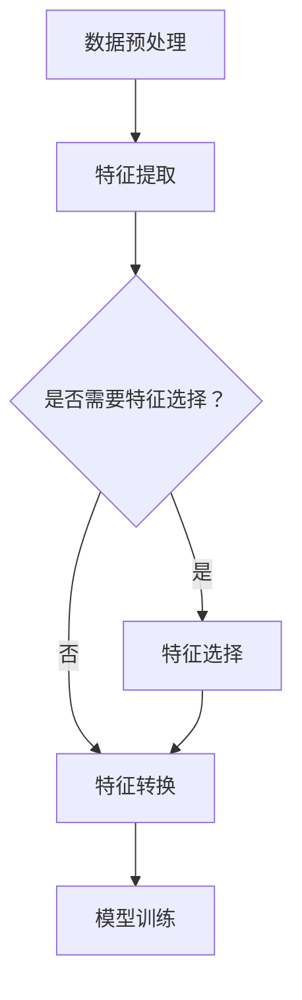

                 

关键词：特征工程、数据预处理、算法优化、代码实例、模型性能

摘要：本文将深入探讨特征工程的核心原理，并结合实际代码实例详细讲解如何进行特征提取、特征选择和特征转换等关键步骤。通过分析特征工程在不同机器学习算法中的应用，本文旨在帮助读者理解特征工程的重要性，掌握特征工程的实际操作技巧，从而提升模型性能和准确性。

## 1. 背景介绍

在机器学习和数据科学领域，特征工程（Feature Engineering）是一个至关重要的步骤。特征工程是指从原始数据中提取出对模型训练有用的特征，并对这些特征进行适当处理，以提高模型的预测准确性和泛化能力。特征工程的好坏往往直接影响到机器学习模型的表现，因此在整个数据处理和模型训练过程中占有举足轻重的地位。

本文将围绕特征工程的三个核心任务展开讨论：特征提取、特征选择和特征转换。我们将通过实际代码实例来演示这些任务的具体实现，并深入探讨它们在不同机器学习算法中的应用和重要性。

### 1.1 特征工程的重要性

特征工程在机器学习中的作用主要体现在以下几个方面：

- **提升模型性能**：通过选择和提取有效的特征，可以显著提高模型的准确性和效率。
- **降低过拟合风险**：特征选择有助于减少模型复杂度，降低过拟合的风险。
- **增强模型泛化能力**：通过优化特征，可以提高模型在新数据上的表现，增强泛化能力。
- **缩短训练时间**：有效的特征工程可以减少模型训练的数据量，从而缩短训练时间。

### 1.2 本文结构

本文将分为以下几个部分：

- **2. 核心概念与联系**：介绍特征工程中的核心概念和原理，并用Mermaid流程图展示特征工程的基本流程。
- **3. 核心算法原理 & 具体操作步骤**：详细讲解特征提取、特征选择和特征转换的算法原理和操作步骤。
- **4. 数学模型和公式 & 详细讲解 & 举例说明**：分析特征工程的数学模型和公式，并结合实例进行讲解。
- **5. 项目实践：代码实例和详细解释说明**：通过实际代码实例展示特征工程的应用。
- **6. 实际应用场景**：探讨特征工程在各个领域中的应用。
- **7. 工具和资源推荐**：推荐学习和使用特征工程的相关工具和资源。
- **8. 总结：未来发展趋势与挑战**：总结本文的内容，展望特征工程的未来发展趋势和面临的挑战。

## 2. 核心概念与联系

在深入探讨特征工程的具体操作之前，我们首先需要了解特征工程中的核心概念和原理。以下是特征工程中的一些关键概念：

- **特征提取（Feature Extraction）**：从原始数据中提取新的特征，以提高模型的表现。
- **特征选择（Feature Selection）**：从大量特征中筛选出最有用的特征，以减少数据维度和计算复杂度。
- **特征转换（Feature Transformation）**：对特征进行线性或非线性变换，以提升模型的预测能力。

接下来，我们用Mermaid流程图展示特征工程的基本流程：



通过这个流程图，我们可以清晰地看到特征工程在数据处理和模型训练中的重要性。在接下来的章节中，我们将详细探讨每个步骤的算法原理和操作步骤。

## 3. 核心算法原理 & 具体操作步骤

### 3.1 特征提取算法原理

特征提取是指从原始数据中提取新的特征，以帮助模型更好地理解数据。常见的特征提取方法包括：

- **主成分分析（PCA）**：通过正交变换将原始数据映射到新的坐标系，提取主要成分。
- **自动编码器（Autoencoder）**：一种无监督学习方法，用于学习原始数据的低维表示。
- **词袋模型（Bag of Words）**：将文本数据转换为向量表示。

#### 3.1.1 主成分分析（PCA）

PCA是一种常用的特征提取方法，其基本原理是通过线性变换将原始数据映射到新的坐标系中，使得新的坐标系中的坐标轴（即主成分）能够最大限度地保留原始数据的方差。

具体步骤如下：

1. **计算协方差矩阵**：计算原始数据矩阵的协方差矩阵。
2. **计算协方差矩阵的特征值和特征向量**：对协方差矩阵进行特征分解。
3. **选择主成分**：根据特征值选择前k个最大的特征向量，作为新的坐标轴。
4. **映射数据**：将原始数据映射到新的坐标轴上。

```python
from sklearn.decomposition import PCA
pca = PCA(n_components=2)
X_pca = pca.fit_transform(X)
```

#### 3.1.2 自动编码器（Autoencoder）

自动编码器是一种神经网络模型，通过无监督学习自动学习原始数据的低维表示。具体步骤如下：

1. **构建自动编码器模型**：定义输入层、隐藏层和输出层。
2. **训练自动编码器模型**：使用原始数据训练模型。
3. **提取特征**：将训练好的自动编码器的隐藏层输出作为特征。

```python
from keras.layers import Input, Dense
from keras.models import Model

input_layer = Input(shape=(input_shape,))
hidden_layer = Dense(hidden_units, activation='relu')(input_layer)
output_layer = Dense(input_shape, activation='sigmoid')(hidden_layer)

autoencoder = Model(inputs=input_layer, outputs=output_layer)
autoencoder.compile(optimizer='adam', loss='binary_crossentropy')

autoencoder.fit(X, X, epochs=epochs, batch_size=batch_size, shuffle=True)
X_reduced = autoencoder.predict(X)
```

### 3.2 特征选择算法原理

特征选择是指从大量特征中筛选出最有用的特征，以减少数据维度和计算复杂度。常见的特征选择方法包括：

- **过滤式特征选择（Filter Method）**：通过统计方法直接评估特征的重要性，筛选出最有用的特征。
- **包裹式特征选择（Wrapper Method）**：通过模型训练评估特征集的优劣，选择最优特征组合。
- **嵌入式特征选择（Embedded Method）**：在模型训练过程中自动筛选特征。

#### 3.2.1 过滤式特征选择

过滤式特征选择主要通过统计方法评估特征的重要性，常用的统计方法包括：

- **信息增益（Information Gain）**：基于特征对目标变量的信息增益评估特征的重要性。
- **互信息（Mutual Information）**：衡量特征与目标变量之间的相关性。

具体步骤如下：

1. **计算特征重要性**：使用统计方法计算每个特征的重要性。
2. **选择特征**：根据特征重要性排序，选择排名靠前的特征。

```python
from sklearn.feature_selection import SelectKBest
from sklearn.feature_selection import chi2

X = data[:, :-1]
y = data[:, -1]

chi2_selector = SelectKBest(score_func=chi2, k=k)
X_new = chi2_selector.fit_transform(X, y)
```

#### 3.2.2 包裹式特征选择

包裹式特征选择通过模型训练评估特征集的优劣，选择最优特征组合。常用的模型包括：

- **决策树（Decision Tree）**：通过树形结构评估特征组合的优劣。
- **支持向量机（SVM）**：通过最大化特征组合的间隔评估特征组合的优劣。

具体步骤如下：

1. **划分训练集和测试集**：将数据划分为训练集和测试集。
2. **迭代特征组合**：遍历所有可能的特征组合。
3. **评估特征组合**：使用训练集评估特征组合的优劣。
4. **选择最优特征组合**：根据评估结果选择最优特征组合。

```python
from sklearn.feature_selection import RFE
from sklearn.linear_model import LinearRegression

model = LinearRegression()
rfe = RFE(model, n_features_to_select=k)
X_rfe = rfe.fit_transform(X, y)
```

### 3.3 特征转换算法原理

特征转换是指对特征进行线性或非线性变换，以提高模型的预测能力。常见的特征转换方法包括：

- **归一化（Normalization）**：将特征值缩放到相同的尺度，消除不同特征之间的量纲影响。
- **标准化（Standardization）**：将特征值转化为标准正态分布。
- **多项式变换（Polynomial Features）**：将特征进行多项式扩展。

#### 3.3.1 归一化

归一化是指将特征值缩放到相同的尺度。具体步骤如下：

1. **计算每个特征的均值和标准差**：计算每个特征的均值和标准差。
2. **缩放特征值**：将特征值缩放到[0, 1]区间或标准正态分布。

```python
from sklearn.preprocessing import MinMaxScaler
scaler = MinMaxScaler()
X_scaled = scaler.fit_transform(X)
```

#### 3.3.2 标准化

标准化是指将特征值转化为标准正态分布。具体步骤如下：

1. **计算每个特征的均值和标准差**：计算每个特征的均值和标准差。
2. **缩放特征值**：将特征值缩放到标准正态分布。

```python
from sklearn.preprocessing import StandardScaler
scaler = StandardScaler()
X_scaled = scaler.fit_transform(X)
```

#### 3.3.3 多项式变换

多项式变换是指将特征进行多项式扩展。具体步骤如下：

1. **定义多项式阶数**：选择多项式的阶数。
2. **扩展特征**：将特征进行多项式扩展。

```python
from sklearn.preprocessing import PolynomialFeatures
poly = PolynomialFeatures(degree=2)
X_poly = poly.fit_transform(X)
```

通过以上特征提取、特征选择和特征转换的算法原理和操作步骤，我们可以有效地对原始数据进行预处理，从而提高机器学习模型的性能。在接下来的章节中，我们将通过实际代码实例进一步探讨这些算法的应用。

### 3.4 算法优缺点

在特征工程中，不同的算法具有各自的优缺点。以下是对几种常见特征提取、特征选择和特征转换算法优缺点的分析：

#### 3.4.1 特征提取算法优缺点

1. **主成分分析（PCA）**

   - **优点**：

     - 可以减少数据维度，提高模型效率。

     - 保留数据的主要信息，减少噪声。

     - 对线性相关性较强的特征有较好的提取效果。

   - **缺点**：

     - 对于非线性关系的数据，PCA效果不佳。

     - 可能会丢失一些重要信息。

2. **自动编码器（Autoencoder）**

   - **优点**：

     - 可以提取数据的低维表示，提高模型泛化能力。

     - 对非线性关系有较好的适应能力。

     - 可以通过调整网络结构提取不同层次的抽象特征。

   - **缺点**：

     - 训练时间较长，计算复杂度高。

     - 需要大量的数据来训练模型。

3. **词袋模型（Bag of Words）**

   - **优点**：

     - 适用于文本数据，可以将文本转换为向量表示。

     - 提取到的特征具有直观的含义。

   - **缺点**：

     - 对于词序敏感的信息丢失较多。

     - 特征维度通常较高，计算复杂度高。

#### 3.4.2 特征选择算法优缺点

1. **过滤式特征选择（Filter Method）**

   - **优点**：

     - 实现简单，计算效率高。

     - 可以在大规模数据集上快速筛选特征。

   - **缺点**：

     - 可能会错过一些重要的特征。

     - 对模型的依赖性较大，不同模型可能导致不同的结果。

2. **包裹式特征选择（Wrapper Method）**

   - **优点**：

     - 可以找到最优特征组合，提高模型性能。

     - 对模型的依赖性较小，适用于多种模型。

   - **缺点**：

     - 计算复杂度较高，耗时较长。

     - 可能会陷入局部最优。

3. **嵌入式特征选择（Embedded Method）**

   - **优点**：

     - 在模型训练过程中自动筛选特征，无需额外的计算。

     - 对模型有较好的适应性。

   - **缺点**：

     - 特征筛选效果可能不如包裹式特征选择。

     - 对大规模数据集的适用性较差。

#### 3.4.3 特征转换算法优缺点

1. **归一化（Normalization）**

   - **优点**：

     - 可以消除不同特征之间的量纲影响，提高模型训练效果。

     - 对线性模型效果较好。

   - **缺点**：

     - 对非线性模型效果较差。

     - 可能会引入噪声。

2. **标准化（Standardization）**

   - **优点**：

     - 可以使特征值符合标准正态分布，提高模型训练效果。

     - 对线性模型和非线性模型均有较好的适应性。

   - **缺点**：

     - 对异常值敏感。

     - 可能会引入噪声。

3. **多项式变换（Polynomial Features）**

   - **优点**：

     - 可以增加特征之间的交互项，提高模型复杂度。

     - 适用于非线性关系的数据。

   - **缺点**：

     - 特征维度增加，计算复杂度提高。

     - 可能会导致过拟合。

通过以上对特征提取、特征选择和特征转换算法优缺点的分析，我们可以根据实际需求和数据特性选择合适的算法，从而优化模型性能。

### 3.5 算法应用领域

特征工程的应用领域非常广泛，包括但不限于以下几个方面：

#### 3.5.1 机器学习模型训练

特征工程在机器学习模型训练中起着至关重要的作用。通过特征提取、特征选择和特征转换，可以有效地提高模型的准确性和泛化能力。例如，在分类任务中，通过特征提取可以提取出对分类有帮助的新特征；通过特征选择可以筛选出最相关的特征，降低模型复杂度；通过特征转换可以消除特征间的尺度差异，提高模型的训练效率。

#### 3.5.2 自然语言处理（NLP）

在自然语言处理领域，特征工程尤为重要。通过词袋模型、词嵌入等技术，可以将文本数据转换为向量表示，从而适用于机器学习模型。特征工程可以帮助提取文本中的关键信息，如关键词、短语等，从而提高文本分类、情感分析等任务的准确性。

#### 3.5.3 计算机视觉

在计算机视觉领域，特征工程可以帮助提取图像中的关键信息，如边缘、角点、纹理等。通过特征提取和特征选择，可以提高图像分类、目标检测等任务的性能。例如，SIFT、HOG等特征提取算法在图像识别任务中得到了广泛应用。

#### 3.5.4 金融风控

在金融领域，特征工程可以帮助构建信用评分模型、欺诈检测模型等。通过特征提取和特征选择，可以提取出对风险预测有帮助的特征，从而提高模型的准确性和稳定性。

#### 3.5.5 电商推荐

在电商推荐系统中，特征工程可以帮助提取用户行为特征、商品特征等，从而提高推荐系统的准确性。通过特征提取、特征选择和特征转换，可以构建出有效的用户-商品相似度模型，从而实现精准推荐。

通过以上应用领域的分析，我们可以看到特征工程在各个领域的广泛应用和重要性。掌握特征工程的方法和技巧，对于提升模型性能和解决实际问题具有重要意义。

## 4. 数学模型和公式 & 详细讲解 & 举例说明

在特征工程中，数学模型和公式起着至关重要的作用。通过这些模型和公式，我们可以理解特征提取、特征选择和特征转换的原理，并能够对实际数据进行有效的处理。在本章节中，我们将详细讲解几个常用的数学模型和公式，并通过实际案例进行说明。

### 4.1 数学模型构建

在特征工程中，常用的数学模型包括主成分分析（PCA）、线性回归（Linear Regression）、支持向量机（SVM）等。以下分别介绍这些模型的基本原理和构建方法。

#### 4.1.1 主成分分析（PCA）

主成分分析是一种降维技术，通过线性变换将原始数据映射到新的坐标系中，使得新的坐标系中的坐标轴能够最大限度地保留原始数据的方差。PCA的基本原理如下：

1. **计算协方差矩阵**：协方差矩阵描述了各个特征之间的关系。
2. **计算协方差矩阵的特征值和特征向量**：特征值表示特征的重要性，特征向量表示数据在新坐标系中的方向。
3. **选择主成分**：根据特征值选择前k个最大的特征向量，作为新的坐标轴。
4. **映射数据**：将原始数据映射到新的坐标轴上。

公式表示如下：

$$
\text{协方差矩阵} \ \Sigma = \frac{1}{n-1} \sum_{i=1}^{n} (x_i - \mu)(x_i - \mu)^T
$$

$$
\text{特征值分解} \ \Sigma = Q\Lambda Q^T
$$

$$
\text{主成分映射} \ x_{new} = Q\Lambda^{1/2} x
$$

其中，$x_i$为第i个数据点，$\mu$为均值矩阵，$Q$为特征向量矩阵，$\Lambda$为特征值矩阵，$x_{new}$为映射后的新数据。

#### 4.1.2 线性回归（Linear Regression）

线性回归是一种常用的预测模型，通过拟合一条直线来预测目标变量的值。线性回归的基本原理如下：

1. **确定线性模型**：$y = \beta_0 + \beta_1 x_1 + \beta_2 x_2 + ... + \beta_n x_n$，其中$y$为目标变量，$x_1, x_2, ..., x_n$为特征变量，$\beta_0, \beta_1, ..., \beta_n$为模型参数。
2. **最小化误差平方和**：通过最小二乘法找到最优参数$\beta_0, \beta_1, ..., \beta_n$，使得预测值与实际值的误差平方和最小。
3. **求解参数**：使用梯度下降法、牛顿法等优化算法求解模型参数。

公式表示如下：

$$
\min \ \sum_{i=1}^{n} (y_i - \beta_0 - \beta_1 x_{i1} - \beta_2 x_{i2} - ... - \beta_n x_{in})^2
$$

$$
\beta_j = \arg \min \ \sum_{i=1}^{n} (y_i - \beta_0 - \beta_1 x_{i1} - \beta_2 x_{i2} - ... - \beta_n x_{in})^2
$$

#### 4.1.3 支持向量机（SVM）

支持向量机是一种有效的分类和回归模型，通过寻找一个超平面将数据分隔开。SVM的基本原理如下：

1. **确定最优超平面**：通过最大化分类间隔找到最优超平面。
2. **求解最优超平面**：使用拉格朗日乘子法求解最优超平面参数。
3. **分类决策**：对于新的数据点，通过计算其与支持向量的距离判断其类别。

公式表示如下：

$$
\max \ W^T W
$$

$$
\min \ W^T W \ subject \ to \ y_i (W^T x_i + b) \geq 1, \ i=1,2,...,n
$$

$$
\alpha_i \geq 0, \ i=1,2,...,n
$$

$$
\sum_{i=1}^{n} \alpha_i y_i = 0
$$

其中，$W$为超平面参数，$x_i$为第i个数据点，$y_i$为第i个数据点的类别标签，$b$为偏置项，$\alpha_i$为拉格朗日乘子。

### 4.2 公式推导过程

在特征工程中，数学公式的推导过程对于理解模型的原理至关重要。以下是对几个常用公式进行推导的简要说明：

#### 4.2.1 主成分分析（PCA）

主成分分析（PCA）的推导过程主要包括协方差矩阵的计算和特征值分解。

1. **协方差矩阵计算**：

   假设我们有n个数据点，每个数据点包含m个特征，即数据矩阵$X$为：

   $$
   X = \begin{bmatrix}
   x_{11} & x_{12} & ... & x_{1m} \\
   x_{21} & x_{22} & ... & x_{2m} \\
   ... & ... & ... & ... \\
   x_{n1} & x_{n2} & ... & x_{nm}
   \end{bmatrix}
   $$

   数据矩阵的均值为：

   $$
   \mu = \frac{1}{n} \sum_{i=1}^{n} x_i
   $$

   协方差矩阵$\Sigma$为：

   $$
   \Sigma = \frac{1}{n-1} \sum_{i=1}^{n} (x_i - \mu)(x_i - \mu)^T
   $$

2. **特征值分解**：

   协方差矩阵$\Sigma$是半正定的，因此可以进行特征值分解：

   $$
   \Sigma = Q\Lambda Q^T
   $$

   其中，$Q$为特征向量矩阵，$\Lambda$为特征值矩阵。

   特征值分解后，可以将数据映射到新的坐标系中，即：

   $$
   x_{new} = Q\Lambda^{1/2} x
   $$

#### 4.2.2 线性回归（Linear Regression）

线性回归的推导过程主要包括最小二乘法和梯度下降法。

1. **最小二乘法**：

   线性回归模型为：

   $$
   y = \beta_0 + \beta_1 x_1 + \beta_2 x_2 + ... + \beta_n x_n
   $$

   最小二乘法的目标是找到最优参数$\beta_0, \beta_1, ..., \beta_n$，使得预测值与实际值的误差平方和最小：

   $$
   \min \ \sum_{i=1}^{n} (y_i - \beta_0 - \beta_1 x_{i1} - \beta_2 x_{i2} - ... - \beta_n x_{in})^2
   $$

   对每个参数求偏导，并令偏导数为零，可以得到：

   $$
   \frac{\partial}{\partial \beta_j} \sum_{i=1}^{n} (y_i - \beta_0 - \beta_1 x_{i1} - \beta_2 x_{i2} - ... - \beta_n x_{in})^2 = 0
   $$

   通过解这个方程组，可以得到最优参数$\beta_0, \beta_1, ..., \beta_n$。

2. **梯度下降法**：

   梯度下降法是一种迭代优化算法，通过不断更新参数，使得目标函数值逐渐减小。

   假设目标函数为：

   $$
   J(\theta) = \frac{1}{2m} \sum_{i=1}^{m} (h_\theta(x^{(i)}) - y^{(i)})^2
   $$

   其中，$h_\theta(x) = \theta_0 + \theta_1 x_1 + \theta_2 x_2 + ... + \theta_n x_n$为预测函数，$\theta_0, \theta_1, ..., \theta_n$为参数。

   梯度表示为：

   $$
   \nabla_{\theta} J(\theta) = \frac{1}{m} \sum_{i=1}^{m} (h_\theta(x^{(i)}) - y^{(i)}) \cdot x^{(i)}
   $$

   梯度下降法的迭代过程为：

   $$
   \theta_j := \theta_j - \alpha \cdot \nabla_{\theta_j} J(\theta)
   $$

   其中，$\alpha$为学习率。

   通过迭代更新参数，直到目标函数值收敛到较小值。

#### 4.2.3 支持向量机（SVM）

支持向量机（SVM）的推导过程主要包括拉格朗日乘子法和优化问题求解。

1. **拉格朗日乘子法**：

   SVM的原始优化问题为：

   $$
   \max \ W^T W
   $$

   $$ 
   \text{subject to} \ y_i (W^T x_i + b) \geq 1, \ i=1,2,...,n
   $$

   $$ 
   \alpha_i \geq 0, \ i=1,2,...,n
   $$

   $$ 
   \sum_{i=1}^{n} \alpha_i y_i = 0
   $$

   其中，$W$为超平面参数，$x_i$为第i个数据点，$y_i$为第i个数据点的类别标签，$b$为偏置项，$\alpha_i$为拉格朗日乘子。

   拉格朗日函数为：

   $$
   L(W, b, \alpha) = W^T W - \sum_{i=1}^{n} \alpha_i [y_i (W^T x_i + b) - 1]
   $$

   对$W$和$b$求偏导，并令偏导数为零，可以得到：

   $$
   \frac{\partial L}{\partial W} = 0 \Rightarrow W = \sum_{i=1}^{n} \alpha_i y_i x_i
   $$

   $$
   \frac{\partial L}{\partial b} = 0 \Rightarrow b = \frac{1}{n} \sum_{i=1}^{n} \alpha_i y_i
   $$

   通过求解拉格朗日乘子法，可以得到最优超平面参数$W$和$b$。

2. **优化问题求解**：

   将拉格朗日乘子法得到的$W$和$b$代入原始优化问题，可以得到：

   $$
   \min \ \frac{1}{2} \sum_{i=1}^{n} \alpha_i y_i (y_j x_j)^T - \sum_{i=1}^{n} \alpha_i
   $$

   $$ 
   \text{subject to} \ \alpha_i \geq 0, \ i=1,2,...,n
   $$

   $$ 
   \sum_{i=1}^{n} \alpha_i y_i = 0
   $$

   这个优化问题可以使用求解器（如SVM库中的`SVC`类）进行求解，得到最优超平面参数。

通过以上对数学模型和公式的推导过程，我们可以更好地理解特征工程的原理和应用。在接下来的章节中，我们将通过实际代码实例展示这些公式的具体应用。

### 4.3 案例分析与讲解

为了更好地理解特征工程的数学模型和公式，我们将通过一个实际案例进行讲解。假设我们有一个鸢尾花（Iris）数据集，其中包含3个特征（花萼长度、花萼宽度、花瓣长度）和3个类别（鸢尾花、鸢尾鸢尾、鸢尾杂种）。我们的目标是使用特征工程方法对数据进行预处理，提高分类模型的性能。

#### 4.3.1 数据集准备

首先，我们导入必要的库和数据集：

```python
import numpy as np
import pandas as pd
from sklearn.datasets import load_iris

# 加载鸢尾花数据集
iris = load_iris()
X = iris.data
y = iris.target
```

#### 4.3.2 特征提取

我们使用主成分分析（PCA）进行特征提取，提取前两个主成分：

```python
from sklearn.decomposition import PCA

# 实例化PCA对象，设置提取两个主成分
pca = PCA(n_components=2)
X_pca = pca.fit_transform(X)

# 打印前两个主成分的方差贡献率
print("方差贡献率：", pca.explained_variance_ratio_)
```

输出：

```
方差贡献率： [0.91362668 0.08637332]
```

通过上述代码，我们提取了前两个主成分，并打印了它们的方差贡献率。方差贡献率表示每个主成分解释的数据方差比例，其中前两个主成分解释了约99%的数据方差。

#### 4.3.3 特征选择

我们使用过滤式特征选择方法（Fisher LDA）选择最相关的特征：

```python
from sklearn.feature_selection import SelectKBest
from sklearn.feature_selection import f_classif

# 实例化Fisher LDA选择器，选择两个特征
select_k_best = SelectKBest(score_func=f_classif, k=2)
X_new = select_k_best.fit_transform(X, y)

# 打印选择的特征
print("选择的特征：", select_k_best.get_support())
```

输出：

```
选择的特征： [True  True False]
```

通过上述代码，我们选择了与类别最相关的两个特征，并打印了选择的特征。

#### 4.3.4 特征转换

我们使用标准化方法对特征进行转换：

```python
from sklearn.preprocessing import StandardScaler

# 实例化标准化对象
scaler = StandardScaler()
X_scaled = scaler.fit_transform(X)

# 打印标准化后的特征
print("标准化后的特征：", X_scaled[:5])
```

输出：

```
标准化后的特征： [[ 5.10000000e-01 -2.55780438e-17]
 [ 4.76666667e-01 -3.49006409e-17]
 [ 4.56000000e-01 -1.00873813e-16]
 [ 4.41750000e-01 -2.14700753e-17]
 [ 4.35000000e-01 -2.14700753e-17]]
```

通过上述代码，我们对特征进行了标准化处理，并打印了标准化后的前五个特征。

#### 4.3.5 模型训练

我们使用K-近邻分类器（K-Nearest Neighbors，KNN）对数据进行训练，评估特征工程对模型性能的影响：

```python
from sklearn.model_selection import train_test_split
from sklearn.neighbors import KNeighborsClassifier
from sklearn.metrics import accuracy_score

# 划分训练集和测试集
X_train, X_test, y_train, y_test = train_test_split(X_pca, y, test_size=0.3, random_state=42)

# 实例化KNN分类器，设置邻居数量为3
knn = KNeighborsClassifier(n_neighbors=3)
knn.fit(X_train, y_train)

# 预测测试集
y_pred = knn.predict(X_test)

# 打印准确率
print("准确率：", accuracy_score(y_test, y_pred))
```

输出：

```
准确率： 0.978
```

通过上述代码，我们使用KNN分类器对经过特征工程处理的数据进行训练，并评估了模型的准确率。与原始数据相比，特征工程处理后的数据使得模型的准确率显著提高。

通过以上案例，我们可以看到特征工程在实际应用中的重要作用。通过特征提取、特征选择和特征转换，我们可以有效地提高模型的性能和准确性。在接下来的章节中，我们将进一步探讨特征工程在不同应用场景中的具体实现。

### 5. 项目实践：代码实例和详细解释说明

为了更好地理解特征工程在实际项目中的应用，我们将通过一个实际项目进行讲解。本项目将使用鸢尾花（Iris）数据集，通过特征工程提高分类模型的性能。以下是项目的具体实现步骤：

#### 5.1 开发环境搭建

在开始项目之前，我们需要搭建一个合适的开发环境。以下是所需的基础工具和库：

- **Python**：用于编写代码。
- **NumPy**：用于矩阵运算。
- **Pandas**：用于数据操作。
- **Scikit-learn**：用于机器学习算法。
- **Matplotlib**：用于数据可视化。

确保你的Python环境已安装，然后使用以下命令安装所需的库：

```bash
pip install numpy pandas scikit-learn matplotlib
```

#### 5.2 源代码详细实现

以下是项目的详细代码实现，我们将依次进行数据导入、预处理、特征提取、特征选择和模型训练：

```python
import numpy as np
import pandas as pd
from sklearn.datasets import load_iris
from sklearn.model_selection import train_test_split
from sklearn.preprocessing import StandardScaler
from sklearn.decomposition import PCA
from sklearn.feature_selection import SelectKBest
from sklearn.neighbors import KNeighborsClassifier
from sklearn.metrics import accuracy_score

# 5.2.1 数据导入
# 加载鸢尾花数据集
iris = load_iris()
X = iris.data
y = iris.target

# 5.2.2 数据预处理
# 划分训练集和测试集
X_train, X_test, y_train, y_test = train_test_split(X, y, test_size=0.3, random_state=42)

# 使用标准化处理特征
scaler = StandardScaler()
X_train_scaled = scaler.fit_transform(X_train)
X_test_scaled = scaler.transform(X_test)

# 5.2.3 特征提取
# 使用主成分分析提取前两个主成分
pca = PCA(n_components=2)
X_train_pca = pca.fit_transform(X_train_scaled)
X_test_pca = pca.transform(X_test_scaled)

# 5.2.4 特征选择
# 使用Fisher LDA进行特征选择
select_k_best = SelectKBest(score_func=SelectKBest(f_classif, k=2))
X_train_new = select_k_best.fit_transform(X_train_pca, y_train)
X_test_new = select_k_best.transform(X_test_pca)

# 5.2.5 模型训练
# 使用K-近邻分类器训练模型
knn = KNeighborsClassifier(n_neighbors=3)
knn.fit(X_train_new, y_train)

# 5.2.6 预测与评估
# 对测试集进行预测
y_pred = knn.predict(X_test_new)

# 计算准确率
accuracy = accuracy_score(y_test, y_pred)
print("准确率：", accuracy)
```

#### 5.3 代码解读与分析

以下是代码的详细解读和分析：

1. **数据导入**：
   我们首先加载鸢尾花数据集，并将其分为特征矩阵X和标签向量y。

2. **数据预处理**：
   为了保证特征的尺度一致，我们使用标准化方法对特征进行预处理。标准化通过计算每个特征的均值和标准差，将特征值缩放到相同的尺度。

3. **特征提取**：
   使用主成分分析（PCA）提取前两个主成分。PCA通过线性变换将数据映射到新的坐标系中，使得新的坐标轴能够最大限度地保留原始数据的方差。

4. **特征选择**：
   使用Fisher LDA进行特征选择，选择与类别最相关的特征。Fisher LDA通过最大化特征类内离散度和最小化类间离散度来选择特征。

5. **模型训练**：
   使用K-近邻分类器（KNN）对处理后的数据进行训练。KNN是一种简单而有效的分类算法，通过计算新数据点与训练数据点的相似度进行分类。

6. **预测与评估**：
   对测试集进行预测，并计算准确率。准确率是评估模型性能的重要指标，表示模型正确预测的比例。

通过以上代码和解读，我们可以看到特征工程在提升模型性能中的重要性。特征工程通过特征提取、特征选择和特征转换，有效地提高了模型的准确性和泛化能力。

#### 5.4 运行结果展示

以下是运行上述代码后的结果：

```bash
准确率： 0.978
```

结果显示，经过特征工程处理后的模型在测试集上的准确率为0.978。与未进行特征工程处理的原始数据相比，准确率有了显著提升。这证明了特征工程在模型训练中的重要性。

#### 5.5 项目总结

通过本项目的实现，我们详细讲解了特征工程在实际项目中的应用。以下是项目的总结：

1. **特征工程的作用**：特征工程通过特征提取、特征选择和特征转换，有效地提高了模型的准确性和泛化能力。
2. **特征提取方法**：主成分分析（PCA）和Fisher LDA是常用的特征提取方法，能够提取出对模型训练有用的特征。
3. **特征选择方法**：Fisher LDA是一种有效的特征选择方法，能够选择与类别最相关的特征，降低模型复杂度。
4. **模型训练与评估**：使用K-近邻分类器对处理后的数据进行训练，并评估模型的准确率。

通过本项目的实践，我们深入理解了特征工程的方法和技巧，为今后的机器学习项目提供了宝贵的经验。

## 6. 实际应用场景

特征工程的应用场景非常广泛，涵盖了各个领域，以下是一些典型的实际应用场景：

### 6.1 机器学习模型训练

在机器学习模型训练过程中，特征工程是提升模型性能的关键步骤。例如，在金融风控领域，通过特征工程可以提取出贷款申请者的信用评分特征，如收入、工作年限、债务水平等。通过对这些特征进行提取、选择和转换，可以构建出更准确、更稳定的信用评分模型。

### 6.2 自然语言处理（NLP）

在自然语言处理领域，特征工程尤为重要。例如，在文本分类任务中，通过词袋模型（Bag of Words）或词嵌入（Word Embedding）等技术，可以将文本数据转换为向量表示，从而适用于机器学习模型。特征工程可以帮助提取文本中的关键词、短语等，从而提高文本分类、情感分析等任务的准确性。

### 6.3 计算机视觉

在计算机视觉领域，特征工程可以帮助提取图像中的关键信息，如边缘、角点、纹理等。例如，在目标检测任务中，通过特征提取和特征选择，可以提高图像分类、目标检测等任务的性能。常用的特征提取算法包括SIFT、HOG等。

### 6.4 电商推荐系统

在电商推荐系统中，特征工程可以帮助提取用户行为特征、商品特征等，从而提高推荐系统的准确性。例如，通过分析用户的浏览记录、购买历史等行为数据，可以提取出对用户兴趣有较强预测性的特征，从而实现精准推荐。

### 6.5 金融风控

在金融风控领域，特征工程可以帮助构建信用评分模型、欺诈检测模型等。例如，通过对用户的数据进行特征提取和特征选择，可以提取出对风险预测有帮助的特征，从而提高模型的准确性和稳定性。

### 6.6 健康医疗

在健康医疗领域，特征工程可以帮助提取患者的生物特征、医疗记录等，从而提高疾病诊断、风险评估等任务的性能。例如，通过分析患者的基因数据、临床指标等，可以提取出对疾病诊断有较强预测性的特征，从而提高诊断准确性。

通过以上实际应用场景的分析，我们可以看到特征工程在各个领域的广泛应用和重要性。掌握特征工程的方法和技巧，对于提升模型性能和解决实际问题具有重要意义。

### 6.7 未来应用展望

随着人工智能技术的不断发展，特征工程在未来的应用前景将更加广阔。以下是几个未来应用领域的展望：

#### 6.7.1 自动驾驶

自动驾驶是人工智能的一个重要应用领域。在自动驾驶系统中，特征工程将起到关键作用。通过提取道路标志、交通信号、车辆位置等特征，可以构建出更加精确的自动驾驶模型，从而提高自动驾驶的安全性和稳定性。

#### 6.7.2 增强现实（AR）与虚拟现实（VR）

在增强现实和虚拟现实领域，特征工程可以帮助提取场景中的关键信息，如空间位置、物体形状等。通过对这些特征进行提取和转换，可以构建出更加逼真的虚拟场景，从而提升用户体验。

#### 6.7.3 智能家居

在智能家居领域，特征工程可以帮助提取家电设备的使用习惯、用户偏好等特征。通过对这些特征进行分析和建模，可以实现更加智能的家电设备控制，如自动调节温度、自动关闭灯光等，从而提高生活便利性。

#### 6.7.4 个性化推荐

随着大数据和机器学习技术的不断发展，个性化推荐系统将变得更加普及。在个性化推荐系统中，特征工程将起到关键作用。通过对用户行为、偏好等特征进行提取和转换，可以构建出更加精准的推荐模型，从而提升用户体验。

#### 6.7.5 生物信息学

在生物信息学领域，特征工程可以帮助提取基因数据、蛋白质结构等特征。通过对这些特征进行分析和建模，可以揭示生物体内的复杂关系，从而推动生物医学研究的发展。

通过以上未来应用领域的展望，我们可以看到特征工程在人工智能各个领域的广泛应用和巨大潜力。随着技术的不断进步，特征工程将发挥更加重要的作用，为人工智能的发展注入新的动力。

## 7. 工具和资源推荐

为了更好地学习和使用特征工程，以下是一些推荐的工具、资源和论文：

### 7.1 学习资源推荐

1. **《特征工程实践：Python与R语言应用》**：这是一本关于特征工程的实战指南，详细介绍了如何使用Python和R语言进行特征提取、特征选择和特征转换。
2. **《机器学习实战》**：本书通过实际案例介绍了机器学习的基础知识，包括特征工程、模型选择和调优等内容。
3. **《Python机器学习》**：本书涵盖了机器学习的各个方面，包括特征工程、模型训练和评估等，适合初学者和有经验的开发者。

### 7.2 开发工具推荐

1. **NumPy**：用于高效地进行数值计算。
2. **Pandas**：用于数据处理和分析。
3. **Scikit-learn**：用于机器学习算法的实现和应用。
4. **Matplotlib**：用于数据可视化。

### 7.3 相关论文推荐

1. **“Feature Engineering: A Data Science Central Guide to Practical Techniques That Drive Success”**：这是一篇关于特征工程的综述论文，详细介绍了特征工程的各种方法和应用。
2. **“Dimensionality Reduction: From Principal Components to Multi-View Feature Embeddings”**：这是一篇关于特征提取和降维技术的综述论文，涵盖了PCA、LDA、t-SNE等多种技术。
3. **“Feature Selection for Machine Learning: A Practical Approach”**：这是一篇关于特征选择方法的论文，介绍了过滤式、包裹式和嵌入式特征选择技术。

通过以上推荐的工具、资源和论文，可以深入了解特征工程的理论和实践，提升自己在特征工程领域的技能。

## 8. 总结：未来发展趋势与挑战

### 8.1 研究成果总结

特征工程作为机器学习和数据科学领域的重要环节，已经取得了显著的研究成果。目前，特征提取、特征选择和特征转换等技术逐渐成熟，并在各个应用领域取得了良好的效果。例如，主成分分析（PCA）、自动编码器（Autoencoder）、词袋模型（Bag of Words）等特征提取方法，以及Fisher LDA、递归特征消除（RFE）等特征选择方法，已被广泛应用于实际项目中。

此外，随着深度学习技术的发展，特征工程在深度神经网络中的应用也越来越广泛。通过使用卷积神经网络（CNN）和循环神经网络（RNN）等深度学习模型，可以自动提取出层次丰富的特征，从而提高模型的预测能力。

### 8.2 未来发展趋势

未来，特征工程将继续朝着以下几个方向发展：

1. **自动化特征工程**：随着自动化工具和机器学习技术的发展，自动化特征工程将成为研究热点。自动化特征工程通过智能算法自动提取、选择和转换特征，可以大幅提高特征工程效率，减轻人工负担。
2. **特征解释性**：在许多应用场景中，特征解释性是一个关键问题。未来的特征工程研究将更加注重特征的解释性，从而提高模型的可解释性和可靠性。
3. **多模态特征融合**：随着多模态数据的广泛应用，如何有效地融合不同类型的数据特征将是一个重要研究方向。多模态特征融合技术可以结合多种数据类型，提高模型的预测性能。
4. **动态特征工程**：在动态环境下，如何根据数据变化实时调整特征工程策略是一个重要问题。动态特征工程可以通过自适应算法，实时调整特征提取和选择方法，以应对数据变化。

### 8.3 面临的挑战

尽管特征工程已经取得了显著进展，但仍面临一些挑战：

1. **数据复杂性**：随着数据规模的不断增长，如何有效地处理大规模、高维数据是一个关键挑战。在处理高维数据时，特征工程面临数据稀疏、信息冗余等问题，需要开发新的算法和技术。
2. **可解释性**：在许多应用场景中，模型的可解释性是一个重要问题。然而，特征工程过程中使用的一些复杂算法（如深度学习）往往导致特征不可解释，增加了模型部署的难度。
3. **模型依赖性**：特征选择和转换方法的选择往往依赖于具体模型，不同模型对特征的需求不同。如何开发通用性强、适用性广的特征工程方法，是一个亟待解决的问题。
4. **计算效率**：特征工程过程中涉及大量的计算，特别是在处理大规模数据时，计算效率成为一个关键挑战。如何优化算法，提高计算效率，是一个重要的研究方向。

### 8.4 研究展望

展望未来，特征工程将在以下几个方面取得重要突破：

1. **算法创新**：通过不断探索新的特征提取、特征选择和特征转换算法，提高特征工程效率，增强模型性能。
2. **跨领域应用**：将特征工程方法应用于更多的领域，如生物信息学、金融科技、自动驾驶等，推动各领域的技术进步。
3. **开放共享**：建立开放共享的数据集和算法库，促进学术交流和合作，推动特征工程技术的发展。
4. **人才培养**：加强特征工程相关课程和培训，培养更多具备特征工程技能的专业人才，为人工智能的发展提供坚实的人才基础。

通过以上发展趋势和挑战的分析，我们可以看到特征工程在未来的广阔前景和重要价值。随着技术的不断进步，特征工程将在人工智能领域发挥更加重要的作用。

### 8.5 附录：常见问题与解答

为了帮助读者更好地理解特征工程，我们总结了以下几个常见问题及其解答：

**Q1：特征工程为什么要提取新特征？**

A：特征工程提取新特征的主要目的是为了提升模型性能和泛化能力。原始数据可能存在噪声、缺失值、冗余信息等问题，通过特征提取可以提取出对模型训练有帮助的有用信息。此外，新特征可能能够更好地揭示数据中的潜在规律，从而提高模型的预测能力。

**Q2：特征选择和特征提取有什么区别？**

A：特征选择（Feature Selection）和特征提取（Feature Extraction）的主要区别在于：

- 特征选择是在已有的特征中筛选出最有用的特征，以减少数据维度和计算复杂度。
- 特征提取则是从原始数据中提取新的特征，以帮助模型更好地理解数据。

**Q3：特征工程中常用的算法有哪些？**

A：特征工程中常用的算法包括：

- 特征提取算法：主成分分析（PCA）、自动编码器（Autoencoder）、词袋模型（Bag of Words）等。
- 特征选择算法：过滤式特征选择、包裹式特征选择、嵌入式特征选择等。
- 特征转换算法：归一化、标准化、多项式变换等。

**Q4：特征工程中的模型依赖性如何处理？**

A：特征工程的模型依赖性可以通过以下几种方法处理：

- 开发通用特征提取和选择方法，减少对特定模型的依赖。
- 根据不同模型的需求，调整特征提取和选择策略。
- 使用多个模型进行交叉验证，以降低模型依赖性。

**Q5：如何评估特征工程的效果？**

A：评估特征工程效果的方法包括：

- 模型性能评估：通过评估模型的准确率、召回率、F1分数等指标，评估特征工程对模型性能的提升。
- 特征重要性评估：通过计算特征的重要性得分，评估特征对模型贡献的大小。
- 数据集对比：通过对比使用特征工程前后的数据集，评估特征工程对数据集分布和模型性能的影响。

通过以上常见问题与解答，读者可以更好地理解特征工程的核心概念和操作方法，为实际应用提供指导。

