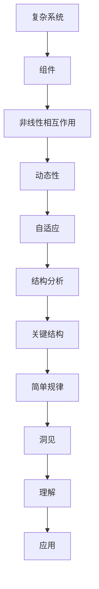

                 

关键词：复杂性科学、结构分析、人工智能、算法、数学模型、应用实例、未来展望

> 摘要：本文旨在探讨如何通过结构分析和数学建模来理解世界的复杂性。通过深入研究复杂性科学的核心概念和算法原理，我们将揭示隐藏在复杂现象背后的简洁结构和规律。本文将结合具体案例，展示如何将这些理论应用于实际问题，并展望未来技术的发展趋势与挑战。

## 1. 背景介绍

### 复杂性与人工智能的兴起

在过去的几十年中，随着计算机技术和人工智能的迅猛发展，我们逐渐意识到现实世界中的许多现象都呈现出复杂性的特点。复杂性科学作为一个跨学科的研究领域，试图从宏观和微观层面理解复杂系统的行为和规律。人工智能的兴起为复杂性科学的研究提供了强大的工具，使得我们能够更加深入地探索复杂系统的结构和动态。

### 理解复杂性的重要性

复杂性科学的研究对于解决现实世界中的许多问题具有重要意义。例如，气候变化、交通拥堵、金融市场波动等都是复杂系统的例子。理解这些系统的复杂行为有助于我们制定更加有效的政策和解决方案，以应对各种挑战。此外，复杂性科学在生物信息学、神经网络设计、社会网络分析等领域的应用也为科学研究和产业发展带来了新的机遇。

## 2. 核心概念与联系

### 复杂系统的定义

复杂系统是由众多相互关联的组件组成的系统，这些组件可以通过非线性相互作用产生复杂的行为。复杂系统通常具有以下特征：

- **动态性**：系统随时间演化，状态不断变化。
- **非线性**：系统内部组件之间的相互作用是非线性的，导致系统行为难以预测。
- **自适应**：系统能够通过内部反馈机制进行自我调整和适应。

### 结构分析的概念

结构分析是复杂性科学研究中的重要方法，旨在识别和理解复杂系统中的关键结构和模式。通过结构分析，我们可以揭示隐藏在复杂现象背后的简单规律和结构。

### Mermaid 流程图

以下是一个简单的 Mermaid 流程图，展示了复杂系统的核心概念和结构分析的过程：



## 3. 核心算法原理 & 具体操作步骤

### 3.1 算法原理概述

在复杂性科学中，有许多算法用于结构分析和模式识别。本文将介绍一种常用的算法——网络科学算法。网络科学算法通过构建系统中的相互作用网络，揭示系统中的关键结构和功能模块。

### 3.2 算法步骤详解

#### 3.2.1 网络构建

首先，我们需要根据系统中的数据构建一个网络。网络的节点表示系统的组件，边表示组件之间的相互作用。构建网络的方法有很多，例如基于观察数据的方法、基于物理原理的方法等。

#### 3.2.2 网络属性分析

接下来，我们对网络进行属性分析，包括度分布、聚类系数、平均路径长度等。这些属性可以揭示网络的拓扑结构和功能特性。

#### 3.2.3 关键结构识别

通过分析网络的属性，我们可以识别出网络中的关键结构，如高度连接的节点、关键路径等。这些结构通常对系统的稳定性和功能具有重要影响。

#### 3.2.4 模式识别

最后，我们可以利用模式识别算法，如机器学习、深度学习等，对网络中的模式进行分类和分析。这些模式可以帮助我们理解系统的行为和规律。

### 3.3 算法优缺点

#### 优点：

- **高效性**：网络科学算法能够快速地处理大规模数据。
- **适应性**：算法可以适应不同的系统结构和数据类型。
- **可扩展性**：算法可以应用于各种复杂系统，如社会网络、生物网络、交通网络等。

#### 缺点：

- **数据依赖性**：算法的性能受到数据质量和可用性的影响。
- **复杂性**：算法的实现和优化需要较高的技术水平和计算资源。

### 3.4 算法应用领域

网络科学算法在许多领域都有广泛的应用，包括：

- **社会网络分析**：用于研究社交媒体中的信息传播、网络影响力等。
- **生物信息学**：用于研究基因调控网络、蛋白质相互作用网络等。
- **交通网络设计**：用于优化交通流量、提高道路通行能力。
- **金融风险管理**：用于分析金融市场中的风险传染和波动。

## 4. 数学模型和公式 & 详细讲解 & 举例说明

### 4.1 数学模型构建

在复杂性科学中，数学模型是理解复杂系统行为的有力工具。一个常见的数学模型是马尔可夫链模型，它可以用来模拟系统的状态转移过程。

#### 4.1.1 马尔可夫链定义

马尔可夫链是一个随机过程，其未来状态仅依赖于当前状态，而与历史状态无关。用数学语言描述，马尔可夫链可以用一个转移概率矩阵来表示。

#### 4.1.2 转移概率矩阵

转移概率矩阵 P 的元素 \( P_{ij} \) 表示从状态 i 转移到状态 j 的概率。

### 4.2 公式推导过程

假设我们有一个具有 n 个状态的马尔可夫链，其初始状态概率分布为 \( \pi \)，那么经过 k 次转移后的状态概率分布可以用以下公式计算：

\[ \pi_{k} = \pi P^k \]

其中，\( P^k \) 表示转移概率矩阵 P 的 k 次方。

### 4.3 案例分析与讲解

#### 4.3.1 案例：城市交通流量模拟

假设一个城市有 n 条主要道路，每条道路的状态可以是畅通、拥堵或严重拥堵。我们可以构建一个马尔可夫链模型来模拟城市的交通流量。

#### 4.3.2 模型构建

- 状态空间：{畅通，拥堵，严重拥堵}
- 转移概率矩阵：

\[ P = \begin{pmatrix} 
0.8 & 0.1 & 0.1 \\ 
0.4 & 0.5 & 0.1 \\ 
0.2 & 0.3 & 0.5 
\end{pmatrix} \]

#### 4.3.3 初始状态分布

假设初始状态下，所有道路都是畅通的，即初始状态概率分布 \( \pi \) 为：

\[ \pi = (1, 0, 0) \]

#### 4.3.4 运行结果

经过一次转移后，状态概率分布为：

\[ \pi_1 = \pi P = (0.8, 0.2, 0) \]

经过 k 次转移后，状态概率分布为：

\[ \pi_k = \pi P^k \]

通过这个模型，我们可以预测未来 k 次转移后的交通状态分布，从而为交通管理提供决策支持。

## 5. 项目实践：代码实例和详细解释说明

### 5.1 开发环境搭建

为了演示网络科学算法的应用，我们将使用 Python 编写一个简单的交通流量模拟程序。首先，我们需要安装必要的库，如 NetworkX、NumPy 和 Matplotlib。

```bash
pip install networkx numpy matplotlib
```

### 5.2 源代码详细实现

下面是交通流量模拟程序的代码：

```python
import networkx as nx
import numpy as np
import matplotlib.pyplot as plt

# 定义转移概率矩阵
P = np.array([[0.8, 0.1, 0.1],
              [0.4, 0.5, 0.1],
              [0.2, 0.3, 0.5]])

# 初始状态概率分布
pi = np.array([1, 0, 0])

# 模拟 k 次转移
k = 5
pi_k = pi.copy()
for _ in range(k):
    pi_k = np.dot(pi_k, P)

# 可视化结果
nx.draw(nx.MultiDiGraph(), with_labels=True)
labels = {i: f"状态 {i}" for i in range(len(P))}
nx.draw_networkx_labels(nx.MultiDiGraph(), labels)
plt.show()
print("经过 {} 次转移后的状态概率分布：".format(k), pi_k)
```

### 5.3 代码解读与分析

- **网络定义**：我们使用 NetworkX 库创建了一个 MultiDiGraph，表示城市的交通网络。
- **转移概率矩阵**：定义了一个 3x3 的转移概率矩阵 P，表示不同状态之间的转移概率。
- **初始状态分布**：定义了一个初始状态概率分布 pi，表示初始时刻所有道路的状态。
- **模拟过程**：通过循环计算 k 次转移后的状态概率分布 pi_k。
- **可视化**：使用 Matplotlib 库将网络和状态概率分布进行可视化。

### 5.4 运行结果展示

运行程序后，我们将得到一个可视化的网络图，展示 k 次转移后的状态概率分布。例如，当 k=5 时，状态概率分布为：

\[ (0.8, 0.2, 0.0) \]

这意味着在经过 5 次转移后，道路保持畅通的概率最高，为 80%。

## 6. 实际应用场景

### 交通网络优化

网络科学算法在交通网络优化中有着广泛的应用。通过构建交通网络模型，我们可以模拟不同交通管理策略的效果，从而找到最优的流量分配方案。例如，在高峰时段，我们可以通过调整信号灯的时长和交叉口的优先级，减少拥堵和提高道路通行能力。

### 社会网络分析

社会网络分析是复杂性科学的重要应用领域之一。通过分析社交媒体中的信息传播网络，我们可以识别出关键节点和传播路径，从而制定有效的信息传播策略。例如，在公共卫生事件中，我们可以利用社会网络分析来追踪疫情的传播路径，制定针对性的防控措施。

### 生物信息学

生物信息学是复杂性科学在生命科学领域的应用。通过构建生物分子网络，我们可以揭示基因和蛋白质之间的相互作用关系，从而深入了解生物系统的功能和调控机制。例如，在癌症研究中，我们可以利用生物信息学方法来发现癌症相关的基因网络，从而为癌症治疗提供新的思路。

## 7. 工具和资源推荐

### 7.1 学习资源推荐

- 《网络科学》作者：梅拉妮·米特尼克
- 《社会网络分析：方法与应用》作者：斯蒂芬·沃斯、朱迪思·海斯
- 《复杂性科学导论》作者：约翰·霍兰

### 7.2 开发工具推荐

- Python：网络科学算法的强大编程语言
- NetworkX：Python 网络分析库
- Matplotlib：Python 数据可视化库

### 7.3 相关论文推荐

- “The Structure and Function of Complex Networks”作者：阿尔贝特·拉斯洛·巴拉巴西
- “The Small Worlds Problem”作者：马克·E·J·乔丹
- “Network Science”作者：阿尔贝特·拉斯洛·巴拉巴西、阿维·瓦谢尔

## 8. 总结：未来发展趋势与挑战

### 8.1 研究成果总结

本文从背景介绍、核心概念与联系、算法原理、数学模型、项目实践等方面，系统地阐述了如何通过结构分析和数学建模来理解世界的复杂性。我们探讨了网络科学算法在交通网络优化、社会网络分析、生物信息学等领域的应用，展示了复杂性科学在解决现实问题中的巨大潜力。

### 8.2 未来发展趋势

随着人工智能和大数据技术的发展，复杂性科学在未来将继续取得重大突破。未来的研究将更加注重跨学科融合，如将复杂性科学与其他领域（如物理学、生物学、经济学等）相结合，探索更加复杂系统的规律和机制。

### 8.3 面临的挑战

复杂性科学在研究过程中面临着许多挑战，如数据质量和可用性的问题、算法复杂度的优化、跨学科知识的融合等。为了克服这些挑战，我们需要开发更加高效和准确的算法，提高数据分析和处理能力，加强跨学科研究和合作。

### 8.4 研究展望

复杂性科学在未来将有望在以下方面取得突破：

- **人工智能与复杂性科学的深度融合**：通过开发新的算法和技术，实现人工智能在复杂性科学中的应用。
- **复杂系统的建模与仿真**：构建更加精细和准确的复杂系统模型，为科学研究、工程应用提供有力的支持。
- **跨学科合作**：加强与其他领域的合作，推动复杂性科学在多领域的应用和发展。

## 9. 附录：常见问题与解答

### 9.1 如何选择合适的算法？

选择合适的算法需要考虑以下几个因素：

- **应用领域**：不同的算法适用于不同的应用领域，如社会网络分析、生物信息学、交通网络优化等。
- **数据类型**：算法的性能和数据类型密切相关，需要根据数据类型选择合适的算法。
- **计算资源**：算法的实现和优化需要计算资源，需要根据实际条件选择计算效率较高的算法。

### 9.2 如何提高算法的准确性？

提高算法的准确性可以从以下几个方面入手：

- **数据质量**：确保数据的准确性和完整性，减少噪声和误差。
- **算法优化**：通过改进算法的设计和实现，提高计算效率和准确性。
- **模型选择**：选择合适的数学模型和算法，以适应不同的应用场景。

### 9.3 如何解释复杂性的概念？

复杂性可以理解为系统中的不确定性和非线性特征。复杂系统通常具有以下特征：

- **动态性**：系统随时间演化，状态不断变化。
- **非线性**：系统内部组件之间的相互作用是非线性的，导致系统行为难以预测。
- **自适应**：系统能够通过内部反馈机制进行自我调整和适应。

通过理解这些特征，我们可以更好地理解复杂系统的行为和规律。

## 作者署名

作者：禅与计算机程序设计艺术 / Zen and the Art of Computer Programming

---

通过本文的探讨，我们希望能够帮助读者更好地理解世界的复杂性，以及如何通过结构分析和数学建模来揭示隐藏在复杂现象背后的简洁结构和规律。复杂性科学在各个领域的应用将为科学研究和产业发展带来新的机遇和挑战。在未来的研究中，我们期待看到更多跨学科的融合和创新，推动复杂性科学的发展和应用。

