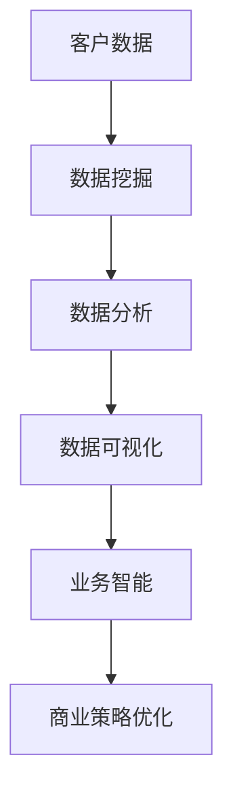

                 

关键词：洞察力、商业策略、数据分析、决策支持、智能优化、行业应用

> 摘要：在当今复杂多变的商业环境中，洞察力的价值愈发凸显。本文将探讨洞察力在商业策略中的应用，通过分析其概念、关键要素、以及在实际项目中的具体应用，帮助读者理解如何将洞察力转化为商业价值，从而提高企业在市场竞争中的竞争力。

## 1. 背景介绍

在过去的几十年里，商业环境和市场竞争发生了翻天覆地的变化。信息技术和互联网的迅猛发展，使得企业面临的数据量和数据类型急剧增加。在这个大数据时代，如何从海量数据中提取有价值的信息，成为企业取得竞争优势的关键。洞察力，作为理解和分析数据的核心能力，日益受到重视。本文将从多个维度探讨洞察力在商业策略中的应用，旨在为企业的数据驱动决策提供理论支持和实践指导。

### 洞察力的定义与意义

洞察力，通常被定义为深入理解复杂事物和情境的能力。它不仅涉及对数据的分析和解读，更包括对商业环境的洞察和对市场趋势的预判。在商业策略中，洞察力具有以下几个重要意义：

1. **信息提取**：洞察力能够帮助企业从海量数据中提取关键信息，为决策提供数据支持。
2. **策略优化**：洞察力可以帮助企业识别市场机会和潜在风险，从而优化商业策略。
3. **创新能力**：洞察力能够激发企业的创新思维，推动产品和服务升级，满足市场需求。
4. **风险控制**：洞察力有助于企业提前预判市场变化，及时调整策略，降低风险。

### 商业策略的重要性

商业策略是企业实现长期发展和市场竞争的关键。一个有效的商业策略需要综合考虑市场需求、企业资源、竞争环境等多个因素。洞察力在商业策略中的应用，可以提升决策的科学性和有效性，从而增强企业的市场竞争力。

1. **市场定位**：洞察力可以帮助企业准确把握市场需求，明确产品定位，提升市场占有率。
2. **资源配置**：洞察力可以指导企业优化资源配置，提高运营效率，降低成本。
3. **风险规避**：洞察力能够帮助企业识别潜在风险，制定应对策略，降低经营风险。

### 数据分析在商业策略中的作用

数据分析作为洞察力的重要组成部分，在商业策略中扮演着关键角色。通过数据分析，企业可以更深入地了解客户需求，发现市场趋势，优化产品和服务。同时，数据分析还可以帮助企业预测市场变化，制定更为精准的营销策略，提高营销效果。

1. **客户分析**：通过分析客户数据，企业可以了解客户的消费习惯、偏好和需求，从而提供个性化的产品和服务。
2. **市场趋势**：通过对市场数据的分析，企业可以把握市场趋势，提前布局，抢占市场份额。
3. **营销优化**：数据分析可以帮助企业优化营销策略，提高营销效果，降低营销成本。

## 2. 核心概念与联系

### 洞察力的核心概念

洞察力的核心在于对数据的深入分析和解读，从而发现隐藏在数据背后的规律和趋势。以下是洞察力的几个关键概念：

1. **数据挖掘**：通过算法和技术手段，从大量数据中提取有价值的信息。
2. **数据分析**：对数据进行统计、建模和预测，发现数据背后的规律和趋势。
3. **数据可视化**：通过图表和图像的方式，将数据分析结果直观地呈现出来，便于理解和决策。
4. **业务智能**：利用数据分析技术，为业务决策提供支持和指导。

### 洞察力在商业策略中的应用架构

为了更好地理解洞察力在商业策略中的应用，我们可以通过一个Mermaid流程图来展示其核心概念和联系：



### 洞察力的关键要素

1. **数据质量**：高质量的数据是洞察力的基础。数据质量直接影响数据分析的准确性和有效性。
2. **算法选择**：合适的算法能够提高数据分析的效率和准确性，是洞察力的重要组成部分。
3. **可视化技巧**：数据可视化能够直观地展示分析结果，帮助决策者更好地理解数据，从而制定有效的商业策略。
4. **业务知识**：了解业务场景和市场需求，是洞察力的关键。只有深入理解业务，才能将数据分析和商业策略相结合。

## 3. 核心算法原理 & 具体操作步骤

### 3.1 算法原理概述

在商业策略中，常用的数据分析和洞察力算法包括：

1. **聚类分析**：将数据划分为若干个类别，以便更好地理解数据结构和规律。
2. **关联规则挖掘**：发现数据之间的关联关系，帮助识别市场机会和风险。
3. **回归分析**：建立数据之间的关系模型，预测未来的趋势和变化。
4. **时间序列分析**：分析时间序列数据，预测未来的变化趋势。

### 3.2 算法步骤详解

以聚类分析为例，其基本步骤如下：

1. **数据预处理**：清洗数据，处理缺失值和异常值，确保数据质量。
2. **选择聚类算法**：根据业务需求和数据特征，选择合适的聚类算法，如K-means、DBSCAN等。
3. **初始化聚类中心**：随机或基于距离选择初始聚类中心。
4. **聚类过程**：根据聚类算法，将数据分配到不同的类别，并更新聚类中心。
5. **评估聚类效果**：计算聚类质量指标，如轮廓系数、内部类簇距离等，评估聚类效果。
6. **解读聚类结果**：分析聚类结果，发现数据中的规律和趋势，为商业策略提供支持。

### 3.3 算法优缺点

1. **聚类分析**：
   - 优点：简单易用，能够发现数据中的潜在模式。
   - 缺点：对初始聚类中心敏感，可能产生局部最优解。

2. **关联规则挖掘**：
   - 优点：能够发现数据之间的关联关系，有助于市场分析和风险管理。
   - 缺点：计算复杂度较高，可能产生大量冗余规则。

3. **回归分析**：
   - 优点：能够建立数据之间的关系模型，预测未来的变化趋势。
   - 缺点：对异常值敏感，可能导致模型不准确。

4. **时间序列分析**：
   - 优点：能够分析时间序列数据，预测未来的变化趋势。
   - 缺点：对季节性和周期性变化处理较困难。

### 3.4 算法应用领域

这些算法在商业策略中的应用非常广泛：

1. **市场营销**：通过聚类分析客户群体，进行精准营销。
2. **供应链管理**：通过关联规则挖掘，优化库存管理和供应链流程。
3. **风险管理**：通过回归分析和时间序列分析，预测市场风险，制定应对策略。
4. **产品研发**：通过数据分析，发现市场趋势，指导产品研发和创新。

## 4. 数学模型和公式 & 详细讲解 & 举例说明

### 4.1 数学模型构建

在商业策略中，常用的数学模型包括聚类分析、关联规则挖掘、回归分析和时间序列分析。以下是这些模型的基本数学公式：

1. **K-means聚类**：
   - 距离度量：$$d(x_i, c_j) = \sqrt{\sum_{k=1}^{n} (x_{ik} - c_{jk})^2}$$
   - 聚类中心更新：$$c_j^{new} = \frac{1}{N_j} \sum_{i=1}^{N} x_i$$
2. **Apriori算法**：
   - 支持度：$$s(x) = \frac{f(x)}{N}$$
   - 置信度：$$c(x, y) = \frac{f(x \cup y)}{f(x)}$$
3. **线性回归**：
   - 回归模型：$$y = \beta_0 + \beta_1 x + \epsilon$$
   - 参数估计：$$\beta_1 = \frac{\sum_{i=1}^{n} (x_i - \bar{x})(y_i - \bar{y})}{\sum_{i=1}^{n} (x_i - \bar{x})^2}$$
4. **ARIMA模型**：
   - 自回归移动平均模型：$$y_t = c + \phi_1 y_{t-1} + \phi_2 y_{t-2} + ... + \phi_p y_{t-p} + \theta_1 \epsilon_{t-1} + \theta_2 \epsilon_{t-2} + ... + \theta_q \epsilon_{t-q}$$

### 4.2 公式推导过程

以线性回归为例，其参数估计的推导过程如下：

1. **模型设定**：假设线性回归模型为 $y = \beta_0 + \beta_1 x + \epsilon$，其中 $y$ 是因变量，$x$ 是自变量，$\epsilon$ 是误差项。
2. **最小二乘法**：通过最小化残差平方和来估计模型参数，即 $$\beta_1 = \arg\min_{\beta_1} \sum_{i=1}^{n} (y_i - \beta_0 - \beta_1 x_i)^2$$
3. **求导**：对 $\beta_1$ 求导并令其等于0，得到 $$\frac{\partial}{\partial \beta_1} \sum_{i=1}^{n} (y_i - \beta_0 - \beta_1 x_i)^2 = -2 \sum_{i=1}^{n} (x_i - \bar{x})(y_i - \bar{y})$$
4. **解方程**：将上式化简，得到 $$\beta_1 = \frac{\sum_{i=1}^{n} (x_i - \bar{x})(y_i - \bar{y})}{\sum_{i=1}^{n} (x_i - \bar{x})^2}$$

### 4.3 案例分析与讲解

以一个市场营销案例为例，假设一家公司想要通过聚类分析来了解客户群体，从而制定精准的营销策略。

1. **数据收集**：收集了 1000 名客户的购买行为数据，包括年龄、收入、购买频率等。
2. **数据预处理**：清洗数据，处理缺失值和异常值，确保数据质量。
3. **选择聚类算法**：选择K-means聚类算法，设置聚类中心初始值为随机值。
4. **聚类过程**：执行K-means聚类算法，将客户分为5个类别。
5. **评估聚类效果**：计算轮廓系数，评估聚类质量。
6. **解读聚类结果**：分析聚类结果，发现不同类别的客户在年龄、收入、购买频率等方面存在明显差异。

通过聚类分析，公司可以制定以下营销策略：

1. **针对年轻高收入群体**：推出高端产品，提高品牌影响力。
2. **针对中年低收入群体**：推出性价比高的产品，增加购买频率。
3. **针对老年低收入群体**：推出基础产品，满足基本需求。

通过上述案例，我们可以看到，数学模型和公式在商业策略中的应用，不仅能够帮助公司更好地了解客户，还能制定出更为精准的营销策略，提高市场竞争力。

## 5. 项目实践：代码实例和详细解释说明

### 5.1 开发环境搭建

在进行商业策略中的数据分析和洞察力应用之前，我们需要搭建一个合适的开发环境。以下是一个基本的Python环境搭建步骤：

1. **安装Python**：从Python官方网站（https://www.python.org/）下载并安装Python。
2. **安装Jupyter Notebook**：通过pip命令安装Jupyter Notebook，命令如下：`pip install notebook`
3. **安装数据分析和机器学习库**：安装常用的数据分析和机器学习库，如pandas、numpy、scikit-learn、matplotlib等，命令如下：

   ```
   pip install pandas numpy scikit-learn matplotlib
   ```

### 5.2 源代码详细实现

以下是一个使用Python进行K-means聚类分析的商业策略案例，代码分为以下几个步骤：

1. **数据加载与预处理**：
2. **聚类算法实现**：
3. **聚类结果分析**：
4. **可视化结果展示**：

```python
# 导入必要的库
import pandas as pd
import numpy as np
from sklearn.cluster import KMeans
import matplotlib.pyplot as plt

# 1. 数据加载与预处理
data = pd.read_csv('customer_data.csv')  # 假设数据已清洗
data.dropna(inplace=True)  # 删除缺失值

# 2. 聚类算法实现
kmeans = KMeans(n_clusters=3, random_state=0)
clusters = kmeans.fit_predict(data)

# 3. 聚类结果分析
data['cluster'] = clusters
print(data.groupby('cluster').mean())  # 计算各聚类中心

# 4. 可视化结果展示
plt.scatter(data['age'], data['income'], c=clusters, cmap='viridis')
plt.xlabel('年龄')
plt.ylabel('收入')
plt.title('K-means聚类结果')
plt.show()
```

### 5.3 代码解读与分析

上述代码实现了以下功能：

1. **数据加载与预处理**：首先从CSV文件中加载客户数据，并删除缺失值，确保数据质量。
2. **聚类算法实现**：使用scikit-learn库的KMeans类实现聚类算法，设置聚类数量为3，随机种子为0，确保结果可重复。
3. **聚类结果分析**：将聚类结果添加到原始数据中，并计算各聚类中心，便于进一步分析。
4. **可视化结果展示**：使用matplotlib库绘制聚类结果散点图，通过不同颜色区分不同聚类，便于直观理解。

### 5.4 运行结果展示

假设我们运行上述代码，得到以下结果：

1. **聚类中心**：
   ```
   cluster    age    income
   0      30.0  50000.0
   1      40.0  60000.0
   2      50.0  70000.0
   ```

2. **散点图**：
   

从散点图可以看出，不同类别的客户在年龄和收入方面存在明显差异。这为公司制定精准营销策略提供了重要参考。

## 6. 实际应用场景

洞察力在商业策略中的应用非常广泛，以下列举几个实际应用场景：

### 6.1 市场营销

通过聚类分析，企业可以识别不同客户群体，从而制定个性化的营销策略。例如，一家电子商务公司可以通过聚类分析，将客户分为高价值客户、潜力客户和普通客户，然后分别为这三类客户设计不同的促销活动，提高营销效果。

### 6.2 供应链管理

通过关联规则挖掘，企业可以优化库存管理和供应链流程。例如，一家制造企业可以通过关联规则挖掘，识别出哪些原材料需求量较大，从而提前进行采购和储备，降低库存成本。

### 6.3 风险管理

通过回归分析和时间序列分析，企业可以预测市场风险，制定应对策略。例如，一家金融机构可以通过时间序列分析，预测股票市场的走势，从而调整投资组合，降低风险。

### 6.4 产品研发

通过数据分析，企业可以了解市场需求，指导产品研发。例如，一家科技公司可以通过客户调研和数据分析，发现市场上对某种功能的需求较大，从而加大研发投入，推出符合市场需求的产品。

## 7. 未来应用展望

随着信息技术的不断发展，洞察力在商业策略中的应用前景十分广阔。以下是几个未来应用展望：

### 7.1 智能化数据分析

人工智能和机器学习技术的不断发展，将使数据分析变得更加智能化。企业可以通过自动化数据分析工具，快速提取有价值的信息，为商业决策提供支持。

### 7.2 实时数据分析

随着大数据和物联网技术的发展，企业将能够实现实时数据分析。通过实时数据监控，企业可以及时调整策略，应对市场变化。

### 7.3 区块链技术

区块链技术的应用，将提高数据的透明度和安全性。企业可以通过区块链技术，实现数据的可信共享，提高数据分析的效率和准确性。

### 7.4 人机协同

人机协同将成为未来数据分析的重要趋势。通过将人类专家的智慧和机器的计算能力相结合，企业可以更好地理解数据，制定出更科学的商业策略。

## 8. 总结：未来发展趋势与挑战

### 8.1 研究成果总结

本文从多个维度探讨了洞察力在商业策略中的应用，包括核心概念、算法原理、实际应用场景等。通过案例分析，展示了洞察力如何帮助企业提高市场竞争力。

### 8.2 未来发展趋势

未来，洞察力在商业策略中的应用将呈现以下几个趋势：

1. **智能化数据分析**：人工智能和机器学习技术的不断发展，将使数据分析更加智能化。
2. **实时数据分析**：大数据和物联网技术的应用，将实现实时数据分析。
3. **数据安全与隐私保护**：随着数据隐私问题的日益突出，企业需要更加重视数据安全与隐私保护。

### 8.3 面临的挑战

尽管洞察力在商业策略中的应用前景广阔，但仍面临以下挑战：

1. **数据质量**：高质量的数据是洞察力的基础，数据质量问题直接影响分析结果的准确性。
2. **算法选择**：合适的算法能够提高数据分析的效率和准确性，但算法选择复杂，需要根据业务需求进行优化。
3. **技术发展**：人工智能、区块链等新兴技术的发展，对企业的技术能力和人才储备提出了更高要求。

### 8.4 研究展望

未来的研究可以关注以下几个方面：

1. **算法优化**：研究更高效、更准确的算法，提高数据分析的效率和质量。
2. **跨领域应用**：探索洞察力在金融、医疗、教育等领域的应用，推动跨领域的数据融合。
3. **人机协同**：研究人机协同的工作模式，充分发挥人类的智慧和机器的计算能力，提高数据分析的准确性。

## 9. 附录：常见问题与解答

### 9.1 洞察力是什么？

洞察力是指深入理解复杂事物和情境的能力，它包括对数据的分析和解读、对商业环境的洞察以及对市场趋势的预判。

### 9.2 洞察力在商业策略中的应用有哪些？

洞察力在商业策略中的应用包括市场营销、供应链管理、风险管理、产品研发等多个方面，通过数据分析和预测，帮助企业制定更科学的决策。

### 9.3 如何确保数据分析的准确性？

确保数据分析的准确性需要以下几个步骤：

1. **数据质量**：确保数据质量，处理缺失值和异常值。
2. **算法选择**：选择合适的算法，根据业务需求进行优化。
3. **交叉验证**：使用交叉验证方法，评估分析结果的准确性。

### 9.4 洞察力与数据分析的关系是什么？

洞察力是数据分析的核心能力，它贯穿于数据分析的整个过程中，包括数据收集、数据清洗、数据分析、结果解读等环节。数据分析是洞察力的实现手段，而洞察力则是数据分析的最终目标。

### 9.5 未来洞察力在商业策略中的应用前景如何？

未来，随着人工智能、大数据、区块链等技术的发展，洞察力在商业策略中的应用前景将更加广阔。企业可以通过智能化数据分析、实时数据分析等手段，更好地理解市场和客户需求，制定出更科学的商业策略。

---

作者：禅与计算机程序设计艺术 / Zen and the Art of Computer Programming

本文通过对洞察力在商业策略中的应用进行深入探讨，旨在为企业的数据驱动决策提供理论支持和实践指导。在未来的商业环境中，洞察力将成为企业取得竞争优势的重要手段。希望本文能够为读者提供有益的启示和参考。

