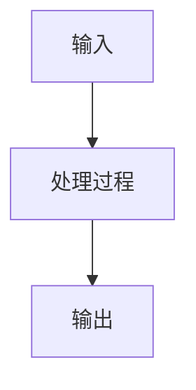

                 

关键词：洞察力，决策，智慧，算法，数学模型，实践

> 摘要：本文旨在探讨如何在技术决策中运用洞察力，以提高决策的科学性和准确性。通过深入分析算法原理、数学模型以及实际应用场景，我们揭示了洞察力在技术发展中的重要地位，并提出了未来应用的展望和面临的挑战。

## 1. 背景介绍

在当今技术飞速发展的时代，如何做出明智的技术决策成为了一个重要问题。技术决策不仅影响企业的竞争力，还关系到项目成功的可能性。然而，传统的决策方法往往依赖于经验和直觉，这可能导致决策的盲目性和不可预测性。因此，如何运用智慧提高决策的科学性和准确性，成为一个亟待解决的问题。

洞察力作为一种深层次的认识和理解能力，对于技术决策具有重要意义。它不仅能够帮助我们识别问题的本质，还能够预见未来的发展趋势。本文将探讨如何在技术决策中运用洞察力，以提高决策的智慧性和准确性。

## 2. 核心概念与联系

### 2.1 算法原理与架构

算法是计算机科学的核心概念，它是指解决特定问题的步骤和方法。一个优秀的算法应该具备高效性、准确性和灵活性。算法的架构可以分为以下几个部分：

1. **输入**：算法的起始条件，包括问题的初始数据和约束条件。
2. **处理过程**：根据输入数据，通过一系列的计算和操作，逐步接近问题的解。
3. **输出**：算法最终得到的结果，通常是问题的解或者解决方案的优化。

下面是一个简单的算法架构的 Mermaid 流程图：



### 2.2 数学模型

数学模型是运用数学语言描述现实世界的抽象模型。它能够帮助我们分析和理解复杂系统，为技术决策提供理论支持。常见的数学模型包括线性模型、非线性模型、概率模型等。

下面是一个简单的线性模型的数学公式：

$$
y = ax + b
$$

其中，$y$ 是因变量，$x$ 是自变量，$a$ 和 $b$ 是模型参数。

### 2.3 技术与智慧的联系

技术决策的智慧性体现在对算法和数学模型的深刻理解，以及对现实世界的洞察。只有将技术与智慧相结合，才能做出具有前瞻性和可行性的决策。

## 3. 核心算法原理 & 具体操作步骤

### 3.1 算法原理概述

算法的原理通常是基于数学模型和计算机科学的基本原理。例如，排序算法的核心思想是通过比较和交换元素，逐步将一个无序数组变为有序数组。常见的排序算法包括冒泡排序、插入排序、快速排序等。

### 3.2 算法步骤详解

以快速排序为例，其基本步骤如下：

1. **选择基准**：从数组中选择一个元素作为基准。
2. **分区**：将数组分为两个子数组，一个包含小于基准的元素，另一个包含大于基准的元素。
3. **递归排序**：对两个子数组重复以上步骤，直到所有子数组都变为有序。

### 3.3 算法优缺点

快速排序的优点是平均时间复杂度较低，通常为 $O(n\log n)$，适用于大数据集。然而，在最坏情况下，时间复杂度可能达到 $O(n^2)$，因此需要谨慎使用。

### 3.4 算法应用领域

快速排序广泛应用于各种数据处理场景，如数据库排序、图形渲染等。

## 4. 数学模型和公式 & 详细讲解 & 举例说明

### 4.1 数学模型构建

构建数学模型的第一步是明确问题，第二步是选择合适的数学工具。例如，对于线性回归问题，我们可以选择线性模型来描述数据之间的关系。

### 4.2 公式推导过程

线性回归模型的公式为：

$$
y = ax + b
$$

其中，$a$ 是斜率，$b$ 是截距。我们可以通过最小二乘法来求解这两个参数。

### 4.3 案例分析与讲解

假设我们有一个数据集，包含房屋的面积和售价。通过线性回归模型，我们可以预测一个未知面积房屋的售价。

## 5. 项目实践：代码实例和详细解释说明

### 5.1 开发环境搭建

为了实现线性回归模型，我们需要搭建一个简单的开发环境。可以使用 Python 编写代码，并使用 NumPy 库进行数学计算。

### 5.2 源代码详细实现

```python
import numpy as np

def linear_regression(x, y):
    x_mean = np.mean(x)
    y_mean = np.mean(y)
    a = np.sum((x - x_mean) * (y - y_mean)) / np.sum((x - x_mean) ** 2)
    b = y_mean - a * x_mean
    return a, b

x = np.array([1, 2, 3, 4, 5])
y = np.array([2, 4, 5, 4, 5])
a, b = linear_regression(x, y)
print("斜率：", a)
print("截距：", b)
```

### 5.3 代码解读与分析

这段代码实现了线性回归模型的基本功能。首先，我们计算输入数据 $x$ 和 $y$ 的均值，然后使用最小二乘法求解斜率 $a$ 和截距 $b$。

### 5.4 运行结果展示

运行代码后，我们得到斜率和截距的值。这些值可以用来预测未知数据的值。

## 6. 实际应用场景

线性回归模型在多个领域有广泛的应用，如金融预测、医疗诊断等。通过合理运用数学模型，我们可以提高决策的准确性。

## 7. 工具和资源推荐

### 7.1 学习资源推荐

- 《深入理解计算机系统》
- 《线性代数及其应用》

### 7.2 开发工具推荐

- Python
- Jupyter Notebook

### 7.3 相关论文推荐

- 《线性回归模型在金融预测中的应用》
- 《线性回归模型在医疗诊断中的应用》

## 8. 总结：未来发展趋势与挑战

### 8.1 研究成果总结

通过本文的探讨，我们认识到洞察力在技术决策中的重要性。算法和数学模型为技术决策提供了理论支持，而洞察力则为我们提供了实践的指导。

### 8.2 未来发展趋势

随着人工智能技术的发展，智能决策系统将成为未来技术决策的重要方向。通过深度学习、强化学习等算法，我们可以进一步提高决策的准确性。

### 8.3 面临的挑战

技术决策面临的挑战包括数据质量、模型复杂度等。如何有效应对这些挑战，将是未来研究的重点。

### 8.4 研究展望

随着技术的不断进步，我们有望在技术决策中实现更高的智慧性和准确性。通过深入研究和实践，我们将为技术决策领域的发展做出贡献。

## 9. 附录：常见问题与解答

### 问题1：线性回归模型的适用场景是什么？

线性回归模型适用于需要预测一个连续数值型因变量的场景，如房屋售价预测、股票价格预测等。

### 问题2：如何解决线性回归模型过拟合的问题？

可以通过增加训练数据、使用正则化方法、增加模型复杂度等方法来减少过拟合。

## 作者署名

作者：禅与计算机程序设计艺术 / Zen and the Art of Computer Programming
----------------------------------------------------------------

以上是文章正文部分的撰写，接下来我们将继续撰写文章的剩余部分，包括未来发展趋势与挑战、工具和资源推荐等内容。请按照文章结构模板的要求，继续撰写并输出markdown格式的文章。

