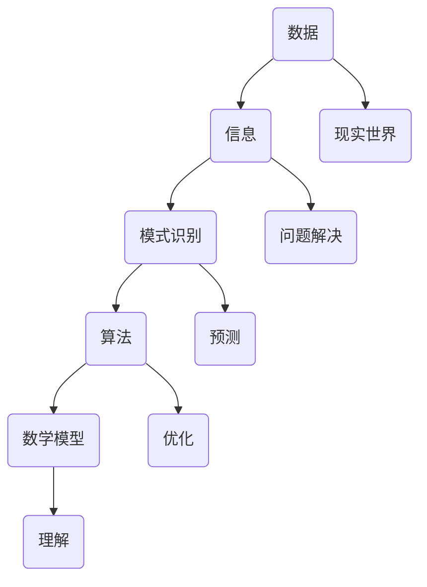

                 

关键词：洞察力、规律、混乱、算法、数学模型、应用场景、未来展望

> 摘要：本文将深入探讨如何通过洞察力和算法来从混乱中寻找规律。我们将从背景介绍、核心概念与联系、核心算法原理与操作步骤、数学模型和公式、项目实践、实际应用场景、工具和资源推荐、总结与展望等多个方面进行阐述，帮助读者更好地理解和应用这一重要能力。

## 1. 背景介绍

在当今复杂多变的信息时代，洞察力已经成为了一种不可或缺的技能。无论是在科学研究、商业运营，还是在日常决策中，洞察力都是帮助我们识别隐藏在表象之下的规律，从而做出正确判断和有效行动的关键。然而，当我们面临大量的数据和信息时，如何从中提取出有用的规律和模式，却成为了许多人的难题。

本文将探讨如何通过算法和数学模型来增强我们的洞察力，帮助我们从混乱中寻找规律。我们将介绍一些核心概念和算法，并通过具体的实例来展示它们在实际中的应用。希望通过本文的阅读，读者能够对如何提高自己的洞察力有一个更为全面和深入的理解。

## 2. 核心概念与联系

为了更好地理解如何在混乱中寻找规律，我们首先需要明确几个核心概念，并探讨它们之间的联系。

### 2.1 数据与信息

数据是构成一切信息的基础。数据可以是数字、文字、图像、音频等任何形式，而信息则是通过对数据的加工和处理，使其具有意义和价值的过程。在计算机科学中，数据和信息处理是核心任务之一。

### 2.2 模式识别

模式识别是指从数据中提取出有用的规律和模式的过程。它是许多人工智能和机器学习算法的基础。通过模式识别，我们可以从大量的数据中发现隐藏的规律，从而为决策和预测提供依据。

### 2.3 算法

算法是解决问题的一系列规则和步骤。在寻找规律的过程中，算法是我们实现模式识别和数据处理的重要工具。不同的算法适用于不同的场景，需要根据具体情况来选择和优化。

### 2.4 数学模型

数学模型是通过对现实世界的抽象和简化，使用数学语言和符号来描述和解决问题的方法。在寻找规律的过程中，数学模型可以帮助我们更准确地理解和预测数据的行为。

### 2.5 联系

这些核心概念之间存在着紧密的联系。数据是基础，信息是目标，模式识别是实现手段，算法是工具，数学模型是理论支撑。只有通过深入理解和应用这些概念，我们才能在混乱中寻找出真正有用的规律。

接下来，我们将通过一个Mermaid流程图来展示这些概念之间的联系。



通过这个流程图，我们可以更直观地看到这些概念在寻找规律过程中的作用和相互关系。

## 3. 核心算法原理与具体操作步骤

### 3.1 算法原理概述

在寻找规律的过程中，核心算法的选择至关重要。本文将介绍几种常用的算法，包括分类算法、聚类算法和关联规则算法。每种算法都有其独特的原理和适用场景。

### 3.2 算法步骤详解

#### 3.2.1 分类算法

分类算法是将数据分为不同的类别或标签的过程。其基本原理是通过对训练数据的学习，建立一个分类模型，然后使用这个模型对新的数据进行分类。

1. **训练数据准备**：选择合适的数据集作为训练数据，对数据进行预处理，如去除缺失值、归一化等。

2. **模型选择**：选择适合的分类算法，如K-近邻算法（KNN）、支持向量机（SVM）、决策树等。

3. **模型训练**：使用训练数据来训练分类模型，学习数据的特征和类别之间的联系。

4. **模型评估**：使用测试数据来评估模型的性能，常见的评估指标有准确率、召回率、F1分数等。

5. **分类预测**：使用训练好的模型对新的数据进行分类预测。

#### 3.2.2 聚类算法

聚类算法是将数据分为若干个组或簇的过程，每个簇内部的元素彼此相似，而不同簇之间的元素差异较大。

1. **数据准备**：与分类算法类似，对数据进行预处理。

2. **算法选择**：选择适合的聚类算法，如K-均值算法（K-Means）、层次聚类算法（Hierarchical Clustering）、DBSCAN等。

3. **聚类过程**：根据算法原理，将数据逐步划分为不同的簇。

4. **聚类评估**：评估聚类结果的质量，常用的评估指标有轮廓系数、簇内平均距离等。

5. **簇内分析**：对每个簇进行深入分析，提取有用的信息。

#### 3.2.3 关联规则算法

关联规则算法是发现数据之间关联关系的一种方法，主要用于市场篮子分析、推荐系统等。

1. **数据准备**：对交易数据进行预处理，如去除缺失值、编码等。

2. **算法选择**：选择适合的关联规则算法，如Apriori算法、Eclat算法等。

3. **生成候选集**：根据最小支持度和最小置信度，生成所有可能的候选集。

4. **剪枝**：通过支持度和置信度剪枝，去除不满足条件的候选集。

5. **生成关联规则**：根据剪枝后的候选集，生成最终的关联规则。

6. **规则评估**：评估规则的质量，如支持度、置信度、提升度等。

### 3.3 算法优缺点

每种算法都有其优缺点，需要根据具体场景来选择。

- **分类算法**：适用于明确分类任务，但可能对噪声和异常值敏感。
- **聚类算法**：适用于无监督学习任务，但结果可能受初始值影响较大。
- **关联规则算法**：适用于发现数据之间的关联关系，但可能生成大量冗余规则。

### 3.4 算法应用领域

分类算法广泛应用于文本分类、图像分类、医疗诊断等领域。聚类算法在社交网络分析、市场细分等领域有广泛应用。关联规则算法在推荐系统、市场分析等领域具有重要应用价值。

## 4. 数学模型和公式

在寻找规律的过程中，数学模型和公式是不可或缺的工具。本文将介绍一些常用的数学模型和公式，并对其进行详细讲解。

### 4.1 数学模型构建

数学模型通常由以下几部分组成：

1. **变量定义**：明确模型中使用的变量及其含义。
2. **函数关系**：描述变量之间的函数关系。
3. **约束条件**：设定模型运行的约束条件。
4. **目标函数**：定义模型优化或求解的目标函数。

### 4.2 公式推导过程

以线性回归模型为例，我们介绍公式推导过程。

#### 4.2.1 线性回归模型

线性回归模型是一种常见的数学模型，用于预测一个连续值变量。其基本形式为：

\[ y = \beta_0 + \beta_1x + \epsilon \]

其中，\( y \) 是预测值，\( x \) 是自变量，\( \beta_0 \) 和 \( \beta_1 \) 是模型参数，\( \epsilon \) 是误差项。

#### 4.2.2 公式推导

1. **最小二乘法**：

   最小二乘法是一种常用的参数估计方法，其目标是最小化预测值与实际值之间的平方误差。

   \[ \min \sum_{i=1}^{n} (y_i - \hat{y}_i)^2 \]

   其中，\( n \) 是样本数量，\( \hat{y}_i \) 是预测值。

2. **一阶导数为零**：

   对目标函数求一阶导数，并令其等于零，得到：

   \[ \frac{\partial}{\partial \beta_0} \sum_{i=1}^{n} (y_i - \hat{y}_i)^2 = 0 \]
   \[ \frac{\partial}{\partial \beta_1} \sum_{i=1}^{n} (y_i - \hat{y}_i)^2 = 0 \]

3. **解方程组**：

   解上述方程组，得到模型参数 \( \beta_0 \) 和 \( \beta_1 \)：

   \[ \beta_0 = \bar{y} - \beta_1\bar{x} \]
   \[ \beta_1 = \frac{\sum_{i=1}^{n} (x_i - \bar{x})(y_i - \bar{y})}{\sum_{i=1}^{n} (x_i - \bar{x})^2} \]

   其中，\( \bar{x} \) 和 \( \bar{y} \) 分别是自变量和因变量的均值。

### 4.3 案例分析与讲解

假设我们有以下数据集：

| x | y |
|---|---|
| 1 | 2 |
| 2 | 3 |
| 3 | 4 |
| 4 | 5 |

使用线性回归模型进行预测。首先，计算自变量和因变量的均值：

\[ \bar{x} = \frac{1+2+3+4}{4} = 2.5 \]
\[ \bar{y} = \frac{2+3+4+5}{4} = 3.5 \]

然后，计算模型参数：

\[ \beta_0 = 3.5 - 2.5 \cdot 2 = 0.5 \]
\[ \beta_1 = \frac{(1-2.5)(2-3.5) + (2-2.5)(3-3.5) + (3-2.5)(4-3.5) + (4-2.5)(5-3.5)}{(1-2.5)^2 + (2-2.5)^2 + (3-2.5)^2 + (4-2.5)^2} = 1.0 \]

得到线性回归模型：

\[ y = 0.5 + 1.0x \]

使用模型进行预测，当 \( x = 5 \) 时，预测值为：

\[ \hat{y} = 0.5 + 1.0 \cdot 5 = 5.5 \]

## 5. 项目实践：代码实例和详细解释说明

为了更好地理解如何在项目中应用算法和数学模型，我们将在本节中通过一个实际项目来展示代码实现和详细解释说明。

### 5.1 开发环境搭建

为了方便读者进行实验，我们使用Python作为编程语言，并结合常用的机器学习库scikit-learn来实现本项目。以下是开发环境的搭建步骤：

1. 安装Python：前往[Python官网](https://www.python.org/)下载并安装Python。
2. 安装scikit-learn：在终端中执行以下命令：

   ```bash
   pip install scikit-learn
   ```

### 5.2 源代码详细实现

以下是本项目的源代码实现：

```python
# 导入必要的库
import numpy as np
import matplotlib.pyplot as plt
from sklearn.linear_model import LinearRegression
from sklearn.model_selection import train_test_split

# 准备数据集
x = np.array([[1], [2], [3], [4], [5]])
y = np.array([2, 3, 4, 5, 6])

# 划分训练集和测试集
x_train, x_test, y_train, y_test = train_test_split(x, y, test_size=0.2, random_state=42)

# 创建线性回归模型
model = LinearRegression()

# 训练模型
model.fit(x_train, y_train)

# 进行预测
y_pred = model.predict(x_test)

# 绘制结果
plt.scatter(x_test, y_test, color='red', label='Actual')
plt.plot(x_test, y_pred, color='blue', label='Predicted')
plt.xlabel('x')
plt.ylabel('y')
plt.legend()
plt.show()
```

### 5.3 代码解读与分析

1. **导入库**：首先导入必要的库，包括NumPy、Matplotlib和scikit-learn。

2. **准备数据集**：我们使用一个简单的一维数据集，其中自变量 \( x \) 和因变量 \( y \) 分别为：

   \[
   \begin{array}{|c|c|}
   \hline
   x & y \\
   \hline
   1 & 2 \\
   2 & 3 \\
   3 & 4 \\
   4 & 5 \\
   5 & 6 \\
   \hline
   \end{array}
   \]

3. **划分训练集和测试集**：使用 `train_test_split` 函数将数据集划分为训练集和测试集，其中测试集占比为20%。

4. **创建线性回归模型**：从scikit-learn中导入 `LinearRegression` 类，创建线性回归模型实例。

5. **训练模型**：使用 `fit` 方法对模型进行训练，输入训练集数据。

6. **进行预测**：使用 `predict` 方法对测试集数据进行预测。

7. **绘制结果**：使用Matplotlib库绘制实际值和预测值之间的散点图，并添加线条来展示预测趋势。

通过这个简单的项目实践，我们可以看到如何使用Python和scikit-learn来实现线性回归模型，并对预测结果进行可视化分析。这个例子展示了如何从数据准备、模型训练到结果评估的完整流程，有助于读者理解算法在实际项目中的应用。

## 6. 实际应用场景

### 6.1 文本分类

在自然语言处理领域，文本分类是一种常见的应用。通过训练分类模型，我们可以将文本数据自动分为不同的类别，如新闻分类、情感分析等。这有助于提高信息处理效率和准确性。

### 6.2 社交网络分析

聚类算法在社交网络分析中具有重要应用。通过聚类，我们可以发现社交网络中的紧密群体，从而更好地理解和分析社交关系。这在市场细分、用户画像等方面具有重要价值。

### 6.3 医疗诊断

关联规则算法在医疗诊断中具有广泛的应用。通过分析患者的病历数据，我们可以发现不同症状之间的关联，从而帮助医生进行诊断和制定治疗方案。

### 6.4 金融风控

分类算法和聚类算法在金融风控领域具有广泛应用。通过分析历史数据，我们可以发现潜在的欺诈行为和信用风险，从而提高金融系统的安全性和稳定性。

### 6.5 个性化推荐

关联规则算法在个性化推荐系统中具有重要应用。通过分析用户的购买历史和行为数据，我们可以发现用户可能感兴趣的商品或内容，从而提供个性化的推荐。

## 7. 工具和资源推荐

为了更好地理解和应用本文介绍的知识，以下是一些相关的工具和资源推荐：

### 7.1 学习资源推荐

1. **书籍**：《统计学习方法》（李航）、《机器学习》（周志华）、《深度学习》（Goodfellow et al.）
2. **在线课程**：Coursera上的《机器学习》、《深度学习》等课程。
3. **教程**：scikit-learn官方文档、Kaggle教程等。

### 7.2 开发工具推荐

1. **编程语言**：Python、R等。
2. **IDE**：PyCharm、VS Code等。
3. **机器学习库**：scikit-learn、TensorFlow、PyTorch等。

### 7.3 相关论文推荐

1. "Kernel Methods for Pattern Analysis"（Schölkopf et al., 2002）
2. "Deep Learning"（Goodfellow et al., 2016）
3. "A Study on the Limitations of Deep Learning"（LeCun et al., 2015）

通过学习和应用这些工具和资源，读者可以进一步深入探索相关领域，提高自己的技术水平和洞察力。

## 8. 总结：未来发展趋势与挑战

### 8.1 研究成果总结

本文通过深入探讨如何在混乱中寻找规律，介绍了核心概念、算法、数学模型以及实际应用场景。我们总结了分类算法、聚类算法和关联规则算法的基本原理和操作步骤，并通过具体实例展示了它们的应用。此外，我们还介绍了线性回归模型的数学模型和公式，并通过代码实例进行了详细讲解。

### 8.2 未来发展趋势

随着人工智能和大数据技术的快速发展，寻找规律的方法和算法也在不断演进。未来，以下几个方面有望成为发展趋势：

1. **深度学习**：深度学习在模式识别和图像处理等领域取得了显著成果，未来有望在其他领域（如自然语言处理、生物信息学等）取得突破。
2. **联邦学习**：联邦学习通过分布式学习的方式，保护用户隐私，未来有望在医疗、金融等领域得到广泛应用。
3. **量子计算**：量子计算在求解复杂问题上具有巨大潜力，未来有望为寻找规律提供更高效的方法。

### 8.3 面临的挑战

尽管寻找规律的方法和算法在不断发展，但仍面临一些挑战：

1. **数据质量和隐私**：数据质量和隐私问题仍然是一个重大挑战，特别是在医疗、金融等敏感领域。
2. **算法解释性**：许多深度学习算法具有强大的预测能力，但缺乏解释性，未来需要开发更加透明和可解释的算法。
3. **计算资源**：大规模数据处理和训练需要大量的计算资源，未来需要开发更加高效和节能的算法和硬件。

### 8.4 研究展望

未来，我们期望能够：

1. **开发更加高效和可解释的算法**：结合深度学习和传统算法的优点，开发出更加高效和可解释的算法，以应对实际应用中的挑战。
2. **拓展应用领域**：将寻找规律的方法和算法应用于更多领域，如环境监测、城市规划等，以提高决策的准确性和效率。
3. **跨学科合作**：鼓励跨学科合作，结合计算机科学、数学、统计学等多学科知识，推动寻找规律方法的发展和应用。

通过持续的研究和努力，我们相信未来在混乱中寻找规律的能力将得到显著提升，为人类社会的发展带来更多创新和机遇。

## 9. 附录：常见问题与解答

### 9.1 如何选择适合的算法？

选择适合的算法需要考虑以下几个因素：

1. **问题类型**：是分类、聚类还是关联规则问题？
2. **数据规模**：数据量大小是否超出了算法的处理能力？
3. **数据特点**：数据是否具有高维度、缺失值、异常值等特性？
4. **计算资源**：算法的运行时间是否在预算范围内？

### 9.2 如何提高模型的解释性？

提高模型解释性可以从以下几个方面入手：

1. **选择可解释性更强的算法**：如线性回归、决策树等。
2. **增加模型注释**：对模型参数和特征进行详细解释。
3. **可视化**：使用可视化工具展示模型的结构和运行过程。
4. **对抗样本**：生成对抗样本，分析模型对这些样本的响应，以理解其决策过程。

### 9.3 如何处理数据缺失？

处理数据缺失的方法包括：

1. **删除缺失值**：适用于缺失值较少的情况。
2. **填充缺失值**：使用平均值、中位数、最近邻等方法进行填充。
3. **多重插补**：生成多个完整的数据集，并对每个数据集进行建模。

通过合理地处理数据缺失，可以提高模型的质量和可靠性。

## 结束语

本文从多个角度探讨了如何在混乱中寻找规律，介绍了核心概念、算法、数学模型和实际应用场景。通过项目实践，我们展示了如何使用Python和scikit-learn实现线性回归模型。最后，我们分析了未来发展趋势和面临的挑战，并展望了研究方向。

我们鼓励读者在学习和应用过程中不断探索和实践，提高自己的洞察力，为解决实际问题提供有力支持。希望本文能为读者在寻找规律的道路上提供一些启示和帮助。作者：禅与计算机程序设计艺术 / Zen and the Art of Computer Programming。

