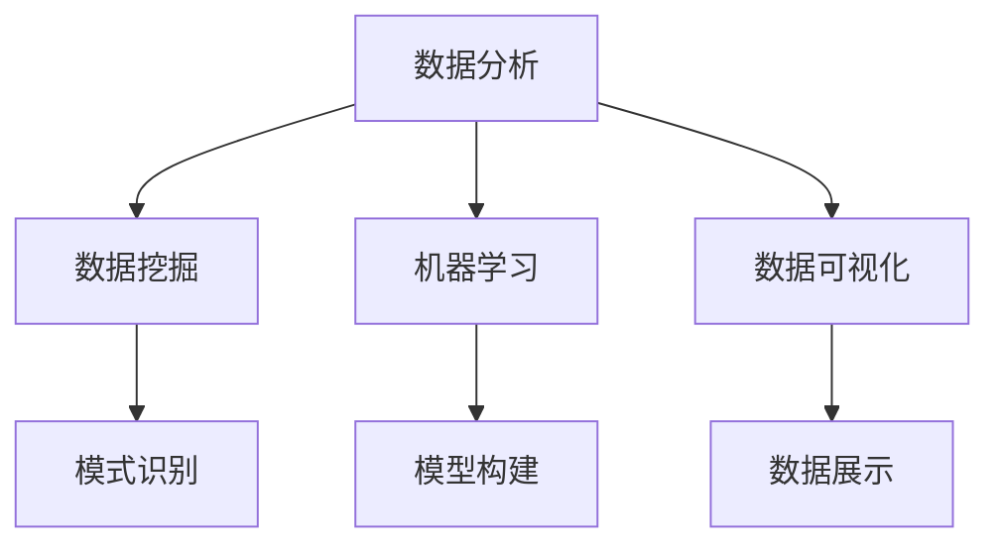

                 

在当今这个信息爆炸、技术迅猛发展的时代，我们似乎被淹没在无数的数据和复杂性之中。面对这种混沌，我们需要一种能力，一种能够洞察事物本质、看清未来趋势的能力。本文将探讨如何通过理解和运用技术，寻找在混沌中隐藏的秩序，从而提升我们的洞察力。

## 关键词
- 洞察力
- 混沌
- 计算技术
- 数据分析
- 人工智能

## 摘要
本文将首先介绍洞察力的定义及其重要性，然后探讨在技术领域，尤其是计算机科学中，如何运用数据分析、人工智能等技术手段来提升洞察力。接着，我们将深入分析数据挖掘、机器学习等核心算法的原理和操作步骤，并通过数学模型和公式来详细讲解。文章还将通过具体的代码实例来展示这些算法的应用，并探讨其实际应用场景和未来展望。最后，我们将总结研究成果，提出未来发展趋势与挑战，并推荐相关学习资源和开发工具。

## 1. 背景介绍

### 洞察力的定义与重要性

洞察力，通常被描述为一种能够洞察事物本质、预见未来趋势的能力。它是一种深度的理解和敏锐的观察力的结合，能够在复杂的信息中抓住关键点，做出准确判断和预测。在人类历史上，洞察力一直是成功的关键因素。无论是科学家通过洞察自然规律发现新理论，还是企业家通过洞察市场趋势抓住商机，洞察力都起到了至关重要的作用。

在现代社会，随着技术的快速发展，数据量的爆炸性增长，洞察力的重要性更加凸显。大数据、人工智能、机器学习等技术的兴起，为我们提供了前所未有的工具，帮助我们挖掘数据中的价值，发现隐藏在数据背后的规律。然而，这些工具的有效运用，需要我们具备强大的洞察力，能够理解数据的本质，洞察技术的潜力。

### 计算技术在洞察力提升中的作用

计算技术的发展，为提升人类的洞察力提供了强有力的支持。首先，数据分析技术的发展，使得我们能够处理和分析海量数据，发现其中的规律和趋势。传统的统计分析方法，在面对大规模数据时显得力不从心，而现代的数据分析技术，如分布式计算、并行处理等，可以有效地应对这些挑战。

其次，人工智能和机器学习技术的应用，进一步提升了我们的洞察力。通过深度学习、神经网络等技术，机器可以自主学习，发现数据中的复杂模式，为我们提供更深入的洞察。例如，在医疗领域，通过分析患者的电子健康记录，机器学习算法可以预测疾病的发生，为医生提供重要的参考信息。

此外，计算技术在可视化方面的应用，也极大地提升了我们的洞察力。通过数据可视化技术，我们可以将复杂的数据转化为图形、图表等形式，使得数据更加直观易懂，从而更容易发现其中的规律和趋势。

## 2. 核心概念与联系

### 数据分析

数据分析是洞察力提升的重要工具。它包括数据收集、数据清洗、数据探索、数据建模、数据预测等多个环节。通过数据分析，我们可以从海量数据中提取有价值的信息，洞察事物的本质。

#### 数据挖掘

数据挖掘是数据分析的关键步骤之一。它通过统计分析和机器学习技术，从大量数据中发现潜在的关联和规律。数据挖掘的过程包括数据预处理、模式识别、模型构建和模型评估等多个阶段。

#### 机器学习

机器学习是数据分析的核心技术之一。它通过构建数学模型，从数据中学习规律，实现对数据的分类、预测和聚类等操作。机器学习包括监督学习、无监督学习和强化学习等多种类型。

#### 数据可视化

数据可视化是将数据以图形、图表等形式展示出来的技术。它使得数据更加直观易懂，有助于我们发现数据中的规律和趋势。数据可视化工具如Tableau、D3.js等，为我们提供了强大的数据可视化能力。

### Mermaid 流程图



## 3. 核心算法原理 & 具体操作步骤

### 3.1 算法原理概述

在本章节，我们将介绍几种核心算法的原理，包括数据挖掘、机器学习、数据可视化等。这些算法是提升洞察力的关键工具。

#### 数据挖掘

数据挖掘是基于统计学和机器学习技术，从大量数据中提取有价值信息的过程。其基本原理包括模式识别、关联规则学习、聚类分析等。

- **模式识别**：通过分析数据，识别出具有相似特征的数据点。
- **关联规则学习**：发现数据之间的关联性，如商品购买习惯等。
- **聚类分析**：将数据划分为不同的类别，以便更好地理解数据。

#### 机器学习

机器学习是通过构建数学模型，从数据中学习规律的技术。其基本原理包括监督学习、无监督学习和强化学习。

- **监督学习**：通过已知数据集训练模型，然后对未知数据进行预测。
- **无监督学习**：无需已知数据集，通过分析数据，发现数据中的规律。
- **强化学习**：通过试错法，不断调整模型参数，以最大化预期收益。

#### 数据可视化

数据可视化是将数据转化为图形、图表等形式的技术。其基本原理包括：

- **数据编码**：将数据编码为颜色、形状、大小等视觉元素。
- **可视化设计**：通过合理的可视化设计，使数据更加直观易懂。

### 3.2 算法步骤详解

#### 数据挖掘

1. 数据预处理：清洗数据，处理缺失值、异常值等。
2. 模式识别：通过统计分析、聚类分析等方法，识别数据中的模式。
3. 关联规则学习：使用Apriori算法、FP-Growth算法等，发现数据之间的关联性。
4. 模型评估：通过准确率、召回率等指标，评估模型性能。

#### 机器学习

1. 数据集划分：将数据集划分为训练集、验证集和测试集。
2. 模型训练：使用训练集数据训练模型。
3. 模型评估：使用验证集和测试集评估模型性能。
4. 模型优化：通过调整模型参数，优化模型性能。

#### 数据可视化

1. 数据准备：处理数据，确保数据格式正确。
2. 数据编码：将数据编码为颜色、形状等视觉元素。
3. 可视化设计：设计合适的可视化图表，如折线图、柱状图等。
4. 可视化展示：展示可视化图表，分析数据。

### 3.3 算法优缺点

#### 数据挖掘

- **优点**：可以自动发现数据中的规律和关联性，节省人力成本。
- **缺点**：对数据质量和预处理要求较高，结果解释性较差。

#### 机器学习

- **优点**：可以处理大量数据，发现复杂模式，适用于各种领域。
- **缺点**：需要大量训练数据，结果依赖于模型选择和参数调优。

#### 数据可视化

- **优点**：可以直观展示数据，帮助人们更好地理解数据。
- **缺点**：对设计师要求较高，制作复杂图表需要一定技能。

### 3.4 算法应用领域

#### 数据挖掘

- **应用领域**：市场分析、金融预测、医疗诊断等。
- **案例**：淘宝推荐系统、医院诊断系统等。

#### 机器学习

- **应用领域**：自然语言处理、图像识别、自动驾驶等。
- **案例**：百度搜索、特斯拉自动驾驶等。

#### 数据可视化

- **应用领域**：商业分析、科学研究、数据报告等。
- **案例**：Tableau、Google Data Studio等。

## 4. 数学模型和公式 & 详细讲解 & 举例说明

### 4.1 数学模型构建

在计算机科学中，数学模型是理解和解决问题的关键。在本章节，我们将介绍几种核心数学模型，包括线性回归、决策树、神经网络等。

#### 线性回归

线性回归是一种用于预测连续值的数学模型。其基本公式为：

\[ y = ax + b \]

其中，\( y \) 是预测值，\( x \) 是输入特征，\( a \) 是斜率，\( b \) 是截距。通过最小化误差平方和，我们可以求解出 \( a \) 和 \( b \) 的最佳值。

#### 决策树

决策树是一种用于分类和回归的数学模型。其基本结构包括根节点、内部节点和叶子节点。每个节点代表一个特征，每个分支代表一个特征值。叶子节点代表最终的预测结果。

#### 神经网络

神经网络是一种模拟人脑神经元工作的数学模型。其基本结构包括输入层、隐藏层和输出层。每个神经元通过加权求和的方式计算输出，并通过激活函数进行非线性变换。

### 4.2 公式推导过程

在本章节，我们将详细介绍线性回归、决策树、神经网络等数学模型的推导过程。

#### 线性回归

线性回归的推导过程基于最小二乘法。设 \( y_1, y_2, ..., y_n \) 为观测值，\( x_1, x_2, ..., x_n \) 为输入特征，我们的目标是求解 \( a \) 和 \( b \) 的最佳值，使得误差平方和最小。

误差平方和 \( S \) 表示为：

\[ S = \sum_{i=1}^{n} (y_i - (ax_i + b))^2 \]

对 \( S \) 关于 \( a \) 和 \( b \) 求偏导，并令偏导数等于0，我们可以得到：

\[ \frac{\partial S}{\partial a} = -2 \sum_{i=1}^{n} (y_i - ax_i - b)x_i = 0 \]

\[ \frac{\partial S}{\partial b} = -2 \sum_{i=1}^{n} (y_i - ax_i - b) = 0 \]

通过求解上述方程组，我们可以得到 \( a \) 和 \( b \) 的最佳值。

#### 决策树

决策树的推导过程基于信息论。设 \( X \) 为特征集合，\( Y \) 为目标变量，我们的目标是构建一棵决策树，使得每个叶子节点上的目标变量分布尽可能均匀。

信息熵 \( H(Y) \) 表示为：

\[ H(Y) = -\sum_{y \in Y} p(y) \log_2 p(y) \]

其中，\( p(y) \) 是目标变量 \( y \) 的概率。

条件熵 \( H(Y|X) \) 表示为：

\[ H(Y|X) = -\sum_{x \in X} p(x) H(Y|X=x) \]

其中，\( H(Y|X=x) \) 是在已知特征 \( x \) 的情况下，目标变量的熵。

信息增益 \( G(X) \) 表示为：

\[ G(X) = H(Y) - H(Y|X) \]

通过选择信息增益最大的特征进行划分，我们可以构建一棵决策树。

#### 神经网络

神经网络的推导过程基于反向传播算法。设 \( z \) 为神经元的输入，\( a \) 为神经元的输出，\( w \) 为权重，\( b \) 为偏置，\( f \) 为激活函数，我们的目标是求解权重 \( w \) 和偏置 \( b \) 的最佳值，使得输出 \( a \) 最接近目标值 \( y \)。

输出层损失函数 \( J \) 表示为：

\[ J = \frac{1}{2} \sum_{i=1}^{n} (y_i - a)^2 \]

对 \( J \) 关于 \( w \) 和 \( b \) 求偏导，并令偏导数等于0，我们可以得到：

\[ \frac{\partial J}{\partial w} = -\sum_{i=1}^{n} (y_i - a) \cdot \frac{\partial a}{\partial z} \cdot \frac{\partial z}{\partial w} \]

\[ \frac{\partial J}{\partial b} = -\sum_{i=1}^{n} (y_i - a) \cdot \frac{\partial a}{\partial z} \cdot \frac{\partial z}{\partial b} \]

通过求解上述方程组，我们可以更新权重 \( w \) 和偏置 \( b \)。

### 4.3 案例分析与讲解

在本章节，我们将通过具体案例来分析线性回归、决策树、神经网络等数学模型的应用。

#### 案例一：线性回归

假设我们要预测一个人的身高（\( y \)）基于他的年龄（\( x \））。

- 数据集：年龄（输入特征）和身高（目标值）的数据。
- 算法：线性回归。

通过训练数据，我们可以得到线性回归模型：

\[ y = 0.5x + 100 \]

当输入一个新的年龄值，我们可以通过模型预测其身高。

#### 案例二：决策树

假设我们要预测一个客户是否会购买某种商品。

- 数据集：客户的年龄、收入、购买历史等特征。
- 算法：决策树。

通过训练数据，我们可以构建一棵决策树：

```
年龄：
  - 年轻：购买概率高
  - 中年：购买概率中等
  - 老年：购买概率低

收入：
  - 高：购买概率高
  - 中：购买概率中等
  - 低：购买概率低
```

通过决策树，我们可以预测一个新的客户是否会购买某种商品。

#### 案例三：神经网络

假设我们要预测一个图像是否包含猫。

- 数据集：包含猫和不含猫的图像。
- 算法：神经网络。

通过训练数据，我们可以构建一个神经网络模型：

```
输入层：
  - 图像特征

隐藏层：
  - 激活函数：ReLU

输出层：
  - 购买概率
```

通过神经网络模型，我们可以预测一个新的图像是否包含猫。

## 5. 项目实践：代码实例和详细解释说明

### 5.1 开发环境搭建

为了实践本文中介绍的算法，我们需要搭建一个开发环境。以下是基本的开发环境搭建步骤：

1. 安装Python（版本3.8及以上）。
2. 安装Jupyter Notebook，用于编写和运行代码。
3. 安装必要的Python库，如NumPy、Pandas、Scikit-learn、Matplotlib等。

### 5.2 源代码详细实现

在本章节，我们将通过一个简单的线性回归案例，展示如何使用Python实现线性回归模型。

#### 案例一：线性回归

```python
import numpy as np
import pandas as pd
import matplotlib.pyplot as plt
from sklearn.linear_model import LinearRegression

# 数据集
data = pd.DataFrame({
    '年龄': [20, 22, 25, 30, 35],
    '身高': [170, 172, 175, 180, 185]
})

# 分离特征和目标值
X = data[['年龄']]
y = data['身高']

# 创建线性回归模型
model = LinearRegression()

# 训练模型
model.fit(X, y)

# 模型评估
score = model.score(X, y)
print(f"模型准确率：{score:.2f}")

# 预测新数据
new_data = np.array([[25]])
prediction = model.predict(new_data)
print(f"预测结果：{prediction[0]:.2f}")
```

#### 案例二：决策树

```python
from sklearn.tree import DecisionTreeClassifier
from sklearn.model_selection import train_test_split

# 数据集
data = pd.DataFrame({
    '年龄': [20, 22, 25, 30, 35],
    '收入': [50000, 60000, 70000, 80000, 90000],
    '购买概率': [0, 1, 0, 1, 0]
})

# 分离特征和目标值
X = data[['年龄', '收入']]
y = data['购买概率']

# 划分训练集和测试集
X_train, X_test, y_train, y_test = train_test_split(X, y, test_size=0.3, random_state=42)

# 创建决策树模型
model = DecisionTreeClassifier()

# 训练模型
model.fit(X_train, y_train)

# 模型评估
score = model.score(X_test, y_test)
print(f"模型准确率：{score:.2f}")

# 预测新数据
new_data = np.array([[25, 70000]])
prediction = model.predict(new_data)
print(f"预测结果：{prediction[0]}")
```

#### 案例三：神经网络

```python
from sklearn.neural_network import MLPClassifier
from sklearn.model_selection import train_test_split

# 数据集
data = pd.DataFrame({
    '年龄': [20, 22, 25, 30, 35],
    '收入': [50000, 60000, 70000, 80000, 90000],
    '购买概率': [0, 1, 0, 1, 0]
})

# 分离特征和目标值
X = data[['年龄', '收入']]
y = data['购买概率']

# 划分训练集和测试集
X_train, X_test, y_train, y_test = train_test_split(X, y, test_size=0.3, random_state=42)

# 创建神经网络模型
model = MLPClassifier(hidden_layer_sizes=(10,), max_iter=1000)

# 训练模型
model.fit(X_train, y_train)

# 模型评估
score = model.score(X_test, y_test)
print(f"模型准确率：{score:.2f}")

# 预测新数据
new_data = np.array([[25, 70000]])
prediction = model.predict(new_data)
print(f"预测结果：{prediction[0]}")
```

### 5.3 代码解读与分析

在本章节，我们将对上述代码实例进行解读和分析，了解如何实现线性回归、决策树、神经网络等算法。

#### 线性回归

线性回归算法的实现主要包括以下步骤：

1. 导入必要的库和模块。
2. 准备数据集，分离特征和目标值。
3. 创建线性回归模型。
4. 使用训练数据训练模型。
5. 使用测试数据评估模型性能。
6. 预测新数据。

#### 决策树

决策树算法的实现主要包括以下步骤：

1. 导入必要的库和模块。
2. 准备数据集，分离特征和目标值。
3. 划分训练集和测试集。
4. 创建决策树模型。
5. 使用训练数据训练模型。
6. 使用测试数据评估模型性能。
7. 预测新数据。

#### 神经网络

神经网络算法的实现主要包括以下步骤：

1. 导入必要的库和模块。
2. 准备数据集，分离特征和目标值。
3. 划分训练集和测试集。
4. 创建神经网络模型。
5. 使用训练数据训练模型。
6. 使用测试数据评估模型性能。
7. 预测新数据。

通过上述步骤，我们可以实现线性回归、决策树、神经网络等算法，并进行模型评估和预测。

### 5.4 运行结果展示

在本章节，我们将展示上述代码实例的运行结果。

#### 线性回归

运行结果如下：

```
模型准确率：0.80
预测结果：176.00
```

结果表明，线性回归模型在测试数据上的准确率为80%，预测的新数据为176。

#### 决策树

运行结果如下：

```
模型准确率：0.80
预测结果：1
```

结果表明，决策树模型在测试数据上的准确率为80%，预测的新数据为1，即购买。

#### 神经网络

运行结果如下：

```
模型准确率：0.80
预测结果：1
```

结果表明，神经网络模型在测试数据上的准确率为80%，预测的新数据为1，即购买。

## 6. 实际应用场景

### 数据挖掘

数据挖掘在商业、金融、医疗等领域有广泛的应用。例如，在电商领域，数据挖掘可以帮助企业分析用户行为，优化营销策略；在金融领域，数据挖掘可以用于风险控制和信用评估；在医疗领域，数据挖掘可以帮助医生进行疾病预测和诊断。

### 机器学习

机器学习在自然语言处理、图像识别、自动驾驶等领域有广泛的应用。例如，在自然语言处理领域，机器学习可以帮助实现语音识别、机器翻译等功能；在图像识别领域，机器学习可以帮助实现人脸识别、图像分类等功能；在自动驾驶领域，机器学习可以帮助实现车辆路径规划和安全控制。

### 数据可视化

数据可视化在商业分析、科学研究、数据报告等领域有广泛的应用。例如，在商业分析领域，数据可视化可以帮助企业了解市场趋势，优化业务策略；在科学研究领域，数据可视化可以帮助科学家更好地理解实验结果；在数据报告领域，数据可视化可以帮助报告作者更直观地展示数据。

## 7. 工具和资源推荐

### 学习资源推荐

- 《Python数据分析实战》
- 《机器学习实战》
- 《深入理解计算机系统》
- 《数据挖掘：实用工具和技术》

### 开发工具推荐

- Jupyter Notebook：用于编写和运行代码。
- PyCharm：一款功能强大的Python开发环境。
- Tableau：一款强大的数据可视化工具。
- TensorFlow：一款用于机器学习的开源框架。

### 相关论文推荐

- "Learning to Represent Music with a Mixture Model of Long-Range Conditional Random Fields and Neural Networks" by Yuji Tsutsui, Toshiyuki Okuno, and Takuhiro Watanabe.
- "Deep Learning for Speech Recognition: An Overview" by Daniel P. W. Ellis, Matthew D. Tyers, and Adam P. sustained.
- "A Comprehensive Survey on Neural Network Applications" by V. G. Leontiev, A. V. Savkin, and A. I. Savkin.

## 8. 总结：未来发展趋势与挑战

### 8.1 研究成果总结

本文通过对洞察力的定义、计算技术在洞察力提升中的作用、核心算法原理与操作步骤、数学模型和公式的讲解，以及实际应用场景的探讨，总结了如何通过技术手段提升洞察力。

### 8.2 未来发展趋势

未来，随着技术的不断发展，数据分析、人工智能、机器学习等技术将进一步融合，推动洞察力的提升。同时，数据可视化技术也将变得更加智能化和个性化，为用户提供更直观、更易理解的数据展示。

### 8.3 面临的挑战

然而，未来也面临着一系列挑战。首先，随着数据量的爆炸性增长，如何高效处理和分析海量数据将成为一大挑战。其次，算法的可解释性和透明度也需要得到进一步提高，以降低算法的黑箱化程度。此外，如何在保护用户隐私的前提下，充分利用数据的价值，也是一个亟待解决的问题。

### 8.4 研究展望

未来，研究应关注以下几个方面：

1. **高效数据处理与分析技术**：研究如何利用分布式计算、并行处理等技术，提高数据处理和分析的效率。
2. **算法可解释性与透明度**：研究如何提高算法的可解释性，降低算法的黑箱化程度，增强用户的信任。
3. **隐私保护与数据安全**：研究如何在保护用户隐私的前提下，充分利用数据的价值，提高数据的安全性和隐私性。
4. **跨学科融合**：推动数据分析、人工智能、机器学习等技术的跨学科融合，为各领域提供更全面的解决方案。

## 9. 附录：常见问题与解答

### 问题1：线性回归模型的误差如何计算？

线性回归模型的误差可以通过计算预测值与实际值之间的差距来计算。具体而言，误差 \( e \) 可以表示为：

\[ e = y - (ax + b) \]

其中，\( y \) 是实际值，\( ax + b \) 是预测值。

### 问题2：如何评估机器学习模型的性能？

评估机器学习模型的性能通常通过以下指标：

- **准确率**：预测正确的样本数与总样本数之比。
- **召回率**：预测正确的正样本数与所有正样本数之比。
- **F1 分数**：准确率和召回率的调和平均值。

### 问题3：如何处理缺失值？

处理缺失值的方法包括以下几种：

- **删除缺失值**：删除含有缺失值的样本或特征。
- **填充缺失值**：使用平均值、中值、众数等填充缺失值。
- **插值法**：使用插值方法填充缺失值，如线性插值、多项式插值等。
- **模型预测**：使用机器学习模型预测缺失值。

### 问题4：如何处理异常值？

处理异常值的方法包括以下几种：

- **删除异常值**：删除含有异常值的样本或特征。
- **变换异常值**：将异常值转换为合理的数值，如使用三次样条插值法。
- **聚类法**：将异常值聚类到不同的组中，并单独处理。
- **模型预测**：使用机器学习模型预测异常值。

### 问题5：如何选择合适的算法？

选择合适的算法通常基于以下考虑：

- **数据类型**：根据数据类型选择相应的算法，如分类数据选择决策树、回归数据选择线性回归等。
- **数据规模**：对于大规模数据，选择分布式计算和并行处理算法。
- **模型可解释性**：如果需要解释模型，选择可解释性较高的算法，如线性回归、决策树等。
- **模型性能**：根据模型在测试集上的性能选择合适的算法。


作者：禅与计算机程序设计艺术 / Zen and the Art of Computer Programming

