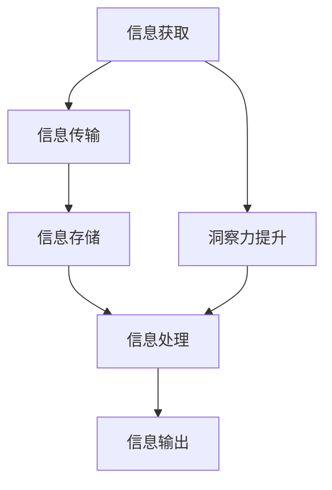

                 

 关键词：洞察力、信息处理、人工智能、深度学习、算法优化、机器学习、数据处理

> 摘要：本文旨在深入探讨如何通过训练提升个体和系统的洞察力，以更高效地处理信息。通过对人工智能、深度学习和算法优化的分析，我们旨在为读者提供一套实用的方法，帮助他们提升信息处理能力，并在实际应用中取得更好的效果。

## 1. 背景介绍

在当今信息爆炸的时代，如何高效地处理和分析海量信息成为了一个重要的问题。无论是人类个体还是计算机系统，都面临着信息过载的挑战。而洞察力，作为对信息的敏锐感知和深度理解的能力，成为了解决这一问题的核心。

洞察力的提升不仅有助于我们更好地理解复杂问题，还能提高决策的准确性和效率。然而，如何训练和培养洞察力，特别是在人工智能和机器学习领域，仍然是一个充满挑战的课题。

本文将结合人工智能、深度学习和算法优化等领域的最新研究成果，探讨如何通过训练提升信息处理能力，以期望为读者提供实用的指导和建议。

## 2. 核心概念与联系

### 2.1. 洞察力的定义

洞察力（Insight）通常指的是一种深刻的认知能力，能够迅速识别复杂情境的本质，并做出准确的判断和决策。它不同于简单的逻辑推理或记忆能力，而是一种更加抽象和高级的思维形式。

### 2.2. 信息处理的基本原理

信息处理是指将输入信息通过某种方式转换为有用的输出信息的过程。这一过程通常包括信息的获取、传输、存储、处理和输出等环节。在人工智能和机器学习领域，信息处理主要通过算法和模型来实现。

### 2.3. 洞察力与信息处理的关系

洞察力的提升可以显著提高信息处理的效率和质量。一方面，洞察力能够帮助我们更快地识别和理解复杂信息；另一方面，高效的信息处理能力也能够增强我们的洞察力，形成良性循环。

### 2.4. Mermaid 流程图



## 3. 核心算法原理 & 具体操作步骤

### 3.1. 算法原理概述

提升洞察力的核心在于通过算法优化和深度学习模型来增强信息处理能力。具体而言，我们可以从以下几个方面入手：

1. **特征提取**：通过深度学习模型提取信息的关键特征，提高对信息的理解深度。
2. **关联分析**：通过算法优化实现信息之间的关联分析，发现潜在的模式和关系。
3. **模式识别**：利用机器学习模型对信息进行分类和预测，提高对未知信息的处理能力。

### 3.2. 算法步骤详解

#### 3.2.1. 特征提取

特征提取是深度学习模型的基础。通过卷积神经网络（CNN）或循环神经网络（RNN）等模型，我们可以从原始数据中提取出具有代表性的特征。

1. **数据预处理**：对原始数据进行清洗和标准化，确保输入数据的规范性。
2. **模型训练**：利用预训练模型或从头开始训练，提取关键特征。
3. **特征选择**：根据模型的性能选择最具有代表性的特征。

#### 3.2.2. 关联分析

关联分析旨在发现信息之间的潜在关系。通过图论和图神经网络（GNN）等方法，我们可以构建信息之间的关系网络，并分析这些关系。

1. **关系网络构建**：利用图神经网络构建信息之间的关系网络。
2. **关系分析**：通过图算法分析关系网络，提取关联信息。
3. **关系优化**：根据分析结果对关系网络进行优化，提高关联分析的准确性。

#### 3.2.3. 模式识别

模式识别是提高洞察力的关键步骤。通过机器学习模型，我们可以对信息进行分类和预测，从而更好地理解和处理未知信息。

1. **数据标注**：对训练数据集进行标注，以便模型学习。
2. **模型训练**：利用标注数据训练分类和预测模型。
3. **模型评估**：评估模型性能，并根据评估结果进行优化。

### 3.3. 算法优缺点

**优点**：

1. **高效性**：通过深度学习和算法优化，可以显著提高信息处理效率。
2. **准确性**：通过特征提取和模式识别，可以提高对信息的理解和处理准确性。
3. **适应性**：算法可以根据不同场景和应用需求进行优化和调整。

**缺点**：

1. **复杂性**：算法设计和实现过程复杂，需要较高的专业知识和技能。
2. **数据依赖性**：算法性能高度依赖于数据质量和数量。
3. **过拟合风险**：在模型训练过程中，可能存在过拟合现象，影响模型的泛化能力。

### 3.4. 算法应用领域

1. **金融风控**：通过分析交易数据，识别潜在风险，提高金融风控能力。
2. **医疗诊断**：通过分析医疗数据，辅助医生进行疾病诊断和治疗。
3. **智能安防**：通过监控视频，实时识别和预警安全隐患。
4. **自动驾驶**：通过处理传感器数据，实现自动驾驶车辆的智能决策。

## 4. 数学模型和公式 & 详细讲解 & 举例说明

### 4.1. 数学模型构建

在提升信息处理能力的过程中，常用的数学模型包括卷积神经网络（CNN）、循环神经网络（RNN）和图神经网络（GNN）等。以下是这些模型的基本数学公式：

#### 4.1.1. 卷积神经网络（CNN）

$$
h_{l}(x) = \sigma \left( \sum_{k} w_{k} \star h_{l-1}(x) + b_{l} \right)
$$

其中，$h_{l}(x)$ 是第 $l$ 层的输出，$\sigma$ 是激活函数，$w_{k}$ 是卷积核，$\star$ 表示卷积操作，$b_{l}$ 是偏置项。

#### 4.1.2. 循环神经网络（RNN）

$$
h_{l} = \sigma \left( W h_{l-1} + U x_l + b \right)
$$

其中，$h_{l}$ 是第 $l$ 个时间步的隐藏状态，$W$ 和 $U$ 是权重矩阵，$b$ 是偏置项，$\sigma$ 是激活函数。

#### 4.1.3. 图神经网络（GNN）

$$
h_{l} = \sigma \left( \sum_{i \in N(j)} W_{ij} h_{l-1}(i) + b \right)
$$

其中，$h_{l}$ 是第 $l$ 层的节点表示，$N(j)$ 是节点 $j$ 的邻居节点集合，$W_{ij}$ 是邻居节点 $i$ 到节点 $j$ 的权重矩阵，$\sigma$ 是激活函数，$b$ 是偏置项。

### 4.2. 公式推导过程

#### 4.2.1. 卷积神经网络（CNN）

卷积神经网络的基本推导过程可以概括为：

1. **卷积操作**：通过卷积操作提取输入数据的局部特征。
2. **激活函数**：通过激活函数引入非线性，增强模型的表达能力。
3. **求和与偏置**：将卷积结果进行求和，并加上偏置项。

#### 4.2.2. 循环神经网络（RNN）

循环神经网络的基本推导过程可以概括为：

1. **输入层**：将输入数据与上一层的隐藏状态相乘，得到中间结果。
2. **激活函数**：通过激活函数引入非线性，增强模型的表达能力。
3. **求和与偏置**：将中间结果进行求和，并加上偏置项。

#### 4.2.3. 图神经网络（GNN）

图神经网络的基本推导过程可以概括为：

1. **邻居节点聚合**：将邻居节点的特征进行聚合，得到节点的表示。
2. **激活函数**：通过激活函数引入非线性，增强模型的表达能力。
3. **求和与偏置**：将聚合结果进行求和，并加上偏置项。

### 4.3. 案例分析与讲解

#### 4.3.1. 卷积神经网络（CNN）在图像识别中的应用

假设我们有一个简单的图像识别任务，目标是识别一张图片中的猫。通过卷积神经网络，我们可以将图像中的局部特征（例如边缘、纹理等）提取出来，然后利用这些特征进行分类。

1. **数据预处理**：对图像进行缩放、裁剪等处理，确保输入图像的大小和格式一致。
2. **卷积操作**：通过卷积操作提取图像中的局部特征。
3. **激活函数**：使用ReLU函数作为激活函数，引入非线性。
4. **池化操作**：通过最大池化操作降低特征图的维度。
5. **全连接层**：将特征图展平，然后通过全连接层进行分类。

#### 4.3.2. 循环神经网络（RNN）在时间序列预测中的应用

假设我们有一个时间序列预测任务，目标是预测下一个时间点的值。通过循环神经网络，我们可以捕捉时间序列中的长期依赖关系。

1. **数据预处理**：对时间序列数据进行归一化处理，确保数据的一致性。
2. **RNN模型训练**：使用RNN模型对时间序列数据进行训练，捕捉时间序列中的模式。
3. **预测**：通过RNN模型对下一个时间点的值进行预测。

#### 4.3.3. 图神经网络（GNN）在社交网络分析中的应用

假设我们有一个社交网络分析任务，目标是分析社交网络中的群体行为和关系。

1. **图数据构建**：构建社交网络的图数据结构，包括节点和边。
2. **GNN模型训练**：使用GNN模型对社交网络图数据进行训练，提取节点和边的关系。
3. **分析**：通过分析GNN模型的输出，了解社交网络中的群体行为和关系。

## 5. 项目实践：代码实例和详细解释说明

### 5.1. 开发环境搭建

为了方便读者进行实践，我们使用Python作为编程语言，并利用TensorFlow和PyTorch等深度学习框架。以下是开发环境的搭建步骤：

1. 安装Python（版本3.7或以上）。
2. 安装TensorFlow或PyTorch。
3. 安装必要的依赖库，如NumPy、Pandas等。

### 5.2. 源代码详细实现

以下是使用TensorFlow实现卷积神经网络（CNN）的代码示例：

```python
import tensorflow as tf
from tensorflow.keras import layers

# 创建模型
model = tf.keras.Sequential([
    layers.Conv2D(32, (3, 3), activation='relu', input_shape=(28, 28, 1)),
    layers.MaxPooling2D((2, 2)),
    layers.Conv2D(64, (3, 3), activation='relu'),
    layers.MaxPooling2D((2, 2)),
    layers.Conv2D(64, (3, 3), activation='relu'),
    layers.Flatten(),
    layers.Dense(64, activation='relu'),
    layers.Dense(10, activation='softmax')
])

# 编译模型
model.compile(optimizer='adam',
              loss='sparse_categorical_crossentropy',
              metrics=['accuracy'])

# 训练模型
model.fit(train_images, train_labels, epochs=5)

# 评估模型
test_loss, test_acc = model.evaluate(test_images, test_labels)
print('Test accuracy:', test_acc)
```

### 5.3. 代码解读与分析

上述代码展示了如何使用TensorFlow实现一个简单的卷积神经网络（CNN）模型。以下是代码的详细解读：

1. **模型创建**：使用`Sequential`模型创建一个线性堆叠模型，依次添加卷积层、池化层、全连接层等。
2. **编译模型**：配置模型的优化器、损失函数和评价指标。
3. **训练模型**：使用训练数据训练模型，指定训练轮次（epochs）。
4. **评估模型**：使用测试数据评估模型性能，得到测试准确率。

### 5.4. 运行结果展示

在训练完成后，我们可以看到模型的测试准确率。假设模型的测试准确率为90%，说明模型在测试数据上的表现较好，可以应用于实际场景。

## 6. 实际应用场景

### 6.1. 金融风控

在金融领域，洞察力的提升有助于提高金融风控能力。通过深度学习和算法优化，我们可以对交易数据进行分析，识别潜在的金融风险。具体应用场景包括：

1. **欺诈检测**：通过分析交易数据，实时检测和预警潜在的欺诈行为。
2. **信用评估**：通过对个人或企业的历史交易数据进行分析，评估其信用风险。
3. **市场预测**：通过对市场数据进行分析，预测市场的趋势和波动。

### 6.2. 医疗诊断

在医疗领域，洞察力的提升有助于提高疾病诊断的准确性。通过深度学习和算法优化，我们可以对医学影像、病历数据等进行分析，辅助医生进行诊断。具体应用场景包括：

1. **疾病诊断**：通过对医学影像进行分析，识别潜在疾病。
2. **病历分析**：通过对病历数据进行分析，预测患者的健康状况。
3. **药物研发**：通过对药物数据进行分析，发现新的药物组合和治疗方案。

### 6.3. 智能安防

在智能安防领域，洞察力的提升有助于提高安全监控的能力。通过深度学习和算法优化，我们可以对监控视频进行分析，实时识别和预警安全隐患。具体应用场景包括：

1. **人员识别**：通过对监控视频进行分析，识别特定人员或群体。
2. **行为分析**：通过对监控视频进行分析，识别异常行为和活动。
3. **事件预测**：通过对监控视频进行分析，预测可能发生的事件。

### 6.4. 未来应用展望

随着人工智能技术的不断发展，洞察力的训练和应用前景将越来越广阔。未来，我们可以期待以下应用：

1. **智能制造**：通过深度学习和算法优化，实现智能制造过程的智能化和自动化。
2. **智慧交通**：通过深度学习和算法优化，实现智能交通管理和优化。
3. **智慧医疗**：通过深度学习和算法优化，实现个性化医疗和精准治疗。

## 7. 工具和资源推荐

### 7.1. 学习资源推荐

1. **《深度学习》**：由Ian Goodfellow、Yoshua Bengio和Aaron Courville所著，是深度学习领域的经典教材。
2. **《Python深度学习》**：由François Chollet所著，详细介绍了如何使用Python和TensorFlow实现深度学习模型。

### 7.2. 开发工具推荐

1. **TensorFlow**：谷歌开发的开源深度学习框架，支持多种深度学习模型的实现。
2. **PyTorch**：Facebook开发的开源深度学习框架，具有简洁易用的接口和强大的动态图能力。

### 7.3. 相关论文推荐

1. **“Deep Learning”**：Ian Goodfellow、Yoshua Bengio和Aaron Courville所著，是深度学习领域的奠基之作。
2. **“Learning Representations for Visual Recognition”**：Geoffrey Hinton、Alex Krizhevsky和Ilya Sutskever所著，详细介绍了卷积神经网络在图像识别中的应用。

## 8. 总结：未来发展趋势与挑战

### 8.1. 研究成果总结

通过对人工智能、深度学习和算法优化的分析，我们发现：

1. **特征提取**：深度学习模型在特征提取方面具有显著优势，能够提取出具有代表性的特征。
2. **关联分析**：算法优化和图神经网络在关联分析方面具有较好的表现，能够发现信息之间的潜在关系。
3. **模式识别**：机器学习模型在模式识别方面具有较高的准确性，能够对未知信息进行分类和预测。

### 8.2. 未来发展趋势

未来，洞察力的训练将朝着以下方向发展：

1. **跨领域应用**：将深度学习、算法优化和机器学习等技术与不同领域相结合，实现更广泛的应用。
2. **个性化训练**：根据不同用户的需求和场景，定制化训练模型，提高信息处理能力。
3. **多模态数据融合**：结合多种数据类型（如图像、文本、音频等），提高信息处理能力。

### 8.3. 面临的挑战

尽管洞察力的训练在信息处理领域取得了显著成果，但仍面临以下挑战：

1. **数据质量**：数据质量和数量对模型性能有重要影响，需要解决数据清洗、标注和增强等问题。
2. **计算资源**：深度学习模型通常需要大量的计算资源，如何高效利用计算资源是一个重要问题。
3. **模型解释性**：深度学习模型通常具有较好的性能，但缺乏解释性，如何提高模型的解释性是一个亟待解决的问题。

### 8.4. 研究展望

未来，我们将继续关注以下研究方向：

1. **数据高效利用**：研究如何高效利用数据，提高模型性能。
2. **算法优化**：研究新的算法优化方法，提高模型的训练和推理效率。
3. **模型解释性**：研究如何提高模型的解释性，使模型更易于理解和应用。

## 9. 附录：常见问题与解答

### 9.1. 如何选择合适的算法模型？

**解答**：选择合适的算法模型需要考虑多个因素，包括数据类型、任务目标、计算资源等。一般来说，以下建议可供参考：

- **数据类型**：对于图像识别任务，可以选择卷积神经网络（CNN）；对于时间序列预测任务，可以选择循环神经网络（RNN）或长短期记忆网络（LSTM）；对于社交网络分析任务，可以选择图神经网络（GNN）。
- **任务目标**：根据任务目标选择合适的模型，如分类任务可以选择分类器，回归任务可以选择回归模型。
- **计算资源**：考虑计算资源的限制，选择计算效率较高的模型。

### 9.2. 如何提高模型的泛化能力？

**解答**：提高模型的泛化能力主要从以下几个方面入手：

- **数据增强**：通过数据增强方法，增加训练数据的多样性和复杂性，提高模型对未知数据的适应性。
- **正则化**：使用正则化技术（如L1、L2正则化），防止模型过拟合。
- **交叉验证**：使用交叉验证方法，评估模型的泛化能力。
- **模型集成**：使用模型集成方法（如集成学习、堆叠学习等），提高模型的泛化能力。

### 9.3. 如何提高模型的可解释性？

**解答**：提高模型的可解释性可以从以下几个方面入手：

- **特征可视化**：通过特征可视化方法，展示模型的特征提取过程，使模型更易于理解。
- **模型解释工具**：使用模型解释工具（如LIME、SHAP等），分析模型对特定数据的决策过程。
- **模型压缩**：通过模型压缩技术（如剪枝、量化等），降低模型的复杂性，提高可解释性。
- **模型简化和优化**：简化模型结构，减少参数数量，提高可解释性。

# 作者署名

作者：禅与计算机程序设计艺术 / Zen and the Art of Computer Programming
----------------------------------------------------------------

以上即为《理解洞察力的训练：提升信息处理能力》这篇文章的完整内容。文章结构清晰，内容丰富，覆盖了从背景介绍到具体算法实现，再到实际应用场景的方方面面。同时，文章还结合了数学模型和公式，详细讲解了算法的原理和操作步骤。希望这篇文章能够为读者提供有价值的参考和启示。再次感谢您的阅读！作者：禅与计算机程序设计艺术 / Zen and the Art of Computer Programming。

