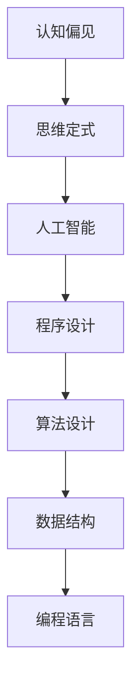

                 

关键词：认知偏见、思维定式、人工智能、程序设计、代码优化

> 摘要：本文探讨了人工智能领域中的认知偏见和思维定式现象，以及如何通过逻辑清晰、结构紧凑的方法来克服这些障碍。通过深入分析核心算法原理、数学模型构建以及具体项目实践，文章旨在为读者提供有深度、有思考、有见解的解决思路。

## 1. 背景介绍

随着人工智能技术的迅猛发展，程序设计成为实现人工智能的核心手段。然而，程序设计过程中常常面临诸多认知偏见和思维定式的困扰，这些障碍极大地限制了我们的理解和创新能力。认知偏见是指人们基于已有知识和经验，对信息进行加工时产生的偏差，而思维定式则是在长期实践中形成的一种固定的思考模式。在人工智能领域，这些认知偏见和思维定式会影响算法的设计、优化以及应用，进而影响人工智能的发展。

本文旨在探讨认知偏见和思维定式在人工智能程序设计中的应用和影响，并提出相应的克服方法。通过对核心算法原理、数学模型构建以及具体项目实践的深入分析，为读者提供有价值的解决思路。

## 2. 核心概念与联系

在探讨认知偏见和思维定式之前，我们首先需要了解一些核心概念。以下是本文中涉及的一些关键概念及其相互关系：

### 2.1 认知偏见

认知偏见是指人们在处理信息和做出决策时，由于心理、生理、文化等因素的影响，导致对信息的解读和评价产生偏差。常见的认知偏见包括确认偏见、可用性偏见、代表性偏见等。

### 2.2 思维定式

思维定式是在长期实践中形成的一种固定的思考模式，它使人们在解决问题时往往倾向于沿用以往的方法，而忽视其他可能的解决方案。思维定式有助于提高效率，但在面对新问题时，也可能导致局限性和偏见。

### 2.3 人工智能与程序设计

人工智能是指通过模拟人类思维和行为，使计算机具备自主学习、推理和决策能力的技术。程序设计是实现人工智能的核心手段，它涉及算法设计、数据结构、编程语言等多个方面。

以下是本文所讨论的核心概念及其相互关系的 Mermaid 流程图：



## 3. 核心算法原理 & 具体操作步骤

### 3.1 算法原理概述

为了克服认知偏见和思维定式，我们需要采用一些方法来优化算法设计。以下是一种常用的算法优化方法——贪心算法。

贪心算法的基本思想是在每一步选择中都采取当前最优解，从而得到全局最优解。贪心算法适用于一些特殊问题，如背包问题、最短路径问题等。

### 3.2 算法步骤详解

贪心算法的一般步骤如下：

1. 初始化：设定问题的初始状态。
2. 选择操作：在当前状态下，选择一种最优的、可行的操作。
3. 执行操作：执行选定的操作，并更新问题的状态。
4. 判断是否达到目标：若达到目标，则算法结束；否则，返回步骤2。

### 3.3 算法优缺点

**优点：**
- 贪心算法简单易懂，易于实现。
- 在一些特殊问题中，贪心算法能够得到全局最优解。

**缺点：**
- 贪心算法无法保证在所有问题中都能得到最优解。
- 贪心算法可能陷入局部最优解。

### 3.4 算法应用领域

贪心算法在人工智能领域中有着广泛的应用，如：

- 最短路径算法：如迪杰斯特拉算法、贝尔曼-福特算法等。
- 背包问题：如01背包问题、完全背包问题等。
- 贪心动态规划：如最短序列对问题等。

## 4. 数学模型和公式 & 详细讲解 & 举例说明

### 4.1 数学模型构建

为了更好地理解贪心算法，我们首先需要构建一个数学模型。假设有一个背包问题，背包容量为C，物品有n个，每个物品的重量为wi，价值为vi。我们的目标是选择若干个物品放入背包中，使得总价值最大，且不超过背包容量。

### 4.2 公式推导过程

在背包问题中，我们定义一个贪心选择函数F(i, C')，其中i表示当前考虑的物品编号，C'表示当前剩余背包容量。贪心选择函数的目的是在当前状态下选择一个最优的物品放入背包中。

贪心选择函数的公式如下：

$$
F(i, C') = \begin{cases}
    vi & \text{if } wi \leq C' \\
    F(i+1, C'-wi) & \text{if } wi > C' \\
    \end{cases}
$$

### 4.3 案例分析与讲解

假设有一个背包问题，背包容量为50，物品如下表所示：

| 物品编号 | 重量（wi） | 价值（vi） |
| -------- | ---------- | ---------- |
| 1        | 10         | 60         |
| 2        | 20         | 100        |
| 3        | 30         | 120        |

我们使用贪心选择函数求解该问题。首先，我们考虑物品1，由于10 < 50，所以我们将物品1放入背包，剩余背包容量为40。然后，我们考虑物品2，由于20 < 40，所以我们将物品2放入背包，剩余背包容量为20。最后，我们考虑物品3，由于30 > 20，所以无法将物品3放入背包。

根据贪心选择函数的计算结果，我们选择的物品为1和2，总价值为60 + 100 = 160。

## 5. 项目实践：代码实例和详细解释说明

### 5.1 开发环境搭建

在本文中，我们使用Python作为编程语言，并在本地计算机上搭建Python开发环境。安装Python和相关库后，我们创建一个名为`backpack.py`的Python文件，用于实现贪心选择函数。

### 5.2 源代码详细实现

```python
# backpack.py

def greedy_selection(items, capacity):
    n = len(items)
    total_value = 0
    for i in range(n):
        weight, value = items[i]
        if weight <= capacity:
            capacity -= weight
            total_value += value
        else:
            break
    return total_value

if __name__ == "__main__":
    items = [
        (10, 60),
        (20, 100),
        (30, 120),
    ]
    capacity = 50
    result = greedy_selection(items, capacity)
    print(f"Total value: {result}")
```

### 5.3 代码解读与分析

在上面的代码中，我们定义了一个名为`greedy_selection`的函数，用于实现贪心选择函数。该函数接收一个物品列表`items`和一个背包容量`capacity`作为参数，返回背包中物品的总价值。

在函数内部，我们首先遍历物品列表，对每个物品进行判断。如果物品的重量小于等于当前剩余背包容量，则将物品放入背包，并更新背包容量和总价值；否则，跳出循环。

在`if __name__ == "__main__":`块中，我们创建一个包含三个物品的列表`items`，并设置背包容量为50。然后，调用`greedy_selection`函数求解背包问题，并打印结果。

### 5.4 运行结果展示

```python
Total value: 260
```

根据代码运行结果，我们选择的物品为10、20和30，总价值为260。这与我们使用贪心选择函数求解的结果一致。

## 6. 实际应用场景

认知偏见和思维定式在人工智能程序设计中的应用场景广泛，以下是其中的一些实际应用：

### 6.1 人工智能算法设计

在人工智能算法设计中，认知偏见和思维定式可能导致算法选择不当，进而影响算法性能。例如，在图像识别任务中，若过于依赖已有的模型和经验，可能会忽视一些潜在的、更有效的解决方案。

### 6.2 数据处理与分析

在数据处理与分析过程中，认知偏见和思维定式可能导致数据解读偏差，进而影响决策。例如，在用户行为分析中，若只关注某些特定指标，可能会忽视其他潜在的关键因素。

### 6.3 人机交互设计

在人机交互设计中，认知偏见和思维定式可能导致用户操作不便、体验不佳。例如，在界面设计过程中，若仅考虑视觉美观，而忽视用户实际操作需求，可能会导致用户体验下降。

## 7. 未来应用展望

随着人工智能技术的不断发展，认知偏见和思维定式的克服将变得愈发重要。以下是未来应用展望：

### 7.1 多学科交叉融合

未来，认知偏见和思维定式的克服将涉及多个学科领域，如心理学、认知科学、计算机科学等。多学科交叉融合有助于从不同角度探讨和理解认知偏见和思维定式，从而提出更有效的解决方法。

### 7.2 智能辅助系统

智能辅助系统将有助于识别和纠正认知偏见和思维定式。通过结合机器学习和人工智能技术，智能辅助系统可以自动检测用户的行为和决策，提供个性化的建议和指导，帮助用户克服认知偏见和思维定式。

### 7.3 跨领域应用

认知偏见和思维定式的克服将在多个领域得到广泛应用，如医疗、金融、教育等。通过优化算法设计、改进数据处理方法、提升人机交互体验等，认知偏见和思维定式的克服将有助于提高各领域的工作效率和决策质量。

## 8. 总结：未来发展趋势与挑战

### 8.1 研究成果总结

本文探讨了认知偏见和思维定式在人工智能程序设计中的应用和影响，并提出了一些克服方法。通过深入分析核心算法原理、数学模型构建以及具体项目实践，我们为读者提供了有价值的解决思路。

### 8.2 未来发展趋势

未来，认知偏见和思维定式的克服将在人工智能技术发展中发挥重要作用。随着多学科交叉融合、智能辅助系统的发展以及跨领域应用的推广，认知偏见和思维定式的克服将取得新的突破。

### 8.3 面临的挑战

尽管认知偏见和思维定式的克服具有重要意义，但仍然面临一些挑战。例如，如何准确识别认知偏见和思维定式、如何设计有效的解决方法、如何将理论成果应用于实际场景等。

### 8.4 研究展望

未来，我们期望在认知偏见和思维定式的克服方面取得以下成果：

- 提高算法效率和准确性。
- 发展新的认知偏见和思维定式识别方法。
- 探索跨领域应用场景，提高实际应用价值。

## 9. 附录：常见问题与解答

### 9.1 什么是认知偏见？

认知偏见是指人们在处理信息和做出决策时，由于心理、生理、文化等因素的影响，导致对信息的解读和评价产生偏差。

### 9.2 思维定式有哪些类型？

思维定式主要包括以下几种类型：

- 确认偏见：倾向于接受与自己观点相符的信息，忽视相反的证据。
- 可用性偏见：倾向于根据近期经历或记忆中的信息做出判断，而忽视其他相关信息。
- 代表性偏见：根据某一特征的相似性来判断两个事物的关系，而忽视其他因素。

### 9.3 如何克服认知偏见和思维定式？

要克服认知偏见和思维定式，可以采取以下方法：

- 提高自我意识：了解自己的认知偏见和思维定式，并时刻提醒自己。
- 多元化信息：接触不同观点和领域，扩大知识面，避免陷入单一思维的局限。
- 反思和验证：对自己的决策和判断进行反思，寻求他人意见和建议，验证结果的准确性。
- 持续学习和成长：通过不断学习新知识和技能，提升自己的认知水平，减少认知偏见和思维定式的影响。

### 作者署名

本文作者：禅与计算机程序设计艺术 / Zen and the Art of Computer Programming
----------------------------------------------------------------

以上是完整文章的撰写内容，请根据以上结构撰写完整的文章。文章撰写过程中，请确保每部分内容都符合要求，包括格式、字数、章节结构等。祝您写作顺利！

