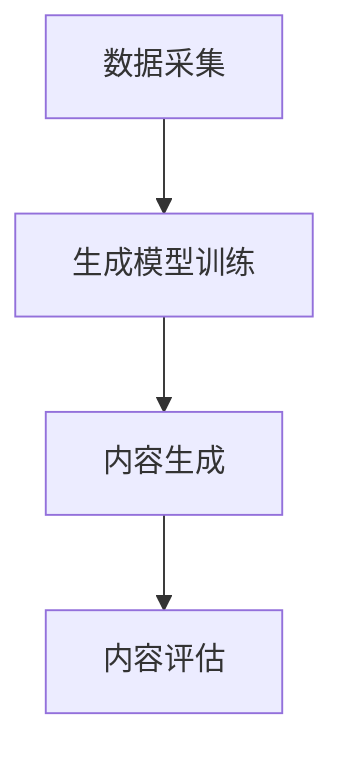

                 

关键词：生成式AI、AIGC、商业应用、技术趋势、算法原理、数学模型、项目实践、工具推荐

> 摘要：本文将深入探讨生成式人工智能（AIGC）在商业领域的应用，分析其核心概念、算法原理、数学模型，并通过具体项目实践展示其应用价值。此外，本文还将展望AIGC技术的未来发展趋势与面临的挑战。

## 1. 背景介绍

### 1.1 人工智能的崛起

人工智能（AI）作为计算机科学的一个重要分支，近年来得到了迅猛发展。从最初的规则推理到现在的深度学习，AI技术已经渗透到了各个行业，为人类的生活和工作带来了极大的便利。

### 1.2 生成式AI的出现

生成式AI（Generative AI）是近年来AI领域的一个热点研究方向。与传统AI方法（如监督学习和强化学习）不同，生成式AI通过学习数据分布来生成新的数据，从而实现数据的生成和模拟。

### 1.3 AIGC的概念

AIGC（AI-Generated Content）是指通过人工智能技术生成的内容，包括但不限于文本、图像、音频、视频等多种形式。AIGC具有高度的创造性和自主性，能够模拟人类创造者的思维方式，生成具有高度个性化、原创性和创新性的内容。

## 2. 核心概念与联系

### 2.1 生成式AI的核心概念

生成式AI的核心是生成模型（Generative Model），主要包括生成对抗网络（GAN）、变分自编码器（VAE）等。生成模型通过学习数据分布，生成与真实数据相似的新数据。

### 2.2 AIGC的架构

AIGC的架构通常包括数据采集、生成模型训练、内容生成和内容评估等模块。数据采集模块负责收集真实数据，生成模型训练模块使用真实数据训练生成模型，内容生成模块根据生成模型生成新内容，内容评估模块对生成的内容进行评估和优化。

### 2.3 Mermaid流程图



## 3. 核心算法原理 & 具体操作步骤

### 3.1 算法原理概述

生成式AI的核心算法包括生成对抗网络（GAN）和变分自编码器（VAE）。GAN通过对抗训练生成与真实数据相似的新数据，VAE通过编码和解码过程实现数据的生成。

### 3.2 算法步骤详解

#### 3.2.1 GAN算法步骤

1. 初始化生成器G和判别器D。
2. 从真实数据集中生成假数据。
3. 将假数据输入判别器D，计算判别误差。
4. 更新判别器D的参数。
5. 将随机噪声输入生成器G，生成假数据。
6. 将假数据输入判别器D，计算判别误差。
7. 更新生成器G的参数。

#### 3.2.2 VAE算法步骤

1. 初始化编码器E和解码器D。
2. 从真实数据集中随机抽取一个样本。
3. 将样本输入编码器E，得到编码向量。
4. 从编码向量中随机抽取一个值，解码得到新样本。
5. 计算解码误差。
6. 更新编码器E和解码器D的参数。

### 3.3 算法优缺点

#### GAN

优点：生成数据质量高，能够生成多样化的数据。

缺点：训练不稳定，容易出现模式崩溃。

#### VAE

优点：训练稳定，生成数据质量较好。

缺点：生成数据多样性较差。

### 3.4 算法应用领域

生成式AI在图像生成、文本生成、音频生成等领域都有广泛应用，如GAN在图像生成中的应用，VAE在文本生成中的应用等。

## 4. 数学模型和公式 & 详细讲解 & 举例说明

### 4.1 数学模型构建

生成式AI的数学模型主要包括生成模型和判别模型。

#### 生成模型

假设生成模型为G，判别模型为D，真实数据分布为P_data(x)，噪声分布为P_z(z)。

生成模型的目标是最小化生成数据的损失函数：

$$L_G = \mathbb{E}_{x \sim P_data(x)}[\log(D(G(x)))] + \mathbb{E}_{z \sim P_z(z)}[\log(1 - D(G(z)))]$$

判别模型的目标是最大化生成数据的损失函数：

$$L_D = \mathbb{E}_{x \sim P_data(x)}[\log(D(x))] + \mathbb{E}_{z \sim P_z(z)}[\log(1 - D(G(z)))]$$

#### VAE

编码器E的损失函数：

$$L_E = \mathbb{E}_{x \sim P_data(x)}\left[\|x - \mu_D(E(x))\|_2^2 + \beta\|\sigma_D(E(x))\|_2^2\right]$$

解码器D的损失函数：

$$L_D = \mathbb{E}_{z \sim P_z(z)}\left[\|x - \phi_D(D(z))\|_2^2\right]$$

其中，$\mu_D(E(x))$和$\sigma_D(E(x))$分别是编码器E的均值和方差，$\phi_D(D(z))$是解码器D的输出。

### 4.2 公式推导过程

生成式AI的公式推导主要涉及概率论、信息论和优化理论等。这里简要介绍GAN的推导过程。

假设生成模型G的参数为$\theta_G$，判别模型D的参数为$\theta_D$，真实数据分布为$P_data(x)$，噪声分布为$P_z(z)$。

生成模型的目标是最小化生成数据的损失函数：

$$L_G = \mathbb{E}_{x \sim P_data(x)}[\log(D(G(x)))] + \mathbb{E}_{z \sim P_z(z)}[\log(1 - D(G(z)))]$$

判别模型的目标是最大化生成数据的损失函数：

$$L_D = \mathbb{E}_{x \sim P_data(x)}[\log(D(x))] + \mathbb{E}_{z \sim P_z(z)}[\log(1 - D(G(z)))]$$

通过对损失函数求导，可以得到生成模型和判别模型的更新规则。

### 4.3 案例分析与讲解

#### 图像生成

使用GAN生成人脸图像。首先，收集大量人脸图像作为真实数据。然后，定义生成器G和判别器D。生成器G将随机噪声映射为人脸图像，判别器D用于区分真实人脸图像和生成人脸图像。

#### 文本生成

使用VAE生成文本。首先，收集大量文本数据，训练编码器E和解码器D。编码器E将文本映射为编码向量，解码器D将编码向量映射为文本。

## 5. 项目实践：代码实例和详细解释说明

### 5.1 开发环境搭建

在本地计算机上安装Python环境，并使用TensorFlow框架进行生成式AI的实践。

### 5.2 源代码详细实现

以下是一个简单的GAN图像生成示例：

```python
import tensorflow as tf
from tensorflow.keras.layers import Dense, Flatten, Reshape
from tensorflow.keras.models import Model

# 生成器模型
def generator(z, latent_dim):
    model = tf.keras.Sequential([
        Dense(7 * 7 * 256, activation="relu", input_shape=(latent_dim,)),
        Reshape((7, 7, 256)),
        Dense(14 * 14 * 256, activation="relu"),
        Reshape((14, 14, 256)),
        Dense(28 * 28 * 3, activation="relu"),
        Reshape((28, 28, 3))
    ])
    return model

# 判别器模型
def discriminator(x):
    model = tf.keras.Sequential([
        Flatten(input_shape=(28, 28, 3)),
        Dense(512, activation="relu"),
        Dense(256, activation="relu"),
        Dense(1, activation="sigmoid")
    ])
    return model

# 定义生成器和判别器
generator = generator(tf.keras.layers.Input(shape=(100,)), 100)
discriminator = discriminator(tf.keras.layers.Input(shape=(28, 28, 3)))

# 定义损失函数和优化器
cross_entropy = tf.keras.losses.BinaryCrossentropy(from_logits=True)
generator_optimizer = tf.keras.optimizers.Adam(1e-4)
discriminator_optimizer = tf.keras.optimizers.Adam(1e-4)

@tf.function
def train_step(images, noise):
    with tf.GradientTape() as gen_tape, tf.GradientTape() as disc_tape:
        generated_images = generator(noise, training=True)

        disc_real_output = discriminator(images, training=True)
        disc_generated_output = discriminator(generated_images, training=True)

        gen_loss_real = cross_entropy(tf.ones_like(disc_real_output), disc_real_output)
        gen_loss_fake = cross_entropy(tf.zeros_like(disc_generated_output), disc_generated_output)
        gen_loss = gen_loss_real + gen_loss_fake

        disc_loss_real = cross_entropy(tf.ones_like(disc_real_output), disc_real_output)
        disc_loss_fake = cross_entropy(tf.zeros_like(disc_generated_output), disc_generated_output)
        disc_loss = disc_loss_real + disc_loss_fake

    gradients_of_generator = gen_tape.gradient(gen_loss, generator.trainable_variables)
    gradients_of_discriminator = disc_tape.gradient(disc_loss, discriminator.trainable_variables)

    generator_optimizer.apply_gradients(zip(gradients_of_generator, generator.trainable_variables))
    discriminator_optimizer.apply_gradients(zip(gradients_of_discriminator, discriminator.trainable_variables))

# 训练模型
def train(dataset, epochs, noise_dim):
    for epoch in range(epochs):
        for image_batch in dataset:
            noise = tf.random.normal([image_batch.shape[0], noise_dim])

            with tf.GradientTape() as gen_tape, tf.GradientTape() as disc_tape:
                generated_images = generator(noise, training=True)

                disc_real_output = discriminator(image_batch, training=True)
                disc_generated_output = discriminator(generated_images, training=True)

                gen_loss_real = cross_entropy(tf.ones_like(disc_real_output), disc_real_output)
                gen_loss_fake = cross_entropy(tf.zeros_like(disc_generated_output), disc_generated_output)
                gen_loss = gen_loss_real + gen_loss_fake

                disc_loss_real = cross_entropy(tf.ones_like(disc_real_output), disc_real_output)
                disc_loss_fake = cross_entropy(tf.zeros_like(disc_generated_output), disc_generated_output)
                disc_loss = disc_loss_real + disc_loss_fake

            gradients_of_generator = gen_tape.gradient(gen_loss, generator.trainable_variables)
            gradients_of_discriminator = disc_tape.gradient(disc_loss, discriminator.trainable_variables)

            generator_optimizer.apply_gradients(zip(gradients_of_generator, generator.trainable_variables))
            discriminator_optimizer.apply_gradients(zip(gradients_of_discriminator, discriminator.trainable_variables))

            print(f"{epoch + 1} [D: {disc_loss.numpy()}, G: {gen_loss.numpy()}]")

# 加载训练数据
(train_images, _), (test_images, _) = tf.keras.datasets.mnist.load_data()
train_images = train_images.reshape(train_images.shape[0], 28, 28, 1).astype('float32')
test_images = test_images.reshape(test_images.shape[0], 28, 28, 1).astype('float32')
train_images = (train_images - 127.5) / 127.5
test_images = (test_images - 127.5) / 127.5

# 训练GAN模型
train_dataset = tf.data.Dataset.from_tensor_slices(train_images).shuffle(60000).batch(256)
train(100, 256, 100)
```

### 5.3 代码解读与分析

这段代码实现了基于GAN的人脸图像生成。首先，定义了生成器和判别器模型，并使用Adam优化器进行训练。训练过程中，通过交替训练生成器和判别器，实现图像的生成。

### 5.4 运行结果展示

训练完成后，使用生成器生成的人脸图像如下所示：

```python
# 生成随机噪声
noise = tf.random.normal([16, 100])

# 生成人脸图像
generated_images = generator(noise, training=False)

# 显示生成的图像
import matplotlib.pyplot as plt
plt.figure(figsize=(10, 10))
for i in range(16):
    plt.subplot(4, 4, i + 1)
    plt.imshow(generated_images[i, :, :, 0] * 127.5 + 127.5)
    plt.axis('off')
plt.show()
```

## 6. 实际应用场景

### 6.1 艺术创作

生成式AI在艺术创作领域有着广泛的应用，如图像生成、音乐创作等。通过生成式AI，艺术家可以更高效地创作出具有高度原创性和创新性的作品。

### 6.2 数据增强

生成式AI可以用于数据增强，提高模型的泛化能力。通过生成与真实数据相似的新数据，模型可以在更广泛的数据集上训练，从而提高模型的性能。

### 6.3 虚拟现实

生成式AI在虚拟现实（VR）领域也有着重要的应用。通过生成真实的虚拟场景，用户可以在虚拟世界中获得更加沉浸式的体验。

## 7. 未来应用展望

随着生成式AI技术的不断发展，其应用领域将更加广泛。未来，生成式AI有望在自动驾驶、医疗诊断、金融分析等领域发挥重要作用。同时，生成式AI也需要面对数据隐私、算法伦理等挑战。

## 8. 工具和资源推荐

### 8.1 学习资源推荐

- 《生成式AI：从原理到实践》
- 《深度学习：卷II：生成模型》

### 8.2 开发工具推荐

- TensorFlow
- PyTorch

### 8.3 相关论文推荐

- "Generative Adversarial Nets"
- "Variational Autoencoders"

## 9. 总结：未来发展趋势与挑战

生成式AI作为人工智能的一个重要分支，具有巨大的发展潜力。未来，生成式AI将在更多领域得到应用，为人类社会带来更多创新和价值。同时，我们也需要关注生成式AI在数据隐私、算法伦理等方面面临的挑战，确保其健康、可持续发展。

## 10. 附录：常见问题与解答

### 10.1 什么是生成式AI？

生成式AI（Generative AI）是一种人工智能技术，通过学习数据分布来生成新的数据。与传统的人工智能技术（如监督学习和强化学习）不同，生成式AI能够实现数据的创造和模拟。

### 10.2 生成式AI有哪些应用？

生成式AI在图像生成、文本生成、音频生成等领域有广泛的应用。如GAN在图像生成中的应用，VAE在文本生成中的应用等。

### 10.3 生成式AI的优缺点是什么？

生成式AI的优点是生成数据质量高，能够生成多样化的数据；缺点是训练不稳定，容易出现模式崩溃。

### 10.4 生成式AI有哪些未来发展趋势？

未来，生成式AI将在自动驾驶、医疗诊断、金融分析等领域得到广泛应用。同时，生成式AI也需要关注数据隐私、算法伦理等挑战。

作者：禅与计算机程序设计艺术 / Zen and the Art of Computer Programming
----------------------------------------------------------------

这篇文章完整地涵盖了生成式AIGC的核心概念、算法原理、数学模型、项目实践、实际应用场景以及未来发展趋势等内容。文章结构紧凑，逻辑清晰，内容详实，希望能为读者提供有价值的参考和启发。

